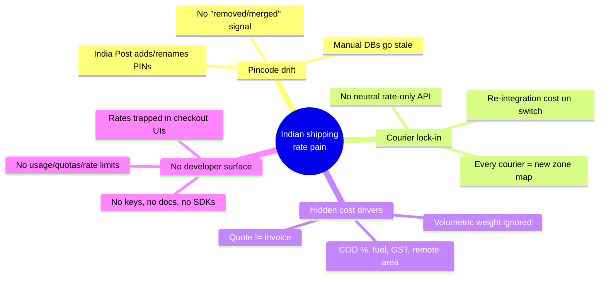
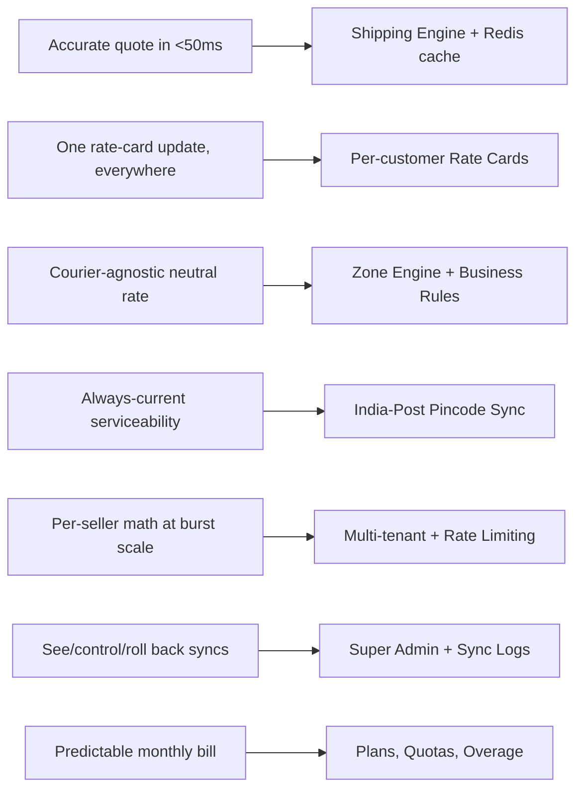
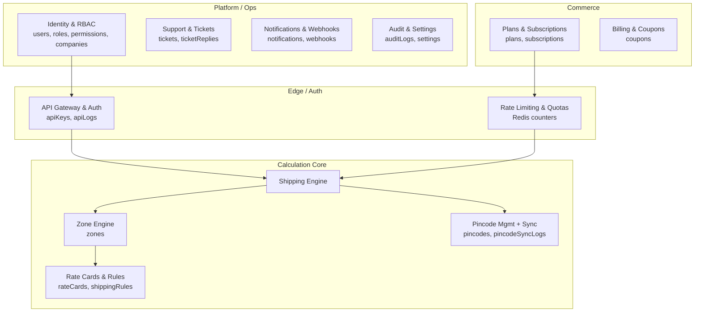
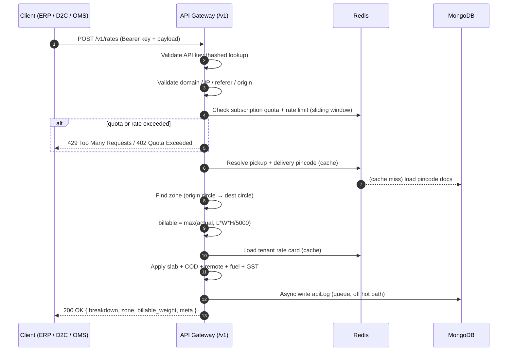

# Postpin — Product Overview & Vision

Postpin is a **Shipping Charges API Platform** for India: a versioned REST API plus a four-surface dashboard that returns accurate, courier-agnostic shipping rates from a single call (`pickup pincode + delivery pincode + weight + dimensions + payment type → INR charge`). It replaces the spreadsheets, hard-coded zone tables and courier-locked calculators that Indian D2C brands, ERPs and OMS/WMS systems use today with one source of truth: a pincode database that auto-syncs nightly with India Post, per-customer rate cards, a deterministic zone engine and sub-50ms responses — packaged with the developer experience of Stripe, the dashboards of PostHog and the keys/auth UX of Clerk.

## Contents

- [1. The Problem](#1-the-problem)
- [2. What Postpin Is](#2-what-postpin-is)
- [3. Who Consumes It (Personas & JTBD)](#3-who-consumes-it-personas--jtbd)
- [4. Core Value Propositions](#4-core-value-propositions)
- [5. Capabilities Map (Module Index)](#5-capabilities-map-module-index)
- [6. The Shipping Calculation, End to End](#6-the-shipping-calculation-end-to-end)
- [7. Positioning vs Stripe / PostHog / Clerk](#7-positioning-vs-stripe--posthog--clerk)
- [8. Pricing Philosophy (Flat + Overage)](#8-pricing-philosophy-flat--overage)
- [9. Success Metrics & North Star](#9-success-metrics--north-star)
- [10. Glossary of Domain Terms](#10-glossary-of-domain-terms)
- [11. Non-Goals & Out of Scope](#11-non-goals--out-of-scope)

---

## 1. The Problem

Indian shipping-rate calculation is **fragmented, manual and courier-locked**. A brand that ships from Jaipur (302001) to a customer in Guwahati (781001) has no neutral way to know what that parcel will cost before it picks a courier. Today the answer is buried in one of four bad places:

| Where rates live today | Why it fails |
|---|---|
| **Per-courier portals** (Delhivery, Blue Dart, DTDC, Xpressbees, India Post) | Each courier has its own zone map, slab table, COD %, fuel surcharge and remote-area list. None agree on what "Zone C" means. Switching couriers means re-implementing everything. |
| **Aggregator dashboards** (Shiprocket, iThink, NimbusPost) | Rates are correct *only inside that aggregator's checkout*. There is no clean rate-only API for your own ERP/OMS, and you are locked into their fulfilment. |
| **Hand-maintained spreadsheets / hard-coded zone tables** | Go stale the moment India Post adds a pincode or a courier serviceability changes. A single wrong zone silently leaks margin on every order. |
| **Naïve in-house calculators** | Almost always ignore **volumetric (dimensional) weight**, COD surcharge, GST, and remote-area pin codes — so the quoted price diverges from the invoiced price, eroding contribution margin per order. |

The four structural pains:



**Concrete failure example.** A 0.4 kg apparel parcel in a 30×25×8 cm box has a *volumetric* weight of `30×25×8 / 5000 = 1.2 kg`. A naïve calculator bills 0.4 kg; the courier bills `max(0.4, 1.2) = 1.2 kg`. On a ₹38/500g slab that is a **₹60 vs ₹98** difference — a ~38% understatement, repeated on every dimensional-light parcel. At 5,000 such orders/month that is ₹1.9L of silently leaked margin.

Postpin exists to make the *quoted* price equal the *invoiced* price, deterministically, for any origin–destination–parcel in India, behind one API key.

---

## 2. What Postpin Is

Postpin is **logistics infrastructure**, not a calculator widget and not a generic API marketplace. It is:

1. **A REST API** — versioned at `/v1`, JWT/API-key authenticated, that takes a shipment description and returns a fully itemised charge breakdown in INR (`en-IN`).
2. **A self-synchronising pincode source of truth** — a `pincodes` collection that reconciles nightly (00:30 IST cron) against India Post public sources (`api.postalpincode.in` and the All-India Pincode Directory on `data.gov.in`), recording every insert/update/removal in `pincodeSyncLogs`. This is the most important module; see [Pincode Management](03-pincode-management.md).
3. **A four-surface product**, each a separate Next.js (App Router, TypeScript) app:

| Surface | Audience | Purpose |
|---|---|---|
| **Marketing website** | Prospects, buyers | Positioning, pricing, sign-up funnel |
| **User Dashboard** | Customers (developers, ops) | API keys, usage analytics, rate cards, billing, tickets |
| **Super Admin portal** | Postpin staff | Tenant/plan/quota/coupon/ticket management, **pincode sync control**, system settings |
| **API Documentation portal** | Integrators | Interactive `/v1` reference, SDK snippets, sandbox keys |

The canonical request that defines the product:

```jsonc
// POST /v1/rates  — Authorization: Bearer pk_live_…
{
  "pickup_pincode":   "302001",   // Jaipur, Rajasthan
  "delivery_pincode": "781001",   // Guwahati, Assam
  "weight_kg":        0.4,        // actual weight
  "dimensions_cm":    { "length": 30, "width": 25, "height": 8 },
  "payment_type":     "COD",      // COD | PREPAID
  "cod_amount":       1499,       // required when payment_type = COD
  "service_level":    "surface",  // surface | express | same_day
  "include_gst":      true        // apply 18% GST on the freight
}
```

```jsonc
// 200 OK — fully itemised, deterministic, INR
{
  "currency": "INR",
  "zone": "F",                    // metro→north-east special zone
  "billable_weight_kg": 1.2,      // max(actual 0.4, volumetric 1.2)
  "volumetric_weight_kg": 1.2,    // 30*25*8 / 5000
  "rate_card_id": "rc_8h2k…",
  "breakdown": {
    "freight":          120.00,   // base + (per-slab × billable weight)
    "cod_charge":        37.48,    // max(flat 30, 2.5% of cod_amount)
    "remote_surcharge":  35.00,    // delivery PIN flagged remote
    "fuel_surcharge":    23.10,    // 12% of freight
    "subtotal":         215.58,
    "gst":               38.80,    // 18%
    "total":            254.38
  },
  "meta": { "engine_ms": 11, "cached": false, "request_id": "req_…" }
}
```

The full algorithm, slab resolution, edge cases and failure handling live in [Shipping Engine](04-shipping-engine.md).

---

## 3. Who Consumes It (Personas & JTBD)

Postpin is sold to **builders and operators**, not end-shoppers. Five primary personas, each with a clear job-to-be-done (JTBD).

### 3.1 Persona table

| Persona | Segment | What they integrate | Job-to-be-done |
|---|---|---|---|
| **Dev Dana** — Backend / full-stack engineer | D2C brand, agency | `/v1/rates` at cart & checkout; `/v1/pincodes/{pin}` for serviceability | "When a shopper enters a delivery PIN, **I want an accurate shipping cost in <50 ms** so I can show the right price without guessing or eating margin." |
| **Ops Omar** — Logistics / fulfilment lead | D2C / eCommerce | Rate cards in the dashboard; bulk rate previews; CSV exports | "When I negotiate new courier slabs, **I want to update one rate card** so every downstream system quotes the new price the same hour." |
| **ERP Esha** — Solution architect / integrator | ERP / OMS / WMS vendor | `/v1/rates` inside sales-order & shipment modules; webhooks | "When my ERP creates a shipment, **I want a neutral, courier-agnostic rate** so my product works for every customer regardless of their courier mix." |
| **Marketplace Maya** — Platform / marketplace eng. | Multi-seller marketplace | High-volume `/v1/rates`, per-seller rate cards via sub-tenants | "When 10,000 sellers list products, **I want per-seller shipping math at burst scale** without standing up logistics infra myself." |
| **Admin Arjun** — Postpin platform operator | Internal | Super Admin portal | "When India Post changes pincodes or a tenant abuses quota, **I want to see, control and roll back** every sync and enforce limits from one console." |

### 3.2 JTBD → capability mapping



---

## 4. Core Value Propositions

| # | Value prop | What it means concretely | Proof / mechanism |
|---|---|---|---|
| 1 | **Accuracy** | Quote equals invoice. Volumetric weight, COD, fuel, remote-area and GST all modelled. | `billable = max(actual, L·W·H/5000)`; itemised breakdown returned on every call. See [Shipping Engine](04-shipping-engine.md). |
| 2 | **India-Post-synced pincodes** | The PIN database is never stale; new/renamed/removed PINs reconcile automatically. | Nightly 00:30 IST cron → `api.postalpincode.in` / `data.gov.in` → insert/update/mark-removed → `pincodeSyncLogs`. See [Pincode Management](03-pincode-management.md). |
| 3 | **Per-customer rate cards** | Each tenant gets their *own* negotiated slabs, not a generic table. | `rateCards` scoped by `companyId`; multiple cards (per courier/service) with a default. See [Rate Cards & Pricing Rules](05-rate-cards-and-rules.md). |
| 4 | **Deterministic zone engine** | Origin→destination resolves to a stable zone (Intra-city, Intra-state, Metro, Rest-of-India, North-East/Special) — same input, same zone, always. | `zones` collection + circle/region mapping; pure function, cache-safe. See [Zone Engine](04-shipping-engine.md#zone-resolution). |
| 4 | **Sub-50ms responses** | p95 latency budget under 50 ms for cached pincode+zone lookups. | Redis cache for pincode, zone and rate-card reads; deterministic CPU-only math; no external call on the hot path. |
| 5 | **Predictable pricing** | Customers pay a flat monthly plan + transparent per-call overage — no surprise bills. | See [§8 Pricing Philosophy](#8-pricing-philosophy-flat--overage) and [Billing & Subscriptions](06-billing-and-subscriptions.md). |
| 6 | **Developer experience** | Keys in 60 seconds, copy-paste snippets, sandbox mode, clear errors, idempotency. | See [API Documentation Portal](10-api-docs-portal.md) and [DX & Conventions](09-api-reference.md). |

**Latency budget (the sub-50ms promise, decomposed):**

| Stage | Target (p95) | Backed by |
|---|---|---|
| Auth + key validation | ≤ 3 ms | Hashed key lookup, Redis-cached key→tenant |
| Domain/quota/rate-limit checks | ≤ 4 ms | Redis counters (sliding window) |
| Pincode resolve (×2) | ≤ 6 ms | Redis cache, Mongo indexed on `pincode` |
| Zone resolve | ≤ 2 ms | In-memory/Redis zone map |
| Rate-card + surcharge math | ≤ 5 ms | Pure CPU, no I/O |
| Serialise + respond | ≤ 5 ms | — |
| **Total hot-path** | **≤ 50 ms** | Cold path (cache miss) budget ≤ 120 ms |

---

## 5. Capabilities Map (Module Index)

Every platform module, what it owns, its primary MongoDB collections, and its blueprint doc.



| Module | Owns | Primary collections | Doc |
|---|---|---|---|
| **Executive Overview** *(this doc)* | Vision, personas, positioning, glossary | — | `00-overview.md` |
| **System Architecture** | Topology, services, data flow, deploys | — | [01-architecture.md](01-architecture.md) |
| **Identity, RBAC & Multi-tenancy** | Auth, roles, permissions, tenant scoping | `users`, `roles`, `permissions`, `companies` | [02-identity-and-rbac.md](02-identity-and-rbac.md) |
| **Pincode Management & India-Post Sync** | PIN DB, nightly cron, sync logs, import/export/rollback | `pincodes`, `pincodeSyncLogs` | [03-pincode-management.md](03-pincode-management.md) |
| **Shipping Engine & Zone Engine** | Billable weight, zone resolution, charge pipeline | `zones` | [04-shipping-engine.md](04-shipping-engine.md) |
| **Rate Cards & Business Rules** | Per-tenant slabs, COD/fuel/remote/GST rules | `rateCards`, `shippingRules` | [05-rate-cards-and-rules.md](05-rate-cards-and-rules.md) |
| **Billing & Subscriptions** | Plans, quotas, overage, invoices, coupons | `plans`, `subscriptions`, `coupons` | [06-billing-and-subscriptions.md](06-billing-and-subscriptions.md) |
| **API Keys, Rate Limiting & Quotas** | Key lifecycle, domain/IP restriction, Redis limits | `apiKeys`, `apiLogs` | [07-api-keys-and-rate-limiting.md](07-api-keys-and-rate-limiting.md) |
| **Support, Tickets & Notifications** | Ticket lifecycle, replies, email/webhook fan-out | `tickets`, `ticketReplies`, `notifications`, `webhooks` | [08-support-and-notifications.md](08-support-and-notifications.md) |
| **API Reference & Conventions** | `/v1` endpoints, errors, idempotency, pagination | — | [09-api-reference.md](09-api-reference.md) |
| **API Documentation Portal** | Interactive docs, SDKs, sandbox | — | [10-api-docs-portal.md](10-api-docs-portal.md) |
| **Dashboards (User & Super Admin)** | Four front-end surfaces, design system | — | [11-dashboards.md](11-dashboards.md) |
| **Observability, Audit & Settings** | Logs, metrics, audit trail, global config | `auditLogs`, `settings` | [12-observability-and-audit.md](12-observability-and-audit.md) |

> Sibling docs are numbered for build order (auth → pincodes → engine → commerce → surfaces). Cross-link by relative filename, e.g. see [Shipping Engine](04-shipping-engine.md).

---

## 6. The Shipping Calculation, End to End

This is the canonical request lifecycle every integrator and reviewer should internalise. The full pipeline (with validation rules, cache keys and failure handling) is detailed in [Shipping Engine](04-shipping-engine.md); here is the executive view.



**Pipeline stages (canonical order):**

1. Validate API key →
2. Validate domain / IP / referer / origin →
3. Validate subscription / quota →
4. Rate limit (Redis sliding window) →
5. Resolve pickup pincode →
6. Resolve delivery pincode →
7. Find zone →
8. Compute **billable (chargeable) weight** = `max(actual_kg, volumetric_kg)`, where `volumetric_kg = L·W·H / 5000` →
9. Apply user **rate-card** slabs →
10. Apply **COD** charge →
11. Apply **remote-area** surcharge →
12. Apply **fuel** surcharge →
13. Apply **GST** (optional, 18%) →
14. Return itemised JSON.

**Edge cases handled (preview — see [Shipping Engine](04-shipping-engine.md) for full handling):**

| Case | Behaviour |
|---|---|
| Unknown / 6-digit-invalid pincode | `422 invalid_pincode` with field path; never 500 |
| Pincode exists but marked `removed` by sync | `409 pincode_removed`, suggests nearest active PIN if available |
| Same pickup & delivery PIN | Zone = `intra_city`; valid, lowest slab |
| `payment_type=COD` without `cod_amount` | `422 cod_amount_required` |
| Dimensions missing | Fall back to actual weight only; flag `volumetric_skipped: true` |
| No rate card on tenant | Use platform default card; flag `default_card: true` |
| Cache miss on both PINs | Cold path, still ≤120ms; result cached for next call |

---

## 7. Positioning vs Stripe / PostHog / Clerk

Postpin is to **shipping rates** what these three are to their domains: trusted, developer-first infrastructure. We borrow their best ideas deliberately.

| Borrowed from | What we take | How it shows up in Postpin |
|---|---|---|
| **Stripe** | Pristine **DX**: idempotency keys, versioned API (`/v1`), copy-paste snippets in N languages, `test` vs `live` keys, predictable error objects, dashboard ↔ API parity | `/v1/rates` with `Idempotency-Key`; `pk_test_…` / `pk_live_…` keys; structured error envelope; sandbox mode in [docs portal](10-api-docs-portal.md) |
| **PostHog** | **Dashboards & self-serve analytics**: usage charts, drill-downs, "see your data immediately", open product feel | User Dashboard usage analytics (calls/day, top zones, latency, error rate) via Recharts; Super Admin system metrics. See [Dashboards](11-dashboards.md) |
| **Clerk** | **Keys & auth UX**: a first-class "API Keys" tab, reveal-once secrets, per-key domain/IP restriction, frictionless onboarding | API Keys management with reveal-once, masked listing, domain allow-list, one-click regenerate/revoke. See [API Keys & Rate Limiting](07-api-keys-and-rate-limiting.md) |

**What we do *not* copy:** we are not a payments processor (Stripe), not a product-analytics suite (PostHog), and not an identity provider (Clerk). Postpin is a **vertical**: deep, opinionated, India-shipping-specific. Our moat is the **India-Post-synced pincode + zone + rate-card engine**, which none of them have and which is hard to replicate.

**Competitive frame (vs the logistics incumbents):**

| | Courier portals | Aggregators (Shiprocket et al.) | **Postpin** |
|---|---|---|---|
| Courier-agnostic | ❌ | ◐ (their courier set) | ✅ |
| Rate-only API (no forced fulfilment) | ❌ | ❌ | ✅ |
| Auto-synced India-Post pincodes | ❌ | ◐ | ✅ |
| Per-customer negotiated rate cards | ◐ | ◐ | ✅ |
| Developer-grade DX + docs portal | ❌ | ◐ | ✅ |
| Sub-50ms rate-only responses | n/a | ❌ | ✅ |

---

## 8. Pricing Philosophy (Flat + Overage)

**Predictability first.** Customers should be able to forecast their monthly bill from their order volume. We use a **flat monthly fee that includes a call quota, plus transparent per-call overage** above it — never a pure usage meter that produces surprise invoices, and never a tiered jump that punishes a customer for crossing a threshold by one call.

Principles:

1. **Flat base + included quota** — each plan bundles a monthly API-call allowance.
2. **Linear overage, not cliffs** — calls beyond quota bill at a published per-call rate; no sudden tier doubling.
3. **Rate limits ≠ billing** — RPM/burst protect the service (fairness + abuse), and are independent of the monthly quota.
4. **Warn before charge** — dashboard alerts at 80% and 100% of quota; overage never silent.
5. **Soft-throttle option** — tenants may choose *throttle* (block at quota) or *overage* (keep serving + bill) per plan.
6. **Annual discount + coupons** — annual prepay and promo `coupons` for trials/discounts.

Illustrative INR plan ladder (final numbers owned by [Billing & Subscriptions](06-billing-and-subscriptions.md)):

| Plan | Monthly (INR) | Included calls / mo | Overage (INR/call) | Rate limit (RPM / burst) | Rate cards | Sub-tenants |
|---|---|---|---|---|---|---|
| **Free / Sandbox** | ₹0 | 1,000 | — (hard cap) | 30 / 10 | 1 | 0 |
| **Starter** | ₹1,499 | 50,000 | ₹0.04 | 120 / 40 | 3 | 0 |
| **Growth** | ₹4,999 | 250,000 | ₹0.025 | 300 / 100 | 10 | 3 |
| **Scale** | ₹14,999 | 1,000,000 | ₹0.015 | 1,000 / 300 | 50 | 25 |
| **Enterprise** | Custom | Custom | Custom | Custom + SLA | Unlimited | Unlimited |

**Worked overage example.** A Starter tenant (50k included, ₹0.04 overage) makes 62,000 calls in a month → base ₹1,499 + overage `12,000 × ₹0.04 = ₹480` → **₹1,979**. The dashboard would have alerted at 40,000 (80%) and 50,000 (100%) calls, and shown the projected overage live.

---

## 9. Success Metrics & North Star

**North-star metric: Billable rate calls served per month at p95 < 50 ms with quote-accuracy ≥ 99.9%.**

It is the one number that simultaneously proves *adoption* (calls), *quality* (latency) and *trust* (accuracy). Growing it requires every part of the platform — sync freshness, engine correctness, DX and reliability — to work.

| Layer | Metric | Target | Why it matters |
|---|---|---|---|
| **North star** | Accurate rate calls / mo (p95 <50ms, accuracy ≥99.9%) | ↑ MoM | Adoption × quality × trust in one number |
| **Activation** | Time-to-first-successful-call | < 5 min from sign-up | DX promise (Stripe/Clerk benchmark) |
| **Accuracy** | Quote-vs-invoice match rate | ≥ 99.9% | The core product promise |
| **Latency** | `/v1/rates` p95 / p99 | < 50 ms / < 120 ms | Sub-50ms positioning |
| **Pincode freshness** | Sync success rate; max staleness | ≥ 99% nightly; < 24 h | Source-of-truth credibility |
| **Reliability** | API uptime | ≥ 99.95% | Infrastructure-grade trust |
| **Coverage** | Serviceable pincodes vs India Post total (~19,000+) | ≥ 99% | Completeness |
| **Retention** | Net revenue retention | ≥ 110% | Expansion via plan upgrades + overage |
| **Support** | Median ticket first-response | < 4 business hours | Operator trust |
| **Error budget** | 5xx rate | < 0.1% of calls | Engine robustness |

---

## 10. Glossary of Domain Terms

| Term | Definition |
|---|---|
| **Pincode (PIN)** | India Post 6-digit Postal Index Number identifying a delivery area, e.g. `302001` (Jaipur). The atomic unit of origin/destination. |
| **Circle** | India Post's top-level administrative region (e.g. *Rajasthan Circle*, *Assam Circle*). Pincodes roll up to circles; circles inform zone mapping. |
| **Zone** | A logical origin→destination band that drives the rate slab. Postpin canonical set: `intra_city`, `intra_state`, `metro`, `rest_of_india` (ROI), and `north_east_special` (NE/J&K/island/special). Deterministic for any PIN pair. |
| **Actual weight** | The physically weighed mass of the parcel, in kg. |
| **Volumetric (dimensional) weight** | `L × W × H (cm) / 5000`, in kg — the space a parcel occupies expressed as weight. The `5000` divisor is the standard Indian domestic factor. |
| **Billable (chargeable) weight** | `max(actual_weight, volumetric_weight)`. The weight the courier — and therefore Postpin — actually bills. |
| **Rate card** | A per-tenant table of weight slabs and per-zone prices (base + per-slab increment) plus surcharge rules. Each `company` may hold several (per courier/service); one is default. |
| **Slab** | A weight band in a rate card, e.g. *0–500 g*, *501 g–1 kg*, then *each additional 500 g*. The billable weight selects the slab(s). |
| **COD (Cash on Delivery)** | Payment collected at delivery. Adds a COD charge, typically `max(flat_fee, percentage × cod_amount)`. |
| **COD amount** | The order value to be collected; required when `payment_type=COD`; drives the percentage component of the COD charge. |
| **Prepaid** | Order paid before shipment; no COD charge applies. |
| **Remote area** | A pincode flagged as hard-to-serve (ODA / non-metro interior). Triggers a fixed/percentage remote-area surcharge. |
| **Fuel surcharge** | A percentage of freight reflecting fuel cost, configurable per rate card/period (e.g. 12%). |
| **GST** | Goods & Services Tax, 18% on freight; optional per request (`include_gst`) since some integrators apply tax downstream. |
| **Service level** | Speed tier: `surface` (cheapest), `express`, `same_day`. Selects different slabs/multipliers. |
| **Zone engine** | The deterministic function mapping (pickup PIN, delivery PIN) → zone. Pure, cacheable, no external I/O. |
| **Rate limit (RPM)** | Requests-Per-Minute cap protecting the service; enforced via Redis sliding window. Distinct from monthly quota. |
| **Burst** | Short-window allowance above steady RPM (token-bucket capacity) to absorb spikes without 429s. |
| **Quota** | The monthly included-call allowance of a plan; exceeding it triggers overage billing or throttle. |
| **Overage** | Per-call charge for usage above the monthly quota. |
| **Tenant / Company** | The isolation boundary for data (rate cards, keys, usage). All collections are scoped by `companyId`. |
| **API key** | Tenant-scoped secret (`pk_test_…` / `pk_live_…`) authenticating requests; supports domain/IP restriction and reveal-once issuance. |
| **Sync run** | One execution of the India-Post reconciliation (manual or nightly cron), recorded with Sync ID, timings, rows added/updated/removed, failures, duration, status. |
| **Idempotency key** | Client-supplied header making a retried write/request safe (returns the original result rather than re-processing). |

---

## 11. Non-Goals & Out of Scope

To keep Postpin focused and infrastructure-grade, the following are explicitly **out of scope** for the core product:

| Not a goal | Rationale |
|---|---|
| Booking/printing shipping labels or AWBs | Postpin returns *rates*, not fulfilment. Integrators ship via their own/courier APIs. |
| Acting as a courier aggregator or carrier | We are neutral infrastructure, not a logistics provider. |
| Payment processing / collecting COD money | We *compute* COD charges; we never touch funds. |
| Live courier serviceability handshakes on the hot path | Determinism + sub-50ms forbid per-call third-party I/O; serviceability is modelled in the pincode/zone data, refreshed offline. |
| International / cross-border rating (v1) | India-first. Cross-border is a future axis, not the launch promise. |
| Order/inventory management | Postpin is a single-purpose rating API consumed *by* OMS/WMS/ERP, not a replacement for them. |

---

*Next: read [System Architecture](01-architecture.md) for service topology, then [Pincode Management](03-pincode-management.md) for the India-Post sync engine that anchors the whole platform.*
