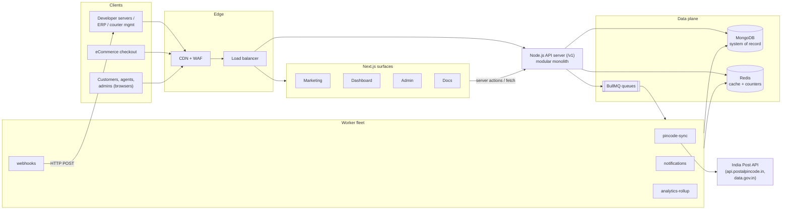
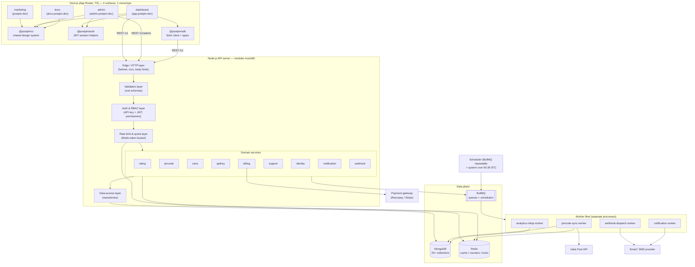
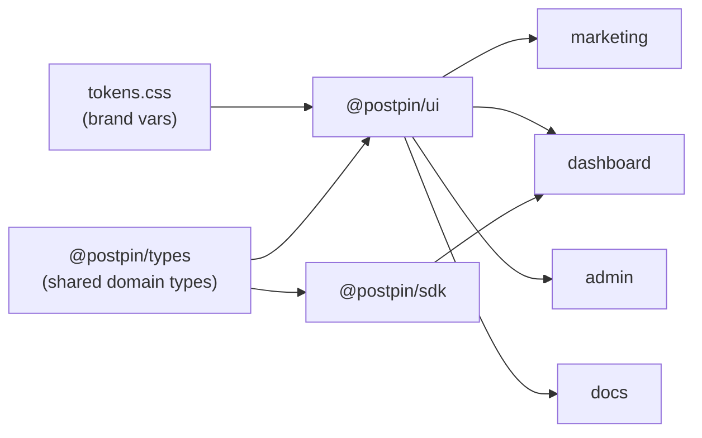
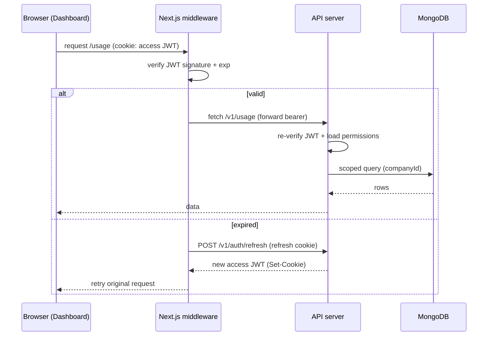
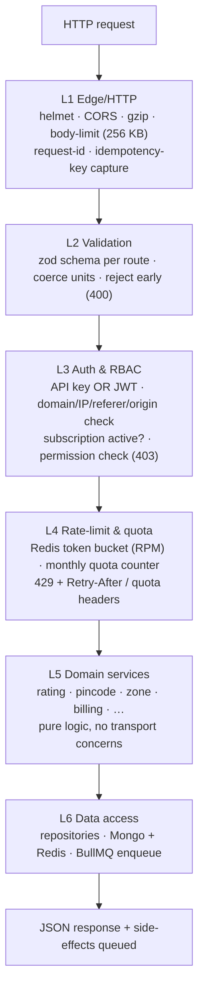
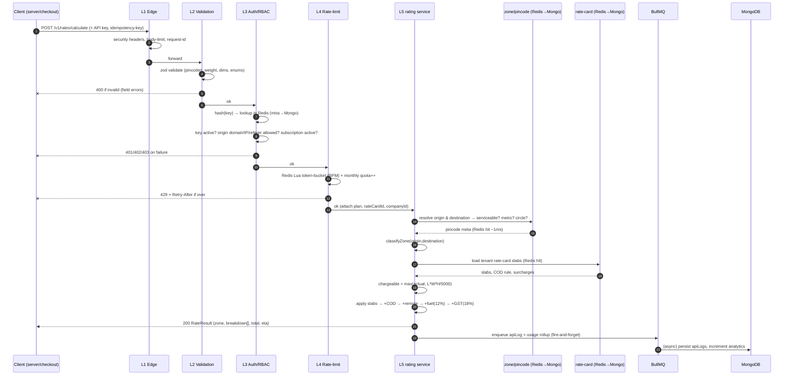
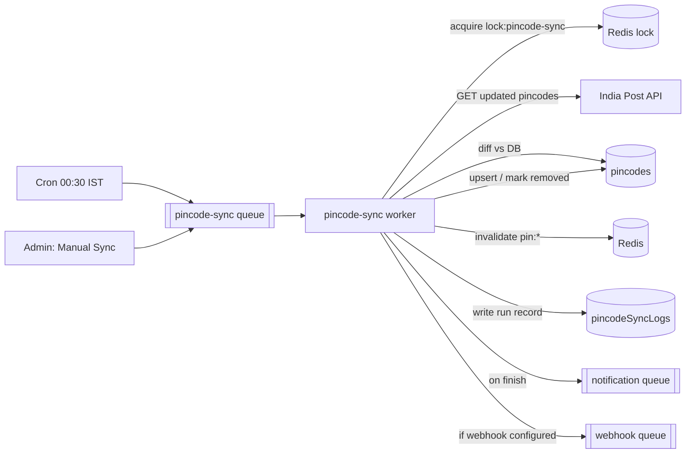
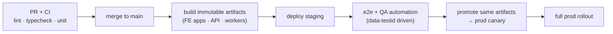
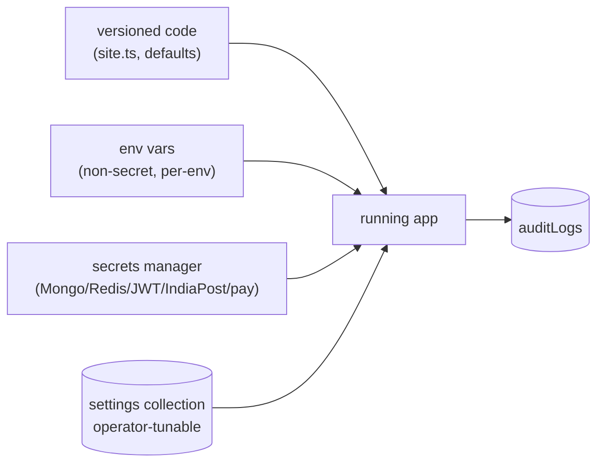

# System Architecture

Postpin is a production-grade, India-first **shipping-charges API platform** delivered as a modular monolith: four Next.js front-end surfaces (Marketing, Dashboard, Admin, Docs) sit in front of a single versioned Node.js API server (`/v1`), backed by MongoDB as the system of record, Redis for caching / rate-limit counters / hot pincode-zone lookups, and BullMQ workers driven by Cron for India-Post sync, webhooks, notifications and analytics rollups. This document is the end-to-end architectural reference: the surfaces and how they share a design system and auth, the server's layered request pipeline, the data tier, the worker fleet, service boundaries, environments, technology rationale, and a high-level config/secrets approach. It is meant to be built from directly.

## Contents

- [1. Architecture at a glance](#1-architecture-at-a-glance)
- [2. Component diagram](#2-component-diagram)
- [3. The four Next.js surfaces](#3-the-four-nextjs-surfaces)
- [4. Shared design system and auth](#4-shared-design-system-and-auth)
- [5. Node.js API server layers](#5-nodejs-api-server-layers)
- [6. Request lifecycle: a rate-calculation call](#6-request-lifecycle-a-rate-calculation-call)
- [7. Data tier: MongoDB, Redis, BullMQ, Cron](#7-data-tier-mongodb-redis-bullmq-cron)
- [8. Service boundaries: modular monolith vs microservices](#8-service-boundaries-modular-monolith-vs-microservices)
- [9. Environments (dev / staging / prod)](#9-environments-dev--staging--prod)
- [10. Technology-choice rationale](#10-technology-choice-rationale)
- [11. Configuration and secrets](#11-configuration-and-secrets)
- [12. Failure handling and resilience](#12-failure-handling-and-resilience)
- [13. Cross-references](#13-cross-references)

---

## 1. Architecture at a glance

Postpin has two fundamentally different traffic classes that share one data plane:

| Traffic class | Who | Surface / entry point | Latency budget | Auth | Volume profile |
| --- | --- | --- | --- | --- | --- |
| **Machine traffic** | Developers' servers, eCommerce checkouts, ERPs, courier-management systems | `api.postpin.dev/v1/*` | p95 < 80 ms (cache hit), p95 < 200 ms (cold) | API key (`Authorization: Bearer pk_live_…`) | High, bursty, latency-sensitive |
| **Human traffic** | Customers, support agents, super-admins | 4 Next.js surfaces | p95 < 500 ms TTFB | Session cookie (JWT) + RBAC | Lower, interactive |

The machine path is the product. Everything else exists to provision, observe, bill, and support it. The architecture therefore optimizes the rate-calculation hot path aggressively (Redis-first reads, no synchronous third-party calls, no synchronous writes) and pushes everything non-essential (logging, counters, webhooks, rollups) onto asynchronous workers.



---

## 2. Component diagram

The system is a **modular monolith API server** plus a **worker fleet** plus the **four Next.js surfaces**, all sharing MongoDB and Redis. Internal modules are isolated by clear interfaces (a service layer) so they can be peeled off into independent services later without a rewrite — see [§8](#8-service-boundaries-modular-monolith-vs-microservices).



**Reading the diagram.** Every inbound API request flows top-to-bottom through the five horizontal layers (L1–L5). Domain services never talk to each other through HTTP — they call each other in-process via typed interfaces, and they reach data only through the repository layer (L5). Side effects that the client should not wait for (writing `apiLogs`, incrementing counters, firing webhooks, queuing emails) are enqueued to BullMQ and handled by the worker fleet out of band.

---

## 3. The four Next.js surfaces

All four surfaces live in **one monorepo** (`pnpm` workspaces + Turborepo) and are deployed as **separate Next.js apps** to distinct subdomains. They share three internal packages so the brand, types, and auth stay identical everywhere.

| Surface | Domain | Rendering strategy | Auth | Primary audience | Key pages |
| --- | --- | --- | --- | --- | --- |
| **Marketing** | `postpin.dev` | Mostly static (SSG/ISR), edge-cached | None (public) | Prospects, SEO | Home, Features, Pricing, About, Contact, Legal, Status |
| **Dashboard** | `app.postpin.dev` | App Router, mostly client + RSC for data | Session JWT, customer RBAC | Customers / developers | Overview, API Keys, Usage, Rate Cards, Billing, Webhooks, Support, Settings |
| **Admin** | `admin.postpin.dev` | App Router, RSC-heavy (server-rendered tables) | Session JWT, admin RBAC | Super-admin / support / billing staff | Dashboard, Users, Plans, Pincodes & Sync, Tickets, Promotions, API Audit, Settings |
| **Docs** | `docs.postpin.dev` | SSG from MDX + OpenAPI, ISR for changelog | None (public); "try-it" uses a sandbox test key | Developers integrating | Quickstart, Endpoints, SDKs, Webhooks, Errors, Changelog |

### Why four apps, not one

- **Blast radius & deploy cadence.** Marketing and Docs change daily (content) and must never be coupled to a dashboard release. They deploy independently.
- **Bundle isolation.** The Dashboard ships Recharts, forms, and heavy client state; Marketing must stay lean for Core Web Vitals. Separate apps = separate bundles, no cross-contamination.
- **Security surface.** Admin lives on its own subdomain with its own cookie scope, stricter CSP, and (recommended) IP allow-listing — it should not share a runtime origin with customer or public traffic.
- **Independent scaling.** Marketing/Docs are static and CDN-served at near-zero cost; Dashboard/Admin run a small number of server instances.

The reference code in this repo (`src/lib/*`) is the **Dashboard/Marketing prototype** and already encodes the production contract: `site.apiBase = "https://api.postpin.dev/v1"`, the domain types in `src/lib/types.ts`, and a mock rate engine in `src/lib/shipping.ts` whose output shape (`RateResult`) is byte-for-byte what the production API returns. UI components can be pointed at the real endpoint with zero component changes.

---

## 4. Shared design system and auth

### 4.1 Design system (`@postpin/ui`)

A single internal package owns the brand so all four surfaces look like one product. It exports tokens, primitives (shadcn/Radix-based, the `new-york` style per `components.json`), composites, and chart wrappers.

| Token group | Value | Notes |
| --- | --- | --- |
| Brand gradient | `#7C3AED → #9333EA → #DB2777` | violet → purple → fuchsia, used for primary CTAs and hero accents |
| Fonts | Space Grotesk (display), Inter (body/UI), JetBrains Mono (data/code) | loaded via `next/font`, exposed as CSS vars `--font-display`, `--font-sans`, `--font-mono` |
| Radius | `0.75rem` | `--radius` base; components derive sm/md/lg/xl |
| Status | success `#16A34A`, warning `#D97706`, info `#2563EB`, destructive `#DC2626` | semantic tokens, not raw hex in components |
| Theme | Light default + dark toggle | `next-themes`, `class` strategy, persisted per surface |
| Currency | INR, `en-IN` | `Intl.NumberFormat("en-IN", { style: "currency", currency: "INR" })` (see `src/lib/format.ts`) |
| Motion | Animated Lucide icons via `motion`; respect `prefers-reduced-motion` | no static icons; all transitions gated on the media query |
| A11y | WCAG AA | contrast-checked tokens, focus-visible rings, keyboard nav |

Tokens are defined once as CSS variables in a shared `globals.css` (mirroring the prototype's `src/app/globals.css`) and consumed by Tailwind v4. Per the global testing convention, **every interactive and test-relevant element in `@postpin/ui` carries a stable `data-testid`** following the `{feature}-{element}-{type}` pattern (e.g. `apikey-create-btn`, `rate-calculator-origin-input`). Components that render dynamic lists thread a stable id (`apikey-row-{keyId}`) rather than an array index.



### 4.2 Auth model

Two completely separate auth domains share one identity store but issue different tokens.

**Browser sessions (humans).** Email/password or OAuth → API server mints a short-lived **access JWT** (~15 min) and a rotating **refresh token**. Tokens are stored in `HttpOnly`, `Secure`, `SameSite=Lax` cookies scoped per subdomain (`app.postpin.dev`, `admin.postpin.dev`). The JWT payload carries `sub` (userId), `companyId`, `role`, and a permission hash; Next.js middleware verifies it on every protected route and RSC data fetch. RBAC is enforced **server-side on the API**, never trusted from the client. Roles: customer roles (`owner`, `member`, `viewer`) and admin roles (`superadmin`, `support`, `billing`, `readonly`, per `AdminRole` in `types.ts`).

**API keys (machines).** Issued from the Dashboard, scoped to `live`/`test` environments and to allowed domains/IPs/referers/origins. Only a `pk_live_…`/`pk_test_…` prefix and a masked tail are ever shown after creation; the server stores a **hash** (Argon2id / SHA-256 with per-key salt) plus the prefix for lookup. Validation happens in the auth layer of the API pipeline ([§5](#5-nodejs-api-server-layers)).



Deep auth/security details (token rotation, key hashing, 2FA, CSP, secret storage) live in the security doc — see [Security & Auth](03-security-auth.md).

---

## 5. Node.js API server layers

The API server is a modular monolith with a strict, ordered middleware pipeline. Each request passes through five layers; cross-cutting concerns (request-id, structured logging, error normalization) wrap the whole stack.



| Layer | Responsibility | Tech | Fails with |
| --- | --- | --- | --- |
| **L1 Edge/HTTP** | TLS termination (at LB), security headers, CORS, gzip/br, body-size limit, request-id, idempotency-key capture, structured access log | Fastify/Express + `helmet` | `413` body too large, `400` malformed |
| **L2 Validation** | Per-route Zod schemas; coerce/normalize (pincode `^\d{6}$`, weight > 0, dimensions ≥ 0, enum service levels); strip unknown fields | `zod` | `400` with field-level errors |
| **L3 Auth & RBAC** | Resolve API key (hash lookup) or verify JWT; check key `status=active`; validate request origin against `allowedDomains`/IP/referer/origin; confirm subscription/quota window active; evaluate role→permission | custom + `jose` | `401` invalid key/token, `403` forbidden origin/permission, `402` subscription lapsed |
| **L4 Rate-limit & quota** | Redis token-bucket per key (`rateLimitRpm` from plan), monthly call counter vs `includedCalls`, overage flagging | Redis Lua script (atomic) | `429` + `Retry-After`, quota headers `X-RateLimit-*`, `X-Quota-*` |
| **L5 Domain services** | Business logic: rate calculation, pincode/zone resolution, billing, tickets, identity, webhooks. Pure, transport-agnostic, unit-testable | TypeScript modules | `422` unprocessable (e.g. non-serviceable pincode), `404` |
| **L6 Data access** | Repositories abstracting Mongo collections + Redis cache + BullMQ enqueue. Enforces tenant scoping (`companyId`) on every query | MongoDB driver / Mongoose, ioredis, BullMQ | `5xx` mapped to safe error envelope |

### Domain service catalogue

| Service | Owns | Reads | Writes | Emits (queue) |
| --- | --- | --- | --- | --- |
| `rating` | rate calc pipeline | rate cards, zones, pincodes (Redis-first) | — | `apiLog`, `usage-counter` |
| `pincode` | pincode master + lookup | `pincodes`, Redis hot cache | — (sync writes via worker) | — |
| `zone` | origin↔destination zone resolution | `zones`, `pincodes` | — | — |
| `apiKey` | key lifecycle | `apiKeys` | create/revoke | `notification` (key created) |
| `identity` | users, roles, companies, sessions | `users`,`roles`,`companies` | profile, invites | `notification` |
| `billing` | plans, subscriptions, invoices, coupons | `plans`,`subscriptions`,`coupons` | invoices, plan changes | `notification`, `webhook` |
| `support` | tickets + replies | `tickets`,`ticketReplies` | tickets | `notification` |
| `webhook` | endpoint registry + signing | `webhooks` | endpoints | `webhook-dispatch` |
| `notification` | in-app + email fan-out | `notifications` | notifications | `notification` |

The standard error envelope is uniform across every endpoint:

```json
{
  "error": {
    "type": "rate_limit_exceeded",
    "message": "You have exceeded 100 requests per minute on this key.",
    "code": "429",
    "request_id": "req_8Fk2mZ1qP",
    "doc_url": "https://docs.postpin.dev/errors#rate_limit_exceeded",
    "retry_after_ms": 4200
  }
}
```

---

## 6. Request lifecycle: a rate-calculation call

This is the product's hot path. A client POSTs a quote request; the server returns a fully-broken-down rate. The request body and the response mirror `sampleRequestBody()` and `RateResult` in `src/lib/shipping.ts`.

**Request**

```json
POST /v1/rates/calculate
Authorization: Bearer pk_live_3pQ…9aZ
Idempotency-Key: 7a1c0e2f-…

{
  "origin": "110001",
  "destination": "400001",
  "weight": 1200,
  "dimensions": { "length": 30, "width": 20, "height": 10, "unit": "cm" },
  "service": "express",
  "cod": true,
  "declared_value": 4999
}
```

**Sequence**



**Response**

```json
{
  "zone": "metro",
  "zone_label": "Metro",
  "service": "express",
  "service_label": "Express",
  "chargeable_weight_grams": 1200,
  "volumetric_weight_grams": 1200,
  "eta_days": [1, 3],
  "currency": "INR",
  "breakdown": [
    { "label": "Base charge",   "amount": 88.00,  "hint": "Metro · Express" },
    { "label": "Weight charge", "amount": 91.20,  "hint": "1.50 kg chargeable" },
    { "label": "Fuel surcharge","amount": 21.50,  "hint": "12%" },
    { "label": "COD handling",  "amount": 109.99, "hint": "₹35 + 1.5%" },
    { "label": "GST",           "amount": 55.91,  "hint": "18%" }
  ],
  "total": 366.60,
  "origin":      { "pincode": "110001", "city": "New Delhi", "state": "Delhi" },
  "destination": { "pincode": "400001", "city": "Mumbai",    "state": "Maharashtra" },
  "serviceable": true,
  "request_id": "req_8Fk2mZ1qP"
}
```

**Hot-path invariants:**

1. **No synchronous third-party calls.** Pincode/zone/rate-card data is always read from Mongo (seeded by the sync worker), never from India Post live. The hot path can serve quotes even if India Post is down.
2. **No synchronous writes.** `apiLogs` and usage counters are enqueued, not written inline. A Redis outage degrades to Mongo counters; a Mongo write spike never blocks a quote.
3. **Redis-first reads.** Pincode and rate-card lookups hit Redis (TTL 24 h for pincodes, invalidated on sync; 1 h for rate cards, invalidated on edit). A cache miss falls through to Mongo and back-fills Redis.
4. **Idempotency.** `Idempotency-Key` lets clients safely retry; the same key returns the same cached response for 24 h.

Full algorithm, slab math, surcharge precedence, rounding, and serviceability edge cases live in the engine doc — see [Shipping Engine](04-shipping-engine.md).

---

## 7. Data tier: MongoDB, Redis, BullMQ, Cron

### 7.1 MongoDB — system of record

All durable state lives in MongoDB. Collections (per the blueprint) and their owning service:

| Collection | Owner | Notable indexes | Tenant-scoped |
| --- | --- | --- | --- |
| `users`, `roles`, `permissions` | identity | `{email:1}` unique, `{companyId:1}` | yes |
| `companies` | identity | `{slug:1}` unique | — |
| `subscriptions`, `plans` | billing | `{companyId:1,status:1}` | yes / no |
| `apiKeys` | apiKey | `{prefix:1}` unique, `{hash:1}`, `{companyId:1}` | yes |
| `apiLogs` | rating (async) | `{companyId:1,ts:-1}`, TTL 90 d | yes |
| `rateCards`, `shippingRules` | rating | `{companyId:1,active:1}` | yes |
| `zones` | zone | `{companyId:1}`, `{originPrefix:1,destPrefix:1}` | yes |
| `pincodes` | pincode | `{pincode:1}` unique, `{prefix2:1}`, `{circle:1}` | no (global master) |
| `pincodeSyncLogs` | pincode | `{startedAt:-1}` | no |
| `tickets`, `ticketReplies` | support | `{companyId:1,status:1}`, `{assignee:1}` | yes |
| `notifications` | notification | `{userId:1,read:1}`, TTL 30 d | yes |
| `coupons` | billing | `{code:1}` unique | no |
| `auditLogs` | all | `{actor:1,ts:-1}`, TTL 365 d | mixed |
| `settings` | admin | singleton-ish by `key` | no |
| `webhooks` | webhook | `{companyId:1}` | yes |

**Tenancy:** every tenant-scoped query is forced through the repository layer which injects `companyId` — application code cannot accidentally read across tenants. **Pincodes are global**, not per-tenant; zones and rate cards are per-tenant overlays on top of the global pincode master.

### 7.2 Redis — cache, counters, locks

| Use | Key pattern | TTL / eviction | Notes |
| --- | --- | --- | --- |
| Hot pincode lookup | `pin:{pincode}` | 24 h, invalidated on sync | back-filled on miss |
| Hot rate card | `rc:{companyId}:active` | 1 h, invalidated on edit | |
| Rate-limit bucket | `rl:{keyId}` | sliding window | atomic Lua token bucket |
| Monthly quota counter | `quota:{companyId}:{yyyymm}` | 35 d | reconciled to Mongo nightly |
| Idempotency cache | `idem:{keyId}:{idemKey}` | 24 h | stores response hash |
| Sync distributed lock | `lock:pincode-sync` | 30 min | prevents overlapping runs |
| Session/refresh denylist | `revoked:{jti}` | = token TTL | logout / rotation |

Redis is treated as **rebuildable cache + ephemeral counters**, never the only home for money or quota truth; counters are reconciled to MongoDB so a Redis flush is recoverable.

### 7.3 BullMQ workers + Cron

Workers run as **separate processes** from the API (own deployment, own scaling) so a heavy sync never steals CPU from the quote path.

| Queue | Trigger | Job | Concurrency | Retry policy |
| --- | --- | --- | --- | --- |
| `pincode-sync` | Cron 00:30 IST (repeatable) + manual from Admin | India Post fetch → diff → upsert → mark removed → write `pincodeSyncLogs` | 1 (locked) | configurable retries, exp backoff |
| `webhook-dispatch` | billing/key/sync events | signed POST to customer endpoint | 20 | 5 retries, exp backoff, then dead-letter |
| `notification` | many services | email/SMS + in-app | 10 | 3 retries |
| `analytics-rollup` | Cron hourly + daily | aggregate `apiLogs` → usage charts, reconcile quota counters | 2 | 3 retries |
| `usage-counter` | every API call (fire-and-forget) | persist `apiLogs`, bump counters | high | best-effort, idempotent |



The pincode-sync run records exactly what the Admin "Pincode & Sync" page displays (mirroring `SyncRun` in `types.ts`): `id`, `startedAt`, `finishedAt`, `status`, `recordsScanned`, `recordsAdded`, `recordsUpdated`, records removed, `failed`, `durationMs`, `trigger`. Manual Sync, Import CSV, Export CSV, Rollback (restore prior snapshot), and View Logs are all Admin actions that enqueue or read from this subsystem. Full sync algorithm, diffing, and India Post specifics live in the pincode doc — see [Pincode Sync](05-pincode-sync.md).

---

## 8. Service boundaries: modular monolith vs microservices

**Recommendation: ship a modular monolith for the API, with the worker fleet as the only out-of-process split.** Do **not** start with microservices.

### Rationale

| Factor | Modular monolith (chosen) | Microservices (rejected for v1) |
| --- | --- | --- |
| Team size / stage | Small senior team, pre-scale — one deployable is faster to build, test, and reason about | Needs platform team + service mesh + distributed tracing maturity |
| Latency | In-process service calls = sub-ms; the quote hot path stays tight | Network hops between rating↔zone↔ratecard would add 3–5 RPCs to every quote |
| Transactions | Plan change + invoice + audit in one Mongo transaction | Saga/2-phase coordination across services |
| Operational cost | One API deployment + worker deployment | N services, N pipelines, N dashboards |
| Failure modes | Fewer moving parts; the worker split already isolates the riskiest workload (sync) | More partial-failure states to design for |

### How we keep it modular (so it can split later)

1. **Service interfaces.** Domain services expose typed interfaces; no module imports another module's repository or Mongo collection directly. Calls go through the public service API only.
2. **Repository boundary.** Only the data-access layer touches Mongo/Redis. Swapping a collection for a remote service later is a repository change, not a domain rewrite.
3. **Event-style side effects.** Cross-service effects already go through BullMQ queues (events), not direct calls — the seam a microservice extraction would use already exists.
4. **Independent worker processes.** The sync, webhook, notification, and rollup workers are already separate deployables — the highest-load, most-bursty work is isolated from the latency-critical API today.

### When to extract a service

Pull a module out **only** when it has a divergent scaling or isolation need, e.g.:

- **Rating/edge** if quote QPS outgrows the shared API and needs to scale independently and run closer to the edge.
- **Pincode-sync** is already a separate worker; promote it to a fully independent service if its India-Post integration grows complex or needs its own release train.

Until those signals appear, the monolith + worker split is the right boundary.

---

## 9. Environments (dev / staging / prod)

| Aspect | Dev | Staging | Production |
| --- | --- | --- | --- |
| Purpose | Local development | Pre-prod verification, QA automation, load tests | Live customer traffic |
| Frontend | `next dev` on localhost | `*.staging.postpin.dev` | `postpin.dev`, `app.`, `admin.`, `docs.` |
| API | `localhost:4000/v1` | `api.staging.postpin.dev/v1` | `api.postpin.dev/v1` |
| MongoDB | Docker container, seeded | Managed cluster (small), anonymized snapshot | Managed replica set, PITR backups |
| Redis | Docker container | Managed (single) | Managed (HA, persistence) |
| India Post | Mocked/recorded fixtures | Real API, `test` schedule | Real API, 00:30 IST |
| Payments | Gateway sandbox | Gateway sandbox | Gateway live |
| Secrets | `.env.local` (gitignored) | Secrets manager (staging scope) | Secrets manager (prod scope) |
| Data | Synthetic seed (real pincodes, fake tenants) | Anonymized prod snapshot | Real |
| Feature flags | all on | mirror prod + canary | controlled rollout |

**Promotion flow.** A commit to `main` builds immutable artifacts (Next.js apps, API image, worker image), deploys to **staging**, runs the full test + QA-automation suite (which depends on the `data-testid` locators), then promotes the **same artifacts** to production behind a canary. No rebuild between staging and prod — what QA verified is what ships.



---

## 10. Technology-choice rationale

| Concern | Choice | Why | Alternatives weighed |
| --- | --- | --- | --- |
| Front-end framework | **Next.js 15 (App Router, TS)** | RSC for fast server-rendered admin tables, file-based routing, SSG for marketing/docs, one framework across four surfaces | Remix, plain Vite SPA (lose SSG/SEO + RSC) |
| UI primitives | **shadcn/Radix + Tailwind v4** | Accessible unstyled primitives we fully own + theme to brand; matches existing `components.json` (`new-york`, lucide) | MUI/Chakra (heavier, harder to brand precisely) |
| Charts | **Recharts** | Declarative, React-native, good enough for usage/admin dashboards; already a dependency | Visx (more code), Chart.js (imperative) |
| Animation/icons | **motion + animated Lucide** | Brand requires motion on every icon; honors `prefers-reduced-motion` | Framer-only / static icons (off-brand) |
| API runtime | **Node.js + TypeScript** | Same language as front-end (shared types via `@postpin/types`), huge ecosystem, fast enough for I/O-bound rate calc | Go (faster, but splits the stack + slows hiring), Bun (less mature ops) |
| HTTP framework | **Fastify** | Lowest-overhead Node framework, schema-first (pairs with zod), great plugin model for the layered pipeline | Express (slower, callback-era), NestJS (heavy DI for a focused API) |
| Validation | **Zod** | Single source of truth for request schemas + inferred TS types; already in the FE | Joi, manual checks |
| Primary store | **MongoDB** | Flexible documents fit heterogeneous rate cards/rules/zones; per-tenant shapes vary; strong India-region managed options | Postgres (rigid for variable rate-card JSON, though great for billing — revisit if billing complexity grows) |
| Cache/counters | **Redis** | Atomic Lua rate-limit, sub-ms hot lookups, ephemeral counters, locks | Memcached (no Lua/atomics), in-proc cache (not shared across instances) |
| Queues | **BullMQ (Redis-backed)** | Mature retries/backoff/repeatable jobs/dead-letter; reuses Redis we already run | Kafka (overkill at this stage), SQS (cloud lock-in, no local dev parity) |
| Scheduling | **BullMQ repeatable + system cron** | 00:30 IST nightly sync as a repeatable job with a Redis lock; cron as the durable trigger | OS cron only (no retries/observability) |
| Auth tokens | **JWT (`jose`) + opaque refresh** | Stateless access checks at the edge + revocable refresh; API keys hashed | Sessions-in-DB only (extra read per request) |
| Monorepo | **pnpm + Turborepo** | Share `ui`/`types`/`sdk` packages, cached builds, independent app deploys | Nx (heavier), polyrepo (sync drift across surfaces) |

---

## 11. Configuration and secrets

This is the high-level approach; the deep dive (rotation, KMS, key hashing, CSP, threat model) is in [Security & Auth](03-security-auth.md).

### Layers of configuration

1. **Build-time, non-secret** — brand, nav, API base. Lives in code (`src/lib/site.ts`), versioned, safe to ship to the browser (only `NEXT_PUBLIC_*` is exposed client-side).
2. **Runtime, non-secret env** — `NODE_ENV`, region, log level, queue concurrency, feature flags. Per-environment env vars, validated at boot with a Zod env schema (fail fast if missing/invalid).
3. **Runtime secrets** — Mongo URI, Redis URL, JWT signing keys, India Post API key, payment gateway keys, email/SMS credentials, webhook signing secret. **Never in the repo.** Loaded from a secrets manager (e.g. cloud Secrets Manager / Vault) at deploy; `.env.local` only for local dev and is gitignored.
4. **Database-driven settings** — operator-tunable values that change without a deploy, stored in the `settings` collection and editable from the Super Admin: India Post endpoint, sync time, retry count, timeout, auto-sync ON/OFF, notification email, sync webhook URL, GST toggle, default surcharges. These are operational policy, not secrets.

### Rules

| Rule | Detail |
| --- | --- |
| Validate at boot | A Zod `env` schema parses `process.env` on startup; the process refuses to start on a missing/invalid secret. |
| No secrets in `NEXT_PUBLIC_*` | Anything client-exposed is non-secret by definition; secrets stay server-side only. |
| Per-environment isolation | Dev / staging / prod each have their own secret scope and their own signing keys. |
| Rotation-ready | JWT signing keys and webhook secrets support overlapping key IDs (`kid`) for zero-downtime rotation. |
| Settings vs secrets | Operator-tunable knobs live in the `settings` collection (audited via `auditLogs`); credentials live in the secrets manager. Never mix the two. |
| Auditability | Every change to `settings` writes an `auditLogs` entry (actor, before/after, timestamp). |



---

## 12. Failure handling and resilience

| Dependency | Failure | Hot-path impact | Mitigation |
| --- | --- | --- | --- |
| **India Post API** | Down / slow at 00:30 | **None** on quotes (served from Mongo master) | Worker retries with exp backoff per `settings`; partial-run records `failed`; alert via notification email/webhook; last-good data stays live |
| **Redis** | Unavailable | Cache misses fall to Mongo; rate-limit degrades | Reads fall through to Mongo + back-fill; rate-limit fails **open** with a tighter Mongo-backed cap; quota counters reconciled nightly |
| **MongoDB** | Primary failover | Brief write pause | Replica set auto-failover; quote reads tolerate eventual reads; async writes (`apiLogs`) queue and drain after recovery |
| **BullMQ worker** | Crash / backlog | None on quotes | Jobs are durable in Redis; retries + dead-letter; workers scale horizontally; sync lock prevents double-run |
| **Payment gateway** | Timeout | None on quotes | Billing is off the hot path; webhooks reconcile state; idempotent invoice creation |
| **Email/SMS** | Provider down | None on quotes | `notification` queue retries; in-app notification still delivered |
| **API server instance** | Crash | Dropped in-flight requests on that node | Stateless instances behind LB; health checks evict bad nodes; clients retry with `Idempotency-Key` |

**Cross-cutting:** every response carries a `request_id` for tracing; the standard error envelope ([§5](#5-nodejs-api-server-layers)) gives clients a typed `error.type` + `doc_url`; timeouts and circuit breakers wrap all outbound calls (India Post, payments, email) so a slow dependency never holds a worker.

---

## 13. Cross-references

| Topic | Document |
| --- | --- |
| Data models, indexes, multi-tenancy detail | [Data Model](02-data-model.md) |
| Auth, API keys, RBAC, secrets deep dive, CSP, threat model | [Security & Auth](03-security-auth.md) |
| Rate engine: zones, slabs, surcharges, rounding, edge cases | [Shipping Engine](04-shipping-engine.md) |
| India Post sync: algorithm, diffing, rollback, CSV import/export | [Pincode Sync](05-pincode-sync.md) |
| Plans, quotas, overage, coupons, invoicing | [Billing & Plans](06-billing-plans.md) |
| Public REST contract, OpenAPI, SDKs, webhooks | [API Reference](07-api-reference.md) |
