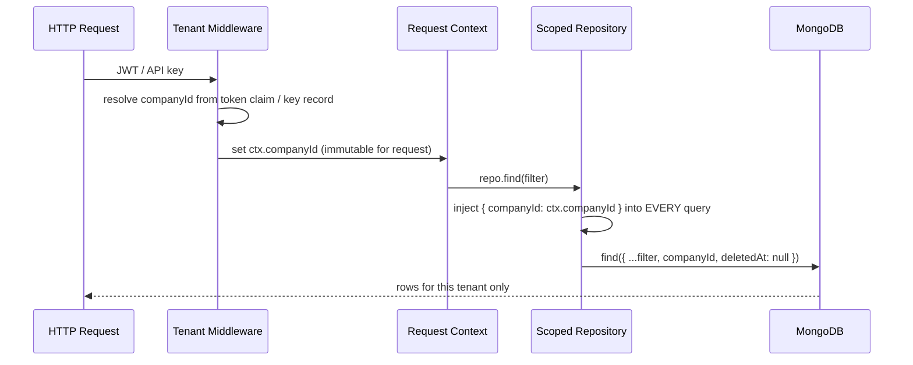
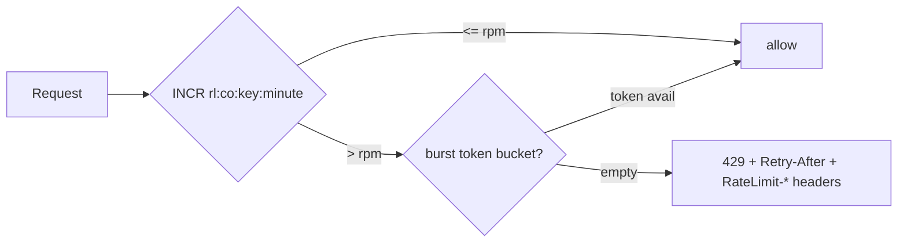
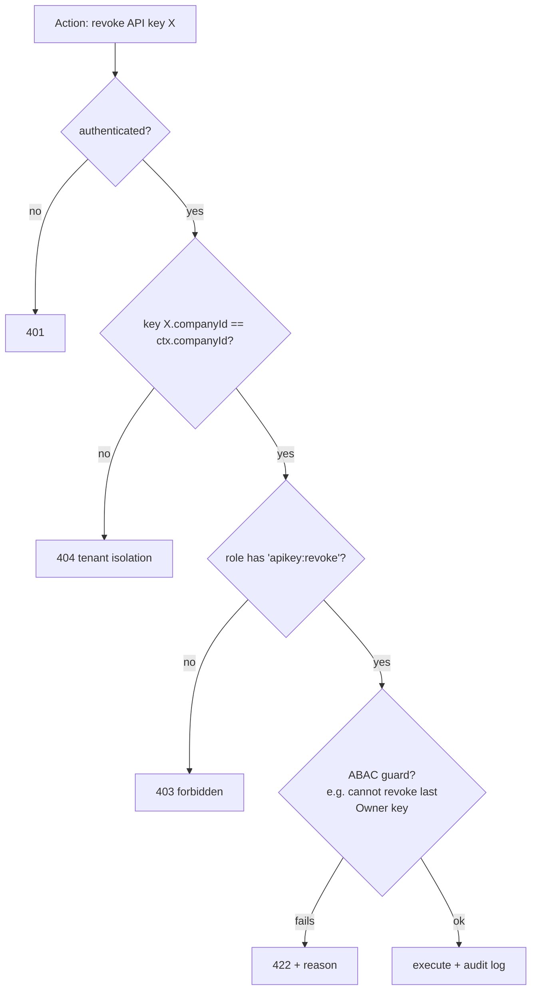
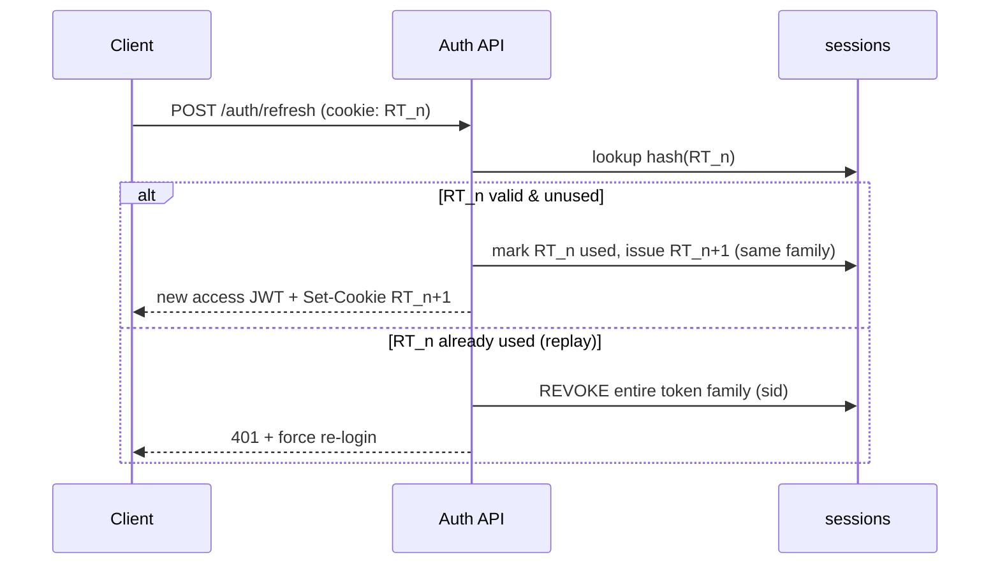

# Multi-Tenancy, RBAC & Security Model

This document is the build-from specification for how Postpin isolates tenants, authorizes actors, authenticates humans and machines, and defends the shipping-rate API surface. Postpin is logistics infrastructure: a single MongoDB cluster serves thousands of companies whose rate cards, pincode overrides and API usage must never leak across a tenant boundary, and whose API keys gate metered, billable traffic. The model here is opinionated and production-grade — every record carries a `companyId`, every privileged action maps to a permission, every secret is hashed at rest, and every request to the public `/v1` engine passes an ordered gauntlet of key, origin, quota and rate-limit checks before a single rupee of charge is computed. Treat this as the contract that the backend (`apiKeys`, `roles`, `permissions`, `companies`, `auditLogs` collections) and all four Next.js surfaces must honor.

## Contents

- [1. Tenancy Overview](#1-tenancy-overview)
- [2. Tenant Scoping of Every Record](#2-tenant-scoping-of-every-record)
- [3. Tenant Isolation Strategy](#3-tenant-isolation-strategy)
- [4. Noisy-Neighbor Protection](#4-noisy-neighbor-protection)
- [5. RBAC: Roles & Permissions](#5-rbac-roles--permissions)
- [6. Permissions Matrix](#6-permissions-matrix)
- [7. JWT Authentication & Session Model](#7-jwt-authentication--session-model)
- [8. Password Hashing & 2FA](#8-password-hashing--2fa)
- [9. API-Key Security](#9-api-key-security)
- [10. Request-Origin Security](#10-request-origin-security)
- [11. Threat Model & OWASP API Top 10](#11-threat-model--owasp-api-top-10)
- [12. Data Protection](#12-data-protection)
- [13. Compliance Posture (GDPR / DPDP Act India)](#13-compliance-posture-gdpr--dpdp-act-india)
- [14. Failure Handling & Edge Cases](#14-failure-handling--edge-cases)
- [15. Cross-References](#15-cross-references)

---

## 1. Tenancy Overview

Postpin is a **shared-everything, logically-isolated** multi-tenant SaaS. One application cluster and one MongoDB primary store serve all customers. The unit of tenancy is the **company** (the `companies` collection), referenced everywhere as `companyId`. A company owns users, API keys, rate cards, shipping rules, zones, subscriptions, invoices, tickets and webhooks. Two distinct actor classes exist:

| Actor class | Where they live | How they authenticate | What they scope to |
| --- | --- | --- | --- |
| **Customer users** | Inside a company | JWT (email + password, optional 2FA) | Their own `companyId` only |
| **Platform admins** | Postpin staff | JWT (mandatory 2FA) + IP allowlist | All tenants (read), scoped by admin role for writes |
| **API clients (machines)** | Customer's servers / sites | API key (`live`/`test`) | The `companyId` that owns the key |

```mermaid
flowchart TB
  subgraph Platform["Postpin Platform (single cluster)"]
    direction TB
    subgraph TA["Tenant: Acme Logistics (companyId A1)"]
      A_users["users"]; A_keys["apiKeys"]; A_rc["rateCards"]; A_zones["zones"]
    end
    subgraph TB2["Tenant: Bharat Retail (companyId B7)"]
      B_users["users"]; B_keys["apiKeys"]; B_rc["rateCards"]; B_zones["zones"]
    end
    SHARED["Shared reference data: pincodes, plans, India Post sync"]
  end
  Admin["Postpin Super Admin"] -. cross-tenant (RBAC-gated) .-> TA
  Admin -. .-> TB2
  Admin --> SHARED
```

**Shared vs scoped data.** Most collections are tenant-scoped. A few are global reference data that all tenants read but cannot write: `pincodes`, `plans`, `permissions` (the catalog), and platform `settings`. The `pincodes` master is global because it mirrors India Post (see [Pincode Management](03-pincode-management.md)); tenant-specific pincode behavior lives in that tenant's `zones` and `rateCards`, never in the shared `pincodes` rows.

---

## 2. Tenant Scoping of Every Record

**Rule 0 — every tenant-owned document carries an indexed `companyId`.** No exceptions for tenant collections. This is enforced at the schema, query, and index layers simultaneously so a single missed `.find()` filter cannot expose another tenant.

### 2.1 Scoped collections

| Collection | Scope field(s) | Notes |
| --- | --- | --- |
| `users` | `companyId` | A user belongs to exactly one company. |
| `roles` | `companyId` (null for platform roles) | Customer-side custom roles are tenant-scoped; platform roles have `companyId: null`. |
| `apiKeys` | `companyId`, `createdBy` | Key authorizes one tenant. |
| `apiLogs` | `companyId`, `apiKeyId` | High-volume; TTL-indexed (see §12.4). |
| `rateCards` | `companyId` | The pricing slabs a tenant configures. |
| `shippingRules` | `companyId` | COD/fuel/remote/GST toggles per tenant. |
| `zones` | `companyId` | Tenant's pincode→zone mapping. |
| `subscriptions` | `companyId` | One active subscription per company. |
| `invoices` | `companyId` | Billing history. |
| `tickets`, `ticketReplies` | `companyId` | Support threads. |
| `notifications` | `companyId`, `userId` | In-app + email targets. |
| `coupons` | `companyId` (null = platform-wide) | Promo codes scoped or global. |
| `webhooks` | `companyId` | Outbound event endpoints. |
| `auditLogs` | `companyId` (null for platform-level events) | See [Audit Logs](08-audit-logs.md). |

**Global (un-scoped) collections:** `permissions` (catalog), `plans`, `pincodes`, `pincodeSyncLogs`, platform `settings`.

### 2.2 Canonical scoped document shape

```json
{
  "_id": "65f1c0a2e4b0a1d2c3f40987",
  "companyId": "A1",
  "name": "Surface — Metro slab card",
  "createdBy": "usr_8h2k...",
  "createdAt": "2026-06-01T10:21:00.000Z",
  "updatedAt": "2026-06-20T07:05:11.000Z",
  "deletedAt": null
}
```

### 2.3 Enforcement layers (defense in depth)



1. **Context layer.** Auth middleware resolves `companyId` once, stores it on an immutable request context. Application code may never read `companyId` from the request body or query string — only from context. A `companyId` arriving in the body is ignored (and logged as a tamper signal).
2. **Repository layer.** All data access goes through a thin scoped-repository wrapper. `find`, `findOne`, `updateMany`, `deleteOne`, and aggregation `$match` stages all receive `companyId` injected automatically. Direct `db.collection(...)` calls are banned by lint rule.
3. **Index layer.** Every scoped collection has a **compound index leading with `companyId`** (e.g. `{ companyId: 1, status: 1, createdAt: -1 }`). This both enforces query-planner efficiency per tenant and makes accidental full-collection scans visible in profiling.
4. **Schema layer.** Mongoose/Zod schemas mark `companyId` `required` and immutable after insert.

### 2.4 Cross-tenant access (the only sanctioned path)

Platform admins are the only actors permitted to read across tenants, and only through a dedicated **admin repository** that requires an explicit `platform:tenant.read` (or write) permission and records the access in `auditLogs` with the impersonated `companyId`. There is no other code path that omits the `companyId` filter.

---

## 3. Tenant Isolation Strategy

Postpin uses **row-level (shared-database, shared-schema) isolation** as the default, with a documented escalation path to stronger isolation for enterprise tenants.

### 3.1 Isolation tiers

| Tier | Model | Who gets it | Trade-offs |
| --- | --- | --- | --- |
| **Standard** | Shared DB, shared collections, `companyId` row scoping | Free → Scale plans | Lowest cost, highest density; relies on app-layer discipline. |
| **Dedicated cache namespace** | Shared DB, but per-tenant Redis key prefix + separate quota counters | All plans (automatic) | Prevents cache/counter bleed; trivial cost. |
| **Enterprise isolation** | Dedicated MongoDB database (`postpin_tenant_<id>`) or dedicated cluster | Enterprise plan, on request | Strong blast-radius reduction; higher ops cost; routed by a tenant→connection map. |

For Standard tier, isolation correctness is guaranteed by the four enforcement layers in §2.3 — **not** by the database engine. This is acceptable because the repository wrapper makes the `companyId` filter non-optional in code and CI tests assert it (see §3.3).

### 3.2 Connection routing for enterprise tenants

```json
{
  "tenantRouting": {
    "default": "mongodb://primary/postpin",
    "overrides": {
      "ENT-441": "mongodb://ent-cluster-1/postpin_tenant_ENT441",
      "ENT-902": "mongodb://ent-cluster-2/postpin_tenant_ENT902"
    }
  }
}
```

A tenant-aware connection factory resolves the Mongo connection from `companyId` at the start of each request. Enterprise tenants never share a connection pool with Standard tenants.

### 3.3 Isolation test harness (mandatory in CI)

A "tenant fuzz" suite that must pass before any deploy:

- **Negative read:** Acting as tenant `A1`, attempt to fetch every fixture document owned by `B7` by `_id`. Every call must return 404, never the row.
- **Body-injection:** Send a write request whose body contains `"companyId": "B7"` while authenticated as `A1`. Assert the persisted row has `companyId: A1`.
- **Aggregation leak:** Run each reporting aggregation as `A1` and assert no `B7` `_id`s appear.
- **Index assertion:** Reflect over every scoped collection's indexes and assert a `companyId`-leading compound index exists.

### 3.4 File / blob isolation

CSV imports/exports (pincode and rate-card bulk ops) are stored under tenant-prefixed object-storage keys: `s3://postpin-files/{companyId}/rate-cards/{uuid}.csv`. Signed URLs are short-lived (5 min) and scoped to that prefix.

---

## 4. Noisy-Neighbor Protection

A single abusive or buggy tenant must not degrade others. Protection is layered across rate limiting, quotas, connection budgets and query cost controls.

### 4.1 Per-tenant rate limiting (Redis)

Rate limits are enforced **per API key** and aggregated **per company** using a sliding-window counter in Redis. Limits come from the tenant's `plan.rateLimitRpm` (see `Plan.rateLimitRpm` in the domain types).

```
Key:    rl:{companyId}:{apiKeyId}:{minuteEpoch}
Op:     INCR + EXPIRE 60s
Limit:  plan.rateLimitRpm   (e.g. Free=60, Starter=300, Growth=1200, Scale=6000)
```



- **Algorithm:** sliding-window log approximated by two adjacent fixed windows (current + previous minute, weighted) to avoid boundary bursts; a small **token bucket** (`capacity = rpm/6`, refill `rpm/60/s`) absorbs legitimate spikes.
- **Headers returned:** `RateLimit-Limit`, `RateLimit-Remaining`, `RateLimit-Reset`, and on rejection `Retry-After`.
- **Response on exceed:** `429 Too Many Requests` with a stable error body (`{ "error": { "code": "rate_limited", "retryAfter": 12 } }`).

### 4.2 Monthly quota enforcement

Separate from rate limiting, a monthly **quota** counter tracks billable calls against `plan.includedCalls`. When exhausted, behavior follows the plan: **hard-block** (Free/Starter) returning `402 Payment Required`/`429`, or **overage-meter** (Growth+) charging `plan.overagePer1k`. Counters: `quota:{companyId}:{yyyymm}` (Redis, mirrored to Mongo nightly for billing truth).

### 4.3 Resource budgets

| Resource | Per-tenant guard | Effect when exceeded |
| --- | --- | --- |
| Mongo connections | Pool capped; per-tenant in-flight semaphore | Queue then 503 with backoff; never starve other tenants. |
| BullMQ jobs | Per-tenant queue concurrency cap (e.g. CSV import = 1 concurrent) | Jobs queued, not dropped; large imports chunked. |
| Aggregation cost | `maxTimeMS` on every report query; result-size caps | Query aborted, 400 with "narrow your range." |
| Webhook fan-out | Per-tenant outbound concurrency + retry budget | Backpressure, not unbounded retries (see [Notifications & Webhooks](07-notifications-webhooks.md)). |
| Payload size | `1 MB` body limit on `/v1` (batch capped at 50 shipments) | 413 Payload Too Large. |

### 4.4 Circuit breaking & shedding

If platform-wide latency/error budgets breach, a per-tenant **fairness shedder** sheds load from the top-N consuming tenants first (those above their fair share) rather than uniformly, protecting well-behaved tenants. Enterprise-isolated tenants are unaffected by Standard-tier shedding.

---

## 5. RBAC: Roles & Permissions

Postpin uses **role-based access control with a permission catalog**. Roles are bundles of permissions; checks are always against a **permission**, never a hard-coded role name, so roles can be edited without code changes.

### 5.1 Role taxonomy

There are two role families that never mix:

**Platform roles** (Postpin staff — match `AdminRole` in `src/lib/types.ts`):

| Role | `AdminRole` value | Purpose |
| --- | --- | --- |
| **Super Admin** | `superadmin` | Full platform control: tenants, plans, pincode sync config, admin user management, settings. |
| **Support Admin** | `support` | Manage tickets, view tenant accounts/usage, trigger pincode manual sync — but no billing/plan edits. |
| **Billing Admin** | `billing` | Plans, invoices, coupons, refunds, subscription overrides. No pincode/system settings, no admin user mgmt. |
| **Read-only** | `readonly` | View dashboards, logs, reports across tenants. Zero writes. Used for audit/compliance staff. |

**Customer-side roles** (within a tenant):

| Role | Value | Purpose |
| --- | --- | --- |
| **Owner** | `owner` | Tenant superuser: billing, members, keys, rate cards, delete company. Exactly one+ per company. |
| **Developer** | `developer` | API keys, rate cards, shipping rules, webhooks, docs/playground. No billing, no member management. |
| **Member** | `member` | Read dashboards/usage, raise tickets, view rate cards. No keys, no billing, no config writes. |

### 5.2 Permission model

```json
{
  "permission": {
    "id": "perm_apikey_create",
    "key": "apikey:create",
    "resource": "apikey",
    "action": "create",
    "scope": "tenant",
    "description": "Create a new API key for the company"
  },
  "role": {
    "id": "role_developer",
    "companyId": "A1",
    "name": "Developer",
    "system": true,
    "permissions": ["apikey:create", "apikey:revoke", "apikey:read",
                    "ratecard:read", "ratecard:write", "webhook:write",
                    "shippingrule:write", "usage:read"]
  }
}
```

- `key` format is `resource:action`. `scope` is `tenant` or `platform`.
- **System roles** (Owner/Developer/Member, the four platform roles) are seeded and immutable in their permission set; tenants may create **custom roles** combining tenant-scoped permissions only.
- A user can hold exactly one role per company (multi-company membership uses separate `users`/membership rows, each with its own role).

### 5.3 Authorization check flow



Authorization is **deny-by-default**: absence of an explicit permission is a `403`. Tenant-isolation (`404`) is checked **before** permission (`403`) so a forbidden cross-tenant probe cannot distinguish "exists but forbidden" from "does not exist." A thin **ABAC** layer adds object-level guards (e.g. "cannot delete the last Owner," "cannot revoke the key currently making this request," "Billing Admin cannot edit their own role").

---

## 6. Permissions Matrix

Legend: ✅ allowed · ⚪ allowed (read-only) · ❌ denied. Platform roles act across tenants (subject to §2.4); customer roles act within their own tenant only.

### 6.1 Platform (Postpin staff) matrix

| Action (permission key) | Super Admin | Support Admin | Billing Admin | Read-only |
| --- | :---: | :---: | :---: | :---: |
| View tenant list & accounts (`tenant:read`) | ✅ | ✅ | ✅ | ⚪ |
| Suspend / reactivate tenant (`tenant:suspend`) | ✅ | ❌ | ❌ | ❌ |
| Delete tenant (`tenant:delete`) | ✅ | ❌ | ❌ | ❌ |
| Impersonate / read tenant data (`tenant.read`) | ✅ | ✅ | ⚪ | ⚪ |
| Manage plans (`plan:write`) | ✅ | ❌ | ✅ | ❌ |
| View invoices (`invoice:read`) | ✅ | ⚪ | ✅ | ⚪ |
| Issue refund / credit (`invoice:refund`) | ✅ | ❌ | ✅ | ❌ |
| Manage coupons (`coupon:write`) | ✅ | ❌ | ✅ | ❌ |
| Manage tickets (`ticket:write`) | ✅ | ✅ | ⚪ | ⚪ |
| Pincode sync config (`pincode:config`) | ✅ | ❌ | ❌ | ❌ |
| Trigger manual pincode sync (`pincode:sync`) | ✅ | ✅ | ❌ | ❌ |
| Pincode rollback (`pincode:rollback`) | ✅ | ❌ | ❌ | ❌ |
| Revoke any tenant API key (`apikey:revoke.any`) | ✅ | ✅ | ❌ | ❌ |
| Manage admin users & roles (`admin:write`) | ✅ | ❌ | ❌ | ❌ |
| Edit platform settings (`settings:write`) | ✅ | ❌ | ❌ | ❌ |
| View audit logs (`audit:read`) | ✅ | ⚪ | ⚪ | ⚪ |
| Export audit logs (`audit:export`) | ✅ | ❌ | ❌ | ❌ |

### 6.2 Customer (tenant) matrix

| Action (permission key) | Owner | Developer | Member |
| --- | :---: | :---: | :---: |
| View dashboard & usage (`usage:read`) | ✅ | ✅ | ✅ |
| Create API key (`apikey:create`) | ✅ | ✅ | ❌ |
| Revoke / rotate API key (`apikey:revoke`) | ✅ | ✅ | ❌ |
| View rate cards (`ratecard:read`) | ✅ | ✅ | ⚪ |
| Edit rate cards (`ratecard:write`) | ✅ | ✅ | ❌ |
| Edit shipping rules (`shippingrule:write`) | ✅ | ✅ | ❌ |
| Manage webhooks (`webhook:write`) | ✅ | ✅ | ❌ |
| Invite / remove members (`member:write`) | ✅ | ❌ | ❌ |
| Change member roles (`member:role`) | ✅ | ❌ | ❌ |
| Manage subscription / billing (`billing:write`) | ✅ | ❌ | ❌ |
| Apply coupon (`coupon:apply`) | ✅ | ❌ | ❌ |
| View invoices (`invoice:read`) | ✅ | ⚪ | ❌ |
| Raise / reply to tickets (`ticket:create`) | ✅ | ✅ | ✅ |
| Configure 2FA enforcement for org (`security:write`) | ✅ | ❌ | ❌ |
| Delete company (`company:delete`) | ✅ | ❌ | ❌ |

---

## 7. JWT Authentication & Session Model

Human authentication uses short-lived **access tokens** + long-lived, rotating **refresh tokens**. API clients do **not** use JWTs — they use API keys (§9).

### 7.1 Token design

| Token | Lifetime | Storage (browser) | Contents |
| --- | --- | --- | --- |
| Access (JWT) | 15 min | In-memory (never localStorage) | `sub`, `companyId`, `role`, `permVersion`, `sid`, `scope` |
| Refresh (opaque) | 30 days, sliding | `HttpOnly`, `Secure`, `SameSite=Strict` cookie | Random 256-bit; only a **hash** stored server-side in `sessions` |

```json
{
  "header": { "alg": "EdDSA", "typ": "JWT", "kid": "2026-q2" },
  "payload": {
    "iss": "https://api.postpin.dev",
    "aud": "postpin-dashboard",
    "sub": "usr_8h2k9d",
    "companyId": "A1",
    "role": "developer",
    "permVersion": 7,
    "amr": ["pwd", "otp"],
    "sid": "sess_5f1c...",
    "iat": 1782700000,
    "exp": 1782700900
  }
}
```

- **Signing:** asymmetric **EdDSA (Ed25519)** with a `kid` for key rotation; the public JWKS is served at `/.well-known/jwks.json` so services verify without the private key. (HS256 with a shared secret is acceptable only for a single-service deployment; the blueprint mandates EdDSA.)
- **`permVersion`** is bumped on the user's role/permission change so a still-valid access token whose permissions changed mid-life is rejected at the next request (compared against the cached role version) without waiting for expiry.
- **`amr`** records auth methods (`pwd`, `otp`, `recovery`) so step-up flows can require `otp`.

### 7.2 Refresh-token rotation (reuse detection)



- **Rotation:** every refresh mints a new refresh token in the same **family** (`sid`) and invalidates the old one. Presenting an already-used refresh token signals theft → the whole family is revoked and the session killed.
- **Logout** deletes the session row; **"log out everywhere"** deletes all sessions for the `sub`.

### 7.3 Session model (`sessions` collection)

```json
{
  "_id": "sess_5f1c...",
  "userId": "usr_8h2k9d",
  "companyId": "A1",
  "refreshHash": "argon2id$...",
  "family": "fam_91ab",
  "userAgent": "Chrome/126 macOS",
  "ip": "203.0.113.9",
  "ipCountry": "IN",
  "createdAt": "2026-06-26T08:00:00Z",
  "lastSeenAt": "2026-06-26T09:12:00Z",
  "expiresAt": "2026-07-26T08:00:00Z",
  "revokedAt": null,
  "amr": ["pwd", "otp"]
}
```

- Users see and revoke active sessions from **Profile → Security** (device, location, last seen).
- Anomaly signals (new country, impossible travel, new device) trigger an email and may force step-up 2FA.
- Idle timeout: a session with no refresh in 30 days expires; absolute max session age is 30 days regardless of activity.

### 7.4 Token theft & blast-radius controls

- Access tokens are 15 min → stolen tokens expire fast.
- Refresh tokens are `HttpOnly`+`Secure`+`SameSite=Strict` → not readable by JS, not sent cross-site.
- Reuse detection (§7.2) revokes families on replay.
- CSRF: dashboard mutations require the refresh cookie **and** a double-submit CSRF token header; cross-origin requests are blocked by `SameSite=Strict` + strict CORS (§10.4).

---

## 8. Password Hashing & 2FA

### 8.1 Password hashing

- **Algorithm: Argon2id** (memory-hard, side-channel resistant) — the default. Parameters: `memory ≥ 19 MiB`, `iterations ≥ 2`, `parallelism = 1`, tuned to ~250 ms on production hardware and re-tuned as hardware improves.
- **Fallback:** bcrypt with `cost ≥ 12` only where an Argon2 binary is unavailable. Never SHA/MD5/unsalted hashes.
- Each hash stores its full parameter string so parameters can be raised over time; on successful login with an outdated hash, **transparently re-hash** with current params.
- **Policy:** minimum 12 chars, checked against a breached-password list (k-anonymity range query against HaveIBeenPwned or an internal bloom filter); no forced periodic rotation (per NIST 800-63B); rate-limit + lockout on repeated failures.
- Reset tokens are single-use, 30-min TTL, hashed at rest, invalidated on use or password change; password change revokes all sessions except the current.

```json
{
  "passwordHash": "$argon2id$v=19$m=19456,t=2,p=1$c29tZXNhbHQ$Rdescu...",
  "passwordUpdatedAt": "2026-06-01T10:00:00Z",
  "failedLogins": 0,
  "lockedUntil": null
}
```

### 8.2 Two-factor authentication (2FA)

| Method | Use | Notes |
| --- | --- | --- |
| **TOTP** (RFC 6238) | Default for all users | Authenticator apps; secret stored **encrypted** (envelope-encrypted via KMS), never plaintext. |
| **WebAuthn / passkeys** | Preferred for admins | Phishing-resistant; mandatory for platform Super/Support/Billing admins. |
| **Recovery codes** | Backup | 10 single-use codes, hashed at rest, shown once. |
| SMS OTP | **Not used** as a primary factor | SIM-swap risk; only as last-resort notification. |

- **Mandatory 2FA** for all platform admins (`AdminMember.twoFactor` must be `true`; enforced at login — admins cannot disable it). Customer Owners may **require** 2FA for their whole org (`security:write`).
- **Step-up auth:** sensitive actions (rotate all keys, change billing, delete company, export audit logs) re-prompt for OTP/passkey even within a valid session, recorded in `amr`.
- TOTP validation allows ±1 time-step skew, single-use per step (replay-protected via a short Redis lock on the last accepted code).

---

## 9. API-Key Security

API keys authenticate machine traffic to the `/v1` shipping engine. They are the highest-value secret in the system because they gate billable, metered requests.

### 9.1 Key format & display

```
pp_live_8KQ2x7mZ4nB1aR9dW6tY3uH0sLpVcE5fG2j
└┬┘ └┬─┘ └──────────────┬──────────────────┘
 │    │                  └ 32+ chars of CSPRNG entropy (base62)
 │    └ environment: live | test
 └ vendor prefix "pp"
```

- Generated from a CSPRNG (≥ 160 bits entropy). The **full key is shown exactly once** at creation; thereafter only `prefix` + masked tail are shown (matches `ApiKey.prefix` / `ApiKey.maskedKey` in the domain types, e.g. `pp_live_8KQ2…cE5fG2j`).
- `env` (`live`/`test`) lets developers integrate safely; `test` keys hit the engine in a sandbox mode (no billing, deterministic rates) and are rate-limited separately.

### 9.2 Hashing at rest (never store plaintext)

```mermaid
flowchart LR
  GEN[Generate pp_live_RAW] --> SHOW[Show RAW once to user]
  GEN --> HASH["store SHA-256(RAW) as keyHash\n+ prefix + last4 + lookupId"]
  HASH --> DB[(apiKeys)]
  REQ["Inbound request w/ key"] --> L[lookup by lookupId / prefix]
  L --> V{SHA-256(incoming) == keyHash?}
  V -- yes --> AUTH[authenticated]
  V -- no --> R401[401 invalid_key]
```

- We store a **SHA-256 hash** of the full key (fast, deterministic) plus a **`lookupId`** (a short HMAC of a key segment) so verification is an indexed `O(1)` lookup, not a scan. We do **not** use Argon2 here because keys are high-entropy and verified on every API request (latency-critical) — slow hashing is for low-entropy human passwords, not 160-bit secrets.
- Stored fields: `keyHash`, `lookupId`, `prefix`, `last4`, `env`, `companyId`, `allowedDomains`, `allowedIps`, `status`, `createdBy`, `expiresAt`, `lastUsedAt`. **The raw key exists in memory only during the create request.**
- Constant-time comparison on the hash to avoid timing leaks.

```json
{
  "_id": "key_a1b2",
  "companyId": "A1",
  "name": "Production checkout",
  "prefix": "pp_live_",
  "last4": "fG2j",
  "maskedKey": "pp_live_8KQ2…fG2j",
  "keyHash": "sha256:9f2b...e1",
  "lookupId": "hmac:5c1a...",
  "env": "live",
  "status": "active",
  "allowedDomains": ["acme.com", "*.acme.com"],
  "allowedIps": ["203.0.113.0/24"],
  "createdBy": "usr_8h2k9d",
  "createdAt": "2026-06-10T11:00:00Z",
  "lastUsedAt": "2026-06-26T09:00:00Z",
  "expiresAt": null
}
```

### 9.3 Rotation & expiry

- **Rotation** = create new key, return raw once, then revoke old key (optionally after a **grace window** where both work, so a deploy can roll over with zero downtime). The UI "Regenerate" performs this two-step.
- **Expiry:** keys may carry `expiresAt`; expired keys return `401 key_expired`. Default no expiry for `live`, 90 days for `test`.
- **Revocation** sets `status: "revoked"`, takes effect within one cache TTL (≤ 60 s) everywhere; revoked keys are kept (not deleted) for audit and never re-issued.
- **Leaked-key scanning:** outbound secret-scanning integration (e.g. GitHub secret-scanning partner program for the `pp_live_` prefix) auto-revokes and emails the Owner on public exposure.
- **Caching:** validated key records cache in Redis (`key:{lookupId}` → minimal record) with ≤ 60 s TTL; revocation publishes an invalidation to drop the cache immediately.

### 9.4 Per-key restrictions

Each key independently carries `allowedDomains`, `allowedIps`, `env`, rate sub-limits, and an optional scope (e.g. a key restricted to read-only rate quotes). Restrictions are evaluated in §10.

---

## 10. Request-Origin Security

Beyond a valid key, every `/v1` request is validated against the key's origin policy. This is the second line of defense if a key leaks.

### 10.1 Validation order (fail fast, cheapest first)

```mermaid
flowchart TB
  A[Request /v1/rates] --> K{valid API key?}
  K -- no --> E1[401]
  K -- yes --> S{subscription active & in quota?}
  S -- no --> E2[402 / 429]
  S -- yes --> RL{rate limit ok?}
  RL -- no --> E3[429]
  RL -- yes --> IP{IP in allowlist?}
  IP -- no --> E4[403 ip_not_allowed]
  IP -- yes --> ORG{Origin/Referer allowed?\n(browser calls only)}
  ORG -- no --> E5[403 origin_not_allowed]
  ORG -- yes --> OK[run shipping engine]
```

This ordering mirrors the engine pipeline (see [Shipping Engine](04-shipping-engine.md)); origin checks come after key/quota/rate so cheap rejections happen first.

### 10.2 Allowed domains (incl. wildcards)

- `allowedDomains` accepts exact hosts (`acme.com`) and **single-level wildcards** (`*.acme.com` matches `shop.acme.com` but **not** `acme.com` itself nor `a.b.acme.com`). A bare apex and its subdomains require both `acme.com` and `*.acme.com`.
- Matching is on the **registrable domain + label**, case-insensitive, punycode-normalized. Leading-dot and `**` patterns are rejected at save time with a clear error.
- Empty `allowedDomains` = no browser-origin restriction (server-to-server keys); we **warn** in the UI that such keys should be IP-restricted.

```json
{
  "allowedDomains": ["acme.com", "*.acme.com", "checkout.acme.in"],
  "allowedIps": ["203.0.113.0/24", "198.51.100.7"]
}
```

### 10.3 IP allowlist

- CIDR ranges and single IPs (IPv4/IPv6). The **real client IP** is derived from the trusted proxy chain (`X-Forwarded-For` is honored **only** from our own load balancer hops; spoofed XFF from clients is stripped).
- An empty `allowedIps` = no IP restriction. For server-to-server keys we recommend a non-empty allowlist; for browser keys, domain validation is the primary control.

### 10.4 Referer/Origin validation & CORS

- **Browser-originated calls** (detected via presence of `Origin`/`Sec-Fetch-*`) must present an `Origin` (or `Referer` fallback) whose host matches `allowedDomains`. Server-to-server calls have no `Origin` and skip this check (they rely on IP allowlist + key).
- **CORS for `/v1`:** `Access-Control-Allow-Origin` is reflected **only** when the request `Origin` matches the key's `allowedDomains` — never `*` for authenticated endpoints. Preflight (`OPTIONS`) returns the allowed methods/headers and `Access-Control-Max-Age`. Public docs/marketing endpoints may use permissive CORS; the metered engine never does.
- **Dashboard CORS** is locked to the first-party dashboard origin only, with credentials, paired with `SameSite=Strict` cookies (§7.4).
- `Referer` is treated as a weak signal (can be stripped); `Origin` is preferred. If both are absent on a browser-flagged request, deny.

### 10.5 Edge cases

| Case | Behavior |
| --- | --- |
| `Origin` present but `null` (sandboxed iframe, `file://`) | Deny for live keys; allowed for `test` keys to ease local dev. |
| IP behind CGNAT shared by many tenants | IP allowlist still valid; key + domain remain primary controls. |
| Mismatched `Origin` vs `Referer` | Trust `Origin`; if it fails, deny regardless of `Referer`. |
| Wildcard cert domain typo `*.acmecom` | Rejected at save (must be a valid hostname pattern). |

---

## 11. Threat Model & OWASP API Top 10

### 11.1 Assets, actors, trust boundaries

- **Crown-jewel assets:** API keys, rate cards (commercially sensitive pricing), customer PII (emails, company data), JWT signing keys, India Post sync credentials, payment metadata.
- **Adversaries:** credential-stuffers, leaked-key abusers, cross-tenant probers, scraping bots, malicious insiders (limited by RBAC + audit), and noisy/buggy tenants.
- **Trust boundaries:** public Internet → edge/WAF → API gateway → app → MongoDB/Redis → BullMQ workers → outbound (India Post, webhooks, payment gateway).

### 11.2 OWASP API Security Top 10 (2023) mapping

| # | Risk | Postpin exposure | Mitigation |
| --- | --- | --- | --- |
| **API1** | Broken Object Level Authorization (BOLA) | A tenant fetching another tenant's key/rate card by `_id` | §2 `companyId` injection + 404-before-403 + tenant fuzz tests (§3.3). Object reads never trust client-supplied IDs without the scoped repo. |
| **API2** | Broken Authentication | Weak passwords, token theft, key leakage | Argon2id (§8), EdDSA short JWTs + rotating refresh w/ reuse detection (§7.2), hashed keys (§9.2), mandatory admin 2FA. |
| **API3** | Broken Object Property Level Authorization | Mass-assignment of `companyId`/`role`/`status` via body | Zod allow-lists per endpoint; `companyId`/`role` never writable from body (§2.3); response DTOs strip internal fields (`keyHash`, `passwordHash`). |
| **API4** | Unrestricted Resource Consumption | Quota/rate exhaustion, giant payloads, batch abuse | Redis rate limit + quota (§4), payload/batch caps, `maxTimeMS`, per-tenant concurrency (§4.3). |
| **API5** | Broken Function Level Authorization | Member calling admin/dev-only endpoints | Permission catalog + deny-by-default checks (§5.3); platform vs tenant role families never cross. |
| **API6** | Unrestricted Access to Sensitive Business Flows | Automated signup/coupon/key-creation abuse | Bot/CAPTCHA on signup, coupon redemption caps (`Promotion.maxRedemptions`), key-creation rate limits, email verification gating. |
| **API7** | Server-Side Request Forgery | Webhook URLs & India Post endpoint configurable | Egress allowlist + DNS-rebinding protection: resolve & pin IP, block RFC1918/link-local/metadata `169.254.169.254`, scheme allowlist (`https` only). |
| **API8** | Security Misconfiguration | Permissive CORS, verbose errors, default creds | Strict CORS (§10.4), generic error bodies (no stack traces in prod), security headers (`HSTS`, `CSP`, `X-Content-Type-Options`, `Referrer-Policy`), IaC-reviewed config. |
| **API9** | Improper Inventory Management | Stale `/v0` endpoints, undocumented routes | Single versioned `/v1`, deprecation policy + `Sunset` headers, route inventory in API gateway, test keys isolated from prod. |
| **API10** | Unsafe Consumption of Third-Party APIs | India Post / payment / geocoding responses | Validate & sanitize India Post payloads before DB writes (see [Pincode Management](03-pincode-management.md)), timeouts/retries with circuit breaker, never echo upstream errors verbatim. |

### 11.3 Additional mitigations

- **Injection:** parameterized Mongo queries via repos; reject operator-injection (`$where`, `$gt` smuggled via body) by Zod-coercing types and stripping `$`/`.` from keys where untrusted.
- **DoS / scraping:** WAF + per-IP and per-tenant limits; anomaly detection on usage spikes feeds the admin dashboard.
- **Secrets in logs:** structured logging redacts `authorization`, `pp_live_*`, cookies, and known PII fields by default.
- **Supply chain:** lockfile + dependency scanning (`npm audit`/Dependabot/Snyk), SRI for third-party scripts, no `eval`.

---

## 12. Data Protection

### 12.1 Encryption in transit

- **TLS 1.2+ (prefer 1.3)** for all external traffic; HSTS with preload; modern cipher suites only; OCSP stapling.
- Internal service-to-service traffic uses mTLS or runs inside a private network; MongoDB/Redis connections require TLS and auth.

### 12.2 Encryption at rest

- Disk-level encryption (KMS-managed keys) for MongoDB, Redis persistence, backups, and object storage.
- **Field-level (envelope) encryption** for the most sensitive fields: TOTP secrets, webhook signing secrets, India Post credentials, payment-gateway tokens. Data keys are wrapped by a KMS master key; rotation re-wraps data keys without re-encrypting payloads.
- **One-way hashed (not encrypted):** passwords (Argon2id) and API keys (SHA-256) — they are verified, never recovered.

### 12.3 PII handling

| Data | Classification | Handling |
| --- | --- | --- |
| Email, name, company | PII | Stored, access-controlled by RBAC, exportable/erasable on request. |
| Pincode rate requests | Operational, low-PII | Origin/destination pincodes are not personal; logged for usage/billing. |
| IP / user-agent (sessions, logs) | PII (under GDPR/DPDP) | TTL-bounded retention, redaction in analytics, lawful-basis = security. |
| Payment details | Sensitive financial | **Never stored by Postpin** — tokenized at the PCI-compliant gateway; we keep only a token + last4. |

- **Data minimization:** collect only what billing/security need. No card PANs, no unnecessary personal data.
- **PII access** by platform staff goes through the admin repo and is fully audited (see [Audit Logs](08-audit-logs.md)).

### 12.4 Secrets management & retention

- App secrets (DB URIs, JWT keys, KMS, gateway keys) live in a secrets manager (Vault / cloud secret store), injected at runtime — **never** committed, never in env files in the repo. CI/CD uses scoped, rotating deploy credentials.
- **Key rotation:** JWT signing keys rotate quarterly (overlapping `kid` in JWKS); KMS master key annually; API keys on demand.
- **Retention/TTL:** `apiLogs` TTL-indexed (e.g. 90 days hot, archived cold for billing reconciliation); `sessions` expire at `expiresAt`; `auditLogs` retained ≥ 1 year (compliance); password-reset/2FA challenge artifacts minutes.

---

## 13. Compliance Posture (GDPR / DPDP Act India)

Postpin is India-first but serves customers who process EU data, so we design for both the **DPDP Act 2023 (India)** and **GDPR**.

### 13.1 Roles

- For customer account data, Postpin is the **Data Fiduciary / Controller**.
- For data a customer sends through the API (their shipment metadata), Postpin is a **Data Processor** acting on the customer's instructions, governed by a **DPA** (linked from the marketing footer: `/legal/privacy#dpa`).

### 13.2 Data-subject / Data-principal rights

| Right (GDPR / DPDP) | Implementation |
| --- | --- |
| Access / portability | Self-serve account export (JSON) from Profile; admin-assisted full export on request. |
| Rectification | Editable profile/company fields. |
| Erasure / "right to be forgotten" | Account deletion pipeline: anonymize PII, retain billing records as legally required, purge after retention window; cascade through `users`, `sessions`, `tickets` per policy. |
| Restriction / objection | Account suspension flag halts processing without deletion. |
| Consent management | Granular consent for marketing vs operational comms; withdrawable. |

### 13.3 Operational requirements

- **Lawful basis / notice:** clear privacy notice; consent for non-essential cookies; purpose limitation.
- **Breach notification:** documented IR plan; DPDP/GDPR-aligned notification timelines to regulators (e.g. India's Data Protection Board) and affected principals; audit logs (§15) are the forensic source of truth.
- **Cross-border transfer:** data residency option to keep Indian customers' data in an India region; SCCs/appropriate safeguards for EU transfers.
- **Sub-processors:** maintained list (payment gateway, email, object storage, India Post); DPAs in place; surfaced in the customer DPA.
- **DPIA:** performed for high-risk processing (e.g. large-scale logging, new data flows).
- **Children's data & special categories:** Postpin is B2B; we do not knowingly process such data.

---

## 14. Failure Handling & Edge Cases

| Scenario | Handling |
| --- | --- |
| Redis (rate-limit store) down | **Fail-closed for abuse-prone paths** with a conservative in-memory fallback limit; never fail-open to unlimited. Alert ops; engine still serves with degraded but capped throughput. |
| JWT signing key compromised | Rotate `kid` immediately, revoke all sessions (bump global `permVersion`/key epoch), force re-login; JWKS update propagates to verifiers. |
| Refresh-token replay detected | Revoke entire family, kill session, email user, flag for review (§7.2). |
| API key leaked / scanned in public repo | Auto-revoke via secret-scanning, email Owner, suggest rotation with grace window (§9.3). |
| Cross-tenant ID probing | 404 (not 403) so existence isn't leaked; repeated probes rate-limited and audited as a security event. |
| Quota exhausted mid-request batch | Process up to the limit, return partial results with `quota_exceeded` per-item flags + `402/429`; never silently drop. |
| 2FA device lost | Recovery codes; if exhausted, identity-verified admin reset (audited, step-up). Admins cannot self-disable 2FA. |
| Plan downgrade reducing rate limit | New limit applies at next billing cycle or immediately on abuse; in-flight keys keep working, counters re-based. |
| Webhook target is internal IP (SSRF attempt) | Rejected at save and at delivery time (egress allowlist, IP pinning, no RFC1918/metadata). |
| Clock skew on TOTP | ±1 step tolerance; persistent failures prompt time-sync guidance. |
| Mass-assignment attempt (`role`, `companyId` in body) | Stripped by Zod allow-list; logged as a tamper signal; request otherwise succeeds with safe fields only. |
| Permission changed mid-session | `permVersion` mismatch forces re-evaluation/re-auth on next request without waiting for token expiry. |

---

## 15. Cross-References

- [01 — Architecture Overview](01-architecture-overview.md) — system topology, surfaces, deployment.
- [03 — Pincode Management](03-pincode-management.md) — India Post sync, the largest external trust boundary (API7/API10).
- [04 — Shipping Engine](04-shipping-engine.md) — the `/v1` pipeline whose front gate (key → quota → rate → origin) is specified here.
- [05 — Rate Cards & Billing](05-rate-cards-billing.md) — plans, quotas, overage that drive noisy-neighbor limits (§4).
- [07 — Notifications & Webhooks](07-notifications-webhooks.md) — webhook signing/egress controls referenced in SSRF mitigations.
- [08 — Audit Logs](08-audit-logs.md) — the `auditLogs` collection that records every privileged action, cross-tenant access, and security event described above.
