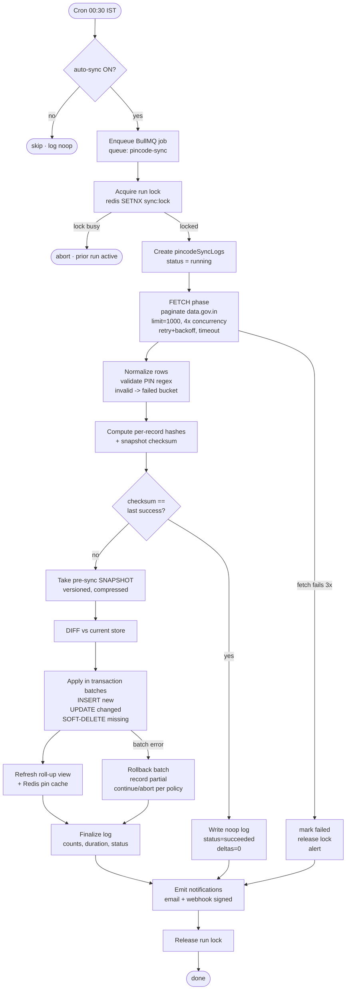

# Pincode Management System (India Post Auto-Sync)

The pincode dataset is the foundation every other Postpin module sits on: zone resolution, serviceability, remote-area surcharges and ETA estimation all dereference a pincode before a single rupee is calculated. This document specifies how Postpin keeps that dataset accurate and current by **auto-synchronizing with India Post** every night — fetching the authoritative postal directory, diffing it against our store, applying inserts/updates/soft-deletes idempotently, recording an auditable sync log, and exposing rollback. Because India Post offers **no official delta/changes API**, the whole design is built around *full-snapshot fetch + content hashing + diff*, with a versioned snapshot store so a bad sync can be reverted in one click. Targets ~19,300 active delivery pincodes today (~155k PIN-office rows across the All-India directory), designed to scale to 250k+ rows without re-architecture.

## Contents

1. [Data Sources & Reality of India Post](#data-sources--reality-of-india-post)
2. [Data Model](#data-model)
3. [Record Hashing & Change Detection](#record-hashing--change-detection)
4. [The Nightly Sync Pipeline](#the-nightly-sync-pipeline)
5. [Diff Algorithm](#diff-algorithm)
6. [Idempotency & Soft-Delete / Tombstones](#idempotency--soft-delete--tombstones)
7. [Snapshots, Versioning & Rollback](#snapshots-versioning--rollback)
8. [pincodeSyncLogs Record Shape](#pincodesynclogs-record-shape)
9. [CSV Import / Export Spec](#csv-import--export-spec)
10. [Super Admin Sync Settings](#super-admin-sync-settings)
11. [Sync Dashboard Metrics](#sync-dashboard-metrics)
12. [Failure Handling, Partial Recovery & Alerting](#failure-handling-partial-recovery--alerting)
13. [Webhooks & Notifications](#webhooks--notifications)
14. [Performance & Scaling](#performance--scaling)
15. [Security & Access Control](#security--access-control)
16. [Operational Runbook](#operational-runbook)

---

## Data Sources & Reality of India Post

There is no single "give me everything that changed since timestamp X" endpoint for Indian PIN codes. We blend two complementary public sources and treat our own store as the system of record once seeded.

| Source | URL | Shape | Use in Postpin | Caveats |
|---|---|---|---|---|
| **All-India Pincode Directory** | `data.gov.in` (resource: *All India Pincode Directory*, CSV/API via OGD platform) | Full bulk dump: ~155k rows, one per post office | **Primary nightly snapshot** — full directory pulled and diffed | No delta API; requires `api-key` (free OGD key); paginated via `offset`/`limit`; schema occasionally adds columns |
| **api.postalpincode.in** | `https://api.postalpincode.in/pincode/{PIN}` and `https://api.postalpincode.in/postoffice/{NAME}` | Per-PIN JSON lookup | **Targeted repair / on-demand verification** of specific pincodes; reconciliation of disputed records | Community-run, rate-limited, no SLA, no bulk export, can be intermittently down |

### Why "diff" and not "delta"

Neither source emits change events. India Post itself updates the directory in irregular bulk revisions. Therefore the only reliable strategy is:

> **Fetch the full authoritative snapshot → normalize → content-hash every row → compare hashes against our current store → derive the change set.**

This is robust to: out-of-order data, silent column additions, re-issued PINs, and renamed offices. The cost is bandwidth (one full directory pull per night ≈ 20–40 MB) and CPU for hashing, both trivial at this scale.

### data.gov.in (OGD) request shape

```http
GET https://api.data.gov.in/resource/{RESOURCE_ID}?api-key={OGD_KEY}&format=json&offset=0&limit=1000
```

```json
{
  "records": [
    {
      "circlename": "Maharashtra Circle",
      "regionname": "Mumbai Region",
      "divisionname": "Mumbai City North East Division",
      "officename": "Andheri H.O",
      "pincode": "400069",
      "officetype": "HO",
      "delivery": "Delivery",
      "district": "Mumbai",
      "statename": "Maharashtra",
      "latitude": "19.1197",
      "longitude": "72.8464"
    }
  ],
  "total": 154797,
  "count": 1000,
  "offset": 0,
  "limit": 1000
}
```

### api.postalpincode.in lookup shape (per-PIN repair)

```json
[
  {
    "Message": "Number of pincode(s) found:25",
    "Status": "Success",
    "PostOffice": [
      {
        "Name": "Andheri H.O",
        "BranchType": "Head Post Office",
        "DeliveryStatus": "Delivery",
        "Circle": "Maharashtra",
        "District": "Mumbai",
        "Division": "Mumbai City North East",
        "Region": "Mumbai",
        "State": "Maharashtra",
        "Pincode": "400069"
      }
    ]
  }
]
```

### Pagination & rate-limit policy

| Concern | Policy |
|---|---|
| Page size | `limit=1000` (OGD max is typically 1000/req) |
| Concurrency | Max **4 concurrent** page fetches; never hammer |
| Inter-request delay | 150 ms jitter between page batches |
| Timeout | Per-request `timeout` from settings (default 15s) |
| Retry | Exponential backoff `2^n` with full jitter, capped at `retryCount` (default 3) |
| Backpressure | If 3 consecutive pages fail → abort fetch phase, mark run `failed`, keep prior data untouched |
| ETag/conditional | Honor `ETag`/`Last-Modified` when present; if 304, short-circuit to "no changes" run |

> A pincode is `Delivery` or `Non-Delivery`. **Only `Delivery` post offices are serviceable** for shipping. Non-delivery rows are still stored (for completeness and address validation) but flagged `deliverable: false` so the [Shipping Engine](04-shipping-engine.md) excludes them from serviceability.

---

## Data Model

The live collection is `pincodes`. India Post is a one-PIN-to-many-office relationship (a single PIN can map to dozens of post offices), so the canonical key is the **(pincode, officeName)** pair. We additionally maintain a roll-up view per bare pincode for fast zone lookups.

### `pincodes` document

```json
{
  "_id": "ObjectId(...)",
  "key": "400069::ANDHERI H.O",
  "pincode": "400069",
  "officeName": "Andheri H.O",
  "officeType": "HO",
  "deliverable": true,
  "district": "Mumbai",
  "state": "Maharashtra",
  "circle": "Maharashtra",
  "region": "Mumbai",
  "division": "Mumbai City North East",
  "zone": "metro",
  "metro": true,
  "lat": 19.1197,
  "lng": 72.8464,
  "source": "data.gov.in",
  "hash": "9f2c1b77a4e0d3...e1",
  "version": 7,
  "status": "active",
  "firstSeenAt": "2025-11-02T00:31:02.118Z",
  "updatedAt": "2026-06-12T00:31:44.902Z",
  "removedAt": null,
  "lastSyncId": "sync_2026-06-12_0030"
}
```

| Field | Type | Notes |
|---|---|---|
| `key` | string | Stable composite key `"{pincode}::{UPPER(officeName)}"`. **Unique index.** Survives office renames only if name unchanged; renames are treated as remove+insert (see diff). |
| `pincode` | string(6) | Validated `^[1-9][0-9]{5}$` (Indian PINs never start with 0). |
| `officeName` | string | Canonical post-office name as published. |
| `officeType` | enum | `HO` \| `SO` \| `BO` (Head / Sub / Branch office). |
| `deliverable` | bool | Derived from India Post `Delivery`/`Non-Delivery`. |
| `district`,`state`,`circle`,`region`,`division` | string | Administrative hierarchy. |
| `zone` | enum | `local`\|`regional`\|`metro`\|`national`\|`special` — derived, not from India Post. Recomputed when geography fields change. See [Shipping Engine](04-shipping-engine.md) for zone rules. |
| `metro` | bool | True for the 8 metro circles' core PINs. |
| `lat`,`lng` | number\|null | Present in OGD dump for many rows; used for remote-area surcharge geofencing. |
| `source` | enum | `data.gov.in` \| `api.postalpincode.in` \| `csv-import` \| `manual`. |
| `hash` | string | SHA-256 of normalized payload (see hashing). Drives change detection. |
| `version` | int | Monotonic per-record; bumped on every applied change. |
| `status` | enum | `active` \| `removed` (soft-delete tombstone). |
| `firstSeenAt` | date | First sync that inserted it. |
| `updatedAt` | date | Last applied change. |
| `removedAt` | date\|null | Set when soft-deleted; cleared on resurrection. |
| `lastSyncId` | string | Provenance — which run last touched it. |

### Indexes

```js
db.pincodes.createIndex({ key: 1 }, { unique: true })
db.pincodes.createIndex({ pincode: 1 })
db.pincodes.createIndex({ pincode: 1, deliverable: 1, status: 1 })
db.pincodes.createIndex({ status: 1, updatedAt: -1 })
db.pincodes.createIndex({ hash: 1 })               // fast diff joins
db.pincodes.createIndex({ state: 1, district: 1 }) // admin filters
db.pincodes.createIndex({ zone: 1, status: 1 })    // engine lookups
```

### Roll-up view: `pincodeServiceability` (materialized)

Refreshed at the end of each successful sync. One doc per bare PIN — the engine's hot path reads only this.

```json
{
  "_id": "400069",
  "deliverable": true,
  "zone": "metro",
  "metro": true,
  "state": "Maharashtra",
  "district": "Mumbai",
  "officeCount": 3,
  "updatedAt": "2026-06-12T00:32:10.004Z"
}
```

This roll-up is also written into **Redis** as `pin:{pincode}` (string JSON, TTL 24h, refreshed on sync) so the shipping engine never touches Mongo for a hot lookup.

---

## Record Hashing & Change Detection

Change detection is hash-based, not field-by-field, so it is cheap, deterministic and resistant to schema drift.

### Normalization (must be byte-stable)

Before hashing, every incoming record is normalized so that cosmetic noise never produces a false "changed":

1. Trim and collapse internal whitespace (`/\s+/` → single space).
2. Uppercase `officeName`, `district`, `state`, `circle`, `region`, `division`.
3. Map India Post delivery flag → boolean `deliverable`.
4. Round `lat`/`lng` to 5 decimals; missing → `null` (not `0`).
5. Validate `pincode` regex; drop invalid rows to the failed bucket (never silently fix).

### The hashed payload

Only **content** fields are hashed — never `version`, `updatedAt`, `lastSyncId`, etc.

```js
function recordHash(r) {
  const canonical = JSON.stringify([
    r.pincode, r.officeName, r.officeType, r.deliverable,
    r.district, r.state, r.circle, r.region, r.division,
    r.lat, r.lng
  ]); // fixed array order => stable serialization
  return sha256(canonical); // hex
}
```

> **Why an array, not an object:** object key ordering can vary across runtimes; a positional array guarantees identical bytes for identical content. The `zone`/`metro` fields are *derived* and excluded from the hash — they change only when a hashed field they depend on changes, so excluding them avoids hash churn.

### Snapshot checksum

The whole fetched snapshot also gets a checksum (`sha256` over the sorted list of per-record hashes). If the snapshot checksum equals the previous successful run's checksum, the run short-circuits as a **no-op** (`status: "succeeded"`, all deltas `0`) — saving the entire diff/apply phase on quiet nights.

---

## The Nightly Sync Pipeline

A single Cron entry at **00:30 IST** enqueues one BullMQ job onto the `pincode-sync` queue. The worker runs the phased pipeline below. Every phase is checkpointed so a crash resumes (or fails) cleanly.



### Phase responsibilities

| Phase | Responsibility | On failure |
|---|---|---|
| **Lock** | `SET sync:lock <runId> NX EX 7200` so two runs never overlap (cron + manual click) | Abort with `aborted_locked`; existing run owns the dataset |
| **Fetch** | Paginated pull, retries, timeout, ETag check | After `retryCount` exhausted on 3 consecutive pages → `failed`, *no data mutated* |
| **Normalize** | Whitespace/case normalization, PIN validation | Invalid rows → `failedRecords[]`, run continues if under threshold |
| **Hash** | Per-record + snapshot checksum; no-op short-circuit | n/a |
| **Snapshot** | Persist current live set to `pincodeSnapshots` *before* mutation (rollback safety) | If snapshot write fails → abort before any mutation |
| **Diff** | Produce insert/update/delete sets | n/a (pure computation) |
| **Apply** | Batched, transactional writes | Per-batch rollback; partial-failure policy decides continue vs abort |
| **Roll-up** | Rebuild `pincodeServiceability` + Redis | Retry once; if fails, mark `succeeded_with_warnings` |
| **Finalize/Notify** | Write final log, fire email + webhook | Notification failure never fails the run; logged separately |

### BullMQ job options

```json
{
  "queueName": "pincode-sync",
  "jobName": "nightly-india-post-sync",
  "opts": {
    "attempts": 1,
    "removeOnComplete": { "age": 7776000, "count": 500 },
    "removeOnFail": false,
    "jobId": "sync_2026-06-12_0030"
  }
}
```

> `attempts: 1` at the BullMQ level is deliberate — internal retries live **inside** the fetch phase (granular, per-page). We do not want BullMQ to re-run the entire pipeline and re-snapshot. The deterministic `jobId` (derived from the date+slot) is an extra idempotency guard: a duplicate enqueue for the same slot is rejected by BullMQ.

---

## Diff Algorithm

The diff is a set comparison keyed by `key = "{pincode}::{UPPER(officeName)}"`, decided purely on `hash`.

```text
INPUTS
  incoming[]   = normalized snapshot rows (each with key, hash, fields)
  current[]    = db pincodes where status = "active"   (key -> hash)

BUILD
  incomingMap  = Map(key -> record)
  currentMap   = Map(key -> {hash, version})

DERIVE
  toInsert = [ r for r in incoming if r.key not in currentMap ]
  toUpdate = [ r for r in incoming if r.key in currentMap
                                   and r.hash != currentMap[r.key].hash ]
  toRemove = [ key for key in currentMap if key not in incomingMap ]
  unchanged = total - insert - update          (counted, not written)
```

### Resurrection

If an incoming key matches a record currently `status: "removed"` (a tombstone), it is **resurrected**: `status → active`, `removedAt → null`, `version++`, hash updated. This handles India Post temporarily dropping then re-listing an office, and avoids duplicate-key errors.

### Rename handling

India Post renames (e.g. "Andheri H.O" → "Andheri Head Post Office") change the `key`, so they surface as one `toRemove` (old name) + one `toInsert` (new name). This is intentional and safe — the bare-PIN roll-up still resolves correctly because both rows share the same `pincode`. A reconciliation report flags same-PIN remove+insert pairs so admins can verify they are renames and not real churn.

### Worked example

```json
{
  "runId": "sync_2026-06-12_0030",
  "snapshotChecksum": "c41d8f...aa",
  "counts": {
    "scanned": 154802,
    "insert": 41,
    "update": 318,
    "remove": 12,
    "unchanged": 154431,
    "resurrected": 3,
    "failedRecords": 5
  },
  "sampleChanges": [
    { "op": "update", "key": "400069::ANDHERI H.O", "changed": ["deliverable"], "from": false, "to": true },
    { "op": "insert", "key": "560103::BELLANDUR S.O", "officeType": "SO" },
    { "op": "remove", "key": "799250::OLD JOLAIBARI B.O", "reason": "absent_from_snapshot" }
  ]
}
```

---

## Idempotency & Soft-Delete / Tombstones

### Idempotency guarantees

The pipeline is **safe to re-run**. Three layers enforce it:

1. **Deterministic `jobId`** per cron slot — duplicate enqueues are dropped by BullMQ.
2. **Run lock** in Redis — only one apply phase mutates data at a time.
3. **Hash-gated writes** — a record is updated only if `incoming.hash != stored.hash`. Re-running an identical snapshot produces a clean no-op (zero updates), because every hash already matches.

Writes use upserts keyed on `key`, so re-applying a partially-completed run cannot create duplicates.

### Soft-delete + tombstones (never hard-delete on sync)

Records that disappear from the snapshot are **never** physically removed by a sync. Instead:

```json
{
  "key": "799250::OLD JOLAIBARI B.O",
  "status": "removed",
  "removedAt": "2026-06-12T00:31:40.221Z",
  "version": 9,
  "lastSyncId": "sync_2026-06-12_0030"
}
```

Why soft-delete:

- A flaky India Post export (partial dump) must never wipe live serviceability.
- Rollback and audit need the prior state.
- Resurrection is a cheap status flip, not a re-insert.

**Tombstone GC:** a separate monthly job hard-purges tombstones older than **180 days** that have not resurrected, keeping the collection lean. This GC is the *only* path that ever issues a hard delete, and it is gated behind a guard: it refuses to run if it would purge more than 1% of the collection in a single pass.

### Mass-deletion safety valve

If a single sync's `toRemove` exceeds **`maxDeletePct` (default 5%)** of active records, the apply phase **halts before deleting**, marks the run `needs_review`, and alerts admins. This is the primary defense against a truncated upstream dump silently nuking serviceability. Inserts/updates from that run are still applied; deletions are quarantined for one-click approval.

---

## Snapshots, Versioning & Rollback

### Pre-sync snapshots

Immediately before the apply phase, the current live set is persisted to `pincodeSnapshots`. We store a **compact, compressed** representation (gzip of `{key, hash, version, status}` plus a pointer to full docs via change-capture), not a full copy of 155k fat documents — enough to reconstruct exact prior state by replaying.

```json
{
  "_id": "snap_2026-06-12_0030",
  "syncId": "sync_2026-06-12_0030",
  "createdAt": "2026-06-12T00:31:05.000Z",
  "recordCount": 154790,
  "checksum": "c41d8f...aa",
  "compression": "gzip",
  "sizeBytes": 2148301,
  "ttlDays": 30,
  "changeSet": {
    "inserted": ["560103::BELLANDUR S.O"],
    "updated": [{ "key": "400069::ANDHERI H.O", "prevHash": "9f2c...", "prevVersion": 6 }],
    "removed": []
  }
}
```

We retain the **full prior document image** for every record the run touched (the `changeSet`), which is all rollback actually needs — untouched records are unaffected by a revert. Snapshots are retained 30 days (configurable), then GC'd.

### Rollback design

Rollback is itself a sync-class operation (locked, logged, snapshotted) so it is auditable and reversible.


| Original op in `sync_X` | Rollback action |
|---|---|
| `insert` | Soft-delete the inserted record (it didn't exist before) |
| `update` | Restore previous field values, `version` and `hash` from the captured prior image |
| `remove` | Resurrect (`status: active`, restore prior fields) |

Rollback is **idempotent** and produces its own log entry (`trigger: "rollback"`, `revertsSyncId`). Only the most recent N successful syncs (default 30 days of history) are rollback-eligible; older ones require CSV re-import. Rolling back a rollback simply re-applies the original change set.

---

## pincodeSyncLogs Record Shape

One document per run (scheduled, manual, webhook-triggered, or rollback). This is the spine of the dashboard and audit trail.

```json
{
  "_id": "sync_2026-06-12_0030",
  "syncId": "sync_2026-06-12_0030",
  "trigger": "scheduled",
  "triggeredBy": "cron",
  "status": "succeeded",
  "startedAt": "2026-06-12T00:30:00.412Z",
  "endedAt": "2026-06-12T00:32:11.984Z",
  "durationMs": 131572,
  "source": "data.gov.in",
  "snapshotId": "snap_2026-06-12_0030",
  "snapshotChecksum": "c41d8f...aa",
  "prevChecksum": "a90b22...77",
  "counts": {
    "scanned": 154802,
    "added": 41,
    "updated": 318,
    "removed": 12,
    "resurrected": 3,
    "unchanged": 154431,
    "failed": 5
  },
  "totals": {
    "activeBefore": 154431,
    "activeAfter": 154463
  },
  "fetch": {
    "pages": 155,
    "bytes": 31884221,
    "retries": 2,
    "avgPageMs": 412,
    "source304": false
  },
  "failedRecords": [
    {
      "rowIndex": 90412,
      "pincode": "0560XX",
      "officeName": "Garbled Row",
      "reason": "pincode_regex_failed",
      "raw": "0560XX,Garbled Row,..."
    }
  ],
  "warnings": [],
  "rollback": { "isRollback": false, "revertsSyncId": null, "rolledBackBy": null },
  "notifications": {
    "email": { "sent": true, "to": "ops@postpin.in", "at": "2026-06-12T00:32:13Z" },
    "webhook": { "sent": true, "status": 200, "attempts": 1 }
  }
}
```

### Status enum

| Status | Meaning | Dashboard color |
|---|---|---|
| `running` | In progress | info `#2563EB` |
| `succeeded` | Completed, no errors | success `#16A34A` |
| `succeeded_with_warnings` | Applied but roll-up/notify hiccup, or failed rows under threshold | warning `#D97706` |
| `noop` | Snapshot checksum unchanged; nothing to do | info `#2563EB` |
| `needs_review` | Mass-delete safety valve tripped; deletions quarantined | warning `#D97706` |
| `partial` | Some apply batches failed and were skipped | warning `#D97706` |
| `failed` | Fetch or pre-apply failure; **no data mutated** | destructive `#DC2626` |
| `aborted_locked` | Another run held the lock | destructive `#DC2626` |
| `rolled_back` | This run was later reverted | warning `#D97706` |

### Failed-record reasons

`pincode_regex_failed` · `missing_required_field` · `duplicate_key_in_snapshot` · `encoding_error` · `apply_batch_error` · `unknown_state` · `coordinate_parse_error`.

---

## CSV Import / Export Spec

Used for: emergency manual corrections, bulk seeding, customer-supplied overrides, and as the rollback escape hatch when a sync is older than the snapshot window.

### Column specification (canonical order)

| # | Column | Required | Type / Format | Example | Validation |
|---|---|---|---|---|---|
| 1 | `pincode` | yes | 6 digits, no leading 0 | `400069` | `^[1-9][0-9]{5}$` |
| 2 | `office_name` | yes | string ≤ 120 | `Andheri H.O` | non-empty after trim |
| 3 | `office_type` | yes | `HO`\|`SO`\|`BO` | `HO` | enum |
| 4 | `deliverable` | yes | `true`\|`false`\|`Delivery`\|`Non-Delivery` | `true` | coerced to bool |
| 5 | `district` | yes | string | `Mumbai` | non-empty |
| 6 | `state` | yes | string | `Maharashtra` | must match known state list |
| 7 | `circle` | no | string | `Maharashtra` | — |
| 8 | `region` | no | string | `Mumbai` | — |
| 9 | `division` | no | string | `Mumbai City North East` | — |
| 10 | `lat` | no | float -90..90 | `19.1197` | range check |
| 11 | `lng` | no | float -180..180 | `72.8464` | range check |
| 12 | `zone` | no | enum or blank | `metro` | if blank → auto-derived |

### Import rules

- **Encoding:** UTF-8 with BOM tolerated; reject UTF-16. Delimiter `,`; RFC-4180 quoting.
- **Header required**, case-insensitive, order-independent (mapped by name). Unknown columns ignored with a warning.
- **Dry-run first:** every import previews a diff (`+adds / ~updates / -removes`) before commit. Admin must confirm.
- **Mode:**
  - `upsert` (default) — adds + updates only; never removes.
  - `replace-scope` — within a state/district scope, removes rows absent from the file (soft-delete), behind explicit confirmation + safety valve.
- Each row hashed and diffed exactly like an India Post row; CSV-applied rows get `source: "csv-import"` and an `importBatchId`, so they are auditable and roll-back-able.
- Max file size 50 MB / 250k rows; streamed parse (no full-file buffering).
- A failed row never aborts the batch — it lands in a downloadable `import-errors.csv` with `row_index,reason,raw`.

### Export

```http
GET /v1/admin/pincodes/export?status=active&state=Maharashtra&format=csv
```

Streams the same 12-column schema (plus `version`, `updated_at`, `source` as trailing audit columns). Export honors current filters in the admin UI (state, district, deliverable, status, zone). For 155k rows the export streams gzipped and completes in a few seconds.

### Sample CSV

```csv
pincode,office_name,office_type,deliverable,district,state,circle,region,division,lat,lng,zone
400069,Andheri H.O,HO,true,Mumbai,Maharashtra,Maharashtra,Mumbai,Mumbai City North East,19.1197,72.8464,metro
560103,Bellandur S.O,SO,true,Bengaluru,Karnataka,Karnataka,Bengaluru HQ,Bengaluru East,12.9255,77.6783,metro
799250,Jolaibari B.O,BO,false,South Tripura,Tripura,North East,Agartala,Sabroom,23.0000,91.6000,special
```

---

## Super Admin Sync Settings

Stored as a single document in `settings` (namespace `pincodeSync`), editable from **Super Admin → Pincodes → Sync Settings**. All interactive controls carry `data-testid` (e.g. `pincode-sync-time-input`, `pincode-autosync-toggle`, `pincode-webhook-url-input`, `pincode-save-settings-btn`, `pincode-manual-sync-btn`).

```json
{
  "namespace": "pincodeSync",
  "indiaPost": {
    "primaryEndpoint": "https://api.data.gov.in/resource/{RESOURCE_ID}",
    "resourceId": "6176ee09-3d56-4a3b-8115-21841576b2f6",
    "apiKeyRef": "secret://ogd-data-gov-key",
    "repairEndpoint": "https://api.postalpincode.in/pincode/{PIN}",
    "pageLimit": 1000,
    "maxConcurrency": 4
  },
  "schedule": {
    "autoSync": true,
    "cron": "30 0 * * *",
    "timezone": "Asia/Kolkata"
  },
  "reliability": {
    "retryCount": 3,
    "backoffBaseMs": 1000,
    "timeoutMs": 15000,
    "consecutivePageFailLimit": 3
  },
  "safety": {
    "maxDeletePct": 5,
    "minSnapshotRows": 100000,
    "failedRowThresholdPct": 2,
    "tombstoneTtlDays": 180,
    "snapshotTtlDays": 30
  },
  "notifications": {
    "email": "ops@postpin.in",
    "notifyOn": ["failed", "partial", "needs_review", "succeeded_with_warnings"],
    "webhookUrl": "https://hooks.postpin.in/pincode-sync",
    "webhookSecretRef": "secret://pincode-webhook-signing-key",
    "webhookEvents": ["sync.completed", "sync.failed", "sync.needs_review", "sync.rolled_back"]
  },
  "updatedBy": "admin_8841",
  "updatedAt": "2026-06-20T11:04:00Z"
}
```

### Settings reference

| Group | Setting | Default | Notes |
|---|---|---|---|
| India Post | `primaryEndpoint` + `resourceId` | data.gov.in OGD | Editable to swap data source / mirror |
| India Post | `apiKeyRef` | secret ref | Never stored in plaintext; resolved from vault |
| India Post | `repairEndpoint` | postalpincode.in | Per-PIN reconciliation source |
| Schedule | `autoSync` | `true` | Master ON/OFF; OFF logs a `noop` skip |
| Schedule | `cron` / `timezone` | `30 0 * * *` / `Asia/Kolkata` | Changing it re-registers the cron job |
| Reliability | `retryCount` | `3` | Per-page retries |
| Reliability | `timeoutMs` | `15000` | Per HTTP request |
| Safety | `maxDeletePct` | `5` | Mass-delete valve |
| Safety | `minSnapshotRows` | `100000` | Reject suspiciously small dumps outright |
| Safety | `failedRowThresholdPct` | `2` | Above this → `failed`, not `succeeded_with_warnings` |
| Notifications | `email` / `webhookUrl` | ops inbox / hook | Targets for alerts |
| Notifications | `webhookSecretRef` | secret | HMAC signing key |

> **Validation on save:** `cron` must parse; `timeoutMs` 1–60s; `maxDeletePct` 0–100; `webhookUrl` must be HTTPS; a "Send test webhook" button (`pincode-test-webhook-btn`) fires a signed `ping` event so admins verify the receiver before relying on it.

---

## Sync Dashboard Metrics

**Super Admin → Pincodes → Overview** surfaces the live health of the dataset. All numbers come from `pincodes` (current state) and the latest `pincodeSyncLogs` entries.

### Top metric cards

| Card | Source | Example |
|---|---|---|
| **Total Pincodes** | `count(status:active)` (distinct rows) + distinct bare-PIN count | `154,463 offices · 19,287 PINs` |
| **Last Sync** | latest log `endedAt` + relative time + status chip | `Today 00:32 · Succeeded` |
| **New** | last run `counts.added` | `+41` |
| **Updated** | last run `counts.updated` | `318` |
| **Deleted** | last run `counts.removed` (soft) | `12` |
| **Failed** | last run `counts.failed` | `5` |
| **Sync Status** | last run `status` | `Succeeded` (green) |

### Actions bar (each a `data-testid`'d button)

`Manual Sync` (`pincode-manual-sync-btn`) · `Import CSV` (`pincode-import-csv-btn`) · `Export CSV` (`pincode-export-csv-btn`) · `Rollback` (`pincode-rollback-btn`) · `View Logs` (`pincode-view-logs-btn`).

### Charts (Recharts)

- **Sync volume over time** — stacked bars of added/updated/removed per night (30-day window).
- **Sync duration trend** — line of `durationMs`, with a band for the p95 baseline.
- **Failed records trend** — area chart; spikes page on-call.
- **Coverage by state** — horizontal bar of active deliverable PINs per state (data quality at a glance).

### Live metrics endpoint

```http
GET /v1/admin/pincodes/metrics
```

```json
{
  "totals": { "activeOffices": 154463, "distinctPincodes": 19287, "tombstones": 902, "nonDeliverable": 6121 },
  "lastSync": {
    "syncId": "sync_2026-06-12_0030",
    "status": "succeeded",
    "endedAt": "2026-06-12T00:32:11.984Z",
    "added": 41, "updated": 318, "removed": 12, "failed": 5,
    "durationMs": 131572
  },
  "trend": { "avgDurationMs7d": 128400, "avgAdded7d": 23, "lastFailureAt": "2026-05-28T00:31:10Z" },
  "health": "green"
}
```

`health` is `green` (last run succeeded), `amber` (warnings / needs_review / >24h since success), or `red` (last run failed / >48h stale).

---

## Failure Handling, Partial Recovery & Alerting

### Failure matrix

| Failure | Detection | Action | Data safety |
|---|---|---|---|
| India Post unreachable | Connection error / all-page timeouts | Retry w/ backoff → after limit, `failed` | No mutation; prior data intact |
| Truncated dump (`scanned < minSnapshotRows`) | Row-count guard post-fetch | Abort apply, `failed` + alert | No mutation |
| Mass deletion (`>maxDeletePct`) | Pre-delete guard in diff | Apply inserts/updates, quarantine deletes, `needs_review` | Deletions held for approval |
| Too many bad rows (`>failedRowThresholdPct`) | Post-normalize count | `failed`, dump `failedRecords` | No mutation |
| Apply batch error | Transaction abort in a batch | Roll back that batch, record `partial`, continue or abort per policy | Other batches committed; failed batch unchanged |
| Roll-up/Redis refresh fails | Post-apply check | Retry once → `succeeded_with_warnings` | Data correct; cache rebuilt lazily |
| Worker crash mid-run | Lock TTL expiry + run `running` w/ no heartbeat | Janitor marks `failed`, releases lock | Snapshot exists → operator can rollback if needed |
| Duplicate run / overlap | Redis lock `SETNX` | Second run `aborted_locked` | Single writer guaranteed |

### Partial-failure recovery

- Apply is **batched** (e.g. 2,000 ops per Mongo transaction). A batch is atomic; a failed batch is rolled back and its keys recorded under `partialFailures` in the log.
- Policy `partialFailureMode`:
  - `continue` (default) — skip the bad batch, finish the rest, status `partial`. Next nightly run re-attempts those keys naturally (their hashes still differ).
  - `abort` — stop at first failed batch, status `failed`; committed batches stay (forward progress), remainder retried next run.
- Because every write is **hash-gated upsert**, re-running simply re-applies only the still-divergent records — no double-application, no manual cleanup.

### Alerting

- **Channels:** email (always, to `notifications.email`) + signed webhook + in-app notification banner on the admin dashboard.
- **Severity routing:** `failed`/`needs_review` → page on-call (PagerDuty/Opsgenie via webhook). `succeeded_with_warnings`/`partial` → email + dashboard only.
- **Stale-data watchdog:** an independent cron at 02:00 IST checks "has a successful sync completed in the last 26h?" If not, it raises a high-severity alert — this catches the case where the sync job *never ran* (e.g. cron misfire), which the sync's own error path can't detect.

---

## Webhooks & Notifications

### Webhook event payload

```json
{
  "id": "evt_01J9...",
  "type": "sync.completed",
  "createdAt": "2026-06-12T00:32:13Z",
  "data": {
    "syncId": "sync_2026-06-12_0030",
    "status": "succeeded",
    "trigger": "scheduled",
    "counts": { "added": 41, "updated": 318, "removed": 12, "failed": 5 },
    "totals": { "activeBefore": 154431, "activeAfter": 154463 },
    "durationMs": 131572,
    "dashboardUrl": "https://admin.postpin.in/pincodes/syncs/sync_2026-06-12_0030"
  }
}
```

### Signing

Each delivery carries an HMAC-SHA256 signature over the raw body, using `webhookSecretRef`:

```http
POST /pincode-sync HTTP/1.1
X-Postpin-Event: sync.completed
X-Postpin-Delivery: evt_01J9...
X-Postpin-Signature: t=1718152333,v1=5d41402abc4b2a76b9719d911017c592...
Content-Type: application/json
```

`v1` = `hmacSHA256(secret, "{t}.{rawBody}")`. Receivers must reject if `|now - t| > 300s` (replay window) or signature mismatch. Deliveries retry on non-2xx with backoff (5 attempts: 0s, 30s, 2m, 10m, 1h) and are logged in `webhooks` delivery history.

### Email

Templated summary (Space Grotesk headings, INR/en-IN where amounts appear, status color chip) listing counts, duration, top changes, and a deep link to the run. Sent only for events in `notifyOn`. Honors a per-admin "digest vs every-run" preference.

---

## Performance & Scaling

| Dimension | Current (~155k offices / 19k PINs) | Design ceiling |
|---|---|---|
| Nightly fetch | ~155 pages × 1000, 4-way concurrency → ~60–90s | Linear; 250k → ~2.5min |
| Hashing | ~155k SHA-256 ≈ <2s single core | Negligible; parallelizable |
| Diff | Two hash maps, O(n) ≈ <1s | O(n) memory ~ tens of MB |
| Apply | Only the *delta* writes (typically <1k/night) in 2k-op transactions | Bounded by change volume, not dataset size |
| Roll-up rebuild | Aggregation → `pincodeServiceability` ≈ 2–4s | Incremental option below |
| **Total nightly run** | **~2–3 min** | Comfortably < 10 min even at 2× growth |

### Hot-path read performance

The shipping engine never scans `pincodes`. It reads `pin:{pincode}` from **Redis** (sub-ms), falling back to the `pincodeServiceability` roll-up (single indexed lookup) on cache miss, then warming the cache. A full sync rewrites all `pin:*` keys with a 24h TTL so cache and DB never drift more than one night.

### Optimizations

- **Streaming, not buffering:** fetch + normalize + hash as a pipeline; never hold the full fat dataset and the full snapshot in memory simultaneously.
- **Incremental roll-up:** instead of rebuilding all 19k PIN roll-ups, recompute only PINs whose office set changed this run (tracked via the change set). Falls back to full rebuild weekly for self-healing.
- **Bulk writes:** `bulkWrite(ordered:false)` for the delta; unordered lets independent ops proceed past a single failing op (captured for the log).
- **Connection reuse:** keep-alive agent to data.gov.in; gzip transfer-encoding requested.
- **Off-peak window:** 00:30 IST is the system-wide quiet period; the sync worker runs on a dedicated BullMQ concurrency lane so it cannot starve API-serving workers.

---

## Security & Access Control

- **RBAC:** only `superadmin` may change Sync Settings, trigger manual sync, import CSV, or roll back. `support`/`readonly` admins can view logs and metrics. Enforced server-side on every `/v1/admin/pincodes/*` route; see roles/permissions model.
- **Secrets:** OGD API key and webhook signing secret are stored as vault references (`secret://…`), never in `settings` plaintext, never logged.
- **Audit:** every settings change, manual sync, CSV import and rollback writes an `auditLogs` entry (`actor`, `action`, `before`, `after`, `ip`, `at`).
- **Input safety:** CSV import is parsed in a sandbox with row/size caps; values are validated, never `eval`'d; uploaded files are virus-scanned before parse.
- **PII:** the postal directory is public, non-personal data — low sensitivity — but access is still tenant-isolated at the admin layer.

---

## Operational Runbook

| Scenario | Action |
|---|---|
| Nightly sync `failed` (fetch) | Check data.gov.in status; run **Manual Sync** once source is up. No rollback needed — data was untouched. |
| `needs_review` (mass delete) | Open run → inspect quarantined deletions → if legitimate, **Approve deletions**; if a bad dump, **Discard** (no change) and re-run. |
| Wrong data went live | **Rollback** the offending `syncId`; verify metrics return to expected; file the bad-dump incident. |
| Source schema changed (new column) | Hash excludes unknown columns automatically; map the new column in normalizer if it's content-relevant, then re-sync. |
| Specific PIN wrong | Use **api.postalpincode.in repair**: fetch that PIN, correct via CSV `upsert` of one row (`source: csv-import`), auditable. |
| Cron didn't fire | Stale-data watchdog (02:00) alerts; trigger **Manual Sync**; investigate scheduler. |
| Need historical state | Pull the `pincodeSnapshots` entry for the date; export its change set. |

### Cross-references

- [Shipping Engine](04-shipping-engine.md) — how `zone`, `metro`, `deliverable` feed billable-weight and zone pricing.
- [Architecture Overview](01-architecture.md) — BullMQ queues, Redis usage, cron registry.
- [Super Admin Portal](06-super-admin.md) — UI surfaces, RBAC, audit log views.
- [Webhooks & Notifications](08-webhooks.md) — shared signing scheme and delivery retry policy.
