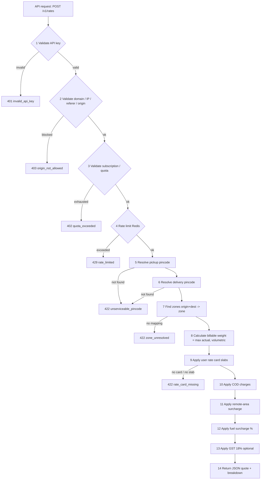
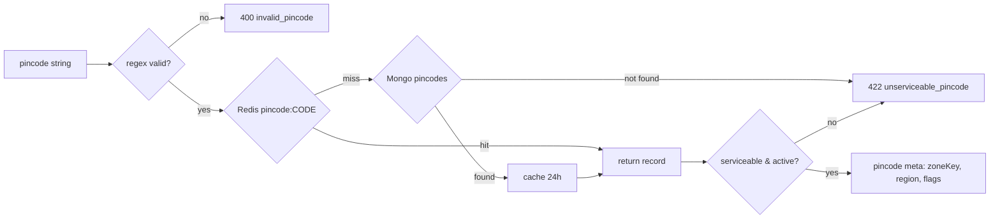
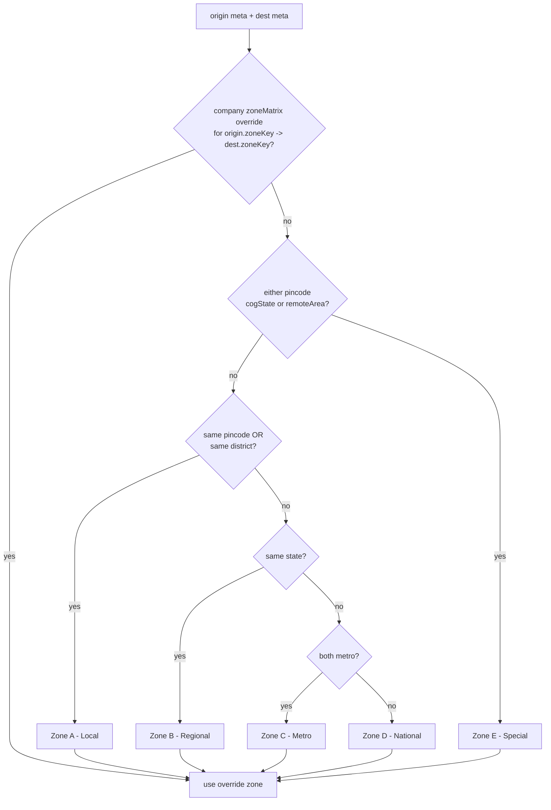
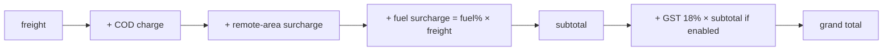
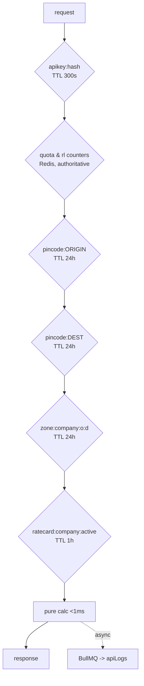

# Shipping Charges Engine

The shipping engine is the deterministic core of Postpin: a single `POST /v1/rates` request travels through a strictly ordered pipeline — API-key auth, origin allow-listing, quota and rate-limit checks, pincode and zone resolution, chargeable-weight computation, rate-card slab lookup, and a fixed stack of surcharges (COD, remote-area, fuel, GST) — and returns a fully itemized INR quote. This document specifies every stage as concrete algorithms, the exact arithmetic and rounding rules that make the engine reproducible to the paisa, the Redis caching layout that keeps p99 latency under 50 ms, and the error taxonomy that callers can program against. Three fully worked numeric examples (metro inter-zone, local same-city, remote J&K) show the line-item math end to end.

## Contents

- [Pipeline Overview](#pipeline-overview)
- [Stage 1–4: Gatekeeping (Auth, Origin, Quota, Rate Limit)](#stage-14-gatekeeping-auth-origin-quota-rate-limit)
- [Stage 5–6: Pincode Resolution](#stage-56-pincode-resolution)
- [Stage 7: Zone Resolution Algorithm](#stage-7-zone-resolution-algorithm)
- [Stage 8: Billable (Chargeable) Weight](#stage-8-billable-chargeable-weight)
- [Stage 9: Rate-Card Slab Lookup](#stage-9-rate-card-slab-lookup)
- [Stage 10–13: Surcharge Stack (COD, Remote, Fuel, GST)](#stage-1013-surcharge-stack-cod-remote-fuel-gst)
- [Determinism & Rounding Rules](#determinism--rounding-rules)
- [Worked Examples](#worked-examples)
- [Caching Strategy & Latency Budget](#caching-strategy--latency-budget)
- [Error Taxonomy](#error-taxonomy)
- [Sample Request & Response](#sample-request--response)
- [Configuration Reference](#configuration-reference)
- [Related Documents](#related-documents)

---

## Pipeline Overview

Every rate calculation runs the same 14-step pipeline in this exact order. The first four steps are **gatekeeping** (cheap, fail-fast, no DB writes on the hot path); the remaining steps are the **calculation core**. Order is load-bearing: cheaper rejections happen before expensive lookups, and every surcharge is applied to a well-defined base so the result is deterministic.



| # | Stage | Reads from | Typical cost | Failure mode |
|---|-------|------------|--------------|--------------|
| 1 | Validate API key | Redis (key hash) → Mongo `apiKeys` | <1 ms (cache hit) | `401 invalid_api_key` |
| 2 | Validate origin (domain/IP/referer/origin) | API-key record | <0.1 ms | `403 origin_not_allowed` |
| 3 | Validate subscription / quota | Redis counter `quota:{companyId}:{period}` | <1 ms | `402 quota_exceeded` |
| 4 | Rate limit | Redis token bucket | <1 ms | `429 rate_limited` |
| 5 | Resolve pickup pincode | Redis → Mongo `pincodes` | <2 ms | `422 unserviceable_pincode` |
| 6 | Resolve delivery pincode | Redis → Mongo `pincodes` | <2 ms | `422 unserviceable_pincode` |
| 7 | Find zones | Redis → Mongo `zones` | <1 ms | `422 zone_unresolved` |
| 8 | Billable weight | pure compute | <0.1 ms | `400 invalid_dimensions` |
| 9 | Rate-card slabs | Redis → Mongo `rateCards` | <1 ms | `422 rate_card_missing` |
| 10–13 | Surcharges | rate card + `settings` | <0.1 ms | — |
| 14 | Return JSON | — | — | `200 OK` |

The whole calculation is **side-effect-light on the hot path**: the only mutation is incrementing the Redis quota/rate-limit counters (step 3–4) and an async append to `apiLogs` (fire-and-forget via BullMQ, never blocking the response). See [API & Authentication](03-api-and-auth.md) for key issuance and [Pincode Management](05-pincode-management.md) for how `pincodes` and `zones` are kept fresh.

---

## Stage 1–4: Gatekeeping (Auth, Origin, Quota, Rate Limit)

These four steps reject ~99% of bad traffic before any rate math runs. They are intentionally ordered cheapest-first.

### 1. Validate API key

- Client sends the key as `Authorization: Bearer pk_live_…` (or `X-Api-Key`).
- The engine computes `sha256(key)` and looks up `apikey:{sha256}` in Redis. On miss it reads `apiKeys` in Mongo by the hashed value (the raw key is never stored), caches the result for 300 s, and proceeds.
- Reject when: key not found, `status != "active"`, `expiresAt < now`, or the parent `company.status` is `suspended`.

```json
// apiKeys document (relevant fields)
{
  "_id": "key_3f9a…",
  "companyId": "cmp_812…",
  "keyHash": "sha256:9c1f…",       // never the raw key
  "prefix": "pk_live_9c1f",         // shown in UI for identification
  "status": "active",               // active | revoked | expired
  "mode": "live",                   // live | test
  "allowedDomains": ["shop.acme.in", "*.acme.in"],
  "allowedIps": ["49.36.0.0/16"],
  "allowedReferers": ["https://shop.acme.in/*"],
  "scopes": ["rates:read"],
  "expiresAt": null
}
```

### 2. Validate domain / IP / referer / origin

A request is allowed only if it satisfies **every non-empty** restriction list on the key (AND semantics). Empty list = unrestricted for that dimension.

| Dimension | Source header | Match rule |
|-----------|---------------|-----------|
| Origin | `Origin` | exact host or wildcard `*.acme.in` |
| Referer | `Referer` | prefix/glob match against `allowedReferers` |
| Domain | `Origin`/`Referer` host | host ∈ `allowedDomains` |
| IP | socket / `X-Forwarded-For` (trusted proxy only) | CIDR membership in `allowedIps` |

Server-to-server calls (no `Origin`/`Referer`) pass the domain/referer checks only when those lists are empty; otherwise they must come from an allow-listed IP. Failure → `403 origin_not_allowed`. This check is pure in-memory comparison against the cached key record (<0.1 ms).

### 3. Validate subscription / quota

- Resolve the active `subscription` for `companyId` (cached). Reject if `status` is `past_due`/`canceled` → `402 subscription_inactive`.
- Monthly quota uses a Redis counter `quota:{companyId}:{YYYYMM}` with a TTL set to the end of the billing period.
- `INCR` then compare to `plan.monthlyQuota`. If the post-increment value exceeds the quota **and** the plan has `overage.enabled = false`, decrement and reject with `402 quota_exceeded`. If overage is enabled, allow and mark the call billable as overage (recorded in `apiLogs`).

### 4. Rate limit (Redis)

Per-key sliding-window/token-bucket limiter keyed `rl:{keyId}:{windowSec}`.

- Default `100 req/min` and `10 req/sec` burst, overridable per plan (`plan.rateLimit.rpm`, `.rps`).
- Implemented as an atomic Lua script (token bucket) so concurrent replicas stay consistent.
- On exceed → `429 rate_limited` with headers `Retry-After`, `X-RateLimit-Limit`, `X-RateLimit-Remaining`, `X-RateLimit-Reset`.

---

## Stage 5–6: Pincode Resolution

Both pickup and delivery pincodes are resolved through the same function. A pincode must be a 6-digit string matching `^[1-9][0-9]{5}$` (Indian pincodes never start with 0).



The resolved record carries the fields the rest of the pipeline needs:

```json
// pincodes document (calculation-relevant fields)
{
  "pincode": "194101",
  "officeName": "Leh H.O",
  "district": "Leh",
  "state": "Jammu & Kashmir (Ladakh)",
  "region": "north",
  "zoneKey": "JK-LEH",          // courier/region key consumed by zone resolution
  "metro": false,
  "serviceable": true,           // false => unserviceable_pincode
  "remoteArea": true,            // drives remote-area surcharge
  "oda": true,                   // Out-of-Delivery-Area flag
  "cogState": true,              // special/COG state (J&K, NE, A&N, etc.)
  "lat": 34.1526,
  "lng": 77.5770,
  "source": "indiapost",         // indiapost | datagov | manual
  "updatedAt": "2026-06-25T00:31:04Z"
}
```

Notes:
- `serviceable=false` (e.g., a discontinued PO, or a pin not on the company's serviceable list) → `422 unserviceable_pincode`.
- `remoteArea`/`oda`/`cogState` flags are precomputed during the nightly India Post sync (see [Pincode Management](05-pincode-management.md), sources `api.postalpincode.in` and the All-India Pincode Directory on `data.gov.in`). The engine never calls India Post on the hot path.
- A pincode can map to multiple post offices; the engine collapses them to one record per pincode keyed by `pincode` (district/state are stable across the group).

---

## Stage 7: Zone Resolution Algorithm

A **zone** is the band that an (origin, destination) pair falls into; it selects which column of the rate card applies. Postpin uses five canonical zones (configurable per company), modeled on Indian courier conventions:

| Zone | Code | Definition | Example |
|------|------|------------|---------|
| Local | `A` | Same city / same pincode district | 560001 → 560034 (Bengaluru) |
| Regional | `B` | Same state, different city | 400001 → 411001 (Mumbai → Pune) |
| Metro | `C` | Between any two of the 8 metro cities | 400001 → 110001 (Mumbai → Delhi) |
| National (ROI) | `D` | Rest of India, inter-state non-metro | 302001 → 781001 (Jaipur → Guwahati) |
| Special | `E` | COG/remote states: J&K & Ladakh, NE, A&N, Lakshadweep, hill remote | 110001 → 194101 (Delhi → Leh) |

### Algorithm

Resolution is a deterministic decision waterfall — the **first** matching rule wins, so order matters. A per-company `zoneMatrix` override is consulted before the defaults.



```text
function resolveZone(origin, dest, company):
    # 1. explicit per-company override (highest priority)
    z = company.zoneMatrix[origin.zoneKey]?[dest.zoneKey]
    if z is defined: return z

    # 2. special/remote dominates everything
    if origin.cogState or dest.cogState or origin.remoteArea or dest.remoteArea:
        return "E"

    # 3. locality waterfall
    if origin.pincode == dest.pincode or origin.district == dest.district:
        return "A"
    if origin.state == dest.state:
        return "B"
    if origin.metro and dest.metro:
        return "C"
    return "D"
```

- The 8 metro set (`metro=true`): Mumbai, Delhi (NCR), Bengaluru, Hyderabad, Chennai, Kolkata, Pune, Ahmedabad. Configurable via `settings.zones.metroPincodePrefixes`.
- Zone resolution is symmetric by default (A→B same as B→A) unless a directional `zoneMatrix` override says otherwise.
- The `(originZoneKey, destZoneKey) → zone` result is cached: `zone:{company}:{originZoneKey}:{destZoneKey}` for 24 h.
- No mapping and no fallback default configured → `422 zone_unresolved` (should be rare; a sane default of `D` is recommended in `settings.zones.fallbackZone`).

---

## Stage 8: Billable (Chargeable) Weight

Couriers bill the **greater** of actual (dead) weight and volumetric (dimensional) weight.

```
volumetricWeight_kg = (L_cm * W_cm * H_cm) / divisor
billableWeight_kg   = max(actualWeight_kg, volumetricWeight_kg)
```

- `divisor` defaults to **5000** (cm³/kg) and is configurable per company/service via `rateCard.volumetricDivisor` (air freight often uses 4000; some surface contracts use 6000).
- Inputs accepted in `cm` and `kg` by default; the API also accepts `weightUnit` (`kg`/`g`) and `dimUnit` (`cm`/`in`) and normalizes to cm/kg first.
- `dimensions` is optional. If omitted, `volumetricWeight = 0` and billable weight = actual weight.
- Validation: any of `weight`, `length`, `width`, `height` that is present must be `> 0` and finite; otherwise `400 invalid_dimensions`. A request with neither weight nor dimensions → `400 invalid_dimensions`.

### Rounding to the slab grain

The billable weight is then **rounded up** to the rate card's `weightStep` (default 0.5 kg = 500 g) only for slab counting, not stored as the physical weight:

```
slabWeight_kg = ceil(billableWeight_kg / weightStep) * weightStep
```

The raw `billableWeight_kg` is reported in the response for transparency; `slabWeight_kg` drives pricing.

| Inputs | Volumetric (÷5000) | Actual | Billable | Slab wt (step 0.5) |
|--------|--------------------|--------|----------|--------------------|
| 1.2 kg, 30×20×15 | 1.80 kg | 1.2 kg | **1.80 kg** | 2.0 kg |
| 0.4 kg, 20×15×10 | 0.60 kg | 0.4 kg | **0.60 kg** | 1.0 kg |
| 3.0 kg, 40×30×25 | 6.00 kg | 3.0 kg | **6.00 kg** | 6.0 kg |

---

## Stage 9: Rate-Card Slab Lookup

A **rate card** belongs to a company and defines pricing per `(service, zone)`. Each cell is a base price for the first slab plus an "extra per additional 500 g" increment, optionally followed by explicit slab overrides for non-linear pricing.

```json
// rateCards document
{
  "_id": "rc_acme_default",
  "companyId": "cmp_812…",
  "name": "ACME Standard 2026",
  "currency": "INR",
  "weightStep": 0.5,             // kg per slab (500 g)
  "volumetricDivisor": 5000,
  "effectiveFrom": "2026-04-01",
  "effectiveTo": null,
  "rates": {
    "express": {
      "A": { "baseWeight": 0.5, "basePrice": 45, "extraPer500g": 24 },
      "B": { "baseWeight": 0.5, "basePrice": 52, "extraPer500g": 28 },
      "C": { "baseWeight": 0.5, "basePrice": 65, "extraPer500g": 32 },
      "D": { "baseWeight": 0.5, "basePrice": 78, "extraPer500g": 40 },
      "E": { "baseWeight": 0.5, "basePrice": 95, "extraPer500g": 48 }
    },
    "surface": {
      "A": { "baseWeight": 0.5, "basePrice": 28, "extraPer500g": 18 },
      "B": { "baseWeight": 0.5, "basePrice": 34, "extraPer500g": 20 },
      "C": { "baseWeight": 0.5, "basePrice": 42, "extraPer500g": 24 },
      "D": { "baseWeight": 0.5, "basePrice": 50, "extraPer500g": 28 },
      "E": { "baseWeight": 0.5, "basePrice": 60, "extraPer500g": 34 }
    }
  },
  "cod": { "flat": 30, "percent": 1.5, "min": 30 },
  "remoteArea": { "flat": 70, "perKg": 15 },
  "fuelSurchargePercent": 18,
  "gst": { "enabled": true, "percent": 18 }
}
```

### Freight lookup algorithm

```text
function freight(card, service, zone, slabWeight):
    cell = card.rates[service][zone]
    if cell is undefined: throw RATE_CARD_MISSING

    # additional slabs beyond the base slab
    extraSlabs = ceil( max(0, slabWeight - cell.baseWeight) / card.weightStep )
    freight    = cell.basePrice + extraSlabs * cell.extraPer500g

    # optional explicit overrides (non-linear bands) win over linear math
    if cell.slabs:
        band = firstBand where slabWeight <= band.upToKg
        if band: freight = band.price
    return round2(freight)
```

- **"Extra per 500 g"** means: the first `baseWeight` (0.5 kg) is covered by `basePrice`; every additional `weightStep` (500 g) or part thereof costs `extraPer500g`. A 1.8 kg shipment in zone C express = base (covers 0.5 kg) + `ceil((1.8−0.5)/0.5)=3` extra slabs.
- Picking the card: the engine selects the company's active card where `effectiveFrom ≤ shipDate ≤ effectiveTo` (or `effectiveTo = null`). A request can pin `rateCardId` to force a specific card (e.g., for quoting historical rates).
- If the `(service, zone)` cell is missing → `422 rate_card_missing` (the company has no contracted price for that lane/service).
- `service` is one of the card's defined keys; unknown service → `400 invalid_service`.

---

## Stage 10–13: Surcharge Stack (COD, Remote, Fuel, GST)

Surcharges apply in a **fixed order** to well-defined bases. This ordering is part of the contract — changing it changes totals.



### 10. COD charge

Applied only when `paymentType == "COD"`. Charged as the **greater** of a flat fee and a percentage of the declared `codAmount` (order value), floored at `min`:

```
codCharge = paymentType == "COD"
          ? max(card.cod.flat, card.cod.percent/100 * codAmount, card.cod.min)
          : 0
```

For Prepaid shipments `codCharge = 0` and `codAmount` is ignored.

### 11. Remote-area surcharge

Applied when **either** pincode has `remoteArea = true` (or `oda = true`). Charged once per shipment:

```
remoteCharge = (origin.remoteArea or dest.remoteArea)
             ? card.remoteArea.flat + card.remoteArea.perKg * billableWeight_kg
             : 0
```

`perKg` uses the raw `billableWeight_kg` (not the rounded slab weight) so it scales smoothly.

### 12. Fuel surcharge

A percentage **of freight only** (not of COD or remote — this matches courier practice):

```
fuelCharge = card.fuelSurchargePercent/100 * freight
```

`fuelSurchargePercent` is updatable by Super Admin (fuel prices move) without touching the rate card matrix.

### 13. GST (optional, 18%)

Indian GST is levied on the **total taxable value of the shipping service** = freight + COD + remote + fuel. It is optional per company (some B2B customers self-account):

```
subtotal = freight + codCharge + remoteCharge + fuelCharge
gst      = card.gst.enabled ? card.gst.percent/100 * subtotal : 0
total    = subtotal + gst
```

GST is applied **last**, on the post-surcharge subtotal, never compounded per line item.

---

## Determinism & Rounding Rules

The engine is a **pure function** of `(request, resolved pincode meta, zone, rate card, settings snapshot)`. Given identical inputs it always returns identical output. Rules that guarantee this:

1. **Currency is INR, 2 decimal places (paisa).** All money values are computed in floating point, then rounded with `round2(x) = Math.round(x * 100) / 100` (round-half-up at the paisa). To avoid binary-float drift, the reference implementation computes in integer paisa internally and divides by 100 only when serializing.
2. **Round per line item, then sum.** Each surcharge is rounded to 2 dp *before* it enters the subtotal. The subtotal is the sum of rounded line items; GST is computed on that rounded subtotal and itself rounded. This makes the displayed breakdown add up exactly to `total` (no "off by one paisa" reconciliation issues).
3. **Weight rounds UP to `weightStep`** for slab counting (`ceil`), never down. Volumetric is computed at full precision and only the slab count is rounded.
4. **First-match-wins** in zone resolution; rule order is fixed.
5. **Config is snapshotted at request time.** The response echoes `meta.rateCardId`, `meta.zoneVersion`, and the effective `divisor`, `fuelSurchargePercent`, and `gstPercent` so a quote can be reproduced/audited later even after rates change.
6. **No wall-clock dependence in the math** beyond selecting the active rate card by `shipDate` (defaults to request time, but can be pinned). Two replays with the same pinned `shipDate` and `rateCardId` are byte-identical.

| Quantity | Precision | Rounding |
|----------|-----------|----------|
| volumetric weight | full float (kg) | none until slab step |
| slab weight | `weightStep` grain | `ceil` |
| each money line item | 2 dp (paisa) | round-half-up |
| subtotal | 2 dp | sum of rounded items |
| GST | 2 dp | round-half-up |
| total | 2 dp | subtotal + GST (both already rounded) |

---

## Worked Examples

All three use the `rc_acme_default` rate card above (`weightStep 0.5`, `divisor 5000`, `fuel 18%`, `GST 18%`).

### Example 1 — Mumbai → Delhi, 1.2 kg Express COD (Zone C)

**Request:** `400001 → 110001`, weight 1.2 kg, dims 30×20×15 cm, service `express`, `COD`, order value ₹2,500.

| Step | Computation | Result |
|------|-------------|--------|
| Volumetric | 30×20×15 / 5000 = 9000/5000 | 1.80 kg |
| Billable | max(1.2, 1.80) | **1.80 kg** |
| Slab weight | ceil(1.80 / 0.5) × 0.5 | 2.0 kg |
| Zone | both metro, inter-city | **C** |
| Freight | base ₹65 (covers 0.5 kg) + ceil((1.8−0.5)/0.5)=3 × ₹32 = 65 + 96 | ₹161.00 |
| COD | max(₹30, 1.5% × 2500 = ₹37.50, ₹30) | ₹37.50 |
| Remote | both metro, not remote | ₹0.00 |
| Fuel | 18% × 161.00 | ₹28.98 |
| **Subtotal** | 161.00 + 37.50 + 0 + 28.98 | **₹227.48** |
| GST | 18% × 227.48 | ₹40.95 |
| **Total** | 227.48 + 40.95 | **₹268.43** |

### Example 2 — Bengaluru local, 0.4 kg Surface Prepaid (Zone A)

**Request:** `560001 → 560034`, weight 0.4 kg, dims 20×15×10 cm, service `surface`, `Prepaid`.

| Step | Computation | Result |
|------|-------------|--------|
| Volumetric | 20×15×10 / 5000 = 3000/5000 | 0.60 kg |
| Billable | max(0.4, 0.60) | **0.60 kg** |
| Slab weight | ceil(0.60 / 0.5) × 0.5 | 1.0 kg |
| Zone | same district (Bengaluru) | **A** |
| Freight | base ₹28 (covers 0.5 kg) + ceil((0.6−0.5)/0.5)=1 × ₹18 = 28 + 18 | ₹46.00 |
| COD | Prepaid | ₹0.00 |
| Remote | not remote | ₹0.00 |
| Fuel | 18% × 46.00 | ₹8.28 |
| **Subtotal** | 46.00 + 0 + 0 + 8.28 | **₹54.28** |
| GST | 18% × 54.28 | ₹9.77 |
| **Total** | 54.28 + 9.77 | **₹64.05** |

### Example 3 — Delhi → Leh (J&K/Ladakh), 3 kg Express COD (Zone E, remote)

**Request:** `110001 → 194101`, weight 3 kg, dims 40×30×25 cm, service `express`, `COD`, order value ₹4,999.

| Step | Computation | Result |
|------|-------------|--------|
| Volumetric | 40×30×25 / 5000 = 30000/5000 | 6.00 kg |
| Billable | max(3, 6.00) | **6.00 kg** |
| Slab weight | ceil(6.00 / 0.5) × 0.5 | 6.0 kg |
| Zone | dest `cogState`/`remoteArea` (Leh) | **E** |
| Freight | base ₹95 (covers 0.5 kg) + ceil((6.0−0.5)/0.5)=11 × ₹48 = 95 + 528 | ₹623.00 |
| COD | max(₹40*, 1.5% × 4999 = ₹74.99, ₹30) | ₹74.99 |
| Remote | flat ₹70 + ₹15/kg × 6.00 = 70 + 90 | ₹160.00 |
| Fuel | 18% × 623.00 | ₹112.14 |
| **Subtotal** | 623.00 + 74.99 + 160.00 + 112.14 | **₹970.13** |
| GST | 18% × 970.13 | ₹174.62 |
| **Total** | 970.13 + 174.62 | **₹1,144.75** |

\* Example 3 assumes a company COD override `{ flat: 40 }` for Zone E; with the default `flat: 30` the COD floor would not bind because the 1.5% value (₹74.99) already dominates.

---

## Caching Strategy & Latency Budget

**Target: p99 < 50 ms** end-to-end for cached lanes. The math itself is <1 ms; latency is dominated by lookups, so everything resolvable from config is cached in Redis with explicit TTLs and event-based invalidation.



| Cache key | Holds | TTL | Invalidated by |
|-----------|-------|-----|----------------|
| `apikey:{sha256}` | API-key record | 300 s | key revoke/update event |
| `quota:{companyId}:{YYYYMM}` | usage counter | end of period | (authoritative, not a cache) |
| `rl:{keyId}:{window}` | token bucket | window | (authoritative) |
| `pincode:{code}` | pincode meta | 24 h | nightly sync (00:30) publishes invalidations |
| `zone:{company}:{oKey}:{dKey}` | resolved zone | 24 h | zone-matrix update |
| `ratecard:{company}:active` | active rate card | 1 h | rate-card publish |
| `settings:engine` | divisor/fuel/gst defaults | 5 min | settings save |

Operational rules:
- **Cache-aside** everywhere: miss → DB read → populate → continue. Never block the request on a write.
- **Single Redis round-trip batching**: pincode origin+dest+zone+ratecard are fetched with one `MGET`/pipeline to cut RTT.
- **Negative caching**: an unserviceable pincode is cached (`serviceable:false`) for 10 min to avoid hammering Mongo with repeated bad lookups.
- **Warm-up**: on rate-card publish and after nightly sync, a BullMQ job pre-warms the top-N busiest lanes (from `apiLogs` analytics).
- **Async logging**: `apiLogs` append is enqueued, not awaited, so logging never enters the latency budget.

Latency budget (cached hot path):

| Segment | Budget |
|---------|--------|
| TLS/HTTP parse + auth (cached) | ~5 ms |
| quota + rate limit (Redis) | ~2 ms |
| pincode×2 + zone + rate card (pipelined Redis) | ~8 ms |
| pure calculation | <1 ms |
| serialize + write | ~3 ms |
| **headroom to 50 ms p99** | ~31 ms |

---

## Error Taxonomy

All errors share an envelope and a stable machine-readable `code`. HTTP status reflects the failure class; `code` lets clients branch precisely. `requestId` is always present for support correlation.

```json
{
  "error": {
    "code": "unserviceable_pincode",
    "message": "Delivery pincode 110011 is not serviceable.",
    "field": "deliveryPincode",
    "details": { "pincode": "110011" },
    "requestId": "req_7c2a9e10",
    "docsUrl": "https://docs.postpin.in/errors/unserviceable_pincode"
  }
}
```

| HTTP | `code` | When | Client action |
|------|--------|------|---------------|
| 400 | `invalid_request` | malformed JSON / missing required field | fix payload |
| 400 | `invalid_pincode` | pincode fails `^[1-9][0-9]{5}$` | fix pincode |
| 400 | `invalid_dimensions` | weight/dim ≤ 0 or both absent | fix inputs |
| 400 | `invalid_service` | `service` not in rate card | use a valid service |
| 401 | `invalid_api_key` | missing/unknown/revoked/expired key | re-issue key |
| 402 | `subscription_inactive` | sub `past_due`/`canceled` | update billing |
| 402 | `quota_exceeded` | monthly quota hit, overage disabled | upgrade plan |
| 403 | `origin_not_allowed` | domain/IP/referer/origin not allow-listed | adjust key restrictions |
| 422 | `unserviceable_pincode` | pincode not found / `serviceable=false` | choose serviceable pin |
| 422 | `zone_unresolved` | no zone mapping & no fallback | configure zone matrix |
| 422 | `rate_card_missing` | no active card or no `(service,zone)` cell | add rate card cell |
| 429 | `rate_limited` | RPM/RPS exceeded | back off (`Retry-After`) |
| 500 | `internal_error` | unexpected server fault | retry w/ backoff, contact support |
| 503 | `dependency_unavailable` | Redis/Mongo degraded | retry w/ backoff |

Design notes:
- **422 vs 400**: 400 means the request is structurally wrong (caller's fault, fixable in payload); 422 means it's well-formed but the system can't fulfill it for this data (pincode/zone/card). This distinction lets clients decide between "show validation error" vs "show 'we don't ship there'".
- **402 quota_exceeded** is distinct from **429 rate_limited**: the former is a *billing* limit (monthly), the latter a *throughput* limit (per-minute). Different remediation.
- Errors are returned **as early as possible** (fail-fast ordering of the pipeline) so a quota-exhausted caller never triggers DB lookups.

---

## Sample Request & Response

### Request

```http
POST /v1/rates HTTP/1.1
Host: api.postpin.in
Authorization: Bearer pk_live_9c1f…
Content-Type: application/json
Idempotency-Key: 6f1c2a8e-1d2b-4c3a-9e7f-aa11bb22cc33
```

```json
{
  "pickupPincode": "400001",
  "deliveryPincode": "110001",
  "weight": 1.2,
  "weightUnit": "kg",
  "dimensions": { "length": 30, "width": 20, "height": 15, "unit": "cm" },
  "paymentType": "COD",
  "codAmount": 2500,
  "service": "express",
  "options": { "includeGst": true }
}
```

### Response — `200 OK`

```json
{
  "currency": "INR",
  "service": "express",
  "zone": "C",
  "weight": {
    "actualKg": 1.2,
    "volumetricKg": 1.8,
    "volumetricDivisor": 5000,
    "billableKg": 1.8,
    "slabKg": 2.0,
    "weightStep": 0.5
  },
  "breakdown": [
    { "code": "freight",     "label": "Freight (Zone C, Express, 2.0 kg)", "amount": 161.00 },
    { "code": "cod",         "label": "COD charge (1.5% of ₹2500, min ₹30)", "amount": 37.50 },
    { "code": "remote_area", "label": "Remote-area surcharge",              "amount": 0.00 },
    { "code": "fuel",        "label": "Fuel surcharge (18% of freight)",     "amount": 28.98 }
  ],
  "subtotal": 227.48,
  "gst": { "applicable": true, "percent": 18, "amount": 40.95 },
  "total": 268.43,
  "meta": {
    "requestId": "req_7c2a9e10",
    "rateCardId": "rc_acme_default",
    "zoneVersion": "2026-04-01",
    "pickup": { "pincode": "400001", "city": "Mumbai", "state": "Maharashtra", "metro": true },
    "delivery": { "pincode": "110001", "city": "New Delhi", "state": "Delhi", "metro": true },
    "computedAt": "2026-06-26T09:14:02.118Z",
    "cache": { "pincodeHit": true, "zoneHit": true, "rateCardHit": true },
    "latencyMs": 11
  }
}
```

- Every `breakdown[].amount` is pre-rounded to 2 dp; their sum equals `subtotal`; `subtotal + gst.amount` equals `total` exactly.
- `meta` carries the full audit context (rate card, zone version, divisor) so the quote is reproducible later.
- An optional `Idempotency-Key` lets clients safely retry; identical keys within 24 h return the cached quote.

### Multi-service variant

A single call can return all services by omitting `service` (or passing `"service": "*"`); the response then carries a `quotes[]` array, one fully-itemized entry per service, sorted by `total` ascending — ideal for "choose your shipping speed" UIs.

---

## Configuration Reference

Everything below is editable from **Super Admin → Settings → Engine** (`settings.engine`) or per company on the rate card. Defaults shown.

| Setting | Path | Default | Notes |
|---------|------|---------|-------|
| Volumetric divisor | `rateCard.volumetricDivisor` | 5000 | 4000 for air, 6000 some surface |
| Weight step (slab) | `rateCard.weightStep` | 0.5 kg | 500 g grain |
| COD flat | `rateCard.cod.flat` | ₹30 | floor uses `cod.min` |
| COD percent | `rateCard.cod.percent` | 1.5% | of `codAmount` |
| Remote flat | `rateCard.remoteArea.flat` | ₹70 | once per shipment |
| Remote per kg | `rateCard.remoteArea.perKg` | ₹15 | × `billableKg` |
| Fuel surcharge | `rateCard.fuelSurchargePercent` | 18% | of freight only |
| GST enabled | `rateCard.gst.enabled` | true | optional per company |
| GST percent | `rateCard.gst.percent` | 18% | India standard |
| Fallback zone | `settings.zones.fallbackZone` | `D` | when no mapping |
| Metro prefixes | `settings.zones.metroPincodePrefixes` | 8-metro list | drives `metro` flag |
| Rate-limit RPM | `plan.rateLimit.rpm` | 100 | per plan |
| Monthly quota | `plan.monthlyQuota` | per plan | overage optional |
| Pincode cache TTL | `settings.cache.pincodeTtl` | 86400 s | invalidated by sync |
| Rate-card cache TTL | `settings.cache.rateCardTtl` | 3600 s | invalidated on publish |

---

## Related Documents

- [Platform Overview](01-overview.md) — product scope, tenants, RBAC.
- [Data Model & Collections](02-data-model.md) — full schema for `rateCards`, `zones`, `pincodes`, `subscriptions`, `apiLogs`.
- [API & Authentication](03-api-and-auth.md) — key issuance, scopes, origin restrictions, rate limiting.
- [Pincode Management](05-pincode-management.md) — nightly India Post sync (`api.postalpincode.in`, `data.gov.in`), serviceability and remote-area flagging.
- [Billing & Subscriptions](06-billing-and-subscriptions.md) — plans, quotas, overage, coupons.
