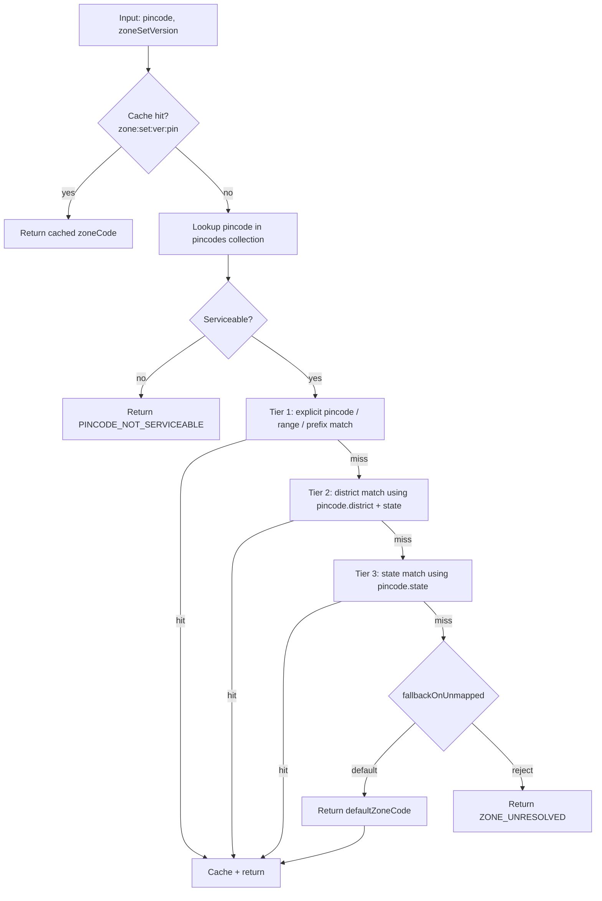
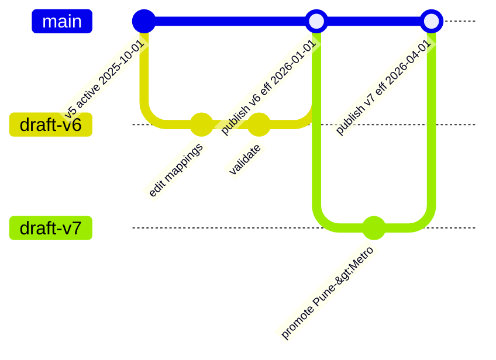
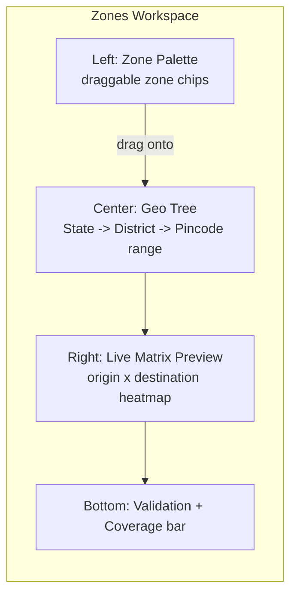

# Zone Management

Zones are the geographic abstraction that turns a raw `(origin pincode, destination pincode)` pair into a single, billable **zone key** that the rate engine can price against. Postpin lets Super Admins define an *unlimited* number of admin-named zones (Zone A, Metro, Local, North, Remote, Special, etc.), map every serviceable Indian pincode into exactly one zone through a layered mapping table (pincode-range → district → state → default), resolve `origin × destination` into a deterministic **zone matrix**, and version every definition with effective-dating so a quote issued in March is still reproducible in December. This document specifies the data model, resolution algorithm, conflict rules, versioning, bulk import/validation, the admin drag-and-drop mapping UI, and the contracts that link zones to [Rate Cards](06-rate-cards.md) and the [Shipping Engine](04-shipping-engine.md).

## Contents

- [Concepts and Vocabulary](#concepts-and-vocabulary)
- [Where Zones Sit in the Pipeline](#where-zones-sit-in-the-pipeline)
- [Data Model](#data-model)
- [Zone Mapping Sources and Precedence](#zone-mapping-sources-and-precedence)
- [Resolution Algorithm](#resolution-algorithm)
- [The Zone Matrix](#the-zone-matrix)
- [Versioning and Effective-Dating](#versioning-and-effective-dating)
- [Admin Mapping UI](#admin-mapping-ui)
- [Bulk Assignment, Import and Export](#bulk-assignment-import-and-export)
- [Validation Rules](#validation-rules)
- [Conflict Handling and Edge Cases](#conflict-handling-and-edge-cases)
- [Caching and Performance](#caching-and-performance)
- [API Surface](#api-surface)
- [Sample JSON](#sample-json)
- [Failure Handling](#failure-handling)
- [Test Matrix](#test-matrix)
- [Cross-References](#cross-references)

## Concepts and Vocabulary

| Term | Meaning |
|------|---------|
| **Zone** | An admin-defined, named geographic bucket (e.g. `metro`, `north`, `remote`). Unlimited count. Has a stable `code`, display label, color, and ordering. |
| **Zone Set** | A *named, versioned* collection of zones + mappings that belongs to a tenant (or to the global/system default). A tenant's active Zone Set is what the engine resolves against. |
| **Mapping Rule** | A single row that assigns a geographic selector (pincode, pincode-range, district, state, or `*`) to a zone, with a precedence tier. |
| **Origin Zone** | The zone resolved from the **pickup** pincode. |
| **Destination Zone** | The zone resolved from the **delivery** pincode. |
| **Zone Pair Key** | The deterministic key `originZone:destinationZone` (e.g. `metro:north`) the rate card prices against. |
| **Zone Matrix** | The full `origin × destination` lookup that maps every zone pair to a *resolved rate zone* (often collapsed, e.g. both-metro → `local`). |
| **Effective Window** | `[effectiveFrom, effectiveTo)` half-open interval during which a Zone Set version is authoritative. |
| **Serviceable Pincode** | A pincode marked deliverable in the `pincodes` collection (see [Pincode Management](03-pincode-management.md)). Every serviceable pincode MUST resolve to exactly one zone. |

> Distinction that matters: a **Zone** is *where a pincode lives*; the **Zone Matrix** is *how a from-zone and to-zone combine into the key the rate card slabs are indexed by*. Rate cards never see pincodes — only the resolved zone pair.

## Where Zones Sit in the Pipeline

Zone resolution is step 4 in the [Shipping Engine](04-shipping-engine.md) pipeline, after pincode resolution and before weight/rate-card application.

```mermaid
flowchart LR
  A[API request] --> B[Validate API key + domain]
  B --> C[Validate subscription / quota]
  C --> D[Rate limit Redis]
  D --> E[Resolve pickup pincode]
  E --> F[Resolve delivery pincode]
  F --> G{{Zone Management}}
  G --> G1[Resolve origin zone]
  G --> G2[Resolve destination zone]
  G1 --> H[Zone matrix lookup -> zonePairKey]
  G2 --> H
  H --> I[Billable weight = max actual, volumetric]
  I --> J[Apply rate card slabs keyed by zonePairKey]
  J --> K[COD + remote surcharge + fuel + GST]
  K --> L[Return JSON]
```



Zone resolution is **pure and deterministic**: given a Zone Set version and two pincodes, it always returns the same zone pair. This purity is what makes historical quotes reproducible — the engine stamps every quote with the `zoneSetVersionId` it used.

## Data Model

Collections: `zones`, `zoneSets`, `zoneMappings`, `zoneMatrices`, plus references from `rateCards`, `apiLogs`, and the quote stamp. All tenant-scoped documents carry `companyId` (the global/system default uses `companyId: null`).

### `zoneSets`

A versioned container. The tenant's `activeZoneSetId` points at the version currently authoritative *now*; historical versions remain for reproducibility.

```json
{
  "_id": "zs_01HZX...",
  "companyId": "cmp_8842",
  "name": "Default India Zones",
  "version": 7,
  "status": "active",
  "basis": "metro-tier",
  "effectiveFrom": "2026-04-01T00:00:00.000Z",
  "effectiveTo": null,
  "defaultZoneCode": "rest-of-india",
  "fallbackOnUnmapped": "default",
  "collapseRules": [
    { "when": "originZone == destinationZone", "to": "local" }
  ],
  "createdBy": "usr_admin_12",
  "createdAt": "2026-03-20T11:04:00.000Z",
  "publishedAt": "2026-03-28T09:00:00.000Z",
  "supersedesVersionId": "zs_01HZW...",
  "checksum": "sha256:8f1c...e0",
  "notes": "Added Andaman to Special; promoted Pune to Metro."
}
```

| Field | Type | Notes |
|-------|------|-------|
| `companyId` | ObjectId \| null | `null` = system/global default set, inherited unless tenant overrides. |
| `version` | int | Monotonic per `(companyId, name)`. |
| `status` | enum | `draft` → `active` → `archived`. Only one `active` per tenant at a time. |
| `effectiveFrom` / `effectiveTo` | ISODate | Half-open window. `effectiveTo: null` = open-ended (current). |
| `defaultZoneCode` | string | Catch-all zone when no rule matches a serviceable pincode. |
| `fallbackOnUnmapped` | enum | `default` (assign default zone) \| `reject` (return `ZONE_UNRESOLVED`). |
| `collapseRules` | array | Post-resolution matrix collapse (e.g. same-zone → `local`). |
| `checksum` | string | Hash over zones+mappings+matrix; used to detect drift and dedupe publishes. |
| `supersedesVersionId` | ObjectId | Chain to the previous version for audit/rollback. |

### `zones`

```json
{
  "_id": "zn_metro",
  "zoneSetId": "zs_01HZX...",
  "companyId": "cmp_8842",
  "code": "metro",
  "label": "Metro",
  "description": "Top-8 metro cities",
  "color": "#7C3AED",
  "sortOrder": 10,
  "isDefault": false,
  "isRemote": false,
  "active": true
}
```

| Field | Type | Notes |
|-------|------|-------|
| `code` | string | **Stable, lowercase, kebab/slug.** Immutable once published — rate cards key on it. Unique within a Zone Set. |
| `label` | string | Display name, freely editable. |
| `color` | string | Hex from the design palette for the matrix/heatmap UI. |
| `sortOrder` | int | Row/column order in the matrix grid. |
| `isDefault` | bool | Exactly one zone per set has `isDefault: true` (matches `zoneSets.defaultZoneCode`). |
| `isRemote` | bool | Flags remote/ODA zones; the engine reads this to apply remote-area surcharge. |

> **Hard rule:** `code` is a contract. Renaming a `label` is free; changing a `code` requires a new Zone Set version and a rate-card remap, because rate slabs reference the code (or a `(originCode,destinationCode)` matrix cell).

### `zoneMappings`

One row per selector. This is the table the drag-and-drop UI writes into.

```json
{
  "_id": "zm_01J2...",
  "zoneSetId": "zs_01HZX...",
  "companyId": "cmp_8842",
  "zoneCode": "metro",
  "tier": "pincode",
  "selector": {
    "type": "pincodeRange",
    "from": "110001",
    "to": "110096"
  },
  "priority": 1000,
  "label": "New Delhi GPO range",
  "createdBy": "usr_admin_12",
  "createdAt": "2026-03-21T08:12:00.000Z"
}
```

`selector.type` is one of:

| `selector.type` | Shape | Tier |
|-----------------|-------|------|
| `pincode` | `{ "value": "560001" }` | `pincode` (explicit override) |
| `pincodeRange` | `{ "from": "560001", "to": "560099" }` | `pincode` |
| `pincodePrefix` | `{ "prefix": "5600" }` (first N digits) | `pincode` |
| `district` | `{ "state": "KA", "district": "Bengaluru Urban" }` | `district` |
| `state` | `{ "state": "KA" }` (ISO 3166-2:IN code) | `state` |
| `wildcard` | `{ "value": "*" }` | `default` |

`tier` drives precedence (see below). `priority` is a tie-breaker **within** a tier (higher wins); the validator forbids two same-tier rules of equal priority claiming the same pincode.

### `zoneMatrices`

The precomputed `origin × destination → resolvedZone` grid for a Zone Set version. Stored denormalized for O(1) lookup and so historical matrices never re-derive.

```json
{
  "_id": "zmx_01HZX...",
  "zoneSetId": "zs_01HZX...",
  "companyId": "cmp_8842",
  "version": 7,
  "zoneCodes": ["metro", "north", "south", "east", "west", "rest-of-india", "remote", "special"],
  "cells": {
    "metro:metro": "local",
    "metro:north": "north",
    "metro:remote": "remote",
    "north:metro": "north",
    "*:special": "special",
    "special:*": "special"
  },
  "defaultCell": "rest-of-india",
  "generatedAt": "2026-03-28T09:00:00.000Z"
}
```

Cells may use literal `originCode:destCode` keys or wildcard keys (`*:special`, `special:*`). Lookup precedence is: exact cell > `origin:*` / `*:dest` wildcard > `defaultCell`. Wildcards let "anything to Andaman is Special" be expressed in one row instead of N.

## Zone Mapping Sources and Precedence

A single pincode can be claimed by rules at multiple tiers. Resolution walks tiers most-specific first and stops at the first hit.

```
explicit pincode / range / prefix   (tier: pincode)   ← highest
        ↓ (no match)
district                            (tier: district)
        ↓ (no match)
state                               (tier: state)
        ↓ (no match)
default / wildcard                  (tier: default)   ← lowest
```

| Precedence | Tier | Example rule | Wins over |
|-----------:|------|--------------|-----------|
| 1 | `pincode` | `560100 → special-sez` | everything below |
| 2 | `district` | `Bengaluru Urban → metro` | state + default |
| 3 | `state` | `KA → south` | default only |
| 4 | `default` | `* → rest-of-india` | nothing |

Within a tier, higher `priority` wins; if priority ties, the validator must have rejected the overlap at publish time, so at runtime a tie is impossible (and if it somehow occurs, resolution is deterministic by `(priority desc, createdAt asc, _id asc)` and emits a `ZONE_TIE_BREAK` warning to `auditLogs`).

## Resolution Algorithm

`resolvePincodeToZone(pincode, zoneSet)` is the core primitive. It is called twice per quote (origin, destination).



Reference implementation (TypeScript, simplified):

```ts
type Tier = 'pincode' | 'district' | 'state' | 'default';

interface ResolveResult {
  zoneCode: string;
  tier: Tier;
  ruleId: string | null;   // null when default
  zoneSetVersionId: string;
}

async function resolvePincodeToZone(
  pin: string,
  zs: ZoneSet,
): Promise<ResolveResult> {
  const cacheKey = `zone:${zs.companyId}:${zs._id}:${pin}`;
  const cached = await redis.get(cacheKey);
  if (cached) return JSON.parse(cached);

  const pc = await pincodes.findOne({ pincode: pin }); // canonical record
  if (!pc || !pc.serviceable) {
    throw new ApiError('PINCODE_NOT_SERVICEABLE', { pin });
  }

  // Tier 1 — explicit pincode / range / prefix, highest priority first
  const exact = await matchPincodeTier(zs._id, pin);          // indexed lookup
  if (exact) return cacheAndReturn(cacheKey, exact, 'pincode', zs);

  // Tier 2 — district (needs canonical district+state from pincodes record)
  const dist = await matchDistrictTier(zs._id, pc.stateCode, pc.district);
  if (dist) return cacheAndReturn(cacheKey, dist, 'district', zs);

  // Tier 3 — state
  const st = await matchStateTier(zs._id, pc.stateCode);
  if (st) return cacheAndReturn(cacheKey, st, 'state', zs);

  // Tier 4 — fallback
  if (zs.fallbackOnUnmapped === 'reject') {
    throw new ApiError('ZONE_UNRESOLVED', { pin });
  }
  return cacheAndReturn(
    cacheKey,
    { zoneCode: zs.defaultZoneCode, ruleId: null },
    'default',
    zs,
  );
}
```

**Range matching** is done with a normalized numeric comparison on the 6-digit pincode (`110001 <= n <= 110096`). Ranges are precompiled at publish time into an interval list (sorted, non-overlapping after validation) so Tier-1 lookup is a binary search, O(log n). Prefixes are stored as `[prefix*10^k, (prefix+1)*10^k - 1]` intervals so all three pincode-tier shapes share one interval engine.

### Quote-level resolution

```ts
async function resolveZonePair(originPin, destPin, zs): Promise<string> {
  const o = await resolvePincodeToZone(originPin, zs);
  const d = await resolvePincodeToZone(destPin, zs);
  const matrix = await getMatrix(zs._id);             // cached
  return lookupMatrixCell(matrix, o.zoneCode, d.zoneCode); // resolved rate zone
}
```

`lookupMatrixCell` order: exact `o:d` → `o:*` → `*:d` → `collapseRules` (e.g. same-zone) → `defaultCell`.

## The Zone Matrix

The matrix exists because shipping rates depend on the *relationship* between origin and destination, not on either alone. A Delhi→Delhi shipment ("Local") is cheaper than Delhi→Guwahati ("North/Remote"), even though the destination differs. The matrix collapses a potentially N×N zone grid into the small set of **rate zones** the rate card actually slabs against.

Example 8-zone matrix collapsed into 5 rate zones (`local`, `metro`, `regional`, `national`, `special`):

| origin ↓ \ dest → | metro | north | south | east | west | rest | remote | special |
|----|----|----|----|----|----|----|----|----|
| **metro** | local | regional | regional | national | regional | national | remote | special |
| **north** | regional | local | national | national | national | national | remote | special |
| **south** | regional | national | local | national | regional | national | remote | special |
| **east** | national | national | national | local | national | national | remote | special |
| **west** | regional | national | regional | national | local | national | remote | special |
| **rest** | national | national | national | national | national | local | remote | special |
| **remote** | remote | remote | remote | remote | remote | remote | remote | special |
| **special** | special | special | special | special | special | special | special | special |

Read it as: *"shipment from `<row>` zone to `<column>` zone is priced as `<cell>` rate zone."* The rate card then has slabs for `local`, `metro`, `regional`, `national`, `remote`, `special`. This two-level design (geographic zones → rate zones) means admins can re-bucket geography without re-pricing, and re-price without re-mapping geography.

**Determinism guarantees:**
- Every cell is materialized at publish time; there are no runtime branches that could differ between two requests.
- The matrix is content-hashed into `zoneSets.checksum`; identical inputs across versions short-circuit a republish.
- A quote stores `zoneSetVersionId` + resolved `originZone`, `destinationZone`, `rateZone`, so it can be replayed byte-for-byte.

## Versioning and Effective-Dating

Zone definitions change (a city gets promoted to Metro, a new SEZ becomes Special). Quotes issued before the change must still reproduce. We solve this with immutable, effective-dated Zone Set versions.



Rules:

1. **Drafts are mutable; published versions are immutable.** Editing a published set is impossible — you clone it to a new `draft`, edit, validate, and publish.
2. **Publish requires a clean validation run** (see [Validation Rules](#validation-rules)) and a future-or-now `effectiveFrom`.
3. **Half-open windows, no gaps, no overlaps.** Publishing v7 with `effectiveFrom = 2026-04-01` automatically sets v6's `effectiveTo = 2026-04-01` (so v6 covers `[..., 2026-04-01)` and v7 covers `[2026-04-01, ...)`). A publish that would create a gap or overlap is rejected.
4. **Resolution by date.** The engine selects the version where `effectiveFrom <= quoteTime < effectiveTo`. Live quotes use `now`; replays pass the original `quotedAt`.
5. **Quote stamping.** Every API response and `apiLogs` row records `zoneSetVersionId`, `originZone`, `destinationZone`, `rateZone`. This is the reproducibility anchor.
6. **Rollback** republishes a prior version's content as a new version (new `version` number, `notes: "rollback to v6"`) rather than mutating history — preserving the immutable chain. Mirrors the Pincode rollback model in [Pincode Management](03-pincode-management.md).

```json
{
  "quoteId": "qt_01J5...",
  "quotedAt": "2026-05-12T06:30:00.000Z",
  "zoneSetVersionId": "zs_01HZX...",
  "zoneSetVersion": 7,
  "originPincode": "110001",
  "destinationPincode": "781001",
  "originZone": "metro",
  "destinationZone": "north",
  "rateZone": "national",
  "rateCardVersionId": "rc_01J3..."
}
```

## Admin Mapping UI

Super Admin → **Zones**. Three coordinated panels, all built with the Postpin design system (Space Grotesk headings, animated Lucide icons, brand gradient, light/dark, `prefers-reduced-motion` respected).



| Region | Behavior |
|--------|----------|
| **Zone palette** (left) | Cards for each zone (color chip, label, code, count of mapped pincodes). Create/edit/reorder. Each card `data-testid="zone-chip-{zoneCode}"`. |
| **Geo tree** (center) | India → State → District → (optional) pincode ranges. Drag a zone chip onto a node to create a `zoneMapping` at the node's tier. Nodes show inherited vs explicit assignment (explicit overrides shown with a dot). Each row `data-testid="geo-node-{stateCode}-{district}"`. |
| **Matrix preview** (right) | Live `origin × destination` heatmap recomputed on every edit (debounced 300ms). Cells editable to set/collapse rate zones. `data-testid="matrix-cell-{origin}-{dest}"`. |
| **Coverage bar** (bottom) | Real-time: `X / Y serviceable pincodes mapped`, unmapped count, conflicts count, "Validate" and "Publish" buttons (`data-testid="zone-publish-btn"`). |

UI rules:
- Drag/drop writes to the **draft** Zone Set only; nothing affects live traffic until publish.
- Assigning a zone to a parent (state) cascades visually but is stored as **one** state-tier rule, not N pincode rules — keeps the table small and intent explicit.
- An explicit pincode/range override is shown as a badge on the affected district node so admins can see why a child differs from its parent.
- "Promote/Demote" quick actions move a district or city between zones in one drag, generating the correct precedence rule automatically.

## Bulk Assignment, Import and Export

For onboarding and large remaps, CSV/JSON import bypasses drag/drop.

### Import formats

CSV (one rule per row):

```csv
tier,selector,zoneCode,priority,label
pincode,110001,metro,1000,Delhi GPO
pincodeRange,560001-560099,metro,1000,Bengaluru core
pincodePrefix,7810,north,800,Guwahati area
district,KA|Bengaluru Urban,metro,500,
state,AS,north,100,
wildcard,*,rest-of-india,0,Default
```

JSON (bulk, transactional):

```json
{
  "zoneSetId": "zs_draft_01J7...",
  "mode": "replace",
  "mappings": [
    { "tier": "pincodeRange", "selector": { "from": "110001", "to": "110096" }, "zoneCode": "metro", "priority": 1000 },
    { "tier": "district", "selector": { "state": "KA", "district": "Bengaluru Urban" }, "zoneCode": "metro", "priority": 500 },
    { "tier": "state", "selector": { "state": "AS" }, "zoneCode": "north", "priority": 100 },
    { "tier": "wildcard", "selector": { "value": "*" }, "zoneCode": "rest-of-india", "priority": 0 }
  ]
}
```

| `mode` | Effect |
|--------|--------|
| `replace` | Clears the draft set's mappings, then inserts all rows (atomic; rolls back on any validation error). |
| `merge` | Upserts by `(tier, selector)`; existing untouched rows remain. |
| `delete` | Removes the listed `(tier, selector)` rows. |

Import is **staged into a draft**, validated, and previewed (diff of pincode→zone changes) before publish. A `BullMQ` job runs large imports (>50k rows) and streams progress to the UI via the same job-progress channel used by pincode sync.

### Bulk assignment shortcuts
- **Assign all unmapped → zone**: one click sweeps every currently-unmapped serviceable pincode into a chosen zone (useful to satisfy total-coverage before fine-tuning).
- **Reassign zone A → zone B**: bulk-rewrite all rules pointing at A.
- **State-wide set**: pick a state, pick a zone — generates one state-tier rule.

### Export
Export the *effective* mapping (fully resolved `pincode → zoneCode` for every serviceable pincode) as CSV/JSON for audit, or export the *rules* (the compact rule list) for backup/migration. Effective export is generated from the published matrix so it matches exactly what the engine resolves.

## Validation Rules

Validation runs on every publish (and on-demand in the UI). **Publish is blocked unless `errors == 0`.**

| Check | Severity | Rule |
|-------|----------|------|
| **Total coverage** | error | Every serviceable pincode resolves to exactly one zone. Unmapped count must be 0 *or* `defaultZone` must absorb them (when `fallbackOnUnmapped = default`). |
| **Single resolution** | error | No pincode resolves to two zones at the **same tier** with equal priority (ambiguous). |
| **Range sanity** | error | `from <= to`, both 6 digits, ranges within a tier non-overlapping after priority resolution. |
| **Default zone exists** | error | `defaultZoneCode` references an existing, active zone with `isDefault: true`. |
| **Zone code integrity** | error | Every `zoneMapping.zoneCode` and every matrix cell value references a live zone in the set. |
| **Matrix completeness** | error | Every `origin × destination` pair resolves (exact, wildcard, collapse, or `defaultCell`). |
| **Rate-card linkage** | error | Every `rateZone` produced by the matrix has at least one slab in the linked active rate card (cross-checked with [Rate Cards](06-rate-cards.md)). |
| **Immutable code change** | error | A published zone `code` cannot be altered in a republish of the same logical set without an explicit migration. |
| **Orphan rules** | warning | Rules whose selector matches zero current serviceable pincodes (e.g. a deleted district). |
| **Shadowed rules** | warning | A lower-priority rule fully shadowed by a higher one (dead rule). |
| **Remote flag drift** | warning | A zone flagged `isRemote` not referenced by any remote-surcharge rule, or vice-versa. |

Validation response:

```json
{
  "zoneSetId": "zs_draft_01J7...",
  "ok": false,
  "coverage": { "serviceable": 19324, "mapped": 19320, "unmapped": 4, "viaDefault": 0 },
  "errors": [
    { "code": "COVERAGE_GAP", "message": "4 serviceable pincodes unmapped and fallback=reject", "sample": ["744101", "744102", "744103", "744104"] }
  ],
  "warnings": [
    { "code": "ORPHAN_RULE", "message": "district KA|Yadgir matches 0 serviceable pincodes", "ruleId": "zm_01J8..." }
  ]
}
```

## Conflict Handling and Edge Cases

| Case | Handling |
|------|----------|
| **Pincode claimed at two tiers** | Most-specific tier wins (pincode > district > state > default). This is by-design layering, not a conflict. |
| **Two same-tier rules, same pincode, equal priority** | **Publish-time error** (`SAME_TIER_AMBIGUITY`). Cannot reach runtime. |
| **Two same-tier rules, same pincode, different priority** | Higher priority wins; lower is reported as `SHADOWED_RULE` warning. |
| **Overlapping ranges** | Detected at publish; if priorities differ, allowed (higher wins, overlap region flagged); if equal, error. |
| **Pincode serviceable but unmapped** | If `fallbackOnUnmapped=default` → default zone (+ `coverage.viaDefault`); if `reject` → `ZONE_UNRESOLVED` error and publish blocked unless coverage is 100%. |
| **Multi-district / multi-state pincode** | India Post data is canonical: the `pincodes` record's single `district`/`stateCode` is authoritative for district/state tiers. Genuinely shared pincodes are pinned with an explicit pincode-tier rule. |
| **New pincode appears post-publish (nightly India Post sync)** | If it falls inside an existing range/district/state rule, it auto-resolves — no republish needed. If it resolves only to default and `fallbackOnUnmapped=reject`, the nightly sync emits a `ZONE_COVERAGE_ALERT` (email + webhook from [Pincode Management](03-pincode-management.md)) so admins map it before it's quoted. |
| **Pincode marked removed by sync** | Resolution returns `PINCODE_NOT_SERVICEABLE`; its rules are kept but flagged orphan. |
| **Tenant has no Zone Set** | Falls back to the system/global default set (`companyId: null`). |
| **Quote for a past date with no version then in effect** | Returns `ZONE_VERSION_NOT_FOUND`; engine clamps to the earliest published version only if `allowClampHistorical=true` in settings. |
| **Origin or destination in `special`/`remote`** | Matrix wildcard rows (`special:*`, `*:remote`) guarantee a defined cell; engine reads `isRemote` to add remote surcharge on top of the rate-zone price. |

## Caching and Performance

| Layer | Key | TTL / Invalidation |
|-------|-----|-------------------|
| Pincode→zone (per set) | `zone:{companyId}:{zoneSetId}:{pin}` | TTL 24h; invalidated on publish of that set. |
| Matrix (per set) | `zonematrix:{zoneSetId}` | No TTL; immutable per version, evicted on archive. |
| Active set pointer | `zoneset:active:{companyId}` | TTL 5m; invalidated on publish/rollback. |
| Compiled interval index | in-process LRU | Rebuilt on set publish; keyed by `zoneSetId`. |

- Resolution is **O(log n)** per pincode (binary search over compiled intervals) + O(1) district/state hash lookups + O(1) matrix cell.
- Publish triggers a **warm-up** job that precomputes the matrix, recompiles intervals, and (optionally) pre-resolves the top-K pincodes by traffic into Redis.
- Because published versions are immutable, caches are safe to keep indefinitely — only `archived` versions get evicted.

## API Surface

Admin endpoints under `/v1/admin/zones` (Super Admin RBAC), resolution is internal to the engine but exposed as a debug endpoint.

| Method | Path | Purpose |
|--------|------|---------|
| `GET` | `/v1/admin/zone-sets` | List sets (filter by status, tenant). |
| `POST` | `/v1/admin/zone-sets` | Create a draft (optionally clone from a version). |
| `GET` | `/v1/admin/zone-sets/:id` | Fetch set + zones + mappings + matrix. |
| `POST` | `/v1/admin/zone-sets/:id/zones` | Add/edit zones. |
| `PUT` | `/v1/admin/zone-sets/:id/mappings` | Bulk replace/merge/delete mappings. |
| `POST` | `/v1/admin/zone-sets/:id/import` | CSV/JSON import (staged). |
| `GET` | `/v1/admin/zone-sets/:id/export?as=effective\|rules&format=csv\|json` | Export. |
| `POST` | `/v1/admin/zone-sets/:id/validate` | Run validation. |
| `POST` | `/v1/admin/zone-sets/:id/publish` | Validate + publish with `effectiveFrom`. |
| `POST` | `/v1/admin/zone-sets/:id/rollback` | Republish a prior version. |
| `GET` | `/v1/admin/zones/resolve?origin=110001&dest=781001&at=2026-05-12` | Debug: returns zone pair + rate zone + version used. |

Debug resolve response:

```json
{
  "zoneSetVersion": 7,
  "zoneSetVersionId": "zs_01HZX...",
  "origin": { "pincode": "110001", "zone": "metro", "tier": "pincode", "ruleId": "zm_delhi" },
  "destination": { "pincode": "781001", "zone": "north", "tier": "pincodePrefix", "ruleId": "zm_ghy" },
  "rateZone": "national",
  "isRemoteDestination": false
}
```

## Sample JSON

A complete, realistic 8-zone India set (abridged mappings):

```json
{
  "zoneSet": {
    "name": "Default India Zones",
    "version": 7,
    "status": "active",
    "defaultZoneCode": "rest-of-india",
    "fallbackOnUnmapped": "default",
    "effectiveFrom": "2026-04-01T00:00:00.000Z",
    "effectiveTo": null,
    "collapseRules": [{ "when": "originZone == destinationZone", "to": "local" }]
  },
  "zones": [
    { "code": "metro",          "label": "Metro",        "color": "#7C3AED", "sortOrder": 10, "isDefault": false, "isRemote": false },
    { "code": "north",          "label": "North",        "color": "#2563EB", "sortOrder": 20, "isDefault": false, "isRemote": false },
    { "code": "south",          "label": "South",        "color": "#16A34A", "sortOrder": 30, "isDefault": false, "isRemote": false },
    { "code": "east",           "label": "East",         "color": "#D97706", "sortOrder": 40, "isDefault": false, "isRemote": false },
    { "code": "west",           "label": "West",         "color": "#DB2777", "sortOrder": 50, "isDefault": false, "isRemote": false },
    { "code": "rest-of-india",  "label": "Rest of India","color": "#9333EA", "sortOrder": 60, "isDefault": true,  "isRemote": false },
    { "code": "remote",         "label": "Remote / ODA", "color": "#DC2626", "sortOrder": 70, "isDefault": false, "isRemote": true },
    { "code": "special",        "label": "Special (NE/Islands)", "color": "#0EA5E9", "sortOrder": 80, "isDefault": false, "isRemote": true }
  ],
  "mappings": [
    { "tier": "pincodeRange", "selector": { "from": "110001", "to": "110096" }, "zoneCode": "metro", "priority": 1000, "label": "New Delhi" },
    { "tier": "pincodeRange", "selector": { "from": "400001", "to": "400104" }, "zoneCode": "metro", "priority": 1000, "label": "Mumbai" },
    { "tier": "pincodeRange", "selector": { "from": "560001", "to": "560300" }, "zoneCode": "metro", "priority": 1000, "label": "Bengaluru" },
    { "tier": "pincodeRange", "selector": { "from": "700001", "to": "700156" }, "zoneCode": "metro", "priority": 1000, "label": "Kolkata" },
    { "tier": "pincode",      "selector": { "value": "600001" },               "zoneCode": "metro", "priority": 1100, "label": "Chennai GPO override" },
    { "tier": "state",        "selector": { "state": "PB" }, "zoneCode": "north", "priority": 100 },
    { "tier": "state",        "selector": { "state": "HR" }, "zoneCode": "north", "priority": 100 },
    { "tier": "state",        "selector": { "state": "RJ" }, "zoneCode": "north", "priority": 100 },
    { "tier": "state",        "selector": { "state": "TN" }, "zoneCode": "south", "priority": 100 },
    { "tier": "state",        "selector": { "state": "KL" }, "zoneCode": "south", "priority": 100 },
    { "tier": "state",        "selector": { "state": "WB" }, "zoneCode": "east",  "priority": 100 },
    { "tier": "state",        "selector": { "state": "OD" }, "zoneCode": "east",  "priority": 100 },
    { "tier": "state",        "selector": { "state": "MH" }, "zoneCode": "west",  "priority": 100 },
    { "tier": "state",        "selector": { "state": "GJ" }, "zoneCode": "west",  "priority": 100 },
    { "tier": "pincodePrefix","selector": { "prefix": "744" }, "zoneCode": "special", "priority": 900, "label": "Andaman & Nicobar" },
    { "tier": "pincodePrefix","selector": { "prefix": "682" }, "zoneCode": "special", "priority": 900, "label": "Lakshadweep" },
    { "tier": "state",        "selector": { "state": "AS" }, "zoneCode": "north",   "priority": 100 },
    { "tier": "state",        "selector": { "state": "AR" }, "zoneCode": "special", "priority": 120 },
    { "tier": "state",        "selector": { "state": "NL" }, "zoneCode": "special", "priority": 120 },
    { "tier": "state",        "selector": { "state": "MN" }, "zoneCode": "special", "priority": 120 },
    { "tier": "wildcard",     "selector": { "value": "*" },  "zoneCode": "rest-of-india", "priority": 0 }
  ]
}
```

Corresponding matrix (rate zones `local`, `regional`, `national`, `remote`, `special`):

```json
{
  "zoneCodes": ["metro","north","south","east","west","rest-of-india","remote","special"],
  "defaultCell": "national",
  "cells": {
    "metro:metro": "local",
    "metro:west": "regional", "west:metro": "regional",
    "south:south": "local", "north:north": "local",
    "metro:north": "regional", "metro:south": "regional",
    "*:remote": "remote", "remote:*": "remote",
    "*:special": "special", "special:*": "special"
  },
  "collapseRules": [{ "when": "originZone == destinationZone", "to": "local" }]
}
```

Worked example — `110001 (New Delhi) → 781001 (Guwahati, Assam)`:

1. Origin `110001`: Tier-1 range `110001–110096` → `metro`.
2. Destination `781001`: no pincode rule; `pincodes` record gives `stateCode = AS` → Tier-3 state rule `AS → north`.
3. Matrix `metro:north` → no exact cell → falls to `defaultCell` `national`. (If a `metro:north` cell existed it would win.)
4. `rateZone = national`, `isRemoteDestination = false`.
5. Rate engine prices the `national` slab for billable weight; no remote surcharge.

## Failure Handling

| Failure | Engine behavior | HTTP / code |
|---------|-----------------|-------------|
| Origin/dest pincode not serviceable | Abort quote | `422 PINCODE_NOT_SERVICEABLE` |
| Pincode unmapped + `fallbackOnUnmapped=reject` | Abort quote | `422 ZONE_UNRESOLVED` |
| No Zone Set version effective at quote time | Abort (or clamp if enabled) | `409 ZONE_VERSION_NOT_FOUND` |
| Matrix cell missing (should be impossible post-validation) | Use `defaultCell`, emit `auditLogs` anomaly | `200` + warning header |
| Rate zone has no rate-card slab | Abort quote | `409 RATE_ZONE_UNPRICED` |
| Redis cache unavailable | Resolve directly from Mongo (slower), log degraded mode | `200` (degraded) |
| Mongo read failure during resolution | Abort with retryable error | `503 ZONE_LOOKUP_FAILED` |
| Publish with coverage gap | Reject publish | `400 COVERAGE_GAP` |
| Publish creating effective-window overlap/gap | Reject publish | `400 EFFECTIVE_WINDOW_CONFLICT` |

All resolution anomalies (tie-breaks, default-fallbacks, degraded mode) are written to `auditLogs` with `zoneSetVersionId`, the two pincodes, and the chosen path, so support can reproduce any quote.

## Test Matrix

| Scenario | Input | Expected |
|----------|-------|----------|
| Explicit override beats district | `600001` (Chennai GPO override → metro) vs TN→south | `metro` |
| District beats state | district `Bengaluru Urban → metro`, state `KA → south`, pin in Bengaluru | `metro` |
| State fallback | pin in Punjab with no pincode/district rule | `north` |
| Default fallback | unmapped serviceable pin, `fallback=default` | `rest-of-india` |
| Reject fallback | unmapped serviceable pin, `fallback=reject` | `ZONE_UNRESOLVED` |
| Same-zone collapse | `110001 → 110011` (metro→metro) | rate zone `local` |
| Wildcard destination | `400001 → 744101` (special) | rate zone `special` |
| Historical replay | quote at `2026-02-10` against v6 vs live v7 | uses v6, reproduces original |
| New synced pincode inside range | India Post adds `560305` inside `560001–560300`? (outside range) | resolves to default → coverage alert |
| Range binary search | `560150` within `560001–560300` | `metro`, tier `pincode` |
| Publish blocked on gap | 4 unmapped + `fallback=reject` | publish rejected, `COVERAGE_GAP` |

## Cross-References

- [Shipping Engine](04-shipping-engine.md) — calls `resolveZonePair` and consumes `rateZone` + `isRemote`.
- [Rate Cards](06-rate-cards.md) — slabs are keyed by the `rateZone` this module emits; zone codes are the join key.
- [Pincode Management](03-pincode-management.md) — canonical `pincodes` records (serviceability, `stateCode`, `district`) feed district/state tiers; nightly India Post sync triggers coverage alerts. Sources: `api.postalpincode.in`, All-India Pincode Directory on `data.gov.in`.
- [Data Model & Collections](02-data-model.md) — `zones`, `zoneSets`, `zoneMappings`, `zoneMatrices`, `auditLogs`.
