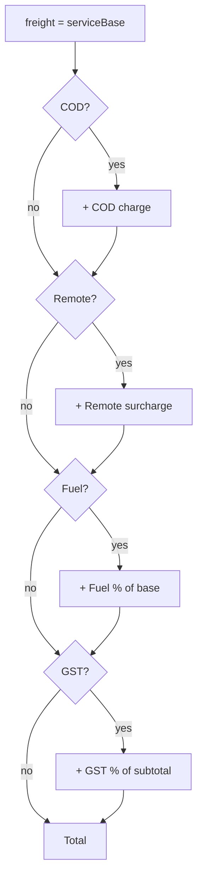
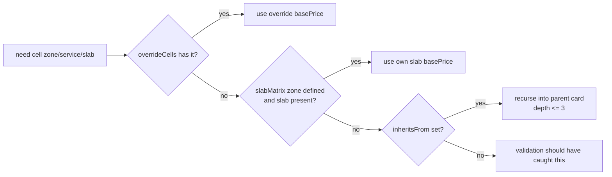
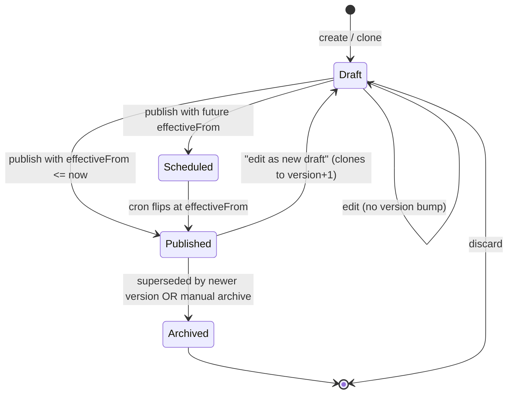
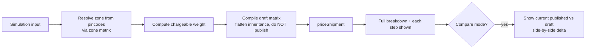
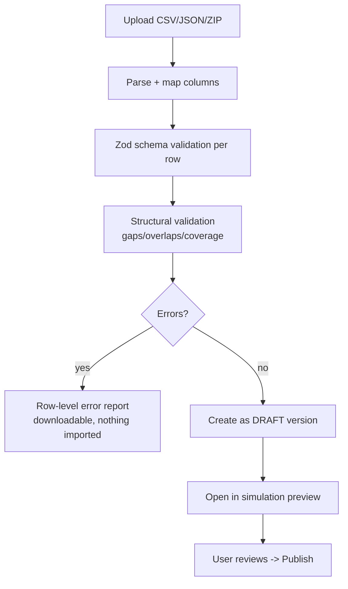
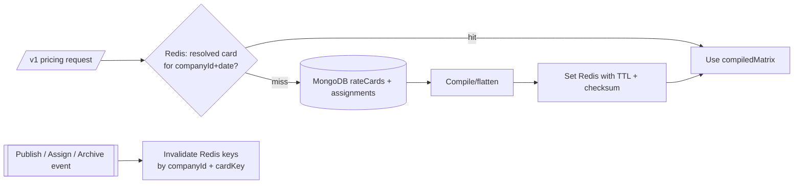

# Rate Card Builder & Per-Customer Pricing

The Rate Card Builder replaces hardcoded price tables with a first-class, versioned pricing model that drives every shipping-charge calculation Postpin returns. A rate card binds **zone → weight-slab → price** rules, layers in **service-level multipliers** and **surcharges** (COD, fuel, remote, GST), and is **assigned per customer** (Company A, B, C) with inheritance from a **default/global card**. Cards support **draft → published** lifecycle, **effective dates**, **immutable version history** for audit, a **simulation/preview** tool that prices a hypothetical shipment before publishing, **structural validation** (no slab gaps/overlaps, every zone covered), and **bulk import/export**. This document is the build-from spec: data model, resolution algorithm, validation rules, APIs, UI surfaces, edge cases, and failure handling.

## Contents

1. [Scope & Relationship to the Engine](#1-scope--relationship-to-the-engine)
2. [Core Concepts & Glossary](#2-core-concepts--glossary)
3. [Data Model](#3-data-model)
4. [Sample Rate-Card JSON](#4-sample-rate-card-json)
5. [Weight Slab Model](#5-weight-slab-model)
6. [Service Levels & Multipliers](#6-service-levels--multipliers)
7. [Surcharge Configuration](#7-surcharge-configuration)
8. [Card Resolution: Customer-specific > Segment > Default](#8-card-resolution-customer-specific--segment--default)
9. [Inheritance & Override](#9-inheritance--override)
10. [Lifecycle: Draft, Published, Effective Dates, Versioning](#10-lifecycle-draft-published-effective-dates-versioning)
11. [Pricing Computation (the math)](#11-pricing-computation-the-math)
12. [Validation Rules](#12-validation-rules)
13. [Simulation / Preview Tool](#13-simulation--preview-tool)
14. [Bulk Import / Export](#14-bulk-import--export)
15. [REST API Surface](#15-rest-api-surface)
16. [Super Admin & User Dashboard UI](#16-super-admin--user-dashboard-ui)
17. [Caching, Performance & Invalidation](#17-caching-performance--invalidation)
18. [Edge Cases & Failure Handling](#18-edge-cases--failure-handling)
19. [Audit, Permissions & Security](#19-audit-permissions--security)

---

## 1. Scope & Relationship to the Engine

The Rate Card Builder owns **pricing definition and lifecycle**. The runtime [Shipping Engine](04-shipping-engine.md) owns **pricing execution**: it asks the resolver for the correct card given a request context, then applies that card to the chargeable weight. Zone resolution is owned by [Zones & Pincodes](05-zones-and-pincodes.md); the rate card only references zone IDs/codes. Quota and API-key validation precede pricing and are covered in [API Keys & Quota](03-api-keys-and-quota.md).

```mermaid
flowchart LR
  A[API request] --> B[Validate key / quota / rate limit]
  B --> C[Resolve pickup + delivery pincode]
  C --> D[Find zone via zone matrix]
  D --> E[Compute chargeable weight<br/>max(actual, volumetric)]
  E --> F{{Rate Card Resolver}}
  F -->|customer-specific > segment > default| G[Selected published card<br/>effective today]
  G --> H[Apply zone + weight slab]
  H --> I[Service-level multiplier]
  I --> J[Surcharges: COD, remote, fuel, GST]
  J --> K[Price breakdown JSON]

  style F fill:#7C3AED,color:#fff
  style G fill:#9333EA,color:#fff
```

The boundary is strict: **the engine never reads draft cards, never picks a card by date arithmetic on its own, and never mutates a card.** It calls `resolveRateCard(ctx)` and `priceShipment(card, shipment)`, both pure read operations against a warm cache.

---

## 2. Core Concepts & Glossary

| Term | Meaning |
|---|---|
| **Rate Card** | A named, versioned pricing definition: zones × weight slabs × service levels × surcharges, owned by a tenant or by the platform (global). |
| **Zone** | Logical distance band between pickup and delivery (e.g. `local`, `regional`, `metro`, `roi` = rest-of-India, `special` = NE/J&K/islands). Defined in [Zones & Pincodes](05-zones-and-pincodes.md). |
| **Weight Slab** | A `[fromGrams, toGrams)` band with a flat base price plus an optional per-additional-step rate beyond the last bounded slab. |
| **Service Level** | A speed/SLA tier (`surface`, `express`, `priority`) applied as a multiplier and/or additive offset on the base zone price. |
| **Surcharge** | Conditional add-on: COD fee, fuel %, remote-area, GST. |
| **Default / Global Card** | The platform-owned baseline (`scope: "global"`) used when a tenant has no card of their own. |
| **Segment Card** | A card assigned to a customer *segment* (e.g. `plan:enterprise`, `tag:high-volume`) rather than a single company. |
| **Customer (tenant) Card** | A card assigned to a specific `companyId`. |
| **Inheritance** | A card may declare `inheritsFrom: <cardId>` and override only specific cells; unspecified cells fall through to the parent. |
| **Version** | Immutable snapshot. Publishing creates `version+1` and supersedes the prior active version on its `effectiveFrom`. |
| **Chargeable / Billable Weight** | `max(actualWeightKg, volumetricWeightKg)` where `volumetric = L*W*H(cm) / divisor` (divisor 5000 default). |

---

## 3. Data Model

Primary collection: **`rateCards`**. Each document is a single *version* of a card. The logical "card" is identified by `cardKey` (stable across versions); `version` increments. An index on `{ cardKey, version }` is unique; `{ cardKey, status, effectiveFrom }` powers resolution.

### `rateCards` document

```json
{
  "_id": "rc_01HV9...",
  "cardKey": "card_companyA_domestic",
  "version": 7,
  "name": "Company A — Domestic Surface & Express",
  "description": "Negotiated rates for Acme Retail Pvt Ltd",
  "scope": "tenant",
  "companyId": "comp_acme_8821",
  "segment": null,
  "inheritsFrom": "card_global_default",
  "currency": "INR",
  "status": "published",
  "effectiveFrom": "2026-07-01T00:00:00+05:30",
  "effectiveTo": null,
  "weightUnit": "g",
  "volumetricDivisor": 5000,
  "roundingRule": "nearest_rupee",
  "zones": ["local", "regional", "metro", "roi", "special"],
  "serviceLevels": [
    { "code": "surface",  "label": "Surface",  "multiplier": 1.0,  "flatAdd": 0,  "minCharge": 0 },
    { "code": "express",  "label": "Express",  "multiplier": 1.6,  "flatAdd": 20, "minCharge": 60 },
    { "code": "priority", "label": "Priority", "multiplier": 2.2,  "flatAdd": 45, "minCharge": 90 }
  ],
  "slabMatrix": {
    "local":    [ /* see Slab Model */ ],
    "regional": [],
    "metro":    [],
    "roi":      [],
    "special":  []
  },
  "surcharges": {
    "cod":    { "enabled": true,  "type": "max_of", "flat": 35, "percent": 1.8, "appliesToServiceLevels": ["surface","express","priority"] },
    "fuel":   { "enabled": true,  "percent": 14.0, "base": "freight_plus_cod" },
    "remote": { "enabled": true,  "flat": 30, "percent": 0, "zoneScope": ["special","roi"], "pincodeListId": "remote_set_2026q3" },
    "gst":    { "enabled": true,  "percent": 18.0, "base": "freight_plus_all_surcharges", "inclusive": false }
  },
  "overrideCells": {
    "metro:express:1001-2000": { "basePrice": 130 }
  },
  "publishedBy": "usr_admin_22",
  "publishedAt": "2026-06-20T11:04:33+05:30",
  "createdFromVersion": 6,
  "changeNote": "Diwali peak: +12% express metro, fuel 12% -> 14%",
  "checksum": "sha256:9f1c...",
  "createdAt": "2026-06-20T10:58:00+05:30",
  "updatedAt": "2026-06-20T11:04:33+05:30"
}
```

### Field reference

| Field | Type | Notes |
|---|---|---|
| `cardKey` | string | Stable logical id across versions. Slug-safe. |
| `version` | int | Monotonic per `cardKey`. Drafts may share a version number until published; see lifecycle. |
| `scope` | enum | `global` \| `segment` \| `tenant`. Controls resolution precedence. |
| `companyId` | string \| null | Required when `scope=tenant`. |
| `segment` | object \| null | e.g. `{ "type": "plan", "value": "enterprise" }`. Required when `scope=segment`. |
| `inheritsFrom` | string \| null | `cardKey` of parent for cell-level fallthrough. Must not form a cycle; max depth 3. |
| `status` | enum | `draft` \| `published` \| `archived` \| `scheduled`. |
| `effectiveFrom` / `effectiveTo` | ISO datetime (IST) | `effectiveTo=null` means open-ended until superseded. |
| `volumetricDivisor` | int | Default 5000; per-card override allowed (some couriers use 4000). |
| `roundingRule` | enum | `none` \| `nearest_rupee` \| `ceil_rupee` \| `nearest_50p`. Applied once, at the end. |
| `slabMatrix` | object | `zone -> Slab[]`. Every zone in `zones` must have a covering slab set (validation). |
| `serviceLevels` | array | At least one; `multiplier > 0`. |
| `surcharges` | object | See [§7](#7-surcharge-configuration). |
| `overrideCells` | object | Sparse map keyed `zone:service:fromTo` for surgical overrides without rewriting the slab. |
| `checksum` | string | Content hash of normalized pricing payload — used for dedupe and to detect drift between cache and DB. |

### Related collections

| Collection | Purpose |
|---|---|
| `rateCardAssignments` | Maps `companyId`/`segment` → `cardKey` with priority. Decouples assignment from the card document so re-pointing a customer is one write, not a card edit. |
| `rateCardVersions` | (Optional materialized view) flat list `{cardKey, version, status, effectiveFrom, publishedBy, changeNote}` for fast history UI. |
| `rateCardSimulations` | Saved simulation runs (input shipment + computed breakdown + cardKey/version) for QA and customer-facing "rate explainer". |
| `auditLogs` | Every create/edit/publish/archive/assign event (see [§19](#19-audit-permissions--security)). |

### `rateCardAssignments` document

```json
{
  "_id": "asg_01HV...",
  "type": "tenant",
  "companyId": "comp_acme_8821",
  "segment": null,
  "cardKey": "card_companyA_domestic",
  "priority": 100,
  "enabled": true,
  "effectiveFrom": "2026-07-01T00:00:00+05:30",
  "effectiveTo": null,
  "createdAt": "2026-06-20T11:05:00+05:30"
}
```

Assignment precedence is `priority` DESC then `type` rank (`tenant=3, segment=2, global=1`).

---

## 4. Sample Rate-Card JSON

A compact, fully populated example for one zone showing the slab array the engine consumes. The slab table in [§5](#5-weight-slab-model) renders the same data.

```json
{
  "cardKey": "card_global_default",
  "version": 12,
  "name": "Postpin Global Default",
  "scope": "global",
  "currency": "INR",
  "status": "published",
  "effectiveFrom": "2026-04-01T00:00:00+05:30",
  "volumetricDivisor": 5000,
  "roundingRule": "nearest_rupee",
  "zones": ["local", "regional", "metro", "roi", "special"],
  "serviceLevels": [
    { "code": "surface", "label": "Surface", "multiplier": 1.0, "flatAdd": 0, "minCharge": 0 },
    { "code": "express", "label": "Express", "multiplier": 1.6, "flatAdd": 20, "minCharge": 60 }
  ],
  "slabMatrix": {
    "local": [
      { "fromGrams": 0,    "toGrams": 500,  "basePrice": 40 },
      { "fromGrams": 500,  "toGrams": 1000, "basePrice": 55 },
      { "fromGrams": 1000, "toGrams": 2000, "basePrice": 70 },
      { "fromGrams": 2000, "toGrams": null, "basePrice": 70, "extraStepGrams": 500, "extraStepPrice": 18 }
    ],
    "regional": [
      { "fromGrams": 0,    "toGrams": 500,  "basePrice": 48 },
      { "fromGrams": 500,  "toGrams": 1000, "basePrice": 66 },
      { "fromGrams": 1000, "toGrams": 2000, "basePrice": 88 },
      { "fromGrams": 2000, "toGrams": null, "basePrice": 88, "extraStepGrams": 500, "extraStepPrice": 24 }
    ],
    "metro": [
      { "fromGrams": 0,    "toGrams": 500,  "basePrice": 52 },
      { "fromGrams": 500,  "toGrams": 1000, "basePrice": 72 },
      { "fromGrams": 1000, "toGrams": 2000, "basePrice": 96 },
      { "fromGrams": 2000, "toGrams": null, "basePrice": 96, "extraStepGrams": 500, "extraStepPrice": 26 }
    ],
    "roi": [
      { "fromGrams": 0,    "toGrams": 500,  "basePrice": 58 },
      { "fromGrams": 500,  "toGrams": 1000, "basePrice": 82 },
      { "fromGrams": 1000, "toGrams": 2000, "basePrice": 110 },
      { "fromGrams": 2000, "toGrams": null, "basePrice": 110, "extraStepGrams": 500, "extraStepPrice": 32 }
    ],
    "special": [
      { "fromGrams": 0,    "toGrams": 500,  "basePrice": 72 },
      { "fromGrams": 500,  "toGrams": 1000, "basePrice": 104 },
      { "fromGrams": 1000, "toGrams": 2000, "basePrice": 140 },
      { "fromGrams": 2000, "toGrams": null, "basePrice": 140, "extraStepGrams": 500, "extraStepPrice": 40 }
    ]
  },
  "surcharges": {
    "cod":    { "enabled": true, "type": "max_of", "flat": 35, "percent": 1.8 },
    "fuel":   { "enabled": true, "percent": 12.0, "base": "freight_plus_cod" },
    "remote": { "enabled": true, "flat": 30, "zoneScope": ["special"] },
    "gst":    { "enabled": true, "percent": 18.0, "base": "freight_plus_all_surcharges", "inclusive": false }
  }
}
```

---

## 5. Weight Slab Model

A slab is a half-open interval `[fromGrams, toGrams)` so adjacent slabs share a boundary without overlap. The last slab uses `toGrams: null` (open-ended) and defines `extraStepGrams` + `extraStepPrice` for weight beyond its `fromGrams`.

### Slab object

```json
{ "fromGrams": 1000, "toGrams": 2000, "basePrice": 70, "extraStepGrams": null, "extraStepPrice": null }
```

| Field | Meaning |
|---|---|
| `fromGrams` | Inclusive lower bound. First slab MUST start at `0`. |
| `toGrams` | Exclusive upper bound. `null` only on the final, open-ended slab. |
| `basePrice` | Flat INR for any chargeable weight landing in this slab. |
| `extraStepGrams` | Step size for overflow beyond an open-ended slab (e.g. 500). |
| `extraStepPrice` | INR per started step. Billed on `ceil((weight - fromGrams) / extraStepGrams)`. |

### The required default slab table (per the spec)

These are the canonical starter slabs (zone-agnostic example using the `local` column):

| Weight band | Rule | Base price (INR) |
|---|---|---|
| 0 – 500 g | flat | ₹40 |
| 501 – 1000 g | flat | ₹55 |
| 1001 – 2000 g | flat | ₹70 |
| > 2000 g | ₹70 + ₹18 per additional 500 g (started) | ₹70 + 18·⌈(w−2000)/500⌉ |

Worked example, `local` zone, surface, **3.2 kg** chargeable:

```
slab           = open-ended ( fromGrams = 2000 )
overflowGrams  = 3200 - 2000 = 1200
steps          = ceil(1200 / 500) = 3
freightBase    = 70 + (3 * 18) = 70 + 54 = ₹124
```

### Boundary semantics (must be implemented exactly)

- Lookup uses `fromGrams <= w < toGrams`. A package at exactly **500 g** falls in the **0–500** slab? No — 500 is the **exclusive** top of the first slab, so 500 g maps to the **500–1000** slab. The human-readable label "0–500g = ₹40" means **up to and including 499 g**; document this to customers as **"first 500 g"** by setting `fromGrams:0,toGrams:500` and treating `w<500`. To bill the round-number 500 g at ₹40, set the first slab `toGrams: 501`. **Pick one convention per platform and lock it in validation.** Postpin's locked convention: **half-open `[from, to)` with the boundary belonging to the upper slab**, and customer-facing labels render as `from`–`(to-1)` grams.

---

## 6. Service Levels & Multipliers

Service levels modify the zone+slab base price. Applied as: `serviceBase = basePrice * multiplier + flatAdd`, then floored at `minCharge`.

| Code | Multiplier | flatAdd | minCharge | Example on ₹70 base |
|---|---|---|---|---|
| `surface` | 1.0 | ₹0 | ₹0 | ₹70 |
| `express` | 1.6 | ₹20 | ₹60 | 70·1.6 + 20 = ₹132 |
| `priority` | 2.2 | ₹45 | ₹90 | 70·2.2 + 45 = ₹199 |

Rules:
- `multiplier` must be `> 0`. `flatAdd >= 0`. `minCharge >= 0`.
- If a requested `service` is not present on the card, the engine returns `SERVICE_NOT_AVAILABLE` (it does **not** silently fall back to surface).
- `overrideCells` can replace the computed `serviceBase` for a specific `zone:service:slab` cell, bypassing the multiplier for that cell only.

---

## 7. Surcharge Configuration

Surcharges apply **after** freight (zone+slab+service) is computed, in a fixed order so the GST base is deterministic.



### COD

```json
{ "enabled": true, "type": "max_of", "flat": 35, "percent": 1.8, "appliesToServiceLevels": ["surface","express","priority"] }
```
- `type`: `flat` | `percent` | `max_of` | `sum_of`. `max_of` → `max(flat, percent% of orderValue)`. `percent` is of `orderValue` (declared shipment value), **not** freight. Requires `orderValue` in the request when COD selected; if missing, fall back to `flat` and flag `cod_value_missing`.
- Only added when `paymentType == "COD"`.

### Fuel
```json
{ "enabled": true, "percent": 14.0, "base": "freight_plus_cod" }
```
- `base`: `freight_only` | `freight_plus_cod`. Percent surcharge on the chosen base. Fuel % is the most-frequently-tuned field (monthly), so it is exposed prominently in the editor and bulk-updatable.

### Remote / ODA (Out of Delivery Area)
```json
{ "enabled": true, "flat": 30, "percent": 0, "zoneScope": ["special","roi"], "pincodeListId": "remote_set_2026q3" }
```
- Applied when the **delivery pincode** is in `pincodeListId` (a managed set, synced alongside pincode data) OR the resolved zone is in `zoneScope`. Combine as configured (`mode: "zone_or_list" | "list_only" | "zone_only"`, default `zone_or_list`).

### GST
```json
{ "enabled": true, "percent": 18.0, "base": "freight_plus_all_surcharges", "inclusive": false }
```
- `inclusive:false` → GST added on top. `inclusive:true` → quoted price already contains GST; engine back-computes the pre-tax component for the breakdown. Default 18%. Per-card toggle so B2B customers who handle their own tax can disable it.

---

## 8. Card Resolution: Customer-specific > Segment > Default

Given a request context, the resolver selects **exactly one** card version.

```mermaid
flowchart TD
  S([resolveRateCard ctx]) --> A[Build candidate set from rateCardAssignments<br/>where enabled and effective today]
  A --> B{Tenant assignment<br/>for companyId?}
  B -->|yes| T[Take highest-priority tenant card]
  B -->|no| C{Segment assignment<br/>matching company plan/tag?}
  C -->|yes| SG[Take highest-priority segment card]
  C -->|no| D[Global default card]
  T --> V[Resolve to published version<br/>effectiveFrom <= now and<br/>(effectiveTo is null or > now)]
  SG --> V
  D --> V
  V --> E{Version found?}
  E -->|yes| OK([return card+version])
  E -->|no| F[Fallback chain:<br/>tenant->segment->global]
  F --> G{Any usable?}
  G -->|yes| OK
  G -->|no| ERR([NO_RATE_CARD error])
```

### Resolution algorithm (pseudocode)

```ts
function resolveRateCard(ctx: { companyId: string; plan?: string; tags?: string[]; at?: Date }): ResolvedCard {
  const now = ctx.at ?? new Date();

  // 1. Gather enabled, currently-effective assignments
  const assigns = getAssignments({ companyId: ctx.companyId, plan: ctx.plan, tags: ctx.tags })
    .filter(a => a.enabled && effective(a, now));

  // 2. Rank: tenant(3) > segment(2) > global(1); tie-break by priority DESC, then effectiveFrom DESC
  const ranked = assigns.sort(byScopeRankThenPriorityThenRecency);

  // 3. Walk candidates; pick the first whose published version is effective now
  for (const a of [...ranked, GLOBAL_DEFAULT_ASSIGNMENT]) {
    const version = getEffectivePublishedVersion(a.cardKey, now); // status=published, date window matches
    if (version) return { cardKey: a.cardKey, version, source: a.type };
  }

  throw new EngineError("NO_RATE_CARD", { companyId: ctx.companyId });
}
```

Key guarantees:
- **Deterministic**: same context + same instant → same card. Ties are broken by explicit, total ordering.
- **Always resolves or errors loudly**: there is always a `GLOBAL_DEFAULT_ASSIGNMENT`. If even that has no effective published version, the engine returns a hard `NO_RATE_CARD` (HTTP 422) rather than guessing.
- **No draft leakage**: `getEffectivePublishedVersion` filters `status == "published"`.

---

## 9. Inheritance & Override

A card can declare `inheritsFrom: <parentCardKey>` for **cell-level fallthrough**. This lets Company A keep 95% of the global defaults and override only 3 cells, instead of cloning the entire matrix.

Resolution of a single cell `(zone, service, slab)`:



Rules:
- **Max inheritance depth 3.** Cycles are rejected at save time (DFS over `inheritsFrom`).
- A child **may add** zones/service levels the parent lacks, but resolved coverage (own + inherited) must still pass full validation ([§12](#12-validation-rules)).
- `volumetricDivisor`, `roundingRule`, `currency`, and `surcharges` are **not** inherited cell-by-cell; they are taken wholesale from the resolved leaf card (the child). If the child omits a surcharge block, that surcharge is **off** (explicit), not inherited — to avoid surprise charges. Document this clearly in the editor ("Surcharges are not inherited").
- Effective pricing is always **flattened** at publish time into a `compiledMatrix` (denormalized full matrix) stored on the version, so the runtime never walks inheritance per request. Inheritance is an authoring convenience; the published artifact is self-contained.

```json
{
  "compiledMatrix": {
    "metro:express:0-500": 83,
    "metro:express:500-1000": 115,
    "metro:express:1001-2000": 130,
    "...": "..."
  },
  "compiledFrom": ["card_companyA_domestic@7", "card_global_default@12"]
}
```

---

## 10. Lifecycle: Draft, Published, Effective Dates, Versioning



| Status | Visible to engine? | Mutable? |
|---|---|---|
| `draft` | No | Yes — edits do **not** bump version |
| `scheduled` | No (until `effectiveFrom`) | No — clone to edit |
| `published` | Yes (within date window) | No — immutable snapshot |
| `archived` | No | No |

Rules:
- **Publishing is atomic and creates an immutable version.** The act: validate → compile matrix → set `version = max(version)+1` → `status=published` (or `scheduled`) → set previous active version's `effectiveTo = newCard.effectiveFrom` → write `checksum` → emit `auditLog`.
- **Effective dating**: a card with `effectiveFrom` in the future is `scheduled`; a 00:30-adjacent cron (`rate-card-activator`, see [Cron & Jobs](08-jobs-and-cron.md)) flips `scheduled → published` and demotes the predecessor. The runtime resolver also guards by date, so even without the cron, an effective-future card never prices live traffic.
- **No overlapping effective windows** for the same `cardKey` among published versions — enforced at publish ([§12](#12-validation-rules)).
- **Rollback** = re-publish a prior version as a new version (`createdFromVersion`), preserving the immutable chain. We never resurrect an old document in place.
- **Version diff**: the UI shows a cell-level diff between any two versions (added/removed/changed slabs, surcharge deltas) driven by `compiledMatrix` comparison.

---

## 11. Pricing Computation (the math)

The deterministic function the engine runs. All money is computed in **paise (integer)** internally to avoid float drift, then rounded once.

```ts
function priceShipment(card: CompiledCard, s: Shipment): PriceBreakdown {
  // 1. Chargeable weight
  const volumetricKg = (s.lengthCm * s.widthCm * s.heightCm) / card.volumetricDivisor;
  const chargeableKg = Math.max(s.actualWeightKg, volumetricKg);
  const chargeableG  = Math.round(chargeableKg * 1000);

  // 2. Zone (resolved upstream) -> slab lookup
  const slabs = card.slabMatrix[s.zone];
  if (!slabs) throw new EngineError("ZONE_NOT_IN_CARD", { zone: s.zone });
  const slab = slabs.find(sl => chargeableG >= sl.fromGrams && (sl.toGrams === null || chargeableG < sl.toGrams));
  if (!slab) throw new EngineError("WEIGHT_OUT_OF_RANGE", { chargeableG });

  // 3. Base freight from slab (+ overflow steps if open-ended)
  let basePaise = toPaise(slab.basePrice);
  if (slab.toGrams === null && chargeableG > slab.fromGrams) {
    const steps = Math.ceil((chargeableG - slab.fromGrams) / slab.extraStepGrams);
    basePaise += steps * toPaise(slab.extraStepPrice);
  }

  // 4. Service level
  const sl = card.serviceLevels.find(x => x.code === s.service);
  if (!sl) throw new EngineError("SERVICE_NOT_AVAILABLE", { service: s.service });
  let freight = Math.round(basePaise * sl.multiplier) + toPaise(sl.flatAdd);
  freight = Math.max(freight, toPaise(sl.minCharge));

  // 5. Surcharges (fixed order)
  const cod    = s.paymentType === "COD" ? codCharge(card.surcharges.cod, s.orderValue) : 0;
  const remote = remoteCharge(card.surcharges.remote, s.zone, s.deliveryPincode);
  const fuelBase = card.surcharges.fuel?.base === "freight_plus_cod" ? freight + cod : freight;
  const fuel   = pct(card.surcharges.fuel, fuelBase);

  const preTax = freight + cod + remote + fuel;
  const gst    = pctGst(card.surcharges.gst, preTax);  // honors inclusive flag

  // 6. Round once
  const total  = applyRounding(card.roundingRule, preTax + gst);

  return {
    chargeableWeightKg: chargeableKg,
    zone: s.zone, service: s.service,
    components: {
      freight: fromPaise(freight),
      cod: fromPaise(cod), remote: fromPaise(remote),
      fuel: fromPaise(fuel), gst: fromPaise(gst)
    },
    total: fromPaise(total),
    currency: "INR",
    cardKey: card.cardKey, cardVersion: card.version
  };
}
```

### Worked end-to-end example

Context: Company A (uses `card_companyA_domestic@7`), pickup 110001 (New Delhi) → delivery 400001 (Mumbai) → zone `metro`, package 1.4 kg actual, 30×20×15 cm, **express**, **COD ₹2400 order**, delivery pincode is remote-listed.

```
volumetric = 30*20*15 / 5000 = 1.8 kg  -> chargeable = max(1.4, 1.8) = 1.8 kg = 1800 g
slab(metro, 1800g) = [1000,2000) basePrice ₹96
service express: 96 * 1.6 + 20 = 153.6 + 20 = 173.6 ; minCharge 60 -> freight ₹173.60
COD max_of(35, 1.8% of 2400=43.2) = ₹43.20
remote flat = ₹30
fuel 14% of (freight+cod) = 14% of (173.60+43.20=216.80) = ₹30.35
preTax = 173.60 + 43.20 + 30 + 30.35 = ₹277.15
GST 18% of 277.15 = ₹49.89
total = 277.15 + 49.89 = 327.04 -> nearest_rupee -> ₹327
```

Response breakdown (see [Shipping Engine](04-shipping-engine.md) for the full envelope):

```json
{
  "chargeableWeightKg": 1.8,
  "zone": "metro",
  "service": "express",
  "components": { "freight": 173.60, "cod": 43.20, "remote": 30.00, "fuel": 30.35, "gst": 49.89 },
  "total": 327.00,
  "currency": "INR",
  "rateCard": { "cardKey": "card_companyA_domestic", "version": 7 }
}
```

---

## 12. Validation Rules

Validation runs (a) live in the editor on every change (warnings) and (b) as a **hard gate at publish** (errors block). Implemented with Zod schemas for shape + a structural validator for semantics.

### Structural (hard errors — block publish)

| Rule | Check |
|---|---|
| **First slab starts at 0** | `slabs[0].fromGrams === 0` for every zone. |
| **No gaps** | For each adjacent pair, `slabs[i].toGrams === slabs[i+1].fromGrams`. |
| **No overlaps** | Sorted by `fromGrams`; no interval intersects another (guaranteed by the gap rule + sort + strictly increasing bounds). |
| **Exactly one open-ended slab** | Precisely one slab has `toGrams === null`, and it is the last. Open-ended slab must define `extraStepGrams > 0` and `extraStepPrice >= 0`. |
| **Every zone covered** | Every code in `card.zones` (after inheritance flatten) has a non-empty, valid slab array. |
| **Every declared zone known** | Each zone code exists in the platform zone registry ([Zones & Pincodes](05-zones-and-pincodes.md)). |
| **At least one service level** | `serviceLevels.length >= 1`, all `multiplier > 0`. |
| **Monotonic price sanity** | Within a zone, `basePrice` is non-decreasing across slabs (warning, overridable with `allowNonMonotonic:true`, since some couriers genuinely dip). |
| **No effective-window overlap** | No two published versions of the same `cardKey` have overlapping `[effectiveFrom, effectiveTo)`. |
| **Surcharge bounds** | Percentages within `[0, 100]`; flats `>= 0`. GST in `{0,5,12,18,28}` (warn if other). |
| **Inheritance acyclic & depth ≤ 3** | DFS over `inheritsFrom`. |
| **COD config coherent** | If `cod.type` uses percent, a default behavior for missing `orderValue` is defined. |

### Gap/overlap detector (reference)

```ts
function validateSlabs(slabs: Slab[]): string[] {
  const errs: string[] = [];
  const sorted = [...slabs].sort((a, b) => a.fromGrams - b.fromGrams);
  if (sorted[0]?.fromGrams !== 0) errs.push("First slab must start at 0g");
  const openEnded = sorted.filter(s => s.toGrams === null);
  if (openEnded.length !== 1) errs.push("Exactly one open-ended (toGrams:null) slab required");
  if (sorted[sorted.length - 1]?.toGrams !== null) errs.push("The last slab must be open-ended");
  for (let i = 0; i < sorted.length - 1; i++) {
    const cur = sorted[i], nxt = sorted[i + 1];
    if (cur.toGrams === null) { errs.push("Open-ended slab is not last"); break; }
    if (cur.toGrams > nxt.fromGrams) errs.push(`Overlap between ${cur.fromGrams}-${cur.toGrams} and next`);
    if (cur.toGrams < nxt.fromGrams) errs.push(`Gap between ${cur.toGrams} and ${nxt.fromGrams}`);
  }
  const open = sorted.find(s => s.toGrams === null);
  if (open && (!open.extraStepGrams || open.extraStepGrams <= 0)) errs.push("Open-ended slab needs extraStepGrams > 0");
  return errs;
}
```

The editor surfaces these as inline, per-zone chips: green "Covered 0g → ∞, no gaps" or red "Gap: 1000g–1500g uncovered".

---

## 13. Simulation / Preview Tool

A preview surface (in both Super Admin and User Dashboard) that prices a hypothetical shipment against a **draft or published** card **before** publishing — answering "if I publish this, what will Company A pay for a 2 kg Delhi→Bengaluru COD parcel?"

### Inputs

```json
{
  "cardKey": "card_companyA_domestic",
  "version": "draft",
  "shipment": {
    "pickupPincode": "110001",
    "deliveryPincode": "560001",
    "actualWeightKg": 2.0,
    "dimensionsCm": { "length": 35, "width": 25, "height": 20 },
    "service": "express",
    "paymentType": "COD",
    "orderValue": 3200
  }
}
```

### Behavior



- Runs the **identical** `priceShipment` used at runtime — no parallel "preview math" that can drift. The card is compiled in-memory; nothing is persisted unless the user clicks "Save simulation" (stored in `rateCardSimulations`).
- **Compare mode** prices the same shipment against the currently-published version and shows the rupee delta per component — the single most valuable pre-publish safety check.
- **Batch simulation**: upload a CSV of N shipments; returns a table + summary (avg total, max delta vs current) so a pricing manager can sanity-check a rate change across a representative basket before publishing.
- Output flags anomalies: `WEIGHT_OUT_OF_RANGE`, `ZONE_NOT_IN_CARD`, `SERVICE_NOT_AVAILABLE`, or `total decreased > 20%` (warning — possible mispricing).

### Simulation output

```json
{
  "resolved": { "zone": "roi", "chargeableWeightKg": 4.375, "cardKey": "card_companyA_domestic", "version": "draft" },
  "breakdown": { "freight": 248.00, "cod": 57.60, "remote": 0, "fuel": 42.78, "gst": 62.41, "total": 411.00 },
  "compareToPublished": { "version": 7, "total": 389.00, "deltaTotal": 22.00, "deltaPct": 5.66 },
  "warnings": []
}
```

---

## 14. Bulk Import / Export

For onboarding negotiated rate cards (couriers/customers ship spreadsheets) and for backups/migration.

### Formats

| Format | Use |
|---|---|
| **CSV (slab matrix)** | Human-editable, one row per `zone,service,fromGrams,toGrams,basePrice,extraStepGrams,extraStepPrice`. |
| **JSON (full card)** | Round-trips the entire document incl. surcharges, service levels, metadata. Canonical for export/import. |
| **XLSX** | Optional convenience; converted server-side to the CSV/JSON model. |

### CSV shape

```csv
zone,service,fromGrams,toGrams,basePrice,extraStepGrams,extraStepPrice
local,surface,0,500,40,,
local,surface,500,1000,55,,
local,surface,1000,2000,70,,
local,surface,2000,,70,500,18
metro,express,0,500,83,,
metro,express,500,1000,115,,
```

Surcharges, service-level multipliers, and metadata that don't fit the row grid are supplied either via a second sheet/section or a companion JSON header block; the importer accepts a ZIP of `matrix.csv` + `meta.json`.

### Import flow



Rules:
- **Import always lands as a `draft`** — never auto-publishes. Publishing remains a deliberate, audited action.
- **All-or-nothing per card**: a single invalid row fails the whole card import with a line-referenced error report (`row 14: gap between 1000g and 1500g`).
- **Idempotency**: an `importBatchId` dedupes retries; re-importing the same file updates the same draft rather than spawning duplicates.
- **Export** produces canonical JSON (full fidelity) and CSV (matrix only). Export is permission-gated and audit-logged because rate cards are commercially sensitive.
- **Large cards** stream-parse; import runs as a BullMQ job for files above a threshold, with progress reported in the UI.

---

## 15. REST API Surface

Internal/admin APIs (JWT + RBAC), distinct from the public `/v1` pricing API. Base: `/admin/rate-cards`.

| Method | Path | Purpose |
|---|---|---|
| `GET` | `/admin/rate-cards` | List cards (filter by scope, companyId, status). |
| `POST` | `/admin/rate-cards` | Create draft. |
| `GET` | `/admin/rate-cards/:cardKey/versions` | Version history. |
| `GET` | `/admin/rate-cards/:cardKey/versions/:version` | Fetch a version (incl. compiledMatrix). |
| `PATCH` | `/admin/rate-cards/:cardKey/draft` | Edit current draft (no version bump). |
| `POST` | `/admin/rate-cards/:cardKey/validate` | Run full validation, return errors/warnings. |
| `POST` | `/admin/rate-cards/:cardKey/publish` | Validate → compile → publish/schedule. |
| `POST` | `/admin/rate-cards/:cardKey/rollback` | Re-publish a prior version as new version. |
| `POST` | `/admin/rate-cards/:cardKey/archive` | Archive (cannot archive the only effective global default). |
| `POST` | `/admin/rate-cards/:cardKey/clone` | Clone to a new draft (optionally for another company). |
| `GET` | `/admin/rate-cards/:cardKey/diff?from=6&to=7` | Cell-level diff. |
| `POST` | `/admin/rate-cards/simulate` | Price a hypothetical shipment (draft or published). |
| `POST` | `/admin/rate-cards/simulate/batch` | Batch CSV simulation. |
| `POST` | `/admin/rate-cards/import` | Import CSV/JSON/ZIP → draft. |
| `GET` | `/admin/rate-cards/:cardKey/export?format=json` | Export. |
| `GET` | `/admin/rate-card-assignments` | List assignments. |
| `POST` | `/admin/rate-card-assignments` | Assign card to company/segment. |
| `DELETE` | `/admin/rate-card-assignments/:id` | Unassign (falls back to segment/global). |

### Publish request/response

```json
// POST /admin/rate-cards/card_companyA_domestic/publish
{ "effectiveFrom": "2026-07-01T00:00:00+05:30", "changeNote": "Q3 fuel 14%, metro express +12%" }
```
```json
// 200
{
  "cardKey": "card_companyA_domestic",
  "version": 8,
  "status": "scheduled",
  "effectiveFrom": "2026-07-01T00:00:00+05:30",
  "supersedes": 7,
  "checksum": "sha256:1b77...",
  "validation": { "errors": [], "warnings": ["GST base differs from prior version"] }
}
```

Error responses use a consistent envelope: `{ "error": { "code": "VALIDATION_FAILED", "message": "...", "details": [ ... ] } }`.

---

## 16. Super Admin & User Dashboard UI

Two surfaces, same builder component, different permissions. Design follows the Postpin system: Space Grotesk headings, Inter UI, JetBrains Mono for the JSON/slab grids, 0.75rem radius, brand gradient (#7C3AED → #9333EA → #DB2777), light-default with dark toggle, animated Lucide icons, Recharts for the rate-curve preview, INR (en-IN) formatting, AA accessibility, `prefers-reduced-motion` respected.

### Super Admin — Rate Cards module

- **Cards list**: table of all cards (global, segment, tenant) with status badges, effective window, version, assigned company. Quick filters and a "Cards needing attention" strip (validation warnings, expiring soon, unassigned drafts).
- **Builder** (tabbed): `Zones & Slabs` (editable grid per zone with live gap/overlap chips), `Service Levels`, `Surcharges` (COD/fuel/remote/GST cards with live formula preview), `Effective Dates`, `Inheritance`, `Simulation`, `History/Diff`.
- **Slab grid**: each zone is a row group; cells are inline-editable; a Recharts line chart overlays the **price-vs-weight curve** so a manager visually spots a misordered slab.
- **Assignments**: assign a card to a company or segment, with effective-from; shows current resolution preview ("Company A will resolve to v8 from Jul 1").
- **Publish drawer**: shows validation results, a current-vs-draft delta summary across a sample basket, change note (required), and effective date picker; publish is disabled until zero errors.

### User Dashboard — read-mostly

- Customers **view** their effective rate card (the resolved, compiled matrix rendered as a friendly table), download it (PDF/CSV), and run the **simulation/preview** for their own shipments ("what will this cost me?"). They cannot edit platform cards. If self-serve negotiated tiers are enabled for enterprise tenants, the same builder is exposed in a constrained mode behind the `rate_card:edit` permission.

### Required `data-testid`s (per global QA convention)

Every interactive/test-relevant element carries a stable `data-testid` (`{feature}-{element}-{type}`), e.g.:

```
ratecard-create-btn, ratecard-name-input, ratecard-scope-select,
ratecard-zone-row-{zoneCode}, ratecard-slab-cell-{zone}-{from}-{to}-input,
ratecard-slab-add-btn, ratecard-service-multiplier-{code}-input,
surcharge-cod-flat-input, surcharge-fuel-percent-input, surcharge-gst-toggle,
ratecard-effectivefrom-datepicker, ratecard-validate-btn, ratecard-publish-btn,
ratecard-simulate-btn, sim-pickup-input, sim-delivery-input, sim-weight-input,
sim-service-select, sim-result-total, ratecard-import-input, ratecard-export-btn,
ratecard-version-row-{version}, ratecard-diff-from-select, ratecard-diff-to-select,
assignment-company-select, assignment-card-select, assignment-save-btn
```

Dynamic rows use stable IDs (zone code, slab boundary), never array index.

---

## 17. Caching, Performance & Invalidation

Pricing is on the hot path of every `/v1/rates` call, so the runtime never reads MongoDB per request.



- **Cache key**: `ratecard:resolved:{companyId}:{yyyymmdd}` → compiled card (matrix + surcharges + meta) and `checksum`. Date in the key auto-rolls scheduled cards at midnight without manual flush.
- **Invalidation** on publish/assign/archive/rollback: delete affected `companyId` keys and the segment/global fan-out. A pub/sub channel (`ratecard:invalidate`) notifies all API nodes.
- **Checksum guard**: each priced response can (in debug mode) carry `cardChecksum`; a mismatch between cached and DB checksum triggers a refresh — defends against stale cache after a missed invalidation.
- **Warmup**: on deploy and after bulk publishes, a job pre-compiles the global default + top-N tenants.
- **Compiled matrix** is flat key→price (`zone:service:from-to`), O(1) lookup; no inheritance walk at request time.

---

## 18. Edge Cases & Failure Handling

| Case | Behavior |
|---|---|
| **No card resolves at all** | Return HTTP 422 `NO_RATE_CARD`. Never invent a price. Alert ops — a missing global default is a Sev-2. |
| **Weight beyond all slabs** | The open-ended slab makes this impossible if validation passed; if a malformed card slips through, return `WEIGHT_OUT_OF_RANGE` and surface a card-integrity alert. |
| **Zone not in card** (delivery to a zone the card omits) | `ZONE_NOT_IN_CARD`. Validation requires all platform zones be covered, so this signals zone-registry drift — block and alert. |
| **Service not on card** | `SERVICE_NOT_AVAILABLE`; do **not** silently downgrade to surface (would under-bill). |
| **COD selected without `orderValue`** | If COD is `percent`/`max_of`, fall back to `flat` and add `cod_value_assumed` warning to the response; never error the whole quote. |
| **Volumetric divisor mismatch** | Card's `volumetricDivisor` wins; request cannot override it (prevents customers gaming the dimensional weight). |
| **Two published versions overlap in effective window** | Prevented at publish; if data is corrupted, resolver picks the highest `version` and logs `EFFECTIVE_WINDOW_CONFLICT`. |
| **Scheduled card's activation cron fails** | The runtime resolver's own date guard still activates it correctly; the cron is an optimization, not the source of truth. Failed cron raises an alert but does not affect pricing correctness. |
| **Inheritance parent archived/deleted** | Publishing flattens to `compiledMatrix`, so a published child is self-contained and unaffected. Drafts referencing a missing parent fail validation at publish. |
| **Float drift** | All internal math in integer paise; round exactly once at the end per `roundingRule`. |
| **GST inclusive vs exclusive confusion** | Breakdown always shows the pre-tax components and the GST line explicitly, regardless of `inclusive`, so totals are auditable. |
| **Negative or zero dimensions/weight** | Reject at request validation ([Shipping Engine](04-shipping-engine.md)) before pricing; `INVALID_SHIPMENT`. |
| **Concurrent publish** of the same card | Optimistic concurrency on `version`; second publisher gets `409 VERSION_CONFLICT` and must re-base on the new version. |
| **Bulk import partial failure** | All-or-nothing per card; nothing persists, downloadable row-error report returned. |
| **Currency** | INR only today; `currency` field reserved. Mixed-currency cards rejected. |

---

## 19. Audit, Permissions & Security

### Permissions (RBAC)

| Permission | SuperAdmin | Sub-Admin (pricing) | Sub-Admin (support) | Customer |
|---|---|---|---|---|
| `rate_card:view` | ✓ | ✓ | ✓ (read) | own card only |
| `rate_card:create` | ✓ | ✓ | — | — |
| `rate_card:edit` | ✓ | ✓ | — | enterprise self-serve (gated) |
| `rate_card:publish` | ✓ | ✓ (may require maker-checker) | — | — |
| `rate_card:assign` | ✓ | ✓ | — | — |
| `rate_card:archive` | ✓ | — | — | — |
| `rate_card:export` | ✓ | ✓ | — | own card only |
| `rate_card:simulate` | ✓ | ✓ | ✓ | own card |

- **Maker-checker (optional)**: for high-impact cards (global default, large tenants), publish can require a second approver. Configurable in `settings`.

### Audit

Every mutation writes an `auditLogs` entry:

```json
{
  "_id": "aud_01HV...",
  "actorId": "usr_admin_22",
  "action": "rate_card.publish",
  "target": { "cardKey": "card_companyA_domestic", "version": 8 },
  "diffSummary": { "changedCells": 6, "fuelPercent": { "from": 12, "to": 14 } },
  "changeNote": "Q3 fuel 14%, metro express +12%",
  "ip": "203.0.113.10",
  "checksumBefore": "sha256:9f1c...",
  "checksumAfter": "sha256:1b77...",
  "createdAt": "2026-06-20T11:04:33+05:30"
}
```

Because every published version is immutable and checksummed, the full pricing history of any customer is reconstructable: *"what exactly would Company A have been charged on 2026-05-14?"* → load the version whose effective window contains that date and replay `priceShipment`. This is the core auditability guarantee the Rate Card Builder exists to provide.

### Security notes

- Rate cards are **commercially sensitive** (negotiated rates). `export` and cross-tenant `view` are tightly gated and logged.
- Customers can never read another tenant's card; the resolver scopes strictly by `companyId`.
- Import files are scanned for size/row-count limits and parsed in a sandboxed job to avoid CSV/formula injection (sanitize leading `=`, `+`, `-`, `@` in exports to neutralize spreadsheet formula injection).

---

### Related documents

- [Shipping Engine](04-shipping-engine.md) — runtime pipeline that consumes the resolved card.
- [Zones & Pincodes](05-zones-and-pincodes.md) — zone registry and pincode→zone matrix.
- [API Keys & Quota](03-api-keys-and-quota.md) — auth/quota that precedes pricing.
- [Jobs & Cron](08-jobs-and-cron.md) — scheduled-card activator and cache warmup jobs.
