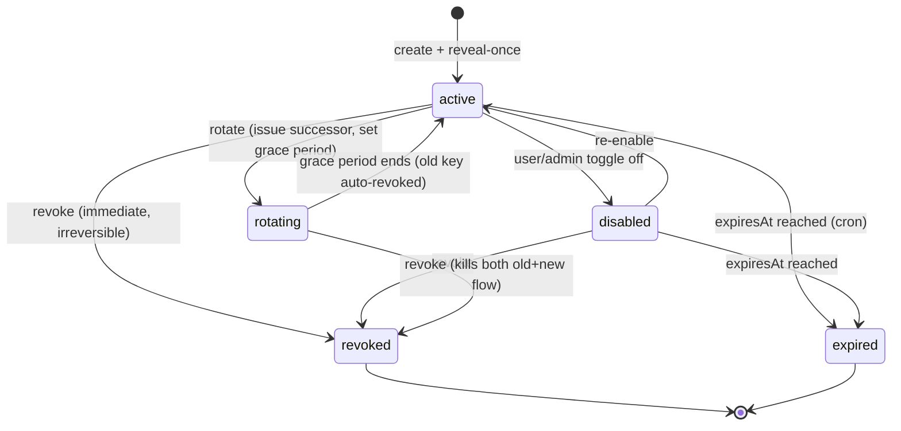
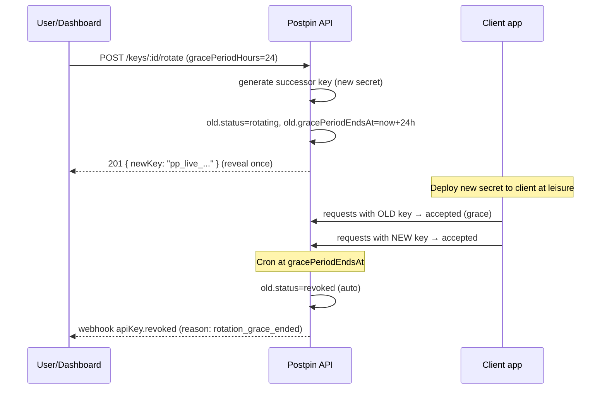
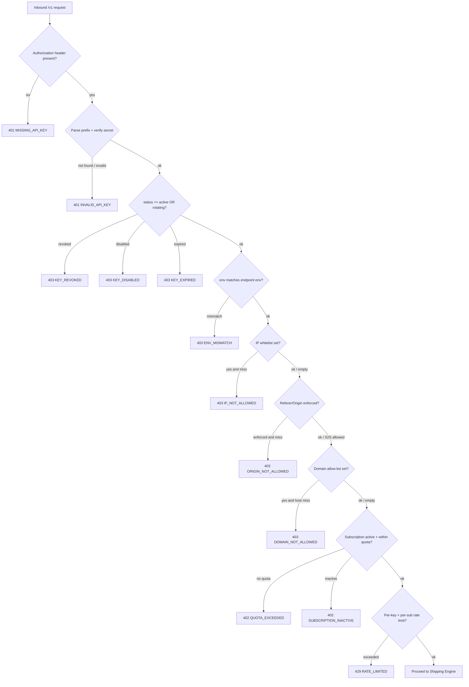
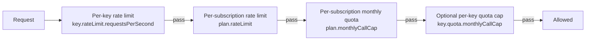

# API Key & Access Management

Postpin exposes a single REST surface (`/v1`) consumed by developer code, storefronts, ERPs and courier-management systems. The API key is the front door: it authenticates the caller, scopes them to a tenant, decides whether the request is allowed to run (domain/IP/origin/quota), and is the unit against which usage, rate limits and billing are measured. This document specifies the full key model — fields, secret hashing, the create → reveal-once → rotate → revoke → expire lifecycle, the layered access-control engine (domain + referer/origin + IP whitelist + environment), how quotas and rate limits stack between the key and the subscription, key webhook events, and the validation rules and best-practice guidance surfaced to users. It is written to be built from directly.

## Contents

- [Concepts & terminology](#concepts--terminology)
- [Data model: the `apiKeys` collection](#data-model-the-apikeys-collection)
- [Secret design: prefix, hashing & verification](#secret-design-prefix-hashing--verification)
- [Key lifecycle](#key-lifecycle)
- [Access-control engine: how the gate is enforced](#access-control-engine-how-the-gate-is-enforced)
- [Domain restriction model](#domain-restriction-model)
- [Referer / Origin validation](#referer--origin-validation)
- [IP whitelist & precedence](#ip-whitelist--precedence)
- [Environments: live vs test](#environments-live-vs-test)
- [Quotas & rate limits: key vs subscription](#quotas--rate-limits-key-vs-subscription)
- [Usage counters: Calls Today / This Month / Last Used](#usage-counters-calls-today--this-month--last-used)
- [Webhooks for key events](#webhooks-for-key-events)
- [Validation rules](#validation-rules)
- [Error catalogue](#error-catalogue)
- [API endpoints (dashboard-facing)](#api-endpoints-dashboard-facing)
- [Best-practice guidance shown to users](#best-practice-guidance-shown-to-users)
- [Edge cases & failure handling](#edge-cases--failure-handling)

---

## Concepts & terminology

| Term | Meaning |
|---|---|
| **API key** | A credential record in `apiKeys`, owned by a company (tenant), used to authenticate `/v1` calls. A company may hold many keys. |
| **Secret** | The full token string the developer sends (`Authorization: Bearer pp_live_...`). Never stored in plaintext — only its hash and a short prefix are persisted. |
| **Prefix** | First few human-visible characters of the secret (e.g. `pp_live_3kQ9`). Stored in clear, shown in dashboards/logs so users can identify a key without revealing it. |
| **Environment** | `live` or `test`. Test keys are sandboxed (see [Environments](#environments-live-vs-test)). |
| **Quota** | A countable allowance over a period (e.g. 100,000 calls/month). Enforced at the **subscription** level primarily, optionally narrowed per key. |
| **Rate limit** | Instantaneous throughput cap (requests per second/minute). Enforced in Redis per key. |
| **Allow-list (domain/IP)** | A set of origins/addresses a key is permitted to be called from. Empty = unrestricted for that dimension. |

The key sits inside the larger request pipeline. The access-control work here is the `validate API key → validate domain/IP/referer/origin → validate subscription/quota → rate limit` segment; everything after (zone resolution, weight, rate card) is in [Shipping Engine](04-shipping-engine.md). Subscriptions, plans and quotas are defined in [Subscriptions & Billing](05-subscriptions-billing.md). Tenancy and RBAC are in [Multi-Tenancy & RBAC](03-multi-tenancy-rbac.md).

---

## Data model: the `apiKeys` collection

One document per key. Secrets are never stored; `hashedSecret` + `prefix` + `last4` are.

```json
{
  "_id": "ObjectId('66a1f0c2e4b0a1c2d3e4f501')",
  "companyId": "ObjectId('66a1e0...')",
  "name": "Storefront — Production",
  "prefix": "pp_live_3kQ9",
  "last4": "Zx12",
  "hashedSecret": "$argon2id$v=19$m=19456,t=2,p=1$c29tZXNhbHQ$Rdescud ...",
  "environment": "live",
  "status": "active",
  "allowedDomains": ["shop.acmeretail.in", "*.acmeretail.in", "www.acmeretail.in"],
  "allowedIPs": ["103.21.244.0/24", "49.36.128.17"],
  "originValidation": {
    "enforceReferer": true,
    "enforceOrigin": true,
    "allowServerToServer": true
  },
  "scopes": ["rates:calculate", "pincodes:read"],
  "rateLimit": {
    "enabled": true,
    "requestsPerSecond": 25,
    "requestsPerMinute": 1000,
    "burst": 50
  },
  "quota": {
    "enabled": false,
    "monthlyCallCap": null
  },
  "expiresAt": "2027-06-26T00:00:00.000Z",
  "createdBy": "ObjectId('66a1d0...')",
  "createdAt": "2026-06-26T09:14:00.000Z",
  "updatedAt": "2026-06-26T09:14:00.000Z",
  "lastUsedAt": "2026-06-26T18:42:11.882Z",
  "lastUsedIp": "103.21.244.40",
  "rotatedFrom": null,
  "rotatedAt": null,
  "gracePeriodEndsAt": null,
  "revokedAt": null,
  "revokedBy": null,
  "revokedReason": null,
  "usage": {
    "callsToday": 5821,
    "callsTodayDate": "2026-06-26",
    "callsThisMonth": 142903,
    "callsThisMonthPeriod": "2026-06",
    "totalCalls": 4820113
  },
  "meta": {
    "notes": "Used by Next.js checkout only",
    "tags": ["checkout", "prod"]
  }
}
```

### Field reference

| Field | Type | Notes |
|---|---|---|
| `companyId` | ObjectId | Tenant owner. Indexed. Every query is tenant-scoped. |
| `name` | string | User label, 2–60 chars. Not unique globally; unique per company recommended. |
| `prefix` | string | `pp_{env}_{4 chars}`. Shown everywhere; safe to log. |
| `last4` | string | Last 4 chars of the secret body, for disambiguation in UI (`pp_live_3kQ9…Zx12`). |
| `hashedSecret` | string | Argon2id hash of the full secret. See [Secret design](#secret-design-prefix-hashing--verification). |
| `environment` | enum | `live` \| `test`. Immutable after creation. |
| `status` | enum | `active` \| `disabled` \| `rotating` \| `revoked` \| `expired`. |
| `allowedDomains` | string[] | Host patterns. Empty = any domain (server-to-server only is still possible). |
| `allowedIPs` | string[] | IPv4/IPv6 addresses or CIDR ranges. Empty = any IP. |
| `originValidation` | object | Toggles for referer/origin enforcement and S2S allowance. |
| `scopes` | string[] | Permission grants for the key (least privilege). |
| `rateLimit` | object | Per-key throughput caps. `enabled:false` → fall back to subscription/plan limits. |
| `quota` | object | Optional per-key monthly cap that narrows (never widens) the subscription quota. |
| `expiresAt` | date\|null | Hard expiry. `null` = never expires (discouraged for live). |
| `createdBy` / `revokedBy` | ObjectId | User audit references. |
| `lastUsedAt` / `lastUsedIp` | date / string | Updated asynchronously (see [Usage counters](#usage-counters-calls-today--this-month--last-used)). |
| `rotatedFrom` | ObjectId\|null | Points to the predecessor key during rotation. |
| `gracePeriodEndsAt` | date\|null | While set, the old key still works during rotation. |
| `usage` | object | Denormalised counters; Redis is source of truth in-flight, Mongo is the durable rollup. |

### Indexes

```js
db.apiKeys.createIndex({ companyId: 1, status: 1 });
db.apiKeys.createIndex({ prefix: 1 }, { unique: true });
db.apiKeys.createIndex({ hashedSecret: 1 });           // exact-match lookup path
db.apiKeys.createIndex({ companyId: 1, name: 1 }, { unique: true });
db.apiKeys.createIndex({ expiresAt: 1 }, { partialFilterExpression: { status: "active" } });
db.apiKeys.createIndex({ gracePeriodEndsAt: 1 }, { sparse: true });
```

`prefix` is unique and the primary lookup key during verification (the prefix is parsed from the inbound token, used to fetch the candidate, then the hash is verified). This avoids hashing-then-scanning the whole collection.

---

## Secret design: prefix, hashing & verification

### Token format

```
pp_<env>_<body>
   │     │
   │     └── 32 bytes of CSPRNG entropy, base62-encoded (~43 chars)
   └──────── "live" or "test"
```

Example (full, shown once): `pp_live_3kQ9aB7nF2pLxY8tWq4ZrM6vK1cD0eHuJ9sZx12`

- `pp_` brand prefix makes leaked keys greppable in secret-scanners (register the prefix with GitHub secret scanning).
- The **stored prefix** is `pp_live_3kQ9` (brand + env + first 4 of body). `last4` is `Zx12`.
- Entropy: 32 bytes (256 bits) from `crypto.randomBytes`. Do not use `Math.random` or UUIDs.

### Hashing

Store **Argon2id** of the entire token string. Rationale: API secrets are high-entropy, but Argon2id defends against offline brute-force if the DB leaks, and is the modern standard.

```js
import argon2 from "argon2";
import { randomBytes } from "crypto";
import baseX from "base-x";
const base62 = baseX("0123456789ABCDEFGHIJKLMNOPQRSTUVWXYZabcdefghijklmnopqrstuvwxyz");

export async function generateApiKey(env /* "live" | "test" */) {
  const body = base62.encode(randomBytes(32));         // ~43 chars
  const token = `pp_${env}_${body}`;
  const prefix = `pp_${env}_${body.slice(0, 4)}`;
  const last4 = body.slice(-4);
  const hashedSecret = await argon2.hash(token, {
    type: argon2.argon2id,
    memoryCost: 19456,  // 19 MiB
    timeCost: 2,
    parallelism: 1,
  });
  return { token, prefix, last4, hashedSecret };
}
```

**Why also keep a fast path?** Argon2 is intentionally slow (~30–60ms). Running it on *every* shipping API call would dominate latency. Mitigation:

1. Parse `prefix` from the inbound token → fetch the single candidate doc by unique `prefix` index.
2. Verify with `argon2.verify(doc.hashedSecret, token)`.
3. On success, cache the **prefix → resolved-context** mapping in Redis (TTL 60–300s) keyed by a HMAC-SHA256 of the full token (not the token itself), so subsequent calls skip Argon2.

```js
export async function verifyApiKey(token) {
  const prefix = token.split("_").slice(0, 3).join("_"); // pp_live_3kQ9 needs body[0..3]
  // prefix = pp_<env>_<first4>  → reconstruct from token
  const [, env, body] = token.split("_");
  const lookupPrefix = `pp_${env}_${body.slice(0, 4)}`;

  // 1. Redis hot-path
  const tokenHmac = hmacSha256(token, process.env.KEY_CACHE_PEPPER);
  const cached = await redis.get(`apikey:ctx:${tokenHmac}`);
  if (cached) return JSON.parse(cached);

  // 2. Mongo + Argon2 cold-path
  const doc = await apiKeys.findOne({ prefix: lookupPrefix });
  if (!doc) return { ok: false, code: "KEY_NOT_FOUND" };
  const valid = await argon2.verify(doc.hashedSecret, token);
  if (!valid) return { ok: false, code: "KEY_INVALID" };

  const ctx = buildKeyContext(doc);      // status, env, domains, ips, limits, companyId...
  await redis.set(`apikey:ctx:${tokenHmac}`, JSON.stringify(ctx), "EX", 120);
  return ctx;
}
```

> **Invalidation:** any mutation (rotate/revoke/disable/edit domains/limits) must `DEL` the Redis context entries for that key. Because the cache key is an HMAC of the token (unknown server-side after creation), store a reverse index `apikey:tokens:<keyId> -> SET of tokenHmac` updated on cache write, and delete the set members on mutation. Simpler alternative: cache by `prefix` instead of token-HMAC and accept that two tokens can never share a prefix (they can't — prefix is unique), then verify the hash once and cache by prefix.

### Reveal-once rule

The full `token` is returned **only** in the HTTP 201 response of key creation/rotation. It is never persisted server-side and never returned again. The dashboard shows it in a copy-to-clipboard modal with a "you won't see this again" warning and a download `.env` snippet button (`POSTPIN_API_KEY=pp_live_...`).

---

## Key lifecycle



| Transition | Trigger | Effect |
|---|---|---|
| **create** | User clicks "Create key" | New doc, `status:active`, secret revealed once, `apiKey.created` webhook. |
| **rotate** | User clicks "Rotate" | New key issued (`rotatedFrom` = old `_id`), old key enters `gracePeriodEndsAt` (default 24h, configurable 0–30 days). Both work during grace. `apiKey.rotated` webhook. |
| **revoke** | User/admin "Revoke" | `status:revoked`, `revokedAt/By/Reason` set, Redis caches purged immediately. Irreversible. `apiKey.revoked` webhook. |
| **disable** | Toggle | `status:disabled`. Reversible. Calls rejected with `KEY_DISABLED`. |
| **expire** | Cron hits `expiresAt` | `status:expired`. `apiKey.expired` webhook. A `apiKey.expiring` warning webhook fires at T-7d, T-3d, T-1d. |

### Rotation in detail

Rotation lets a client swap secrets with zero downtime:



- Setting `gracePeriodHours=0` revokes the old key immediately (hard cutover).
- A key may only be in one active rotation at a time; rotating a `rotating` key collapses the chain (the oldest is revoked, the newest stays).
- The successor inherits `name`, `allowedDomains`, `allowedIPs`, `rateLimit`, `quota`, `scopes`, `environment` (env is never changed by rotation).

---

## Access-control engine: how the gate is enforced

Every `/v1` call passes through an ordered gate. Fail-fast: stop at the first rule that rejects. Order is chosen so cheap/clear rejections happen before expensive ones, and so the most security-relevant (auth) precedes the rest.



### Precedence summary

1. **Authentication** (key exists + secret verifies) — hard gate, nothing runs without it.
2. **Key state** (active/rotating only).
3. **Environment match** (a `test` key cannot hit live billing-affecting endpoints, and vice-versa).
4. **IP whitelist** — evaluated **before** referer/origin/domain, because IP is the most spoof-resistant network signal and is the right control for server-to-server.
5. **Referer/Origin** — browser-context signal; only meaningful for browser-originated calls.
6. **Domain allow-list** — derived from Origin/Referer host; the user-facing "which sites may use this key".
7. **Subscription & quota** — billing gate.
8. **Rate limit** — throughput gate (last, because it mutates Redis counters and we only want to count requests that were otherwise allowed).

> Counting note: rate-limit and quota counters are incremented only for requests that pass auth + state + env. A 401 from a bad key does **not** consume the tenant's quota (otherwise an attacker could drain a victim's allowance). It *does* count toward an anti-abuse counter keyed by source IP for brute-force protection.

---

## Domain restriction model

`allowedDomains` controls which **web hosts** may use the key. The host is extracted from the request's `Origin` header (preferred) or `Referer` header (fallback). It is the control storefronts care about.

### Supported patterns

| Pattern | Matches | Does NOT match | Use case |
|---|---|---|---|
| `acmeretail.in` | `acmeretail.in` only (exact) | `www.acmeretail.in`, `shop.acmeretail.in` | Apex domain only |
| `www.acmeretail.in` | `www.acmeretail.in` | `acmeretail.in`, `shop.acmeretail.in` | Specific subdomain |
| `*.acmeretail.in` | `shop.acmeretail.in`, `www.acmeretail.in`, `a.b.acmeretail.in` | `acmeretail.in` (apex), `acmeretail.in.evil.com` | All subdomains |
| `shop.*` | `shop.acmeretail.in`, `shop.example.com` | `www.acmeretail.in` | (Discouraged — too broad; validate before allowing) |
| `localhost` / `127.0.0.1` | dev hosts | — | Test keys only |

### Matching algorithm

```js
function hostMatches(host, pattern) {
  host = host.toLowerCase().replace(/\.$/, "");      // strip trailing dot
  pattern = pattern.toLowerCase();

  // Reject ports / paths defensively (host should already be a bare host)
  host = host.split(":")[0];

  if (pattern === host) return true;                  // exact

  if (pattern.startsWith("*.")) {
    const base = pattern.slice(2);                    // "acmeretail.in"
    // wildcard matches one-or-more left labels, NOT the apex itself
    return host.endsWith("." + base) && host !== base;
  }

  if (pattern.endsWith(".*")) {                       // "shop.*"
    const left = pattern.slice(0, -2);                // "shop"
    return host === left || host.startsWith(left + ".");
  }

  return false;
}

function domainAllowed(host, allowedDomains) {
  if (!allowedDomains || allowedDomains.length === 0) return true; // unrestricted dimension
  return allowedDomains.some(p => hostMatches(host, p));
}
```

### Critical edge cases

- **Suffix-spoof defence:** `*.acmeretail.in` must NOT match `acmeretail.in.attacker.com`. The `endsWith("." + base)` check guarantees the pattern is a true DNS suffix because the host must end in `.acmeretail.in` and an attacker domain ends in `.attacker.com`.
- **Apex vs wildcard:** `*.acmeretail.in` deliberately excludes the apex. If a user wants both, store both `acmeretail.in` and `*.acmeretail.in`. The UI offers a "include apex" checkbox that adds the apex entry automatically.
- **Case & trailing dot:** normalise to lowercase and strip a trailing FQDN dot (`acmeretail.in.`).
- **IDN/punycode:** store and compare in punycode (`xn--...`). Convert user input on save.
- **No Origin/Referer at all (server-to-server):** domain check is **skipped** when there is no browser host to read, provided `originValidation.allowServerToServer` is true. In that mode IP whitelist becomes the operative control. If `allowServerToServer` is false and no host is present → reject `ORIGIN_NOT_ALLOWED`.

---

## Referer / Origin validation

Browsers attach `Origin` (on CORS and POST) and `Referer` (on navigation/most requests). Server-to-server callers attach neither (or arbitrary values, since they're not enforced by a browser). Postpin uses them as a **defence-in-depth** signal for browser-embedded keys, not as a sole trust anchor.

```js
function resolveHost(req) {
  const origin = req.headers["origin"];     // "https://shop.acmeretail.in"
  const referer = req.headers["referer"];   // "https://shop.acmeretail.in/cart"
  if (origin) return new URL(origin).hostname;
  if (referer) return new URL(referer).hostname;
  return null;                              // server-to-server
}

function originValidated(req, key) {
  const host = resolveHost(req);
  const ov = key.originValidation;

  if (host === null) {
    // No browser context → only allowed if S2S permitted
    return ov.allowServerToServer ? { ok: true, mode: "s2s" } : { ok: false, code: "ORIGIN_NOT_ALLOWED" };
  }
  if (ov.enforceOrigin && !req.headers["origin"] && req.method !== "GET") {
    return { ok: false, code: "ORIGIN_MISSING" };
  }
  if (!domainAllowed(host, key.allowedDomains)) {
    return { ok: false, code: "DOMAIN_NOT_ALLOWED" };
  }
  return { ok: true, mode: "browser", host };
}
```

| Scenario | `allowServerToServer` | Has Origin/Referer | `allowedDomains` | Result |
|---|---|---|---|---|
| Storefront fetch from browser | true | yes (`shop.acmeretail.in`) | matches | allow |
| Storefront fetch, spoofed host | true | yes (`evil.com`) | no match | `DOMAIN_NOT_ALLOWED` |
| Backend cron (Node) | true | none | (any) | allow (falls to IP check) |
| Backend cron with S2S disabled | false | none | — | `ORIGIN_NOT_ALLOWED` |
| Browser, Origin stripped by proxy | true | none | set | treated as S2S → allow if IP ok |

> **Trust model honesty (shown to users):** Origin/Referer are browser-enforced and **cannot** be trusted from non-browser clients (curl can send any value). For server-to-server keys, rely on **IP whitelisting**. Domain restrictions meaningfully protect a *public* key embedded in front-end code from being copy-pasted into another site, because real browsers send a truthful Origin and the cross-origin call from the attacker's site will carry the attacker's host.

---

## IP whitelist & precedence

`allowedIPs` lists permitted source addresses as exact IPs or CIDR blocks, IPv4 and IPv6.

```js
import { isInSubnet } from "is-in-subnet"; // or ipaddr.js

function clientIp(req) {
  // Trust only the configured proxy hop count (e.g. Cloudflare → LB → app)
  const xff = (req.headers["x-forwarded-for"] || "").split(",").map(s => s.trim());
  const trustedHops = Number(process.env.TRUSTED_PROXY_HOPS || 1);
  return xff.length >= trustedHops ? xff[xff.length - trustedHops] : req.socket.remoteAddress;
}

function ipAllowed(req, key) {
  if (!key.allowedIPs || key.allowedIPs.length === 0) return true; // unrestricted dimension
  const ip = clientIp(req);
  return key.allowedIPs.some(entry =>
    entry.includes("/") ? isInSubnet(ip, entry) : ip === entry
  );
}
```

### Precedence rules

1. **IP is checked before domain/origin** (see [engine order](#access-control-engine-how-the-gate-is-enforced)). An IP-whitelisted key from a non-listed IP is rejected even if the Origin would match.
2. **Empty whitelist ≠ allow-spoofing.** Empty means "IP dimension not restricted"; other gates still apply.
3. **Both set (IP + domain):** request must satisfy **both** (logical AND). This is the recommended posture for a hybrid app.
4. **IP whitelist makes a key effectively server-to-server-safe.** A leaked key still cannot be used from outside the whitelisted network.

### `X-Forwarded-For` safety

Behind Cloudflare/Nginx, `XFF` is attacker-influenceable unless you pin the trusted hop count. Configure `TRUSTED_PROXY_HOPS` to the number of proxies you control and read the IP at that fixed position from the right — never blindly take `xff[0]` (the leftmost, which the client controls). Prefer `CF-Connecting-IP` when Cloudflare-fronted.

---

## Environments: live vs test

| Aspect | `live` | `test` |
|---|---|---|
| Prefix | `pp_live_…` | `pp_test_…` |
| Data | Real tenant rate cards, real pincodes | Same pincode DB (read-only) but **sandbox rate cards**; never affects billing |
| Quota | Counts against subscription, may bill overages | Free, capped at a low sandbox ceiling (e.g. 1,000/day) |
| Webhooks | Delivered to live endpoints | Delivered to test endpoints; payload has `"livemode": false` |
| Domain/IP rules | Enforced | Enforced, but `localhost`/private IPs auto-allowed |
| Visual | Solid brand badge | Dashed "TEST" badge, amber accent |

- `environment` is set at creation and **immutable**. To switch, create a new key.
- Endpoints are environment-agnostic in URL; the **key** determines the mode. A `test` key calling `/v1/rates/calculate` returns simulated results flagged `livemode:false`.
- Mixing is rejected: if a request targets a live-only resource (e.g. fetching production usage analytics) with a test key → `ENV_MISMATCH`.

---

## Quotas & rate limits: key vs subscription

Two independent controls with different scopes. Both must pass.

| | Quota | Rate limit |
|---|---|---|
| **Question** | "How many calls this month?" | "How fast right now?" |
| **Window** | Calendar month (and/or day) | Sliding/fixed second + minute |
| **Primary scope** | **Subscription** (shared by all the company's keys) | **Per key** (then aggregated per subscription) |
| **Store** | Redis counter, periodically flushed to Mongo `subscriptions.usage` | Redis token bucket / sliding window |
| **Breach response** | `402 QUOTA_EXCEEDED` (or overage billing if plan allows) | `429 RATE_LIMITED` + `Retry-After` |

### How they stack



- **Per-key rate limit** can only be **≤** the subscription/plan limit (a key may be throttled tighter, never looser). Validation enforces this on save.
- **Quota is owned by the subscription.** All keys of a company draw from the same monthly pool defined by the plan (see [Subscriptions & Billing](05-subscriptions-billing.md)). A per-key `quota.monthlyCallCap` is an optional *sub-budget* — e.g. "the marketing key may use at most 10k of our 200k pool" — and can only narrow, never exceed, the pool.

### Redis keys

```
# Rate limit (sliding window, per key, per minute)
rl:key:{keyId}:{epochMinute}            INCR + EXPIRE 60
rl:key:{keyId}:sec:{epochSecond}        INCR + EXPIRE 1
# Subscription-level aggregate rate limit
rl:sub:{subscriptionId}:{epochMinute}   INCR + EXPIRE 60
# Monthly quota (per subscription)
quota:sub:{subscriptionId}:{YYYY-MM}    INCR (no expiry; archived monthly)
# Optional per-key monthly sub-budget
quota:key:{keyId}:{YYYY-MM}             INCR
```

Use a Lua script (or `@upstash/ratelimit`-style atomic ops) to read-check-increment in one round trip and avoid race conditions. On breach return headers:

```
X-RateLimit-Limit: 1000
X-RateLimit-Remaining: 0
X-RateLimit-Reset: 1750946400
Retry-After: 12
```

---

## Usage counters: Calls Today / This Month / Last Used

Counters shown on the dashboard (`callsToday`, `callsThisMonth`, `lastUsedAt`) are **hot in Redis, durable in Mongo**:

1. On each allowed call, atomically `INCR` Redis counters:
   - `usage:key:{keyId}:day:{YYYY-MM-DD}`
   - `usage:key:{keyId}:month:{YYYY-MM}`
   - `usage:key:{keyId}:lastUsed` (SET to `now|ip`)
2. A flush worker (BullMQ, every 30–60s) rolls Redis deltas into `apiKeys.usage.*` and `subscriptions.usage.*` so the durable record survives Redis eviction. `apiLogs` (one doc per request, TTL-indexed) is the raw audit source for analytics.
3. The dashboard reads the **denormalised** `usage` object for instant render and may overlay live Redis values for the current minute.

```js
// Day rollover: callsTodayDate guards stale increments
if (key.usage.callsTodayDate !== today) {
  key.usage.callsToday = 0;
  key.usage.callsTodayDate = today;
}
```

`lastUsedAt` is written async (do not block the request path). Truncate to second resolution to limit write amplification; debounce writes to at most once per N seconds per key.

---

## Webhooks for key events

Postpin emits webhooks on key lifecycle changes so customer systems can react (rotate downstream secrets, alert on revocation, etc.). Delivery, retries and signing follow the platform webhook spec in [Webhooks & Events](09-webhooks-events.md).

### Event types

| Event | When | Idempotency key |
|---|---|---|
| `apiKey.created` | New key created | `keyId` |
| `apiKey.rotated` | Rotation initiated (successor issued) | `keyId:rotatedAt` |
| `apiKey.revoked` | Key revoked (manual or rotation-grace-end) | `keyId:revokedAt` |
| `apiKey.disabled` / `apiKey.enabled` | Status toggled | `keyId:updatedAt` |
| `apiKey.expiring` | T-7d / T-3d / T-1d before `expiresAt` | `keyId:expiresAt:offset` |
| `apiKey.expired` | `expiresAt` reached | `keyId:expiresAt` |
| `apiKey.usage.threshold` | Key crosses 80% / 100% of its `quota.monthlyCallCap` | `keyId:YYYY-MM:threshold` |

### Sample payload

```json
{
  "id": "evt_2Ld9kQ...",
  "type": "apiKey.rotated",
  "livemode": true,
  "createdAt": "2026-06-26T09:20:00.000Z",
  "companyId": "66a1e0...",
  "data": {
    "keyId": "66a1f0c2e4b0a1c2d3e4f501",
    "name": "Storefront — Production",
    "prefix": "pp_live_3kQ9",
    "environment": "live",
    "successorPrefix": "pp_live_7mB2",
    "gracePeriodEndsAt": "2026-06-27T09:20:00.000Z",
    "rotatedBy": "66a1d0..."
  }
}
```

> The webhook **never** includes the secret or hash — only the prefix. Signed with `X-Postpin-Signature: t=...,v1=HMAC_SHA256(payload, webhookSecret)`. Receivers must verify the signature and treat events as idempotent using the `id` / idempotency key.

---

## Validation rules

Enforced on create/update (server-side; mirror in the dashboard form).

| Field | Rule |
|---|---|
| `name` | Required, 2–60 chars, trimmed, unique per company. |
| `environment` | Required, `live`\|`test`, immutable after create. |
| `allowedDomains[]` | Each entry: valid host or wildcard pattern; max 50 entries; lowercase; convert IDN→punycode; reject patterns with paths/ports/schemes; reject `*` alone and `*.com`/`*.in` (public-suffix wildcards). |
| `allowedIPs[]` | Each entry: valid IPv4/IPv6 or CIDR; max 100 entries; reject `0.0.0.0/0` and `::/0` (would whitelist everything — show a warning, require explicit confirm). |
| `rateLimit.requestsPerSecond` | Integer 1–`plan.maxRps`; ≤ subscription limit. |
| `rateLimit.requestsPerMinute` | Integer; ≥ rps; ≤ subscription limit. |
| `rateLimit.burst` | Integer ≥ rps. |
| `quota.monthlyCallCap` | Null or integer 1–`plan.monthlyCallCap` (cannot exceed the pool). |
| `expiresAt` | Null or future date; live keys default to a 365-day expiry suggestion; warn if `null` for live. |
| `scopes[]` | Subset of scopes the company's plan grants. |
| `originValidation` | Booleans; if `allowServerToServer=false` and `allowedDomains` empty → block save (key would be unusable). |

```js
const PUBLIC_SUFFIX_WILDCARDS = /^\*\.(com|in|co\.in|net|org|io)$/i;
function validateDomain(p) {
  if (p === "*" || PUBLIC_SUFFIX_WILDCARDS.test(p)) throw new ValidationError("Domain too broad");
  if (/[:/]/.test(p)) throw new ValidationError("Use a bare host, no scheme/port/path");
  // wildcard only as leftmost label, or trailing for prefix patterns
  if (/\*/.test(p) && !/^\*\.|\.\*$/.test(p)) throw new ValidationError("Invalid wildcard placement");
}
```

---

## Error catalogue

All errors return a consistent envelope and the appropriate HTTP status. Never leak whether a key *exists* vs is *wrong* in unauthenticated responses beyond the generic `INVALID_API_KEY`.

```json
{
  "error": {
    "code": "DOMAIN_NOT_ALLOWED",
    "message": "This API key is not authorised for origin 'evil.com'.",
    "type": "access_denied",
    "requestId": "req_8fK2..."
  }
}
```

| HTTP | `code` | Cause |
|---|---|---|
| 401 | `MISSING_API_KEY` | No `Authorization` header. |
| 401 | `INVALID_API_KEY` | Prefix not found OR hash mismatch (do not distinguish). |
| 403 | `KEY_REVOKED` | Key revoked. |
| 403 | `KEY_DISABLED` | Key toggled off. |
| 403 | `KEY_EXPIRED` | Past `expiresAt`. |
| 403 | `ENV_MISMATCH` | Test key on live-only resource or vice-versa. |
| 403 | `IP_NOT_ALLOWED` | Source IP not in whitelist. |
| 403 | `ORIGIN_NOT_ALLOWED` / `ORIGIN_MISSING` | No/blocked browser origin and S2S disallowed. |
| 403 | `DOMAIN_NOT_ALLOWED` | Host not in `allowedDomains`. |
| 403 | `INSUFFICIENT_SCOPE` | Endpoint needs a scope the key lacks. |
| 402 | `SUBSCRIPTION_INACTIVE` | No active subscription / payment failed. |
| 402 | `QUOTA_EXCEEDED` | Monthly call cap reached (key or subscription). |
| 429 | `RATE_LIMITED` | Per-second/minute throughput exceeded. Includes `Retry-After`. |

---

## API endpoints (dashboard-facing)

These power the User Dashboard; all are tenant-scoped and require a session JWT + RBAC permission `apiKeys:*` (see [Multi-Tenancy & RBAC](03-multi-tenancy-rbac.md)). They are **not** the `/v1` shipping API.

| Method | Path | Permission | Returns |
|---|---|---|---|
| `GET` | `/dashboard/keys` | `apiKeys:read` | List (prefix, name, status, usage, lastUsed; never secret). |
| `POST` | `/dashboard/keys` | `apiKeys:create` | 201 + **full secret once**. |
| `GET` | `/dashboard/keys/:id` | `apiKeys:read` | Single key detail + recent usage. |
| `PATCH` | `/dashboard/keys/:id` | `apiKeys:update` | Edit name/domains/IPs/limits/expiry. |
| `POST` | `/dashboard/keys/:id/rotate` | `apiKeys:rotate` | 201 + new secret once. |
| `POST` | `/dashboard/keys/:id/revoke` | `apiKeys:revoke` | 200, purges caches. |
| `POST` | `/dashboard/keys/:id/disable` / `/enable` | `apiKeys:update` | 200. |
| `GET` | `/dashboard/keys/:id/usage` | `apiKeys:read` | Time-series from `apiLogs` for charts. |

Every mutation writes an `auditLogs` entry (`actor`, `action`, `keyId`, `before`/`after` diff with secrets redacted) and emits the matching webhook.

### Create response (reveal-once)

```json
{
  "id": "66a1f0c2e4b0a1c2d3e4f501",
  "name": "Storefront — Production",
  "environment": "live",
  "prefix": "pp_live_3kQ9",
  "secret": "pp_live_3kQ9aB7nF2pLxY8tWq4ZrM6vK1cD0eHuJ9sZx12",
  "warning": "Store this secret now — it will not be shown again.",
  "createdAt": "2026-06-26T09:14:00.000Z"
}
```

---

## Best-practice guidance shown to users

Surface these inline in the dashboard (tooltips, the create modal, and a "Key security" help panel):

1. **Treat the secret like a password.** Store it in environment variables or a secret manager, never in client-side bundles or Git. Postpin registers the `pp_live_`/`pp_test_` prefix with secret scanners.
2. **Use separate keys per surface.** One key per app/environment (checkout, mobile, internal ERP). Blast radius of a leak stays small and rotation is painless.
3. **Restrict every key.** For front-end keys set `allowedDomains`. For server keys set `allowedIPs`. A key with neither is usable from anywhere it leaks to.
4. **Rotate on a schedule and on suspicion.** Use the 24h grace-period rotation to swap secrets with zero downtime; set a rotation reminder (90 days suggested).
5. **Set an expiry** on live keys (default 365 days). Expiring keys force healthy rotation hygiene and limit the lifetime of any leak.
6. **Prefer test keys in non-prod.** `pp_test_` keys never touch billing and auto-allow localhost.
7. **Watch usage alerts.** Enable `apiKey.usage.threshold` webhooks to catch runaway or compromised keys (sudden spikes).
8. **Revoke immediately on compromise** — revocation is instant and irreversible; rotate to issue a clean replacement.
9. **Scope down.** Grant only the scopes a key needs (`rates:calculate` for a storefront doesn't need `pincodes:write`).
10. **Verify webhook signatures** on your endpoint and treat events as idempotent.

---

## Edge cases & failure handling

| Situation | Behaviour |
|---|---|
| **Redis down** (rate-limit/quota store) | Fail-open on rate limit (allow, log a degraded-mode warning, page on-call) OR fail-closed — configurable per plan; default fail-open for availability, fail-closed for quota only if `strictQuota=true`. Auth (Mongo/Argon2) still runs. |
| **Mongo lookup slow** | Redis context cache (TTL 120s) keeps verified keys hot, so a brief Mongo blip doesn't reject already-seen keys. |
| **Clock skew on expiry** | Expiry compared against server UTC; grace of 60s avoids edge flapping. |
| **Two rotations in flight** | Collapse: only the newest successor stays `active`, all predecessors `revoked`. |
| **Key edited mid-flight** (domains changed) | Redis context purged on save; next call re-verifies against fresh rules within ≤ TTL. |
| **Reused/leaked test key in prod traffic** | `ENV_MISMATCH` on live-only resources; test quota ceiling prevents abuse. |
| **XFF spoofing** | Trusted-hop pinning + `CF-Connecting-IP` preference; never trust leftmost XFF. |
| **Brute-force on prefixes** | Per-source-IP failure counter in Redis; after N failures (e.g. 50/min) → temporary `429` block on that IP regardless of key. |
| **Empty allow-lists everywhere** | Allowed but flagged in UI with a "this key is unrestricted" warning badge and an optional org policy that blocks creating unrestricted live keys. |
| **Webhook endpoint failing** | Retried with backoff per [Webhooks & Events](09-webhooks-events.md); key state changes are not blocked by webhook delivery. |
| **Deleted company / cancelled subscription** | All keys forced to `disabled`; `SUBSCRIPTION_INACTIVE` returned; keys retained 30 days then revoked for audit. |

---

### Related documents

- [Architecture Overview](01-architecture.md)
- [Multi-Tenancy & RBAC](03-multi-tenancy-rbac.md)
- [Shipping Engine](04-shipping-engine.md)
- [Subscriptions & Billing](05-subscriptions-billing.md)
- [Webhooks & Events](09-webhooks-events.md)
