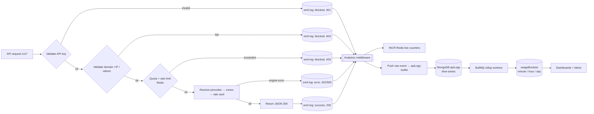
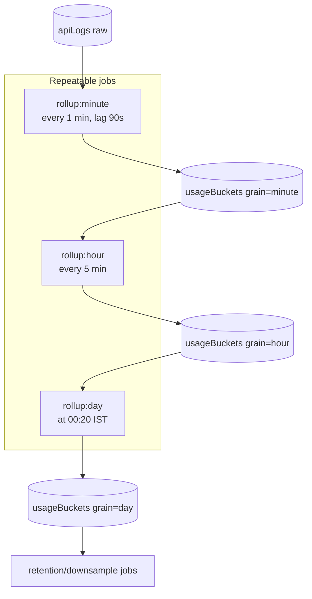
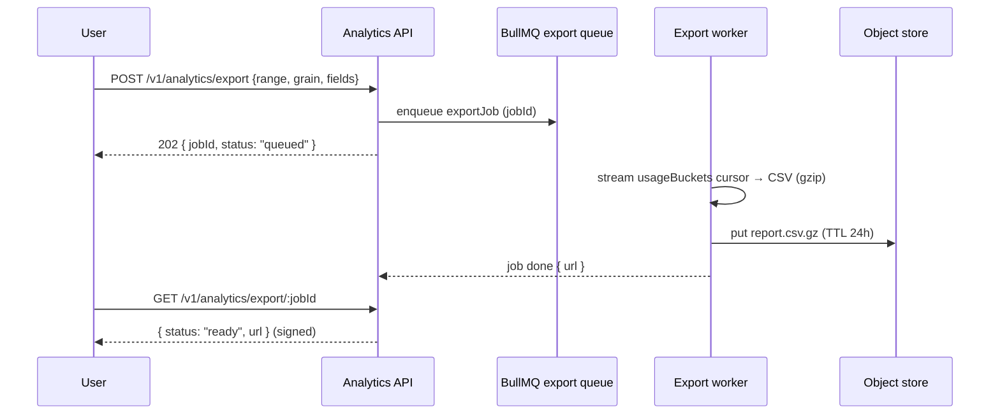

# API Analytics & Usage Intelligence

Postpin treats every `/v1` request as a first-class, observable event. This document specifies how the platform captures request telemetry into the `apiLogs` collection, how that raw stream is turned into live counters (Redis) and pre-aggregated rollups (BullMQ → minute/hour/day buckets in MongoDB), the dashboards and metrics presented to customers and Super Admins, the Recharts components that render them, retention and downsampling policy, MongoDB aggregation pipelines for the hard queries (top endpoints, peak hours), CSV export, and the quota/usage alerting that feeds the notification center. It is written to be built from directly — field lists, schemas, algorithms, edge cases, and failure handling are concrete.

## Contents

- [1. Where Analytics Sits in the Pipeline](#1-where-analytics-sits-in-the-pipeline)
- [2. The `apiLogs` Event — What to Capture](#2-the-apilogs-event--what-to-capture)
- [3. Write Path: Non-Blocking Ingestion](#3-write-path-non-blocking-ingestion)
- [4. Real-Time Counters in Redis](#4-real-time-counters-in-redis)
- [5. Historical Rollups via BullMQ](#5-historical-rollups-via-bullmq)
- [6. Pre-Aggregated Bucket Schema](#6-pre-aggregated-bucket-schema)
- [7. Metrics Catalog & Formulas](#7-metrics-catalog--formulas)
- [8. Latency Percentiles (p50/p95/p99)](#8-latency-percentiles-p50p95p99)
- [9. Dashboards & Recharts Mapping](#9-dashboards--recharts-mapping)
- [10. MongoDB Aggregation Pipelines](#10-mongodb-aggregation-pipelines)
- [11. CSV Export](#11-csv-export)
- [12. Retention & Downsampling](#12-retention--downsampling)
- [13. Quota & Usage Alerts](#13-quota--usage-alerts)
- [14. Edge Cases & Failure Handling](#14-edge-cases--failure-handling)
- [15. Query API Surface](#15-query-api-surface)

---

## 1. Where Analytics Sits in the Pipeline

Analytics capture is a side-effect of the request lifecycle, not a step that can block or fail the response. The shipping engine pipeline (see [Shipping Engine](04-shipping-engine.md)) and the auth/quota gates (see [API Keys & Auth](05-api-keys-auth.md)) emit a structured event at the end of every request — **including blocked and errored requests**, which are the most interesting ones for security and quota dashboards.



Two invariants:

1. **Capture is fire-and-forget.** The response is flushed to the client first; telemetry is written after `res.on('finish')`. A failure in the analytics path must never produce a 5xx.
2. **Capture covers the whole funnel.** `total = success + failed + blocked`. "Blocked" requests never reach the engine but are still billed against rate-limit visibility and surfaced as security signal.

---

## 2. The `apiLogs` Event — What to Capture

Every request produces exactly one `apiLogs` document. Store it in a **MongoDB time-series collection** keyed on `ts` with `meta` for the high-cardinality grouping fields — this gives automatic bucketing and cheap range scans.

### Field list

| Field | Type | Source | Notes |
|---|---|---|---|
| `_id` | ObjectId | Mongo | Implicit, monotonic by time. |
| `ts` | Date | server | Request **start** time (UTC). Time-series `timeField`. |
| `tenantId` | ObjectId | apiKey → company | Multi-tenant scope key. `meta` field. |
| `keyId` | ObjectId | apiKey | Which API key was used. `meta` field. |
| `keyEnv` | `"live" \| "test"` | apiKey | Test traffic excluded from billing/quota. |
| `endpoint` | string | router | Normalized route template, e.g. `POST /v1/rates`, never the raw URL with params. `meta` field. |
| `method` | string | request | HTTP verb. |
| `status` | int | response | HTTP status code (200, 401, 403, 422, 429, 500…). |
| `outcome` | `"success" \| "failed" \| "blocked"` | derived | See classification table below. `meta` field. |
| `errorCode` | string \| null | engine/auth | Stable machine code, e.g. `RATE_LIMITED`, `PINCODE_NOT_SERVICEABLE`, `INVALID_DIMENSIONS`, `QUOTA_EXCEEDED`. Null on success. |
| `latencyMs` | int | server | Wall time from middleware entry to `finish`. |
| `engineMs` | int \| null | engine | Time spent in rate calc only (excludes auth/queue). |
| `reqBytes` | int | request | `Content-Length` of request body (0 for GET). |
| `resBytes` | int | response | Bytes written to the client. |
| `domain` | string \| null | `Origin`/`Referer` header | Caller domain for browser traffic; null for server-to-server. |
| `ip` | string | `X-Forwarded-For` (trusted hop) | Store as-is; mask last octet in UI for non-admins. |
| `ipCountry` | string \| null | GeoIP | ISO-3166 alpha-2; mostly `IN`. |
| `userAgent` | string \| null | request | Truncated to 256 chars. |
| `zone` | `ShippingZone` \| null | engine | `local \| regional \| metro \| national \| special`. Null on blocked/auth failures. |
| `originPincode` | string \| null | request | 6-digit. Null if request never parsed. |
| `destPincode` | string \| null | request | 6-digit. |
| `service` | `ServiceLevel` \| null | request | `surface \| express \| same_day`. |
| `cod` | bool \| null | request | Payment type flag. |
| `cacheHit` | bool | engine | True if zone/rate resolution served from Redis cache. |
| `rateLimited` | bool | gate | True when `outcome=blocked` due to 429 specifically. |
| `quotaSnapshot` | int \| null | quota gate | Calls consumed this cycle at request time (for quota-vs-usage charts). |
| `apiVersion` | string | router | e.g. `v1`. Future-proofs multi-version analytics. |
| `traceId` | string | middleware | Correlates with structured app logs / Sentry. |
| `region` | string | infra | Serving node/region, e.g. `ap-south-1`. |

### Outcome classification

`outcome` is the single most-used grouping dimension; derive it deterministically so dashboards stay consistent.

| Condition | `outcome` | Example `status` | Counts toward billable quota? |
|---|---|---|---|
| Request reached engine and returned a valid quote | `success` | 200 | Yes |
| Request reached engine but business rule rejected it | `failed` | 422 (e.g. `PINCODE_NOT_SERVICEABLE`) | Configurable (default: no) |
| Server fault | `failed` | 500/503 | No |
| Stopped at a gate before the engine (auth, domain, quota, rate limit) | `blocked` | 401/403/429 | No |

> Rationale: customers should not be billed for our 500s nor for their own 401s. Only `success` (and, per-plan policy, `failed` 4xx business rejections) decrement quota — see [Plans & Billing](06-plans-billing.md).

### Sample document

```json
{
  "ts": "2026-06-26T09:14:03.221Z",
  "tenantId": "6630a1f2c4a2e90b1a7c0011",
  "keyId": "6630a2b9c4a2e90b1a7c0099",
  "keyEnv": "live",
  "endpoint": "POST /v1/rates",
  "method": "POST",
  "status": 200,
  "outcome": "success",
  "errorCode": null,
  "latencyMs": 38,
  "engineMs": 21,
  "reqBytes": 184,
  "resBytes": 642,
  "domain": "shop.kayease.com",
  "ip": "103.21.244.12",
  "ipCountry": "IN",
  "userAgent": "Postpin-Node/1.4.0",
  "zone": "national",
  "originPincode": "110001",
  "destPincode": "560001",
  "service": "express",
  "cod": true,
  "cacheHit": true,
  "quotaSnapshot": 41218,
  "apiVersion": "v1",
  "traceId": "01J8Z3K9P2QH7",
  "region": "ap-south-1"
}
```

A blocked example (rate limited):

```json
{
  "ts": "2026-06-26T09:14:03.640Z",
  "tenantId": "6630a1f2c4a2e90b1a7c0011",
  "keyId": "6630a2b9c4a2e90b1a7c0099",
  "keyEnv": "live",
  "endpoint": "POST /v1/rates",
  "method": "POST",
  "status": 429,
  "outcome": "blocked",
  "errorCode": "RATE_LIMITED",
  "latencyMs": 2,
  "engineMs": null,
  "reqBytes": 184,
  "resBytes": 91,
  "domain": "shop.kayease.com",
  "ip": "103.21.244.12",
  "ipCountry": "IN",
  "zone": null,
  "cacheHit": false,
  "rateLimited": true,
  "apiVersion": "v1",
  "traceId": "01J8Z3K9P2QH8",
  "region": "ap-south-1"
}
```

---

## 3. Write Path: Non-Blocking Ingestion

The analytics middleware wraps the request and emits after the response finishes.

```ts
// middleware/analytics.ts (sketch)
export function analytics(req, res, next) {
  const start = process.hrtime.bigint();
  res.on('finish', () => {
    const latencyMs = Number(process.hrtime.bigint() - start) / 1e6;
    const event = buildEvent(req, res, latencyMs); // pulls ctx set by upstream gates
    // 1) live counters — pipelined, best-effort
    bumpRedisCounters(event).catch(noop);
    // 2) durable raw log — buffered, never throws into the request
    analyticsBuffer.push(event);
  });
  next();
}
```

### Buffering & batch insert

- Events accumulate in an in-process ring buffer and flush via `insertMany(..., { ordered: false })` every **1 second or 500 events**, whichever first.
- `ordered:false` so one bad doc cannot drop the batch.
- On flush failure, retry once with backoff; on second failure, spill the batch to a local append-only file (`apilogs-spill-<ts>.ndjson`) and emit a `metrics.ingest.spill` internal alert. A reconciliation job replays spill files into `apiLogs`.
- Back-pressure cap: if the buffer exceeds 50k events (DB outage), drop **only** the raw-log write but **keep** Redis counters (so the live dashboard and quota enforcement stay correct), and raise a critical ops alert. Quota correctness must never depend on the durable log.

This separation is deliberate: **Redis is the source of truth for live quota/rate-limit**, `apiLogs` is the source of truth for **history and audit**, and the two are reconciled by the rollup workers.

---

## 4. Real-Time Counters in Redis

Redis holds the "right now" numbers powering live tiles, the dashboard header, and quota enforcement. All keys are namespaced by tenant and, where relevant, by key.

### Key scheme

| Purpose | Key pattern | Type | TTL |
|---|---|---|---|
| Per-minute call count (live area chart tail) | `cnt:{tenantId}:min:{yyyymmddHHMM}` | String (INCR) | 2 h |
| Outcome split this minute | `cnt:{tenantId}:min:{stamp}:{outcome}` | String | 2 h |
| Per-endpoint counter (live top-endpoints) | `ep:{tenantId}:{yyyymmddHH}` | Hash `field=endpoint` | 26 h |
| Per-domain counter | `dom:{tenantId}:{yyyymmddHH}` | Hash | 26 h |
| Status-code split | `st:{tenantId}:{yyyymmddHH}` | Hash `field=status` | 26 h |
| Latency reservoir (for live p95) | `lat:{tenantId}:{yyyymmddHH}` | T-Digest (RedisBloom `CMS`/`TDIGEST`) | 26 h |
| Billing-cycle quota usage | `quota:{tenantId}:{cycleId}` | String (INCR) | end of cycle + 7 d |
| Rate-limit window (sliding) | `rl:{keyId}:{windowStamp}` | String | window len |
| Alert-fired latch (dedupe) | `alert:{tenantId}:{cycleId}:90` | String `"1"` | end of cycle |

### Update (pipelined, one round-trip)

```ts
const stampMin = fmt(ts, 'yyyyMMddHHmm');
const stampHr  = fmt(ts, 'yyyyMMddHH');
const cycleId  = currentCycleId(tenant); // e.g. "2026-06"

await redis.multi()
  .incr(`cnt:${t}:min:${stampMin}`).expire(`cnt:${t}:min:${stampMin}`, 7200)
  .incr(`cnt:${t}:min:${stampMin}:${outcome}`).expire(...)
  .hincrby(`ep:${t}:${stampHr}`, endpoint, 1).expire(`ep:${t}:${stampHr}`, 93600)
  .hincrby(`st:${t}:${stampHr}`, String(status), 1)
  .hincrby(`dom:${t}:${stampHr}`, domain ?? '(server)', 1)
  // quota only for billable outcomes on live keys
  [(billable ? 'incr' : 'get')](`quota:${t}:${cycleId}`)
  .tdigestAdd(`lat:${t}:${stampHr}`, latencyMs)
  .exec();
```

- **Sliding-window rate limit** uses a separate, atomic Lua script (token bucket / sliding log) so a burst can't race two `INCR`s. The 429 it raises is itself logged with `outcome=blocked`.
- The live dashboard polls a thin endpoint (`GET /v1/analytics/live`) every 5 s, or subscribes via SSE; it reads the last ~60 minute-counters + current-hour hashes — never the raw collection.

---

## 5. Historical Rollups via BullMQ

Raw `apiLogs` is fast to write but expensive to query at scale. BullMQ workers fold the raw stream into **pre-aggregated buckets** at three grains. Rollups are idempotent (re-runnable) and keyed deterministically.



### Job design

| Job | Schedule | Source → Target | Watermark | Idempotency key |
|---|---|---|---|---|
| `rollup:minute` | every 60 s, processes the window ending 90 s ago | `apiLogs` → `usageBuckets{minute}` | `analyticsState.minuteWatermark` | `{tenantId}:{minute}:{endpoint}` upsert |
| `rollup:hour` | every 5 min | `usageBuckets{minute}` → `usageBuckets{hour}` | `hourWatermark` | `{tenantId}:{hour}:{endpoint}` |
| `rollup:day` | 00:20 IST daily | `usageBuckets{hour}` → `usageBuckets{day}` | `dayWatermark` | `{tenantId}:{day}:{endpoint}` |
| `reconcile` | hourly | replays Redis live counters vs. minute buckets, flags drift > 0.5% | — | — |

Key points:

- **90-second lag** on the minute rollup absorbs late-arriving events from the 1 s write buffer and clock skew, so a minute bucket is only sealed once it's stable.
- Rollups **upsert** with `$inc`/`$max`/`$min`, so re-running a window is safe (idempotent) — essential for retries after a worker crash.
- Hour and day rollups read from the **finer bucket** (not raw) for latency-merge correctness and 10–100× less data scanned. T-Digests are **merged**, never recomputed from raw, to preserve percentile fidelity.
- A failed job retries with exponential backoff (3 attempts); on final failure it lands in a dead-letter queue and raises `metrics.rollup.failed`. The watermark does **not** advance, so the next run reprocesses the gap.

---

## 6. Pre-Aggregated Bucket Schema

One collection, `usageBuckets`, discriminated by `grain`. A document is the metrics for one `(tenant, grain, bucketStart, endpoint)` tuple. Keeping `endpoint` in the key gives per-endpoint charts for free; the "all endpoints" series is a `$group` over endpoints at read time (or a precomputed `endpoint:"*"` rollup row for the hot path).

```json
{
  "_id": "6630...:hour:2026-06-26T09:00Z:POST /v1/rates",
  "tenantId": "6630a1f2c4a2e90b1a7c0011",
  "grain": "hour",
  "bucketStart": "2026-06-26T09:00:00.000Z",
  "endpoint": "POST /v1/rates",
  "calls": 18432,
  "success": 17980,
  "failed": 240,
  "blocked": 212,
  "cacheHits": 14110,
  "sumLatencyMs": 690000,
  "sumEngineMs": 410000,
  "sumReqBytes": 3390000,
  "sumResBytes": 11850000,
  "maxLatencyMs": 410,
  "latencyDigest": "<base64 t-digest>",
  "statusMix": { "200": 17980, "422": 240, "429": 200, "401": 12 },
  "errorMix": { "PINCODE_NOT_SERVICEABLE": 180, "RATE_LIMITED": 200 },
  "zoneMix": { "local": 4100, "regional": 5200, "metro": 3000, "national": 5800, "special": 332 },
  "topDomains": { "shop.kayease.com": 12000, "checkout.acme.in": 4200 },
  "codSplit": { "cod": 7100, "prepaid": 11332 },
  "updatedAt": "2026-06-26T10:01:12.004Z"
}
```

Stored as **sums + digests**, never as pre-divided averages — averages and percentiles are computed at read time so they can be re-aggregated across buckets without losing accuracy (the classic "average of averages" trap).

Indexes:

```js
db.usageBuckets.createIndex({ tenantId: 1, grain: 1, bucketStart: 1, endpoint: 1 }, { unique: true });
db.usageBuckets.createIndex({ grain: 1, bucketStart: 1 }); // retention sweeps
db.usageBuckets.createIndex({ tenantId: 1, grain: 1, bucketStart: -1 }); // recent-first reads

// apiLogs (time-series) — Mongo manages the bucketing; add a secondary for ad-hoc queries
db.apiLogs.createIndex({ "meta.tenantId": 1, ts: -1 });
db.apiLogs.createIndex({ "meta.tenantId": 1, "meta.endpoint": 1, ts: -1 });
```

---

## 7. Metrics Catalog & Formulas

Every dashboard number maps to one formula over either Redis (live) or `usageBuckets` (historical). `Σ` = sum across the selected buckets.

| Metric | Formula | Source |
|---|---|---|
| **Total Calls** | `Σ calls` | buckets / `cnt:*` |
| **Success** | `Σ success` | buckets |
| **Failed** | `Σ failed` | buckets |
| **Blocked** | `Σ blocked` | buckets |
| **Success Rate** | `Σ success / Σ calls` (×100%) | buckets |
| **Block Rate** | `Σ blocked / Σ calls` | buckets |
| **Cache Hit Rate** | `Σ cacheHits / Σ success` | buckets |
| **Average Response** | `Σ sumLatencyMs / Σ calls` (ms) | buckets |
| **Avg Engine Time** | `Σ sumEngineMs / Σ success` | buckets |
| **Most-Used Endpoint** | `argmax(endpoint, Σ calls)` | buckets `$group` |
| **Top Endpoints** | top-N by `Σ calls` | pipeline §10.1 |
| **Top Domains** | top-N over merged `topDomains` | buckets |
| **Top APIs (per key)** | top-N by `Σ calls` grouped by `keyId` | buckets / raw |
| **Peak Hours** | hour-of-day with max `Σ calls` | pipeline §10.2 |
| **p50 / p95 / p99 Latency** | quantile from merged `latencyDigest` | §8 |
| **Calls vs Quota** | `quota:{tenant}:{cycle}` ÷ `plan.includedCalls` | Redis + plan |
| **Status Mix** | merged `statusMix` | buckets |
| **Avg Payload** | `Σ sumResBytes / Σ calls` | buckets |
| **Error Code Breakdown** | merged `errorMix` | buckets |
| **Zone Distribution** | merged `zoneMix` | buckets |

Note: `topDomains` per bucket only keeps the top ~20 domains to cap cardinality; the global "Top Domains" panel merges these and is accurate for the head (which is all the panel shows). For exact long-tail domain analysis, fall back to a raw-`apiLogs` aggregation over a bounded window.

---

## 8. Latency Percentiles (p50/p95/p99)

Percentiles cannot be summed, so we store a **t-digest** sketch per bucket and **merge** sketches to answer any range query.

- On ingest, each `latencyMs` is added to the current-hour Redis t-digest (live p95) and, at rollup, into the bucket's `latencyDigest`.
- A range query (e.g. "p99 over the last 7 days for `POST /v1/rates`") loads the relevant day/hour digests, **merges** them in the worker, then reads `quantile(0.99)`.
- Merging digests is associative and bounded-error (~1% relative), so cross-bucket and cross-grain merges stay accurate — unlike averaging pre-computed percentiles, which is mathematically wrong.
- Fallback when no digest library is available: keep coarse **HDR histogram buckets** (`latencyHist: { "0-10": n, "10-25": n, "25-50": n, "50-100": n, "100-250": n, "250-500": n, "500-1000": n, "1000+": n }`) and interpolate the percentile within the containing bucket. Less precise but trivially mergeable and dependency-free.

```json
"latencyHist": { "0-10": 210, "10-25": 9100, "25-50": 7300, "50-100": 1500, "100-250": 280, "250-500": 40, "500-1000": 2, "1000+": 0 }
```

---

## 9. Dashboards & Recharts Mapping

Two audiences, one component library. Charts use **Recharts** (already a dependency), brand gradient `#7C3AED → #9333EA → #DB2777`, status colors success `#16A34A` / warning `#D97706` / info `#2563EB` / destructive `#DC2626`, INR formatting via `Intl.NumberFormat('en-IN')`, and respect `prefers-reduced-motion` (disable Recharts `isAnimationActive` when set). Every interactive element carries a `data-testid`.

### User Dashboard → "Usage Analytics"

| Panel | Chart | Recharts components | testid |
|---|---|---|---|
| Calls over time | Area (gradient fill) | `ResponsiveContainer > AreaChart > Area + XAxis + YAxis + CartesianGrid + Tooltip + defs/linearGradient` | `usage-calls-area-chart` |
| Top endpoints | Horizontal bar | `BarChart (layout="vertical") > Bar + YAxis(type=category) + Tooltip` | `usage-top-endpoints-bar` |
| Status mix | Donut | `PieChart > Pie(innerRadius) + Cell[] + Legend` | `usage-status-donut` |
| Peak hours | Heatmap (custom cells) | `ScatterChart > Scatter (z=intensity)` **or** CSS grid of `<rect>` cells fed by §10.2 | `usage-peak-hours-heatmap` |
| Latency trend | Line (p50/p95/p99) | `LineChart > Line × 3 + Tooltip + Legend` | `usage-latency-line` |
| Calls vs quota | Radial/progress | `RadialBarChart > RadialBar` + numeric `order-summary-total`-style tile | `usage-quota-radial` |
| Top tiles (Total/Success/Failed/Blocked/Avg) | Stat cards | `motion` count-up + Lucide animated icon | `usage-stat-{metric}-card` |

### Super Admin → "Usage Reports" (cross-tenant)

| Panel | Chart | Recharts | testid |
|---|---|---|---|
| Platform calls over time | Stacked area by outcome | `AreaChart > Area×3 stackId` | `admin-platform-calls-area` |
| Top tenants by volume | Bar | `BarChart > Bar` | `admin-top-tenants-bar` |
| Top APIs (endpoints) platform-wide | Bar | `BarChart > Bar` | `admin-top-apis-bar` |
| Error-rate by endpoint | Composed (bar + line) | `ComposedChart > Bar + Line` | `admin-error-rate-composed` |
| Peak hours (platform) | Heatmap | custom grid | `admin-peak-hours-heatmap` |
| Latency p95 by region | Bar | `BarChart > Bar` | `admin-latency-region-bar` |

### Chart selection rules

- **Area** for any time-on-x continuous series (calls over time). Stack by `outcome` on the admin view.
- **Bar (vertical layout)** for ranked categoricals (top endpoints, top domains, top tenants).
- **Heatmap** (7×24 day-of-week × hour-of-day) for peak hours — color scale interpolates the brand gradient by intensity.
- **Donut** for the success/failed/blocked status mix (3–6 slices max; never for >6 categories).
- Always wrap in `ResponsiveContainer`; format axis ticks with the shared `formatINR` / `formatCompact` helpers from `src/lib/format.ts`.

---

## 10. MongoDB Aggregation Pipelines

These run over `usageBuckets` for dashboards (cheap) and can run over `apiLogs` for exact ad-hoc analysis (expensive). Examples assume `usageBuckets`.

### 10.1 Top endpoints (last 24 h)

```js
db.usageBuckets.aggregate([
  { $match: {
      tenantId: ObjectId("6630a1f2c4a2e90b1a7c0011"),
      grain: "hour",
      bucketStart: { $gte: ISODate("2026-06-25T09:00Z"), $lt: ISODate("2026-06-26T09:00Z") }
  }},
  { $group: {
      _id: "$endpoint",
      calls:   { $sum: "$calls" },
      success: { $sum: "$success" },
      failed:  { $sum: "$failed" },
      blocked: { $sum: "$blocked" },
      sumLatencyMs: { $sum: "$sumLatencyMs" }
  }},
  { $addFields: {
      successRate: { $cond: [ { $gt: ["$calls", 0] },
                              { $divide: ["$success", "$calls"] }, 0 ] },
      avgLatencyMs: { $cond: [ { $gt: ["$calls", 0] },
                               { $divide: ["$sumLatencyMs", "$calls"] }, 0 ] }
  }},
  { $sort: { calls: -1 } },
  { $limit: 10 },
  { $project: { _id: 0, endpoint: "$_id", calls: 1, success: 1, failed: 1,
                blocked: 1, successRate: 1, avgLatencyMs: { $round: ["$avgLatencyMs", 1] } } }
]);
```

### 10.2 Peak hours (day-of-week × hour-of-day heatmap, IST)

Bucket by local hour. Use the aggregation `$dateToParts` with the IST timezone so "peak hours" reflect Indian business time, not UTC.

```js
db.usageBuckets.aggregate([
  { $match: {
      tenantId: ObjectId("6630a1f2c4a2e90b1a7c0011"),
      grain: "hour",
      bucketStart: { $gte: ISODate("2026-05-26T00:00Z") }   // trailing 30d
  }},
  { $addFields: {
      ist: { $dateToParts: { date: "$bucketStart", timezone: "Asia/Kolkata" } }
  }},
  { $group: {
      _id: { dow: { $isoDayOfWeek: { date: "$bucketStart", timezone: "Asia/Kolkata" } },
             hour: "$ist.hour" },
      calls: { $sum: "$calls" }
  }},
  { $project: { _id: 0, dow: "$_id.dow", hour: "$_id.hour", calls: 1 } },
  { $sort: { dow: 1, hour: 1 } }
]);
// → 7×24 matrix the heatmap renders directly; max cell = peak hour.
```

### 10.3 Calls vs quota (current cycle, all keys)

```js
db.usageBuckets.aggregate([
  { $match: { tenantId: ObjectId("6630..."), grain: "day",
              bucketStart: { $gte: ISODate("2026-06-01T00:00Z") } } },
  { $group: { _id: null, billable: { $sum: { $add: ["$success"] } } } }
]);
// Compare to plan.includedCalls; live value comes from Redis quota:{tenant}:{cycle}.
```

### 10.4 Top error codes (security/abuse triage, from raw)

```js
db.apiLogs.aggregate([
  { $match: { "meta.tenantId": ObjectId("6630..."),
              "meta.outcome": { $in: ["failed", "blocked"] },
              ts: { $gte: ISODate("2026-06-26T00:00Z") } } },
  { $group: { _id: { code: "$errorCode", endpoint: "$meta.endpoint" }, n: { $sum: 1 } } },
  { $sort: { n: -1 } }, { $limit: 20 }
]);
```

---

## 11. CSV Export

Both portals expose **Export CSV** for usage. Exports are generated as a BullMQ job (never inline) so large windows don't block the request thread, then handed back as a signed, short-lived download URL.



- **Streaming**, not buffering: a Mongo cursor pipes row-by-row into a CSV transform stream so a 10M-row export never holds the dataset in memory.
- **Row grain options**: `raw` (per-request, capped to e.g. last 90 days / 5M rows), or `bucket` (per minute/hour/day).
- **Columns (bucket grain)**: `bucketStart, endpoint, calls, success, failed, blocked, successRate, avgLatencyMs, p95LatencyMs, cacheHitRate, blocked429, topErrorCode`.
- INR figures are written as plain numbers (no `₹`, no grouping separators) for spreadsheet compatibility; the UI labels the column "Amount (INR)".
- Timestamps in ISO-8601 UTC plus an `bucketStart_ist` convenience column.
- Exports are tenant-scoped on the server — a customer can only export their own `tenantId`; Super Admin can pass an explicit `tenantId` or `all`.

Sample CSV head:

```csv
bucketStart,bucketStart_ist,endpoint,calls,success,failed,blocked,successRate,avgLatencyMs,p95LatencyMs,cacheHitRate
2026-06-26T09:00:00Z,2026-06-26 14:30 IST,POST /v1/rates,18432,17980,240,212,0.9755,37.4,96,0.785
2026-06-26T10:00:00Z,2026-06-26 15:30 IST,POST /v1/rates,20110,19840,150,120,0.9866,35.1,88,0.812
```

---

## 12. Retention & Downsampling

Storage grows with traffic, so each tier has a TTL and the data downsamples upward (raw → minute → hour → day) before deletion. Higher grains are kept far longer because they're tiny.

| Tier | Grain | Retention | Mechanism |
|---|---|---|---|
| `apiLogs` raw | per-request | **30 days** (90 for Enterprise plans) | Mongo time-series `expireAfterSeconds` |
| `usageBuckets` minute | 1 min | **7 days** | TTL index on `bucketStart` (partial: `grain:"minute"`) |
| `usageBuckets` hour | 1 hour | **180 days** | retention sweep job |
| `usageBuckets` day | 1 day | **13 months** (YoY comparison) | retention sweep job |
| Redis live counters | min/hour | 2 h / 26 h | key TTL |
| CSV export artifacts | — | 24 h | object-store lifecycle rule |

Rules:

- **Never delete a finer grain until its parent rollup has succeeded.** The retention sweep checks `dayWatermark > bucketStart + grainSpan` before dropping minute/hour rows.
- Raw-log TTL is **plan-aware**: store `expireAt` per document (computed from the tenant's plan at write time) and let a single TTL index on `expireAt` honor it, rather than one global TTL.
- Downsampling preserves digests by **merging**, so day-grain p95 over last year is still answerable after raw is gone.
- A monthly `archive` job can optionally cold-store day buckets older than 13 months to object storage as Parquet before deletion, for compliance/BI, gated by a Super Admin setting.

---

## 13. Quota & Usage Alerts

Usage alerts close the loop into the notification center (see [Notifications](10-notifications.md)) and the billing flow (see [Plans & Billing](06-plans-billing.md)).

### Thresholds

Fire once per cycle per threshold (latched in Redis to prevent spam):

| Threshold | Trigger | Severity | Channels |
|---|---|---|---|
| 80% | `quotaUsed / includedCalls ≥ 0.80` | info | in-app |
| 90% | `≥ 0.90` | warning | in-app + email + webhook |
| 100% | `≥ 1.00` (quota exhausted) | warning | in-app + email + webhook |
| Overage | each `+1000` billable calls beyond included | warning | in-app + email |
| Hard cap | plan `hardCap` reached (no overage allowed) | destructive | in-app + email + webhook; requests now 429 `QUOTA_EXCEEDED` |
| Anomaly | hourly calls > 5× trailing 7-day same-hour mean | warning | in-app (security) |
| Error spike | `blockRate` or `failRate` > 25% over 15 min | warning | in-app + email |

### Detection mechanism

The 80/90/100% checks are **inline** on the quota `INCR` (cheapest possible — we already touched Redis), guarded by the alert latch so we evaluate the threshold only on crossing:

```ts
const used = await redis.incr(`quota:${t}:${cycle}`); // billable only
const ratio = used / plan.includedCalls;
for (const mark of [0.80, 0.90, 1.0]) {
  if (ratio >= mark) {
    const latch = `alert:${t}:${cycle}:${mark * 100}`;
    if (await redis.set(latch, '1', 'NX', 'EX', cycleTtl)) {
      enqueueNotification({ tenantId: t, type: 'quota', mark, used,
                            limit: plan.includedCalls });
    }
  }
}
```

Anomaly and error-spike alerts are **batch**, evaluated by a BullMQ `alerts:scan` job every 5 minutes against `usageBuckets` (compares current hour vs trailing baseline), so they don't add latency to the hot path.

### Notification payload

```json
{
  "type": "quota.threshold",
  "tenantId": "6630a1f2c4a2e90b1a7c0011",
  "severity": "warning",
  "title": "You've used 90% of your monthly API quota",
  "body": "45,000 of 50,000 calls used on the Growth plan. Cycle resets 2026-07-01. Upgrade to avoid overage charges (₹0.40 / extra 1k calls).",
  "data": { "used": 45000, "limit": 50000, "ratio": 0.90, "cycleId": "2026-06",
            "plan": "growth", "resetsAt": "2026-07-01T00:00:00+05:30" },
  "channels": ["in_app", "email", "webhook"],
  "cta": { "label": "Upgrade plan", "href": "/dashboard/billing" },
  "createdAt": "2026-06-26T09:14:03Z"
}
```

The webhook fan-out reuses the platform webhook delivery system (signed, retried with backoff) documented in [Webhooks](11-webhooks.md). Email uses the transactional template `quota-threshold`. In-app lands in the notification center bell with the matching severity color.

---

## 14. Edge Cases & Failure Handling

| Case | Handling |
|---|---|
| Analytics DB down | Keep Redis counters + quota correct (enforcement unaffected); buffer/spill raw logs to disk; raise ops alert; reconcile on recovery. |
| Redis down | Quota/rate-limit fail **open** for a grace window (configurable) to avoid blocking paying traffic, while logging every request so usage is reconstructable from `apiLogs`; alert immediately. Counters resume on recovery. |
| Late events (clock skew, retries) | 90 s minute-rollup lag + idempotent upserts absorb them; events older than the sealed watermark are written to raw but folded by a nightly `late-fold` correction pass. |
| Duplicate emit (double `finish`) | Guard with a per-request `emitted` flag; dedupe in rollup by `traceId` when present. |
| High-cardinality endpoints | Always log the **route template** (`POST /v1/rates`), never the concrete path; unknown routes collapse to `unmatched`. |
| Unbounded domains | Per-bucket `topDomains` capped to top 20; long-tail handled via raw aggregation on demand. |
| Test-key traffic | `keyEnv:"test"` logged for the developer's own debugging but excluded from quota, billing, and admin platform totals (filtered by `keyEnv:"live"`). |
| Timezone confusion | Store all `ts`/`bucketStart` in UTC; convert to `Asia/Kolkata` only at read/render time. "Peak hours" and billing cycles use IST. |
| Cycle rollover mid-request | `cycleId` resolved once per request from the tenant's billing anchor day; the new cycle's quota key is created lazily on first call. |
| Backfill / replay | Rollups are idempotent; replaying a window simply re-upserts identical bucket values. |
| Average-of-averages trap | Never store averages/percentiles — store sums + digests, divide/merge at read time. |
| PII / IP privacy | Mask last IP octet for non-admin viewers; full IP visible to Super Admin and in audit logs only; never expose another tenant's `domain`/`ip`. |
| Free-plan abuse | Anomaly alert + hard cap stop runaway free usage; blocked requests still logged as security signal. |

---

## 15. Query API Surface

All endpoints are tenant-scoped (Super Admin may pass `tenantId`); all accept `range` (`24h | 7d | 30d | 90d | custom`), `grain` (`minute | hour | day`, auto-selected from range), and `tz` (default `Asia/Kolkata`).

| Method & path | Purpose | Backed by |
|---|---|---|
| `GET /v1/analytics/summary` | Top tiles: total, success, failed, blocked, success rate, avg latency, calls-vs-quota | buckets + Redis |
| `GET /v1/analytics/live` | Last 60 min counters + current-hour hashes (5 s poll / SSE) | Redis only |
| `GET /v1/analytics/timeseries` | Calls/outcomes over time for the area chart | buckets |
| `GET /v1/analytics/top-endpoints` | Ranked endpoints (pipeline §10.1) | buckets |
| `GET /v1/analytics/top-domains` | Ranked caller domains | buckets |
| `GET /v1/analytics/peak-hours` | 7×24 heatmap matrix (pipeline §10.2) | buckets |
| `GET /v1/analytics/latency` | p50/p95/p99 series from merged digests | buckets |
| `GET /v1/analytics/status-mix` | Donut data | buckets |
| `GET /v1/analytics/errors` | Top error codes (pipeline §10.4) | raw / buckets |
| `POST /v1/analytics/export` | Enqueue CSV export job | BullMQ |
| `GET /v1/analytics/export/:jobId` | Poll export status / get signed URL | BullMQ + object store |

Standard envelope:

```json
{
  "range": { "from": "2026-06-25T09:00Z", "to": "2026-06-26T09:00Z", "grain": "hour", "tz": "Asia/Kolkata" },
  "tenantId": "6630a1f2c4a2e90b1a7c0011",
  "data": [ /* series or rows */ ],
  "meta": { "generatedAt": "2026-06-26T09:14:03Z", "source": "usageBuckets", "cacheTtl": 30 }
}
```

Dashboard read responses are cached in Redis for 30–60 s (keyed by tenant + endpoint + range + grain) to shield Mongo from dashboard refresh storms; the `live` endpoint is never cached.

---

**Related docs:** [Shipping Engine](04-shipping-engine.md) · [API Keys & Auth](05-api-keys-auth.md) · [Plans & Billing](06-plans-billing.md) · [Pincode Sync](07-pincode-sync.md) · [Notifications](10-notifications.md) · [Webhooks](11-webhooks.md)
