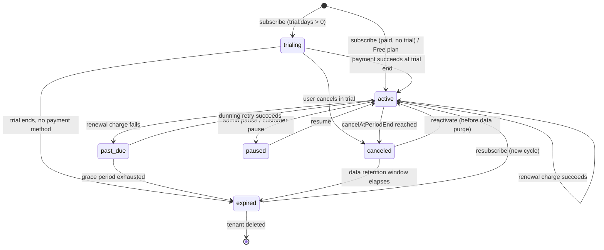
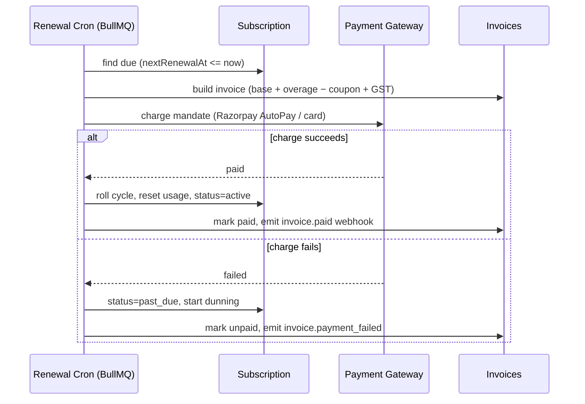
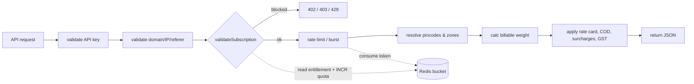

# Subscription & Plan Engine

The Subscription & Plan Engine is the commercial heart of Postpin: it turns the shipping-rate API into a metered SaaS product. Admins compose **plans** (never hardcoded) that bundle price, billing interval, API-call quota, rate/burst limits, domain and API-key caps, storage, support level, webhook limits and an overage rate. Every customer holds exactly one **subscription** that references a plan, tracks a billing cycle, lifecycle state (`trialing → active → past_due → canceled/expired`), live usage counters and an applied coupon. This document specifies the data model, quota and token-bucket enforcement in Redis, the billing cycle (proration, overage, dunning, trials), how subscription validation plugs into the [Shipping Engine](04-shipping-engine.md) pipeline, and ships four concrete India-priced plans (Free, Starter, Growth, Scale) plus an Enterprise contact tier.

## Contents

- [Design Principles](#design-principles)
- [Plan Model](#plan-model)
- [Subscription Model](#subscription-model)
- [Subscription Lifecycle](#subscription-lifecycle)
- [Quota Enforcement](#quota-enforcement)
- [Rate Limiting & Burst (Token Bucket)](#rate-limiting--burst-token-bucket)
- [Billing Cycle, Proration & Overage](#billing-cycle-proration--overage)
- [Dunning, Grace & Trials](#dunning-grace--trials)
- [Pipeline Integration: `validateSubscription`](#pipeline-integration-validatesubscription)
- [Sample Plans (Comparison Table)](#sample-plans-comparison-table)
- [Plans & Subscriptions JSON](#plans--subscriptions-json)
- [API Surface](#api-surface)
- [Edge Cases & Failure Handling](#edge-cases--failure-handling)
- [Related Documents](#related-documents)

---

## Design Principles

1. **Plans are data, not code.** A Super Admin creates, clones, versions and retires plans from the dashboard. The shipping engine reads limits from the subscription's *snapshot* of the plan, never from a `switch` statement. See [Settings & Configuration](14-settings-config.md).
2. **Limits are snapshotted at subscription time.** When a customer subscribes, the relevant plan limits are copied into `subscription.limits`. Editing a live plan never silently changes an existing subscriber's entitlements; changes apply on the next renewal or an explicit migration. This guarantees billing determinism and avoids "the admin nerfed my plan mid-cycle" support tickets.
3. **Redis is the hot path; MongoDB is the source of truth.** Counters, token buckets and cached entitlements live in Redis for sub-millisecond reads on every API call. MongoDB holds the durable record and is reconciled by background jobs (BullMQ) on a fixed cadence.
4. **Fail safe, not fail open.** If Redis is unavailable, the engine degrades to a conservative MongoDB read with a short local cache rather than waving every request through. A hard outage returns `503` with `Retry-After`, never a free unlimited window.
5. **Everything is auditable.** Plan edits, subscription state transitions, proration math and overage charges write to `auditLogs` with before/after snapshots.

---

## Plan Model

A plan is stored in the `plans` collection. Plans are **versioned** (`version`, `isCurrent`) so historical subscriptions can reference the exact terms they bought.

### Plan fields

| Field | Type | Description |
|---|---|---|
| `_id` | ObjectId | Internal id |
| `code` | string | Stable machine code, e.g. `growth` (immutable across versions) |
| `version` | int | Increments on any limit/price change |
| `isCurrent` | bool | Only one version per `code` is current/sellable |
| `name` | string | Display name, e.g. "Growth" |
| `description` | string | Marketing one-liner |
| `tier` | int | Ordering weight (0=Free … 4=Enterprise); used to classify upgrade vs downgrade |
| `visibility` | enum | `public` \| `private` \| `legacy` (legacy = not sellable, still honored) |
| `price.amount` | int | **Minor units (paise)**. ₹2,499 → `249900` |
| `price.currency` | string | `INR` |
| `price.interval` | enum | `month` \| `year` |
| `price.intervalCount` | int | Usually `1` (e.g. `interval=year, intervalCount=1`) |
| `trial.days` | int | `0` = no trial |
| `trial.requiresCard` | bool | Card-on-file required to start trial |
| `limits.apiCalls` | int | Included calls per billing cycle (`-1` = unlimited, Enterprise only) |
| `limits.rpm` | int | Sustained requests per minute (token-bucket refill rate) |
| `limits.burst` | int | Token-bucket capacity (max instantaneous burst) |
| `limits.domains` | int | Allowed origin domains (CORS/referer allowlist) |
| `limits.apiKeys` | int | Max active API keys |
| `limits.storageMB` | int | Stored data quota (logs retention, exports, custom rate cards) |
| `limits.webhooks` | int | Max registered webhook endpoints |
| `limits.support` | enum | `community` \| `email` \| `priority` \| `dedicated` |
| `overage.enabled` | bool | If false, requests are hard-blocked at quota |
| `overage.ratePerCall` | int | Paise per call beyond quota (e.g. `15` = ₹0.15/call) |
| `overage.hardCap` | int | Max billable overage calls per cycle (`-1` = uncapped); protects customer from runaway bills |
| `features` | string[] | Feature flags: `rate_card_custom`, `bulk_csv`, `sandbox`, `priority_queue`, `sla_99_9`, `white_label` |
| `gstApplicable` | bool | Whether Indian GST (18%) is added at invoice time |
| `hsnSac` | string | SAC code for the service (e.g. `998314` – IT/data services) for GST invoicing |
| `metadata` | object | Free-form admin notes |
| `createdAt` / `updatedAt` | date | Audit timestamps |

### Plan validation rules (enforced on create/update)

- `burst >= rpm` (a bucket must hold at least one minute of sustained rate, otherwise sustained traffic can never refill).
- `overage.ratePerCall > 0` whenever `overage.enabled` is true.
- Editing a plan with active subscribers **creates a new version** and flips `isCurrent`; the prior version becomes `visibility=legacy`. Existing subscribers keep their snapshot until renewal/migration.
- `price.amount === 0` forces `overage.enabled = false` and `trial.days = 0` (Free plans never bill).
- `limits.apiCalls === -1` (unlimited) is only allowed for `tier >= 4` (Enterprise) and forces `overage.enabled = false`.

---

## Subscription Model

Stored in `subscriptions`, one row per company (tenant). A company has exactly **one active subscription** at a time; historical subscriptions are kept with terminal states for billing history.

### Subscription fields

| Field | Type | Description |
|---|---|---|
| `_id` | ObjectId | Internal id |
| `companyId` | ObjectId | Tenant owner (see [Multi-Tenancy & RBAC](03-multitenancy-rbac.md)) |
| `planCode` | string | References `plans.code` |
| `planVersion` | int | Exact plan version purchased |
| `limits` | object | **Snapshot** of the plan's limits at purchase/renewal time |
| `overage` | object | Snapshot of overage terms |
| `status` | enum | `trialing` \| `active` \| `past_due` \| `canceled` \| `expired` \| `paused` |
| `billing.cycleStart` | date | Current period start (UTC) |
| `billing.cycleEnd` | date | Current period end (UTC, exclusive) |
| `billing.anchorDay` | int | Day-of-month anchor (1–28) for predictable renewals |
| `billing.nextRenewalAt` | date | When the next invoice is generated |
| `billing.autoRenew` | bool | Auto-charge on renewal |
| `billing.cancelAtPeriodEnd` | bool | Scheduled non-renewal |
| `payment.gateway` | enum | `razorpay` \| `stripe` \| `manual` (Razorpay is the India default) |
| `payment.customerId` | string | Gateway customer ref |
| `payment.subscriptionId` | string | Gateway subscription ref (for gateway-managed recurring) |
| `payment.mandateId` | string | UPI AutoPay / e-NACH mandate for recurring debit |
| `payment.lastInvoiceId` | ObjectId | Pointer to latest invoice (see [Billing & Invoices](10-billing-invoices.md)) |
| `trial.endsAt` | date | Trial expiry (null if not trialing) |
| `coupon` | object | Applied coupon snapshot (see [Coupons & Promotions](11-coupons.md)) |
| `usage.apiCalls` | int | Calls consumed this cycle (reconciled from Redis) |
| `usage.overageCalls` | int | Billable overage calls accrued this cycle |
| `usage.storageMB` | int | Current storage consumption |
| `usage.lastReconciledAt` | date | Last Redis→Mongo reconciliation |
| `dunning` | object | Retry state when `past_due` (attempt count, next retry, grace end) |
| `grandfathered` | bool | True if customer keeps an old price after a plan price increase |
| `createdAt` / `updatedAt` | date | Timestamps |

### Why snapshot `limits` and `overage`?

The shipping engine validates against `subscription.limits`, **not** the live plan. This means:

- A plan price hike or limit change never breaks an in-flight billing cycle.
- Downgrades take effect at period boundaries cleanly (the snapshot is replaced on renewal).
- Disputes are resolvable: "you were on Growth v3, which included 200k calls" is provable from the subscription document alone.

---

## Subscription Lifecycle



### State semantics

| State | API access | Billing behavior | Notes |
|---|---|---|---|
| `trialing` | Full plan limits | No charge yet | Trial counters reset to plan quota; ends at `trial.endsAt` |
| `active` | Full plan limits | Charged each cycle | Normal operating state |
| `past_due` | **Grace access** (degraded, see below) | Dunning retries running | Read-only/limited window before suspension |
| `paused` | Blocked (`402`) | No charge while paused | Customer-initiated hold or admin action; usage frozen |
| `canceled` | Access until `cycleEnd`, then blocked | No future charges | `cancelAtPeriodEnd=true`; reversible until purge |
| `expired` | Blocked (`402`/`403`) | None | Terminal; resubscribe creates fresh cycle |

### Grace access during `past_due`

When a renewal fails, we do **not** instantly cut off a paying customer (bad for retention and for their downstream eCommerce checkout). Instead:

- Days 0–`graceDays` (default **7**): API keeps serving at full limits, response headers carry `X-Postpin-Billing-Status: past_due` and a dashboard banner appears.
- After `graceDays`: API is suspended (`402 Payment Required`), but data is retained for the data-retention window (default **30** days) before purge eligibility.

---

## Quota Enforcement

Quota is the **monthly/cycle call allowance** (`limits.apiCalls`). It is enforced with a Redis counter that is authoritative within a cycle and reconciled to MongoDB.

### Keys & counters

```
quota:{companyId}:{cycleId}        # INT, calls consumed this cycle (TTL = cycleEnd + 7d)
quota:{companyId}:{cycleId}:over   # INT, billable overage calls this cycle
entitlement:{companyId}            # HASH cache of snapshot limits (TTL 300s)
```

`cycleId` is `YYYYMM` for monthly or `YYYY` + period index for annual, derived from `billing.cycleStart`. Including `cycleId` in the key means a new cycle starts a fresh counter with zero migration cost — the old key simply TTLs out after a 7-day reconciliation safety margin.

### Enforcement algorithm (per request)

```text
1. counter = INCR quota:{companyId}:{cycleId}        # atomic
   (on first INCR of a cycle, set TTL to cycleEnd + 7d)
2. limit = entitlement.apiCalls (from cache; refresh from Mongo on miss)
3. if limit == -1:                      # unlimited (Enterprise)
       allow
4. else if counter <= limit:            # within included quota
       allow
5. else:                                # over quota
       if not overage.enabled:
           DECR counter                 # don't count blocked calls
           return 429 QUOTA_EXCEEDED
       overCount = INCR quota:{companyId}:{cycleId}:over
       if overage.hardCap != -1 and overCount > overage.hardCap:
           DECR both counters
           return 429 OVERAGE_CAP_REACHED
       allow (this call is billable at overage.ratePerCall)
```

Notes:

- We `INCR` first then evaluate so the check is atomic under concurrency; blocked calls are `DECR`-ed back so a flood of rejected requests does not inflate the counter.
- Soft-limit notifications fire at **80%** and **100%** of quota (BullMQ job watching the counter), emailing the customer and surfacing a dashboard alert plus webhook event `quota.threshold` (see [Webhooks](13-webhooks.md)).
- Storage, domains, API keys and webhook limits are enforced at **write time** in their respective admin/portal endpoints (creating the N+1th key returns `409 LIMIT_REACHED`), not on the hot request path.

### Reconciliation (BullMQ, every 60s + on cycle close)

A worker reads the Redis counters and writes `usage.apiCalls` / `usage.overageCalls` to the subscription doc. On cycle close it freezes the final overage count, generates the overage line item, and rolls the cycle. Redis remains source-of-truth intra-cycle; Mongo is the durable ledger and the value shown in slower dashboards/reports.

---

## Rate Limiting & Burst (Token Bucket)

Quota answers "how many calls this month"; rate limiting answers "how fast right now". We use a **token bucket per API key** (not per company) implemented atomically in Redis via a Lua script so the bucket can never be read/modified in a race.

- **Capacity** = `limits.burst` (max tokens; allows short spikes).
- **Refill rate** = `limits.rpm / 60` tokens per second (sustained throughput).
- Each request consumes **1 token**. Empty bucket → `429 RATE_LIMITED` with `Retry-After`.

### Redis Lua token bucket

```lua
-- KEYS[1] = bucket key  e.g. ratelimit:{apiKeyId}
-- ARGV[1] = capacity (burst)
-- ARGV[2] = refill_per_sec  (rpm/60, may be fractional)
-- ARGV[3] = now_ms
-- ARGV[4] = requested tokens (1)
local data    = redis.call('HMGET', KEYS[1], 'tokens', 'ts')
local cap     = tonumber(ARGV[1])
local rate    = tonumber(ARGV[2])
local now     = tonumber(ARGV[3])
local want    = tonumber(ARGV[4])
local tokens  = tonumber(data[1])
local ts      = tonumber(data[2])
if tokens == nil then tokens = cap; ts = now end
-- refill based on elapsed time
local delta   = math.max(0, now - ts) / 1000.0
tokens        = math.min(cap, tokens + delta * rate)
local allowed = tokens >= want
if allowed then tokens = tokens - want end
redis.call('HSET', KEYS[1], 'tokens', tokens, 'ts', now)
-- expire idle buckets so cold keys cost no memory
redis.call('PEXPIRE', KEYS[1], math.ceil((cap / rate) * 1000) + 1000)
-- return allowed flag + tokens left (for headers) + ms until 1 token
local retry_ms = allowed and 0 or math.ceil(((want - tokens) / rate) * 1000)
return { allowed and 1 or 0, math.floor(tokens), retry_ms }
```

### Standard response headers (every API response)

| Header | Meaning |
|---|---|
| `X-RateLimit-Limit` | `limits.rpm` |
| `X-RateLimit-Burst` | `limits.burst` |
| `X-RateLimit-Remaining` | Tokens currently in bucket |
| `Retry-After` | Seconds until a token is available (on `429` only) |
| `X-Quota-Limit` | `limits.apiCalls` for the cycle |
| `X-Quota-Remaining` | `max(0, limit - counter)` |
| `X-Quota-Reset` | Unix seconds at `cycleEnd` |
| `X-Postpin-Billing-Status` | `active` \| `trialing` \| `past_due` |

### Why per-key, not per-company

A company on Growth gets `limits.apiKeys = 5`. If rate limiting were per-company, a single noisy key could starve the others. Per-key buckets give each key the full plan RPM; abuse of one key cannot degrade a sibling integration. Quota (the money-bound metric) stays per-company so the bill is correct.

---

## Billing Cycle, Proration & Overage

### Anchored cycles

Each subscription has a `billing.anchorDay` in `[1, 28]` (capped at 28 to avoid February/short-month drift). Renewal occurs at `00:00 UTC` on the anchor day. A subscription started on the 31st is anchored to 28.



### Proration on upgrade / downgrade

Proration uses **time-remaining credit** on the current plan against the **cost of the new plan** for the remainder of the cycle.

```text
let cycleSeconds   = cycleEnd - cycleStart
let remaining      = cycleEnd - now
let frac           = remaining / cycleSeconds          # 0..1
let unusedCredit   = oldPlan.price.amount * frac        # paise
let newPlanProrated= newPlan.price.amount * frac        # paise
let chargeNow      = max(0, newPlanProrated - unusedCredit)
```

| Scenario | Behavior |
|---|---|
| **Upgrade** (higher tier) | Effective **immediately**. Charge `chargeNow` (prorated difference) at once. New limits snapshot replaces old; quota counter retained (you keep consumed calls, ceiling raised). Burst/RPM raised immediately. |
| **Downgrade** (lower tier) | Effective at **next cycle boundary** by default (avoids refunds and mid-cycle limit shock). Optionally immediate with a credit note for `unusedCredit − newPlanProrated`, applied to the next invoice (no cash refund). If current usage already exceeds the new plan's quota, the customer is warned and the downgrade is queued for period end. |
| **Same tier, interval change** (month→year) | Treated as upgrade; annual proration credit applied. |
| **Free → paid** | No credit (free is ₹0); start a fresh paid cycle from `now`, anchor recalculated. |
| **Paid → Free** | At period end; downgrade snapshot to Free limits. |

Credits are tracked as `creditBalance` on the company and consumed before charging the next invoice. Postpin never issues cash refunds automatically — refunds are an admin action with `auditLogs` entry.

### Overage billing

- During the cycle, billable overage calls accumulate in `quota:{companyId}:{cycleId}:over`.
- At cycle close, `overageCalls × overage.ratePerCall` becomes an invoice line item:

```text
overageAmount = overageCalls * overage.ratePerCall      # paise
overageAmount = min(overageAmount, overage.hardCap * overage.ratePerCall)  # if capped
```

- Overage is **never** charged mid-cycle for standard plans (predictable billing); it appears on the renewal invoice. Enterprise contracts may opt into threshold-triggered intermediate invoices.

### GST (India)

When `plan.gstApplicable`, an 18% GST line is added at invoice time, split CGST 9% + SGST 9% (intra-state) or IGST 18% (inter-state), determined by comparing the customer's GSTIN state code to Postpin's place of supply. The invoice carries `hsnSac` and the customer GSTIN. All math is in paise to avoid float rounding; rounding to the nearest paisa happens once per line item. Full invoice formatting lives in [Billing & Invoices](10-billing-invoices.md).

---

## Dunning, Grace & Trials

### Dunning (failed-payment retries)

When a renewal/upgrade charge fails, the subscription enters `past_due` and a dunning schedule starts (BullMQ delayed jobs):

| Attempt | Delay after failure | Action |
|---|---|---|
| 1 | Immediate | Retry charge; email "payment failed" |
| 2 | +1 day | Retry; email reminder |
| 3 | +3 days | Retry; in-app banner + webhook `invoice.payment_failed` |
| 4 | +5 days | Final retry; "service will be suspended" email |
| Grace end | +7 days total | Suspend API (`402`); status stays `past_due` until manual fix or `expired` |

- Any successful retry returns the subscription to `active`, rolls the cycle, resets counters.
- `dunning.attempts`, `dunning.nextRetryAt`, `dunning.graceEndsAt` are persisted so retries survive worker restarts.
- After grace end + retention window with no payment → `expired`; tenant data becomes purge-eligible (see [Data Retention](14-settings-config.md)).

### Trials

- A plan with `trial.days > 0` starts the subscription in `trialing` with full plan limits and `trial.endsAt = now + trial.days`.
- `trial.requiresCard = true` collects a mandate up front and auto-converts to `active` (first charge) at trial end. `false` lets users trial card-free but they hit `402` at trial end until they add a method.
- **One trial per company per plan family** — enforced by a `trialHistory` set on the company to prevent serial-trial abuse. A coupon may override this (e.g. a sales-issued extended trial).
- Trial-to-paid conversion and trial expiry both emit webhooks (`subscription.activated`, `subscription.trial_ended`) and notifications.

---

## Pipeline Integration: `validateSubscription`

The subscription check is **stage 3** of the shipping-engine pipeline, after API-key validation and domain/origin checks, before rate limiting and the actual calculation. See [Shipping Engine](04-shipping-engine.md) and [API Keys & Auth](06-api-keys-auth.md).



### Middleware contract

```ts
// returns a decision the gateway turns into an HTTP response or proceeds
type SubDecision =
  | { ok: true; limits: Limits; billingStatus: BillingStatus; overageBillable: boolean }
  | { ok: false; code: SubError; httpStatus: 402 | 403 | 429 | 503; retryAfter?: number };

async function validateSubscription(ctx: RequestCtx): Promise<SubDecision> {
  // 1. Load entitlement (cache → Mongo). Cache key entitlement:{companyId}, TTL 300s.
  const ent = await loadEntitlement(ctx.companyId);   // {status, limits, overage, cycleId, cycleEnd}

  // 2. State gate
  if (['expired', 'paused'].includes(ent.status)) return blocked(402, 'SUBSCRIPTION_INACTIVE');
  if (ent.status === 'canceled' && now > ent.cycleEnd) return blocked(402, 'SUBSCRIPTION_ENDED');
  if (ent.status === 'past_due' && now > ent.dunning.graceEndsAt) return blocked(402, 'PAYMENT_REQUIRED');
  // trialing | active | (past_due within grace) | (canceled before cycleEnd) → continue

  // 3. Quota (atomic INCR + overage logic from "Quota Enforcement")
  const q = await checkAndIncrementQuota(ctx.companyId, ent);
  if (!q.allowed) return blocked(429, q.code);        // QUOTA_EXCEEDED | OVERAGE_CAP_REACHED

  return {
    ok: true,
    limits: ent.limits,
    billingStatus: ent.status,
    overageBillable: q.overageBillable,
  };
}
```

### Resilience

- **Cache miss / Mongo slow:** entitlement loader has a 50ms budget; on timeout it serves the last-known cached entitlement (stale-while-revalidate) and logs a `degraded` flag.
- **Redis down:** quota falls back to the Mongo `usage.apiCalls` snapshot (slightly stale, conservative) and rate limiting falls back to a coarse per-process limiter; if Mongo is *also* unreachable → `503 + Retry-After`. The engine never fails open into unlimited free usage.
- **Clock:** all cycle math is UTC; `cycleEnd` comparisons use server time synced via NTP.

The decision's `overageBillable` flag is attached to the `apiLogs` entry so billing can reconcile billable vs included calls precisely.

---

## Sample Plans (Comparison Table)

Realistic India-first pricing (INR, exclusive of 18% GST). Quotas are per **monthly** cycle. ₹ values shown for humans; JSON stores paise.

| | **Free** | **Starter** | **Growth** | **Scale** | **Enterprise** |
|---|---|---|---|---|---|
| **Code** | `free` | `starter` | `growth` | `scale` | `enterprise` |
| **Price / month** | ₹0 | ₹999 | ₹2,499 | ₹7,999 | Contact sales |
| **Price / year** (2 mo free) | ₹0 | ₹9,990 | ₹24,990 | ₹79,990 | Custom |
| **API calls / month** | 1,000 | 25,000 | 200,000 | 1,000,000 | Unlimited / custom |
| **Rate limit (RPM)** | 10 | 60 | 300 | 1,200 | Custom |
| **Burst** | 20 | 120 | 600 | 2,400 | Custom |
| **Domains** | 1 | 3 | 10 | 50 | Unlimited |
| **API keys** | 1 | 3 | 10 | 50 | Unlimited |
| **Storage** | 50 MB | 500 MB | 5 GB | 50 GB | Custom |
| **Webhooks** | 0 | 2 | 10 | 50 | Unlimited |
| **Overage** | — (hard block) | ₹0.20/call | ₹0.15/call | ₹0.10/call | Negotiated |
| **Overage cap** | — | 50,000 | 500,000 | 5,000,000 | Uncapped |
| **Custom rate cards** | No | No | Yes | Yes | Yes |
| **Bulk CSV import/export** | No | Yes | Yes | Yes | Yes |
| **Sandbox keys** | Yes | Yes | Yes | Yes | Yes |
| **Priority queue / SLA** | No | No | No | 99.9% | 99.95% + dedicated |
| **Support** | Community | Email | Priority email | Priority + chat | Dedicated TAM |
| **Trial** | n/a | 14 days, card optional | 14 days, card optional | 14 days, card required | Pilot (sales-set) |
| **GST** | n/a | +18% | +18% | +18% | Per contract |

**Reading the numbers:** Growth at ₹2,499 includes 200k calls (₹0.0125 effective/call); overage at ₹0.15/call nudges heavy users to Scale (1M calls at ₹7,999 ≈ ₹0.008/call). This is the standard SaaS "flat fee + decreasing marginal cost + overage" ladder, tuned so each tier's break-even sits comfortably below the next tier's flat price.

---

## Plans & Subscriptions JSON

### `plans` documents (current versions)

```json
[
  {
    "code": "free",
    "version": 1,
    "isCurrent": true,
    "name": "Free",
    "description": "Kick the tyres. Real rates, low volume.",
    "tier": 0,
    "visibility": "public",
    "price": { "amount": 0, "currency": "INR", "interval": "month", "intervalCount": 1 },
    "trial": { "days": 0, "requiresCard": false },
    "limits": {
      "apiCalls": 1000, "rpm": 10, "burst": 20, "domains": 1,
      "apiKeys": 1, "storageMB": 50, "webhooks": 0, "support": "community"
    },
    "overage": { "enabled": false, "ratePerCall": 0, "hardCap": 0 },
    "features": ["sandbox"],
    "gstApplicable": false,
    "hsnSac": "998314"
  },
  {
    "code": "starter",
    "version": 1,
    "isCurrent": true,
    "name": "Starter",
    "description": "For a single store going live.",
    "tier": 1,
    "visibility": "public",
    "price": { "amount": 99900, "currency": "INR", "interval": "month", "intervalCount": 1 },
    "trial": { "days": 14, "requiresCard": false },
    "limits": {
      "apiCalls": 25000, "rpm": 60, "burst": 120, "domains": 3,
      "apiKeys": 3, "storageMB": 500, "webhooks": 2, "support": "email"
    },
    "overage": { "enabled": true, "ratePerCall": 20, "hardCap": 50000 },
    "features": ["sandbox", "bulk_csv"],
    "gstApplicable": true,
    "hsnSac": "998314"
  },
  {
    "code": "growth",
    "version": 1,
    "isCurrent": true,
    "name": "Growth",
    "description": "Scaling eCommerce with custom rate cards.",
    "tier": 2,
    "visibility": "public",
    "price": { "amount": 249900, "currency": "INR", "interval": "month", "intervalCount": 1 },
    "trial": { "days": 14, "requiresCard": false },
    "limits": {
      "apiCalls": 200000, "rpm": 300, "burst": 600, "domains": 10,
      "apiKeys": 10, "storageMB": 5120, "webhooks": 10, "support": "priority"
    },
    "overage": { "enabled": true, "ratePerCall": 15, "hardCap": 500000 },
    "features": ["sandbox", "bulk_csv", "rate_card_custom"],
    "gstApplicable": true,
    "hsnSac": "998314"
  },
  {
    "code": "scale",
    "version": 1,
    "isCurrent": true,
    "name": "Scale",
    "description": "High-volume platforms and ERPs with SLA.",
    "tier": 3,
    "visibility": "public",
    "price": { "amount": 799900, "currency": "INR", "interval": "month", "intervalCount": 1 },
    "trial": { "days": 14, "requiresCard": true },
    "limits": {
      "apiCalls": 1000000, "rpm": 1200, "burst": 2400, "domains": 50,
      "apiKeys": 50, "storageMB": 51200, "webhooks": 50, "support": "priority"
    },
    "overage": { "enabled": true, "ratePerCall": 10, "hardCap": 5000000 },
    "features": ["sandbox", "bulk_csv", "rate_card_custom", "priority_queue", "sla_99_9"],
    "gstApplicable": true,
    "hsnSac": "998314"
  },
  {
    "code": "enterprise",
    "version": 1,
    "isCurrent": true,
    "name": "Enterprise",
    "description": "Custom volume, dedicated support, white-label.",
    "tier": 4,
    "visibility": "private",
    "price": { "amount": 0, "currency": "INR", "interval": "year", "intervalCount": 1 },
    "trial": { "days": 0, "requiresCard": false },
    "limits": {
      "apiCalls": -1, "rpm": 5000, "burst": 10000, "domains": -1,
      "apiKeys": -1, "storageMB": 512000, "webhooks": -1, "support": "dedicated"
    },
    "overage": { "enabled": false, "ratePerCall": 0, "hardCap": -1 },
    "features": ["sandbox", "bulk_csv", "rate_card_custom", "priority_queue", "sla_99_9", "white_label"],
    "gstApplicable": true,
    "hsnSac": "998314",
    "metadata": { "note": "Pricing negotiated per MSA; populate price on contract sign." }
  }
]
```

### A `subscriptions` document (Growth, active, with overage accruing and a coupon)

```json
{
  "_id": "665f1a2b9c4e1a0012ab34cd",
  "companyId": "664e0099aa11bb22cc33dd44",
  "planCode": "growth",
  "planVersion": 1,
  "limits": {
    "apiCalls": 200000, "rpm": 300, "burst": 600, "domains": 10,
    "apiKeys": 10, "storageMB": 5120, "webhooks": 10, "support": "priority"
  },
  "overage": { "enabled": true, "ratePerCall": 15, "hardCap": 500000 },
  "status": "active",
  "billing": {
    "cycleStart": "2026-06-15T00:00:00.000Z",
    "cycleEnd": "2026-07-15T00:00:00.000Z",
    "anchorDay": 15,
    "nextRenewalAt": "2026-07-15T00:00:00.000Z",
    "autoRenew": true,
    "cancelAtPeriodEnd": false
  },
  "payment": {
    "gateway": "razorpay",
    "customerId": "cust_Nabc123XYZ",
    "subscriptionId": "sub_NdeF456UvW",
    "mandateId": "mandate_upi_autopay_998",
    "lastInvoiceId": "665f00a19c4e1a0012ab0011"
  },
  "trial": { "endsAt": null },
  "coupon": {
    "code": "MONSOON20",
    "type": "percent",
    "value": 20,
    "appliesToCycles": 3,
    "cyclesApplied": 1,
    "snapshotAt": "2026-06-15T00:00:00.000Z"
  },
  "usage": {
    "apiCalls": 213480,
    "overageCalls": 13480,
    "storageMB": 2310,
    "lastReconciledAt": "2026-06-26T11:59:00.000Z"
  },
  "dunning": null,
  "grandfathered": false,
  "createdAt": "2026-03-15T08:22:10.000Z",
  "updatedAt": "2026-06-26T11:59:00.000Z"
}
```

> In this example the customer has consumed 213,480 of 200,000 included calls → 13,480 billable overage calls. At ₹0.15/call the accruing overage is `13480 × 15 = 202200` paise = **₹2,022.00**, which will appear on the 15 Jul renewal invoice alongside the ₹2,499 base, less the 20% `MONSOON20` coupon (applies to base only) and plus 18% GST. The coupon has 2 of 3 cycles remaining.

---

## API Surface

Customer-facing (User Dashboard) and admin endpoints. All under `/v1`. See [API Keys & Auth](06-api-keys-auth.md) for auth and [Super Admin](12-super-admin.md) for admin scopes.

### Customer

| Method | Path | Purpose |
|---|---|---|
| `GET` | `/v1/plans` | List public/sellable plans (current versions) |
| `GET` | `/v1/subscription` | Current subscription + live usage |
| `POST` | `/v1/subscription` | Subscribe / start trial (`{ planCode, couponCode?, interval }`) |
| `PATCH` | `/v1/subscription` | Upgrade/downgrade (`{ planCode, effective: "now" \| "period_end" }`) |
| `POST` | `/v1/subscription/cancel` | Set `cancelAtPeriodEnd` or cancel immediately |
| `POST` | `/v1/subscription/resume` | Clear scheduled cancel / resume from pause |
| `GET` | `/v1/subscription/usage` | Time-series usage vs quota (Recharts data) |
| `POST` | `/v1/subscription/preview` | Dry-run proration math for a plan change (no charge) |

### Admin

| Method | Path | Purpose |
|---|---|---|
| `POST` | `/v1/admin/plans` | Create a plan |
| `PATCH` | `/v1/admin/plans/:code` | Edit → new version + supersede |
| `POST` | `/v1/admin/plans/:code/clone` | Clone as draft |
| `GET` | `/v1/admin/subscriptions` | List/filter subscriptions (status, plan, MRR) |
| `PATCH` | `/v1/admin/subscriptions/:id` | Force state, migrate plan, grandfather, credit |
| `POST` | `/v1/admin/subscriptions/:id/refund` | Issue refund/credit (audited) |

### `POST /v1/subscription/preview` response (upgrade Growth→Scale mid-cycle)

```json
{
  "change": "upgrade",
  "effective": "now",
  "currentPlan": "growth",
  "targetPlan": "scale",
  "cycleRemainingFraction": 0.633,
  "credit": { "unusedCurrent": 158157, "currency": "INR" },
  "chargeNow": {
    "targetProrated": 506336,
    "lessCredit": 158157,
    "net": 348179,
    "gst": 62672,
    "total": 410851,
    "currency": "INR",
    "note": "Amounts in paise. net=₹3,481.79, gst=₹626.72, total=₹4,108.51"
  },
  "newLimitsEffectiveAt": "2026-06-26T12:00:00.000Z",
  "nextRenewalAt": "2026-07-15T00:00:00.000Z"
}
```

---

## Edge Cases & Failure Handling

| Case | Handling |
|---|---|
| **Concurrent requests at the quota boundary** | Atomic `INCR`; blocked calls `DECR`-ed. The check is single-key atomic so two requests can't both "win" the last allowed call. |
| **Redis flush / data loss mid-cycle** | Reconciliation job restores counters from the last Mongo `usage` snapshot (≤60s old). Worst case under-counts ≤1 minute of calls — acceptable, customer-favorable. |
| **Plan edited while customers active** | New version created; actives keep snapshot until renewal. Optional admin "migrate now" applies new snapshot + prorates. |
| **Downgrade below current usage** | Allowed only at period end; if forced immediate, quota is treated as already-consumed and further calls hit overage/block per the new plan. UI warns first. |
| **Trial abuse (serial signups)** | `trialHistory` per company + signup fraud checks (email/domain/device). Repeat trial → starts `active`-no-trial requiring immediate payment. |
| **Coupon + overage interaction** | Coupons apply to **base** subscription amount only, never to overage or GST, unless the coupon explicitly sets `appliesTo: "total"`. See [Coupons & Promotions](11-coupons.md). |
| **Gateway webhook lost/duplicated** | All gateway webhooks are idempotent by event id; payment reconciliation cron cross-checks gateway state with local invoice state every 15 min. |
| **Clock skew across nodes** | Cycle math is UTC server-time; NTP-synced. Token-bucket uses Redis-issued `now_ms` passed in by the app, but compared against bucket `ts` consistently. |
| **Currency rounding** | All money in paise (integers) end-to-end; round to nearest paisa once per invoice line, never on intermediate products. |
| **Mandate expired / revoked (UPI AutoPay, e-NACH)** | Renewal fails → standard dunning; customer prompted to re-authorize mandate; grace access until grace end. |
| **Pause during active cycle** | Usage frozen, `cycleEnd` extended by paused duration on resume so paid time isn't lost. |
| **Annual plan overage** | Overage cap and counters operate on the annual quota; soft-limit alerts fire at 80/100% of the annual allowance. |
| **Subscription with `apiCalls: -1` (Enterprise)** | Quota check short-circuits to allow; only rate/burst limits and contract-level monitoring apply. |
| **Free plan hitting 1,000 calls** | Hard `429 QUOTA_EXCEEDED` (overage disabled); dashboard prompts upgrade; quota resets next cycle. |

---

## Related Documents

- [Shipping Engine](04-shipping-engine.md) — where `validateSubscription` sits in the request pipeline
- [API Keys & Auth](06-api-keys-auth.md) — key validation and per-key rate buckets
- [Multi-Tenancy & RBAC](03-multitenancy-rbac.md) — company scoping and roles
- [Billing & Invoices](10-billing-invoices.md) — invoice generation, GST, payment gateways
- [Coupons & Promotions](11-coupons.md) — discount logic and how coupons attach to subscriptions
- [Super Admin](12-super-admin.md) — admin plan/subscription management UI
- [Webhooks](13-webhooks.md) — `quota.threshold`, `subscription.*`, `invoice.*` events
- [Settings & Configuration](14-settings-config.md) — global defaults (grace days, retention, gateways)
