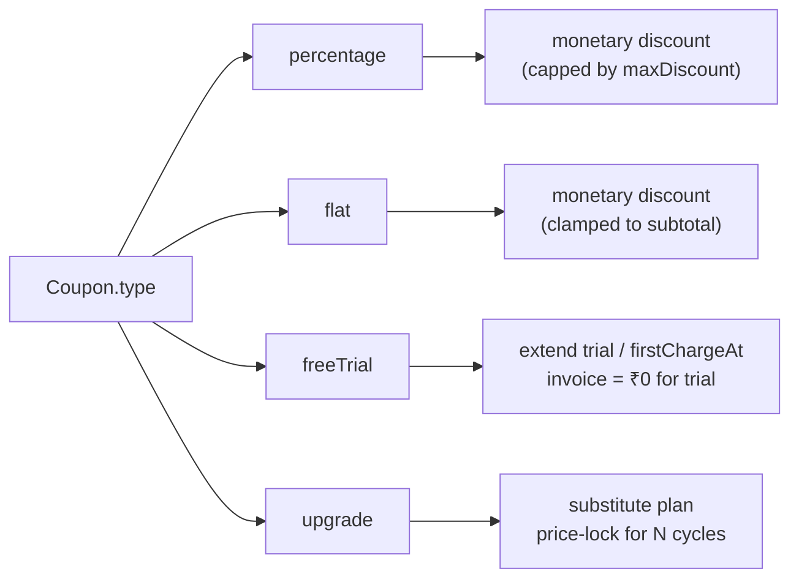
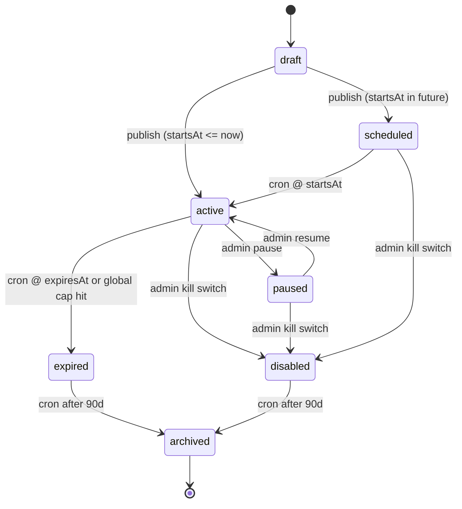
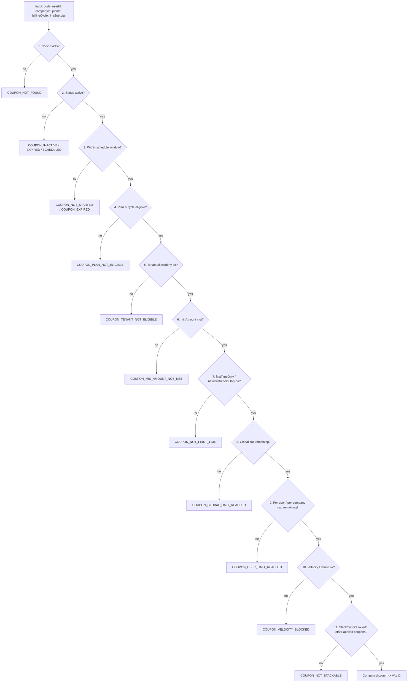
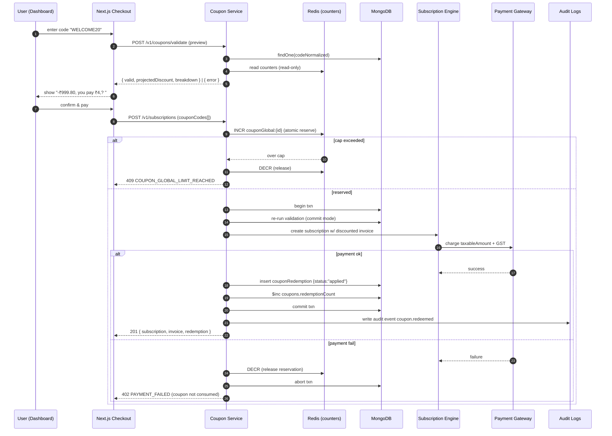

# Coupon & Promotion Builder

Postpin's Coupon & Promotion Builder is the growth-engineering layer that sits in front of the [Subscription Engine](09-subscription-billing.md). It goes well beyond simple percent-off codes: it supports percentage, flat-amount, free-trial-extension, and plan-upgrade coupons, each with a rich configuration surface (expiry windows, global and per-user redemption caps, minimum spend, plan eligibility, stackability, and lifecycle status). Every redemption is tracked in an append-only ledger for abuse prevention and finance reconciliation, validated through a deterministic ordering pipeline, and recorded in [Audit Logs](12-audit-logs.md). This document is the build-from spec: it defines the data model, the validation algorithm, the apply-flow in checkout and plan-change, abuse controls, edge cases, and concrete JSON examples.

## Contents

- [1. Coupon Types](#1-coupon-types)
- [2. Data Model](#2-data-model)
- [3. Lifecycle & Status Machine](#3-lifecycle--status-machine)
- [4. Validation Pipeline & Ordering](#4-validation-pipeline--ordering)
- [5. Conflict & Stacking Rules](#5-conflict--stacking-rules)
- [6. Discount Computation](#6-discount-computation)
- [7. Apply-Flow: Checkout & Plan-Change](#7-apply-flow-checkout--plan-change)
- [8. Redemption Tracking & Abuse Prevention](#8-redemption-tracking--abuse-prevention)
- [9. Error Codes & Failure Handling](#9-error-codes--failure-handling)
- [10. API Surface](#10-api-surface)
- [11. Super Admin Builder UI](#11-super-admin-builder-ui)
- [12. Sample JSON Documents](#12-sample-json-documents)
- [13. Edge Cases & Operational Notes](#13-edge-cases--operational-notes)
- [14. Cross-Links](#14-cross-links)

---

## 1. Coupon Types

Postpin supports four coupon `type`s. Each type drives a different `value` semantic and a different effect on the subscription invoice. All amounts are INR (en-IN), GST is applied per the [Subscription Engine](09-subscription-billing.md) (discount is computed on the **pre-GST** plan amount).

| Type | `type` value | `value` semantics | Effect on invoice | Typical use |
| --- | --- | --- | --- | --- |
| Percentage | `percentage` | `0`–`100`, percent off | Reduces line subtotal by `value%`, optionally capped by `maxDiscount` | "WELCOME20" — 20% off first invoice |
| Flat | `flat` | INR amount off (paise stored) | Reduces line subtotal by the flat amount (never below `0`) | "SAVE500" — ₹500 off |
| Free Trial | `freeTrial` | Trial days granted/extended | Adds `value` days of trial before first charge; sets invoice to ₹0 for the trial term | "TRY14" — extra 14-day trial |
| Upgrade | `upgrade` | Target plan `planId` + price-lock policy | Grants a higher plan at current (or fully waived) plan price for `durationCycles` | "PROUPGRADE" — Pro features at Basic price for 3 months |

### 1.1 Type-specific rules

- **Percentage** — `value ∈ [1,100]`. `maxDiscount` (optional) caps the absolute INR rebate so a 50% coupon on an Enterprise annual plan does not silently give away ₹40,000. If `value === 100`, the invoice becomes ₹0 but the subscription is still created (so payment-method capture / mandate setup still runs for renewal).
- **Flat** — `value` is paise. If `value >= lineSubtotal`, the discount is clamped to `lineSubtotal` (no negative invoices, no credit balance created from a coupon).
- **Free Trial** — does not reduce a monetary amount; it extends `subscription.trialEndsAt` by `value` days and sets `firstChargeAt` accordingly. Mutually exclusive with `percentage`/`flat` on the same invoice (see [Conflict Rules](#5-conflict--stacking-rules)). Stacks only with `upgrade` if explicitly allowed.
- **Upgrade** — references `upgrade.targetPlanId` and a `pricePolicy` (`lockCurrentPrice` | `waive` | `fixedPrice`). It is a *plan-substitution* coupon: the user keeps paying their old price (or the `fixedPrice`) while consuming a higher-tier plan's quota and features for `upgrade.durationCycles` billing cycles, after which the subscription reverts to the target plan's list price (a `subscription.scheduledChange` is written).



---

## 2. Data Model

Collection: **`coupons`** (primary). Supporting collections: **`couponRedemptions`** (append-only ledger), and references into `plans`, `subscriptions`, `companies`, `auditLogs`.

### 2.1 `coupons` schema

```json
{
  "_id": "ObjectId",
  "code": "WELCOME20",
  "codeNormalized": "welcome20",
  "name": "Welcome 20% Off",
  "description": "20% off the first invoice for new signups.",
  "type": "percentage",
  "value": 20,
  "valueUnit": "percent",
  "maxDiscount": 250000,

  "currency": "INR",

  "constraints": {
    "minAmount": 49900,
    "applicablePlans": ["plan_basic", "plan_pro"],
    "applicableBillingCycles": ["monthly", "annual"],
    "firstTimeOnly": true,
    "newCustomersOnly": true,
    "applicableCountries": ["IN"],
    "applicableTenants": [],
    "excludedTenants": []
  },

  "limits": {
    "maxRedemptionsGlobal": 1000,
    "perUserLimit": 1,
    "perCompanyLimit": 1,
    "maxRedemptionsPerDay": null
  },

  "schedule": {
    "startsAt": "2026-06-01T00:00:00.000Z",
    "expiresAt": "2026-09-30T23:59:59.000Z",
    "timezone": "Asia/Kolkata"
  },

  "stackable": false,
  "stackGroup": "welcome",
  "priority": 100,

  "status": "active",

  "upgrade": null,
  "freeTrialDays": null,

  "redemptionCount": 137,
  "lastRedeemedAt": "2026-06-25T11:42:09.000Z",

  "createdBy": "user_admin_42",
  "updatedBy": "user_admin_42",
  "internalNote": "Q3 acquisition campaign, owned by Growth.",
  "tags": ["acquisition", "q3-2026"],

  "createdAt": "2026-05-28T09:00:00.000Z",
  "updatedAt": "2026-05-28T09:00:00.000Z",
  "version": 1
}
```

### 2.2 Field reference

| Field | Type | Required | Notes |
| --- | --- | --- | --- |
| `code` | string | yes | Display/entry code. Stored verbatim for UI. |
| `codeNormalized` | string | yes | `code.trim().toLowerCase()`. **Unique index.** All lookups go through this. |
| `name` | string | yes | Human label shown in admin lists. |
| `type` | enum | yes | `percentage` \| `flat` \| `freeTrial` \| `upgrade`. |
| `value` | number | yes (≠ upgrade) | Percent (`1–100`), paise (flat), or trial days (`freeTrial`). For `upgrade`, may be `null`. |
| `maxDiscount` | number\|null | no | Paise cap; percentage only. |
| `constraints.minAmount` | number\|null | no | Min **pre-discount** line subtotal in paise. |
| `constraints.applicablePlans` | string[] | no | Empty = all plans. |
| `constraints.applicableBillingCycles` | string[] | no | `monthly` \| `quarterly` \| `annual`. Empty = all. |
| `constraints.firstTimeOnly` | bool | no | Only on the company's first paid invoice. |
| `constraints.newCustomersOnly` | bool | no | Company created within `signupGraceDays` (default 7) of redemption. |
| `constraints.applicableTenants` | string[] | no | Allow-list of `companyId`. Empty = all. |
| `constraints.excludedTenants` | string[] | no | Deny-list of `companyId`. |
| `limits.maxRedemptionsGlobal` | number\|null | no | Hard cap across all users. `null` = unlimited. |
| `limits.perUserLimit` | number\|null | no | Redemptions per **user** (`userId`). |
| `limits.perCompanyLimit` | number\|null | no | Redemptions per **tenant** (`companyId`) — the stronger control for multi-seat tenants. |
| `limits.maxRedemptionsPerDay` | number\|null | no | Velocity cap for fraud control. |
| `schedule.startsAt` | ISO date | yes | Coupon inactive before this instant. |
| `schedule.expiresAt` | ISO date\|null | no | `null` = never expires. |
| `schedule.timezone` | IANA tz | yes | Used only for admin display; all comparisons are UTC. |
| `stackable` | bool | yes | Whether it can combine with other coupons in one apply. |
| `stackGroup` | string\|null | no | Two coupons in the same group can never stack even if both `stackable`. |
| `priority` | number | yes | Higher = applied first in a stack and wins conflict ties. |
| `status` | enum | yes | `draft` \| `scheduled` \| `active` \| `paused` \| `expired` \| `disabled` \| `archived`. |
| `upgrade` | object\|null | type=upgrade | `{ targetPlanId, pricePolicy, fixedPrice, durationCycles }`. |
| `freeTrialDays` | number\|null | type=freeTrial | Mirror of `value` for clarity in queries. |
| `redemptionCount` | number | yes | Denormalized counter, source of truth is `couponRedemptions` count. Kept in sync via Redis + reconciliation. |
| `version` | number | yes | Optimistic-concurrency token; bumped on every admin edit. |

### 2.3 Indexes

```js
db.coupons.createIndex({ codeNormalized: 1 }, { unique: true });
db.coupons.createIndex({ status: 1, "schedule.startsAt": 1, "schedule.expiresAt": 1 });
db.coupons.createIndex({ "constraints.applicablePlans": 1 });
db.coupons.createIndex({ tags: 1 });

db.couponRedemptions.createIndex({ couponId: 1, userId: 1 });
db.couponRedemptions.createIndex({ couponId: 1, companyId: 1 });
db.couponRedemptions.createIndex({ couponId: 1, createdAt: 1 });
db.couponRedemptions.createIndex({ subscriptionId: 1 });
db.couponRedemptions.createIndex(
  { couponId: 1, userId: 1, status: 1 },
  { partialFilterExpression: { status: "applied" } }
);
```

---

## 3. Lifecycle & Status Machine

`status` is the authoritative lifecycle field. `scheduled`/`expired` can be **derived** from `schedule`, but we materialize them via a cron sweep so admin lists and counters stay cheap and queryable.



| Status | Redeemable? | How reached |
| --- | --- | --- |
| `draft` | No | Created but not published. |
| `scheduled` | No | Published, `startsAt > now`. |
| `active` | **Yes** | Published and within window, under caps. |
| `paused` | No | Admin temporarily halts (reversible). |
| `expired` | No | `expiresAt < now` **or** `redemptionCount >= maxRedemptionsGlobal`. |
| `disabled` | No | Admin kill switch (intended to be permanent for that code). |
| `archived` | No | Soft-deleted; retained for finance/audit. |

**Status sweep cron** (runs every 5 min; see [Pincode Sync Engine](07-pincode-sync.md) for the cron framework pattern): transitions `scheduled → active`, `active → expired`, and archives terminal coupons older than 90 days. Each transition writes an `auditLogs` entry with `actor: "system:coupon-sweep"`.

---

## 4. Validation Pipeline & Ordering

Validation is **deterministic and ordered**. Cheap/static checks run before expensive/stateful checks, and the order is fixed so error reporting is predictable and tests are stable. The pipeline is invoked both at **preview** (user types a code) and **commit** (payment confirmed) time — preview is read-only, commit is transactional.



### 4.1 Step detail

1. **Lookup** — `coupons.findOne({ codeNormalized })`. Single indexed read.
2. **Status gate** — must be `active`. (`scheduled`/`paused`/`disabled`/`expired` each map to a distinct error so the UI can message correctly.)
3. **Schedule window** — `startsAt <= now <= (expiresAt ?? +∞)`, all in UTC. Belt-and-suspenders even though the sweep usually keeps `status` correct (handles the up-to-5-min gap between window crossing and the next sweep).
4. **Plan/cycle eligibility** — if `applicablePlans` non-empty, `planId` must be in it; same for `applicableBillingCycles`. For `upgrade` coupons, eligibility is checked against the **source** plan (the plan the user currently holds or is buying), not the target.
5. **Tenant gates** — `companyId` must not be in `excludedTenants`; if `applicableTenants` non-empty it must be in it.
6. **Minimum amount** — `lineSubtotal >= minAmount` (pre-discount, pre-GST paise).
7. **First-time / new-customer** — `firstTimeOnly` ⇒ company has zero prior **paid** invoices; `newCustomersOnly` ⇒ `now - company.createdAt <= signupGraceDays`.
8. **Global cap** — atomically check `redemptionCount < maxRedemptionsGlobal` via the Redis counter (see §8.2).
9. **Per-user / per-company cap** — count of `applied` (non-reversed) redemptions for `(couponId,userId)` and `(couponId,companyId)` must be below their limits.
10. **Velocity / abuse** — `maxRedemptionsPerDay`, device/IP fingerprint heuristics, and fraud-list checks (§8.3).
11. **Stack/conflict** — only at commit when other coupons are already in the cart; see §5.

> **Preview vs commit:** Preview runs steps 1–11 read-only and returns the *projected* discount but does **not** decrement counters or write a redemption. Commit re-runs 1–11 inside a transaction with atomic counter reservation, because state can change between preview and payment (TOCTOU). Never trust the preview result at commit.

---

## 5. Conflict & Stacking Rules

By default coupons are **exclusive** (`stackable: false`) — one coupon per invoice. Stacking is opt-in and bounded.

### 5.1 Rules

1. A coupon may stack only if `stackable === true` **for every** coupon in the cart.
2. Two coupons sharing a non-null `stackGroup` can **never** stack (prevents "WELCOME20 + WELCOME50" abuse).
3. At most `MAX_STACK = 2` coupons per invoice (configurable in `settings`).
4. **Type exclusivity matrix** (✓ may stack, ✗ never):

| | percentage | flat | freeTrial | upgrade |
| --- | --- | --- | --- | --- |
| **percentage** | ✗ (same money lever) | ✓ | ✗ | ✓ |
| **flat** | ✓ | ✗ (same money lever) | ✗ | ✓ |
| **freeTrial** | ✗ | ✗ | ✗ | ✓ (if both opt-in) |
| **upgrade** | ✓ | ✓ | ✓ | ✗ (one plan substitution) |

5. **Application order within a stack** — sort by `priority` desc, then `createdAt` asc. Monetary coupons apply sequentially to the *running subtotal* (percentage-then-flat vs flat-then-percentage produces different totals — order is fixed by priority so the result is deterministic and reproducible).
6. **Conflict tie-break** — if two non-stackable coupons are both submitted, reject the **second** with `COUPON_NOT_STACKABLE` and keep the higher-`priority` one; on equal priority keep the one with the larger projected discount.

### 5.2 Worked example (stack)

Cart: Pro monthly = ₹4,999.00 (`499900` paise), GST 18%.
Applied: `PCT15` (percentage 15, priority 100, stackable) + `FLAT300` (flat ₹300, priority 50, stackable, different group).

```
subtotal            = 499900
PCT15 (priority100) = 499900 * 0.15 = 74985  -> running = 424915
FLAT300 (priority50)= 30000          (clamp ok) -> running = 394915
discountTotal       = 104985 (₹1,049.85)
gst (18% of 394915) = 71084.7 -> 71085
invoiceTotal        = 466000  (₹4,660.00)
```

---

## 6. Discount Computation

The computation function is **pure** given `(coupons[], lineSubtotal, plan)`; all I/O (counter checks, redemption writes) happens outside it. This keeps it unit-testable and identical between preview and commit.

```ts
type Money = number; // paise

function computeDiscount(
  coupons: Coupon[],   // already validated & stack-ordered (priority desc, createdAt asc)
  lineSubtotal: Money,
  ctx: { planId: string; billingCycle: string }
): {
  discountTotal: Money;
  taxableAmount: Money;     // lineSubtotal - monetary discounts
  trialDaysGranted: number;
  upgrade?: { targetPlanId: string; pricePolicy: string; fixedPrice?: Money; durationCycles: number };
  breakdown: Array<{ couponId: string; code: string; type: string; amount: Money }>;
} {
  let running = lineSubtotal;
  let discountTotal = 0;
  let trialDaysGranted = 0;
  let upgrade;
  const breakdown = [];

  for (const c of coupons) {
    let amount = 0;
    switch (c.type) {
      case "percentage": {
        amount = Math.round((running * c.value) / 100);
        if (c.maxDiscount != null) amount = Math.min(amount, c.maxDiscount);
        amount = Math.min(amount, running); // never exceed remaining subtotal
        running -= amount;
        discountTotal += amount;
        break;
      }
      case "flat": {
        amount = Math.min(c.value, running); // clamp, no negative
        running -= amount;
        discountTotal += amount;
        break;
      }
      case "freeTrial": {
        trialDaysGranted += c.value;
        // monetary amount is 0; first charge is deferred, not discounted
        break;
      }
      case "upgrade": {
        upgrade = {
          targetPlanId: c.upgrade.targetPlanId,
          pricePolicy: c.upgrade.pricePolicy,
          fixedPrice: c.upgrade.fixedPrice,
          durationCycles: c.upgrade.durationCycles,
        };
        if (c.upgrade.pricePolicy === "waive") {
          amount = running;
          running = 0;
          discountTotal += amount;
        } else if (c.upgrade.pricePolicy === "fixedPrice") {
          amount = Math.max(0, running - c.upgrade.fixedPrice);
          running -= amount;
          discountTotal += amount;
        }
        break;
      }
    }
    breakdown.push({ couponId: c._id, code: c.code, type: c.type, amount });
  }

  return {
    discountTotal,
    taxableAmount: running,        // GST is computed on this in the billing engine
    trialDaysGranted,
    upgrade,
    breakdown,
  };
}
```

**Rounding policy:** all intermediate math is in **paise (integers)**. Percentage uses banker's-agnostic `Math.round`. GST is applied by the [Subscription Engine](09-subscription-billing.md) on `taxableAmount`, never on the gross — so the discount is always pre-tax (matches Indian invoicing where a discount reduces the taxable value).

**Free-trial interaction:** when `trialDaysGranted > 0`, the **first** invoice total is forced to ₹0 and `firstChargeAt = now + trialDaysGranted`. Any monetary coupons in the same stack are rejected at validation step 11 (the matrix forbids `freeTrial` + monetary), so there is no ambiguity about "discount on a free invoice."

---

## 7. Apply-Flow: Checkout & Plan-Change

Coupons enter through two surfaces — **new subscription checkout** and **plan change** (upgrade/downgrade/cycle switch). Both share the validation pipeline; they differ in what `lineSubtotal` and `firstTimeOnly` mean.



### 7.1 Reservation pattern (avoids oversell)

The global cap is enforced with an **optimistic Redis reservation** before payment, then **confirmed** by the redemption write after payment:

1. `INCR couponGlobal:{couponId}` → returns new value `n`.
2. If `n > maxRedemptionsGlobal` → `DECR` immediately and reject. This prevents two concurrent buyers both passing a "count < cap" read.
3. On payment **success** → write redemption + `$inc redemptionCount` (the durable count); the Redis key is a fast-path mirror reconciled hourly against `couponRedemptions`.
4. On payment **failure**, abort, or timeout → `DECR couponGlobal:{couponId}` to release the slot. A **reaper** also releases reservations whose matching redemption never materialized within 15 minutes (covers crashed processes).

### 7.2 Plan-change specifics

- `lineSubtotal` for an upgrade is the **prorated** delta for the remaining cycle (computed by the Subscription Engine), not the full plan price. A `minAmount` constraint therefore tests the proration delta — document this on the coupon (`internalNote`) to avoid surprise.
- `firstTimeOnly` is **false-by-construction** for plan changes (the company already has a paid invoice), so first-time coupons silently fail step 7 on plan-change. Surface a clear message: "This code is for new subscriptions only."
- An `upgrade` coupon applied via plan-change writes a `subscription.scheduledChange` to revert to list price after `durationCycles` and schedules a notification 7 days before reversion (see [Notifications](11-notifications.md)).

---

## 8. Redemption Tracking & Abuse Prevention

### 8.1 `couponRedemptions` schema (append-only ledger)

```json
{
  "_id": "ObjectId",
  "couponId": "ObjectId",
  "code": "WELCOME20",
  "userId": "user_9f2a",
  "companyId": "comp_3310",
  "subscriptionId": "sub_77c1",
  "invoiceId": "inv_8841",

  "context": "checkout",
  "planId": "plan_pro",
  "billingCycle": "monthly",

  "lineSubtotal": 499900,
  "discountAmount": 99980,
  "taxableAmount": 399920,
  "currency": "INR",
  "couponType": "percentage",
  "breakdown": [
    { "couponId": "ObjectId", "code": "WELCOME20", "type": "percentage", "amount": 99980 }
  ],

  "status": "applied",
  "reversalReason": null,
  "reversedAt": null,
  "reversalRedemptionId": null,

  "fraudSignals": {
    "ip": "203.0.113.45",
    "ipHash": "sha256:9a3f...",
    "deviceFingerprint": "fp_5d12...",
    "emailDomain": "acme.in",
    "riskScore": 12,
    "flagged": false
  },

  "redeemedAt": "2026-06-25T11:42:09.000Z",
  "createdAt": "2026-06-25T11:42:09.000Z"
}
```

`status` ∈ `applied` | `reversed` | `pending` | `void`. Per-user/company limits count only `applied`. Reversals (refund, chargeback, fraud clawback) write a **new** ledger row with `status: "reversed"` and link `reversalRedemptionId`, and `$inc redemptionCount: -1` — the ledger is never mutated in place, preserving an immutable financial trail for [Audit Logs](12-audit-logs.md).

### 8.2 Counter integrity

- **Source of truth:** `count(couponRedemptions where status="applied")`.
- **Hot path:** Redis `couponGlobal:{id}` (reservations) + denormalized `coupons.redemptionCount`.
- **Reconciliation cron (hourly):** `redemptionCount = countApplied`; resets the Redis key to match; logs drift to `auditLogs` if `|drift| > 0`.

### 8.3 Abuse prevention controls

| Vector | Control |
| --- | --- |
| One user redeeming repeatedly | `perUserLimit` on `userId`. |
| Multi-account / disposable-email farming | `perCompanyLimit`, `newCustomersOnly`, disposable-email-domain blocklist, `ipHash` clustering — N redemptions from one `ipHash` in 24h raises `riskScore`. |
| Code sharing / leak going viral | `maxRedemptionsGlobal` + `maxRedemptionsPerDay` velocity cap; auto-pause when daily redemptions exceed a configurable z-score baseline. |
| Self-referral / device farming | `deviceFingerprint` clustering; `riskScore >= flagThreshold` ⇒ redemption written `status:"pending"` and held for manual review instead of `applied`. |
| TOCTOU oversell | Redis reservation pattern (§7.1). |
| Stacking exploits | `stackGroup`, type-exclusivity matrix, `MAX_STACK`. |
| Replay after refund | Reversal clawback restores caps; refunded redemption no longer counts toward `firstTimeOnly`/limits. |

`riskScore` is a 0–100 additive heuristic (IP cluster density, fingerprint reuse, email-domain reputation, account age). `flagThreshold` (default 70) is in `settings.coupons`. Flagged redemptions never block payment; they hold the *benefit* pending review so the user is not stranded mid-checkout.

---

## 9. Error Codes & Failure Handling

All coupon errors return HTTP `422` (validation) or `409` (conflict/cap) with a stable `code` and a user-safe `message`. Never leak whether a code *exists* differently from whether it is *eligible* beyond what's needed — but Postpin chooses usability: distinct messages for not-found vs ineligible are acceptable here because coupon codes are low-sensitivity marketing assets.

| Code | HTTP | User message | Retryable? |
| --- | --- | --- | --- |
| `COUPON_NOT_FOUND` | 422 | "That code isn't valid." | No |
| `COUPON_INACTIVE` | 422 | "This code is not active." | No |
| `COUPON_SCHEDULED` | 422 | "This code isn't available yet." | Later |
| `COUPON_NOT_STARTED` | 422 | "This offer hasn't started." | Later |
| `COUPON_EXPIRED` | 422 | "This code has expired." | No |
| `COUPON_PLAN_NOT_ELIGIBLE` | 422 | "This code doesn't apply to the selected plan." | Change plan |
| `COUPON_TENANT_NOT_ELIGIBLE` | 422 | "This code isn't available for your account." | No |
| `COUPON_MIN_AMOUNT_NOT_MET` | 422 | "Add ₹{delta} more to use this code." | Yes |
| `COUPON_NOT_FIRST_TIME` | 422 | "This code is for new subscriptions only." | No |
| `COUPON_GLOBAL_LIMIT_REACHED` | 409 | "This offer has been fully claimed." | No |
| `COUPON_USER_LIMIT_REACHED` | 409 | "You've already used this code." | No |
| `COUPON_VELOCITY_BLOCKED` | 409 | "Too many attempts — try again later." | Later |
| `COUPON_NOT_STACKABLE` | 409 | "This code can't be combined with another." | Remove other |
| `COUPON_CURRENCY_MISMATCH` | 422 | "This code isn't valid for your currency." | No |
| `COUPON_PENDING_REVIEW` | 202 | "We're reviewing this offer; it'll apply shortly." | Auto |

**Failure handling principles:**

- **Idempotency:** the commit endpoint accepts an `Idempotency-Key`; a retried request with the same key returns the original result and never double-consumes a coupon (also guarded by the unique partial index on `(couponId,userId,status:"applied")` for single-use coupons).
- **Payment failure ⇒ no consumption:** reservation released, no `applied` row written.
- **Partial system failure:** the redemption write and `subscription` creation are in **one MongoDB transaction**; if the transaction aborts, the Redis reservation reaper releases the slot within 15 minutes.
- **Graceful degradation:** if Redis is unavailable, fall back to a transactional `findOneAndUpdate` on `coupons` with `$inc` guarded by `redemptionCount < maxRedemptionsGlobal` — slower but correct; alert ops.

---

## 10. API Surface

Versioned under `/v1`. Admin routes require `permission: coupons.manage`; user routes require an authenticated session/JWT.

| Method | Path | Audience | Purpose |
| --- | --- | --- | --- |
| `POST` | `/v1/coupons/validate` | User | Preview (read-only) — returns projected discount or error. |
| `POST` | `/v1/subscriptions` | User | Create subscription with `couponCodes[]` (commit). |
| `POST` | `/v1/subscriptions/:id/change-plan` | User | Plan-change with `couponCodes[]` (commit). |
| `GET` | `/v1/admin/coupons` | Admin | List/filter/paginate. |
| `POST` | `/v1/admin/coupons` | Admin | Create coupon. |
| `PATCH` | `/v1/admin/coupons/:id` | Admin | Edit (bumps `version`, audited). |
| `POST` | `/v1/admin/coupons/:id/pause` | Admin | Pause/resume/disable. |
| `GET` | `/v1/admin/coupons/:id/redemptions` | Admin | Redemption ledger for a coupon. |
| `POST` | `/v1/admin/coupons/:id/reverse-redemption` | Admin | Manual clawback. |

### 10.1 Validate (preview) request/response

```json
// POST /v1/coupons/validate
{
  "code": "WELCOME20",
  "planId": "plan_pro",
  "billingCycle": "monthly",
  "context": "checkout",
  "existingCoupons": []
}
```

```json
// 200 OK
{
  "valid": true,
  "coupon": { "code": "WELCOME20", "type": "percentage", "value": 20 },
  "lineSubtotal": 499900,
  "discountTotal": 99980,
  "taxableAmount": 399920,
  "gst": 71986,
  "invoiceTotal": 471906,
  "trialDaysGranted": 0,
  "breakdown": [
    { "code": "WELCOME20", "type": "percentage", "amount": 99980 }
  ]
}
```

```json
// 422 Unprocessable
{
  "valid": false,
  "error": { "code": "COUPON_MIN_AMOUNT_NOT_MET", "message": "Add ₹100.00 more to use this code.", "meta": { "minAmount": 49900, "lineSubtotal": 39900 } }
}
```

---

## 11. Super Admin Builder UI

Lives in the Super Admin portal under **Promotions → Coupons**. Follows the Postpin design system (Space Grotesk headings, Inter body, brand gradient violet→fuchsia, radius 0.75rem, animated Lucide icons). Every interactive element carries a `data-testid` per the global QA convention.

**List view:** sortable table (code, type, status pill, redeemed/cap, window, owner), filters (status, type, plan, tag), Recharts sparkline of daily redemptions per row. Status pills use the system status colors (active `#16A34A`, scheduled `#2563EB`, paused/expired `#D97706`, disabled `#DC2626`).

**Builder (drawer/wizard):**

| Step | Fields | testid examples |
| --- | --- | --- |
| 1. Basics | code, name, type, value, maxDiscount | `coupon-code-input`, `coupon-type-select`, `coupon-value-input` |
| 2. Eligibility | minAmount, plans, cycles, tenants, first-time/new-customer | `coupon-minamount-input`, `coupon-plans-multiselect` |
| 3. Limits | global cap, per-user, per-company, per-day | `coupon-globalcap-input`, `coupon-peruser-input` |
| 4. Schedule | startsAt, expiresAt, timezone | `coupon-startsat-input`, `coupon-expiresat-input` |
| 5. Stacking | stackable toggle, stackGroup, priority | `coupon-stackable-toggle`, `coupon-priority-input` |
| 6. Review | live preview against a sample plan, JSON export | `coupon-save-btn`, `coupon-preview-panel` |

The Review step runs the **same** `/v1/coupons/validate` against a chosen sample plan so admins see the exact buyer-facing math before publishing. "Save as draft" vs "Publish" (`coupon-publish-btn`) maps to the status machine in §3.

---

## 12. Sample JSON Documents

### 12.1 Percentage — "WELCOME20"

```json
{
  "code": "WELCOME20",
  "name": "Welcome 20% Off",
  "type": "percentage",
  "value": 20,
  "maxDiscount": 250000,
  "constraints": {
    "minAmount": 49900,
    "applicablePlans": ["plan_basic", "plan_pro"],
    "applicableBillingCycles": ["monthly", "annual"],
    "firstTimeOnly": true,
    "newCustomersOnly": true,
    "applicableTenants": [],
    "excludedTenants": []
  },
  "limits": { "maxRedemptionsGlobal": 1000, "perUserLimit": 1, "perCompanyLimit": 1, "maxRedemptionsPerDay": null },
  "schedule": { "startsAt": "2026-06-01T00:00:00.000Z", "expiresAt": "2026-09-30T23:59:59.000Z", "timezone": "Asia/Kolkata" },
  "stackable": false, "stackGroup": "welcome", "priority": 100, "status": "active"
}
```

### 12.2 Flat — "SAVE500"

```json
{
  "code": "SAVE500",
  "name": "Flat ₹500 Off",
  "type": "flat",
  "value": 50000,
  "constraints": { "minAmount": 199900, "applicablePlans": [], "applicableBillingCycles": ["annual"], "firstTimeOnly": false },
  "limits": { "maxRedemptionsGlobal": 5000, "perUserLimit": 2, "perCompanyLimit": 2, "maxRedemptionsPerDay": 200 },
  "schedule": { "startsAt": "2026-07-01T00:00:00.000Z", "expiresAt": "2026-07-31T23:59:59.000Z", "timezone": "Asia/Kolkata" },
  "stackable": true, "stackGroup": "festive", "priority": 50, "status": "scheduled"
}
```

### 12.3 Free Trial — "TRY14"

```json
{
  "code": "TRY14",
  "name": "Extra 14-Day Trial",
  "type": "freeTrial",
  "value": 14,
  "freeTrialDays": 14,
  "constraints": { "minAmount": null, "applicablePlans": ["plan_pro"], "firstTimeOnly": true, "newCustomersOnly": true },
  "limits": { "maxRedemptionsGlobal": null, "perUserLimit": 1, "perCompanyLimit": 1 },
  "schedule": { "startsAt": "2026-06-01T00:00:00.000Z", "expiresAt": null, "timezone": "Asia/Kolkata" },
  "stackable": false, "stackGroup": null, "priority": 80, "status": "active"
}
```

### 12.4 Upgrade — "PROUPGRADE"

```json
{
  "code": "PROUPGRADE",
  "name": "Pro features at Basic price",
  "type": "upgrade",
  "value": null,
  "upgrade": { "targetPlanId": "plan_pro", "pricePolicy": "lockCurrentPrice", "fixedPrice": null, "durationCycles": 3 },
  "constraints": { "applicablePlans": ["plan_basic"], "applicableBillingCycles": ["monthly"], "firstTimeOnly": false },
  "limits": { "maxRedemptionsGlobal": 250, "perUserLimit": 1, "perCompanyLimit": 1 },
  "schedule": { "startsAt": "2026-06-15T00:00:00.000Z", "expiresAt": "2026-08-15T23:59:59.000Z", "timezone": "Asia/Kolkata" },
  "stackable": false, "stackGroup": null, "priority": 90, "status": "active"
}
```

### 12.5 Redemption record (applied)

```json
{
  "couponId": "66a1f0c2e4b0a1d2c3e4f5a6",
  "code": "WELCOME20",
  "userId": "user_9f2a",
  "companyId": "comp_3310",
  "subscriptionId": "sub_77c1",
  "invoiceId": "inv_8841",
  "context": "checkout",
  "planId": "plan_pro",
  "billingCycle": "monthly",
  "lineSubtotal": 499900,
  "discountAmount": 99980,
  "taxableAmount": 399920,
  "currency": "INR",
  "couponType": "percentage",
  "breakdown": [{ "code": "WELCOME20", "type": "percentage", "amount": 99980 }],
  "status": "applied",
  "fraudSignals": { "ipHash": "sha256:9a3f...", "deviceFingerprint": "fp_5d12...", "emailDomain": "acme.in", "riskScore": 12, "flagged": false },
  "redeemedAt": "2026-06-25T11:42:09.000Z"
}
```

### 12.6 Redemption record (reversed clawback)

```json
{
  "couponId": "66a1f0c2e4b0a1d2c3e4f5a6",
  "code": "WELCOME20",
  "userId": "user_9f2a",
  "companyId": "comp_3310",
  "subscriptionId": "sub_77c1",
  "invoiceId": "inv_8841",
  "discountAmount": -99980,
  "status": "reversed",
  "reversalReason": "refund",
  "reversalRedemptionId": "66a1f0c2e4b0a1d2c3e4f5a6_orig",
  "reversedAt": "2026-06-28T08:10:00.000Z",
  "redeemedAt": "2026-06-28T08:10:00.000Z"
}
```

---

## 13. Edge Cases & Operational Notes

- **Code casing/whitespace:** users paste "  welcome20 ". Always normalize to `codeNormalized` for lookups; never trust raw input length or casing.
- **Currency:** Postpin is INR-only today; `COUPON_CURRENCY_MISMATCH` is reserved for future multi-currency. Store all money as integer paise to avoid float drift.
- **GST + discount:** discount reduces the **taxable value**; GST is then computed on `taxableAmount`. A coupon never reduces or adds GST directly.
- **100%-off / fully-waived upgrade:** invoice is ₹0 but the subscription and (if applicable) payment-mandate are still created so renewal works — otherwise renewal silently fails next cycle.
- **Annual plan + percentage cap:** always set `maxDiscount` on percentage coupons targeting annual/Enterprise plans to bound liability.
- **Coupon edited mid-campaign:** edits bump `version` and are audited; in-flight previews carry the `version` they were computed against, and commit re-validates against the **current** version (a tightened limit can legitimately reject a stale preview — return a fresh error, don't honor the stale quote).
- **Clock skew / sweep gap:** schedule-window is re-checked at commit (step 3) so the up-to-5-min sweep lag can never let an expired coupon through.
- **Refund/chargeback:** triggers a reversal redemption that restores caps and clears `firstTimeOnly` consumption — the user could legitimately re-qualify later; document this with finance.
- **Concurrent last slot:** Redis reservation guarantees exactly one of two racing buyers wins the final `maxRedemptionsGlobal` slot; the loser gets `COUPON_GLOBAL_LIMIT_REACHED`.
- **Disabled vs expired:** `disabled` is an admin kill switch (incident response, e.g. a leaked code); `expired` is natural end-of-life. Keep them distinct for analytics and audit.
- **Free-trial abuse:** combine `newCustomersOnly` + `perCompanyLimit:1` + disposable-email blocklist; never let `freeTrial` stack with monetary coupons.
- **Reconciliation drift:** if hourly reconciliation finds `redemptionCount != countApplied`, trust the ledger, correct the counter, and emit an `auditLogs` warning — the ledger is the financial source of truth.

---

## 14. Cross-Links

- [Subscription & Billing Engine](09-subscription-billing.md) — invoice math, proration, GST, mandates, scheduled changes.
- [Plans & Pricing](08-plans-pricing.md) — plan IDs, billing cycles, list prices.
- [Notifications](11-notifications.md) — reversion reminders, campaign emails, abuse alerts.
- [Audit Logs](12-audit-logs.md) — immutable trail for coupon CRUD, redemptions, reversals, and sweeps.
- [Pincode Sync Engine](07-pincode-sync.md) — cron framework reused by the coupon status sweep and reconciliation jobs.
- [Shipping Engine](04-shipping-engine.md) — the metered product these subscriptions gate access to.

> **Build note:** the validation pipeline (§4), discount computation (§6), and reservation pattern (§7.1) are the three pieces to get right first — everything else (UI, sweeps, analytics) layers on top. Write the `computeDiscount` unit tests against the §5.2 worked example and the §12 samples before wiring any I/O.
