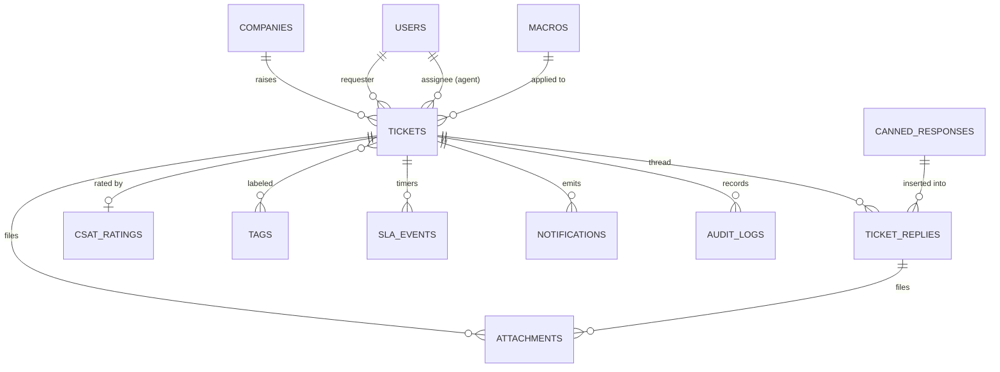
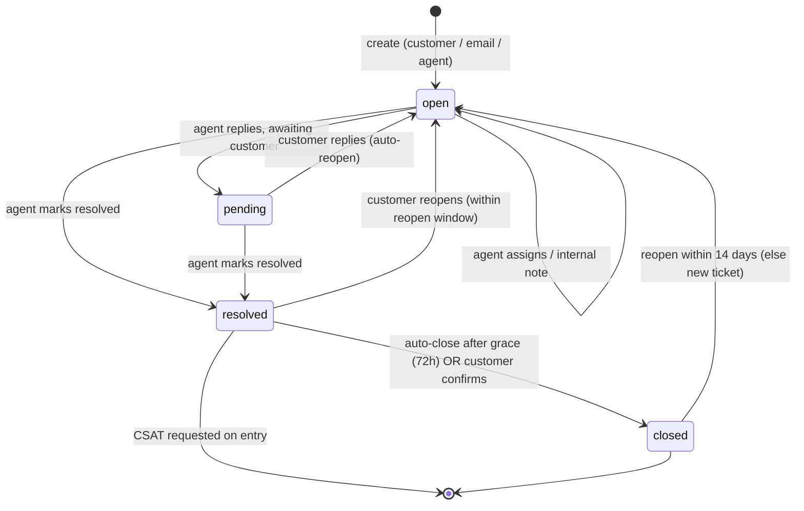
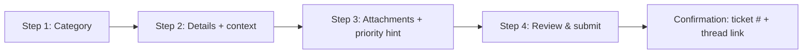
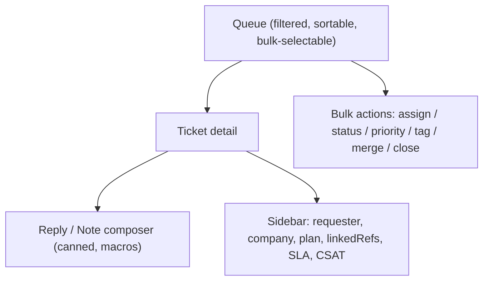
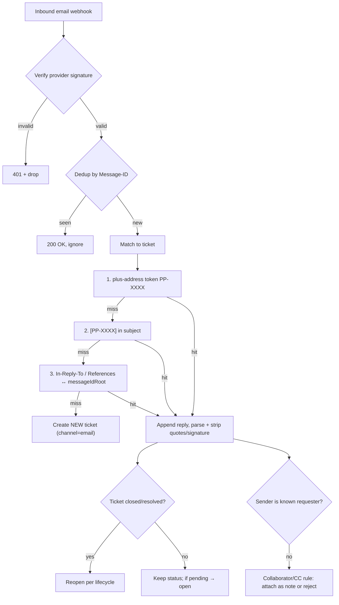

# Support System & Lightweight CRM

Postpin's support module is not a bolt-on ticket form — it is a lightweight, multi-tenant CRM purpose-built for a logistics API platform. It captures the full lifecycle of a customer conversation (create → assign → triage → internal notes → attachments → public reply → email notification → close → CSAT), enforces SLA timers per priority, and gives Super Admin agents a queue with filters, bulk actions, assignment, canned responses and macros. It models tickets and threaded replies as first-class MongoDB collections, threads inbound email back onto the correct ticket, surfaces operational metrics (first-response time, resolution time, CSAT), and routes every state change through the platform [Notification Center](12-notifications.md). Because the most common ticket categories on a shipping-rate API are billing disputes, wrong-rate/API bugs and stale pincode data, the CRM is wired to deep-link directly into the relevant [Rate Cards](05-rate-cards.md), [API Logs](08-api-keys-logs.md) and [Pincode Management](03-pincode-management.md) records so an agent can resolve in one screen.

## Contents

- [Goals & Scope](#goals--scope)
- [Domain Model & Entities](#domain-model--entities)
- [Ticket Lifecycle & State Machine](#ticket-lifecycle--state-machine)
- [Categories, Priority & SLA Policy](#categories-priority--sla-policy)
- [Data Schemas (MongoDB)](#data-schemas-mongodb)
- [Sample JSON: tickets & ticketReplies](#sample-json-tickets--ticketreplies)
- [Customer Experience](#customer-experience)
- [Admin / Agent Experience](#admin--agent-experience)
- [Canned Responses & Macros](#canned-responses--macros)
- [Attachments Handling](#attachments-handling)
- [Email Threading](#email-threading)
- [SLA Engine & Background Jobs](#sla-engine--background-jobs)
- [CSAT (Satisfaction Rating)](#csat-satisfaction-rating)
- [Metrics & Reporting](#metrics--reporting)
- [REST API Surface](#rest-api-surface)
- [Permissions & Multi-Tenancy](#permissions--multi-tenancy)
- [Notification Center Integration](#notification-center-integration)
- [Edge Cases & Failure Handling](#edge-cases--failure-handling)

---

## Goals & Scope

| In scope | Out of scope (use other modules) |
| --- | --- |
| Customer-raised tickets (multi-step form, list, thread) | Live chat / real-time presence (Phase 2) |
| Agent queue, filters, assignment, bulk actions | Full sales pipeline / deal stages |
| Internal vs public notes, attachments, tags | Marketing email campaigns ([Notifications](12-notifications.md) handles transactional only) |
| Threaded email in/out, dedup, parsing | Telephony / call-center routing |
| SLA timers (first response + resolution) with business hours | Knowledge base authoring (links out to Docs portal) |
| CSAT rating + metrics (FRT, resolution time, CSAT %) | Public community forum |
| Canned responses / macros, auto-close | Billing/refund execution (CRM links to [Billing](06-billing-subscriptions.md), does not charge) |

Design principles:

1. **Tenant-scoped, agent-shared.** Every ticket belongs to exactly one `companyId` (the customer's tenant) but is worked by Postpin's internal agents. Customers only see their own tenant's tickets; agents see all tenants subject to RBAC.
2. **Context over chrome.** A ticket carries `linkedRefs` (apiLog, rateCard, pincode, invoice, subscription) so the agent never leaves the screen to diagnose.
3. **Everything is auditable.** Status changes, assignment, merges, SLA breaches and CSAT all emit `auditLogs` entries and `notifications`.
4. **Email is a peer channel.** A ticket can be created, replied to and closed entirely over email, fully mirrored in the dashboard.

---

## Domain Model & Entities



| Entity | Collection | Purpose |
| --- | --- | --- |
| Ticket | `tickets` | Top-level conversation: subject, status, priority, category, assignee, SLA, tags, CSAT |
| Reply | `ticketReplies` | One message in the thread (public reply, customer reply, or internal note) |
| Canned response | `cannedResponses` | Reusable reply snippets with variables |
| Macro | `macros` | Bundle of actions (set status/priority/tag/assignee + insert canned reply) |
| Tag | `tags` (or denormalized array) | Free-form labels for routing & reporting |
| Attachment | embedded `attachments[]` + object store | Files on a ticket or reply |
| SLA event | embedded `sla` + `slaEvents[]` | Target timestamps, pause windows, breach flags |
| CSAT rating | embedded `csat` | 1–5 score + comment after resolution |

---

## Ticket Lifecycle & State Machine

Statuses: `open` → `pending` → `resolved` → `closed`, with `pending` meaning "waiting on customer". Reopen is allowed from `resolved`/`closed` back to `open`.



State-transition rules:

| From | To | Trigger | Side effects |
| --- | --- | --- | --- |
| (none) | `open` | New ticket (form/email/API) | Start FRT + resolution SLA timers; notify assigned queue; ack email to requester |
| `open` | `pending` | Agent public reply with "set pending" | Pause resolution clock optionally (configurable); stop FRT clock on first agent public reply |
| `pending` | `open` | Customer reply OR inbound email match | Resume resolution clock; clear `pending`; notify assignee |
| `open`/`pending` | `resolved` | Agent action or `resolve` macro | Stop resolution clock; send "resolved" email; schedule auto-close job (+72h); enqueue CSAT request |
| `resolved` | `closed` | Auto-close job OR customer confirm | Final close email; lock CSAT window open 7 days; emit metrics |
| `resolved`/`closed` | `open` | Customer reply within reopen window | Reopen; restart resolution SLA (fresh target); notify assignee; cancel pending auto-close |
| `closed` (>14d) | — | Customer reply | Create **new** linked ticket referencing the old one (`relatedTicketIds`) |

**Idempotency / guard rules**

- A transition that does not change state is a no-op (no duplicate notifications).
- Only `open` and `pending` count an open ticket against an agent's load.
- First-response clock stops on the **first public agent reply only** — internal notes never satisfy FRT.

---

## Categories, Priority & SLA Policy

**Categories** (`category`): `billing`, `api`, `pincode-data`, `account`, `feature-request`, `other`. These drive default routing, default priority and which `linkedRefs` the form requests.

| Category | Typical example (Postpin) | Default queue / route | Suggested default priority |
| --- | --- | --- | --- |
| `billing` | "Charged for overage I didn't use" | Billing agents | `high` |
| `api` | "/v1/rates returns wrong zone for 560001 → 110001" | API/Engineering agents | `high` |
| `pincode-data` | "400706 missing / wrong city" | Data agents (links to [Pincode sync](03-pincode-management.md)) | `normal` |
| `account` | "Can't reset password / add team member" | Tier-1 support | `normal` |
| `feature-request` | "Add weight slabs above 50kg" | Product backlog (no SLA resolution) | `low` |
| `other` | Anything uncategorized | Tier-1 support | `normal` |

**Priorities** (`priority`): `urgent`, `high`, `normal`, `low`. Priority is set by agent, by macro, or inferred from category + plan tier (Enterprise customers get one level bump, capped at `urgent`).

**SLA targets** — measured in **business hours** (default IST, Mon–Sat 10:00–19:00, configurable in [Settings](13-settings-admin.md)). `firstResponse` = time to first public agent reply. `resolution` = time to reach `resolved`.

| Priority | First response | Resolution | Notes |
| --- | --- | --- | --- |
| `urgent` | 1 business hour | 8 business hours | Pages on-call via webhook; ignores `pending` pause |
| `high` | 4 business hours | 1 business day | |
| `normal` | 8 business hours | 3 business days | |
| `low` | 1 business day | 5 business days | `feature-request` has FRT only, no resolution SLA |

SLA breach behavior: at 75% of target → "at-risk" notification to assignee + team lead; at 100% → "breached", flagged red in queue, escalation notification to manager, `slaEvents` records the breach. Pausing: when status is `pending` (waiting on customer), the resolution clock pauses if `settings.support.pauseSlaOnPending = true` (default true). Pause windows are stored so reporting can show gross vs net time.

---

## Data Schemas (MongoDB)

### `tickets`

```json
{
  "_id": "ObjectId",
  "ticketNumber": "PP-2026-014823",
  "companyId": "ObjectId(companies)",
  "requester": {
    "userId": "ObjectId(users)|null",
    "name": "Aarav Mehta",
    "email": "aarav@shopkart.in",
    "isGuest": false
  },
  "subject": "Wrong zone returned for Bengaluru → Delhi",
  "status": "open",
  "priority": "high",
  "category": "api",
  "tags": ["zone-mismatch", "enterprise"],
  "assignee": {
    "agentId": "ObjectId(users)|null",
    "agentName": "Priya Nair",
    "assignedAt": "2026-06-26T05:12:44.000Z"
  },
  "channel": "web",
  "source": "dashboard",
  "linkedRefs": {
    "apiLogId": "ObjectId(apiLogs)|null",
    "rateCardId": "ObjectId(rateCards)|null",
    "pincode": "110001|null",
    "invoiceId": "ObjectId(invoices)|null",
    "subscriptionId": "ObjectId(subscriptions)|null"
  },
  "sla": {
    "policyId": "high",
    "businessCalendar": "IST-MonSat-10-19",
    "firstResponseDueAt": "2026-06-26T09:12:44.000Z",
    "resolutionDueAt": "2026-06-29T05:12:44.000Z",
    "firstResponseAt": null,
    "resolvedAt": null,
    "firstResponseBreached": false,
    "resolutionBreached": false,
    "pausedTotalMs": 0,
    "pausedSince": null
  },
  "csat": {
    "requestedAt": null,
    "score": null,
    "comment": null,
    "ratedAt": null
  },
  "counts": { "publicReplies": 0, "internalNotes": 0, "attachments": 1 },
  "lastReply": {
    "by": "customer",
    "at": "2026-06-26T05:12:44.000Z",
    "preview": "Pulling rates for 560001 -> 110001 returns Zone D..."
  },
  "mergedInto": null,
  "relatedTicketIds": [],
  "emailThread": {
    "messageIdRoot": "<pp-014823@mail.postpin.io>",
    "references": ["<pp-014823@mail.postpin.io>"]
  },
  "reopenCount": 0,
  "createdAt": "2026-06-26T05:12:44.000Z",
  "updatedAt": "2026-06-26T05:12:44.000Z",
  "closedAt": null,
  "deletedAt": null
}
```

### `ticketReplies`

```json
{
  "_id": "ObjectId",
  "ticketId": "ObjectId(tickets)",
  "companyId": "ObjectId(companies)",
  "type": "public_reply",
  "visibility": "public",
  "author": {
    "kind": "agent",
    "userId": "ObjectId(users)",
    "name": "Priya Nair",
    "email": "priya@postpin.io"
  },
  "bodyHtml": "<p>Hi Aarav, thanks for the report...</p>",
  "bodyText": "Hi Aarav, thanks for the report...",
  "cannedResponseId": "ObjectId(cannedResponses)|null",
  "attachments": [],
  "email": {
    "messageId": "<reply-99211@mail.postpin.io>",
    "inReplyTo": "<pp-014823@mail.postpin.io>",
    "deliveredAt": "2026-06-26T05:40:10.000Z",
    "deliveryStatus": "sent"
  },
  "isFirstResponse": true,
  "createdAt": "2026-06-26T05:40:00.000Z",
  "editedAt": null,
  "deletedAt": null
}
```

`type` ∈ `customer_message`, `public_reply`, `internal_note`, `system` (status changes, merges, SLA breach markers rendered inline in the thread). `visibility` ∈ `public` (customer sees + emailed) | `internal` (agents only).

### `cannedResponses` and `macros`

```json
{
  "_id": "ObjectId",
  "title": "API: ask for request/response payload",
  "shortcut": "/api-payload",
  "category": "api",
  "bodyHtml": "<p>Hi {{requester.firstName}}, could you share the exact request URL and the JSON response you received for {{linkedRefs.pincode}}?</p>",
  "variables": ["requester.firstName", "linkedRefs.pincode"],
  "scope": "global",
  "createdBy": "ObjectId(users)",
  "usageCount": 412,
  "isActive": true
}
```

```json
{
  "_id": "ObjectId",
  "name": "Resolve duplicate billing",
  "actions": [
    { "op": "setCategory", "value": "billing" },
    { "op": "setPriority", "value": "high" },
    { "op": "addTag", "value": "billing-dispute" },
    { "op": "assignToGroup", "value": "billing" },
    { "op": "insertCannedResponse", "value": "ObjectId(cannedResponses)" },
    { "op": "setStatus", "value": "pending" }
  ],
  "isActive": true
}
```

**Recommended indexes**

| Collection | Index | Why |
| --- | --- | --- |
| `tickets` | `{ companyId: 1, status: 1, updatedAt: -1 }` | Customer + admin lists |
| `tickets` | `{ "assignee.agentId": 1, status: 1 }` | Agent "my queue" |
| `tickets` | `{ status: 1, "sla.resolutionDueAt": 1 }` | SLA scanner |
| `tickets` | `{ ticketNumber: 1 }` unique | Lookup, email subject `[PP-...]` |
| `tickets` | `{ "emailThread.messageIdRoot": 1 }`, `{ "emailThread.references": 1 }` | Email threading match |
| `tickets` | text index on `subject` + `tags` | Search |
| `ticketReplies` | `{ ticketId: 1, createdAt: 1 }` | Thread render |
| `ticketReplies` | `{ "email.messageId": 1 }` unique sparse | Inbound dedup |

---

## Sample JSON: tickets & ticketReplies

A complete worked example — a billing dispute from an Enterprise customer in Mumbai, resolved and rated.

```json
{
  "ticket": {
    "_id": "667c1a2f9b4e2a0012ab34cd",
    "ticketNumber": "PP-2026-009912",
    "companyId": "661f0a119b4e2a0012aa1001",
    "requester": {
      "userId": "661f0a119b4e2a0012aa2044",
      "name": "Sneha Kulkarni",
      "email": "sneha@trendcart.in",
      "isGuest": false
    },
    "subject": "Charged overage despite being under 50,000 calls",
    "status": "closed",
    "priority": "high",
    "category": "billing",
    "tags": ["billing-dispute", "overage", "enterprise"],
    "assignee": {
      "agentId": "661f0a119b4e2a0012aa9001",
      "agentName": "Rahul Verma",
      "assignedAt": "2026-06-20T04:35:00.000Z"
    },
    "channel": "email",
    "source": "email-inbound",
    "linkedRefs": {
      "apiLogId": null,
      "rateCardId": null,
      "pincode": null,
      "invoiceId": "6650aa129b4e2a0012ab7777",
      "subscriptionId": "6640aa129b4e2a0012ab1234"
    },
    "sla": {
      "policyId": "high",
      "businessCalendar": "IST-MonSat-10-19",
      "firstResponseDueAt": "2026-06-20T08:30:00.000Z",
      "resolutionDueAt": "2026-06-22T04:30:00.000Z",
      "firstResponseAt": "2026-06-20T05:10:00.000Z",
      "resolvedAt": "2026-06-20T11:48:00.000Z",
      "firstResponseBreached": false,
      "resolutionBreached": false,
      "pausedTotalMs": 7200000,
      "pausedSince": null
    },
    "csat": {
      "requestedAt": "2026-06-20T11:48:30.000Z",
      "score": 5,
      "comment": "Refund processed same day. Great support.",
      "ratedAt": "2026-06-20T13:02:00.000Z"
    },
    "counts": { "publicReplies": 2, "internalNotes": 1, "attachments": 1 },
    "lastReply": {
      "by": "agent",
      "at": "2026-06-20T11:48:00.000Z",
      "preview": "We've issued a credit of INR 1,180 against invoice INV-2026-0455..."
    },
    "mergedInto": null,
    "relatedTicketIds": [],
    "emailThread": {
      "messageIdRoot": "<pp-009912@mail.postpin.io>",
      "references": ["<CA+abc123@mail.gmail.com>", "<pp-009912@mail.postpin.io>"]
    },
    "reopenCount": 0,
    "createdAt": "2026-06-20T04:30:00.000Z",
    "updatedAt": "2026-06-20T13:02:00.000Z",
    "closedAt": "2026-06-20T11:48:00.000Z",
    "deletedAt": null
  },
  "ticketReplies": [
    {
      "_id": "667c1a2f9b4e2a0012ab3501",
      "ticketId": "667c1a2f9b4e2a0012ab34cd",
      "type": "customer_message",
      "visibility": "public",
      "author": { "kind": "customer", "userId": "661f0a119b4e2a0012aa2044", "name": "Sneha Kulkarni", "email": "sneha@trendcart.in" },
      "bodyText": "My June invoice shows overage charges of INR 1,180 but my usage dashboard says 47,300 calls, under my 50,000 quota. Please review.",
      "attachments": [
        { "fileId": "att_9f12", "name": "invoice-june.pdf", "mime": "application/pdf", "sizeBytes": 88231, "scan": "clean" }
      ],
      "email": { "messageId": "<CA+abc123@mail.gmail.com>", "inReplyTo": null, "deliveryStatus": "received" },
      "isFirstResponse": false,
      "createdAt": "2026-06-20T04:30:00.000Z"
    },
    {
      "_id": "667c1a2f9b4e2a0012ab3502",
      "ticketId": "667c1a2f9b4e2a0012ab34cd",
      "type": "public_reply",
      "visibility": "public",
      "author": { "kind": "agent", "userId": "661f0a119b4e2a0012aa9001", "name": "Rahul Verma", "email": "rahul@postpin.io" },
      "bodyText": "Hi Sneha, thanks for flagging this. I'm checking your metered usage now and will confirm within the hour.",
      "cannedResponseId": "660ccan0012ab0007",
      "attachments": [],
      "email": { "messageId": "<reply-55001@mail.postpin.io>", "inReplyTo": "<pp-009912@mail.postpin.io>", "deliveryStatus": "sent" },
      "isFirstResponse": true,
      "createdAt": "2026-06-20T05:10:00.000Z"
    },
    {
      "_id": "667c1a2f9b4e2a0012ab3503",
      "ticketId": "667c1a2f9b4e2a0012ab34cd",
      "type": "internal_note",
      "visibility": "internal",
      "author": { "kind": "agent", "userId": "661f0a119b4e2a0012aa9001", "name": "Rahul Verma", "email": "rahul@postpin.io" },
      "bodyText": "Confirmed: 2,700 calls were double-counted due to a retry bug on 2026-06-14 (ref INC-204). Billing should credit INR 1,180. Looping in @billing.",
      "attachments": [],
      "isFirstResponse": false,
      "createdAt": "2026-06-20T09:40:00.000Z"
    },
    {
      "_id": "667c1a2f9b4e2a0012ab3504",
      "ticketId": "667c1a2f9b4e2a0012ab34cd",
      "type": "public_reply",
      "visibility": "public",
      "author": { "kind": "agent", "userId": "661f0a119b4e2a0012aa9001", "name": "Rahul Verma", "email": "rahul@postpin.io" },
      "bodyText": "We've issued a credit of INR 1,180 against invoice INV-2026-0455. The double-count was caused by an internal retry bug, now fixed. Apologies for the trouble — marking this resolved.",
      "cannedResponseId": null,
      "attachments": [],
      "email": { "messageId": "<reply-55044@mail.postpin.io>", "inReplyTo": "<reply-55001@mail.postpin.io>", "deliveryStatus": "sent" },
      "isFirstResponse": false,
      "createdAt": "2026-06-20T11:48:00.000Z"
    }
  ]
}
```

---

## Customer Experience

The customer support surface lives in the User Dashboard under **Support**. It has three views: **New Ticket** (multi-step wizard), **My Tickets** (list), and **Ticket Thread** (conversation).

### Multi-step new-ticket form



| Step | Fields | Behavior |
| --- | --- | --- |
| 1. Category | `category` (radio cards) | Choosing `api` reveals a "link an API request" picker that pulls recent failed calls from [API Logs](08-api-keys-logs.md); `billing` reveals an invoice picker; `pincode-data` reveals a pincode lookup. |
| 2. Details | `subject`, `description` (rich text), auto-filled `name`/`email` if logged in | Live validation (Zod). Min 20 chars on description. Requester identity auto-bound to session — never trust client-supplied `companyId`. |
| 3. Context | `attachments`, optional self-assessed urgency | Drag-drop, per-file ≤ 10 MB, ≤ 5 files. Urgency is a hint only; real priority is set by rules/agent. |
| 4. Review | Read-only summary | Submit creates ticket (`status: open`), fires ack email + in-app notification. |

Form is built with `react-hook-form` + `zod`, progress shown via `@radix-ui/react-progress`. Every control carries a `data-testid`, e.g. `support-newticket-category-radio`, `support-newticket-subject-input`, `support-newticket-attach-dropzone`, `support-newticket-submit-btn`, `support-newticket-step-progress`.

### My Tickets list

- Filters: status pill group (`all/open/pending/resolved/closed`), category, search by `ticketNumber`/subject.
- Each row: `ticketNumber`, subject, status badge, priority dot, last-reply relative time, unread indicator. `data-testid="support-ticket-row-{ticketNumber}"`.
- Empty state: friendly illustration + "Ask your first question" CTA (`support-list-empty-cta-btn`).

### Ticket thread (customer)

- Shows only `visibility: public` replies + `system` events; internal notes are never sent to the client API.
- Composer to reply (`support-thread-reply-input`, `support-thread-reply-send-btn`). Customer reply on a `pending`/`resolved`/`closed` ticket auto-reopens per lifecycle rules.
- After resolution, an inline CSAT widget appears (see [CSAT](#csat-satisfaction-rating)).

---

## Admin / Agent Experience

The Super Admin portal exposes a **Support Queue** optimized for throughput.



### Queue

| Capability | Detail |
| --- | --- |
| Filters | status, priority, category, assignee (`me` / unassigned / agent), tags, SLA state (`at-risk`, `breached`), company, channel, date range, full-text |
| Saved views | "My open", "Unassigned urgent", "SLA at-risk", "Awaiting customer" — stored per agent |
| Sort | priority, SLA due (soonest), last updated, created, CSAT |
| Columns | `ticketNumber`, subject, requester/company, status, priority, assignee, SLA countdown chip (green/amber/red), last update |
| Bulk actions | assign/reassign, set status, set priority, add/remove tag, apply macro, merge, close, delete (soft) — capped at 100 rows/op, executed in a job for >25 |
| Row testids | `admin-ticket-row-{ticketNumber}`, `admin-ticket-bulk-checkbox-{ticketNumber}`, `admin-queue-bulkbar-assign-btn` |

### Ticket detail (agent)

- **Thread** with public/internal toggle on the composer; internal notes render with a distinct amber background and lock icon.
- **Right sidebar** shows requester profile, company + plan tier, lifetime ticket count & past CSAT, and `linkedRefs` deep-links (open the exact apiLog, rate card, invoice, or pincode record).
- **Action bar**: status, priority, category, assignee, tags, "apply macro", "merge into…", "close + request CSAT".
- Collision detection: if another agent has the ticket open, show a presence banner ("Priya is viewing") via a lightweight Redis presence key to avoid double-replies.

Key testids: `admin-ticket-composer-input`, `admin-ticket-visibility-toggle`, `admin-ticket-canned-picker-btn`, `admin-ticket-macro-apply-btn`, `admin-ticket-status-select`, `admin-ticket-assign-select`, `admin-ticket-merge-btn`, `admin-ticket-resolve-btn`.

---

## Canned Responses & Macros

- **Canned responses** are reusable snippets inserted into the composer via a `/shortcut` typeahead or picker. They support `{{variable}}` interpolation resolved at insert time from the ticket context (`requester.firstName`, `ticketNumber`, `linkedRefs.pincode`, `assignee.agentName`). Unknown variables resolve to empty string and are flagged in a lint warning, never rendered as raw `{{...}}` to the customer.
- **Macros** bundle actions (`setStatus`, `setPriority`, `setCategory`, `addTag`, `assignToGroup`/`assignToAgent`, `insertCannedResponse`) applied atomically. Applying a macro is a single audited action; if any step fails validation (e.g. agent not in group), the whole macro is rejected with a clear error — no partial application.
- Scope: `global` (all agents) or `personal` (creator only). Usage counters power a "most used" sort and let admins prune dead snippets.
- Variable safety: interpolated values are HTML-escaped before insertion to prevent stored XSS from a customer-supplied name landing in an outbound email.

---

## Attachments Handling

| Concern | Rule |
| --- | --- |
| Storage | Object store (S3-compatible), keyed `attachments/{companyId}/{ticketId}/{uuid-filename}`. Never on app disk. |
| Limits | ≤ 10 MB/file, ≤ 5 files/message, ≤ 25 MB/ticket aggregate (configurable). |
| Allowed types | Images (`png/jpg/webp/gif`), `pdf`, `csv`, `txt`, `log`, `json`, common archives. Block executables/scripts by extension + magic-byte sniff. |
| Virus scan | Async scan on upload (ClamAV/queue). State `scan: pending|clean|infected`. Infected files are quarantined, link disabled, agent + uploader notified. Replies referencing a `pending` file are sendable; the link unlocks when `clean`. |
| Access | Pre-signed, short-TTL (≤ 10 min) URLs. Authorization checks tenant ownership (customer) or agent RBAC before signing. No public buckets. |
| Email inbound | Inbound email attachments are extracted, size/type-checked, scanned, and attached to the reply; oversized ones are dropped with a system note. |
| EXIF/PII | Strip EXIF GPS from images on ingest. |

---

## Email Threading

Email is a peer channel: customers can run the entire conversation from their inbox.

**Outbound** — every notification/reply email:

- `From`: `support@postpin.io` (display "Postpin Support"), `Reply-To`: a per-ticket address `support+PP-2026-009912@inbound.postpin.io` (plus-addressing) so replies route deterministically even if headers are stripped.
- Subject carries the tag: `[PP-2026-009912] Wrong zone returned…`.
- Sets `Message-ID`, `In-Reply-To` (last message in thread), and `References` (full chain) so clients thread correctly.

**Inbound** — webhook from the inbound mail provider (e.g. SES/Postmark/Mailgun) hits `POST /v1/support/email/inbound`:



Threading rules & safeguards:

- **Match priority**: plus-address token → subject tag → `In-Reply-To`/`References` → fall back to new ticket. This survives forwards, mangled subjects, and clients that drop custom headers.
- **Quote stripping**: strip trailing quoted history and signatures (delimiter heuristics + provider-supplied stripped text) so the thread stays readable; keep raw MIME on the reply for audit.
- **Dedup**: unique sparse index on `ticketReplies.email.messageId`; replays return `200` and no-op.
- **Auto-responder / loop guard**: detect `Auto-Submitted: auto-replied`, `Precedence: bulk`, and our own `From` to avoid mail loops; cap inbound replies per ticket per minute.
- **Spoofing**: verify provider webhook signature; verify sender domain matches the requester (or a known collaborator) before treating as the customer — otherwise hold for agent review.
- **Bounces**: delivery webhooks update `ticketReplies.email.deliveryStatus` (`sent → delivered → bounced/complained`); hard bounce flags the contact and notifies the assignee.

---

## SLA Engine & Background Jobs

SLA targets are computed at creation/priority-change against the business calendar. A BullMQ-backed scanner enforces them.

| Job (BullMQ) | Schedule / trigger | Action |
| --- | --- | --- |
| `sla-scan` | Repeatable, every 1 min | Find tickets in `open`/`pending` with `firstResponseDueAt`/`resolutionDueAt` crossing 75% (at-risk) or 100% (breach). Emit notifications, set breach flags, write `slaEvents`. Idempotent via per-threshold marker. |
| `ticket-autoclose` | Per-ticket delayed job, +72h on `resolved` | If still `resolved` (not reopened), set `closed`, send close email. Canceled on reopen. |
| `csat-request` | On `resolved` | Send CSAT email + create in-app prompt; one reminder at +24h if unrated. |
| `csat-window-close` | +7 days after resolve | Lock CSAT; finalize metrics. |
| `email-inbound-process` | On webhook enqueue | Heavy parsing/scan off the request path. |
| `email-outbound-send` | On reply/notification | Send via provider, set Message-ID/References, retry with backoff. |
| `metrics-rollup` | Hourly + nightly 01:00 IST | Aggregate FRT/resolution/CSAT into `supportMetrics` for fast dashboards. |

Business-hours math: convert target to elapsed business-minutes using the calendar; pause windows (`pending` periods when `pauseSlaOnPending`) are subtracted. Store both `grossMs` and `netMs` so reports can show either. All jobs are idempotent and safe to retry; the scanner uses threshold markers (`slaEvents` of type `first_response_at_risk`, `resolution_breached`, …) so a notification is emitted exactly once.

---

## CSAT (Satisfaction Rating)

- Triggered on entry to `resolved`. Single question: "How would you rate the support you received?" on a 1–5 scale (😡→😍), optional comment.
- Channels: in-app inline widget on the thread + one-click rating links in the resolution email (`…/csat/{token}?score=5`). Token is single-use, signed, expires with the 7-day window.
- One rating per ticket; latest submission within the window wins (customers can revise). Reopen does **not** wipe an existing rating but allows re-rating after the next resolve.
- Storage: embedded `csat { score, comment, requestedAt, ratedAt }` on the ticket; aggregated into metrics.
- Bucketing: `1–2 = negative`, `3 = neutral`, `4–5 = positive`. **CSAT % = positive / (positive + negative + neutral)** over rated tickets (neutral counted in denominator; configurable to exclude).
- Low scores (1–2) auto-create a follow-up task / notification to the team lead and tag the ticket `csat-detractor` for coaching.

Testids: `support-csat-score-{n}-btn` (n=1..5), `support-csat-comment-input`, `support-csat-submit-btn`.

---

## Metrics & Reporting

Computed in `metrics-rollup` and surfaced on the admin Support dashboard (Recharts).

| Metric | Definition | Notes |
| --- | --- | --- |
| First Response Time (FRT) | `firstResponseAt − createdAt` in business minutes | Median + p90 reported; only public agent reply counts |
| Resolution Time | `resolvedAt − createdAt` (net of pause) in business minutes | Gross + net both stored |
| SLA Attainment | % tickets meeting FRT and resolution targets | Split by priority/category |
| CSAT | positive / total rated (see bucketing) | Trend + per-agent |
| Backlog / Open count | tickets in `open`+`pending` | Aging buckets: 0–1d, 1–3d, 3–7d, 7d+ |
| Reopen rate | reopened / resolved | Quality signal |
| Volume by category/channel | counts over period | Drives staffing & finds product bugs (spikes in `pincode-data`/`api`) |
| Agent load | open assigned per agent | For balancing/bulk reassignment |

```json
{
  "supportMetrics": {
    "period": "2026-06",
    "scope": { "type": "global" },
    "tickets": { "created": 1242, "resolved": 1190, "open": 188, "reopened": 41 },
    "frtBusinessMins": { "median": 34, "p90": 187 },
    "resolutionBusinessMins": { "median": 612, "p90": 2480 },
    "slaAttainment": { "firstResponse": 0.94, "resolution": 0.89 },
    "csat": { "rated": 803, "positive": 731, "neutral": 41, "negative": 31, "scorePct": 0.910, "avg": 4.62 },
    "byCategory": { "api": 402, "billing": 311, "pincode-data": 268, "account": 151, "feature-request": 73, "other": 37 },
    "reopenRate": 0.034
  }
}
```

---

## REST API Surface

All under `/v1`, JWT-authenticated, tenant-scoped. Customer endpoints only return their own tickets and public content; agent endpoints require `support:read`/`support:write` permissions.

| Method & path | Audience | Purpose |
| --- | --- | --- |
| `POST /v1/tickets` | customer | Create ticket (multi-step form payload) |
| `GET /v1/tickets` | customer | List own tickets (filter by status/category, paginate) |
| `GET /v1/tickets/:id` | customer | Thread (public + system events only) |
| `POST /v1/tickets/:id/replies` | customer | Add customer reply (auto-reopen) |
| `POST /v1/tickets/:id/csat` | customer | Submit rating |
| `POST /v1/uploads/attachments` | both | Get pre-signed upload URL |
| `GET /v1/admin/tickets` | agent | Queue with full filters, saved views |
| `PATCH /v1/admin/tickets/:id` | agent | Update status/priority/category/assignee/tags |
| `POST /v1/admin/tickets/:id/replies` | agent | Public reply or internal note (`visibility`) |
| `POST /v1/admin/tickets/:id/macros/:macroId` | agent | Apply macro atomically |
| `POST /v1/admin/tickets/:id/merge` | agent | Merge into target ticket |
| `POST /v1/admin/tickets/bulk` | agent | Bulk assign/status/tag/close (job for large sets) |
| `GET /v1/admin/support/metrics` | agent | Dashboard metrics |
| `GET/POST /v1/admin/canned-responses` | agent | Manage snippets |
| `GET/POST /v1/admin/macros` | agent | Manage macros |
| `POST /v1/support/email/inbound` | system (webhook) | Inbound email → ticket/reply (signature-verified) |

Conventions: cursor pagination, `If-Match`/`updatedAt` optimistic concurrency on `PATCH` to avoid two agents clobbering, consistent error envelope (`{ error: { code, message, details } }`), idempotency keys honored on `POST` creates. See [API Conventions](07-api-reference.md).

---

## Permissions & Multi-Tenancy

| Permission | Grants |
| --- | --- |
| `support:read` | View queue & tickets across tenants |
| `support:write` | Reply, change status/priority/assignee, apply macros |
| `support:assign` | Assign/reassign to other agents |
| `support:bulk` | Bulk actions, merge |
| `support:admin` | Manage canned responses, macros, SLA policies, business calendar |

- **Tenant isolation**: customer queries always inject `companyId` from the session; the field is never accepted from the client. A customer can never read another tenant's ticket or any `internal` reply.
- **Sub-Admin / Support Admin** role (from the [Roles & Permissions](02-auth-rbac.md) model) typically gets `support:*` minus billing-execution rights — they can link to an invoice and request a credit but the actual refund runs through [Billing](06-billing-subscriptions.md) with its own permission.
- All mutations write `auditLogs` (`who`, `what`, `before`/`after`, `ticketId`).

---

## Notification Center Integration

Every meaningful event fans out through the platform [Notification Center](12-notifications.md), which owns channel routing (in-app, email, webhook) and user preferences — the CRM only emits typed events.

| Event | In-app | Email | Webhook |
| --- | --- | --- | --- |
| `ticket.created` | assignee/queue | requester ack | tenant webhook (optional) |
| `ticket.replied.public` | requester + assignee | recipient side | — |
| `ticket.note.added` | mentioned agents | — | — |
| `ticket.assigned` | new assignee | — | — |
| `ticket.status.changed` | requester (resolve/close) | requester | tenant webhook |
| `sla.at_risk` / `sla.breached` | assignee + team lead | team lead | ops webhook / pager (urgent) |
| `csat.requested` | requester | requester | — |
| `csat.detractor` (1–2) | team lead | team lead | — |
| `email.bounced` | assignee | — | — |

Emission contract: the CRM publishes `{ type, ticketId, companyId, actorId, payload }`; the Notification Center applies per-user channel preferences, quiet hours, and dedup. This keeps the CRM free of SMTP/webhook plumbing and means a single user preference change updates support emails too.

---

## Edge Cases & Failure Handling

| Scenario | Handling |
| --- | --- |
| Guest (logged-out) ticket via email | Create `requester.isGuest=true`; replies require the signed plus-address token; portal access only after the email is claimed by a registered account with the same address |
| Duplicate submissions (double-click / email retry) | Idempotency key on create; inbound dedup on `Message-ID`; near-duplicate detection (same requester + subject + ≤2 min) offers "you already opened PP-XXXX" |
| Customer replies to a 6-month-closed ticket | If `>14 days` since close → spawn a **new** ticket with `relatedTicketIds` back-link instead of resurrecting stale context |
| Two agents reply simultaneously | Redis presence banner + optimistic concurrency (`updatedAt` check) → second writer gets a 409 and re-reads |
| Macro partially invalid | Reject atomically with field-level error; nothing applied |
| Attachment infected | Quarantine, disable link, notify both parties; thread shows "file removed by security scan" system note |
| Email loop / auto-responder storm | Header heuristics (`Auto-Submitted`, `Precedence: bulk`), per-ticket inbound rate cap, suppress replies to our own address |
| SLA scanner downtime | Scanner is stateless + idempotent with threshold markers; on restart it re-evaluates and emits only not-yet-emitted breaches; no duplicate alerts |
| Outbound email provider outage | Outbound queued with backoff retry; thread still updates in-app; `deliveryStatus=pending`; agent sees a "delivery delayed" chip |
| Wrong-tenant data leak attempt | Server-side `companyId` injection + RBAC; internal notes filtered out of every customer-facing serializer; covered by integration tests |
| CSAT link abuse / replay | Signed single-use token, 7-day expiry, rate-limited; revisions allowed only within window |
| Reopen after refund/resolution | Allowed within window; resolution SLA restarts fresh; `reopenCount++` feeds reopen-rate metric and flags quality review if it climbs |
| Bulk action on 1000 rows | Capped at 100/request; >25 runs as a background job with progress + partial-failure report |
| PII / GDPR-style deletion request | Soft-delete (`deletedAt`) for audit; hard-purge job redacts requester PII and attachment blobs on verified request, preserving anonymized metrics |

---

*Related blueprints: [Auth & RBAC](02-auth-rbac.md) · [Pincode Management](03-pincode-management.md) · [Shipping Engine](04-shipping-engine.md) · [Rate Cards](05-rate-cards.md) · [Billing & Subscriptions](06-billing-subscriptions.md) · [API Keys & Logs](08-api-keys-logs.md) · [Notification Center](12-notifications.md) · [Settings & Admin](13-settings-admin.md).*
