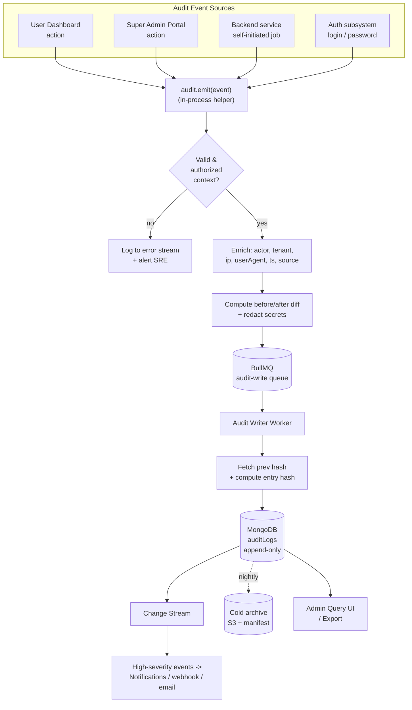
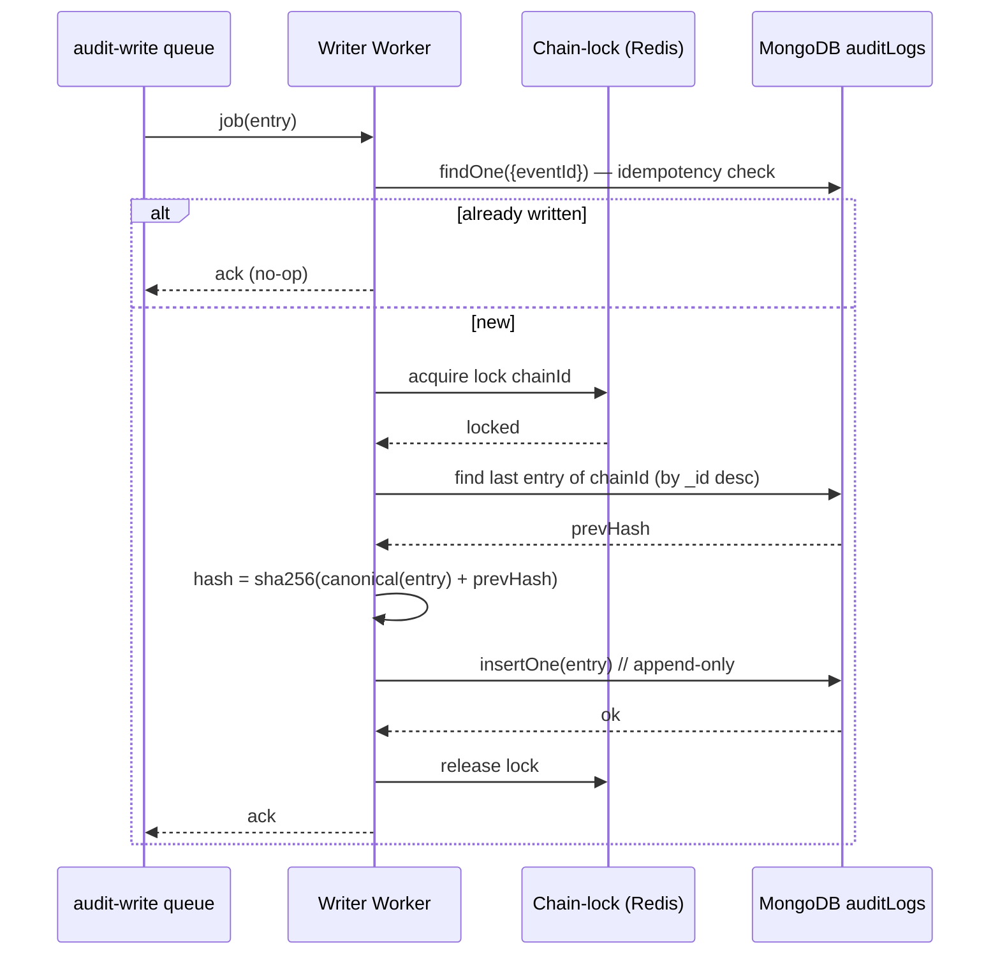
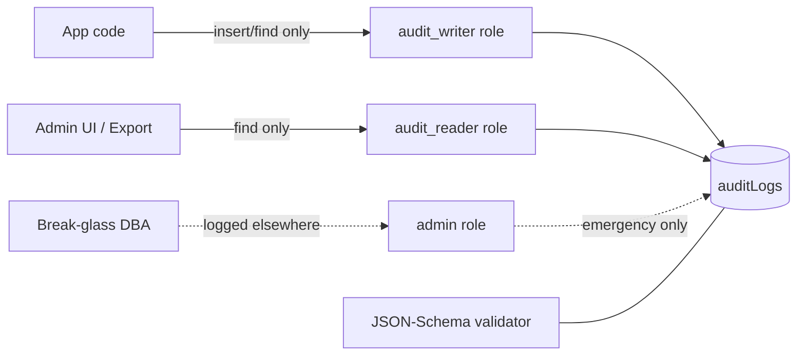
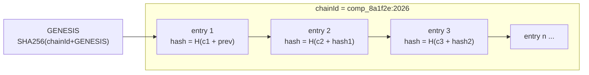
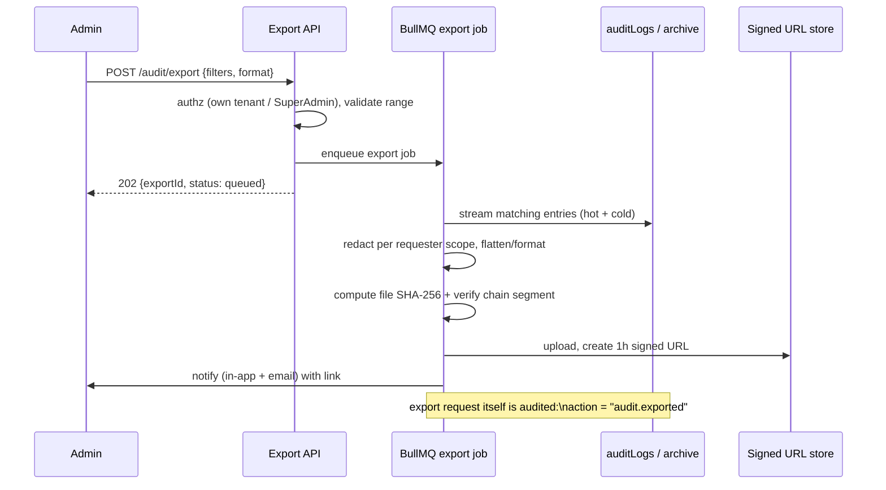
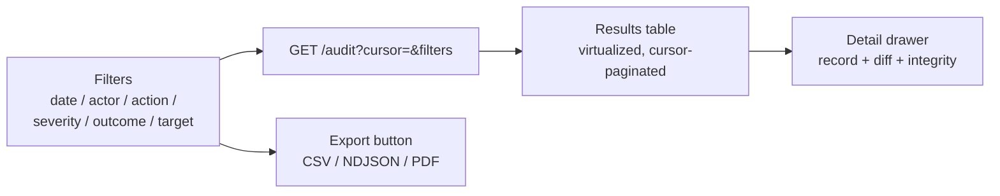

# Audit Logging

Audit logging is Postpin's immutable, append-only record of *who did what, to what, when, and from where* across every tenant. Unlike high-volume `apiLogs` (shipping-rate traffic) or the operational `pincodeSyncLogs` (India Post sync runs), the **audit log is a security- and compliance-grade ledger**: it captures privileged and state-changing actions (logins, API-key lifecycle, rate-card edits, plan changes, refunds, impersonation, permission changes, settings changes), stores a structured **before/after diff**, is protected by optional **hash chaining** for tamper-evidence, is **retained on a defined schedule**, and is **exportable** for SOC 2 / ISO 27001 / RBI-style reviews. This document specifies the record shape, the event catalog, the write pipeline, the tamper-evidence design, retention/export, and the admin query/filter UX.

## Contents

- [Three Log Families — Don't Confuse Them](#three-log-families--dont-confuse-them)
- [Where Audit Logging Sits](#where-audit-logging-sits)
- [The `auditLogs` Record Shape](#the-auditlogs-record-shape)
- [Event Catalog](#event-catalog)
- [The Write Pipeline](#the-write-pipeline)
- [Before/After Diffing](#beforeafter-diffing)
- [Immutability & Append-Only Enforcement](#immutability--append-only-enforcement)
- [Tamper-Evidence: Hash Chaining](#tamper-evidence-hash-chaining)
- [Retention & Archival](#retention--archival)
- [Export](#export)
- [Admin Query / Filter UX](#admin-query--filter-ux)
- [Sample JSON Entries](#sample-json-entries)
- [Edge Cases & Failure Handling](#edge-cases--failure-handling)
- [Indexes & Performance](#indexes--performance)
- [Security & Privacy](#security--privacy)
- [Implementation Checklist](#implementation-checklist)

---

## Three Log Families — Don't Confuse Them

Postpin keeps three independent logging systems. They have different purposes, write rates, retention, mutability and access controls. Conflating them is a recurring design mistake; the table is the contract.

| Dimension | **auditLogs** (this doc) | **apiLogs** | **pincodeSyncLogs** |
|---|---|---|---|
| Purpose | Security & compliance: privileged/state-changing actions | Traffic analytics, billing, quota, abuse detection | Operational health of India Post sync runs |
| Triggered by | Humans & privileged automation (admins, owners, system jobs doing overrides) | Every `/v1/*` API call from customer keys | Nightly cron `00:30` + manual sync (see [Pincode Management](06-pincode-management.md)) |
| Write volume | Low (hundreds–thousands/day/tenant) | Very high (millions/day) | Tiny (one doc per run + per-failed-record) |
| Mutability | **Append-only, immutable** | Append-only, but TTL-pruned aggressively | Append-only |
| Retention | 1–7 years (compliance) | 30–90 days hot, rolled to cold storage | 180 days |
| Tamper-evidence | **Yes (hash chain)** | No | No |
| Contains diff | **Yes (before/after)** | No (request/response meta only) | Row counts (added/updated/removed/failed) |
| Read access | SuperAdmin + tenant owner (own tenant only) | Tenant users (own usage), SuperAdmin (all) | SuperAdmin |
| Collection | `auditLogs` | `apiLogs` | `pincodeSyncLogs` |
| Storage class | MongoDB + cold archive (S3/Glacier) | MongoDB time-series + Redis counters | MongoDB |

> Rule of thumb: if a regulator or a security incident responder would ask "who changed this?", it belongs in `auditLogs`. If a finance or capacity team would ask "how much traffic?", it belongs in `apiLogs`. If an SRE would ask "did last night's sync succeed?", it belongs in `pincodeSyncLogs`.

Cross-references: [Authentication & RBAC](03-auth-rbac.md), [API Keys](05-api-keys.md), [Shipping Engine](04-shipping-engine.md), [Rate Cards & Zones](07-rate-cards-zones.md), [Billing & Subscriptions](08-billing-subscriptions.md), [Settings](11-settings.md).

---

## Where Audit Logging Sits



The `audit.emit()` call is **synchronous to enqueue** (so the caller cannot forget it and so we capture request context) but **asynchronous to persist** (so audit writes never block or fail a user-facing transaction). The BullMQ `audit-write` queue guarantees at-least-once delivery; the writer dedupes on a client-supplied `eventId` (idempotency key).

---

## The `auditLogs` Record Shape

Every entry is a single MongoDB document. Fields are grouped: **identity**, **actor**, **action/target**, **change**, **context**, **integrity**, **lifecycle**.

```json
{
  "_id": "alog_01HZX8K3M7Q9V2D4N6P8R0T2W4",
  "eventId": "evt_5f3c1a9e-7b21-4d6a-9c0e-2f8a1b4d6e90",
  "schemaVersion": 1,

  "tenantId": "comp_8a1f2e",
  "tenantName": "Nykaa Logistics Pvt Ltd",

  "actor": {
    "type": "user",
    "id": "usr_3b9d7c",
    "name": "Priya Sharma",
    "email": "priya@nykaa-logi.in",
    "role": "owner",
    "impersonatedBy": null
  },

  "action": "rate_card.updated",
  "category": "rate_card",
  "severity": "high",
  "outcome": "success",

  "target": {
    "type": "rateCard",
    "id": "rc_2f7a91",
    "label": "Default Surface Rate Card"
  },

  "diff": {
    "changed": [
      {
        "path": "slabs.0.perKg",
        "before": 38.00,
        "after": 42.00
      },
      {
        "path": "codCharge.percent",
        "before": 1.5,
        "after": 2.0
      }
    ],
    "added": [],
    "removed": []
  },

  "context": {
    "ip": "103.21.244.12",
    "ipCity": "Mumbai, MH",
    "userAgent": "Mozilla/5.0 (Macintosh; Intel Mac OS X 10_15_7) ... Chrome/124.0",
    "requestId": "req_9c2e4a",
    "sessionId": "sess_7d1b3f",
    "source": "dashboard",
    "method": "PATCH",
    "path": "/internal/rate-cards/rc_2f7a91",
    "reason": "Q2 fuel price revision"
  },

  "integrity": {
    "prevHash": "9f86d081884c7d659a2feaa0c55ad015a3bf4f1b2b0b822cd15d6c15b0f00a08",
    "hash": "c3ab8ff13720e8ad9047dd39466b3c8974e592c2fa383d4a3960714caef0c4f2",
    "algo": "sha256",
    "chainId": "comp_8a1f2e:2026"
  },

  "ts": "2026-06-26T11:42:07.318Z",
  "createdAtServer": "2026-06-26T11:42:07.402Z",
  "retainUntil": "2033-06-26T11:42:07.318Z",
  "archived": false
}
```

### Field reference

| Field | Type | Required | Notes |
|---|---|---|---|
| `_id` | ULID (string) | yes | Lexicographically sortable, time-ordered. Primary key. |
| `eventId` | UUID/string | yes | Idempotency key supplied by emitter; unique per (tenant). Prevents double-write on retry. |
| `schemaVersion` | int | yes | Bump on shape changes; readers branch on it. Start at `1`. |
| `tenantId` | string | yes* | `companies._id`. `null` only for platform-global events (e.g. SuperAdmin editing global settings) — use sentinel `"__platform__"`. |
| `tenantName` | string | yes | Denormalized snapshot at write time (names change; the log must read truthfully later). |
| `actor.type` | enum | yes | `user` \| `system` \| `apiKey` \| `superadmin`. |
| `actor.id` | string | yes | `users._id`, `apiKeys._id`, or `"system"`. |
| `actor.name` / `actor.email` | string | yes | Denormalized snapshot. |
| `actor.role` | string | yes | Role slug at time of action (`owner`, `admin`, `support`, `member`, `superadmin`). |
| `actor.impersonatedBy` | object/null | no | If a SuperAdmin is acting *as* this user, records the real operator `{id,name,email}`. See [Impersonation](#impersonation). |
| `action` | string | yes | Dotted verb, `{category}.{verb}` (see [Event Catalog](#event-catalog)). |
| `category` | enum | yes | Top-level grouping for filtering. |
| `severity` | enum | yes | `low` \| `medium` \| `high` \| `critical`. Drives alerting. |
| `outcome` | enum | yes | `success` \| `failure` \| `denied`. Failed/denied attempts are audited too. |
| `target.type` | string | yes | Collection/entity type of the thing acted on. |
| `target.id` | string | yes | Entity id; `null` for actions with no single target (e.g. login). |
| `target.label` | string | no | Human-readable snapshot. |
| `diff` | object/null | no | Structured change (see [Before/After Diffing](#beforeafter-diffing)). `null` for read-only or login events. |
| `context.ip` | string | yes | Client IP (X-Forwarded-For, first hop, validated). |
| `context.ipCity` | string | no | Geo-resolved at write time (best-effort). |
| `context.userAgent` | string | yes | Raw UA string. |
| `context.requestId` | string | yes | Correlates to `apiLogs` / app logs for the same request. |
| `context.sessionId` | string | no | Auth session that performed the action. |
| `context.source` | enum | yes | `dashboard` \| `admin` \| `api` \| `system` \| `cron` \| `cli`. |
| `context.method` / `context.path` | string | no | HTTP verb + internal route. |
| `context.reason` | string | no | Optional operator-supplied justification (required for some high-severity actions; see catalog). |
| `integrity.prevHash` | hex string | yes** | Hash of the previous entry in this chain. |
| `integrity.hash` | hex string | yes** | Hash of this entry (canonicalized). |
| `integrity.algo` | string | yes** | `sha256` (default). |
| `integrity.chainId` | string | yes** | Chain partition key, e.g. `{tenantId}:{year}`. |
| `ts` | ISO-8601 UTC | yes | Logical event time (when it happened, client-asserted but server-bounded). |
| `createdAtServer` | ISO-8601 UTC | yes | When the writer persisted it. Used to detect clock skew. |
| `retainUntil` | ISO-8601 UTC | yes | Computed at write from retention policy. |
| `archived` | bool | yes | `true` once copied to cold storage and (optionally) pruned from hot. |

\* `tenantId` always present; `__platform__` sentinel for platform-scope events.
\** `integrity.*` required when hash chaining is enabled (recommended for production); absent when disabled.

---

## Event Catalog

The catalog is the authoritative list of audited actions. Every `action` string MUST exist here. Categories map to the [filter UX](#admin-query--filter-ux). Severity drives alerting and (for `critical`) immediate notification.

### Authentication & account

| `action` | category | severity | target.type | `reason` required | Diff |
|---|---|---|---|---|---|
| `auth.login` | `auth` | low | user | no | none |
| `auth.login_failed` | `auth` | medium | user | no | `{reason: "bad_password"\|"locked"\|"mfa_failed"}` |
| `auth.logout` | `auth` | low | user | no | none |
| `auth.password_changed` | `auth` | high | user | no | none (never log password values) |
| `auth.password_reset_requested` | `auth` | medium | user | no | none |
| `auth.mfa_enabled` / `auth.mfa_disabled` | `auth` | high | user | no | `{before,after}` flag |
| `auth.session_revoked` | `auth` | medium | session | no | none |

### API keys

| `action` | category | severity | target.type | `reason` | Diff |
|---|---|---|---|---|---|
| `apikey.created` | `api_key` | high | apiKey | no | added scopes/domains |
| `apikey.deleted` | `api_key` | high | apiKey | no | removed key meta (never the secret) |
| `apikey.rotated` | `api_key` | high | apiKey | no | old prefix -> new prefix |
| `apikey.restrictions_changed` | `api_key` | high | apiKey | no | domain/IP/referer allowlist diff |
| `apikey.disabled` / `apikey.enabled` | `api_key` | high | apiKey | no | status flag |

### Billing & plans

| `action` | category | severity | target.type | `reason` | Diff |
|---|---|---|---|---|---|
| `plan.changed` | `billing` | high | subscription | no | plan before/after, quota delta |
| `subscription.cancelled` | `billing` | high | subscription | yes | status |
| `coupon.applied` | `billing` | medium | coupon | no | code, discount |
| `refund.issued` | `billing` | critical | invoice | **yes** | amount, invoice id |
| `invoice.adjusted` | `billing` | high | invoice | yes | line-item diff |

### Shipping configuration

| `action` | category | severity | target.type | `reason` | Diff |
|---|---|---|---|---|---|
| `rate_card.created` | `rate_card` | high | rateCard | no | full card |
| `rate_card.updated` | `rate_card` | high | rateCard | no | slab/charge diff |
| `rate_card.deleted` | `rate_card` | high | rateCard | yes | full card snapshot |
| `zone.updated` | `zone` | high | zone | no | mapping diff |
| `shipping_rule.changed` | `rate_card` | high | shippingRule | no | rule diff |
| `manual_override` | `override` | critical | (varies) | **yes** | overridden field(s) |

### Pincode & sync

| `action` | category | severity | target.type | `reason` | Diff |
|---|---|---|---|---|---|
| `pincode.updated` | `pincode` | medium | pincode | no | field diff |
| `pincode.bulk_imported` | `pincode` | high | pincode | no | counts `{added,updated}` |
| `pincode.rollback` | `pincode` | critical | sync | **yes** | sync id, restored counts |
| `sync.started` | `sync` | low | sync | no | trigger `manual\|cron` |
| `sync.failed` | `sync` | high | sync | no | error summary |
| `sync.config_changed` | `settings` | high | settings | no | endpoint/time/retry diff |

> Note: routine **sync progress/row-level** detail lives in `pincodeSyncLogs`, not here. Audit records only the *decision/trigger* and *failures* of a sync, plus config changes — i.e. the security-relevant slice.

### Team, permissions & settings

| `action` | category | severity | target.type | `reason` | Diff |
|---|---|---|---|---|---|
| `member.invited` | `team` | medium | user | no | email, role |
| `member.removed` | `team` | high | user | yes | role at removal |
| `permission.changed` | `team` | high | user/role | no | permission set diff |
| `role.created` / `role.deleted` | `team` | high | role | no | permission set |
| `settings.changed` | `settings` | high | settings | no | key-path diff |
| `webhook.created` / `webhook.deleted` | `settings` | medium | webhook | no | url, events |

### Platform / SuperAdmin

| `action` | category | severity | target.type | `reason` | Diff |
|---|---|---|---|---|---|
| `impersonation.started` | `impersonation` | critical | user | **yes** | scope, duration |
| `impersonation.ended` | `impersonation` | high | user | no | duration |
| `tenant.suspended` / `tenant.reactivated` | `admin` | critical | company | **yes** | status |
| `platform_settings.changed` | `settings` | critical | settings | **yes** | key-path diff |

**Severity policy:** `critical` events emit a real-time notification (in-app + email to tenant owner, and to platform security for impersonation/platform changes) and a webhook (`audit.critical`) if configured. `high` events are surfaced in the daily digest. `low/medium` are queryable only.

---

## The Write Pipeline

### Emitter API (backend, in-process)

```ts
// audit.ts
type AuditInput = {
  action: string;              // must exist in event catalog
  category: AuditCategory;
  severity: AuditSeverity;
  outcome?: 'success' | 'failure' | 'denied'; // default 'success'
  target?: { type: string; id?: string | null; label?: string };
  before?: Record<string, unknown>;   // pre-change snapshot
  after?: Record<string, unknown>;    // post-change snapshot
  reason?: string;
};

// ctx carries request-scoped identity captured by middleware (AsyncLocalStorage)
async function emit(input: AuditInput, ctx: RequestContext): Promise<void> {
  assertInCatalog(input.action);                 // throws in dev/CI, warns in prod
  if (CATALOG[input.action].reasonRequired && !input.reason) {
    throw new AuditError('reason_required', input.action);
  }

  const entry = enrich(input, ctx);              // actor, tenant, ip, ua, ts, source
  entry.diff = computeDiff(input.before, input.after); // redacts secrets
  entry.eventId = ctx.idempotencyKey ?? ulid();

  // Enqueue (fast, never blocks the user transaction). Falls back to
  // synchronous direct-write if the queue is unavailable (see failure handling).
  await auditQueue.add('write', entry, {
    jobId: entry.eventId,                         // dedupe
    removeOnComplete: true,
    attempts: 25,
    backoff: { type: 'exponential', delay: 1000 },
  });
}
```

Key rules:

- **Capture context, not the caller's word.** `tenantId`, `actor`, `ip`, `userAgent`, `requestId` come from the authenticated request context (AsyncLocalStorage set in auth middleware), never from request body — a caller cannot forge who they are in the log.
- **Server bounds `ts`.** If a client supplies `ts`, clamp it to `[now-5min, now]`; otherwise use server time. Always record `createdAtServer` independently.
- **Emit on failure and denial too.** `auth.login_failed`, `outcome: 'denied'` for RBAC rejections — these are the most security-relevant entries.

### Writer worker (BullMQ consumer)



The per-chain Redis lock serializes hash-chain appends so two concurrent writes can't both read the same `prevHash`. The lock is fine-grained (`chainId = tenant:year`), so cross-tenant throughput is unaffected. If hash chaining is disabled, the lock and `prevHash` read are skipped entirely.

---

## Before/After Diffing

The `diff` object captures exactly what changed without storing entire entities (which bloats storage and leaks secrets).

**Algorithm:**

1. Take `before` and `after` plain objects (pre/post the mutation).
2. Deep-walk both; produce three lists keyed by **dot-path**:
   - `changed`: path present in both with non-equal value → `{path, before, after}`.
   - `added`: path only in `after` → `{path, after}`.
   - `removed`: path only in `before` → `{path, before}`.
3. **Redact** any path matching the secret denylist (`/password/i`, `/secret/i`, `/token/i`, `apiKey.secret`, `/cardNumber/i`, `/cvv/i`, `/otp/i`) → store `"[REDACTED]"` but still record that the path changed.
4. **Cap size:** if a single value serializes to > 4 KB, store a truncated value plus a SHA-256 of the full value (`{ truncated: true, sha256, preview }`). Caps total `diff` at 32 KB; overflow stores a pointer to a cold-stored full snapshot.
5. **Array handling:** arrays are diffed by index path (`slabs.0.perKg`). For arrays keyed by a natural id (e.g. zones), normalize to id-keyed maps first to avoid false "everything moved" diffs on reorder.

```json
{
  "changed": [
    { "path": "restrictions.allowedDomains.1", "before": "shop.example.in", "after": "checkout.example.in" },
    { "path": "secret", "before": "[REDACTED]", "after": "[REDACTED]" }
  ],
  "added": [ { "path": "restrictions.allowedIps.0", "after": "203.0.113.7" } ],
  "removed": []
}
```

Diffing happens **before** enqueue (in the request process) so the worker stays cheap and secrets never transit the queue unredacted.

---

## Immutability & Append-Only Enforcement

Audit logs are write-once. Enforcement is layered (defense in depth):

1. **Application layer:** the data-access layer for `auditLogs` exposes only `insert`, `find`, and `aggregate`. There is **no** update/delete method. Lint rule forbids importing the raw collection elsewhere.
2. **Database layer:**
   - A dedicated MongoDB user (`audit_writer`) has `insert` + `find` grants on `auditLogs` only — **no `update`/`remove`**. The app connects to `auditLogs` with this user.
   - A separate `audit_reader` user (read-only) backs the admin query UI and exports.
   - No application role has delete; only a break-glass DBA role (logged out-of-band) can.
3. **Schema validation:** a MongoDB JSON-Schema validator on the collection rejects documents missing required fields or with a bad `schemaVersion`, blocking malformed inserts.
4. **TTL is forbidden on the hot collection.** Pruning happens only through the controlled archival job (which verifies the chain and writes a manifest first), never via a TTL index that could silently erase evidence.



If a record is *wrong* (e.g. wrong reason), you do **not** edit it — you append a correcting entry (`action: "audit.correction"`, `target` = the original `_id`) referencing the mistaken one. The original stays. This preserves the chain and the evidentiary trail.

---

## Tamper-Evidence: Hash Chaining

Hash chaining makes silent deletion or modification of any past entry detectable. It is **optional but recommended for production** (and effectively mandatory for tenants on compliance plans).

### Construction

For each entry within a chain (`chainId = {tenantId}:{year}`):

```
canonical(entry) = JCS(entry without integrity.hash)   // RFC 8785 canonical JSON
hash_n = SHA256( canonical(entry_n) || prevHash )
prevHash for entry_n = hash_{n-1}      // genesis prevHash = SHA256(chainId || "GENESIS")
```

- Fields excluded from canonicalization: `integrity.hash` itself (it's the output) and any volatile field. `integrity.prevHash` **is** included so re-pointing is detectable.
- Canonicalization (RFC 8785 JCS) guarantees byte-identical input regardless of key order, so the hash is reproducible by any verifier.



### Periodic anchoring

Every 24h a **chain checkpoint** is written: the latest `hash` per chain is recorded in a separate, even-more-restricted `auditCheckpoints` collection and (optionally) emailed/webhooked to the tenant and to an external WORM bucket. If an attacker with DB access deletes entries and recomputes the chain, the recomputed head won't match the externally-anchored checkpoint → tamper detected.

```json
{
  "_id": "ckpt_01HZX...",
  "chainId": "comp_8a1f2e:2026",
  "headHash": "c3ab8ff13720e8ad9047dd39466b3c8974e592c2fa383d4a3960714caef0c4f2",
  "entryCount": 184213,
  "lastEntryId": "alog_01HZX8K3M7Q9V2D4N6P8R0T2W4",
  "ts": "2026-06-26T00:00:00.000Z",
  "anchoredTo": ["s3-worm://postpin-audit-anchors/2026/06/26.json"]
}
```

### Verification job

A scheduled verifier (and an on-demand admin button) recomputes the chain from genesis (or last verified checkpoint) and asserts each stored `hash` matches and each `prevHash` links correctly:

```
verify(chainId):
  prev = genesis(chainId)
  for entry in entries(chainId) ordered by _id asc:
      if entry.integrity.prevHash != prev: return BROKEN_LINK at entry._id
      recomputed = SHA256(canonical(entry) || prev)
      if recomputed != entry.integrity.hash: return TAMPERED at entry._id
      prev = entry.integrity.hash
  if prev != latestCheckpoint.headHash: return CHECKPOINT_MISMATCH
  return OK
```

A `BROKEN_LINK` / `TAMPERED` / `CHECKPOINT_MISMATCH` result raises a `critical` platform alert. Verification runs nightly per active chain and is cheap (sequential hash of low-volume data).

---

## Retention & Archival

| Plan / scope | Hot retention (MongoDB) | Cold retention (archive) | Total |
|---|---|---|---|
| Free / Basic | 90 days | up to 1 year | 1 year |
| Pro | 1 year | 3 years | 3 years |
| Enterprise / compliance | 1 year | 6 years | 7 years |
| Platform/SuperAdmin events | 1 year | 6 years | 7 years |
| Legal hold (any) | indefinite | indefinite | until released |

- `retainUntil` is stamped at write time from the tenant's plan policy. Plan **upgrades extend** retention of existing records (recompute on upgrade); **downgrades never shorten** already-written records below their original `retainUntil` (no silent evidence loss).
- **Archival job (nightly):** for entries older than the hot window AND `archived: false`:
  1. Verify the chain segment.
  2. Stream entries (NDJSON, gzip) to cold storage (S3 + Object Lock/WORM), partitioned `s3://postpin-audit/{tenantId}/{year}/{month}.ndjson.gz`.
  3. Write a manifest with object SHA-256, count, head/tail `_id`, and chain head hash.
  4. Mark `archived: true`. Only **after** a successful, verified archive may hot docs be pruned (configurable: keep-in-hot vs prune).
- **Legal hold:** setting a hold flag on a tenant or a date range freezes archival pruning for matching records regardless of `retainUntil`.
- **Deletion at end-of-life** is itself audited (`action: "audit.retention_purged"`) with counts and the manifest hash — you log the fact that logs aged out.

---

## Export

Exports serve compliance reviews, customer DSAR-style requests, and incident response.

**Formats:** CSV (flattened, for spreadsheets), NDJSON (lossless, recommended), and a signed PDF report (for auditors — includes the verification result and checkpoint hashes).

**Flow:**



Rules:
- Exporting is **itself an audited action** (`audit.exported`, severity `high`, records filters and row count).
- **Tenant scope is enforced server-side** — a tenant owner can only export their own `tenantId`; SuperAdmin can scope to any tenant or platform.
- Large exports (> 100k rows) always run async with a signed, **expiring** (1h) download URL; never a synchronous response.
- The export header embeds the **chain verification status** and the relevant **checkpoint hash**, so the receiver can independently confirm integrity.
- PII redaction respects the requester's permission: e.g. a support admin export masks `actor.email` of unrelated users unless they hold `audit:read_pii`.

CSV column order (stable contract): `ts, action, category, severity, outcome, actor.email, actor.role, target.type, target.id, target.label, context.ip, context.source, reason, eventId, _id, integrity.hash`.

---

## Admin Query / Filter UX

Audit logs are surfaced in **both portals**: tenant owners/admins see their own tenant's log under Dashboard → Security → Audit Log; SuperAdmin sees a cross-tenant view under Admin → Audit. Same component, different scope.

### Filter panel

| Filter | Control | Notes |
|---|---|---|
| Date range | Date-range picker (presets: 24h, 7d, 30d, custom) | Defaults to last 7d; max custom range bounded by retention. |
| Actor | Searchable user/apiKey/system select | `actor.email` / `actor.id`. |
| Action / Category | Multi-select grouped by category | Backed by the event catalog. |
| Severity | Chips (low/medium/high/critical) | Critical defaults visible. |
| Outcome | Toggle (success/failure/denied) | Surfaces failed logins & denials. |
| Target | Type select + id search | e.g. all events on `rateCard rc_2f7a91`. |
| Source | Select (dashboard/admin/api/system/cron) | |
| IP / text search | Free text over `ip`, `requestId`, `target.label`, `reason` | |
| Tenant (SuperAdmin only) | Tenant select | Hidden for tenant admins (locked to own). |

### Results table

- Columns: **Time** (relative + exact on hover), **Severity** (colored dot per [design system](00-overview.md): critical `#DC2626`, high `#D97706`, medium `#2563EB`, low muted), **Action**, **Actor**, **Target**, **Outcome**, **Source**, **IP**.
- Animated Lucide icons per category (e.g. `key-round` for api_key, `receipt` for billing, `user-cog` for permissions), motion respected per `prefers-reduced-motion`.
- Row click opens a **detail drawer**: full record, formatted before/after diff (red/green like a code diff), context, and an **integrity badge** ("Verified — links to prev `c3ab…`, in checkpoint 2026-06-26") with a "Verify this chain" action.
- **Cursor pagination** on `_id` (never offset; the table is huge and append-only so `_id`-desc cursors are stable and fast).
- **No edit/delete controls anywhere** — the UI is strictly read + export, reflecting the append-only model.
- Empty/loading/error states and `data-testid` on every interactive element (filters, rows, export button, verify button) per global test-locator conventions, e.g. `audit-filter-severity-select`, `audit-row-{eventId}`, `audit-export-btn`, `audit-verify-chain-btn`.



### Query API (read-only)

```
GET /internal/audit?
    tenantId=comp_8a1f2e        // ignored/forced to caller's tenant unless SuperAdmin
    &from=2026-06-01T00:00:00Z
    &to=2026-06-26T23:59:59Z
    &category=rate_card,billing
    &severity=high,critical
    &outcome=success,denied
    &actorId=usr_3b9d7c
    &targetId=rc_2f7a91
    &q=fuel
    &cursor=alog_01HZX8K3M7Q9V2D4N6P8R0T2W4
    &limit=50
```

Returns `{ items: [...], nextCursor, hasMore }`. Backed by the `audit_reader` role. All read queries are bounded by `tenantId` server-side; the `tenantId` param is honored only for SuperAdmin.

---

## Sample JSON Entries

**1. Successful login (low):**

```json
{
  "_id": "alog_01HZX7A0B1C2D3E4F5G6H7J8K9",
  "eventId": "evt_a1b2c3d4-...",
  "schemaVersion": 1,
  "tenantId": "comp_8a1f2e",
  "tenantName": "Nykaa Logistics Pvt Ltd",
  "actor": { "type": "user", "id": "usr_3b9d7c", "name": "Priya Sharma", "email": "priya@nykaa-logi.in", "role": "owner", "impersonatedBy": null },
  "action": "auth.login",
  "category": "auth",
  "severity": "low",
  "outcome": "success",
  "target": { "type": "user", "id": "usr_3b9d7c", "label": "priya@nykaa-logi.in" },
  "diff": null,
  "context": { "ip": "103.21.244.12", "ipCity": "Mumbai, MH", "userAgent": "Mozilla/5.0 ... Chrome/124.0", "requestId": "req_7a1c", "sessionId": "sess_91", "source": "dashboard", "method": "POST", "path": "/auth/login" },
  "integrity": { "prevHash": "e3b0c442...", "hash": "1a79a4d6...", "algo": "sha256", "chainId": "comp_8a1f2e:2026" },
  "ts": "2026-06-26T09:01:11.002Z",
  "createdAtServer": "2026-06-26T09:01:11.060Z",
  "retainUntil": "2033-06-26T09:01:11.002Z",
  "archived": false
}
```

**2. Refund issued (critical, reason required):**

```json
{
  "_id": "alog_01HZX9M2N3P4Q5R6S7T8U9V0W1",
  "eventId": "evt_9f8e7d6c-...",
  "schemaVersion": 1,
  "tenantId": "comp_8a1f2e",
  "tenantName": "Nykaa Logistics Pvt Ltd",
  "actor": { "type": "superadmin", "id": "usr_admin01", "name": "Rohit Verma", "email": "rohit@postpin.in", "role": "superadmin", "impersonatedBy": null },
  "action": "refund.issued",
  "category": "billing",
  "severity": "critical",
  "outcome": "success",
  "target": { "type": "invoice", "id": "inv_55021", "label": "INV-2026-55021" },
  "diff": { "changed": [ { "path": "status", "before": "paid", "after": "refunded" }, { "path": "refundedAmount", "before": 0, "after": 4720.00 } ], "added": [], "removed": [] },
  "context": { "ip": "49.36.12.5", "ipCity": "Bengaluru, KA", "userAgent": "Mozilla/5.0 ... Firefox/127.0", "requestId": "req_b22f", "source": "admin", "method": "POST", "path": "/admin/invoices/inv_55021/refund", "reason": "Duplicate charge confirmed with customer ticket #T-9921" },
  "integrity": { "prevHash": "c3ab8ff1...", "hash": "7d865e95...", "algo": "sha256", "chainId": "comp_8a1f2e:2026" },
  "ts": "2026-06-26T10:15:44.119Z",
  "createdAtServer": "2026-06-26T10:15:44.201Z",
  "retainUntil": "2033-06-26T10:15:44.119Z",
  "archived": false
}
```

**3. Impersonation started (critical, with `impersonatedBy`):**

```json
{
  "_id": "alog_01HZXA3B4C5D6E7F8G9H0J1K2L",
  "eventId": "evt_3c2b1a09-...",
  "schemaVersion": 1,
  "tenantId": "comp_8a1f2e",
  "tenantName": "Nykaa Logistics Pvt Ltd",
  "actor": { "type": "user", "id": "usr_3b9d7c", "name": "Priya Sharma", "email": "priya@nykaa-logi.in", "role": "owner",
             "impersonatedBy": { "id": "usr_admin01", "name": "Rohit Verma", "email": "rohit@postpin.in" } },
  "action": "impersonation.started",
  "category": "impersonation",
  "severity": "critical",
  "outcome": "success",
  "target": { "type": "user", "id": "usr_3b9d7c", "label": "priya@nykaa-logi.in" },
  "diff": null,
  "context": { "ip": "49.36.12.5", "ipCity": "Bengaluru, KA", "userAgent": "Mozilla/5.0 ... Firefox/127.0", "requestId": "req_d41a", "source": "admin", "reason": "Investigating rate-card discrepancy in ticket #T-9921" },
  "integrity": { "prevHash": "7d865e95...", "hash": "5feceb66...", "algo": "sha256", "chainId": "comp_8a1f2e:2026" },
  "ts": "2026-06-26T10:18:02.500Z",
  "createdAtServer": "2026-06-26T10:18:02.560Z",
  "retainUntil": "2033-06-26T10:18:02.500Z",
  "archived": false
}
```

**4. Denied permission change (outcome = denied):**

```json
{
  "_id": "alog_01HZXB5C6D7E8F9G0H1J2K3L4M",
  "eventId": "evt_77665544-...",
  "schemaVersion": 1,
  "tenantId": "comp_8a1f2e",
  "tenantName": "Nykaa Logistics Pvt Ltd",
  "actor": { "type": "user", "id": "usr_member7", "name": "Arjun Mehta", "email": "arjun@nykaa-logi.in", "role": "member", "impersonatedBy": null },
  "action": "permission.changed",
  "category": "team",
  "severity": "high",
  "outcome": "denied",
  "target": { "type": "user", "id": "usr_member9", "label": "kavya@nykaa-logi.in" },
  "diff": null,
  "context": { "ip": "157.32.8.44", "ipCity": "Pune, MH", "userAgent": "Mozilla/5.0 ... Chrome/124.0", "requestId": "req_e90c", "source": "dashboard", "method": "PATCH", "path": "/team/usr_member9/permissions", "reason": "RBAC: actor lacks team:manage" },
  "integrity": { "prevHash": "5feceb66...", "hash": "6b86b273...", "algo": "sha256", "chainId": "comp_8a1f2e:2026" },
  "ts": "2026-06-26T11:03:31.870Z",
  "createdAtServer": "2026-06-26T11:03:31.910Z",
  "retainUntil": "2031-06-26T11:03:31.870Z",
  "archived": false
}
```

**5. Pincode rollback (critical, system-adjacent):** see also [Pincode Management](06-pincode-management.md).

```json
{
  "_id": "alog_01HZXC7D8E9F0G1H2J3K4L5M6N",
  "eventId": "evt_11223344-...",
  "schemaVersion": 1,
  "tenantId": "__platform__",
  "tenantName": "Postpin Platform",
  "actor": { "type": "superadmin", "id": "usr_admin01", "name": "Rohit Verma", "email": "rohit@postpin.in", "role": "superadmin", "impersonatedBy": null },
  "action": "pincode.rollback",
  "category": "pincode",
  "severity": "critical",
  "outcome": "success",
  "target": { "type": "sync", "id": "sync_2026_06_26_0030", "label": "Nightly sync 2026-06-26 00:30" },
  "diff": { "changed": [], "added": [], "removed": [], "summary": { "restored": 412, "reverted": 38 } },
  "context": { "ip": "49.36.12.5", "source": "admin", "userAgent": "Mozilla/5.0 ... Firefox/127.0", "requestId": "req_f12b", "reason": "India Post API returned malformed delta; reverting to pre-sync snapshot" },
  "integrity": { "prevHash": "6b86b273...", "hash": "d4735e3a...", "algo": "sha256", "chainId": "__platform__:2026" },
  "ts": "2026-06-26T07:40:09.300Z",
  "createdAtServer": "2026-06-26T07:40:09.355Z",
  "retainUntil": "2033-06-26T07:40:09.300Z",
  "archived": false
}
```

---

## Edge Cases & Failure Handling

| Scenario | Handling |
|---|---|
| **Queue (BullMQ/Redis) down at emit time** | `emit()` falls back to a **synchronous direct insert** into `auditLogs` (bypassing the queue) within the same request. If *that* also fails, write to a durable local **spool file** (append-only NDJSON on disk) that a recovery worker drains into Mongo later. Audit data is never dropped silently. |
| **Audit write fails but the business action succeeded** | The action is NOT rolled back (audit must not break product behavior), but a `critical` SRE alert (`audit.write_failure`) fires, and the spool captures the entry for replay. Conversely, business action fails → no audit entry (or one with `outcome:"failure"` if the attempt itself is interesting, e.g. login). |
| **Duplicate delivery (queue at-least-once)** | Idempotent on `eventId` (unique index). Writer no-ops if the `eventId` already exists. |
| **Concurrent appends to same chain** | Per-`chainId` Redis lock serializes the `prevHash` read+write. Lock TTL with fencing token; if lock lost, job retries. |
| **Clock skew / future `ts`** | `ts` clamped to `[now-5min, now]`; `createdAtServer` always trusted. Skew beyond threshold logs a warning metric. |
| **Year rollover (chain partitioned by year)** | New chain starts at genesis for `{tenant}:{newYear}`; checkpoint of the old year's head is anchored and frozen. Verifier handles per-year chains independently. |
| **Huge diff / binary blob in change** | Truncate + hash per [diffing rules](#beforeafter-diffing); store pointer to cold snapshot if needed. Never embed multi-MB values inline. |
| **Secret accidentally in `after`** | Redaction denylist runs pre-enqueue; defense-in-depth re-scan in the writer. A monitored canary test asserts known secret patterns are redacted. |
| **Tenant deleted** | Audit logs are **retained** per `retainUntil` regardless of tenant deletion (you need the record of *why/when* it was deleted). Tenant deletion itself is audited. |
| **Backfill / migration writes** | Marked `source: "system"`, `actor.type: "system"`, and a `migration` tag; they still hash-chain correctly because they're appended in order. |
| **Verifier finds a break** | Raises `critical`; the UI shows a red integrity banner on affected ranges; does NOT auto-modify anything (you investigate, you don't "fix" the chain). |
| **High-cardinality bursts** (e.g. bulk member invite of 5k) | Coalesce into one `member.bulk_invited` summary entry with counts rather than 5k rows, to keep the audit log meaningful and the chain lean. |

---

## Indexes & Performance

```js
// Idempotency (unique) — dedupe at-least-once delivery
db.auditLogs.createIndex({ tenantId: 1, eventId: 1 }, { unique: true });

// Primary list view: tenant timeline, newest first (_id is ULID time-sortable)
db.auditLogs.createIndex({ tenantId: 1, _id: -1 });

// Common filters
db.auditLogs.createIndex({ tenantId: 1, category: 1, ts: -1 });
db.auditLogs.createIndex({ tenantId: 1, severity: 1, ts: -1 });
db.auditLogs.createIndex({ tenantId: 1, "actor.id": 1, ts: -1 });
db.auditLogs.createIndex({ tenantId: 1, "target.type": 1, "target.id": 1, ts: -1 });

// Chain verification: walk a chain in order
db.auditLogs.createIndex({ "integrity.chainId": 1, _id: 1 });

// Archival sweep
db.auditLogs.createIndex({ archived: 1, retainUntil: 1 });

// Free-text (optional): partial/text index on reason + target.label
db.auditLogs.createIndex({ tenantId: 1, "context.requestId": 1 });
```

- **Cursor pagination on `_id`** (ULID) avoids costly `skip` on a huge collection.
- Consider a **monthly time-partitioned collection or sharding on `tenantId`** for very high tenants; shard key `{ tenantId: 1, _id: 1 }` keeps a tenant's timeline co-located.
- Reads use the `audit_reader` connection (secondary-read-preference acceptable; eventual consistency is fine for audit *reads*).
- Writes go to primary via `audit_writer`; the BullMQ worker batches when the queue backs up (insertMany within a single `chainId` lock window, preserving chain order).

---

## Security & Privacy

- **Least privilege:** `audit_writer` (insert+find), `audit_reader` (find), break-glass-only delete. No app path can mutate.
- **Tenant isolation:** every read/export forced to caller's `tenantId` server-side; SuperAdmin scope explicit and itself audited (`audit.exported`, cross-tenant views logged).
- **PII minimization:** store emails/IPs (needed for security) but redact secrets; support a `audit:read_pii` permission gate so lower-privileged admins see masked actor PII for unrelated users.
- **DSAR / right-to-erasure tension:** audit logs are a lawful-basis "legitimate interest / legal obligation" record and are generally **exempt** from erasure; on a verified erasure request, PII *of the data subject in non-essential fields* may be pseudonymized while preserving the action record and the hash chain (replace value with a salted hash; chain stays valid because you append a `audit.pii_pseudonymized` entry rather than editing history).
- **Transport & at-rest:** TLS in transit; encryption at rest on Mongo + cold archive with Object Lock (WORM).
- **Alerting:** `critical` events and any integrity failure page on-call; `high` roll into the daily security digest email to tenant owners (configurable in [Settings](11-settings.md)).

---

## Implementation Checklist

- [ ] `auditLogs` collection with JSON-Schema validator and `audit_writer` / `audit_reader` DB roles.
- [ ] `audit.emit()` helper using AsyncLocalStorage request context; catalog assertion + `reasonRequired` enforcement.
- [ ] BullMQ `audit-write` queue + idempotent writer worker with per-chain Redis lock.
- [ ] Diff engine with secret redaction and size caps.
- [ ] Hash chaining (`chainId = tenant:year`), nightly checkpoint to `auditCheckpoints` + external WORM anchor.
- [ ] Nightly chain verifier + on-demand "Verify chain" admin action.
- [ ] Retention stamping (`retainUntil` from plan), archival job to S3/Object-Lock + manifest, legal-hold flag.
- [ ] Export API (CSV/NDJSON/signed-PDF) — async, signed expiring URLs, self-audited.
- [ ] Query API + read-only Admin UI in both portals (filters, cursor pagination, detail drawer, integrity badge, `data-testid`s, no edit/delete).
- [ ] Failure handling: queue-down fallback, disk spool + recovery worker, `audit.write_failure` alert.
- [ ] Instrument the full event catalog across auth, api keys, billing, rate cards/zones, pincode/sync, team/permissions, settings, and platform actions.

---

*Related: [Overview & Design System](00-overview.md) · [Authentication & RBAC](03-auth-rbac.md) · [Shipping Engine](04-shipping-engine.md) · [API Keys](05-api-keys.md) · [Pincode Management](06-pincode-management.md) · [Rate Cards & Zones](07-rate-cards-zones.md) · [Billing & Subscriptions](08-billing-subscriptions.md) · [Settings](11-settings.md)*
