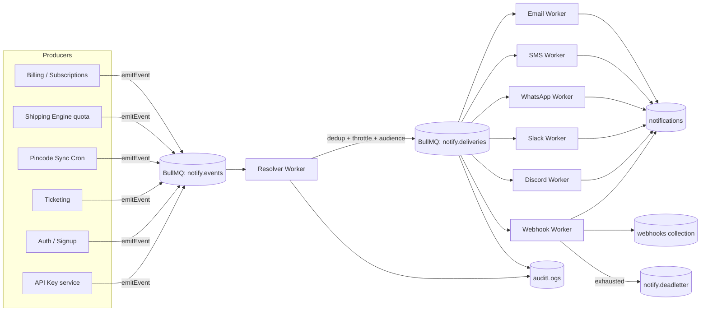
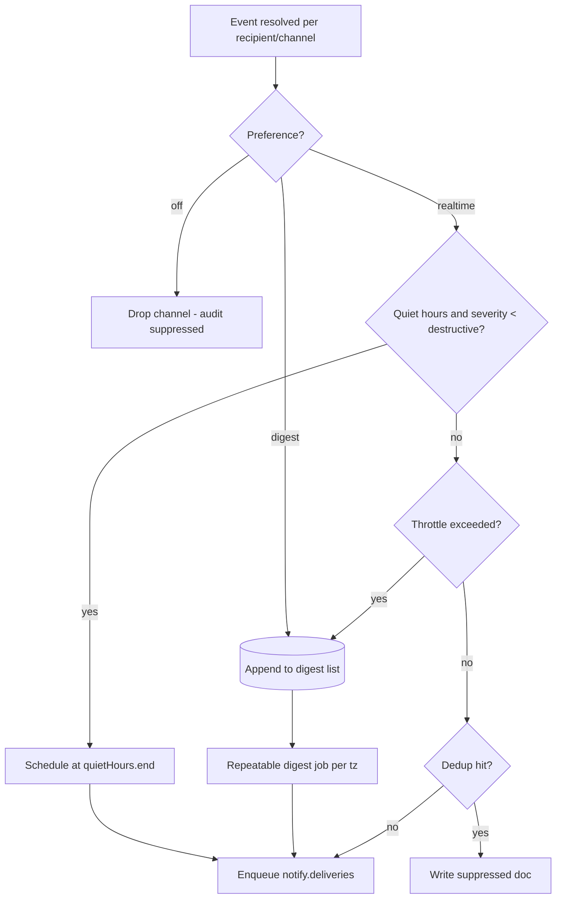
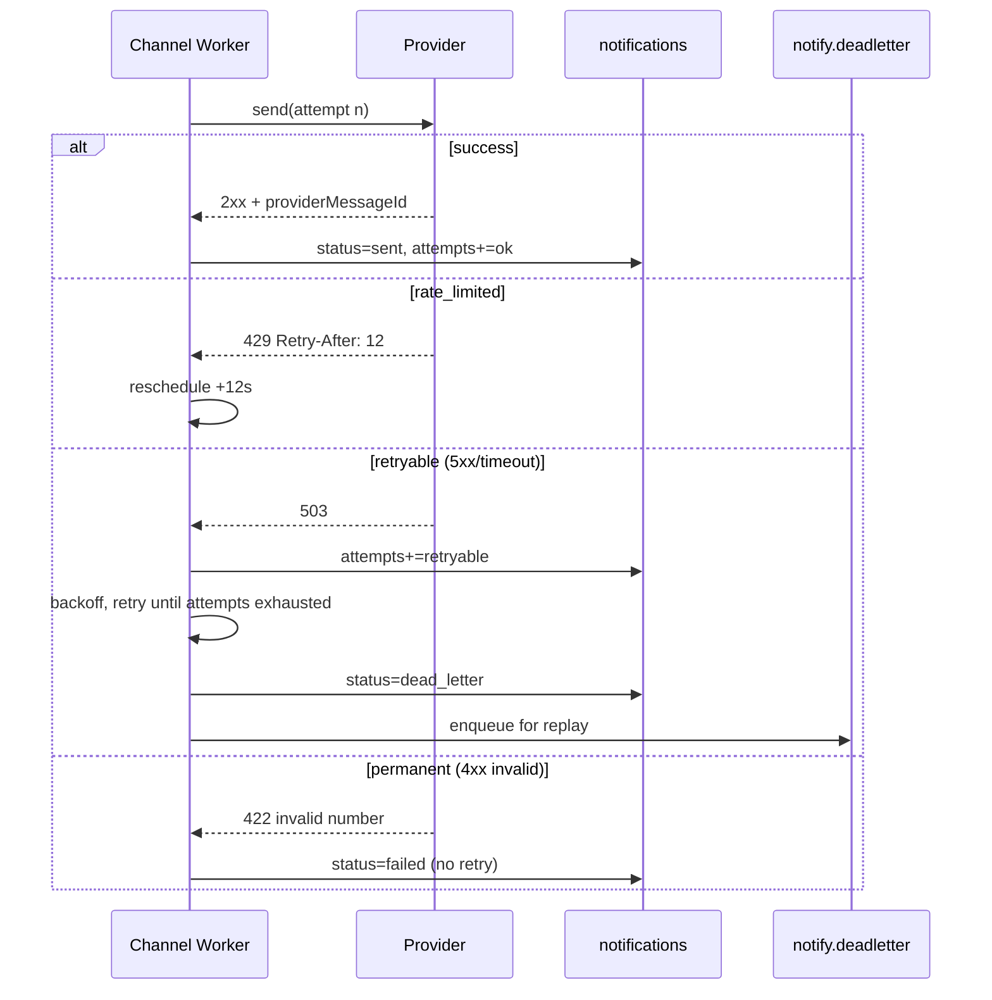

# Notification Center

The Notification Center is Postpin's centralized, multi-channel eventing system. It turns platform events (subscription expiry, API usage thresholds, sync failures, payment failures, new tickets, new users) into reliable, deduplicated, throttled deliveries across **Email, SMS, WhatsApp, Slack, Discord, and Webhook**. It is admin-configurable (which triggers fire, on which channels, to which audience), template-driven with variable interpolation, BullMQ-backed for fan-out and retries with exponential backoff, and fully auditable. Outbound webhooks are signed, idempotent, retried, and dead-lettered. Every delivery attempt writes a `notifications` record and, for state-changing administrative actions, an entry in `auditLogs`.

## Contents

- [Where it fits](#where-it-fits)
- [Core concepts and data model](#core-concepts-and-data-model)
- [Trigger catalog](#trigger-catalog)
- [Channels](#channels)
- [Template system](#template-system)
- [Audience resolution and preferences](#audience-resolution-and-preferences)
- [Throttling, deduplication and digests](#throttling-deduplication-and-digests)
- [Delivery pipeline (BullMQ fan-out)](#delivery-pipeline-bullmq-fan-out)
- [Retries, backoff and dead-letter](#retries-backoff-and-dead-letter)
- [Webhook delivery](#webhook-delivery)
- [MongoDB schemas](#mongodb-schemas)
- [Sample documents and payloads](#sample-documents-and-payloads)
- [Admin & API surface](#admin--api-surface)
- [Observability, metrics and edge cases](#observability-metrics-and-edge-cases)
- [Cross-references](#cross-references)

---

## Where it fits

The Notification Center is a **consumer of domain events** and a **producer of deliveries**. Producers (the shipping engine, billing, pincode sync cron, ticketing, auth) never talk to SendGrid/Twilio/Slack directly — they emit a typed event onto a queue. A single Notification Worker fleet owns channel logic, templating, throttling, and audit.



Two-stage queue design is deliberate:

1. **`notify.events`** — one job per domain event. The **Resolver** expands an event into a target set: which `NotificationConfig`s match, which recipients (audience), which channels, after dedup/throttle. This is the only place that reads preferences and config, so the expensive joins happen once.
2. **`notify.deliveries`** — one job **per (recipient, channel)** delivery unit. Workers are channel-specialized, independently scalable, and each has its own concurrency/rate budget (SMS is rate-limited far more aggressively than webhooks).

This separation means a single event that fans out to 4,000 recipients × 3 channels never blocks the producer and never holds a single long-running job.

---

## Core concepts and data model

| Concept | Description |
|---|---|
| **Event** | An immutable fact emitted by a producer, e.g. `subscription.expired`. Carries `companyId`, `actorId`, and a typed `data` payload. |
| **Trigger** | A named entry in the [trigger catalog](#trigger-catalog) that maps 1:1 to an event type. |
| **NotificationConfig** | Admin-authored rule binding a trigger → channels → audience → template → throttle/dedup/retry policy. Multiple configs can match one event. |
| **Template** | Versioned, channel-aware content with `{{variables}}`, localized, with a fallback locale. |
| **Audience** | The resolved recipient set: specific users, a role, all admins, the owning company's billing contacts, or an external webhook endpoint. |
| **Delivery** | A single attempt to send one rendered message to one recipient on one channel. Persisted in `notifications`. |
| **Preference** | Per-user/per-admin opt-in/out + realtime-vs-digest choice per (trigger, channel). |
| **Endpoint** | A registered outbound webhook (URL, secret, subscribed events) in the `webhooks` collection. |

Identifiers used throughout:

- `eventId` — ULID, unique per emitted event. Drives idempotency end-to-end.
- `dedupKey` — deterministic hash that collapses duplicate notifications within a window (see [throttling](#throttling-deduplication-and-digests)).
- `idempotencyKey` — sent on every outbound webhook so receivers can dedupe; equals `eventId` for the first delivery, `eventId:retryN` is **not** used (retries reuse the same key so the receiver treats them as the same logical event).

---

## Trigger catalog

The catalog is extensible: adding a trigger means adding one enum value, one default template per channel, and (optionally) a default config. Producers reference triggers by `key` only.

| Key | Source module | Severity | Default channels | Default audience | Throttle / dedup |
|---|---|---|---|---|---|
| `subscription.expired` | Billing | warning | email, in-app, webhook | Company owner + billing role | dedup per `subscriptionId` / 24h |
| `subscription.expiring_soon` | Billing cron | info | email, in-app | Company owner + billing role | dedup per `subscriptionId+window` (7d/3d/1d) |
| `api.usage_90` | Shipping engine | warning | email, in-app, slack, webhook | Company owner + admins-of-company | dedup per `subscriptionId+cycle` / once per cycle |
| `api.usage_100` | Shipping engine | destructive | email, sms, in-app, webhook | Company owner + billing role | dedup per `subscriptionId+cycle` |
| `apikey.created` | API Key service | info | email, in-app, webhook | Actor + company admins | dedup per `apiKeyId` |
| `apikey.revoked` | API Key service | warning | email, in-app, webhook | Company admins | dedup per `apiKeyId` |
| `sync.failed` | Pincode Sync Cron | destructive | email, slack, discord, in-app | Super Admins | dedup per `syncId` |
| `sync.completed_with_warnings` | Pincode Sync Cron | warning | email (digest), in-app | Super Admins | digest, hourly roll-up |
| `payment.failed` | Billing | destructive | email, sms, in-app, webhook | Company owner + billing role | dedup per `invoiceId+attempt` |
| `payment.succeeded` | Billing | success | email, in-app, webhook | Company owner | dedup per `invoiceId` |
| `ticket.created` | Ticketing | info | email, slack, in-app | Support role + Super Admins | dedup per `ticketId` |
| `ticket.replied` | Ticketing | info | email, in-app | Ticket owner + assignee | dedup per `replyId` |
| `user.created` | Auth | info | email, slack, in-app | Super Admins (digest) + the new user (welcome) | split audience (see below) |
| `webhook.endpoint_disabled` | Notification Center | warning | email, in-app | Company admins | dedup per `endpointId` |

**Severity** maps to the design-system status colors (`success #16A34A`, `warning #D97706`, `info #2563EB`, `destructive #DC2626`) for in-app/email badge styling.

**Split audience** (`user.created`): one config sends a *welcome* template to the new user (realtime), a second sends an *ops digest* line to Super Admins (digest). Two configs, same trigger — this is the extensibility pattern, not a special case.

### Adding a trigger (checklist)

1. Add `key` to the `TriggerKey` enum and to `settings.notifications.triggerCatalog`.
2. Provide default templates: at minimum `email`, `in_app`, and `webhook` (webhook is schema-only, no copy).
3. Define the `dedupKeyFields` (which payload fields form the dedup hash).
4. Emit from the producer: `notificationBus.emit({ trigger: 'x.y', companyId, actorId, data })`.
5. Backfill an admin default `NotificationConfig` via migration so the trigger works out-of-the-box.

---

## Channels

Each channel implements a common `ChannelAdapter` interface so the delivery worker is channel-agnostic:

```ts
interface ChannelAdapter {
  channel: 'email' | 'sms' | 'whatsapp' | 'slack' | 'discord' | 'webhook' | 'in_app';
  // Validate recipient + rendered content before enqueue (cheap, sync).
  validate(target: DeliveryTarget, rendered: RenderedMessage): ValidationResult;
  // Perform the send; MUST be idempotent w.r.t. providerMessageId where possible.
  send(target: DeliveryTarget, rendered: RenderedMessage, ctx: SendContext): Promise<SendResult>;
  // Classify a provider error so the worker can decide retry vs drop.
  classifyError(err: unknown): 'retryable' | 'permanent' | 'rate_limited';
  rateLimit: { perSecond: number; burst: number };
}
```

| Channel | Provider (India-first) | Rendered format | Key constraints | Retry class examples |
|---|---|---|---|---|
| **Email** | AWS SES / SendGrid | MJML → HTML + text | DKIM/SPF; max 10 MB; suppression list honored | bounce=permanent, 4xx throttle=rate_limited |
| **SMS** | MSG91 / Gigafox (DLT) | Plain text ≤ 160 GSM-7 / 70 UCS-2 | India **DLT**: template + entity must be pre-approved; sender ID 6 chars | invalid number=permanent, DLT template mismatch=permanent |
| **WhatsApp** | Meta Cloud API / Gupshup | Template (HSM) + params | 24h session window; outside window only approved templates; opt-in required | not opted-in=permanent, template paused=permanent |
| **Slack** | Incoming Webhook / Bot token | Block Kit JSON | per-workspace rate limits (Tier 3 ~50/min) | `channel_not_found`=permanent, 429=rate_limited |
| **Discord** | Webhook URL | Embeds JSON | 30 msg/min per webhook; 2000 char content | 401/404=permanent, 429 w/ `retry_after`=rate_limited |
| **Webhook** | Customer endpoint | Signed JSON (see below) | HTTPS required; ≤ 5 s connect / 10 s total | 5xx/timeout=retryable, 410 Gone=permanent (auto-disable) |
| **In-app** | Internal (Mongo + SSE) | Notification doc + realtime push | none | n/a (persisted, no external call) |

**In-app** is always enabled and never throttled at the channel level — it is the durable record users see in the dashboard bell. It is delivered by writing the `notifications` doc and pushing over the existing SSE/WebSocket channel.

Channel credentials live in `settings` (encrypted at rest, KMS envelope) and are editable by Super Admin only. The worker reads them through a cached `SecretsProvider`; rotation invalidates the cache via Redis pub/sub.

---

## Template system

Templates are stored per (trigger, channel, locale) and **versioned** — editing creates a new version; the active version is pinned per config so rendering is reproducible. Engine: a sandboxed Handlebars-style interpolator (no arbitrary code, whitelisted helpers).

### Variables

Variables come from three scopes, merged with later scopes winning:

1. **Event data** — `{{data.*}}` (e.g. `{{data.usagePercent}}`).
2. **Recipient** — `{{recipient.name}}`, `{{recipient.email}}`, `{{recipient.locale}}`.
3. **Company / system** — `{{company.name}}`, `{{plan.name}}`, `{{system.dashboardUrl}}`, `{{system.supportEmail}}`.

Whitelisted helpers (no others permitted):

| Helper | Use | Example |
|---|---|---|
| `currency` | INR formatting (en-IN) | `{{currency data.amount}}` → `₹1,299.00` |
| `date` | en-IN date | `{{date data.expiresAt "DD MMM YYYY"}}` → `30 Jun 2026` |
| `number` | grouped number | `{{number data.callsUsed}}` → `9,00,000` |
| `pluralize` | count-aware noun | `{{pluralize data.failed "record"}}` |
| `default` | fallback value | `{{default recipient.name "there"}}` |
| `truncate` | clamp length (SMS) | `{{truncate data.message 120}}` |
| `link` | safe absolute URL | `{{link system.dashboardUrl "/billing"}}` |

**Strict mode:** an unknown variable renders to empty **and** records a `templateWarning` on the delivery; an unknown *helper* is a hard render error (delivery → `failed`, reason `template_error`, no retry). This prevents silently shipping broken copy while still being forgiving about missing data.

### Localization & fallback

`recipient.locale` selects the template (`en-IN` default, `hi-IN` available). If a locale is missing, fall back to the config's `defaultLocale`, then to `en-IN`. SMS templates additionally carry the **DLT template ID** required for Indian regulatory compliance — a render against an unapproved DLT template is rejected at `validate()` time.

### Channel-specific bodies

A single template document holds per-channel renders so editors keep them in sync:

```json
{
  "trigger": "api.usage_90",
  "locale": "en-IN",
  "version": 4,
  "bodies": {
    "email": {
      "subject": "{{company.name}}: you've used {{data.usagePercent}}% of your API quota",
      "mjml": "<mjml>…{{number data.callsUsed}} of {{number data.callsLimit}} calls…</mjml>"
    },
    "sms": {
      "dltTemplateId": "1707171234567890123",
      "text": "Postpin: {{company.name}} has used {{data.usagePercent}}% of API quota. Top up at {{link system.dashboardUrl \"/billing\"}}"
    },
    "whatsapp": { "templateName": "quota_warning", "params": ["{{company.name}}", "{{data.usagePercent}}"] },
    "slack": { "blocksRef": "quota_warning_blocks" },
    "discord": { "embedRef": "quota_warning_embed" },
    "in_app": {
      "title": "API quota at {{data.usagePercent}}%",
      "body": "You've used {{number data.callsUsed}} of {{number data.callsLimit}} calls this cycle.",
      "cta": { "label": "View usage", "href": "/billing/usage" },
      "severity": "warning"
    }
  }
}
```

---

## Audience resolution and preferences

Audience is resolved by the Resolver into concrete recipients. A config's `audience` is a list of selectors; each expands to user IDs (or, for webhooks, endpoint IDs).

| Selector | Expands to |
|---|---|
| `company_owner` | the owning company's owner user |
| `role:<roleKey>` | all users in `company` with that role (e.g. `role:billing`) |
| `company_admins` | users with admin permission in the event's company |
| `super_admins` | platform Super Admins (tenant-agnostic) |
| `actor` | the user who caused the event (`actorId`) |
| `user:<id>` | a specific user |
| `webhook_endpoints` | active endpoints in `webhooks` subscribed to this trigger |

**Tenant safety:** every non-`super_admins` selector is scoped to `event.companyId`. The Resolver asserts each resolved recipient belongs to that company (or is a Super Admin) before enqueueing — a cross-tenant leak is treated as a critical bug and the delivery is dropped with an `auditLogs` security entry.

### Preferences

Each user has a `notificationPreferences` document keyed by `(trigger, channel)`:

```json
{
  "userId": "u_9a3...",
  "delivery": {
    "api.usage_90":   { "email": "digest",   "in_app": "realtime", "sms": "off" },
    "ticket.replied": { "email": "realtime", "in_app": "realtime" },
    "payment.failed": { "email": "realtime", "sms": "realtime" }
  },
  "digestSchedule": { "frequency": "daily", "hour": 9, "timezone": "Asia/Kolkata" },
  "quietHours": { "enabled": true, "start": "22:00", "end": "07:00", "timezone": "Asia/Kolkata" },
  "globalMute": false
}
```

Resolution rules, applied per recipient per channel:

1. If `globalMute` → drop all except `destructive`-severity triggers (payment/quota-100/sync-failed always pierce mute for owners).
2. If preference is `off` for this (trigger, channel) → drop that channel only.
3. If preference is `digest` → route to the [digest aggregator](#throttling-deduplication-and-digests) instead of immediate delivery.
4. If `quietHours` active and severity < `destructive` → defer realtime channels (email/sms/whatsapp) to `quietHours.end`; `slack`/`discord`/`webhook`/`in_app` are unaffected (those are ops/system channels).
5. **Mandatory channels** cannot be disabled: in-app for everything; email for `payment.failed` and `subscription.expired` to the company owner (legal/billing necessity). The UI greys these out.

Admins configure **defaults** at config level; users override within the allowed envelope. The effective preference = `user override ?? config default ?? channel default`.

---

## Throttling, deduplication and digests

### Deduplication

Each config defines `dedupKeyFields`. The Resolver computes:

```
dedupKey = sha1(trigger + ":" + companyId + ":" + join(sort(dedupKeyFields.map(f => data[f]))))
```

A Redis key `dedup:{dedupKey}` is set with `SET NX EX <windowSeconds>`. If `NX` fails, the notification is a duplicate within the window → **suppressed** (a `notifications` doc is still written with `status: "suppressed"`, `reason: "dedup"` so it is auditable, but no channel send happens). Example: a flapping pincode sync that fails 5 times in 10 minutes produces **one** `sync.failed` alert, not five.

### Throttling (rate caps per recipient)

Independent of dedup, a per-recipient token bucket caps noise:

```
throttle:{userId}:{trigger}  → sliding window, default 5 notifications / 1h
```

When exceeded, deliveries are **coalesced** into the next digest with `reason: "throttled"` rather than dropped, so the user still learns about them — just batched.

### Digest vs realtime

- **Realtime**: delivered immediately by the channel worker.
- **Digest**: appended to a Redis list `digest:{userId}:{frequency}`. A scheduled BullMQ repeatable job (per user timezone via `digestSchedule`) drains the list, renders a single roll-up email/in-app card grouped by trigger, and clears it. Empty digests are skipped (no "you have 0 notifications" email).



---

## Delivery pipeline (BullMQ fan-out)

### Queues

| Queue | Job = | Concurrency | Notes |
|---|---|---|---|
| `notify.events` | one domain event | 20 | Resolver. Idempotent on `eventId` (Redis `SET NX`). |
| `notify.deliveries.email` | one email delivery | 30 | rate-limited to SES quota |
| `notify.deliveries.sms` | one SMS delivery | 10 | DLT throttle, costly |
| `notify.deliveries.whatsapp` | one WA delivery | 10 | session-window aware |
| `notify.deliveries.slack` | one Slack delivery | 15 | per-workspace 429 handling |
| `notify.deliveries.discord` | one Discord delivery | 15 | per-webhook 30/min |
| `notify.deliveries.webhook` | one webhook POST | 50 | highest fan-out |
| `notify.digest` | repeatable per user | n/a | drains digest lists |
| `notify.deadletter` | exhausted delivery | manual | replayable from admin |

Channel queues are separated so a Twilio outage and SMS backlog never starve email/webhook throughput, and each has its own BullMQ `limiter` matching the provider's documented rate.

### Resolver job (pseudocode)

```ts
async function handleEvent(job: Job<DomainEvent>) {
  const ev = job.data;

  // 1. Idempotency: process each eventId once.
  if (!(await redis.set(`evt:${ev.eventId}`, 1, 'EX', 86400, 'NX'))) return;

  // 2. Find matching configs (active, trigger === ev.trigger, scope matches).
  const configs = await NotificationConfig.find({
    trigger: ev.trigger, status: 'active',
    $or: [{ scope: 'global' }, { companyId: ev.companyId }],
  });

  for (const cfg of configs) {
    // 3. Dedup at config level.
    const dedupKey = computeDedup(cfg, ev);
    const fresh = await redis.set(`dedup:${dedupKey}`, ev.eventId, 'EX', cfg.dedupWindowSec, 'NX');
    if (!fresh) { await writeSuppressed(ev, cfg, 'dedup'); continue; }

    // 4. Expand audience → recipients (tenant-scoped).
    const recipients = await resolveAudience(cfg.audience, ev);

    for (const r of recipients) {
      for (const channel of cfg.channels) {
        const mode = effectivePreference(r, ev.trigger, channel);   // off | realtime | digest
        if (mode === 'off') { await writeSuppressed(ev, cfg, 'pref_off', r, channel); continue; }

        const rendered = await renderTemplate(cfg, ev, r, channel);  // may throw template_error
        if (mode === 'digest' || isThrottled(r, ev.trigger)) {
          await appendDigest(r, ev, rendered, channel); continue;
        }
        if (inQuietHours(r) && severity(ev) < DESTRUCTIVE && isUserChannel(channel)) {
          await scheduleAt(quietEnd(r), buildDelivery(ev, cfg, r, channel, rendered)); continue;
        }
        await deliveryQueue(channel).add('send', buildDelivery(ev, cfg, r, channel, rendered), {
          jobId: `${ev.eventId}:${r.id}:${channel}`,         // idempotent enqueue
          attempts: cfg.retry.maxAttempts,
          backoff: { type: 'exponential', delay: cfg.retry.baseDelayMs },
          removeOnComplete: 1000, removeOnFail: false,
        });
      }
    }
  }
}
```

The `jobId` of `eventId:recipientId:channel` guarantees that a re-emitted event (producer retry) cannot create a duplicate delivery — BullMQ dedupes on `jobId`.

---

## Retries, backoff and dead-letter

Every delivery job has `attempts = cfg.retry.maxAttempts` (default 6) with **exponential backoff + jitter**:

```
delay(n) = min(baseDelayMs * 2^(n-1), maxDelayMs) + random(0, baseDelayMs/2)
defaults: baseDelayMs = 30_000, maxDelayMs = 3_600_000
→ ~30s, 1m, 2m, 4m, 8m, 16m (capped at 60m), with jitter
```

Worker decision per attempt, using `adapter.classifyError`:

| Classification | Action |
|---|---|
| `permanent` | Mark delivery `failed`, **do not** retry (throw `UnrecoverableError`). Update `notifications`. |
| `rate_limited` | Respect provider `Retry-After`/`retry_after`; reschedule with that delay (does **not** consume a normal attempt slot if provider gave explicit backoff). |
| `retryable` | Let BullMQ retry per backoff until `attempts` exhausted. |

On final exhaustion (`failed` event with `attemptsMade === attempts`), the worker:

1. Writes the `notifications` doc with `status: "dead_letter"`, full `attempts[]` history.
2. Pushes a compact job to `notify.deadletter`.
3. For **webhook** channel only, increments the endpoint's `failureStreak`; at `failureStreak >= 20` consecutive failures the endpoint is auto-disabled, a `webhook.endpoint_disabled` notification fires, and an `auditLogs` entry is written.

Dead-letter jobs are **replayable** from the Super Admin UI (single or bulk). Replay re-enqueues with a fresh attempt budget and a new `idempotencyKey` suffix is **not** added — the original `idempotencyKey` is preserved so downstream receivers still dedupe correctly.



---

## Webhook delivery

Outbound webhooks let customer systems (ERPs, courier-management, eCommerce) react to Postpin events. Endpoints live in the **`webhooks`** collection (see [Webhooks & Integrations](14-webhooks-integrations.md)); the Notification Center is the delivery engine.

### Request format

- **Method/URL**: `POST` to `endpoint.url` (HTTPS enforced; HTTP rejected at registration).
- **Headers**:

| Header | Value |
|---|---|
| `Content-Type` | `application/json` |
| `User-Agent` | `Postpin-Webhooks/1.0` |
| `X-Postpin-Event` | the trigger key, e.g. `payment.failed` |
| `X-Postpin-Delivery` | unique delivery id (one per attempt's logical event) |
| `X-Postpin-Idempotency-Key` | `idempotencyKey` (= `eventId`); **stable across retries** |
| `X-Postpin-Signature` | `t=<unix>,v1=<hex hmac>` |
| `X-Postpin-Signature-Version` | `v1` |

### Signing

HMAC-SHA256 over `"{timestamp}.{rawBody}"` using the endpoint's `signingSecret`:

```
signedPayload = `${t}.${rawRequestBody}`
v1 = hex(HMAC_SHA256(endpoint.signingSecret, signedPayload))
header = `t=${t},v1=${v1}`
```

Receivers must (1) recompute the HMAC, (2) constant-time compare, (3) reject if `|now - t| > 5min` to block replays. Secrets are 32-byte random, rotatable with a **dual-secret grace window** (sign with new, accept either) for 24h.

### Idempotency & ordering

- `X-Postpin-Idempotency-Key` is identical on every retry of the same event, so receivers dedupe naturally.
- Webhooks are **at-least-once**, not exactly-once or strictly ordered. Each payload carries `eventId`, `createdAt`, and a monotonic `sequence` (per endpoint) so receivers can order/reconcile if needed.

### Retries & dead-letter

Same backoff schedule as other channels (6 attempts, exp backoff + jitter). A delivery succeeds only on a **2xx** within the 10 s budget; `3xx` is treated as misconfiguration (`permanent`). `410 Gone` permanently disables the endpoint. After exhaustion the delivery dead-letters and is replayable. Endpoint health (`failureStreak`, `lastSuccessAt`, `lastFailureAt`) is mirrored onto the `webhooks` doc.

### Receiver verification (reference)

```ts
function verify(req: Request, secret: string): boolean {
  const [tPart, vPart] = req.header('X-Postpin-Signature')!.split(',');
  const t = Number(tPart.slice(2)), v1 = vPart.slice(3);
  if (Math.abs(Date.now() / 1000 - t) > 300) return false;       // replay window
  const expected = crypto.createHmac('sha256', secret)
    .update(`${t}.${req.rawBody}`).digest('hex');
  return crypto.timingSafeEqual(Buffer.from(v1), Buffer.from(expected));
}
```

---

## MongoDB schemas

### `notifications`

The durable record of every notification (one doc per recipient+channel delivery, including suppressed/dead-lettered ones).

```json
{
  "_id": "ntf_01J9ZK...",
  "eventId": "evt_01J9ZK8Q2R...",
  "trigger": "payment.failed",
  "severity": "destructive",
  "companyId": "cmp_5fa2...",
  "configId": "ncfg_8801...",
  "recipient": {
    "type": "user",
    "userId": "u_9a3c...",
    "name": "Rahul Sharma",
    "email": "rahul@acme.in",
    "phone": "+919812345678",
    "locale": "en-IN"
  },
  "channel": "email",
  "renderedRef": { "templateTrigger": "payment.failed", "locale": "en-IN", "version": 7 },
  "status": "sent",
  "reason": null,
  "dedupKey": "a1b2c3...",
  "idempotencyKey": "evt_01J9ZK8Q2R...",
  "providerMessageId": "0100018f-ses-...",
  "attempts": [
    { "n": 1, "at": "2026-06-26T10:00:01.221Z", "result": "retryable", "error": "ses_throttle", "httpStatus": 454 },
    { "n": 2, "at": "2026-06-26T10:00:34.880Z", "result": "ok", "httpStatus": 200 }
  ],
  "templateWarnings": [],
  "scheduledFor": null,
  "createdAt": "2026-06-26T10:00:00.900Z",
  "updatedAt": "2026-06-26T10:00:34.900Z"
}
```

`status` enum: `queued | sent | delivered | failed | suppressed | dead_letter | scheduled`. (`delivered` is set asynchronously when a provider delivery-receipt webhook — SES/Twilio/WA — arrives; see [Observability](#observability-metrics-and-edge-cases).)

Indexes: `{eventId:1, recipient.userId:1, channel:1}` (unique), `{companyId:1, createdAt:-1}`, `{status:1, trigger:1}`, `{recipient.userId:1, status:1, createdAt:-1}` (powers the in-app bell), `{dedupKey:1, createdAt:-1}`. TTL on `status: suppressed` docs after 90 days; keep `sent/failed/dead_letter` per data-retention policy.

### `notificationConfigs`

```json
{
  "_id": "ncfg_8801...",
  "name": "Payment failed → owner + billing",
  "trigger": "payment.failed",
  "scope": "global",
  "companyId": null,
  "status": "active",
  "channels": ["email", "sms", "in_app", "webhook"],
  "audience": ["company_owner", "role:billing", "webhook_endpoints"],
  "template": { "useDefault": true, "overrideTemplateId": null, "defaultLocale": "en-IN" },
  "dedupKeyFields": ["invoiceId", "attempt"],
  "dedupWindowSec": 86400,
  "throttle": { "perWindow": 5, "windowSec": 3600 },
  "retry": { "maxAttempts": 6, "baseDelayMs": 30000, "maxDelayMs": 3600000 },
  "severity": "destructive",
  "createdBy": "u_admin1",
  "createdAt": "2026-05-01T00:00:00.000Z",
  "updatedAt": "2026-06-20T00:00:00.000Z"
}
```

### `notificationTemplates`

Versioned; `{trigger, locale, version}` unique. Body shape shown in [Template system](#template-system).

### `notificationPreferences`

One per user (shape in [preferences](#audience-resolution-and-preferences)). Index `{userId:1}` unique.

### Relationship to existing collections

- **`webhooks`** — endpoint registry (URL, `signingSecret`, subscribed triggers, `failureStreak`, `lastSuccessAt`). The webhook channel reads/writes health here. See [Webhooks & Integrations](14-webhooks-integrations.md).
- **`auditLogs`** — every config create/update/delete, channel-credential change, manual replay, endpoint auto-disable, and any tenant-scope violation writes here. See [Audit Logs](12-audit-logs.md).
- **`settings`** — channel credentials, provider selection, sync notification email/webhook, trigger catalog defaults. See [Settings & Configuration](11-settings.md).
- **`subscriptions` / `plans`** — source of `subscription.expired`, usage thresholds. See [Billing & Plans](08-billing-plans.md).
- **`tickets` / `ticketReplies`** — source of ticket triggers. See [Support & Ticketing](10-support-ticketing.md).
- **`pincodeSyncLogs`** — source of `sync.failed`. See [Pincode Management](03-pincode-management.md).

---

## Sample documents and payloads

### Sample emitted event

```json
{
  "eventId": "evt_01J9ZK8Q2R7T5V0WXY",
  "trigger": "api.usage_90",
  "companyId": "cmp_5fa2c1",
  "actorId": null,
  "occurredAt": "2026-06-26T04:32:10.000Z",
  "data": {
    "subscriptionId": "sub_77aa12",
    "cycle": "2026-06",
    "callsUsed": 900123,
    "callsLimit": 1000000,
    "usagePercent": 90,
    "planName": "Growth",
    "resetAt": "2026-07-01T00:00:00.000Z"
  }
}
```

### Sample notifications document (in-app delivery, delivered)

```json
{
  "_id": "ntf_01J9ZKB2N0",
  "eventId": "evt_01J9ZK8Q2R7T5V0WXY",
  "trigger": "api.usage_90",
  "severity": "warning",
  "companyId": "cmp_5fa2c1",
  "configId": "ncfg_quota90",
  "recipient": { "type": "user", "userId": "u_owner_5fa2", "name": "Priya Nair", "email": "priya@acme.in", "locale": "en-IN" },
  "channel": "in_app",
  "content": {
    "title": "API quota at 90%",
    "body": "You've used 9,00,123 of 10,00,000 calls this cycle. Resets 01 Jul 2026.",
    "cta": { "label": "View usage", "href": "/billing/usage" }
  },
  "status": "delivered",
  "reason": null,
  "dedupKey": "9f1c4e2a7b...",
  "idempotencyKey": "evt_01J9ZK8Q2R7T5V0WXY",
  "attempts": [{ "n": 1, "at": "2026-06-26T04:32:11.002Z", "result": "ok" }],
  "createdAt": "2026-06-26T04:32:10.990Z",
  "updatedAt": "2026-06-26T04:32:11.050Z"
}
```

### Sample outbound webhook payload

```http
POST /hooks/postpin HTTP/1.1
Host: erp.acme.in
Content-Type: application/json
User-Agent: Postpin-Webhooks/1.0
X-Postpin-Event: api.usage_90
X-Postpin-Delivery: whd_01J9ZKC3P9
X-Postpin-Idempotency-Key: evt_01J9ZK8Q2R7T5V0WXY
X-Postpin-Signature: t=1782448331,v1=9b8f3c2e7a4d1f60e5c8b9a2d4f7e1c0b3a6d9f2e5c8b1a4d7f0e3c6b9a2d5f8
X-Postpin-Signature-Version: v1
```

```json
{
  "id": "whd_01J9ZKC3P9",
  "type": "api.usage_90",
  "apiVersion": "v1",
  "createdAt": "2026-06-26T04:32:11.120Z",
  "sequence": 48213,
  "idempotencyKey": "evt_01J9ZK8Q2R7T5V0WXY",
  "data": {
    "company": { "id": "cmp_5fa2c1", "name": "Acme Logistics Pvt Ltd" },
    "subscription": { "id": "sub_77aa12", "plan": "Growth", "cycle": "2026-06" },
    "usage": { "callsUsed": 900123, "callsLimit": 1000000, "percent": 90, "resetAt": "2026-07-01T00:00:00.000Z" }
  },
  "links": { "dashboard": "https://app.postpin.in/billing/usage" }
}
```

Expected receiver response: `2xx` within 10 s. Any body is ignored; only the status code matters.

### Sample digest (daily, in-app + email roll-up)

```json
{
  "userId": "u_admin1",
  "frequency": "daily",
  "window": { "from": "2026-06-25T03:30:00Z", "to": "2026-06-26T03:30:00Z" },
  "groups": [
    { "trigger": "ticket.created", "count": 12, "items": [{ "ticketId": "tkt_9001", "subject": "Rate card mismatch for 110001" }] },
    { "trigger": "user.created", "count": 37, "items": [] },
    { "trigger": "sync.completed_with_warnings", "count": 1, "items": [{ "syncId": "psync_2026_06_26", "warnings": 3 }] }
  ]
}
```

---

## Admin & API surface

All admin endpoints are under the Super Admin portal; per-user preference endpoints are in the customer dashboard. Every interactive control carries a `data-testid` (e.g. `notif-config-save-btn`, `notif-channel-toggle-email`, `notif-pref-digest-radio`, `notif-deadletter-replay-btn`).

| Method | Path | Role | Purpose |
|---|---|---|---|
| `GET` | `/v1/admin/notifications/configs` | Super Admin | List/search configs |
| `POST` | `/v1/admin/notifications/configs` | Super Admin | Create config (audits) |
| `PATCH` | `/v1/admin/notifications/configs/:id` | Super Admin | Update (audits) |
| `POST` | `/v1/admin/notifications/test` | Super Admin | Send a test notification to self for a (trigger, channel, locale) |
| `GET` | `/v1/admin/notifications/templates` | Super Admin | List template versions |
| `PUT` | `/v1/admin/notifications/templates/:trigger/:locale` | Super Admin | New template version |
| `GET` | `/v1/admin/notifications/deliveries` | Super Admin | Delivery log (filter by status/trigger/company) |
| `POST` | `/v1/admin/notifications/deadletter/:id/replay` | Super Admin | Replay one dead-lettered delivery |
| `POST` | `/v1/admin/notifications/deadletter/replay` | Super Admin | Bulk replay (filtered) |
| `GET` | `/v1/notifications` | User | In-app bell list (paginated, unread filter) |
| `POST` | `/v1/notifications/:id/read` | User | Mark read |
| `POST` | `/v1/notifications/read-all` | User | Mark all read |
| `GET` | `/v1/notifications/preferences` | User | Get effective preferences |
| `PUT` | `/v1/notifications/preferences` | User | Update preferences (within allowed envelope) |
| `GET` | `/v1/notifications/stream` | User | SSE stream for realtime in-app push |

The admin **Notifications** dashboard surfaces: per-channel delivery counts (sent/failed/dead-letter), success rate by trigger, p50/p95 delivery latency, dead-letter queue depth with one-click replay, and a live event feed — charts via Recharts, animated Lucide icons, INR-formatted where monetary.

---

## Observability, metrics and edge cases

### Metrics (Prometheus)

| Metric | Type | Labels |
|---|---|---|
| `notify_events_total` | counter | `trigger` |
| `notify_deliveries_total` | counter | `channel`, `status` |
| `notify_delivery_latency_seconds` | histogram | `channel` |
| `notify_retries_total` | counter | `channel`, `class` |
| `notify_deadletter_depth` | gauge | `channel` |
| `notify_dedup_suppressed_total` | counter | `trigger` |
| `notify_throttle_coalesced_total` | counter | `trigger` |
| `notify_template_errors_total` | counter | `trigger`, `channel` |

Alerts: dead-letter depth > 100 for 10 min; webhook endpoint auto-disable rate spike; SMS/WA permanent-failure ratio > 20% (likely a misconfigured DLT/HSM template); digest job lag > 1h.

### Delivery receipts

Email (SES SNS), SMS (DLR), and WhatsApp (status callback) provider receipts hit `/v1/internal/notifications/receipts/:channel`. The handler matches `providerMessageId` → bumps `status` from `sent` → `delivered` (or `failed` on a late bounce), and records bounce/complaint events onto a suppression list so future sends to that address/number are auto-`suppressed`.

### Edge cases & how they're handled

| Edge case | Handling |
|---|---|
| Producer re-emits the same event (its own retry) | Resolver `evt:{eventId}` `SET NX` makes processing idempotent; `jobId` dedupes deliveries. |
| Recipient has no email/phone | `validate()` fails fast → `status: failed`, `reason: missing_contact`; other channels still go. |
| User on hard-bounce suppression list | Channel `validate()` → `suppressed`, `reason: suppressed_contact`. |
| WhatsApp outside 24h session window | Only approved HSM templates allowed; non-template → `permanent` failure, fall back to SMS if config lists both. |
| SMS exceeds DLT-approved template / unapproved entity | `permanent` failure at validate; alert raised; no retry (would burn DLT quota). |
| Slack/Discord channel deleted | `channel_not_found`/`404` → `permanent`; if 3 configs share that workspace, only the broken one disables. |
| Webhook endpoint returns 200 but slowly (>10s) | Counts as timeout → `retryable`; repeated → auto-disable at streak 20. |
| Quiet hours + destructive severity | Destructive (payment/quota-100/sync-failed) **pierces** quiet hours and global mute for owners. |
| Template references a removed variable | Renders empty + `templateWarning` (soft); unknown helper → hard `template_error`, no retry. |
| Tenant scope mismatch in audience | Recipient dropped, `auditLogs` security entry, page on-call. |
| Massive fan-out (10k+ recipients) | Two-stage queues + per-channel concurrency limits keep producers and other tenants unaffected; digest absorbs throttled overflow. |
| Redis unavailable (dedup/throttle down) | Fail-open for delivery (better a duplicate than a missed `payment.failed`), but log `dedup_unavailable`; in-app dedup falls back to the unique Mongo index. |

---

## Cross-references

- [Pincode Management](03-pincode-management.md) — source of `sync.failed` / sync-warning notifications.
- [Shipping Engine](04-shipping-engine.md) — emits API usage threshold events from Redis counters.
- [Billing & Plans](08-billing-plans.md) — subscription/payment triggers.
- [Support & Ticketing](10-support-ticketing.md) — ticket triggers.
- [Settings & Configuration](11-settings.md) — channel credentials and provider config.
- [Audit Logs](12-audit-logs.md) — config changes, replays, auto-disables, security events.
- [Webhooks & Integrations](14-webhooks-integrations.md) — `webhooks` endpoint registry the webhook channel delivers to.
