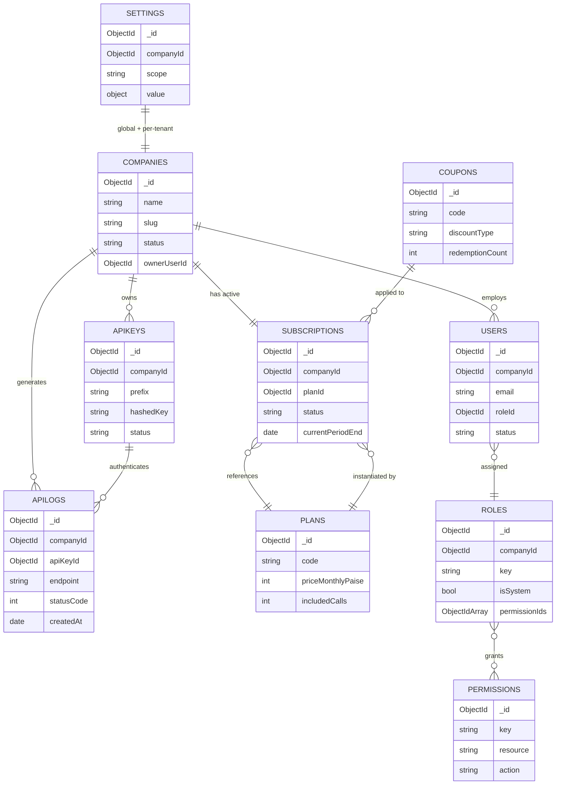
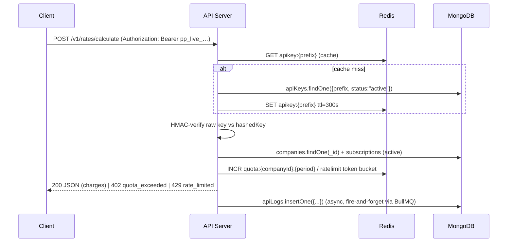
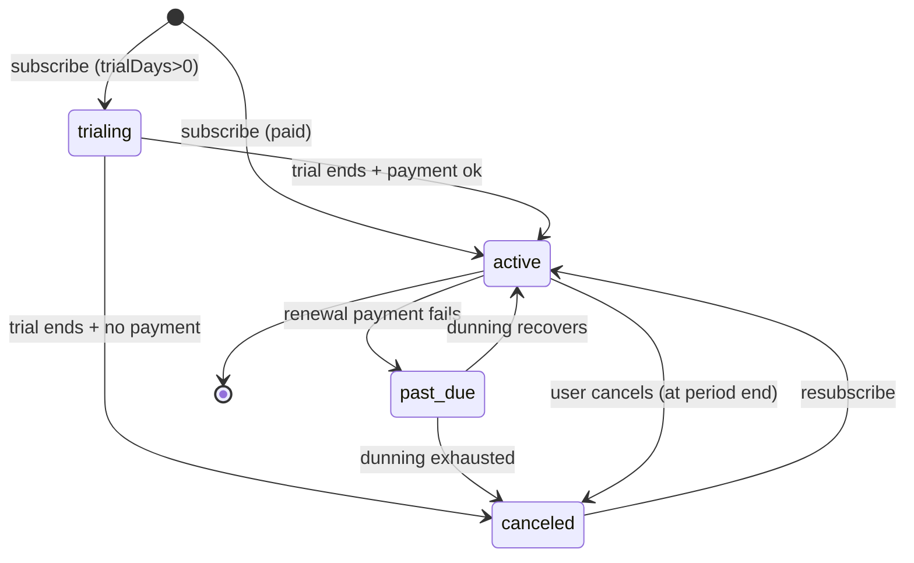
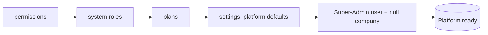

# MongoDB Data Model — Core Collections

This document specifies the **core identity, tenancy, billing and platform-configuration collections** for Postpin — the production-grade shipping-charges API SaaS. It covers the ten collections that anchor authentication, RBAC, multi-tenancy and monetization: `users`, `roles`, `permissions`, `companies`, `subscriptions`, `plans`, `apiKeys`, `apiLogs`, `coupons` and `settings`. For each collection you get a purpose statement, a full field table, relationship map, index strategy (with rationale, compounds and TTLs), `$jsonSchema`-style validation, an India-specific sample document, and one to two aggregation pipelines you can paste into `db.collection.aggregate()`. These schemas are the contract the API server, dashboards and background workers build against, so every tenant-scoped document carries a `companyId` discriminator and the conventions here are kept consistent with the shipping/pincode module docs.

> Sibling docs: see [Shipping Engine](04-shipping-engine.md), [Pincode Sync](05-pincode-sync.md), [Rate Cards & Zones](14b-data-model-shipping.md), [Tickets, Notifications & Audit](14c-data-model-ops.md), [API Reference](08-api-reference.md), [RBAC & Auth](06-auth-rbac.md).

---

## Contents

1. [Conventions & Cross-Cutting Rules](#1-conventions--cross-cutting-rules)
2. [Entity Relationship Overview](#2-entity-relationship-overview)
3. [`companies`](#3-companies)
4. [`users`](#4-users)
5. [`roles`](#5-roles)
6. [`permissions`](#6-permissions)
7. [`plans`](#7-plans)
8. [`subscriptions`](#8-subscriptions)
9. [`coupons`](#9-coupons)
10. [`apiKeys`](#10-apikeys)
11. [`apiLogs`](#11-apilogs)
12. [`settings`](#12-settings)
13. [Index Summary](#13-index-summary)
14. [Migration & Seeding Notes](#14-migration--seeding-notes)

---

## 1. Conventions & Cross-Cutting Rules

These rules apply to **every** collection in this document unless explicitly overridden.

| Concern | Rule |
|---|---|
| **Primary key** | `_id` is a MongoDB `ObjectId`. Application code references documents by `_id` unless a natural human-facing key is needed (e.g. `plans.code`, `permissions.key`). |
| **Tenant scoping** | Every tenant-owned document carries `companyId: ObjectId`. **All queries from tenant-facing surfaces MUST filter by `companyId`** — this is enforced at the data-access layer, never left to ad-hoc query construction. Platform-global collections (`plans`, `permissions`, `settings`, system `roles`) are *not* tenant-scoped and are explicitly marked. |
| **Timestamps** | `createdAt` and `updatedAt` are `Date` (UTC, stored as BSON `Date`). The app writes UTC; the dashboards render in IST (`Asia/Kolkata`, en-IN). Never store local time. |
| **Soft delete** | Identity/billing documents use `deletedAt: Date|null` + `status` rather than hard deletes, to preserve audit and billing history. High-volume logs (`apiLogs`) hard-expire via TTL instead. |
| **Money** | Monetary amounts are stored as **integer paise** in a field suffixed `*Paise` (e.g. `amountPaise: 49900` = ₹499.00) to avoid floating-point drift. Currency is always `"INR"`. Dashboards format with `Intl.NumberFormat('en-IN', { style:'currency', currency:'INR' })`. |
| **Secrets** | Raw API keys, passwords and webhook signing secrets are **never** stored. We persist a salted hash (`bcrypt` for passwords, `SHA-256` HMAC for API keys — see [`apiKeys`](#10-apikeys)). |
| **Enums** | Stored as lowercase strings (`"active"`, `"past_due"`), validated by `$jsonSchema` `enum`. |
| **References** | Foreign keys are stored as `ObjectId` and named `<entity>Id` (singular). Arrays of references use plural `<entity>Ids`. |
| **Schema versioning** | Documents that may migrate carry `schemaVersion: int` (default `1`) so background migrators can target stragglers. |

**Sizing assumptions** (drive index/TTL choices): 50k tenants at GA, p50 tenant doing 200k API calls/month, peak 1.2k req/s platform-wide, `apiLogs` ≈ 3B docs/year before TTL.

---

## 2. Entity Relationship Overview



**Request-time read path** (how these collections collaborate on a single `/v1/rates/calculate` call — full pipeline in [Shipping Engine](04-shipping-engine.md)):



---

## 3. `companies`

### Purpose
The **tenant root**. Every other tenant-scoped document points at a company. Holds organisation profile, KYC/GST details (India-specific), the owning user, lifecycle status, and a denormalized pointer to the active subscription for fast quota checks. One company == one billing boundary == one quota bucket.

### Fields

| Field | Type | Required | Description |
|---|---|---|---|
| `_id` | ObjectId | yes | Tenant identifier; referenced as `companyId` everywhere. |
| `name` | string | yes | Legal/display name, e.g. `"Lakshmi Logistics Pvt Ltd"`. |
| `slug` | string | yes | URL-safe unique handle (`lakshmi-logistics`), used in dashboard subpaths. |
| `ownerUserId` | ObjectId | yes | FK → `users._id`. The account owner (super-user within the tenant). |
| `status` | string | yes | `pending` \| `active` \| `suspended` \| `closed`. Suspended ⇒ API returns `403 account_suspended`. |
| `billingEmail` | string | yes | Where invoices/dunning go. |
| `gstin` | string | no | 15-char India GSTIN; validated by regex when present (B2B invoicing/ITC). |
| `pan` | string | no | 10-char PAN. |
| `address` | object | no | `{ line1, line2, city, state, pincode, country:"IN" }`. |
| `defaultPickupPincode` | string | no | 6-digit pincode pre-filled in calculator UI and used when request omits pickup. |
| `currency` | string | yes | Always `"INR"` at GA (kept for forward-compat). |
| `currentSubscriptionId` | ObjectId\|null | no | Denormalized FK → `subscriptions._id` for O(1) quota lookups. |
| `quotaWarningPct` | int | no | Notify when usage crosses this % (default `80`). |
| `featureFlags` | object | no | Per-tenant toggles, e.g. `{ "gstBreakup": true, "sandboxOnly": false }`. |
| `onboardingStep` | string | no | `signup` \| `verified` \| `key_created` \| `first_call` \| `done` — drives activation funnel. |
| `metadata` | object | no | Free-form tenant tags (industry, referral source). |
| `schemaVersion` | int | yes | Default `1`. |
| `createdAt` | Date | yes | — |
| `updatedAt` | Date | yes | — |
| `deletedAt` | Date\|null | no | Soft-delete tombstone. |

### Relationships
- **Referenced by:** `users.companyId`, `apiKeys.companyId`, `subscriptions.companyId`, `apiLogs.companyId`, `coupons` (via redemptions), `settings.companyId`, plus all shipping-module collections (`rateCards`, `zones`, `shippingRules`, `webhooks`, `tickets`).
- **References:** `users` (via `ownerUserId`), `subscriptions` (via `currentSubscriptionId`).

### Indexes

| Index | Type | Rationale |
|---|---|---|
| `{ slug: 1 }` | unique | Dashboard routing + uniqueness guarantee. |
| `{ status: 1, createdAt: -1 }` | compound | Admin lists active/suspended tenants by recency. |
| `{ gstin: 1 }` | partial unique (`{ gstin: { $exists: true } }`) | Prevent duplicate GST registrations; sparse-safe. |
| `{ ownerUserId: 1 }` | standard | Reverse lookup owner → company. |
| `{ "address.pincode": 1 }` | standard | Geo/region analytics in admin. |

### Validation (`$jsonSchema`)

```json
{
  "$jsonSchema": {
    "bsonType": "object",
    "required": ["name", "slug", "ownerUserId", "status", "billingEmail", "currency", "schemaVersion", "createdAt", "updatedAt"],
    "properties": {
      "name":   { "bsonType": "string", "minLength": 2, "maxLength": 200 },
      "slug":   { "bsonType": "string", "pattern": "^[a-z0-9]+(?:-[a-z0-9]+)*$" },
      "status": { "enum": ["pending", "active", "suspended", "closed"] },
      "billingEmail": { "bsonType": "string", "pattern": "^[^@\\s]+@[^@\\s]+\\.[^@\\s]+$" },
      "gstin":  { "bsonType": "string", "pattern": "^[0-9]{2}[A-Z]{5}[0-9]{4}[A-Z]{1}[1-9A-Z]{1}Z[0-9A-Z]{1}$" },
      "pan":    { "bsonType": "string", "pattern": "^[A-Z]{5}[0-9]{4}[A-Z]$" },
      "defaultPickupPincode": { "bsonType": "string", "pattern": "^[1-9][0-9]{5}$" },
      "currency": { "enum": ["INR"] },
      "quotaWarningPct": { "bsonType": "int", "minimum": 1, "maximum": 100 },
      "schemaVersion": { "bsonType": "int", "minimum": 1 }
    }
  }
}
```

### Sample Document

```json
{
  "_id": { "$oid": "6650a1b2c3d4e5f600000101" },
  "name": "Lakshmi Logistics Pvt Ltd",
  "slug": "lakshmi-logistics",
  "ownerUserId": { "$oid": "6650a1b2c3d4e5f600000201" },
  "status": "active",
  "billingEmail": "accounts@lakshmilogistics.in",
  "gstin": "27AABCL1234C1Z5",
  "pan": "AABCL1234C",
  "address": {
    "line1": "Unit 4, Andheri Industrial Estate",
    "line2": "Off Veera Desai Road",
    "city": "Mumbai",
    "state": "Maharashtra",
    "pincode": "400053",
    "country": "IN"
  },
  "defaultPickupPincode": "400053",
  "currency": "INR",
  "currentSubscriptionId": { "$oid": "6650a1b2c3d4e5f600000501" },
  "quotaWarningPct": 80,
  "featureFlags": { "gstBreakup": true, "sandboxOnly": false },
  "onboardingStep": "done",
  "metadata": { "industry": "ecommerce", "referralSource": "google_ads" },
  "schemaVersion": 1,
  "createdAt": { "$date": "2026-03-12T06:30:00.000Z" },
  "updatedAt": { "$date": "2026-06-20T11:05:42.000Z" },
  "deletedAt": null
}
```

### Aggregation Example — Tenants by state with active-subscription join (admin geo dashboard)

```json
[
  { "$match": { "status": "active", "deletedAt": null } },
  { "$group": {
      "_id": "$address.state",
      "tenantCount": { "$sum": 1 },
      "companyIds": { "$push": "$_id" }
  }},
  { "$lookup": {
      "from": "subscriptions",
      "localField": "companyIds",
      "foreignField": "companyId",
      "pipeline": [ { "$match": { "status": "active" } } ],
      "as": "activeSubs"
  }},
  { "$project": {
      "state": "$_id", "_id": 0,
      "tenantCount": 1,
      "payingTenants": { "$size": "$activeSubs" }
  }},
  { "$sort": { "tenantCount": -1 } }
]
```

---

## 4. `users`

### Purpose
Individual human accounts. **Tenant-scoped** — a user belongs to exactly one `company`. Holds credentials (hashed), profile, the assigned `roleId`, MFA state, session/security metadata, and last-activity for engagement metrics. Super-Admin platform staff are also `users` but with `companyId: null` and a system role (see `isPlatformStaff`).

### Fields

| Field | Type | Required | Description |
|---|---|---|---|
| `_id` | ObjectId | yes | — |
| `companyId` | ObjectId\|null | yes* | FK → `companies._id`. `null` only for platform staff (Super-Admin). |
| `email` | string | yes | Login identifier; unique **per company** (and globally for platform staff). Stored lowercased. |
| `passwordHash` | string | yes | `bcrypt` hash (cost 12). Never the raw password. |
| `name` | string | yes | Display name. |
| `phone` | string | no | E.164, India default `+91`. |
| `roleId` | ObjectId | yes | FK → `roles._id`. Drives RBAC. |
| `isPlatformStaff` | bool | yes | `true` ⇒ Super-Admin/Sub-Admin portal user (companyId null). Default `false`. |
| `status` | string | yes | `invited` \| `active` \| `suspended` \| `disabled`. |
| `emailVerifiedAt` | Date\|null | no | Set on email confirmation. |
| `mfa` | object | no | `{ enabled, method:"totp", secretEnc, backupCodesHashed:[…] }`. Secret stored encrypted (KMS), never plaintext. |
| `lastLoginAt` | Date\|null | no | Engagement + security. |
| `lastLoginIp` | string | no | Last seen IP (audit). |
| `failedLoginCount` | int | no | Lockout counter; reset on success. |
| `lockedUntil` | Date\|null | no | Brute-force lockout window. |
| `invitedByUserId` | ObjectId\|null | no | FK → `users._id`, who invited this teammate. |
| `notificationPrefs` | object | no | `{ quotaAlerts, billing, productUpdates }` booleans. |
| `locale` | string | no | Default `"en-IN"`. |
| `timezone` | string | no | Default `"Asia/Kolkata"`. |
| `schemaVersion` | int | yes | Default `1`. |
| `createdAt` | Date | yes | — |
| `updatedAt` | Date | yes | — |
| `deletedAt` | Date\|null | no | Soft delete. |

> *`companyId` is required as a key but may be `null` for platform staff — enforced in validation via `bsonType: ["objectId","null"]`.

### Relationships
- **References:** `companies` (`companyId`), `roles` (`roleId`), `users` (`invitedByUserId`).
- **Referenced by:** `companies.ownerUserId`, `apiKeys.createdByUserId`, `tickets.requesterId`, `auditLogs.actorUserId`, `subscriptions.createdByUserId`.

### Indexes

| Index | Type | Rationale |
|---|---|---|
| `{ companyId: 1, email: 1 }` | unique | Email unique within a tenant; primary login lookup is tenant-scoped. |
| `{ email: 1, isPlatformStaff: 1 }` | partial unique (`{ isPlatformStaff: true }`) | Globally-unique platform-staff logins. |
| `{ companyId: 1, status: 1 }` | compound | List/filter members in tenant settings. |
| `{ roleId: 1 }` | standard | "Who has role X" + impact analysis on role edits. |
| `{ lockedUntil: 1 }` | partial (`{ lockedUntil: { $ne: null } }`) | Background unlock sweeper. |

### Validation (`$jsonSchema`)

```json
{
  "$jsonSchema": {
    "bsonType": "object",
    "required": ["email", "passwordHash", "name", "roleId", "isPlatformStaff", "status", "schemaVersion", "createdAt", "updatedAt"],
    "properties": {
      "companyId": { "bsonType": ["objectId", "null"] },
      "email":     { "bsonType": "string", "pattern": "^[^@\\s]+@[^@\\s]+\\.[^@\\s]+$" },
      "passwordHash": { "bsonType": "string", "minLength": 20 },
      "name":      { "bsonType": "string", "minLength": 1, "maxLength": 120 },
      "phone":     { "bsonType": "string", "pattern": "^\\+[1-9][0-9]{7,14}$" },
      "roleId":    { "bsonType": "objectId" },
      "isPlatformStaff": { "bsonType": "bool" },
      "status":    { "enum": ["invited", "active", "suspended", "disabled"] },
      "failedLoginCount": { "bsonType": "int", "minimum": 0 },
      "locale":    { "bsonType": "string" },
      "schemaVersion": { "bsonType": "int", "minimum": 1 }
    }
  }
}
```

### Sample Document

```json
{
  "_id": { "$oid": "6650a1b2c3d4e5f600000201" },
  "companyId": { "$oid": "6650a1b2c3d4e5f600000101" },
  "email": "priya.sharma@lakshmilogistics.in",
  "passwordHash": "$2b$12$Q9b1u8m3kVw0a6n2pXr5ee7Zf1k3sQwY2mZ8oP1aB3cD4eF5gH6i",
  "name": "Priya Sharma",
  "phone": "+919820012345",
  "roleId": { "$oid": "6650a1b2c3d4e5f600000301" },
  "isPlatformStaff": false,
  "status": "active",
  "emailVerifiedAt": { "$date": "2026-03-12T07:01:10.000Z" },
  "mfa": { "enabled": true, "method": "totp", "secretEnc": "kms:v1:AQID…", "backupCodesHashed": ["$2b$12$…", "$2b$12$…"] },
  "lastLoginAt": { "$date": "2026-06-26T03:15:00.000Z" },
  "lastLoginIp": "49.36.220.14",
  "failedLoginCount": 0,
  "lockedUntil": null,
  "invitedByUserId": null,
  "notificationPrefs": { "quotaAlerts": true, "billing": true, "productUpdates": false },
  "locale": "en-IN",
  "timezone": "Asia/Kolkata",
  "schemaVersion": 1,
  "createdAt": { "$date": "2026-03-12T06:30:05.000Z" },
  "updatedAt": { "$date": "2026-06-26T03:15:00.000Z" },
  "deletedAt": null
}
```

### Aggregation Example — Active members per tenant with role names

```json
[
  { "$match": { "deletedAt": null, "status": "active", "isPlatformStaff": false } },
  { "$lookup": { "from": "roles", "localField": "roleId", "foreignField": "_id", "as": "role" } },
  { "$unwind": "$role" },
  { "$group": {
      "_id": { "companyId": "$companyId", "role": "$role.name" },
      "members": { "$sum": 1 }
  }},
  { "$group": {
      "_id": "$_id.companyId",
      "totalMembers": { "$sum": "$members" },
      "byRole": { "$push": { "role": "$_id.role", "count": "$members" } }
  }},
  { "$sort": { "totalMembers": -1 } }
]
```

---

## 5. `roles`

### Purpose
Named bundles of permissions assigned to users. Postpin ships **system roles** (global, `companyId: null`, immutable) such as `super_admin`, `support_admin`, plus per-tenant **custom roles** the company owner can create (e.g. `billing_manager`, `dev_readonly`). A role is the join object between `users` and `permissions`.

### Fields

| Field | Type | Required | Description |
|---|---|---|---|
| `_id` | ObjectId | yes | — |
| `companyId` | ObjectId\|null | yes | `null` ⇒ platform/system role shared by all tenants; otherwise tenant-scoped custom role. |
| `key` | string | yes | Stable machine key, e.g. `super_admin`, `tenant_owner`, `dev_readonly`. Unique within scope. |
| `name` | string | yes | Human label, e.g. `"Billing Manager"`. |
| `description` | string | no | What this role is for. |
| `permissionIds` | ObjectId[] | yes | FK array → `permissions._id`. The grants. |
| `isSystem` | bool | yes | `true` ⇒ seeded, immutable, cannot be deleted/edited by tenants. |
| `isDefault` | bool | no | Auto-assigned to new members of a tenant when no role chosen. |
| `scope` | string | yes | `platform` \| `tenant`. Mirrors `companyId` nullability for query convenience. |
| `schemaVersion` | int | yes | Default `1`. |
| `createdAt` | Date | yes | — |
| `updatedAt` | Date | yes | — |

### Relationships
- **References:** `permissions` (`permissionIds[]`), `companies` (`companyId`).
- **Referenced by:** `users.roleId`.

### Indexes

| Index | Type | Rationale |
|---|---|---|
| `{ companyId: 1, key: 1 }` | unique | Role keys unique per tenant; system roles (`companyId:null`) unique globally. |
| `{ scope: 1, isSystem: 1 }` | compound | Fetch all system roles for seeding/menus. |
| `{ permissionIds: 1 }` | multikey | Impact analysis: "which roles grant permission P" when a permission is deprecated. |
| `{ companyId: 1, isDefault: 1 }` | partial (`{ isDefault: true }`) | Resolve the default role for new invitees in O(1). |

### Validation (`$jsonSchema`)

```json
{
  "$jsonSchema": {
    "bsonType": "object",
    "required": ["companyId", "key", "name", "permissionIds", "isSystem", "scope", "schemaVersion", "createdAt", "updatedAt"],
    "properties": {
      "companyId": { "bsonType": ["objectId", "null"] },
      "key":  { "bsonType": "string", "pattern": "^[a-z][a-z0-9_]*$" },
      "name": { "bsonType": "string", "minLength": 2, "maxLength": 80 },
      "permissionIds": { "bsonType": "array", "items": { "bsonType": "objectId" }, "uniqueItems": true },
      "isSystem": { "bsonType": "bool" },
      "scope": { "enum": ["platform", "tenant"] },
      "schemaVersion": { "bsonType": "int", "minimum": 1 }
    }
  }
}
```

### Sample Documents

```json
{
  "_id": { "$oid": "6650a1b2c3d4e5f600000301" },
  "companyId": { "$oid": "6650a1b2c3d4e5f600000101" },
  "key": "billing_manager",
  "name": "Billing Manager",
  "description": "Manages subscription, invoices and coupons; read-only on API keys.",
  "permissionIds": [
    { "$oid": "6650a1b2c3d4e5f600000401" },
    { "$oid": "6650a1b2c3d4e5f600000402" },
    { "$oid": "6650a1b2c3d4e5f600000405" }
  ],
  "isSystem": false,
  "isDefault": false,
  "scope": "tenant",
  "schemaVersion": 1,
  "createdAt": { "$date": "2026-04-01T09:00:00.000Z" },
  "updatedAt": { "$date": "2026-04-01T09:00:00.000Z" }
}
```

```json
{
  "_id": { "$oid": "6650a1b2c3d4e5f6000003ff" },
  "companyId": null,
  "key": "support_admin",
  "name": "Support Admin (Sub-Admin)",
  "description": "Platform staff: manage tickets and users; cannot edit plans or billing.",
  "permissionIds": [
    { "$oid": "6650a1b2c3d4e5f600000410" },
    { "$oid": "6650a1b2c3d4e5f600000411" }
  ],
  "isSystem": true,
  "isDefault": false,
  "scope": "platform",
  "schemaVersion": 1,
  "createdAt": { "$date": "2026-01-10T00:00:00.000Z" },
  "updatedAt": { "$date": "2026-01-10T00:00:00.000Z" }
}
```

### Aggregation Example — Resolve a user's effective permission keys

```json
[
  { "$match": { "_id": { "$oid": "6650a1b2c3d4e5f600000301" } } },
  { "$lookup": {
      "from": "permissions",
      "localField": "permissionIds",
      "foreignField": "_id",
      "as": "perms"
  }},
  { "$project": {
      "_id": 0,
      "role": "$name",
      "permissionKeys": "$perms.key"
  }}
]
```

---

## 6. `permissions`

### Purpose
The **atomic, platform-global catalogue** of grantable actions. Not tenant-scoped — the same `permissions` set exists for everyone; tenants compose them into roles. Each permission is a `resource:action` pair (e.g. `apikeys:create`). This collection is essentially a seeded, append-only reference table.

### Fields

| Field | Type | Required | Description |
|---|---|---|---|
| `_id` | ObjectId | yes | — |
| `key` | string | yes | Canonical `resource:action`, e.g. `subscriptions:write`. Unique. |
| `resource` | string | yes | Domain object, e.g. `apikeys`, `rate_cards`, `tickets`, `settings`. |
| `action` | string | yes | `read` \| `write` \| `create` \| `delete` \| `manage` \| `export`. |
| `description` | string | yes | Human description for the role editor UI. |
| `group` | string | yes | UI grouping bucket, e.g. `Billing`, `Developers`, `Support`. |
| `scope` | string | yes | `platform` (Super-Admin only) or `tenant` (assignable in tenant roles). |
| `isDangerous` | bool | no | `true` ⇒ destructive; UI shows a warning + may require re-auth. |
| `schemaVersion` | int | yes | Default `1`. |
| `createdAt` | Date | yes | — |

### Relationships
- **Referenced by:** `roles.permissionIds[]`.
- **References:** none (root reference table).

### Indexes

| Index | Type | Rationale |
|---|---|---|
| `{ key: 1 }` | unique | Lookup by canonical key during authorization checks. |
| `{ resource: 1, action: 1 }` | unique compound | Guarantees no duplicate resource/action; powers grouped role-editor UI. |
| `{ scope: 1, group: 1 }` | compound | Render the permission picker grouped by section, filtered by portal. |

### Validation (`$jsonSchema`)

```json
{
  "$jsonSchema": {
    "bsonType": "object",
    "required": ["key", "resource", "action", "description", "group", "scope", "schemaVersion", "createdAt"],
    "properties": {
      "key":      { "bsonType": "string", "pattern": "^[a-z_]+:[a-z_]+$" },
      "resource": { "bsonType": "string", "pattern": "^[a-z_]+$" },
      "action":   { "enum": ["read", "write", "create", "delete", "manage", "export"] },
      "scope":    { "enum": ["platform", "tenant"] },
      "isDangerous": { "bsonType": "bool" },
      "schemaVersion": { "bsonType": "int", "minimum": 1 }
    }
  }
}
```

### Sample Document

```json
{
  "_id": { "$oid": "6650a1b2c3d4e5f600000401" },
  "key": "subscriptions:write",
  "resource": "subscriptions",
  "action": "write",
  "description": "Change the company's plan, apply coupons, and manage billing details.",
  "group": "Billing",
  "scope": "tenant",
  "isDangerous": false,
  "schemaVersion": 1,
  "createdAt": { "$date": "2026-01-10T00:00:00.000Z" }
}
```

### Aggregation Example — Permission catalogue grouped for the role-editor UI

```json
[
  { "$match": { "scope": "tenant" } },
  { "$group": {
      "_id": "$group",
      "permissions": {
        "$push": { "key": "$key", "action": "$action", "resource": "$resource", "dangerous": "$isDangerous" }
      },
      "count": { "$sum": 1 }
  }},
  { "$sort": { "_id": 1 } }
]
```

---

## 7. `plans`

### Purpose
**Platform-global** product catalogue of subscription tiers (Free, Starter, Growth, Enterprise). Defines pricing, included quota, rate limits, overage rate, and feature gates. `subscriptions` reference a plan; editing a plan never retroactively mutates existing subscriptions (they pin a `priceSnapshot`). Plans are versioned via `version` + `isActive` so old subscribers keep grandfathered terms.

### Fields

| Field | Type | Required | Description |
|---|---|---|---|
| `_id` | ObjectId | yes | — |
| `code` | string | yes | Stable identifier, e.g. `growth`. Unique together with `version`. |
| `version` | int | yes | Plan revision; lets us re-price without breaking grandfathered subs. |
| `name` | string | yes | `"Growth"`. |
| `description` | string | no | Marketing blurb. |
| `priceMonthlyPaise` | int | yes | Monthly price in paise (e.g. `499900` = ₹4,999). `0` for Free. |
| `priceYearlyPaise` | int | no | Annual price (usually ~2 months free). |
| `includedCalls` | int | yes | Monthly included API calls (quota). `-1` ⇒ unlimited (Enterprise). |
| `overagePerCallPaise` | int | no | Charge per call beyond quota. `null` ⇒ hard cap (block instead of bill). |
| `rateLimit` | object | yes | `{ rpm: int, rpd: int, burst: int }` — Redis token-bucket params. |
| `features` | object | yes | Feature gates, e.g. `{ gstBreakup, codCharges, remoteSurcharge, webhooks, sandbox, supportSla:"24h" }`. |
| `maxApiKeys` | int | yes | Cap on active keys per tenant (`-1` unlimited). |
| `maxTeamMembers` | int | yes | Cap on `users` per tenant. |
| `trialDays` | int | no | Free trial length when subscribing (default `0`). |
| `isActive` | bool | yes | `false` ⇒ hidden from pricing page but honored for existing subs. |
| `isPublic` | bool | yes | `false` ⇒ custom/negotiated plan, link-only. |
| `sortOrder` | int | no | Pricing-page ordering. |
| `schemaVersion` | int | yes | Default `1`. |
| `createdAt` | Date | yes | — |
| `updatedAt` | Date | yes | — |

### Relationships
- **Referenced by:** `subscriptions.planId`.
- **References:** none (catalogue root).

### Indexes

| Index | Type | Rationale |
|---|---|---|
| `{ code: 1, version: 1 }` | unique compound | One row per plan revision. |
| `{ isActive: 1, isPublic: 1, sortOrder: 1 }` | compound | Render the public pricing page in order, active-only. |

### Validation (`$jsonSchema`)

```json
{
  "$jsonSchema": {
    "bsonType": "object",
    "required": ["code", "version", "name", "priceMonthlyPaise", "includedCalls", "rateLimit", "features", "maxApiKeys", "maxTeamMembers", "isActive", "isPublic", "schemaVersion", "createdAt", "updatedAt"],
    "properties": {
      "code":    { "bsonType": "string", "pattern": "^[a-z][a-z0-9_]*$" },
      "version": { "bsonType": "int", "minimum": 1 },
      "priceMonthlyPaise": { "bsonType": "int", "minimum": 0 },
      "includedCalls": { "bsonType": "int", "minimum": -1 },
      "overagePerCallPaise": { "bsonType": ["int", "null"], "minimum": 0 },
      "rateLimit": {
        "bsonType": "object",
        "required": ["rpm", "rpd", "burst"],
        "properties": {
          "rpm":   { "bsonType": "int", "minimum": 1 },
          "rpd":   { "bsonType": "int", "minimum": 1 },
          "burst": { "bsonType": "int", "minimum": 1 }
        }
      },
      "maxApiKeys":     { "bsonType": "int", "minimum": -1 },
      "maxTeamMembers": { "bsonType": "int", "minimum": -1 },
      "schemaVersion":  { "bsonType": "int", "minimum": 1 }
    }
  }
}
```

### Sample Document

```json
{
  "_id": { "$oid": "6650a1b2c3d4e5f600000601" },
  "code": "growth",
  "version": 2,
  "name": "Growth",
  "description": "For scaling D2C brands and aggregators. GST breakup, webhooks, 100k calls.",
  "priceMonthlyPaise": 499900,
  "priceYearlyPaise": 4999000,
  "includedCalls": 100000,
  "overagePerCallPaise": 8,
  "rateLimit": { "rpm": 600, "rpd": 200000, "burst": 60 },
  "features": {
    "gstBreakup": true,
    "codCharges": true,
    "remoteSurcharge": true,
    "fuelSurcharge": true,
    "webhooks": true,
    "sandbox": true,
    "supportSla": "24h"
  },
  "maxApiKeys": 10,
  "maxTeamMembers": 15,
  "trialDays": 14,
  "isActive": true,
  "isPublic": true,
  "sortOrder": 3,
  "schemaVersion": 1,
  "createdAt": { "$date": "2026-02-01T00:00:00.000Z" },
  "updatedAt": { "$date": "2026-05-15T10:00:00.000Z" }
}
```

### Aggregation Example — Active-subscriber count and MRR contribution per plan

```json
[
  { "$match": { "isActive": true } },
  { "$lookup": {
      "from": "subscriptions",
      "let": { "planId": "$_id" },
      "pipeline": [
        { "$match": { "$expr": { "$and": [
          { "$eq": ["$planId", "$$planId"] },
          { "$eq": ["$status", "active"] },
          { "$eq": ["$interval", "monthly"] }
        ]}}}
      ],
      "as": "subs"
  }},
  { "$project": {
      "_id": 0,
      "plan": "$name",
      "code": "$code",
      "activeSubscribers": { "$size": "$subs" },
      "listMrrPaise": { "$multiply": [ { "$size": "$subs" }, "$priceMonthlyPaise" ] }
  }},
  { "$sort": { "listMrrPaise": -1 } }
]
```

---

## 8. `subscriptions`

### Purpose
The **active billing contract** between a `company` and a `plan`. One *active* subscription per company (history rows kept with non-active status). Tracks billing period, status lifecycle, applied coupon, price snapshot (so plan edits don't change billed amount), cancellation intent, and the running usage counters that gate quota. The MRR/ARR source of truth.

### Lifecycle



### Fields

| Field | Type | Required | Description |
|---|---|---|---|
| `_id` | ObjectId | yes | — |
| `companyId` | ObjectId | yes | FK → `companies._id`. Tenant scope. |
| `planId` | ObjectId | yes | FK → `plans._id` (specific version). |
| `planCode` | string | yes | Denormalized `plans.code` for fast filtering/reporting. |
| `status` | string | yes | `trialing` \| `active` \| `past_due` \| `canceled` \| `expired`. |
| `interval` | string | yes | `monthly` \| `yearly`. |
| `priceSnapshotPaise` | int | yes | Price locked at subscribe/renew time (grandfathering). |
| `currency` | string | yes | `"INR"`. |
| `currentPeriodStart` | Date | yes | Billing period start (UTC). |
| `currentPeriodEnd` | Date | yes | Billing period end; quota counter resets here. |
| `trialEndsAt` | Date\|null | no | Trial boundary if `trialing`. |
| `cancelAtPeriodEnd` | bool | yes | User asked to cancel; remains active until `currentPeriodEnd`. |
| `canceledAt` | Date\|null | no | When cancellation took effect. |
| `couponId` | ObjectId\|null | no | FK → `coupons._id` applied to this sub. |
| `discountAppliedPaise` | int | no | Resolved discount this period (for invoice). |
| `usage` | object | yes | `{ callsUsed, includedCalls, overageCalls, periodKey }` — mirrors Redis counter, persisted on rollover. |
| `paymentProvider` | string | no | `razorpay` \| `stripe` \| `manual`. |
| `providerSubscriptionId` | string\|null | no | External subscription id (Razorpay/Stripe). |
| `dunning` | object | no | `{ attempts, lastAttemptAt, nextAttemptAt }` for past_due recovery. |
| `createdByUserId` | ObjectId | no | FK → `users._id`. |
| `schemaVersion` | int | yes | Default `1`. |
| `createdAt` | Date | yes | — |
| `updatedAt` | Date | yes | — |

### Relationships
- **References:** `companies` (`companyId`), `plans` (`planId`), `coupons` (`couponId`), `users` (`createdByUserId`).
- **Referenced by:** `companies.currentSubscriptionId` (denormalized pointer), `apiLogs` (indirectly, via quota).

### Indexes

| Index | Type | Rationale |
|---|---|---|
| `{ companyId: 1, status: 1 }` | compound | Fetch the tenant's active subscription on every quota check; list history. |
| `{ companyId: 1 }` partial `{ status: "active" }` | partial unique | Enforce **at most one active subscription per tenant**. |
| `{ status: 1, currentPeriodEnd: 1 }` | compound | Renewal/expiry cron sweeps subs due for billing. |
| `{ "dunning.nextAttemptAt": 1 }` | partial (`{ status:"past_due" }`) | Dunning worker picks up retries efficiently. |
| `{ planCode: 1, status: 1 }` | compound | Plan-level reporting (MRR, churn) without `$lookup`. |
| `{ couponId: 1 }` | partial (`{ couponId: { $ne: null } }`) | Coupon attribution / redemption reconciliation. |

### Validation (`$jsonSchema`)

```json
{
  "$jsonSchema": {
    "bsonType": "object",
    "required": ["companyId", "planId", "planCode", "status", "interval", "priceSnapshotPaise", "currency", "currentPeriodStart", "currentPeriodEnd", "cancelAtPeriodEnd", "usage", "schemaVersion", "createdAt", "updatedAt"],
    "properties": {
      "companyId": { "bsonType": "objectId" },
      "planId":    { "bsonType": "objectId" },
      "status":    { "enum": ["trialing", "active", "past_due", "canceled", "expired"] },
      "interval":  { "enum": ["monthly", "yearly"] },
      "priceSnapshotPaise": { "bsonType": "int", "minimum": 0 },
      "currency":  { "enum": ["INR"] },
      "cancelAtPeriodEnd": { "bsonType": "bool" },
      "couponId":  { "bsonType": ["objectId", "null"] },
      "usage": {
        "bsonType": "object",
        "required": ["callsUsed", "includedCalls", "periodKey"],
        "properties": {
          "callsUsed":     { "bsonType": "int", "minimum": 0 },
          "includedCalls": { "bsonType": "int", "minimum": -1 },
          "overageCalls":  { "bsonType": "int", "minimum": 0 },
          "periodKey":     { "bsonType": "string", "pattern": "^[0-9]{4}-[0-9]{2}$" }
        }
      },
      "schemaVersion": { "bsonType": "int", "minimum": 1 }
    }
  }
}
```

### Sample Document

```json
{
  "_id": { "$oid": "6650a1b2c3d4e5f600000501" },
  "companyId": { "$oid": "6650a1b2c3d4e5f600000101" },
  "planId": { "$oid": "6650a1b2c3d4e5f600000601" },
  "planCode": "growth",
  "status": "active",
  "interval": "monthly",
  "priceSnapshotPaise": 499900,
  "currency": "INR",
  "currentPeriodStart": { "$date": "2026-06-12T00:00:00.000Z" },
  "currentPeriodEnd": { "$date": "2026-07-12T00:00:00.000Z" },
  "trialEndsAt": null,
  "cancelAtPeriodEnd": false,
  "canceledAt": null,
  "couponId": { "$oid": "6650a1b2c3d4e5f600000701" },
  "discountAppliedPaise": 99980,
  "usage": { "callsUsed": 64210, "includedCalls": 100000, "overageCalls": 0, "periodKey": "2026-06" },
  "paymentProvider": "razorpay",
  "providerSubscriptionId": "sub_OqK2mJ9pT4xY1z",
  "dunning": { "attempts": 0, "lastAttemptAt": null, "nextAttemptAt": null },
  "createdByUserId": { "$oid": "6650a1b2c3d4e5f600000201" },
  "schemaVersion": 1,
  "createdAt": { "$date": "2026-03-12T07:10:00.000Z" },
  "updatedAt": { "$date": "2026-06-26T03:00:00.000Z" }
}
```

### Aggregation Example 1 — Net MRR (normalized, discounts applied)

Yearly subs are amortized to a monthly figure; coupon discounts subtracted.

```json
[
  { "$match": { "status": { "$in": ["active", "trialing"] } } },
  { "$addFields": {
      "monthlyGrossPaise": {
        "$cond": [
          { "$eq": ["$interval", "yearly"] },
          { "$round": [ { "$divide": ["$priceSnapshotPaise", 12] }, 0 ] },
          "$priceSnapshotPaise"
        ]
      },
      "monthlyDiscountPaise": {
        "$cond": [
          { "$eq": ["$interval", "yearly"] },
          { "$round": [ { "$divide": [ { "$ifNull": ["$discountAppliedPaise", 0] }, 12 ] }, 0 ] },
          { "$ifNull": ["$discountAppliedPaise", 0] }
        ]
      }
  }},
  { "$group": {
      "_id": "$planCode",
      "subscribers": { "$sum": 1 },
      "grossMrrPaise": { "$sum": "$monthlyGrossPaise" },
      "discountPaise": { "$sum": "$monthlyDiscountPaise" }
  }},
  { "$addFields": { "netMrrPaise": { "$subtract": ["$grossMrrPaise", "$discountPaise"] } } },
  { "$group": {
      "_id": null,
      "byPlan": { "$push": { "plan": "$_id", "subscribers": "$subscribers", "netMrrPaise": "$netMrrPaise" } },
      "totalNetMrrPaise": { "$sum": "$netMrrPaise" }
  }},
  { "$addFields": {
      "totalNetMrrInr": { "$divide": ["$totalNetMrrPaise", 100] },
      "annualRunRateInr": { "$divide": [ { "$multiply": ["$totalNetMrrPaise", 12] }, 100 ] }
  }}
]
```

### Aggregation Example 2 — Quota burn-rate alert (tenants past their warning threshold)

```json
[
  { "$match": { "status": "active", "usage.includedCalls": { "$gt": 0 } } },
  { "$addFields": {
      "usedPct": { "$multiply": [ { "$divide": ["$usage.callsUsed", "$usage.includedCalls"] }, 100 ] }
  }},
  { "$match": { "usedPct": { "$gte": 80 } } },
  { "$lookup": { "from": "companies", "localField": "companyId", "foreignField": "_id", "as": "company" } },
  { "$unwind": "$company" },
  { "$project": {
      "_id": 0,
      "company": "$company.name",
      "billingEmail": "$company.billingEmail",
      "plan": "$planCode",
      "callsUsed": "$usage.callsUsed",
      "includedCalls": "$usage.includedCalls",
      "usedPct": { "$round": ["$usedPct", 1] }
  }},
  { "$sort": { "usedPct": -1 } }
]
```

---

## 9. `coupons`

### Purpose
Discount/promo codes applied at checkout or plan change. **Hybrid scope:** most coupons are platform-global (`companyId: null`) and created by Super-Admin; targeted coupons may be tenant-restricted. Tracks discount type/value, redemption limits (global + per-tenant), validity window, plan eligibility, and a redemption ledger for reconciliation against `subscriptions`.

### Fields

| Field | Type | Required | Description |
|---|---|---|---|
| `_id` | ObjectId | yes | — |
| `code` | string | yes | Uppercased redemption code, e.g. `WELCOME20`. Unique. |
| `companyId` | ObjectId\|null | no | `null` ⇒ globally available; set ⇒ restricted to one tenant. |
| `description` | string | no | Internal note / campaign name. |
| `discountType` | string | yes | `percent` \| `fixed` \| `free_trial`. |
| `value` | int | yes | `percent`: 1–100. `fixed`: paise off. `free_trial`: extra trial days. |
| `currency` | string | no | `"INR"` (only meaningful for `fixed`). |
| `appliesToPlanCodes` | string[] | no | Eligible plan codes; empty/absent ⇒ all plans. |
| `appliesToInterval` | string\|null | no | `monthly` \| `yearly` \| `null` (any). |
| `duration` | string | yes | `once` \| `repeating` \| `forever`. How long the discount persists. |
| `durationMonths` | int\|null | no | For `repeating`: number of billing periods. |
| `maxRedemptions` | int\|null | no | Global cap; `null` ⇒ unlimited. |
| `maxRedemptionsPerCompany` | int | yes | Per-tenant cap (default `1`). |
| `redemptionCount` | int | yes | Running global redemptions (atomic `$inc`). |
| `minSubtotalPaise` | int | no | Minimum order value to qualify. |
| `firstTimeOnly` | bool | no | Restrict to tenants with no prior paid subscription. |
| `validFrom` | Date | yes | Activation time. |
| `validUntil` | Date | yes | Expiry; also drives the TTL/auto-disable sweep. |
| `status` | string | yes | `active` \| `paused` \| `expired` \| `exhausted`. |
| `redemptions` | object[] | no | Ledger: `{ companyId, subscriptionId, redeemedAt, amountPaise }` (capped array; full ledger also in `auditLogs`). |
| `createdByUserId` | ObjectId | no | FK → `users._id` (platform staff). |
| `schemaVersion` | int | yes | Default `1`. |
| `createdAt` | Date | yes | — |
| `updatedAt` | Date | yes | — |

### Relationships
- **References:** `companies` (`companyId` when targeted), `plans` (`appliesToPlanCodes` soft-FK by code), `users` (`createdByUserId`).
- **Referenced by:** `subscriptions.couponId`.

### Indexes

| Index | Type | Rationale |
|---|---|---|
| `{ code: 1 }` | unique | Redemption lookup is by code; must be globally unique. |
| `{ status: 1, validUntil: 1 }` | compound | Find live coupons; expiry sweeper. |
| `{ companyId: 1, status: 1 }` | partial (`{ companyId: { $ne: null } }`) | Tenant-targeted coupon listing. |
| `{ "redemptions.companyId": 1 }` | multikey | Enforce per-company redemption cap quickly. |

> **Concurrency note:** redemption must be atomic. Use a single `findOneAndUpdate` with a guarded filter:
> `{ code, status:"active", validUntil:{$gte:now}, $expr:{$lt:["$redemptionCount", "$maxRedemptions"]} }` + `{ $inc:{ redemptionCount:1 }, $push:{ redemptions:{…} } }`. If it returns `null`, the coupon is invalid/exhausted — never read-then-write.

### Validation (`$jsonSchema`)

```json
{
  "$jsonSchema": {
    "bsonType": "object",
    "required": ["code", "discountType", "value", "duration", "maxRedemptionsPerCompany", "redemptionCount", "validFrom", "validUntil", "status", "schemaVersion", "createdAt", "updatedAt"],
    "properties": {
      "code":         { "bsonType": "string", "pattern": "^[A-Z0-9_-]{3,32}$" },
      "companyId":    { "bsonType": ["objectId", "null"] },
      "discountType": { "enum": ["percent", "fixed", "free_trial"] },
      "value":        { "bsonType": "int", "minimum": 1 },
      "duration":     { "enum": ["once", "repeating", "forever"] },
      "durationMonths": { "bsonType": ["int", "null"], "minimum": 1 },
      "maxRedemptions": { "bsonType": ["int", "null"], "minimum": 1 },
      "maxRedemptionsPerCompany": { "bsonType": "int", "minimum": 1 },
      "redemptionCount": { "bsonType": "int", "minimum": 0 },
      "status":       { "enum": ["active", "paused", "expired", "exhausted"] },
      "schemaVersion": { "bsonType": "int", "minimum": 1 }
    }
  }
}
```

### Sample Document

```json
{
  "_id": { "$oid": "6650a1b2c3d4e5f600000701" },
  "code": "WELCOME20",
  "companyId": null,
  "description": "Festive launch — 20% off first 3 months on Growth/Scale.",
  "discountType": "percent",
  "value": 20,
  "currency": "INR",
  "appliesToPlanCodes": ["growth", "scale"],
  "appliesToInterval": null,
  "duration": "repeating",
  "durationMonths": 3,
  "maxRedemptions": 500,
  "maxRedemptionsPerCompany": 1,
  "redemptionCount": 137,
  "minSubtotalPaise": 100000,
  "firstTimeOnly": true,
  "validFrom": { "$date": "2026-06-01T00:00:00.000Z" },
  "validUntil": { "$date": "2026-08-31T23:59:59.000Z" },
  "status": "active",
  "redemptions": [
    {
      "companyId": { "$oid": "6650a1b2c3d4e5f600000101" },
      "subscriptionId": { "$oid": "6650a1b2c3d4e5f600000501" },
      "redeemedAt": { "$date": "2026-06-12T07:10:00.000Z" },
      "amountPaise": 99980
    }
  ],
  "createdByUserId": { "$oid": "6650a1b2c3d4e5f6000002ff" },
  "schemaVersion": 1,
  "createdAt": { "$date": "2026-05-25T10:00:00.000Z" },
  "updatedAt": { "$date": "2026-06-12T07:10:00.000Z" }
}
```

### Aggregation Example — Campaign performance (redemptions + discount given per coupon)

```json
[
  { "$match": { "validFrom": { "$gte": { "$date": "2026-06-01T00:00:00.000Z" } } } },
  { "$project": {
      "_id": 0,
      "code": 1,
      "status": 1,
      "redemptionCount": 1,
      "remaining": {
        "$cond": [
          { "$eq": ["$maxRedemptions", null] }, null,
          { "$subtract": ["$maxRedemptions", "$redemptionCount"] }
        ]
      },
      "totalDiscountPaise": { "$sum": "$redemptions.amountPaise" },
      "redemptionRatePct": {
        "$cond": [
          { "$eq": ["$maxRedemptions", null] }, null,
          { "$round": [ { "$multiply": [ { "$divide": ["$redemptionCount", "$maxRedemptions"] }, 100 ] }, 1 ] }
        ]
      }
  }},
  { "$sort": { "redemptionCount": -1 } }
]
```

---

## 10. `apiKeys`

### Purpose
Credentials clients send to authenticate `/v1` calls. Tenant-scoped. **The raw key is shown exactly once at creation and never stored** — we persist a fast lookup `prefix` plus an HMAC-`SHA-256` `hashedKey`. Each key carries its own allow-lists (domains/IPs/referers), live/sandbox mode, optional per-key rate-limit override, and last-used telemetry. Keys are the join between a request and `apiLogs`.

### Key format & verification

```
pp_live_3f9a1c…    (prefix "pp_live_3f9a1c", 8-char public id)  +  32-byte secret (base62)
                    └─ stored: prefix, last4, hashedKey = HMAC_SHA256(serverPepper, rawSecret)
```

On request: extract `prefix` → load key doc (Redis-cached 300s) → `timingSafeEqual(HMAC(rawSecret), hashedKey)` → check `status`, mode, allow-lists. See [RBAC & Auth](06-auth-rbac.md).

### Fields

| Field | Type | Required | Description |
|---|---|---|---|
| `_id` | ObjectId | yes | — |
| `companyId` | ObjectId | yes | FK → `companies._id`. Tenant scope. |
| `name` | string | yes | User label, e.g. `"Production — checkout"`. |
| `prefix` | string | yes | Public, indexed lookup key, e.g. `pp_live_3f9a1c`. Unique. |
| `last4` | string | yes | Last 4 chars of the secret for UI display (`••••a93f`). |
| `hashedKey` | string | yes | HMAC-SHA256 of the secret. Never the raw key. |
| `mode` | string | yes | `live` \| `test` (sandbox). Test keys can't bill/affect quota. |
| `status` | string | yes | `active` \| `revoked` \| `expired`. |
| `scopes` | string[] | no | Capability scopes, e.g. `["rates:read","pincodes:read"]`. Defaults to all read scopes. |
| `allowedDomains` | string[] | no | Origin/Referer allow-list (CORS-style). Empty ⇒ any. |
| `allowedIps` | string[] | no | CIDR/IP allow-list for server-to-server use. |
| `rateLimitOverride` | object\|null | no | `{ rpm, rpd, burst }` overriding the plan default for this key. |
| `expiresAt` | Date\|null | no | Optional auto-expiry. |
| `lastUsedAt` | Date\|null | no | Updated async (throttled) on use. |
| `lastUsedIp` | string\|null | no | Last calling IP. |
| `requestCount` | long | no | Lifetime counter (denormalized; authoritative source is `apiLogs`). |
| `createdByUserId` | ObjectId | yes | FK → `users._id`. |
| `revokedAt` | Date\|null | no | When revoked. |
| `revokedByUserId` | ObjectId\|null | no | Who revoked it. |
| `schemaVersion` | int | yes | Default `1`. |
| `createdAt` | Date | yes | — |
| `updatedAt` | Date | yes | — |

### Relationships
- **References:** `companies` (`companyId`), `users` (`createdByUserId`, `revokedByUserId`).
- **Referenced by:** `apiLogs.apiKeyId`.

### Indexes

| Index | Type | Rationale |
|---|---|---|
| `{ prefix: 1 }` | unique | Hot path: every request resolves a key by prefix. Must be unique + indexed. |
| `{ companyId: 1, status: 1 }` | compound | List a tenant's keys; enforce `maxApiKeys` (count active). |
| `{ hashedKey: 1 }` | unique | Defense-in-depth against duplicate secrets; secondary verify path. |
| `{ companyId: 1, createdAt: -1 }` | compound | Keys table sorted by recency. |
| `{ expiresAt: 1 }` | partial (`{ expiresAt: { $ne: null } }`) | Expiry sweeper flips `status` → `expired`. |

> **Why no TTL on `apiKeys`:** expiry must *transition state and emit a notification*, not silently delete the document (history/audit). A cron sweep over the `expiresAt` partial index handles it.

### Validation (`$jsonSchema`)

```json
{
  "$jsonSchema": {
    "bsonType": "object",
    "required": ["companyId", "name", "prefix", "last4", "hashedKey", "mode", "status", "createdByUserId", "schemaVersion", "createdAt", "updatedAt"],
    "properties": {
      "companyId": { "bsonType": "objectId" },
      "name":      { "bsonType": "string", "minLength": 1, "maxLength": 80 },
      "prefix":    { "bsonType": "string", "pattern": "^pp_(live|test)_[a-z0-9]{6,12}$" },
      "last4":     { "bsonType": "string", "minLength": 4, "maxLength": 4 },
      "hashedKey": { "bsonType": "string", "minLength": 32 },
      "mode":      { "enum": ["live", "test"] },
      "status":    { "enum": ["active", "revoked", "expired"] },
      "scopes":    { "bsonType": "array", "items": { "bsonType": "string" } },
      "allowedDomains": { "bsonType": "array", "items": { "bsonType": "string" } },
      "allowedIps":     { "bsonType": "array", "items": { "bsonType": "string" } },
      "schemaVersion":  { "bsonType": "int", "minimum": 1 }
    }
  }
}
```

### Sample Document

```json
{
  "_id": { "$oid": "6650a1b2c3d4e5f600000801" },
  "companyId": { "$oid": "6650a1b2c3d4e5f600000101" },
  "name": "Production — checkout widget",
  "prefix": "pp_live_3f9a1c",
  "last4": "a93f",
  "hashedKey": "9f2c4b1e8a7d6c5b4a3f2e1d0c9b8a7f6e5d4c3b2a1908f7e6d5c4b3a2918070",
  "mode": "live",
  "status": "active",
  "scopes": ["rates:read", "pincodes:read", "serviceability:read"],
  "allowedDomains": ["lakshmilogistics.in", "checkout.lakshmilogistics.in"],
  "allowedIps": ["13.234.0.0/16"],
  "rateLimitOverride": null,
  "expiresAt": null,
  "lastUsedAt": { "$date": "2026-06-26T03:14:55.000Z" },
  "lastUsedIp": "13.234.118.7",
  "requestCount": { "$numberLong": "1842301" },
  "createdByUserId": { "$oid": "6650a1b2c3d4e5f600000201" },
  "revokedAt": null,
  "revokedByUserId": null,
  "schemaVersion": 1,
  "createdAt": { "$date": "2026-03-12T08:00:00.000Z" },
  "updatedAt": { "$date": "2026-06-26T03:14:55.000Z" }
}
```

### Aggregation Example — Idle key audit (active keys unused in 90 days)

```json
[
  { "$match": { "status": "active", "mode": "live" } },
  { "$addFields": {
      "idleDays": {
        "$dateDiff": {
          "startDate": { "$ifNull": ["$lastUsedAt", "$createdAt"] },
          "endDate": "$$NOW",
          "unit": "day"
        }
      }
  }},
  { "$match": { "idleDays": { "$gte": 90 } } },
  { "$lookup": { "from": "companies", "localField": "companyId", "foreignField": "_id", "as": "company" } },
  { "$unwind": "$company" },
  { "$project": {
      "_id": 0,
      "company": "$company.name",
      "keyName": "$name",
      "prefix": "$prefix",
      "idleDays": 1,
      "lastUsedAt": 1
  }},
  { "$sort": { "idleDays": -1 } }
]
```

---

## 11. `apiLogs`

### Purpose
Per-request telemetry: the audit + analytics spine for usage dashboards, quota reconciliation, abuse detection, billing disputes and the developer "Logs" tab. **Highest-volume collection** (billions of docs/year) — therefore it is append-only, written async via BullMQ, indexed conservatively, and **TTL-expired**. Hot, long-range analytics are pre-rolled into `apiUsageDaily` rollups (see [Analytics](09-analytics.md)); `apiLogs` keeps the recent, high-fidelity window.

### Fields

| Field | Type | Required | Description |
|---|---|---|---|
| `_id` | ObjectId | yes | Time-ordered (ObjectId embeds timestamp). |
| `companyId` | ObjectId | yes | FK → `companies._id`. Tenant scope (all queries filter on this). |
| `apiKeyId` | ObjectId | yes | FK → `apiKeys._id`. |
| `keyPrefix` | string | no | Denormalized for quick display without `$lookup`. |
| `requestId` | string | yes | UUID/ULID correlation id (echoed in response header `X-Request-Id`). |
| `method` | string | yes | HTTP method (`POST`, `GET`). |
| `endpoint` | string | yes | Normalized route template, e.g. `/v1/rates/calculate` (not the raw path with params). |
| `statusCode` | int | yes | HTTP status returned. |
| `outcome` | string | yes | `success` \| `client_error` \| `rate_limited` \| `quota_exceeded` \| `auth_error` \| `server_error`. |
| `latencyMs` | int | yes | Server processing time. |
| `mode` | string | yes | `live` \| `test`. Test calls excluded from billing. |
| `billable` | bool | yes | Whether this call counted against quota. |
| `ip` | string | no | Client IP (truncated/anonymized per privacy policy if configured). |
| `userAgent` | string | no | Caller UA. |
| `origin` | string | no | Origin/Referer (domain-restriction checks). |
| `region` | string | no | Edge region that served the request. |
| `request` | object | no | Compact echo: `{ pickup, delivery, weightG, paymentType, serviceLevel }` (no PII). |
| `response` | object | no | Compact result: `{ zone, billableWeightG, totalPaise, codPaise, gstPaise }`. |
| `errorCode` | string\|null | no | Machine error code when not success, e.g. `pincode_not_serviceable`. |
| `cacheHit` | bool | no | Whether the rate result came from Redis cache. |
| `createdAt` | Date | yes | Request time; **TTL anchor**. |

> `apiLogs` intentionally has **no `updatedAt`, no soft-delete, no `schemaVersion` churn** — it is immutable and disposable by design.

### Relationships
- **References:** `companies` (`companyId`), `apiKeys` (`apiKeyId`).
- **Referenced by:** nothing (leaf/append-only). Rolled up into `apiUsageDaily`.

### Indexes

| Index | Type | Rationale |
|---|---|---|
| `{ companyId: 1, createdAt: -1 }` | compound | Tenant "Logs" tab: latest-first within a tenant. The workhorse index. |
| `{ companyId: 1, endpoint: 1, createdAt: -1 }` | compound | Per-endpoint analytics & "top endpoints" without scanning. |
| `{ apiKeyId: 1, createdAt: -1 }` | compound | Per-key usage drill-down. |
| `{ companyId: 1, outcome: 1, createdAt: -1 }` | compound | Error-rate panels (filter failures fast). |
| `{ createdAt: 1 }` | **TTL** (`expireAfterSeconds: 7776000` = 90 days) | Auto-purge raw logs after 90 days; long-range data lives in daily rollups. |

> **TTL nuance:** the TTL index is `{ createdAt: 1 }` with `expireAfterSeconds`. Because the analytical compounds lead with `createdAt: -1`, we keep a *separate* ascending `createdAt` index solely for the background TTL monitor (TTL requires a single-field ascending index). Retention is configurable per platform via [`settings`](#12-settings) (`logs.retentionDays`) — the deploy job recreates the TTL index when changed.

### Validation (`$jsonSchema`)

```json
{
  "$jsonSchema": {
    "bsonType": "object",
    "required": ["companyId", "apiKeyId", "requestId", "method", "endpoint", "statusCode", "outcome", "latencyMs", "mode", "billable", "createdAt"],
    "properties": {
      "companyId": { "bsonType": "objectId" },
      "apiKeyId":  { "bsonType": "objectId" },
      "requestId": { "bsonType": "string", "minLength": 8 },
      "method":    { "enum": ["GET", "POST", "PUT", "PATCH", "DELETE"] },
      "endpoint":  { "bsonType": "string", "pattern": "^/v[0-9]+/" },
      "statusCode":{ "bsonType": "int", "minimum": 100, "maximum": 599 },
      "outcome":   { "enum": ["success", "client_error", "rate_limited", "quota_exceeded", "auth_error", "server_error"] },
      "latencyMs": { "bsonType": "int", "minimum": 0 },
      "mode":      { "enum": ["live", "test"] },
      "billable":  { "bsonType": "bool" },
      "createdAt": { "bsonType": "date" }
    }
  }
}
```

### Sample Document

```json
{
  "_id": { "$oid": "6650b9f0c3d4e5f600041a07" },
  "companyId": { "$oid": "6650a1b2c3d4e5f600000101" },
  "apiKeyId": { "$oid": "6650a1b2c3d4e5f600000801" },
  "keyPrefix": "pp_live_3f9a1c",
  "requestId": "01J2K8Q7M3W9X0Y4Z6B8C1D2E3",
  "method": "POST",
  "endpoint": "/v1/rates/calculate",
  "statusCode": 200,
  "outcome": "success",
  "latencyMs": 38,
  "mode": "live",
  "billable": true,
  "ip": "13.234.118.7",
  "userAgent": "PostpinNode/1.4.2",
  "origin": "checkout.lakshmilogistics.in",
  "region": "ap-south-1",
  "request": {
    "pickup": "400053",
    "delivery": "560034",
    "weightG": 1200,
    "paymentType": "COD",
    "serviceLevel": "surface"
  },
  "response": {
    "zone": "C",
    "billableWeightG": 1200,
    "totalPaise": 8260,
    "codPaise": 3000,
    "gstPaise": 1260
  },
  "errorCode": null,
  "cacheHit": false,
  "createdAt": { "$date": "2026-06-26T03:14:55.123Z" }
}
```

### Aggregation Example 1 — Top endpoints + p95 latency for a tenant (last 24h)

```json
[
  { "$match": {
      "companyId": { "$oid": "6650a1b2c3d4e5f600000101" },
      "createdAt": { "$gte": { "$date": "2026-06-25T03:00:00.000Z" } }
  }},
  { "$group": {
      "_id": "$endpoint",
      "calls": { "$sum": 1 },
      "errors": { "$sum": { "$cond": [ { "$gte": ["$statusCode", 400] }, 1, 0 ] } },
      "latencies": { "$push": "$latencyMs" },
      "avgLatencyMs": { "$avg": "$latencyMs" }
  }},
  { "$addFields": {
      "errorRatePct": { "$round": [ { "$multiply": [ { "$divide": ["$errors", "$calls"] }, 100 ] }, 2 ] },
      "p95LatencyMs": {
        "$let": {
          "vars": { "sorted": { "$sortArray": { "input": "$latencies", "sortBy": 1 } } },
          "in": { "$arrayElemAt": [ "$$sorted", { "$floor": { "$multiply": [ 0.95, { "$subtract": [ { "$size": "$$sorted" }, 1 ] } ] } } ] }
        }
      }
  }},
  { "$project": { "latencies": 0 } },
  { "$sort": { "calls": -1 } },
  { "$limit": 10 }
]
```

### Aggregation Example 2 — Peak-hour heatmap (calls by IST hour-of-day, last 30 days)

```json
[
  { "$match": {
      "companyId": { "$oid": "6650a1b2c3d4e5f600000101" },
      "billable": true,
      "createdAt": { "$gte": { "$date": "2026-05-27T00:00:00.000Z" } }
  }},
  { "$addFields": {
      "istHour": { "$hour": { "date": "$createdAt", "timezone": "Asia/Kolkata" } },
      "istDow":  { "$isoDayOfWeek": { "date": "$createdAt", "timezone": "Asia/Kolkata" } }
  }},
  { "$group": {
      "_id": { "dow": "$istDow", "hour": "$istHour" },
      "calls": { "$sum": 1 }
  }},
  { "$group": {
      "_id": "$_id.dow",
      "hours": { "$push": { "hour": "$_id.hour", "calls": "$calls" } },
      "dailyTotal": { "$sum": "$calls" }
  }},
  { "$sort": { "_id": 1 } }
]
```

---

## 12. `settings`

### Purpose
Key/value configuration store with **two scopes**: `platform` (global, `companyId: null`, Super-Admin) and `tenant` (per-company overrides). Holds operational config that must be changeable without redeploy — most importantly the **India Post pincode-sync configuration** (endpoint, schedule, retries, notifications, webhook), shipping-engine defaults (GST %, COD, fuel surcharge), and platform limits. Each setting is one document keyed by `(scope, companyId, key)` so we can patch a single namespace without rewriting a monolithic blob.

### Fields

| Field | Type | Required | Description |
|---|---|---|---|
| `_id` | ObjectId | yes | — |
| `scope` | string | yes | `platform` \| `tenant`. |
| `companyId` | ObjectId\|null | yes | `null` for platform settings; set for tenant overrides. |
| `key` | string | yes | Namespace key, e.g. `pincode.sync`, `engine.gst`, `logs.retention`, `branding`. |
| `value` | object | yes | Arbitrary typed config object for that key (validated app-side per key). |
| `description` | string | no | Admin-facing help text. |
| `isSecret` | bool | no | `true` ⇒ value contains secrets (API tokens, webhook signing keys) → encrypted at rest, masked in UI/audit. |
| `editableBy` | string | no | `super_admin` \| `tenant_owner`. Guards who may PATCH. |
| `version` | int | yes | Optimistic-concurrency token; PATCH must send matching `version`. |
| `updatedByUserId` | ObjectId\|null | no | FK → `users._id`. |
| `schemaVersion` | int | yes | Default `1`. |
| `createdAt` | Date | yes | — |
| `updatedAt` | Date | yes | — |

### Relationships
- **References:** `companies` (`companyId` for tenant scope), `users` (`updatedByUserId`).
- **Referenced by:** consumed by the pincode-sync cron ([Pincode Sync](05-pincode-sync.md)), the shipping engine ([Shipping Engine](04-shipping-engine.md)), and the `apiLogs` TTL deploy job.

### Resolution order
A tenant's effective setting = **tenant override (if present) else platform default**. Resolve with two reads (or one `$or` query) and merge shallow per top-level key.

### Indexes

| Index | Type | Rationale |
|---|---|---|
| `{ scope: 1, companyId: 1, key: 1 }` | unique compound | One doc per (scope, tenant, key); the canonical lookup. |
| `{ key: 1 }` | standard | "Show all tenants overriding `engine.gst`" admin view. |

### Validation (`$jsonSchema`)

```json
{
  "$jsonSchema": {
    "bsonType": "object",
    "required": ["scope", "companyId", "key", "value", "version", "schemaVersion", "createdAt", "updatedAt"],
    "properties": {
      "scope":     { "enum": ["platform", "tenant"] },
      "companyId": { "bsonType": ["objectId", "null"] },
      "key":       { "bsonType": "string", "pattern": "^[a-z][a-z0-9_.]*$" },
      "value":     { "bsonType": "object" },
      "isSecret":  { "bsonType": "bool" },
      "editableBy":{ "enum": ["super_admin", "tenant_owner"] },
      "version":   { "bsonType": "int", "minimum": 1 },
      "schemaVersion": { "bsonType": "int", "minimum": 1 }
    }
  }
}
```

### Sample Document — India Post pincode-sync config (platform)

This is the document the **nightly 00:30 IST cron** reads. Real public sources: `api.postalpincode.in` and the All-India Pincode Directory on `data.gov.in`. See [Pincode Sync](05-pincode-sync.md).

```json
{
  "_id": { "$oid": "6650a1b2c3d4e5f600000901" },
  "scope": "platform",
  "companyId": null,
  "key": "pincode.sync",
  "value": {
    "autoSyncEnabled": true,
    "primarySource": "data_gov_in",
    "endpoints": {
      "data_gov_in": "https://api.data.gov.in/resource/04cbe4b1-2f2b-21e7-...?api-key=__SECRET__&format=json",
      "postalpincode_in": "https://api.postalpincode.in/pincode/{pincode}"
    },
    "scheduleCron": "30 0 * * *",
    "timezone": "Asia/Kolkata",
    "retryCount": 3,
    "retryBackoffSeconds": 120,
    "timeoutMs": 30000,
    "batchSize": 5000,
    "markRemovedAfterMissingRuns": 3,
    "notifyEmail": "ops@postpin.in",
    "webhook": {
      "url": "https://hooks.postpin.in/internal/pincode-sync",
      "signingKeyRef": "settings:pincode.sync.webhook.secret"
    }
  },
  "description": "India Post auto-sync schedule, retries and notification config.",
  "isSecret": true,
  "editableBy": "super_admin",
  "version": 7,
  "updatedByUserId": { "$oid": "6650a1b2c3d4e5f6000002ff" },
  "schemaVersion": 1,
  "createdAt": { "$date": "2026-01-10T00:00:00.000Z" },
  "updatedAt": { "$date": "2026-06-18T19:42:00.000Z" }
}
```

### Sample Document — Shipping-engine defaults (platform)

```json
{
  "_id": { "$oid": "6650a1b2c3d4e5f600000902" },
  "scope": "platform",
  "companyId": null,
  "key": "engine.defaults",
  "value": {
    "volumetricDivisor": 5000,
    "gst": { "enabled": true, "ratePct": 18, "applyOn": ["freight", "cod", "surcharges"] },
    "cod": { "enabled": true, "flatPaise": 3000, "pctOfOrder": 1.5, "chargeRule": "max" },
    "fuelSurchargePct": 12,
    "remoteAreaSurchargePaise": 5000,
    "roundingPaise": 100
  },
  "description": "Default shipping-engine constants; tenants may override via tenant-scoped 'engine.defaults'.",
  "isSecret": false,
  "editableBy": "super_admin",
  "version": 3,
  "updatedByUserId": { "$oid": "6650a1b2c3d4e5f6000002ff" },
  "schemaVersion": 1,
  "createdAt": { "$date": "2026-01-10T00:00:00.000Z" },
  "updatedAt": { "$date": "2026-04-02T11:00:00.000Z" }
}
```

### Aggregation Example — Effective tenant config for `engine.defaults` (override-then-default merge)

```json
[
  { "$match": { "key": "engine.defaults", "$or": [
      { "scope": "platform", "companyId": null },
      { "scope": "tenant", "companyId": { "$oid": "6650a1b2c3d4e5f600000101" } }
  ]}},
  { "$addFields": { "priority": { "$cond": [ { "$eq": ["$scope", "tenant"] }, 1, 0 ] } } },
  { "$sort": { "priority": -1 } },
  { "$group": {
      "_id": "$key",
      "platform": { "$last": "$value" },
      "tenant": { "$first": "$value" }
  }},
  { "$project": {
      "_id": 0,
      "key": "$_id",
      "effective": { "$mergeObjects": [ "$platform", "$tenant" ] }
  }}
]
```

---

## 13. Index Summary

| Collection | Index | Type | Purpose |
|---|---|---|---|
| companies | `{ slug: 1 }` | unique | Routing/uniqueness |
| companies | `{ status: 1, createdAt: -1 }` | compound | Admin tenant lists |
| companies | `{ gstin: 1 }` | partial unique | No duplicate GST |
| users | `{ companyId: 1, email: 1 }` | unique | Tenant login lookup |
| users | `{ email: 1, isPlatformStaff: 1 }` | partial unique | Global staff login |
| users | `{ companyId: 1, status: 1 }` | compound | Member lists |
| users | `{ roleId: 1 }` | standard | Role impact analysis |
| roles | `{ companyId: 1, key: 1 }` | unique | Role key uniqueness |
| roles | `{ permissionIds: 1 }` | multikey | Permission impact |
| permissions | `{ key: 1 }` | unique | Authz lookup |
| permissions | `{ resource: 1, action: 1 }` | unique compound | No dup grants |
| plans | `{ code: 1, version: 1 }` | unique compound | Plan revisions |
| plans | `{ isActive: 1, isPublic: 1, sortOrder: 1 }` | compound | Pricing page |
| subscriptions | `{ companyId: 1 }` `{status:"active"}` | partial unique | One active sub/tenant |
| subscriptions | `{ status: 1, currentPeriodEnd: 1 }` | compound | Renewal cron |
| subscriptions | `{ planCode: 1, status: 1 }` | compound | MRR/churn reporting |
| coupons | `{ code: 1 }` | unique | Redemption lookup |
| coupons | `{ status: 1, validUntil: 1 }` | compound | Live coupons + expiry |
| apiKeys | `{ prefix: 1 }` | unique | Hot auth lookup |
| apiKeys | `{ companyId: 1, status: 1 }` | compound | Key lists / caps |
| apiKeys | `{ expiresAt: 1 }` | partial | Expiry sweep |
| apiLogs | `{ companyId: 1, createdAt: -1 }` | compound | Logs tab |
| apiLogs | `{ companyId: 1, endpoint: 1, createdAt: -1 }` | compound | Endpoint analytics |
| apiLogs | `{ createdAt: 1 }` | **TTL 90d** | Auto-purge |
| settings | `{ scope: 1, companyId: 1, key: 1 }` | unique compound | Canonical lookup |

---

## 14. Migration & Seeding Notes

**Seed order** (FK dependencies dictate sequence):



1. **`permissions`** — seed the full catalogue first (append-only thereafter; deprecate via a `deprecatedAt` flag, never delete).
2. **System `roles`** (`super_admin`, `support_admin`, `tenant_owner`, `dev_readonly`, `billing_manager`) referencing seeded permission `_id`s; `isSystem:true`.
3. **`plans`** (`free`, `starter`, `growth`, `scale`, `enterprise`) at `version:1`, `isActive:true`.
4. **`settings`** platform defaults: `pincode.sync`, `engine.defaults`, `logs.retention`, `branding`, `security`.
5. **Super-Admin** `users` doc (`companyId:null`, `isPlatformStaff:true`, role `super_admin`).

**Tenant onboarding transaction** (must be atomic — use a MongoDB multi-document transaction):

1. Insert `companies` (status `pending`).
2. Insert owner `users` (role `tenant_owner`), set `companies.ownerUserId`.
3. Insert default `roles` for the tenant (clone of `tenant_owner`/`dev_readonly` templates).
4. Insert `subscriptions` on `free` plan (status `active`, period = 30d), set `companies.currentSubscriptionId`.
5. Flip `companies.status` → `active` once email verified.

**Edge cases & failure handling**

| Scenario | Handling |
|---|---|
| Two requests redeem the last coupon slot | Guarded `findOneAndUpdate` with `$expr` redemption-count check; loser gets `coupon_exhausted`. |
| Plan re-priced mid-cycle | Existing `subscriptions.priceSnapshotPaise` is immutable; new price applies at next renewal only. |
| API key leaked | Revoke flips `status:"revoked"` + `revokedAt`; Redis cache entry purged via pub/sub invalidation; `apiLogs` retained for forensics. |
| `apiLogs` write storm | Logs written via BullMQ queue, batched `insertMany` (unordered); request path never blocks on log persistence. |
| Quota counter (Redis) lost | `subscriptions.usage.callsUsed` persisted on each period rollover and periodically; rebuild from `apiLogs` count for the `periodKey` as ground truth. |
| Tenant soft-deleted | `deletedAt` set; nightly job revokes keys, cancels subscription at period end, anonymizes PII after retention window. |
| Settings race (two admins) | Optimistic `version` check on PATCH; stale write returns `409 settings_version_conflict`. |
| Pincode source outage | `pincode.sync.retryCount`/backoff honored; after exhaustion, run marked `failed`, notify `notifyEmail`, previous data preserved (no destructive deletes on failure). |

**Backups & retention:** identity/billing collections — daily snapshot + oplog PITR, indefinite retention. `apiLogs` — TTL 90d in primary, but every billable call is also rolled into `apiUsageDaily` (kept ≥ 24 months) so billing history survives log expiry.
