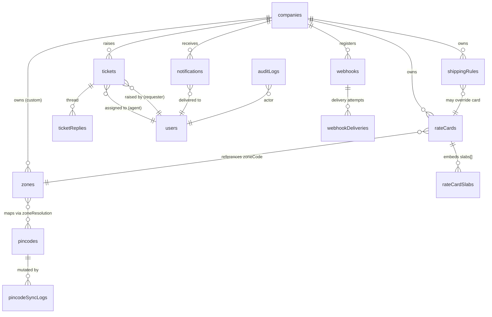
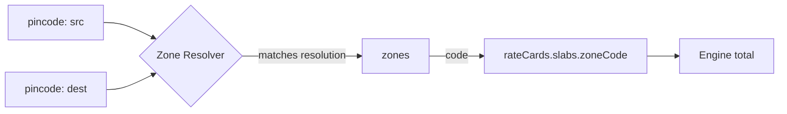
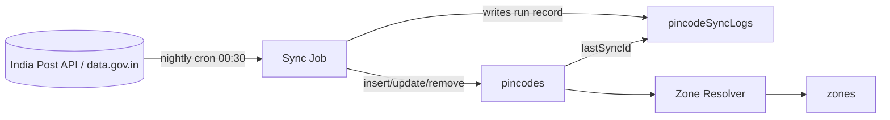
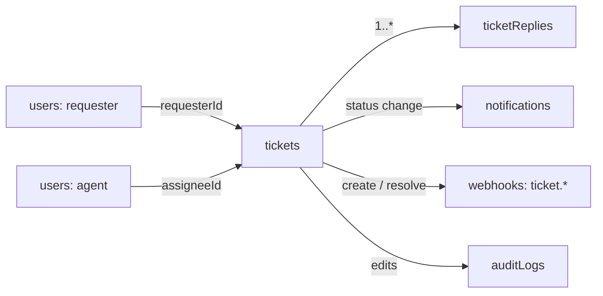
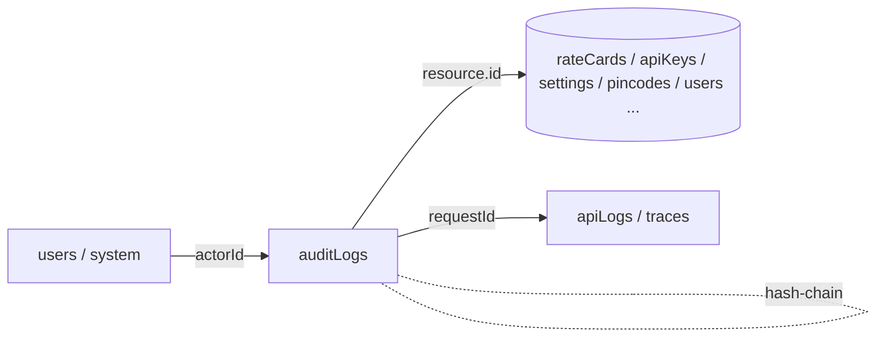
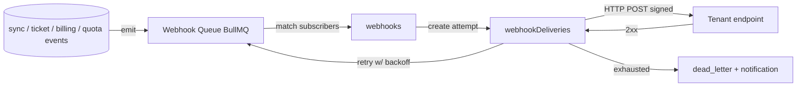

# MongoDB Data Model — Domain Collections

This document is the build-from reference for Postpin's **domain collections** — the data that powers the shipping engine, pincode intelligence, support, notifications, auditing and webhooks. It complements the platform/identity collections (`users`, `roles`, `permissions`, `companies`, `subscriptions`, `plans`, `apiKeys`, `apiLogs`, `coupons`, `settings`) documented in [14a-data-model-platform.md](14a-data-model-platform.md). For each collection below you get a precise field table, relationship map, index plan with rationale, a `$jsonSchema`-style validator, an India-specific sample document, and runnable aggregation pipelines. All money is INR, all pincodes are real, and every collection is multi-tenant: rows are scoped by `companyId` unless they are platform-global (`pincodes`, `zones`, `pincodeSyncLogs`, `auditLogs`).

> Conventions used throughout: `_id` is a Mongo `ObjectId`; timestamps are `Date` (UTC, stored as BSON date); money fields are integers in **paise** is *not* used — Postpin stores INR as `Decimal128` rupee amounts (e.g. `Decimal128("45.50")`) to avoid float drift; soft-deletes use `isDeleted`/`deletedAt`; every tenant-scoped document carries `companyId`. See [04-shipping-engine.md](04-shipping-engine.md) for how these collections are consumed at request time, and [05-pincode-sync.md](05-pincode-sync.md) for the India Post sync lifecycle.

## Contents

1. [Entity relationship overview](#entity-relationship-overview)
2. [rateCards](#ratecards)
3. [shippingRules](#shippingrules)
4. [zones](#zones)
5. [pincodes](#pincodes)
6. [pincodeSyncLogs](#pincodesynclogs)
7. [tickets](#tickets)
8. [ticketReplies](#ticketreplies)
9. [notifications](#notifications)
10. [auditLogs](#auditlogs)
11. [webhooks](#webhooks)
12. [Cross-collection index summary](#cross-collection-index-summary)
13. [Operational notes & conventions](#operational-notes--conventions)

---

## Entity relationship overview



The shipping engine reads `pincodes` -> `zones` -> `rateCards` -> `shippingRules` on every quote. Support (`tickets`/`ticketReplies`), `notifications`, `webhooks` and `auditLogs` are cross-cutting and touch every domain action. The two **global, un-tenanted** collections are `pincodes` and `zones` (the canonical India Post + zone map shared by all tenants); a tenant may layer *custom* zone groups on top via `rateCards.zoneOverrides`.

---

## rateCards

### Purpose

A **rate card** is the per-tenant pricing matrix the engine applies after it has resolved the chargeable weight and the origin->destination zone. Each card holds an ordered list of **weight slabs** per **zone**, plus the surcharge knobs (COD, fuel, remote-area, GST behaviour). A company can have many cards (e.g. one per courier/service level — "Surface", "Air", "Express") and exactly one is the **default** for a given `serviceLevel`. Cards are versioned and effective-dated so price changes are auditable and never retroactively alter historical quotes. See [03-rate-cards.md](03-rate-cards.md) and [04-shipping-engine.md](04-shipping-engine.md).

### Fields

| Field | Type | Required | Description |
|-------|------|----------|-------------|
| `_id` | ObjectId | yes | Primary key. |
| `companyId` | ObjectId | yes | Owning tenant. FK -> `companies._id`. |
| `name` | string | yes | Human label, e.g. `"Surface Standard FY26"`. |
| `code` | string | yes | Stable slug, unique per company, e.g. `"surface-std"`. |
| `serviceLevel` | string | yes | Enum: `surface` \| `air` \| `express` \| `same_day`. |
| `courierId` | ObjectId | no | Optional FK to a courier partner if multi-courier. |
| `currency` | string | yes | ISO 4217, always `"INR"` for v1. |
| `weightUnit` | string | yes | Enum: `kg` \| `g`. Slab thresholds use this unit. |
| `volumetricDivisor` | int | yes | Divisor for L×W×H (cm) -> kg. Default `5000`. |
| `slabs` | array<Slab> | yes | Ordered weight slabs per zone (see sub-schema). |
| `codCharge` | object | yes | `{ type: "flat"\|"percent"\|"max", flat: Decimal128, percent: Decimal128, min: Decimal128 }`. COD fee = `max(min, percent% of order, flat)` per `type`. |
| `fuelSurcharge` | object | yes | `{ enabled: bool, percent: Decimal128 }` applied on freight subtotal. |
| `remoteAreaSurcharge` | object | yes | `{ enabled: bool, flat: Decimal128, perKg: Decimal128 }` applied when destination pincode `isRemote=true`. |
| `gst` | object | yes | `{ enabled: bool, percent: Decimal128, mode: "inclusive"\|"exclusive" }`. Default `18.0`, exclusive. |
| `minCharge` | Decimal128 | yes | Floor charge after all slabs/surcharges. |
| `roundingMode` | string | yes | Enum: `none` \| `nearest` \| `ceil`. Applied to final amount. |
| `zoneOverrides` | array<object> | no | Tenant-custom zone grouping, e.g. merge `metro` into `within_state`. |
| `effectiveFrom` | Date | yes | Card becomes active at this instant. |
| `effectiveTo` | Date | no | Card expires; `null` = open-ended. |
| `isDefault` | bool | yes | True for the default card of its `serviceLevel`. Only one default per (company, serviceLevel). |
| `status` | string | yes | Enum: `draft` \| `active` \| `archived`. |
| `version` | int | yes | Monotonic version; bumped on every published edit. |
| `createdBy` | ObjectId | yes | FK -> `users._id`. |
| `createdAt` | Date | yes | Creation timestamp. |
| `updatedAt` | Date | yes | Last mutation timestamp. |
| `isDeleted` | bool | yes | Soft-delete flag. |

**`Slab` sub-document**

| Field | Type | Required | Description |
|-------|------|----------|-------------|
| `zoneCode` | string | yes | Zone key, e.g. `"within_city"`, `"metro"`, `"roi"`, `"ne_jk"`. Matches `zones.code`. |
| `fromWeight` | Decimal128 | yes | Lower bound (inclusive), in `weightUnit`. |
| `toWeight` | Decimal128 | no | Upper bound (inclusive); `null` = open top slab. |
| `baseCharge` | Decimal128 | yes | Charge for the first `stepWeight` of this slab. |
| `stepWeight` | Decimal128 | yes | Increment unit (e.g. `0.5` kg). |
| `stepCharge` | Decimal128 | yes | Charge per additional `stepWeight` beyond base. |

### Relationships

```mermaid
flowchart LR
    C[companies] -->|companyId| RC[rateCards]
    RC -->|slabs[].zoneCode| Z[zones.code]
    SR[shippingRules] -->|overrides| RC
    RC -->|consumed by| ENG[Shipping Engine]
    AL[auditLogs] -.records edits.-> RC
```

- One `companies` -> many `rateCards`.
- `slabs[].zoneCode` references `zones.code` (loose reference by code, not ObjectId, so global zone renames don't fan out).
- `shippingRules` can pin or override which card applies for a request (e.g. promotional flat rate).
- Every publish/edit emits an `auditLogs` entry.

### Indexes

| Index | Type | Rationale |
|-------|------|-----------|
| `{ companyId: 1, code: 1 }` unique (partial: `isDeleted:false`) | unique | Stable per-tenant card lookup; prevents duplicate codes. |
| `{ companyId: 1, serviceLevel: 1, isDefault: 1 }` | compound | Resolve the default card for a service level in O(1). |
| `{ companyId: 1, status: 1, effectiveFrom: -1 }` | compound | Pick the currently-active, most recent card. |
| `{ companyId: 1, "slabs.zoneCode": 1 }` | multikey | Find which cards reference a given zone (impact analysis on zone change). |
| `{ effectiveTo: 1 }` partial `{ effectiveTo: { $type: "date" } }` | TTL-adjacent | Background job archives expired cards. |

> Partial unique index expression: `{ partialFilterExpression: { isDeleted: false } }` so soft-deleted cards can reuse a `code`.

### Validation rules ($jsonSchema)

```json
{
  "$jsonSchema": {
    "bsonType": "object",
    "required": ["companyId", "name", "code", "serviceLevel", "currency",
                 "weightUnit", "volumetricDivisor", "slabs", "codCharge",
                 "fuelSurcharge", "remoteAreaSurcharge", "gst", "minCharge",
                 "roundingMode", "effectiveFrom", "isDefault", "status",
                 "version", "createdBy", "createdAt", "updatedAt", "isDeleted"],
    "properties": {
      "companyId": { "bsonType": "objectId" },
      "code": { "bsonType": "string", "pattern": "^[a-z0-9][a-z0-9-]{1,48}$" },
      "serviceLevel": { "enum": ["surface", "air", "express", "same_day"] },
      "currency": { "enum": ["INR"] },
      "weightUnit": { "enum": ["kg", "g"] },
      "volumetricDivisor": { "bsonType": "int", "minimum": 1 },
      "slabs": {
        "bsonType": "array", "minItems": 1,
        "items": {
          "bsonType": "object",
          "required": ["zoneCode", "fromWeight", "baseCharge", "stepWeight", "stepCharge"],
          "properties": {
            "zoneCode": { "bsonType": "string" },
            "fromWeight": { "bsonType": "decimal", "minimum": 0 },
            "toWeight": { "bsonType": ["decimal", "null"] },
            "baseCharge": { "bsonType": "decimal", "minimum": 0 },
            "stepWeight": { "bsonType": "decimal", "exclusiveMinimum": 0 },
            "stepCharge": { "bsonType": "decimal", "minimum": 0 }
          }
        }
      },
      "gst": {
        "bsonType": "object",
        "required": ["enabled", "percent", "mode"],
        "properties": {
          "enabled": { "bsonType": "bool" },
          "percent": { "bsonType": "decimal", "minimum": 0, "maximum": 100 },
          "mode": { "enum": ["inclusive", "exclusive"] }
        }
      },
      "roundingMode": { "enum": ["none", "nearest", "ceil"] },
      "status": { "enum": ["draft", "active", "archived"] },
      "version": { "bsonType": "int", "minimum": 1 },
      "isDefault": { "bsonType": "bool" },
      "isDeleted": { "bsonType": "bool" }
    }
  }
}
```

**Application-level invariants** (enforced in service layer, not expressible in `$jsonSchema`):

- Slabs for a given `zoneCode` must be contiguous and non-overlapping when sorted by `fromWeight`; exactly one open top slab (`toWeight: null`) per zone.
- At most one `isDefault: true` per `(companyId, serviceLevel)` — enforced by transaction + the compound index plus an app guard.
- `effectiveTo` (if set) must be `> effectiveFrom`.
- Publishing a `draft` -> `active` bumps `version` and writes an `auditLogs` record.

### Sample document

```json
{
  "_id": { "$oid": "6650a1f0c2a4b1e3f0a10001" },
  "companyId": { "$oid": "6640aa00c2a4b1e3f0a00001" },
  "name": "Surface Standard FY26",
  "code": "surface-std",
  "serviceLevel": "surface",
  "currency": "INR",
  "weightUnit": "kg",
  "volumetricDivisor": 5000,
  "slabs": [
    { "zoneCode": "within_city", "fromWeight": { "$numberDecimal": "0" }, "toWeight": { "$numberDecimal": "0.5" }, "baseCharge": { "$numberDecimal": "32.00" }, "stepWeight": { "$numberDecimal": "0.5" }, "stepCharge": { "$numberDecimal": "18.00" } },
    { "zoneCode": "within_city", "fromWeight": { "$numberDecimal": "0.5" }, "toWeight": null, "baseCharge": { "$numberDecimal": "50.00" }, "stepWeight": { "$numberDecimal": "0.5" }, "stepCharge": { "$numberDecimal": "18.00" } },
    { "zoneCode": "metro", "fromWeight": { "$numberDecimal": "0" }, "toWeight": { "$numberDecimal": "0.5" }, "baseCharge": { "$numberDecimal": "45.00" }, "stepWeight": { "$numberDecimal": "0.5" }, "stepCharge": { "$numberDecimal": "26.00" } },
    { "zoneCode": "roi", "fromWeight": { "$numberDecimal": "0" }, "toWeight": null, "baseCharge": { "$numberDecimal": "62.00" }, "stepWeight": { "$numberDecimal": "0.5" }, "stepCharge": { "$numberDecimal": "34.00" } },
    { "zoneCode": "ne_jk", "fromWeight": { "$numberDecimal": "0" }, "toWeight": null, "baseCharge": { "$numberDecimal": "95.00" }, "stepWeight": { "$numberDecimal": "0.5" }, "stepCharge": { "$numberDecimal": "52.00" } }
  ],
  "codCharge": { "type": "max", "flat": { "$numberDecimal": "35.00" }, "percent": { "$numberDecimal": "1.50" }, "min": { "$numberDecimal": "35.00" } },
  "fuelSurcharge": { "enabled": true, "percent": { "$numberDecimal": "8.00" } },
  "remoteAreaSurcharge": { "enabled": true, "flat": { "$numberDecimal": "40.00" }, "perKg": { "$numberDecimal": "10.00" } },
  "gst": { "enabled": true, "percent": { "$numberDecimal": "18.00" }, "mode": "exclusive" },
  "minCharge": { "$numberDecimal": "32.00" },
  "roundingMode": "ceil",
  "zoneOverrides": [],
  "effectiveFrom": { "$date": "2026-04-01T00:00:00Z" },
  "effectiveTo": null,
  "isDefault": true,
  "status": "active",
  "version": 3,
  "createdBy": { "$oid": "6640ab00c2a4b1e3f0a00010" },
  "createdAt": { "$date": "2026-03-25T06:14:00Z" },
  "updatedAt": { "$date": "2026-03-30T11:02:00Z" },
  "isDeleted": false
}
```

> **Worked quote:** Mumbai (400001) -> Pune (411001), actual 0.8 kg, box 30×20×10 cm. Volumetric = 30·20·10/5000 = 1.2 kg, so chargeable = max(0.8, 1.2) = **1.2 kg**. Both in Maharashtra metro pairing -> zone `metro`. Freight = base 45 + ceil((1.2−0.5)/0.5)=2 steps × 26 = 45 + 52 = **97.00**. COD (₹1,499 order) = max(35, 1.5% of 1499 = 22.49, 35) = **35.00**. Fuel 8% of 97 = 7.76. Subtotal = 97 + 35 + 7.76 = 139.76. GST 18% exclusive = 25.16. Total ≈ **₹164.92**, rounded ceil -> **₹165**.

### Aggregation examples

**A1 — Default active card per service level for a tenant (engine warm-load):**

```js
db.rateCards.aggregate([
  { $match: { companyId: ObjectId("6640aa00c2a4b1e3f0a00001"),
              status: "active", isDeleted: false,
              effectiveFrom: { $lte: new Date() },
              $or: [ { effectiveTo: null }, { effectiveTo: { $gt: new Date() } } ] } },
  { $sort: { isDefault: -1, effectiveFrom: -1 } },
  { $group: { _id: "$serviceLevel", card: { $first: "$$ROOT" } } }
])
```

**A2 — Price-spread report: cheapest top-slab base charge per zone across all of a tenant's cards (pricing audit):**

```js
db.rateCards.aggregate([
  { $match: { companyId: ObjectId("6640aa00c2a4b1e3f0a00001"), status: "active" } },
  { $unwind: "$slabs" },
  { $group: {
      _id: "$slabs.zoneCode",
      minBase: { $min: "$slabs.baseCharge" },
      maxBase: { $max: "$slabs.baseCharge" },
      cards:   { $addToSet: "$code" } } },
  { $sort: { _id: 1 } }
])
```

---

## shippingRules

### Purpose

`shippingRules` are tenant-defined **conditional overrides** layered on top of rate cards. They let a company do things the static card cannot: free shipping above ₹999, surcharge for fragile category, block COD to specific pincodes/zones, force a courier for heavy parcels, or apply a flat promotional rate during a campaign window. Rules are **priority-ordered** and evaluated in the engine after card resolution but before final totals. See [04-shipping-engine.md](04-shipping-engine.md) for evaluation order.

### Fields

| Field | Type | Required | Description |
|-------|------|----------|-------------|
| `_id` | ObjectId | yes | Primary key. |
| `companyId` | ObjectId | yes | Owning tenant. |
| `name` | string | yes | e.g. `"Free shipping over ₹999"`. |
| `description` | string | no | Operator-facing note. |
| `priority` | int | yes | Lower number = evaluated first. Ties broken by `createdAt`. |
| `enabled` | bool | yes | Master on/off. |
| `stopOnMatch` | bool | yes | If true, stop evaluating later rules once this matches. |
| `conditions` | object | yes | Condition tree (`all`/`any` of leaf predicates). |
| `actions` | array<Action> | yes | Effects applied when conditions match. |
| `effectiveFrom` | Date | no | Optional campaign start. |
| `effectiveTo` | Date | no | Optional campaign end. |
| `appliesToServiceLevels` | array<string> | no | Limit to specific service levels; empty = all. |
| `status` | string | yes | Enum: `draft` \| `active` \| `archived`. |
| `version` | int | yes | Edit version. |
| `createdBy` | ObjectId | yes | FK -> `users._id`. |
| `createdAt` | Date | yes | Created. |
| `updatedAt` | Date | yes | Updated. |
| `isDeleted` | bool | yes | Soft-delete. |

**Condition leaf predicates** (composable under `all`/`any`):

| Predicate | Example |
|-----------|---------|
| `orderValue` | `{ "field": "orderValue", "op": "gte", "value": 999 }` |
| `weight` | `{ "field": "chargeableWeight", "op": "gt", "value": 5 }` |
| `zoneCode` | `{ "field": "zoneCode", "op": "in", "value": ["ne_jk"] }` |
| `paymentType` | `{ "field": "paymentType", "op": "eq", "value": "COD" }` |
| `destState` | `{ "field": "destState", "op": "in", "value": ["Jammu and Kashmir"] }` |
| `category` | `{ "field": "category", "op": "eq", "value": "fragile" }` |

**Action types**: `set_flat_rate`, `add_surcharge`, `discount_percent`, `discount_flat`, `free_shipping`, `block` (reject quote with reason), `force_courier`, `waive_cod`.

### Relationships

- One `companies` -> many `shippingRules`.
- Rules may reference `rateCards.code` (via `force_card` action) and `zones.code` (in conditions). Loose references by code.
- A `block` action's rejection is logged to `apiLogs` (see platform doc) and may emit a `webhooks` event.

### Indexes

| Index | Type | Rationale |
|-------|------|-----------|
| `{ companyId: 1, enabled: 1, priority: 1 }` | compound | Load active rules in evaluation order in one indexed scan. |
| `{ companyId: 1, status: 1, effectiveFrom: 1, effectiveTo: 1 }` | compound | Campaign window filtering. |
| `{ companyId: 1, "conditions.predicates.field": 1 }` | multikey | Impact analysis: which rules touch `paymentType`/`zoneCode`. |

### Validation rules ($jsonSchema)

```json
{
  "$jsonSchema": {
    "bsonType": "object",
    "required": ["companyId", "name", "priority", "enabled", "stopOnMatch",
                 "conditions", "actions", "status", "version", "createdBy",
                 "createdAt", "updatedAt", "isDeleted"],
    "properties": {
      "priority": { "bsonType": "int", "minimum": 0, "maximum": 10000 },
      "enabled": { "bsonType": "bool" },
      "stopOnMatch": { "bsonType": "bool" },
      "conditions": {
        "bsonType": "object",
        "required": ["match", "predicates"],
        "properties": {
          "match": { "enum": ["all", "any"] },
          "predicates": {
            "bsonType": "array", "minItems": 1,
            "items": {
              "bsonType": "object",
              "required": ["field", "op", "value"],
              "properties": {
                "field": { "bsonType": "string" },
                "op": { "enum": ["eq","ne","gt","gte","lt","lte","in","nin"] }
              }
            }
          }
        }
      },
      "actions": {
        "bsonType": "array", "minItems": 1,
        "items": {
          "bsonType": "object",
          "required": ["type"],
          "properties": {
            "type": { "enum": ["set_flat_rate","add_surcharge","discount_percent",
                               "discount_flat","free_shipping","block",
                               "force_courier","force_card","waive_cod"] }
          }
        }
      },
      "status": { "enum": ["draft","active","archived"] },
      "isDeleted": { "bsonType": "bool" }
    }
  }
}
```

### Sample document

```json
{
  "_id": { "$oid": "6650b2a1c2a4b1e3f0a20001" },
  "companyId": { "$oid": "6640aa00c2a4b1e3f0a00001" },
  "name": "Free shipping over ₹999 (Prepaid, non-NE)",
  "description": "Promo for prepaid orders above ₹999, excludes North-East & J&K which keep paid shipping.",
  "priority": 10,
  "enabled": true,
  "stopOnMatch": true,
  "conditions": {
    "match": "all",
    "predicates": [
      { "field": "orderValue", "op": "gte", "value": { "$numberDecimal": "999.00" } },
      { "field": "paymentType", "op": "eq", "value": "Prepaid" },
      { "field": "zoneCode", "op": "nin", "value": ["ne_jk"] }
    ]
  },
  "actions": [ { "type": "free_shipping", "freightOnly": true } ],
  "effectiveFrom": { "$date": "2026-06-01T00:00:00Z" },
  "effectiveTo": { "$date": "2026-06-30T18:30:00Z" },
  "appliesToServiceLevels": ["surface", "express"],
  "status": "active",
  "version": 1,
  "createdBy": { "$oid": "6640ab00c2a4b1e3f0a00010" },
  "createdAt": { "$date": "2026-05-28T09:00:00Z" },
  "updatedAt": { "$date": "2026-05-28T09:00:00Z" },
  "isDeleted": false
}
```

### Aggregation examples

**B1 — Ordered active rule set for the engine right now:**

```js
db.shippingRules.aggregate([
  { $match: {
      companyId: ObjectId("6640aa00c2a4b1e3f0a00001"),
      enabled: true, status: "active",
      $and: [
        { $or: [ { effectiveFrom: null }, { effectiveFrom: { $lte: new Date() } } ] },
        { $or: [ { effectiveTo: null },   { effectiveTo:   { $gte: new Date() } } ] }
      ] } },
  { $sort: { priority: 1, createdAt: 1 } },
  { $project: { name: 1, priority: 1, conditions: 1, actions: 1, stopOnMatch: 1 } }
])
```

**B2 — Coverage audit: how many active rules block COD, grouped by targeted zone:**

```js
db.shippingRules.aggregate([
  { $match: { status: "active", "actions.type": { $in: ["block","waive_cod"] } } },
  { $unwind: "$conditions.predicates" },
  { $match: { "conditions.predicates.field": "zoneCode" } },
  { $unwind: "$conditions.predicates.value" },
  { $group: { _id: "$conditions.predicates.value", rules: { $sum: 1 },
              companies: { $addToSet: "$companyId" } } },
  { $sort: { rules: -1 } }
])
```

---

## zones

### Purpose

`zones` is the **canonical, platform-global** distance/region classification used to bucket an origin->destination pincode pair into a pricing band. India shipping pricing universally follows a 5-band model (intra-city, intra-state/metro, rest-of-country, special zones like North-East & J&K). Postpin ships a default global zone map and lets tenants remap via `rateCards.zoneOverrides`. A zone is *not* a single pincode; it is the **resolved relationship** between source and destination. See [02-zones.md](02-zones.md).

### Fields

| Field | Type | Required | Description |
|-------|------|----------|-------------|
| `_id` | ObjectId | yes | Primary key. |
| `code` | string | yes | Stable zone key, globally unique. e.g. `within_city`, `within_state`, `metro`, `roi`, `ne_jk`. |
| `name` | string | yes | Display name, e.g. `"Rest of India"`. |
| `tier` | int | yes | Ordinal 1..5; higher tier = farther/costlier band. |
| `description` | string | no | Operator note. |
| `resolution` | object | yes | How a (src,dest) pair maps here. See sub-schema. |
| `slaDays` | object | yes | `{ min: int, max: int }` indicative transit days. |
| `isSpecial` | bool | yes | True for surcharge-prone bands (NE/J&K/islands). |
| `isActive` | bool | yes | Toggle without delete. |
| `metadata` | object | no | Free-form (e.g. `{ "states": ["Assam","Manipur"] }`). |
| `createdAt` | Date | yes | Created. |
| `updatedAt` | Date | yes | Updated. |

**`resolution` sub-document** (declarative matcher used by the zone resolver):

| Field | Type | Description |
|-------|------|-------------|
| `srcScope` | string | `any` \| `same_city` \| `same_state` \| `state_in` |
| `destScope` | string | `any` \| `same_city` \| `same_state` \| `state_in` |
| `states` | array<string> | Used when scope is `state_in` (e.g. NE states). |
| `metroPair` | bool | Both endpoints flagged `isMetro` -> `metro` zone. |
| `priority` | int | Resolver evaluates zones by ascending priority; first match wins. |

### Relationships



- `zones.code` is referenced by `rateCards.slabs[].zoneCode` and `shippingRules` conditions.
- Zone resolution consumes `pincodes` (city, state, isMetro, isRemote) for both endpoints.

### Indexes

| Index | Type | Rationale |
|-------|------|-----------|
| `{ code: 1 }` unique | unique | Primary lookup by zone key; referenced everywhere by code. |
| `{ "resolution.priority": 1, isActive: 1 }` | compound | Resolver iterates active zones in priority order. |
| `{ tier: 1 }` | single | Reporting / sorting bands by distance band. |
| `{ "resolution.states": 1 }` | multikey | Find zones that special-case a given state. |

### Validation rules ($jsonSchema)

```json
{
  "$jsonSchema": {
    "bsonType": "object",
    "required": ["code", "name", "tier", "resolution", "slaDays",
                 "isSpecial", "isActive", "createdAt", "updatedAt"],
    "properties": {
      "code": { "bsonType": "string", "pattern": "^[a-z][a-z0-9_]{1,30}$" },
      "tier": { "bsonType": "int", "minimum": 1, "maximum": 5 },
      "resolution": {
        "bsonType": "object",
        "required": ["srcScope", "destScope", "priority"],
        "properties": {
          "srcScope":  { "enum": ["any","same_city","same_state","state_in"] },
          "destScope": { "enum": ["any","same_city","same_state","state_in"] },
          "metroPair": { "bsonType": "bool" },
          "priority":  { "bsonType": "int", "minimum": 0 }
        }
      },
      "slaDays": {
        "bsonType": "object", "required": ["min","max"],
        "properties": { "min": { "bsonType": "int", "minimum": 0 },
                        "max": { "bsonType": "int", "minimum": 0 } }
      },
      "isSpecial": { "bsonType": "bool" },
      "isActive": { "bsonType": "bool" }
    }
  }
}
```

### Sample documents

```json
[
  {
    "_id": { "$oid": "6650c3b2c2a4b1e3f0a30001" },
    "code": "within_city",
    "name": "Within City",
    "tier": 1,
    "description": "Same city / local delivery.",
    "resolution": { "srcScope": "same_city", "destScope": "same_city", "metroPair": false, "priority": 10 },
    "slaDays": { "min": 1, "max": 2 },
    "isSpecial": false,
    "isActive": true,
    "metadata": {},
    "createdAt": { "$date": "2026-01-01T00:00:00Z" },
    "updatedAt": { "$date": "2026-01-01T00:00:00Z" }
  },
  {
    "_id": { "$oid": "6650c3b2c2a4b1e3f0a30005" },
    "code": "ne_jk",
    "name": "North-East, J&K & Special Areas",
    "tier": 5,
    "description": "Surcharge-prone special zone.",
    "resolution": {
      "srcScope": "any", "destScope": "state_in",
      "states": ["Assam","Arunachal Pradesh","Manipur","Meghalaya","Mizoram",
                 "Nagaland","Tripura","Sikkim","Jammu and Kashmir","Ladakh"],
      "metroPair": false, "priority": 5
    },
    "slaDays": { "min": 4, "max": 9 },
    "isSpecial": true,
    "isActive": true,
    "metadata": { "surchargeReason": "remote-difficult-terrain" },
    "createdAt": { "$date": "2026-01-01T00:00:00Z" },
    "updatedAt": { "$date": "2026-01-01T00:00:00Z" }
  }
]
```

> Note `ne_jk` carries the **lowest** `priority` (5) so the resolver checks the special zone *before* falling through to `roi` (rest-of-India). First match wins.

### Aggregation examples

**C1 — Zone catalogue ordered as the resolver sees it:**

```js
db.zones.aggregate([
  { $match: { isActive: true } },
  { $sort: { "resolution.priority": 1 } },
  { $project: { code: 1, name: 1, tier: 1, isSpecial: 1,
                slaDays: 1, priority: "$resolution.priority" } }
])
```

**C2 — Which special states are covered by any active special zone (gap check):**

```js
db.zones.aggregate([
  { $match: { isSpecial: true, isActive: true } },
  { $unwind: "$resolution.states" },
  { $group: { _id: null, coveredStates: { $addToSet: "$resolution.states" } } }
])
```

---

## pincodes

### Purpose

`pincodes` is the **single source of truth** for Indian postal geography, kept fresh by the nightly India Post sync (see [05-pincode-sync.md](05-pincode-sync.md)). Every quote resolves both origin and destination against this collection to obtain city, district, state, serviceability, metro/remote flags and geo-coordinates that feed the zone resolver. It is platform-global (shared by all tenants). Source data: `api.postalpincode.in` and the All-India Pincode Directory on `data.gov.in`.

### Fields

| Field | Type | Required | Description |
|-------|------|----------|-------------|
| `_id` | ObjectId | yes | Primary key. |
| `pincode` | string | yes | 6-digit PIN, e.g. `"110001"`. Unique. |
| `officeName` | string | yes | Post office name, e.g. `"Connaught Place S.O"`. |
| `officeType` | string | no | `BO` (Branch) \| `SO` (Sub) \| `HO` (Head). |
| `district` | string | yes | e.g. `"Central Delhi"`. |
| `stateCode` | string | yes | 2-letter, e.g. `"DL"`, `"MH"`. |
| `state` | string | yes | e.g. `"Delhi"`, `"Maharashtra"`. |
| `city` | string | no | Normalized city/taluk name. |
| `region` | string | no | India Post region. |
| `circle` | string | no | India Post postal circle. |
| `country` | string | yes | Always `"India"`. |
| `lat` | double | no | Latitude (WGS84). |
| `lng` | double | no | Longitude (WGS84). |
| `location` | object | no | GeoJSON `{ type: "Point", coordinates: [lng, lat] }` for `2dsphere`. |
| `isMetro` | bool | yes | True for the 8 metro cities (for `metro` zone). |
| `isRemote` | bool | yes | True if remote-area surcharge applies. |
| `serviceable` | object | yes | `{ prepaid: bool, cod: bool, pickup: bool }`. |
| `defaultZoneHint` | string | no | Optional precomputed zone hint for self-pairs. |
| `aliases` | array<string> | no | Alternate names (helps fuzzy lookup). |
| `source` | string | yes | `india_post` \| `data_gov` \| `manual` \| `csv_import`. |
| `status` | string | yes | `active` \| `removed` (soft-removed by sync). |
| `lastSyncId` | ObjectId | no | FK -> `pincodeSyncLogs._id` of last touch. |
| `version` | int | yes | Bumped each time the sync updates the row. |
| `createdAt` | Date | yes | First seen. |
| `updatedAt` | Date | yes | Last mutation. |

### Relationships



- `pincodes.lastSyncId` -> `pincodeSyncLogs._id`.
- Consumed by the zone resolver and the engine (serviceability gate, remote/metro flags).

### Indexes

| Index | Type | Rationale |
|-------|------|-----------|
| `{ pincode: 1 }` unique | unique | The canonical lookup; one row per PIN. **Hot path** — every quote hits this twice. |
| `{ stateCode: 1, district: 1 }` | compound | Reporting & admin filtering by region. |
| `{ location: "2dsphere" }` | geo | Nearest-serviceable-PIN, geo analytics, "did you mean" lookups. |
| `{ status: 1, updatedAt: -1 }` | compound | Sync diffing & "recently changed" admin views. |
| `{ city: "text", officeName: "text", aliases: "text" }` | text | Admin free-text search ("find PINs for Bandra"). |
| `{ isMetro: 1, isRemote: 1 }` | compound | Fast bulk filters for surcharge/zone batch jobs. |

> The `{ pincode: 1 }` index must stay in RAM; with ~155k Indian PINs it is tiny (<10 MB) — pin it via Redis cache layer too (see [04-shipping-engine.md](04-shipping-engine.md)). Geocoordinates are optional; rows without `location` simply skip the geo index (sparse behaviour via partial index `{ location: { $exists: true } }`).

### Validation rules ($jsonSchema)

```json
{
  "$jsonSchema": {
    "bsonType": "object",
    "required": ["pincode", "officeName", "district", "stateCode", "state",
                 "country", "isMetro", "isRemote", "serviceable", "source",
                 "status", "version", "createdAt", "updatedAt"],
    "properties": {
      "pincode":   { "bsonType": "string", "pattern": "^[1-9][0-9]{5}$" },
      "stateCode": { "bsonType": "string", "pattern": "^[A-Z]{2}$" },
      "country":   { "enum": ["India"] },
      "lat": { "bsonType": ["double","null"], "minimum": 6.0,  "maximum": 38.0 },
      "lng": { "bsonType": ["double","null"], "minimum": 68.0, "maximum": 98.0 },
      "location": {
        "bsonType": ["object","null"],
        "required": ["type","coordinates"],
        "properties": {
          "type": { "enum": ["Point"] },
          "coordinates": { "bsonType": "array", "minItems": 2, "maxItems": 2,
                           "items": { "bsonType": "double" } }
        }
      },
      "serviceable": {
        "bsonType": "object",
        "required": ["prepaid","cod","pickup"],
        "properties": {
          "prepaid": { "bsonType": "bool" },
          "cod": { "bsonType": "bool" },
          "pickup": { "bsonType": "bool" }
        }
      },
      "isMetro":  { "bsonType": "bool" },
      "isRemote": { "bsonType": "bool" },
      "source": { "enum": ["india_post","data_gov","manual","csv_import"] },
      "status": { "enum": ["active","removed"] },
      "version": { "bsonType": "int", "minimum": 1 }
    }
  }
}
```

### Sample documents

```json
[
  {
    "_id": { "$oid": "6650d4c3c2a4b1e3f0a40001" },
    "pincode": "110001",
    "officeName": "Connaught Place S.O",
    "officeType": "SO",
    "district": "Central Delhi",
    "stateCode": "DL",
    "state": "Delhi",
    "city": "New Delhi",
    "region": "Delhi",
    "circle": "Delhi",
    "country": "India",
    "lat": 28.6315, "lng": 77.2167,
    "location": { "type": "Point", "coordinates": [77.2167, 28.6315] },
    "isMetro": true,
    "isRemote": false,
    "serviceable": { "prepaid": true, "cod": true, "pickup": true },
    "defaultZoneHint": "within_city",
    "aliases": ["CP", "Rajiv Chowk"],
    "source": "india_post",
    "status": "active",
    "lastSyncId": { "$oid": "6650f0e0c2a4b1e3f0a50012" },
    "version": 14,
    "createdAt": { "$date": "2025-02-10T00:31:00Z" },
    "updatedAt": { "$date": "2026-06-26T00:31:42Z" }
  },
  {
    "_id": { "$oid": "6650d4c3c2a4b1e3f0a40002" },
    "pincode": "400001",
    "officeName": "Mumbai G.P.O.",
    "officeType": "HO",
    "district": "Mumbai",
    "stateCode": "MH",
    "state": "Maharashtra",
    "city": "Mumbai",
    "region": "Mumbai",
    "circle": "Maharashtra",
    "country": "India",
    "lat": 18.9389, "lng": 72.8355,
    "location": { "type": "Point", "coordinates": [72.8355, 18.9389] },
    "isMetro": true,
    "isRemote": false,
    "serviceable": { "prepaid": true, "cod": true, "pickup": true },
    "defaultZoneHint": "within_city",
    "aliases": ["Fort", "GPO"],
    "source": "india_post",
    "status": "active",
    "lastSyncId": { "$oid": "6650f0e0c2a4b1e3f0a50012" },
    "version": 9,
    "createdAt": { "$date": "2025-02-10T00:31:00Z" },
    "updatedAt": { "$date": "2026-06-26T00:31:42Z" }
  },
  {
    "_id": { "$oid": "6650d4c3c2a4b1e3f0a40003" },
    "pincode": "797001",
    "officeName": "Kohima H.O",
    "officeType": "HO",
    "district": "Kohima",
    "stateCode": "NL",
    "state": "Nagaland",
    "city": "Kohima",
    "region": "Nagaland",
    "circle": "North East",
    "country": "India",
    "lat": 25.6751, "lng": 94.1086,
    "location": { "type": "Point", "coordinates": [94.1086, 25.6751] },
    "isMetro": false,
    "isRemote": true,
    "serviceable": { "prepaid": true, "cod": false, "pickup": true },
    "aliases": [],
    "source": "india_post",
    "status": "active",
    "lastSyncId": { "$oid": "6650f0e0c2a4b1e3f0a50012" },
    "version": 6,
    "createdAt": { "$date": "2025-02-10T00:31:00Z" },
    "updatedAt": { "$date": "2026-06-26T00:31:42Z" }
  }
]
```

### Aggregation examples

**D1 — PIN counts by state and serviceability (admin coverage dashboard):**

```js
db.pincodes.aggregate([
  { $match: { status: "active" } },
  { $group: {
      _id: "$state",
      total:       { $sum: 1 },
      codEnabled:  { $sum: { $cond: ["$serviceable.cod", 1, 0] } },
      remote:      { $sum: { $cond: ["$isRemote", 1, 0] } },
      metro:       { $sum: { $cond: ["$isMetro", 1, 0] } } } },
  { $addFields: { codCoveragePct: {
      $round: [ { $multiply: [ { $divide: ["$codEnabled","$total"] }, 100 ] }, 1 ] } } },
  { $sort: { total: -1 } }
])
```

**D2 — Nearest serviceable PIN to a dropped delivery point (geo fallback):**

```js
db.pincodes.aggregate([
  { $geoNear: {
      near: { type: "Point", coordinates: [77.2295, 28.6129] },  // India Gate
      distanceField: "distMeters",
      maxDistance: 8000,
      query: { status: "active", "serviceable.pickup": true },
      spherical: true } },
  { $limit: 5 },
  { $project: { pincode: 1, officeName: 1, distMeters: { $round: ["$distMeters", 0] } } }
])
```

---

## pincodeSyncLogs

### Purpose

Each run of the India Post sync (nightly cron at **00:30 IST**, plus manual/CSV runs) writes exactly one `pincodeSyncLogs` document capturing what changed and whether it succeeded. This is the audit and health backbone for the most important module: it powers the admin tiles (Total Pincodes, Last Sync, New, Updated, Deleted, Failed, Sync Status), the run history table, and **rollback** (each run snapshots the diff so it can be reverted). See [05-pincode-sync.md](05-pincode-sync.md).

### Fields

| Field | Type | Required | Description |
|-------|------|----------|-------------|
| `_id` | ObjectId | yes | Primary key (the "Sync ID" shown in UI). |
| `trigger` | string | yes | `cron` \| `manual` \| `csv_import` \| `webhook` \| `rollback`. |
| `triggeredBy` | ObjectId | no | FK -> `users._id` for manual/CSV runs; null for cron. |
| `source` | string | yes | `india_post` \| `data_gov` \| `csv`. |
| `endpoint` | string | no | Resolved India Post endpoint used (from settings). |
| `status` | string | yes | `running` \| `success` \| `partial` \| `failed` \| `rolled_back`. |
| `startedAt` | Date | yes | Run start. |
| `endedAt` | Date | no | Run end; null while running. |
| `durationMs` | int | no | `endedAt - startedAt`. |
| `counts` | object | yes | `{ scanned, inserted, updated, removed, unchanged, failed }`. |
| `failedRecords` | array<object> | no | Bounded sample (cap 100) of `{ pincode, reason }`. |
| `retryCount` | int | yes | Attempts consumed (from settings retry policy). |
| `timeoutMs` | int | no | Per-request timeout applied this run. |
| `rollbackOf` | ObjectId | no | If `trigger=rollback`, the sync this reverts. |
| `snapshotRef` | string | no | Pointer (e.g. S3/GridFS key) to the pre-change diff for rollback. |
| `errorSummary` | string | no | Top-line failure message when `failed`. |
| `notifiedEmail` | bool | yes | Whether the configured notification email was sent. |
| `webhookDelivered` | bool | yes | Whether the sync webhook fired. |
| `createdAt` | Date | yes | Record creation (== startedAt). |

### Relationships

- `triggeredBy` -> `users._id`.
- `pincodes.lastSyncId` -> this collection (which run last touched a PIN).
- `rollbackOf` -> another `pincodeSyncLogs._id`.
- Drives a `notifications` row and may fire a `webhooks` event of type `pincode.sync.completed`.

### Indexes

| Index | Type | Rationale |
|-------|------|-----------|
| `{ startedAt: -1 }` | single | Run history table, "Last Sync" tile — the dominant query. |
| `{ status: 1, startedAt: -1 }` | compound | Filter failed/partial runs for alerting. |
| `{ trigger: 1, startedAt: -1 }` | compound | Separate cron vs manual history. |
| `{ rollbackOf: 1 }` | single | Trace rollback chains. |
| `{ startedAt: 1 }` TTL (e.g. 365 days) | TTL | Auto-expire old run logs; keep monthly rollups elsewhere. |

> Keep raw logs ~12 months via TTL; long-term sync-health trends live in a small `pincodeSyncDaily` rollup (out of scope here) so the TTL never erases reporting history.

### Validation rules ($jsonSchema)

```json
{
  "$jsonSchema": {
    "bsonType": "object",
    "required": ["trigger", "source", "status", "startedAt", "counts",
                 "retryCount", "notifiedEmail", "webhookDelivered", "createdAt"],
    "properties": {
      "trigger": { "enum": ["cron","manual","csv_import","webhook","rollback"] },
      "source":  { "enum": ["india_post","data_gov","csv"] },
      "status":  { "enum": ["running","success","partial","failed","rolled_back"] },
      "counts": {
        "bsonType": "object",
        "required": ["scanned","inserted","updated","removed","unchanged","failed"],
        "properties": {
          "scanned":   { "bsonType": "int", "minimum": 0 },
          "inserted":  { "bsonType": "int", "minimum": 0 },
          "updated":   { "bsonType": "int", "minimum": 0 },
          "removed":   { "bsonType": "int", "minimum": 0 },
          "unchanged": { "bsonType": "int", "minimum": 0 },
          "failed":    { "bsonType": "int", "minimum": 0 }
        }
      },
      "failedRecords": {
        "bsonType": "array", "maxItems": 100,
        "items": { "bsonType": "object", "required": ["pincode","reason"] }
      },
      "retryCount": { "bsonType": "int", "minimum": 0 },
      "notifiedEmail": { "bsonType": "bool" },
      "webhookDelivered": { "bsonType": "bool" }
    }
  }
}
```

### Sample documents

```json
[
  {
    "_id": { "$oid": "6650f0e0c2a4b1e3f0a50012" },
    "trigger": "cron",
    "triggeredBy": null,
    "source": "india_post",
    "endpoint": "https://api.postalpincode.in/pincode",
    "status": "success",
    "startedAt": { "$date": "2026-06-26T00:30:00Z" },
    "endedAt":   { "$date": "2026-06-26T00:34:18Z" },
    "durationMs": 258000,
    "counts": { "scanned": 154797, "inserted": 12, "updated": 134,
                "removed": 3, "unchanged": 154648, "failed": 0 },
    "failedRecords": [],
    "retryCount": 0,
    "timeoutMs": 15000,
    "rollbackOf": null,
    "snapshotRef": "syncsnap/2026-06-26/6650f0e0.diff.json.gz",
    "errorSummary": null,
    "notifiedEmail": true,
    "webhookDelivered": true,
    "createdAt": { "$date": "2026-06-26T00:30:00Z" }
  },
  {
    "_id": { "$oid": "664fc9d0c2a4b1e3f0a50009" },
    "trigger": "manual",
    "triggeredBy": { "$oid": "6640ab00c2a4b1e3f0a00002" },
    "source": "india_post",
    "endpoint": "https://api.postalpincode.in/pincode",
    "status": "partial",
    "startedAt": { "$date": "2026-06-23T11:05:00Z" },
    "endedAt":   { "$date": "2026-06-23T11:12:40Z" },
    "durationMs": 460000,
    "counts": { "scanned": 154780, "inserted": 0, "updated": 51,
                "removed": 0, "unchanged": 154700, "failed": 29 },
    "failedRecords": [
      { "pincode": "190001", "reason": "upstream 504 after 3 retries" },
      { "pincode": "194101", "reason": "malformed payload: missing District" }
    ],
    "retryCount": 3,
    "timeoutMs": 15000,
    "rollbackOf": null,
    "snapshotRef": "syncsnap/2026-06-23/664fc9d0.diff.json.gz",
    "errorSummary": "29 records failed (upstream timeouts in J&K circle)",
    "notifiedEmail": true,
    "webhookDelivered": true,
    "createdAt": { "$date": "2026-06-23T11:05:00Z" }
  }
]
```

### Aggregation examples

**E1 — Last-30-day sync health (powers the admin trend chart):**

```js
db.pincodeSyncLogs.aggregate([
  { $match: { startedAt: { $gte: new Date(Date.now() - 30*864e5) } } },
  { $group: {
      _id: { day: { $dateToString: { format: "%Y-%m-%d", date: "$startedAt",
                                      timezone: "Asia/Kolkata" } } },
      runs:        { $sum: 1 },
      successes:   { $sum: { $cond: [ { $eq: ["$status","success"] }, 1, 0 ] } },
      failures:    { $sum: { $cond: [ { $in: ["$status", ["failed","partial"]] }, 1, 0 ] } },
      totalFailed: { $sum: "$counts.failed" },
      inserted:    { $sum: "$counts.inserted" },
      updated:     { $sum: "$counts.updated" },
      removed:     { $sum: "$counts.removed" },
      avgDurMs:    { $avg: "$durationMs" } } },
  { $sort: { "_id.day": 1 } }
])
```

**E2 — Latest run summary for the dashboard tiles (single doc):**

```js
db.pincodeSyncLogs.aggregate([
  { $sort: { startedAt: -1 } },
  { $limit: 1 },
  { $project: {
      lastSync: "$startedAt", status: 1,
      newC: "$counts.inserted", updatedC: "$counts.updated",
      deletedC: "$counts.removed", failedC: "$counts.failed",
      durationSec: { $round: [ { $divide: ["$durationMs", 1000] }, 0 ] } } }
])
```

---

## tickets

### Purpose

`tickets` backs the support center across the User Dashboard and Super Admin portal. A ticket is a tenant-scoped support request with a lifecycle, SLA timers, priority, category and an embedded first message; the back-and-forth thread lives in `ticketReplies`. Tickets feed agent queues, SLA breach reports and customer notifications. See [10-support.md](10-support.md).

### Fields

| Field | Type | Required | Description |
|-------|------|----------|-------------|
| `_id` | ObjectId | yes | Primary key. |
| `ticketNumber` | string | yes | Human ref, e.g. `"PP-2026-004821"`. Unique. |
| `companyId` | ObjectId | yes | Owning tenant. |
| `requesterId` | ObjectId | yes | FK -> `users._id` who raised it. |
| `subject` | string | yes | Short title. |
| `body` | string | yes | First message (markdown allowed). |
| `category` | string | yes | `billing` \| `api` \| `pincode` \| `rate_card` \| `account` \| `bug` \| `other`. |
| `priority` | string | yes | `low` \| `normal` \| `high` \| `urgent`. |
| `status` | string | yes | `open` \| `pending` \| `on_hold` \| `resolved` \| `closed`. |
| `assigneeId` | ObjectId | no | FK -> `users._id` (support agent). |
| `tags` | array<string> | no | Free tags, e.g. `["cod","jk"]`. |
| `attachments` | array<object> | no | `{ name, url, sizeBytes, mime }`. |
| `sla` | object | yes | `{ policy, firstResponseDueAt, resolutionDueAt, firstRespondedAt, frBreached, resBreached }`. |
| `channel` | string | yes | `portal` \| `email` \| `api`. |
| `lastReplyAt` | Date | no | Timestamp of latest reply (denormalized). |
| `lastReplyBy` | string | no | `requester` \| `agent`. |
| `replyCount` | int | yes | Denormalized count of `ticketReplies`. |
| `reopenCount` | int | yes | Times reopened after resolve. |
| `csatScore` | int | no | 1..5 satisfaction after close. |
| `closedAt` | Date | no | When closed. |
| `createdAt` | Date | yes | Created. |
| `updatedAt` | Date | yes | Updated. |
| `isDeleted` | bool | yes | Soft-delete. |

### Relationships



- One `tickets` -> many `ticketReplies`.
- `requesterId` and `assigneeId` -> `users`.
- State transitions emit `notifications` and `webhooks` (`ticket.created`, `ticket.replied`, `ticket.resolved`).

### Indexes

| Index | Type | Rationale |
|-------|------|-----------|
| `{ ticketNumber: 1 }` unique | unique | Human-ref lookup, dedupe. |
| `{ companyId: 1, status: 1, updatedAt: -1 }` | compound | Tenant ticket list, default sort. |
| `{ assigneeId: 1, status: 1, "sla.resolutionDueAt": 1 }` | compound | Agent queue ordered by SLA urgency. |
| `{ companyId: 1, priority: 1, status: 1 }` | compound | Priority filtering in admin. |
| `{ "sla.frBreached": 1, "sla.resBreached": 1, status: 1 }` | compound | SLA breach reports. |
| `{ subject: "text", body: "text", tags: "text" }` | text | Free-text search across tickets. |
| `{ createdAt: -1 }` | single | Global recent feed (super admin). |

### Validation rules ($jsonSchema)

```json
{
  "$jsonSchema": {
    "bsonType": "object",
    "required": ["ticketNumber","companyId","requesterId","subject","body",
                 "category","priority","status","sla","channel","replyCount",
                 "reopenCount","createdAt","updatedAt","isDeleted"],
    "properties": {
      "ticketNumber": { "bsonType": "string", "pattern": "^PP-[0-9]{4}-[0-9]{6}$" },
      "category": { "enum": ["billing","api","pincode","rate_card","account","bug","other"] },
      "priority": { "enum": ["low","normal","high","urgent"] },
      "status":   { "enum": ["open","pending","on_hold","resolved","closed"] },
      "channel":  { "enum": ["portal","email","api"] },
      "sla": {
        "bsonType": "object",
        "required": ["policy","firstResponseDueAt","resolutionDueAt","frBreached","resBreached"],
        "properties": {
          "policy": { "bsonType": "string" },
          "frBreached":  { "bsonType": "bool" },
          "resBreached": { "bsonType": "bool" }
        }
      },
      "csatScore": { "bsonType": ["int","null"], "minimum": 1, "maximum": 5 },
      "replyCount": { "bsonType": "int", "minimum": 0 },
      "reopenCount": { "bsonType": "int", "minimum": 0 },
      "isDeleted": { "bsonType": "bool" }
    }
  }
}
```

### Sample document

```json
{
  "_id": { "$oid": "6651a000c2a4b1e3f0a60001" },
  "ticketNumber": "PP-2026-004821",
  "companyId": { "$oid": "6640aa00c2a4b1e3f0a00001" },
  "requesterId": { "$oid": "6640ab00c2a4b1e3f0a00021" },
  "subject": "COD not available for 797001 (Kohima) via API",
  "body": "Our checkout shows COD blocked for delivery PIN 797001 even though our plan allows COD. Is this a serviceability flag on your side?",
  "category": "pincode",
  "priority": "high",
  "status": "pending",
  "assigneeId": { "$oid": "6640ab00c2a4b1e3f0a00007" },
  "tags": ["cod", "serviceability", "north-east"],
  "attachments": [
    { "name": "api-response.json", "url": "https://files.postpin.in/t/4821/api-response.json", "sizeBytes": 1843, "mime": "application/json" }
  ],
  "sla": {
    "policy": "standard-business",
    "firstResponseDueAt": { "$date": "2026-06-26T14:00:00Z" },
    "resolutionDueAt":    { "$date": "2026-06-29T14:00:00Z" },
    "firstRespondedAt":   { "$date": "2026-06-26T09:48:00Z" },
    "frBreached": false,
    "resBreached": false
  },
  "channel": "portal",
  "lastReplyAt": { "$date": "2026-06-26T09:48:00Z" },
  "lastReplyBy": "agent",
  "replyCount": 1,
  "reopenCount": 0,
  "csatScore": null,
  "closedAt": null,
  "createdAt": { "$date": "2026-06-26T08:12:00Z" },
  "updatedAt": { "$date": "2026-06-26T09:48:00Z" },
  "isDeleted": false
}
```

### Aggregation examples

**F1 — SLA breach report for the last 30 days (admin):**

```js
db.tickets.aggregate([
  { $match: { createdAt: { $gte: new Date(Date.now() - 30*864e5) }, isDeleted: false } },
  { $group: {
      _id: "$companyId",
      total:       { $sum: 1 },
      frBreaches:  { $sum: { $cond: ["$sla.frBreached", 1, 0] } },
      resBreaches: { $sum: { $cond: ["$sla.resBreached", 1, 0] } },
      avgReplies:  { $avg: "$replyCount" } } },
  { $addFields: { frBreachPct: {
      $round: [ { $multiply: [ { $divide: ["$frBreaches", "$total"] }, 100 ] }, 1 ] } } },
  { $sort: { resBreaches: -1 } }
])
```

**F2 — Agent workload & open backlog by priority:**

```js
db.tickets.aggregate([
  { $match: { status: { $in: ["open","pending","on_hold"] }, isDeleted: false } },
  { $group: {
      _id: { agent: "$assigneeId", priority: "$priority" },
      open: { $sum: 1 },
      oldest: { $min: "$createdAt" } } },
  { $sort: { "_id.agent": 1, "_id.priority": 1 } }
])
```

---

## ticketReplies

### Purpose

`ticketReplies` is the **thread** of a ticket — every customer message, agent response and internal note after the opening `tickets.body`. Kept in its own collection (not embedded) because threads grow unbounded and we want to page/index replies independently and attach per-reply metadata (internal notes, email message-ids for threading). See [10-support.md](10-support.md).

### Fields

| Field | Type | Required | Description |
|-------|------|----------|-------------|
| `_id` | ObjectId | yes | Primary key. |
| `ticketId` | ObjectId | yes | FK -> `tickets._id`. |
| `companyId` | ObjectId | yes | Denormalized tenant for scoping/indexing. |
| `authorId` | ObjectId | yes | FK -> `users._id`. |
| `authorRole` | string | yes | `requester` \| `agent` \| `system`. |
| `body` | string | yes | Message (markdown). |
| `isInternal` | bool | yes | True = private agent note, hidden from customer. |
| `attachments` | array<object> | no | `{ name, url, sizeBytes, mime }`. |
| `emailMessageId` | string | no | RFC 5322 Message-ID for email threading. |
| `statusChange` | object | no | `{ from, to }` if this reply changed status. |
| `deliveredVia` | array<string> | no | `["email","portal"]` channels the reply was pushed to. |
| `createdAt` | Date | yes | Sent. |
| `editedAt` | Date | no | Last edit (agents may edit notes). |
| `isDeleted` | bool | yes | Soft-delete. |

### Relationships

- Many `ticketReplies` -> one `tickets`.
- `authorId` -> `users`.
- Creating a non-internal reply bumps `tickets.replyCount`, `lastReplyAt`, `lastReplyBy`, may set `sla.firstRespondedAt`, and triggers a `notifications`/email + `ticket.replied` webhook.

### Indexes

| Index | Type | Rationale |
|-------|------|-----------|
| `{ ticketId: 1, createdAt: 1 }` | compound | Load a thread in order — the dominant query. |
| `{ companyId: 1, createdAt: -1 }` | compound | Tenant-wide recent activity. |
| `{ authorId: 1, createdAt: -1 }` | compound | Agent activity audit. |
| `{ ticketId: 1, isInternal: 1 }` | compound | Filter customer-visible vs internal notes quickly. |

### Validation rules ($jsonSchema)

```json
{
  "$jsonSchema": {
    "bsonType": "object",
    "required": ["ticketId","companyId","authorId","authorRole","body",
                 "isInternal","createdAt","isDeleted"],
    "properties": {
      "ticketId":  { "bsonType": "objectId" },
      "companyId": { "bsonType": "objectId" },
      "authorId":  { "bsonType": "objectId" },
      "authorRole": { "enum": ["requester","agent","system"] },
      "body": { "bsonType": "string", "minLength": 1 },
      "isInternal": { "bsonType": "bool" },
      "statusChange": {
        "bsonType": ["object","null"],
        "properties": {
          "from": { "enum": ["open","pending","on_hold","resolved","closed"] },
          "to":   { "enum": ["open","pending","on_hold","resolved","closed"] }
        }
      },
      "isDeleted": { "bsonType": "bool" }
    }
  }
}
```

### Sample document

```json
{
  "_id": { "$oid": "6651a1f0c2a4b1e3f0a61001" },
  "ticketId": { "$oid": "6651a000c2a4b1e3f0a60001" },
  "companyId": { "$oid": "6640aa00c2a4b1e3f0a00001" },
  "authorId": { "$oid": "6640ab00c2a4b1e3f0a00007" },
  "authorRole": "agent",
  "body": "Thanks for flagging. PIN 797001 (Kohima) currently has `serviceable.cod=false` from the latest India Post sync because the carrier suspended COD in that circle. You can override per-rate-card with a `waive_cod` shipping rule, or we can whitelist the PIN. Which do you prefer?",
  "isInternal": false,
  "attachments": [],
  "emailMessageId": "<a1b2c3@mail.postpin.in>",
  "statusChange": { "from": "open", "to": "pending" },
  "deliveredVia": ["email", "portal"],
  "createdAt": { "$date": "2026-06-26T09:48:00Z" },
  "editedAt": null,
  "isDeleted": false
}
```

### Aggregation examples

**G1 — First-response time per ticket (excludes internal notes):**

```js
db.ticketReplies.aggregate([
  { $match: { authorRole: "agent", isInternal: false } },
  { $sort: { ticketId: 1, createdAt: 1 } },
  { $group: { _id: "$ticketId", firstAgentReplyAt: { $first: "$createdAt" } } },
  { $lookup: { from: "tickets", localField: "_id", foreignField: "_id", as: "t" } },
  { $unwind: "$t" },
  { $project: {
      ticketNumber: "$t.ticketNumber",
      firstResponseMins: {
        $round: [ { $divide: [ { $subtract: ["$firstAgentReplyAt", "$t.createdAt"] }, 60000 ] }, 0 ] } } },
  { $sort: { firstResponseMins: -1 } }
])
```

**G2 — Thread length distribution (customer vs agent messages):**

```js
db.ticketReplies.aggregate([
  { $match: { isDeleted: false } },
  { $group: {
      _id: "$ticketId",
      total: { $sum: 1 },
      fromAgent:     { $sum: { $cond: [ { $eq: ["$authorRole","agent"] }, 1, 0 ] } },
      fromRequester: { $sum: { $cond: [ { $eq: ["$authorRole","requester"] }, 1, 0 ] } },
      internalNotes: { $sum: { $cond: ["$isInternal", 1, 0] } } } },
  { $group: {
      _id: null,
      avgTotal: { $avg: "$total" },
      maxTotal: { $max: "$total" },
      avgInternal: { $avg: "$internalNotes" } } }
])
```

---

## notifications

### Purpose

`notifications` is the in-app/notification-center store plus the delivery record for multi-channel alerts (in-app bell, email, optional SMS/push). It serves both portal users and admins: quota warnings, sync failures, ticket updates, plan/billing events, security alerts. Each row is one notification to one recipient, with per-channel delivery state and read/seen tracking. See [11-notifications.md](11-notifications.md).

### Fields

| Field | Type | Required | Description |
|-------|------|----------|-------------|
| `_id` | ObjectId | yes | Primary key. |
| `companyId` | ObjectId | no | Tenant scope; null for platform/admin-only notices. |
| `recipientId` | ObjectId | yes | FK -> `users._id`. |
| `type` | string | yes | Event key, e.g. `quota.threshold`, `pincode.sync.failed`, `ticket.replied`, `billing.invoice`, `security.new_login`, `apikey.created`. |
| `title` | string | yes | Short headline. |
| `body` | string | yes | Message body (plain/markdown). |
| `severity` | string | yes | `info` \| `success` \| `warning` \| `error`. |
| `data` | object | no | Structured payload for deep-link (`{ ticketId, syncId, ... }`). |
| `actionUrl` | string | no | Portal deep-link. |
| `channels` | array<string> | yes | Requested channels: `in_app`, `email`, `sms`, `push`. |
| `delivery` | object | yes | Per-channel state: `{ in_app: {...}, email: {...} }`. |
| `readAt` | Date | no | When recipient read it (in-app). |
| `seenAt` | Date | no | When surfaced in the bell (seen != read). |
| `groupKey` | string | no | Collapse key to dedupe noisy events. |
| `expiresAt` | Date | no | Auto-dismiss / TTL anchor. |
| `createdAt` | Date | yes | Created. |

**`delivery.<channel>` sub-document**: `{ status: "pending"|"sent"|"failed"|"skipped", attempts: int, sentAt: Date, error: string }`.

### Relationships

- `recipientId` -> `users`; `companyId` -> `companies`.
- Produced by many sources: `pincodeSyncLogs`, `tickets`/`ticketReplies`, subscription/quota engine, `webhooks` failures, security events.
- Email channel typically delegates to a provider; `delivery.email` stores the provider message id.

### Indexes

| Index | Type | Rationale |
|-------|------|-----------|
| `{ recipientId: 1, createdAt: -1 }` | compound | Notification center feed — the hot read. |
| `{ recipientId: 1, readAt: 1 }` | compound | Unread badge count (`readAt: null`). |
| `{ type: 1, createdAt: -1 }` | compound | Per-type analytics / suppression. |
| `{ groupKey: 1, recipientId: 1 }` | compound | Collapse duplicate events. |
| `{ "delivery.email.status": 1 }` partial `{ "delivery.email.status": "failed" }` | partial | Retry queue for failed emails. |
| `{ expiresAt: 1 }` TTL | TTL | Auto-purge expired/ephemeral notices. |

### Validation rules ($jsonSchema)

```json
{
  "$jsonSchema": {
    "bsonType": "object",
    "required": ["recipientId","type","title","body","severity","channels","delivery","createdAt"],
    "properties": {
      "recipientId": { "bsonType": "objectId" },
      "type": { "bsonType": "string", "pattern": "^[a-z]+(\\.[a-z_]+)+$" },
      "severity": { "enum": ["info","success","warning","error"] },
      "channels": {
        "bsonType": "array", "minItems": 1,
        "items": { "enum": ["in_app","email","sms","push"] }
      },
      "delivery": {
        "bsonType": "object",
        "patternProperties": {
          "^(in_app|email|sms|push)$": {
            "bsonType": "object",
            "required": ["status","attempts"],
            "properties": {
              "status":   { "enum": ["pending","sent","failed","skipped"] },
              "attempts": { "bsonType": "int", "minimum": 0 }
            }
          }
        }
      }
    }
  }
}
```

### Sample document

```json
{
  "_id": { "$oid": "6651b300c2a4b1e3f0a70001" },
  "companyId": { "$oid": "6640aa00c2a4b1e3f0a00001" },
  "recipientId": { "$oid": "6640ab00c2a4b1e3f0a00021" },
  "type": "quota.threshold",
  "title": "You've used 80% of your monthly API quota",
  "body": "You have consumed 40,000 of 50,000 calls on the Pro plan this cycle. Upgrade or buy add-on calls to avoid throttling.",
  "severity": "warning",
  "data": { "plan": "pro", "used": 40000, "limit": 50000, "cycleEnd": "2026-06-30" },
  "actionUrl": "https://app.postpin.in/billing/usage",
  "channels": ["in_app", "email"],
  "delivery": {
    "in_app": { "status": "sent", "attempts": 1, "sentAt": { "$date": "2026-06-26T07:00:01Z" } },
    "email":  { "status": "sent", "attempts": 1, "sentAt": { "$date": "2026-06-26T07:00:03Z" }, "providerId": "ses-0e9f1a" }
  },
  "readAt": null,
  "seenAt": { "$date": "2026-06-26T07:05:12Z" },
  "groupKey": "quota.threshold:6640aa00:2026-06",
  "expiresAt": { "$date": "2026-07-31T00:00:00Z" },
  "createdAt": { "$date": "2026-06-26T07:00:00Z" }
}
```

### Aggregation examples

**H1 — Unread count per recipient (bell badge):**

```js
db.notifications.aggregate([
  { $match: { recipientId: ObjectId("6640ab00c2a4b1e3f0a00021"), readAt: null } },
  { $group: { _id: "$severity", count: { $sum: 1 } } }
])
```

**H2 — Email deliverability by type over the last 7 days:**

```js
db.notifications.aggregate([
  { $match: { createdAt: { $gte: new Date(Date.now() - 7*864e5) },
              channels: "email" } },
  { $group: {
      _id: "$type",
      total:  { $sum: 1 },
      sent:   { $sum: { $cond: [ { $eq: ["$delivery.email.status","sent"] }, 1, 0 ] } },
      failed: { $sum: { $cond: [ { $eq: ["$delivery.email.status","failed"] }, 1, 0 ] } } } },
  { $addFields: { failurePct: {
      $round: [ { $multiply: [ { $divide: ["$failed", "$total"] }, 100 ] }, 2 ] } } },
  { $sort: { failed: -1 } }
])
```

---

## auditLogs

### Purpose

`auditLogs` is the **append-only, immutable** record of who-did-what-when across the platform — required for security, compliance and debugging. It captures admin and user actions on sensitive resources (rate cards, API keys, plans, settings, pincode sync, user/role changes), with before/after diffs, actor identity, IP/user-agent, and request correlation. It is platform-global (admin actions span tenants) but always records the affected `companyId`. This is distinct from `apiLogs` (which records shipping-API request traffic). See [12-audit-security.md](12-audit-security.md).

### Fields

| Field | Type | Required | Description |
|-------|------|----------|-------------|
| `_id` | ObjectId | yes | Primary key. |
| `at` | Date | yes | Event time (UTC). |
| `actorId` | ObjectId | no | FK -> `users._id`; null for system/cron actors. |
| `actorType` | string | yes | `user` \| `admin` \| `system` \| `api`. |
| `actorEmail` | string | no | Denormalized for fast display even if user deleted. |
| `companyId` | ObjectId | no | Affected tenant (null for platform-global config). |
| `action` | string | yes | Verb.noun key, e.g. `rateCard.publish`, `apiKey.revoke`, `settings.update`, `pincode.rollback`, `user.role.change`. |
| `category` | string | yes | `billing` \| `security` \| `config` \| `data` \| `support` \| `pincode`. |
| `resource` | object | yes | `{ type, id, name }` of the affected entity. |
| `outcome` | string | yes | `success` \| `failure` \| `denied`. |
| `severity` | string | yes | `info` \| `notice` \| `warning` \| `critical`. |
| `changes` | array<object> | no | Field-level diff: `{ field, before, after }`. Secrets redacted. |
| `ip` | string | no | Source IP (v4/v6). |
| `userAgent` | string | no | Client UA string. |
| `requestId` | string | no | Correlation id linking to `apiLogs`/traces. |
| `sessionId` | string | no | Session correlation. |
| `metadata` | object | no | Extra context (reason, ticketId, etc.). |
| `hashPrev` | string | no | Optional hash-chain link to previous entry (tamper-evidence). |
| `hashSelf` | string | no | SHA-256 of this entry's canonical form. |

### Relationships



- `actorId` -> `users` (nullable).
- `resource.id` loosely references any collection by `resource.type`.
- `requestId` correlates with `apiLogs` and distributed traces.
- Optional `hashPrev`/`hashSelf` form a tamper-evident chain.

### Indexes

| Index | Type | Rationale |
|-------|------|-----------|
| `{ at: -1 }` | single | Primary time-ordered audit feed. |
| `{ companyId: 1, at: -1 }` | compound | Per-tenant audit trail. |
| `{ actorId: 1, at: -1 }` | compound | "What did this admin do?" investigations. |
| `{ action: 1, at: -1 }` | compound | Filter by action type. |
| `{ "resource.type": 1, "resource.id": 1, at: -1 }` | compound | Full history of one entity. |
| `{ category: 1, severity: 1, at: -1 }` | compound | Security alerting (critical events). |
| `{ at: 1 }` TTL (e.g. 730 days) | TTL | Retain ~2 years; archive to cold storage before expiry per compliance. |

> Writes only; the service layer must reject updates/deletes (enforce via role permissions + a pre-write hook). For strict immutability, consider a write-concern + a separate WORM archive; the hash-chain (`hashPrev`/`hashSelf`) makes silent edits detectable.

### Validation rules ($jsonSchema)

```json
{
  "$jsonSchema": {
    "bsonType": "object",
    "required": ["at","actorType","action","category","resource","outcome","severity"],
    "properties": {
      "at": { "bsonType": "date" },
      "actorType": { "enum": ["user","admin","system","api"] },
      "action": { "bsonType": "string", "pattern": "^[a-zA-Z]+(\\.[a-zA-Z_]+)+$" },
      "category": { "enum": ["billing","security","config","data","support","pincode"] },
      "resource": {
        "bsonType": "object", "required": ["type","id"],
        "properties": {
          "type": { "bsonType": "string" },
          "name": { "bsonType": ["string","null"] }
        }
      },
      "outcome":  { "enum": ["success","failure","denied"] },
      "severity": { "enum": ["info","notice","warning","critical"] },
      "changes": {
        "bsonType": "array",
        "items": { "bsonType": "object", "required": ["field"] }
      }
    }
  }
}
```

### Sample document

```json
{
  "_id": { "$oid": "6651c400c2a4b1e3f0a80001" },
  "at": { "$date": "2026-06-26T05:42:11Z" },
  "actorId": { "$oid": "6640ab00c2a4b1e3f0a00010" },
  "actorType": "admin",
  "actorEmail": "ops@postpin.in",
  "companyId": { "$oid": "6640aa00c2a4b1e3f0a00001" },
  "action": "rateCard.publish",
  "category": "config",
  "resource": { "type": "rateCards", "id": "6650a1f0c2a4b1e3f0a10001", "name": "Surface Standard FY26" },
  "outcome": "success",
  "severity": "notice",
  "changes": [
    { "field": "slabs.2.baseCharge", "before": "58.00", "after": "62.00" },
    { "field": "version", "before": 2, "after": 3 },
    { "field": "status", "before": "draft", "after": "active" }
  ],
  "ip": "203.0.113.45",
  "userAgent": "Mozilla/5.0 (Windows NT 11.0; Win64; x64) PostpinAdmin/1.4",
  "requestId": "req_8f2a1c4e",
  "sessionId": "sess_d91b",
  "metadata": { "reason": "FY26 surface revision" },
  "hashPrev": "9f1c2d...e7",
  "hashSelf": "a3b4c5...01"
}
```

### Aggregation examples

**I1 — Critical security events in the last 24h (SOC feed):**

```js
db.auditLogs.aggregate([
  { $match: {
      at: { $gte: new Date(Date.now() - 864e5) },
      $or: [ { severity: "critical" },
             { outcome: "denied" },
             { category: "security" } ] } },
  { $sort: { at: -1 } },
  { $project: { at: 1, actorEmail: 1, action: 1, outcome: 1, ip: 1,
                resource: 1, severity: 1 } }
])
```

**I2 — Full change history of a single rate card (forensics):**

```js
db.auditLogs.aggregate([
  { $match: { "resource.type": "rateCards",
              "resource.id": "6650a1f0c2a4b1e3f0a10001" } },
  { $sort: { at: 1 } },
  { $project: { at: 1, actorEmail: 1, action: 1, outcome: 1,
                changes: 1 } }
])
```

---

## webhooks

### Purpose

`webhooks` lets tenants subscribe to platform events (sync completed, ticket replied, quota threshold, invoice paid) and receive signed HTTP callbacks. The collection stores the **endpoint configuration** (URL, secret, subscribed events, retry policy). Individual delivery attempts are recorded in a companion `webhookDeliveries` collection (described inline) so endpoint config stays small and deliveries can be retried/TTL'd independently. See [13-webhooks.md](13-webhooks.md).

### Fields (`webhooks` — endpoint config)

| Field | Type | Required | Description |
|-------|------|----------|-------------|
| `_id` | ObjectId | yes | Primary key. |
| `companyId` | ObjectId | yes | Owning tenant. |
| `name` | string | yes | Label, e.g. `"Order system — prod"`. |
| `url` | string | yes | HTTPS endpoint to POST to. |
| `secret` | string | yes | HMAC signing secret (stored encrypted; never returned in full). |
| `events` | array<string> | yes | Subscribed event keys (or `["*"]`). |
| `enabled` | bool | yes | Master toggle. |
| `apiVersion` | string | yes | Payload schema version, e.g. `"2026-06-01"`. |
| `headers` | object | no | Custom static headers to include. |
| `retryPolicy` | object | yes | `{ maxAttempts, backoff: "exponential", baseDelaySec, maxDelaySec }`. |
| `timeoutMs` | int | yes | Per-attempt timeout. |
| `status` | string | yes | `active` \| `paused` \| `disabled_failsafe`. |
| `health` | object | yes | `{ consecutiveFailures, lastStatusCode, lastSuccessAt, lastFailureAt }`. |
| `signatureAlg` | string | yes | `hmac-sha256`. |
| `createdBy` | ObjectId | yes | FK -> `users._id`. |
| `createdAt` | Date | yes | Created. |
| `updatedAt` | Date | yes | Updated. |
| `isDeleted` | bool | yes | Soft-delete. |

**`webhookDeliveries` (companion) fields**

| Field | Type | Required | Description |
|-------|------|----------|-------------|
| `_id` | ObjectId | yes | Primary key. |
| `webhookId` | ObjectId | yes | FK -> `webhooks._id`. |
| `companyId` | ObjectId | yes | Denormalized tenant. |
| `eventId` | string | yes | Idempotency key (unique per logical event). |
| `eventType` | string | yes | e.g. `pincode.sync.completed`. |
| `payload` | object | yes | The JSON body delivered. |
| `attempt` | int | yes | 1-based attempt number. |
| `status` | string | yes | `pending` \| `delivered` \| `failed` \| `dead_letter`. |
| `responseCode` | int | no | HTTP status returned. |
| `responseMs` | int | no | Round-trip time. |
| `error` | string | no | Failure reason. |
| `nextRetryAt` | Date | no | Scheduled next attempt. |
| `signature` | string | yes | HMAC sent in `X-Postpin-Signature`. |
| `createdAt` | Date | yes | Attempt time. |

### Relationships



- One `webhooks` -> many `webhookDeliveries`.
- Event sources include `pincodeSyncLogs`, `tickets`, billing, quota engine.
- Repeated failures flip `webhooks.status` to `disabled_failsafe` and emit a `notifications` alert.

### Indexes

**`webhooks`:**

| Index | Type | Rationale |
|-------|------|-----------|
| `{ companyId: 1, enabled: 1 }` | compound | List/active endpoints per tenant. |
| `{ companyId: 1, events: 1 }` | multikey | Find subscribers for an event quickly. |
| `{ status: 1 }` | single | Find paused/failsafe endpoints for ops. |

**`webhookDeliveries`:**

| Index | Type | Rationale |
|-------|------|-----------|
| `{ webhookId: 1, createdAt: -1 }` | compound | Delivery history per endpoint. |
| `{ status: 1, nextRetryAt: 1 }` | compound | Worker polls due retries. |
| `{ eventId: 1, webhookId: 1 }` unique | unique | Idempotency — never double-deliver one event. |
| `{ createdAt: 1 }` TTL (e.g. 30 days) | TTL | Purge old delivery records. |

### Validation rules ($jsonSchema)

```json
{
  "$jsonSchema": {
    "bsonType": "object",
    "required": ["companyId","name","url","secret","events","enabled",
                 "apiVersion","retryPolicy","timeoutMs","status","health",
                 "signatureAlg","createdBy","createdAt","updatedAt","isDeleted"],
    "properties": {
      "companyId": { "bsonType": "objectId" },
      "url": { "bsonType": "string", "pattern": "^https://" },
      "events": {
        "bsonType": "array", "minItems": 1,
        "items": { "bsonType": "string" }
      },
      "apiVersion": { "bsonType": "string", "pattern": "^[0-9]{4}-[0-9]{2}-[0-9]{2}$" },
      "retryPolicy": {
        "bsonType": "object",
        "required": ["maxAttempts","backoff","baseDelaySec","maxDelaySec"],
        "properties": {
          "maxAttempts": { "bsonType": "int", "minimum": 1, "maximum": 12 },
          "backoff": { "enum": ["fixed","exponential"] },
          "baseDelaySec": { "bsonType": "int", "minimum": 1 },
          "maxDelaySec": { "bsonType": "int", "minimum": 1 }
        }
      },
      "timeoutMs": { "bsonType": "int", "minimum": 1000, "maximum": 30000 },
      "status": { "enum": ["active","paused","disabled_failsafe"] },
      "signatureAlg": { "enum": ["hmac-sha256"] },
      "isDeleted": { "bsonType": "bool" }
    }
  }
}
```

### Sample documents

```json
{
  "_id": { "$oid": "6651d500c2a4b1e3f0a90001" },
  "companyId": { "$oid": "6640aa00c2a4b1e3f0a00001" },
  "name": "Order system — prod",
  "url": "https://hooks.acme-commerce.in/postpin",
  "secret": "enc:v1:9aZ...redacted",
  "events": ["pincode.sync.completed", "ticket.replied", "quota.threshold"],
  "enabled": true,
  "apiVersion": "2026-06-01",
  "headers": { "X-Tenant": "acme-commerce" },
  "retryPolicy": { "maxAttempts": 6, "backoff": "exponential", "baseDelaySec": 30, "maxDelaySec": 3600 },
  "timeoutMs": 8000,
  "status": "active",
  "health": {
    "consecutiveFailures": 0,
    "lastStatusCode": 200,
    "lastSuccessAt": { "$date": "2026-06-26T00:34:20Z" },
    "lastFailureAt": { "$date": "2026-06-18T03:11:00Z" }
  },
  "signatureAlg": "hmac-sha256",
  "createdBy": { "$oid": "6640ab00c2a4b1e3f0a00021" },
  "createdAt": { "$date": "2026-04-02T10:00:00Z" },
  "updatedAt": { "$date": "2026-06-26T00:34:20Z" },
  "isDeleted": false
}
```

```json
{
  "_id": { "$oid": "6651d6a0c2a4b1e3f0a91001" },
  "webhookId": { "$oid": "6651d500c2a4b1e3f0a90001" },
  "companyId": { "$oid": "6640aa00c2a4b1e3f0a00001" },
  "eventId": "evt_sync_6650f0e0c2a4b1e3f0a50012",
  "eventType": "pincode.sync.completed",
  "payload": {
    "type": "pincode.sync.completed",
    "syncId": "6650f0e0c2a4b1e3f0a50012",
    "status": "success",
    "counts": { "inserted": 12, "updated": 134, "removed": 3, "failed": 0 },
    "occurredAt": "2026-06-26T00:34:18Z"
  },
  "attempt": 1,
  "status": "delivered",
  "responseCode": 200,
  "responseMs": 412,
  "error": null,
  "nextRetryAt": null,
  "signature": "sha256=7f9c...e1",
  "createdAt": { "$date": "2026-06-26T00:34:19Z" }
}
```

> **Signing:** `X-Postpin-Signature: sha256=HMAC_SHA256(secret, rawBody)` plus `X-Postpin-Event`, `X-Postpin-Delivery`, `X-Postpin-Timestamp`. Receivers must verify the HMAC and reject timestamps older than 5 minutes to prevent replay. Deliveries are idempotent on `eventId`.

### Aggregation examples

**J1 — Endpoint health leaderboard (success rate last 7 days):**

```js
db.webhookDeliveries.aggregate([
  { $match: { createdAt: { $gte: new Date(Date.now() - 7*864e5) } } },
  { $group: {
      _id: "$webhookId",
      attempts:  { $sum: 1 },
      delivered: { $sum: { $cond: [ { $eq: ["$status","delivered"] }, 1, 0 ] } },
      deadLetter:{ $sum: { $cond: [ { $eq: ["$status","dead_letter"] }, 1, 0 ] } },
      avgMs:     { $avg: "$responseMs" } } },
  { $addFields: { successPct: {
      $round: [ { $multiply: [ { $divide: ["$delivered", "$attempts"] }, 100 ] }, 1 ] } } },
  { $lookup: { from: "webhooks", localField: "_id", foreignField: "_id", as: "wh" } },
  { $unwind: "$wh" },
  { $project: { name: "$wh.name", url: "$wh.url", attempts: 1, successPct: 1,
                deadLetter: 1, avgMs: { $round: ["$avgMs", 0] } } },
  { $sort: { successPct: 1 } }
])
```

**J2 — Due-for-retry queue (worker poll):**

```js
db.webhookDeliveries.aggregate([
  { $match: { status: "failed", nextRetryAt: { $lte: new Date() } } },
  { $sort: { nextRetryAt: 1 } },
  { $limit: 200 },
  { $project: { webhookId: 1, eventId: 1, eventType: 1, attempt: 1, nextRetryAt: 1 } }
])
```

---

## Cross-collection index summary

| Collection | Hot-path index | Reporting index | Special index |
|------------|----------------|-----------------|---------------|
| `rateCards` | `{companyId,serviceLevel,isDefault}` | `{companyId,status,effectiveFrom}` | `{companyId,code}` unique partial |
| `shippingRules` | `{companyId,enabled,priority}` | `{companyId,status,effectiveFrom,effectiveTo}` | multikey on `conditions.predicates.field` |
| `zones` | `{code}` unique | `{tier}` | `{resolution.priority,isActive}` |
| `pincodes` | `{pincode}` unique | `{stateCode,district}` | `2dsphere` + text |
| `pincodeSyncLogs` | `{startedAt:-1}` | `{status,startedAt}` | TTL 365d |
| `tickets` | `{companyId,status,updatedAt}` | SLA breach compound | text on subject/body/tags |
| `ticketReplies` | `{ticketId,createdAt}` | `{companyId,createdAt}` | `{ticketId,isInternal}` |
| `notifications` | `{recipientId,createdAt}` | `{type,createdAt}` | TTL on `expiresAt` + partial failed-email |
| `auditLogs` | `{at:-1}` | `{resource.type,resource.id,at}` | TTL 730d + hash-chain |
| `webhooks` / `webhookDeliveries` | `{companyId,events}` / `{status,nextRetryAt}` | `{webhookId,createdAt}` | `{eventId,webhookId}` unique + TTL 30d |

---

## Operational notes & conventions

- **Money:** all currency amounts use `Decimal128` rupees (never JS floats). Format for display with `Intl.NumberFormat('en-IN', { style:'currency', currency:'INR' })`.
- **Multi-tenancy:** every tenant-scoped query MUST include `companyId`. A repository middleware injects it from the auth context so a missing scope is a code-review failure, not a silent cross-tenant leak. Global collections (`pincodes`, `zones`, `pincodeSyncLogs`, `auditLogs`) are read-shared; writes are admin-gated.
- **Soft-deletes:** domain config (`rateCards`, `shippingRules`, `tickets`, `webhooks`) uses `isDeleted`; partial unique indexes filter on `isDeleted:false` so codes/numbers can be reused. Append-only collections (`auditLogs`, `pincodeSyncLogs`, `webhookDeliveries`) are never updated/deleted by app code — they expire via TTL.
- **Versioning:** `rateCards` and `shippingRules` carry a monotonic `version`; publishing snapshots an `auditLogs` diff so historical quotes remain explainable.
- **Idempotency:** `webhookDeliveries.eventId` and the unique `{eventId,webhookId}` index guarantee at-most-once delivery per event; receivers should still dedupe on `X-Postpin-Delivery`.
- **Failure handling:** sync `partial`/`failed` runs keep a bounded `failedRecords` sample and never abort the whole pincode set; webhook failures back off exponentially then dead-letter + notify; email failures land in the partial retry index.
- **Time zone:** store UTC; render in `Asia/Kolkata`. The pincode cron is configured for **00:30 IST** (`30 0 * * *` with `TZ=Asia/Kolkata`).
- **Related docs:** [02-zones.md](02-zones.md), [03-rate-cards.md](03-rate-cards.md), [04-shipping-engine.md](04-shipping-engine.md), [05-pincode-sync.md](05-pincode-sync.md), [10-support.md](10-support.md), [11-notifications.md](11-notifications.md), [12-audit-security.md](12-audit-security.md), [13-webhooks.md](13-webhooks.md), [14a-data-model-platform.md](14a-data-model-platform.md).
