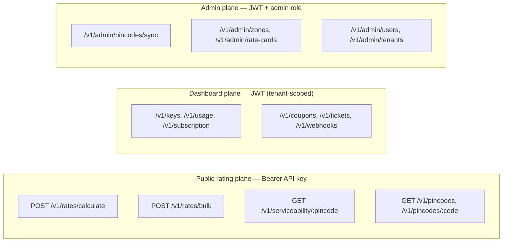
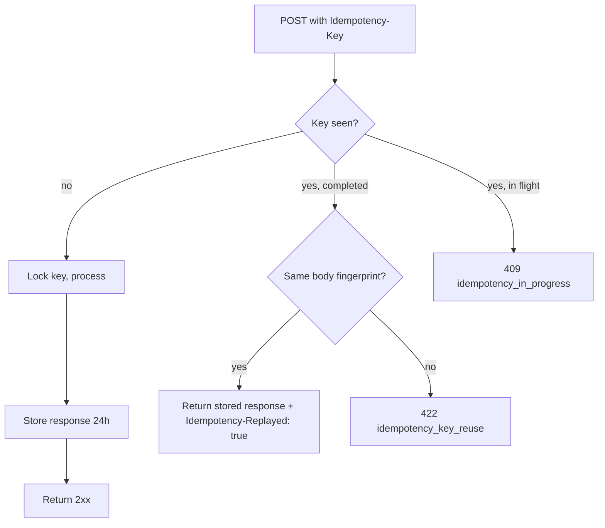
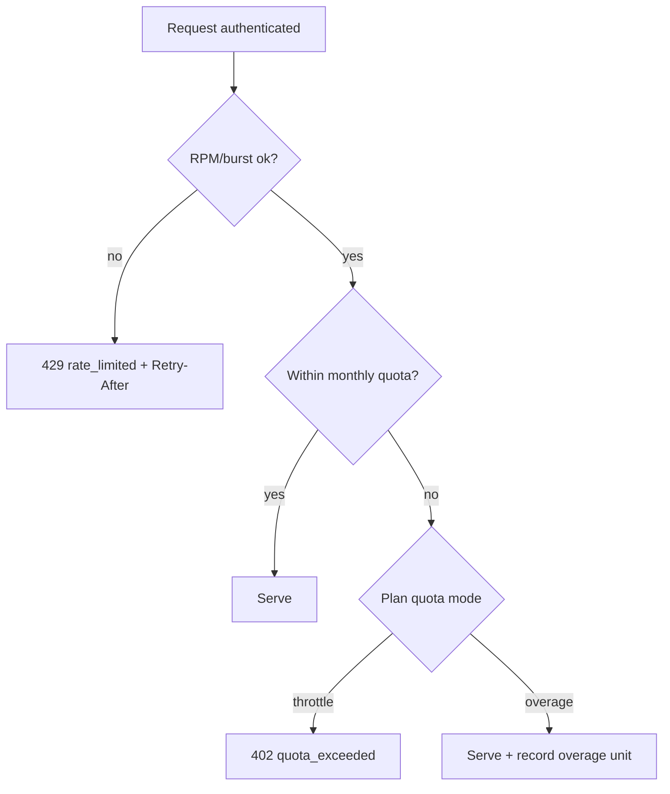

# REST API Reference (v1)

The Postpin REST API is the single programmatic surface for everything the platform does: calculating shipping charges, checking serviceability, and administering pincodes, rate cards, keys, usage, billing, support and webhooks. It is versioned at `/v1`, JSON over HTTPS only, and split into two auth planes — a **public rating plane** (Bearer API key, used from servers and edge functions to price shipments) and a **dashboard/admin plane** (JWT, used by the four Next.js surfaces and Postpin staff). This document is the canonical contract: base URL, auth, idempotency, pagination, rate-limit headers, the error envelope and code catalog, the versioning/deprecation policy, every endpoint grouped by area, and the webhook event list with signature verification. For the math behind the rating endpoints see [Shipping Engine](04-shipping-engine.md); for key lifecycle and limits see [API Keys & Rate Limiting](07-api-keys-and-rate-limiting.md); for cross-cutting DX conventions see [API Reference & Conventions](09-api-reference.md).

## Contents

- [1. Base URL, Environments & Media Types](#1-base-url-environments--media-types)
- [2. Authentication](#2-authentication)
- [3. Request Conventions](#3-request-conventions)
- [4. Idempotency](#4-idempotency)
- [5. Pagination (Cursor)](#5-pagination-cursor)
- [6. Rate Limits, Quotas & Headers](#6-rate-limits-quotas--headers)
- [7. Error Envelope & Code Catalog](#7-error-envelope--code-catalog)
- [8. Versioning, Deprecation & Sunset](#8-versioning-deprecation--sunset)
- [9. Rating API](#9-rating-api)
- [10. Pincodes API](#10-pincodes-api)
- [11. API Keys API](#11-api-keys-api)
- [12. Usage & Analytics API](#12-usage--analytics-api)
- [13. Subscriptions & Plans API](#13-subscriptions--plans-api)
- [14. Coupons API](#14-coupons-api)
- [15. Tickets API](#15-tickets-api)
- [16. Webhooks API & Events](#16-webhooks-api--events)
- [17. Admin API](#17-admin-api)
- [18. Endpoint Index](#18-endpoint-index)

---

## 1. Base URL, Environments & Media Types

| Property | Value |
|---|---|
| Production base | `https://api.postpin.dev/v1` |
| Sandbox base | `https://api.sandbox.postpin.dev/v1` |
| Transport | HTTPS only (TLS 1.2+). Plain HTTP is rejected with `400` before routing. |
| Request media type | `application/json; charset=utf-8` |
| Response media type | `application/json; charset=utf-8` |
| Compression | `gzip`, `br` (set `Accept-Encoding`) |
| Time | All timestamps are ISO 8601 UTC (`2026-06-26T18:30:00Z`); business logic that depends on India Post sync windows uses IST (UTC+05:30) internally. |
| Currency | INR only; monetary fields are JSON numbers with 2-decimal precision (rounded half-up). |

Environment is **selected by the credential**, not the path. A `pk_test_…` key or a JWT minted in sandbox resolves to sandbox data even when sent to the production host; a `pk_live_…` key resolves to live data. Sandbox is a full functional mirror (its own pincodes snapshot, rate cards, quotas and webhooks) with synthetic data and no billing side effects.



---

## 2. Authentication

Postpin uses two credential types. Pick by plane, never mix them on one request.

| Plane | Credential | Header | Issued by | Scope |
|---|---|---|---|---|
| Public rating | API key | `Authorization: Bearer pk_live_…` | Dashboard → API Keys; or `POST /v1/keys` | One tenant (`companyId`); optional domain/IP/referer allow-list |
| Dashboard | JWT access token | `Authorization: Bearer <jwt>` | `POST /v1/auth/login` (+ refresh) | One user within one tenant, RBAC-scoped |
| Admin | JWT with admin role | `Authorization: Bearer <jwt>` | Same; role gate enforced per route | Platform-wide |

### 2.1 API keys

- Format: `pk_live_<24+ base62>` and `pk_test_<24+ base62>`. The full secret is shown **once** at creation; only a masked form (`pk_live_8h2k…r4Qz`) and a `key_prefix` are stored/returned thereafter. The server stores only a SHA-256 hash; lookups hash the presented key and match the hash.
- Restriction checks (in order, all enforced before rating): key active → tenant active → subscription active → domain/origin allow-list → IP allow-list → referer allow-list. Each failed gate returns a specific error code (see [§7](#7-error-envelope--code-catalog)).
- Rotation: `POST /v1/keys/:id/rotate` issues a new secret and starts a configurable grace window during which both old and new keys work; `DELETE /v1/keys/:id` revokes immediately.

### 2.2 JWT (dashboard/admin)

```jsonc
// Login → access + refresh tokens
// POST /v1/auth/login
{ "email": "dana@brand.in", "password": "••••••••" }
```
```jsonc
// 200 OK
{
  "access_token":  "eyJhbGciOi…",   // short-lived (15 min), RS256
  "refresh_token": "rt_9f2c…",      // rotating, 30 days, httpOnly cookie in browser
  "token_type":    "Bearer",
  "expires_in":    900,
  "user": { "id": "usr_…", "company_id": "cmp_…", "roles": ["owner"] }
}
```

The access token carries `sub` (user), `company_id` (tenant), `roles` and `permissions`. Every dashboard route re-validates the tenant scope server-side; a token never grants cross-tenant access even if `company_id` is tampered with, because the signature would fail. Admin routes additionally require a role in `{platform_admin, support_admin}`.

> **Auth errors are uniform.** Missing/garbled credentials → `401 unauthenticated`; valid identity but insufficient permission → `403 forbidden`; valid key but tenant/subscription problem → `402`/`403` with a specific code (see catalog).

---

## 3. Request Conventions

| Concern | Convention |
|---|---|
| Methods | `GET` (read, cacheable), `POST` (create/compute), `PATCH` (partial update), `PUT` (full replace, rare), `DELETE` (revoke/remove). |
| Path style | Plural nouns, kebab-case (`/rate-cards`), resource id as path segment (`/pincodes/302001`). |
| Naming | Request and response field names are `snake_case`. Enum values are `SCREAMING_SNAKE` for payment types (`COD`, `PREPAID`) and lower-case tokens for service levels/zones (`surface`, `intra_city`). |
| Required headers | `Authorization`, `Content-Type: application/json` (on bodies). `Idempotency-Key` on non-idempotent writes (recommended). `X-Postpin-Version` to pin the API version (optional; see [§8](#8-versioning-deprecation--sunset)). |
| Request id | Server assigns `request_id` (`req_…`), echoed in `X-Request-Id` and in every response/error body `meta`. Send your own via `X-Request-Id` to correlate; it is preserved if syntactically valid. |
| Unknown fields | Rejected on writes with `422 unknown_field` (strict schemas) to catch typos; ignored on `GET` query strings. |
| Booleans/null | Explicit `true`/`false`; omit a field rather than sending `null` unless `null` is a meaningful clear. |
| Max body | 256 KB for single requests; `rates/bulk` capped at 1,000 shipments or 1 MB, whichever is first. |

Every response includes a `meta` block:

```jsonc
"meta": {
  "request_id": "req_4k9m2x",
  "engine_ms": 11,        // server processing time
  "cached": false,        // whether a cache short-circuit was used (rating)
  "api_version": "2026-01-15"
}
```

---

## 4. Idempotency

All `POST` endpoints that create resources or have side effects accept an `Idempotency-Key` header (client-generated, recommend a UUIDv4). Pure computations (`/rates/calculate`, `/rates/bulk`, `/serviceability`) are naturally idempotent but also honor the key to deduplicate retried billing events and to return a byte-identical cached response.

**Semantics**

1. The server stores `(tenant_id, idempotency_key) → {request_fingerprint, response, status}` in Redis for **24 hours**.
2. A repeat with the **same key and same body** returns the original status + body, plus `Idempotency-Replayed: true`.
3. A repeat with the **same key but a different body** returns `422 idempotency_key_reuse` — the key is bound to its first payload.
4. While the first request is still in flight, a concurrent repeat gets `409 idempotency_in_progress`; clients should retry after a short backoff.



Idempotency keys are **per-tenant**; two tenants can use the same key string without collision. Keys are not required for `GET`/`DELETE` (already idempotent by HTTP semantics) but are accepted and ignored.

---

## 5. Pagination (Cursor)

List endpoints use **opaque cursor pagination** (not offset) so results are stable under concurrent inserts and cheap at depth.

| Query param | Meaning | Default | Max |
|---|---|---|---|
| `limit` | Page size | 25 | 100 |
| `cursor` | Opaque token from a prior page's `next_cursor` | — | — |
| `order` | `asc` or `desc` on the resource's natural sort key (usually `created_at`) | `desc` | — |

Response envelope for any list:

```jsonc
{
  "data": [ /* array of resources */ ],
  "pagination": {
    "limit": 25,
    "has_more": true,
    "next_cursor": "eyJpZCI6IjY2…",   // pass back as ?cursor=
    "prev_cursor": "eyJpZCI6IjY1…"
  },
  "meta": { "request_id": "req_…" }
}
```

- A cursor encodes the sort key + id of the boundary row, signed so it cannot be forged. Tampered cursors → `400 invalid_cursor`.
- `has_more=false` and `next_cursor=null` mark the last page.
- Filter params (e.g. `?status=open&zone=F`) must be held constant across pages; changing a filter mid-pagination invalidates the cursor (`400 invalid_cursor`).
- Total counts are intentionally omitted on hot list paths (expensive at scale). Where a count is genuinely needed, call the resource's `/count` sub-route (e.g. `GET /v1/pincodes/count?circle=Assam`), which is cached.

---

## 6. Rate Limits, Quotas & Headers

Two independent governors apply, per the platform's pricing philosophy: **rate limit** (RPM + burst, protects the service) and **monthly quota** (plan allowance, drives billing/throttle). See [Billing & Subscriptions](06-billing-and-subscriptions.md) and [API Keys & Rate Limiting](07-api-keys-and-rate-limiting.md).

**Headers returned on every rating response (and on `429`):**

| Header | Meaning |
|---|---|
| `X-RateLimit-Limit` | Steady RPM ceiling for this key's plan |
| `X-RateLimit-Remaining` | Requests left in the current 60s window |
| `X-RateLimit-Reset` | Unix seconds when the window resets |
| `X-RateLimit-Burst` | Token-bucket burst capacity |
| `X-Quota-Limit` | Monthly included calls |
| `X-Quota-Used` | Calls consumed this billing period |
| `X-Quota-Remaining` | `max(0, limit - used)` |
| `Retry-After` | Seconds to wait (present on `429`/`402` throttle) |

**Decision logic**



- Rate limiting uses a Redis sliding-window + token-bucket per `apiKey`. A `429` never consumes monthly quota.
- `402 quota_exceeded` is returned only for **throttle**-mode plans at 100% quota. **Overage**-mode plans keep serving and bill the overage; the dashboard shows live projected overage (alerts fire at 80% and 100%).
- Counters are exact via Redis `INCR` with TTL; under Redis unavailability the gateway fails **open** for rate limit but **closed** for quota on hard-capped plans (Free/Sandbox), reconciling counts from `apiLogs` afterward.

---

## 7. Error Envelope & Code Catalog

Every non-2xx response uses one stable envelope. There is never a bare string or HTML error.

```jsonc
{
  "error": {
    "code": "invalid_pincode",          // stable machine string (catalog below)
    "message": "Delivery pincode 999999 is not a valid 6-digit India Post PIN.",
    "type": "validation_error",          // category: see table
    "param": "delivery_pincode",         // offending field path (when applicable)
    "doc_url": "https://docs.postpin.dev/errors/invalid_pincode",
    "details": [                          // optional, per-field for batch validation
      { "param": "dimensions_cm.height", "issue": "must be > 0" }
    ]
  },
  "meta": { "request_id": "req_4k9m2x", "api_version": "2026-01-15" }
}
```

### 7.1 HTTP status usage

| Status | Used for |
|---|---|
| `400` | Malformed request: bad JSON, invalid cursor, unsupported version, HTTP-not-HTTPS |
| `401` | Missing/invalid credential (`unauthenticated`) |
| `402` | Payment/quota: `quota_exceeded`, `subscription_past_due` |
| `403` | Authenticated but not allowed: `forbidden`, `domain_not_allowed`, `ip_not_allowed`, `key_revoked` |
| `404` | Resource not found (`not_found`) |
| `409` | Conflict: `idempotency_in_progress`, `pincode_removed`, `duplicate_resource` |
| `422` | Semantic validation failure on otherwise well-formed JSON |
| `429` | `rate_limited` |
| `500` | `internal_error` (always carries `request_id`; never leaks internals) |
| `503` | `service_unavailable` (dependency down, with `Retry-After`) |

### 7.2 Error code catalog

| `code` | HTTP | `type` | When |
|---|---|---|---|
| `unauthenticated` | 401 | auth_error | No/invalid Bearer credential |
| `forbidden` | 403 | auth_error | Valid identity, lacks permission/role |
| `key_revoked` | 403 | auth_error | API key revoked or expired |
| `domain_not_allowed` | 403 | auth_error | Origin/referer not in key allow-list |
| `ip_not_allowed` | 403 | auth_error | Source IP not in key allow-list |
| `subscription_inactive` | 403 | billing_error | Tenant has no active subscription |
| `subscription_past_due` | 402 | billing_error | Invoice unpaid; serving suspended |
| `quota_exceeded` | 402 | billing_error | Monthly quota hit on throttle-mode plan |
| `rate_limited` | 429 | rate_limit_error | RPM/burst exceeded; see `Retry-After` |
| `validation_error` | 422 | validation_error | Generic field validation failure |
| `unknown_field` | 422 | validation_error | Unexpected field on strict schema |
| `invalid_pincode` | 422 | validation_error | PIN not 6 digits / not in directory |
| `cod_amount_required` | 422 | validation_error | `payment_type=COD` without `cod_amount` |
| `invalid_dimensions` | 422 | validation_error | Non-positive/missing L/W/H when required |
| `weight_out_of_range` | 422 | validation_error | `weight_kg` ≤ 0 or above plan max |
| `idempotency_key_reuse` | 422 | idempotency_error | Same key, different body |
| `idempotency_in_progress` | 409 | idempotency_error | Concurrent replay of in-flight key |
| `invalid_cursor` | 400 | validation_error | Tampered/expired pagination cursor |
| `unsupported_version` | 400 | version_error | `X-Postpin-Version` unknown/sunset |
| `pincode_removed` | 409 | conflict_error | PIN exists but marked removed by sync |
| `not_serviceable` | 200* | — | Serviceability check: PIN valid but no service (returned as data, not error) |
| `no_rate_card` | 422 | configuration_error | Tenant + platform default both missing |
| `zone_unresolvable` | 422 | configuration_error | PIN pair maps to no configured zone |
| `not_found` | 404 | not_found_error | Resource id does not exist |
| `duplicate_resource` | 409 | conflict_error | Unique constraint (e.g. coupon code) |
| `internal_error` | 500 | api_error | Unhandled server fault |
| `service_unavailable` | 503 | api_error | Upstream dependency unavailable |

\* `not_serviceable` is a normal `200` outcome of `GET /serviceability/:pincode`, surfaced in the response body, not the error envelope — an unserviceable PIN is a valid answer, not a failure.

---

## 8. Versioning, Deprecation & Sunset

**Path version + dated revision.** The major version lives in the URL (`/v1`) and is the compatibility boundary; within `/v1`, backward-compatible additions ship continuously. Behavior-changing revisions are pinned by a **dated version string** sent in `X-Postpin-Version` (e.g. `2026-01-15`).

| Mechanism | Rule |
|---|---|
| URL major | `/v1`. A `/v2` is created only for breaking, non-additive changes; both run in parallel ≥ 12 months. |
| Dated revision | `X-Postpin-Version: 2026-01-15`. If omitted, requests use the tenant's **pinned default** (set at first successful call, frozen) — never the latest, so behavior never silently shifts. |
| Additive changes | New fields, endpoints, enum values, webhook events ship without a new dated version and must not break clients (clients must tolerate unknown response fields). |
| Deprecation | A deprecated endpoint/field returns `Deprecation: true` and a `Link: <…>; rel="deprecation"` header, and is documented for ≥ 90 days before sunset. |
| Sunset | A removed surface returns the `Sunset: <HTTP-date>` header during its wind-down, then `410 Gone` after. Sunset of a whole dated revision is announced ≥ 180 days ahead via email + dashboard + `Sunset` header. |

Example response headers on a deprecated route:

```
HTTP/1.1 200 OK
Deprecation: true
Sunset: Wed, 30 Sep 2026 00:00:00 GMT
Link: <https://docs.postpin.dev/changelog/2026-09-deprecations>; rel="deprecation"
X-Postpin-Version: 2026-01-15
```

Unknown or already-sunset `X-Postpin-Version` values return `400 unsupported_version` with the list of supported revisions in `details`.

---

## 9. Rating API

The core of the platform. All three endpoints are on the **public plane** (Bearer API key) and run the full engine pipeline; see [Shipping Engine](04-shipping-engine.md) for slab resolution and edge cases, and [§6](#6-shipping-calculation) of the overview for the canonical lifecycle.

### 9.1 `POST /rates/calculate`

Price a single shipment.

| | |
|---|---|
| Auth | Bearer API key |
| Idempotent | Yes (computation; honors `Idempotency-Key`) |
| Quota | Consumes 1 billable call |

**Request body**

| Field | Type | Req | Notes |
|---|---|---|---|
| `pickup_pincode` | string(6) | ✓ | India Post PIN, origin |
| `delivery_pincode` | string(6) | ✓ | India Post PIN, destination |
| `weight_kg` | number | ✓ | Actual weight, > 0 |
| `dimensions_cm` | object | — | `{length,width,height}` in cm; enables volumetric weight |
| `payment_type` | enum | ✓ | `COD` \| `PREPAID` |
| `cod_amount` | number | cond | Required when `payment_type=COD`; the collectible value (INR) |
| `service_level` | enum | — | `surface` (default) \| `express` \| `same_day` |
| `rate_card_id` | string | — | Force a specific card; defaults to tenant default card |
| `include_gst` | boolean | — | Apply 18% GST on freight (default `false`) |
| `currency` | enum | — | `INR` only (reserved for future) |

```bash
curl -sS https://api.postpin.dev/v1/rates/calculate \
  -H "Authorization: Bearer pk_live_8h2k…r4Qz" \
  -H "Content-Type: application/json" \
  -H "Idempotency-Key: 7d6f2b3a-9c1e-4a55-8b2c-001122334455" \
  -d '{
    "pickup_pincode":   "302001",
    "delivery_pincode": "781001",
    "weight_kg":        0.4,
    "dimensions_cm":    { "length": 30, "width": 25, "height": 8 },
    "payment_type":     "COD",
    "cod_amount":       1499,
    "service_level":    "surface",
    "include_gst":      true
  }'
```

**Response `200 OK`**

```jsonc
{
  "currency": "INR",
  "zone": "north_east_special",        // Jaipur (metro-ish) → Guwahati (NE)
  "service_level": "surface",
  "actual_weight_kg": 0.4,
  "volumetric_weight_kg": 1.2,         // 30*25*8 / 5000
  "billable_weight_kg": 1.2,           // max(actual, volumetric)
  "rate_card_id": "rc_8h2k9m",
  "default_card": false,
  "breakdown": {
    "freight":          120.00,        // base + per-slab × billable weight
    "cod_charge":        37.48,        // max(flat 30, 2.5% × 1499)
    "remote_surcharge":  35.00,        // delivery PIN flagged remote
    "fuel_surcharge":    23.10,        // 12% of freight
    "subtotal":         215.58,
    "gst":               38.80,        // 18% of subtotal (include_gst=true)
    "total":            254.38
  },
  "flags": { "volumetric_skipped": false, "remote_area": true },
  "meta": { "request_id": "req_4k9m2x", "engine_ms": 11, "cached": false, "api_version": "2026-01-15" }
}
```

**Error cases**

| Condition | Code / HTTP |
|---|---|
| PIN not 6 digits / unknown | `invalid_pincode` / 422 (`param` set) |
| PIN marked removed by sync | `pincode_removed` / 409 (suggests nearest active PIN in `details`) |
| `payment_type=COD`, no `cod_amount` | `cod_amount_required` / 422 |
| Non-positive dimension | `invalid_dimensions` / 422 |
| `weight_kg ≤ 0` / above plan max | `weight_out_of_range` / 422 |
| No tenant card + no platform default | `no_rate_card` / 422 |
| PIN pair maps to no zone | `zone_unresolvable` / 422 |
| Over RPM | `rate_limited` / 429 |
| Quota hit (throttle plan) | `quota_exceeded` / 402 |

Edge behaviors: same pickup & delivery PIN → `zone=intra_city` (lowest slab); `dimensions_cm` omitted → volumetric skipped, `flags.volumetric_skipped=true`, billable = actual; cache miss on both PINs → cold path (≤120ms) and result cached.

### 9.2 `POST /rates/bulk`

Price up to 1,000 shipments in one call (e.g. a cart with split shipments, or a nightly re-rate). Partial success is allowed: each item is rated independently and carries its own status.

| | |
|---|---|
| Auth | Bearer API key |
| Quota | Consumes N billable calls (one per shipment) — reflected in quota headers after the call |
| Limits | ≤ 1,000 items or ≤ 1 MB body |

```jsonc
// Request
{
  "shipments": [
    { "id": "ship_1", "pickup_pincode": "302001", "delivery_pincode": "781001",
      "weight_kg": 0.4, "dimensions_cm": {"length":30,"width":25,"height":8},
      "payment_type": "COD", "cod_amount": 1499, "service_level": "surface" },
    { "id": "ship_2", "pickup_pincode": "400001", "delivery_pincode": "400051",
      "weight_kg": 2.0, "payment_type": "PREPAID", "service_level": "express" }
  ],
  "include_gst": true                  // applied to all unless overridden per item
}
```

```jsonc
// 200 OK (multi-status semantics inside a 200; check per-item ok)
{
  "results": [
    { "id": "ship_1", "ok": true,  "zone": "north_east_special", "billable_weight_kg": 1.2,
      "breakdown": { "total": 254.38, "...": "…" } },
    { "id": "ship_2", "ok": true,  "zone": "intra_city", "billable_weight_kg": 2.0,
      "breakdown": { "total": 96.40, "...": "…" } }
  ],
  "summary": { "requested": 2, "succeeded": 2, "failed": 0, "billable_calls": 2 },
  "meta": { "request_id": "req_…", "engine_ms": 23 }
}
```

A failed item appears with `"ok": false` and an inline `error` object using the same catalog (`invalid_pincode`, etc.). The HTTP status is `200` whenever the batch was accepted; only batch-level faults (over size limit, bad JSON, auth) return a 4xx envelope. Quota is consumed only for items actually rated (`succeeded`), not for items that failed validation.

### 9.3 `GET /serviceability/:pincode`

Lightweight check: is a destination PIN deliverable, by which service levels, and is it remote/COD-eligible. Does **not** consume rating quota (it is metered separately, far cheaper).

| | |
|---|---|
| Auth | Bearer API key |
| Method | `GET` (cacheable; honors CDN + `Cache-Control`) |
| Query | `pickup` (optional; if given, also returns the resolved zone for that origin) |

```bash
curl -sS "https://api.postpin.dev/v1/serviceability/781001?pickup=302001" \
  -H "Authorization: Bearer pk_live_8h2k…r4Qz"
```

```jsonc
// 200 OK — serviceable
{
  "pincode": "781001",
  "serviceable": true,
  "city": "Guwahati",
  "district": "Kamrup Metropolitan",
  "state": "Assam",
  "circle": "Assam",
  "service_levels": ["surface", "express"],   // same_day not available here
  "cod_available": true,
  "remote_area": true,
  "prepaid_only": false,
  "zone_from_pickup": "north_east_special",   // present because ?pickup given
  "meta": { "request_id": "req_…", "cached": true }
}
```

```jsonc
// 200 OK — valid PIN, but no service
{
  "pincode": "190001",
  "serviceable": false,
  "reason": "not_serviceable",
  "state": "Jammu & Kashmir",
  "nearest_serviceable": "180001",
  "meta": { "request_id": "req_…", "cached": true }
}
```

Errors: `invalid_pincode` (422) if the path PIN is not 6 digits or absent from the directory; `pincode_removed` (409) if removed by sync (with `nearest_serviceable`).

---

## 10. Pincodes API

Read access to the India-Post-synced directory (the platform's source of truth). Public plane for reads; write/import/export/rollback live under [Admin](#17-admin-api). See [Pincode Management](03-pincode-management.md).

### 10.1 `GET /pincodes`

List/search pincodes with cursor pagination.

| Query | Type | Notes |
|---|---|---|
| `q` | string | Free text over office/city/district |
| `state` | string | Filter by state |
| `circle` | string | Filter by India Post circle |
| `status` | enum | `active` \| `removed` \| `all` (default `active`) |
| `remote` | bool | Only remote-area PINs |
| `limit`, `cursor`, `order` | — | See [§5](#5-pagination-cursor) |

```bash
curl -sS "https://api.postpin.dev/v1/pincodes?state=Assam&limit=2" \
  -H "Authorization: Bearer pk_live_8h2k…r4Qz"
```

```jsonc
{
  "data": [
    { "pincode": "781001", "city": "Guwahati", "district": "Kamrup Metropolitan",
      "state": "Assam", "circle": "Assam", "remote_area": true, "status": "active",
      "lat": 26.1840, "lng": 91.7458, "updated_at": "2026-06-25T19:00:12Z" }
  ],
  "pagination": { "limit": 2, "has_more": true, "next_cursor": "eyJ…", "prev_cursor": null },
  "meta": { "request_id": "req_…" }
}
```

### 10.2 `GET /pincodes/:code`

```jsonc
// GET /v1/pincodes/302001 → 200 OK
{
  "pincode": "302001",
  "office": "Jaipur GPO",
  "city": "Jaipur",
  "district": "Jaipur",
  "state": "Rajasthan",
  "circle": "Rajasthan",
  "region": "metro_tier",
  "remote_area": false,
  "cod_available": true,
  "status": "active",
  "lat": 26.9239, "lng": 75.8267,
  "last_synced_at": "2026-06-25T19:00:12Z",
  "source": "data.gov.in",          // or api.postalpincode.in
  "meta": { "request_id": "req_…" }
}
```

Errors: `not_found` (404) when no such PIN; `pincode_removed` (409) when present but removed.

`GET /v1/pincodes/count` returns a cached `{ "count": 19101 }` honoring the same filters — use it instead of paginating to the end.

---

## 11. API Keys API

Dashboard plane (JWT). Manages the tenant's own keys; mirrors Clerk's reveal-once UX. See [API Keys & Rate Limiting](07-api-keys-and-rate-limiting.md).

| Method | Path | Purpose |
|---|---|---|
| `GET` | `/keys` | List keys (masked) |
| `POST` | `/keys` | Create a key (returns full secret **once**) |
| `GET` | `/keys/:id` | Get one key (masked) |
| `PATCH` | `/keys/:id` | Update name/restrictions/active |
| `POST` | `/keys/:id/rotate` | Issue new secret with grace window |
| `DELETE` | `/keys/:id` | Revoke immediately |

```jsonc
// POST /v1/keys
{
  "name": "checkout-prod",
  "environment": "live",                       // live | test
  "allowed_domains": ["brand.in", "*.brand.in"],
  "allowed_ips": ["13.232.0.0/16"],
  "rate_card_id": "rc_8h2k9m"                  // optional: pin a card to this key
}
```
```jsonc
// 201 Created — secret shown ONCE
{
  "id": "key_9f2c…",
  "name": "checkout-prod",
  "secret": "pk_live_8h2k4j…r4QzXy",          // store now; never returned again
  "key_prefix": "pk_live_8h2k",
  "masked": "pk_live_8h2k…r4Qz",
  "environment": "live",
  "allowed_domains": ["brand.in", "*.brand.in"],
  "active": true,
  "created_at": "2026-06-26T18:30:00Z"
}
```

`POST /keys/:id/rotate` accepts `{ "grace_minutes": 60 }` and returns the new secret once; both keys validate until the grace window ends.

---

## 12. Usage & Analytics API

Dashboard plane (JWT). Powers the PostHog-style usage charts (calls/day, top zones, latency, error rate). See [Dashboards](11-dashboards.md) and [Observability & Audit](12-observability-and-audit.md).

| Method | Path | Purpose |
|---|---|---|
| `GET` | `/usage/summary` | Current-period totals: calls, quota %, overage, errors |
| `GET` | `/usage/timeseries` | Bucketed series for charting |
| `GET` | `/usage/breakdown` | Group-by dimension (zone, endpoint, key, status) |
| `GET` | `/logs` | Paginated `apiLogs` (request-level) |

```bash
curl -sS "https://api.postpin.dev/v1/usage/timeseries?metric=calls&interval=day&from=2026-06-01&to=2026-06-26" \
  -H "Authorization: Bearer <jwt>"
```
```jsonc
// 200 OK
{
  "metric": "calls",
  "interval": "day",
  "series": [
    { "t": "2026-06-24", "value": 41203, "errors": 38, "p95_ms": 31 },
    { "t": "2026-06-25", "value": 39880, "errors": 21, "p95_ms": 29 }
  ],
  "totals": { "calls": 81083, "errors": 59, "error_rate": 0.00073 },
  "meta": { "request_id": "req_…" }
}
```

`GET /usage/breakdown?group_by=zone&from=…&to=…` returns top zones by call volume; `group_by=status` returns the HTTP status distribution for error monitoring. `GET /logs` returns individual `apiLogs` rows (request_id, endpoint, status, latency, key, masked payload summary) with cursor pagination and `?status`, `?endpoint`, `?key_id` filters.

---

## 13. Subscriptions & Plans API

Dashboard plane (JWT) for the tenant's own subscription; plan catalog is public-readable. See [Billing & Subscriptions](06-billing-and-subscriptions.md).

| Method | Path | Auth | Purpose |
|---|---|---|---|
| `GET` | `/plans` | API key or JWT | List public plan catalog |
| `GET` | `/subscription` | JWT | Current subscription, quota, period |
| `POST` | `/subscription` | JWT (billing perm) | Subscribe/upgrade/downgrade |
| `PATCH` | `/subscription` | JWT | Change quota mode (throttle/overage), apply coupon |
| `POST` | `/subscription/cancel` | JWT | Cancel at period end |
| `GET` | `/invoices` | JWT | List invoices (cursor) |
| `GET` | `/invoices/:id` | JWT | One invoice with line items |

```jsonc
// GET /v1/subscription → 200 OK
{
  "plan": "growth",
  "status": "active",
  "quota_mode": "overage",
  "current_period": { "start": "2026-06-01", "end": "2026-06-30" },
  "quota": { "included": 250000, "used": 181402, "remaining": 68598, "overage_units": 0 },
  "rate_limit": { "rpm": 300, "burst": 100 },
  "amount_inr": 4999,
  "renews_at": "2026-07-01T00:00:00Z",
  "coupon": null,
  "meta": { "request_id": "req_…" }
}
```

```jsonc
// POST /v1/subscription  — upgrade with coupon
{ "plan": "scale", "quota_mode": "overage", "coupon_code": "SCALE20", "interval": "annual" }
```

Errors: `subscription_inactive`/`subscription_past_due` for billing problems; `forbidden` if the JWT lacks the billing permission; `duplicate_resource` if a pending change already exists.

---

## 14. Coupons API

Public **validate** (read) on the API key plane; **create/manage** on the admin plane. See [Billing & Subscriptions](06-billing-and-subscriptions.md).

| Method | Path | Auth | Purpose |
|---|---|---|---|
| `POST` | `/coupons/validate` | JWT or API key | Validate a code for the current tenant/plan |
| `GET` | `/admin/coupons` | Admin JWT | List coupons |
| `POST` | `/admin/coupons` | Admin JWT | Create a coupon |
| `PATCH` | `/admin/coupons/:id` | Admin JWT | Update (limits, expiry, active) |
| `DELETE` | `/admin/coupons/:id` | Admin JWT | Deactivate |

```jsonc
// POST /v1/coupons/validate
{ "code": "SCALE20", "plan": "scale", "interval": "annual" }
```
```jsonc
// 200 OK
{
  "code": "SCALE20",
  "valid": true,
  "discount_type": "percent",        // percent | fixed
  "discount_value": 20,
  "applies_to": ["scale"],
  "max_redemptions": 500,
  "redemptions": 213,
  "expires_at": "2026-09-30T23:59:59Z"
}
```
Invalid/expired/exhausted codes return `200` with `"valid": false` and a `reason` (`expired`, `exhausted`, `plan_mismatch`, `not_found`) — validation is data, not an error. `POST /admin/coupons` returns `duplicate_resource` (409) if the code already exists.

---

## 15. Tickets API

Dashboard plane for tenants; admin plane for staff replies/status. See [Support & Notifications](08-support-and-notifications.md).

| Method | Path | Auth | Purpose |
|---|---|---|---|
| `GET` | `/tickets` | JWT | List tenant tickets (cursor; `?status`) |
| `POST` | `/tickets` | JWT | Open a ticket |
| `GET` | `/tickets/:id` | JWT | Ticket + replies thread |
| `POST` | `/tickets/:id/replies` | JWT | Add a reply |
| `PATCH` | `/tickets/:id` | JWT/Admin | Update status/priority (admin can assign) |

```jsonc
// POST /v1/tickets
{
  "subject": "Quote mismatch on Guwahati COD orders",
  "priority": "high",                 // low | normal | high | urgent
  "category": "rating",
  "message": "billable_weight differs from courier invoice for 781001…",
  "attachments": ["att_…"]
}
```
```jsonc
// 201 Created
{
  "id": "tkt_3m9k",
  "subject": "Quote mismatch on Guwahati COD orders",
  "status": "open",                   // open | pending | resolved | closed
  "priority": "high",
  "category": "rating",
  "created_at": "2026-06-26T18:31:00Z",
  "replies_count": 0
}
```

`POST /tickets/:id/replies` body `{ "message": "…", "attachments": [] }`; status transitions are validated (`open→pending→resolved→closed`, with reopen allowed from `resolved`). A new reply/status change emits a webhook (`ticket.updated`).

---

## 16. Webhooks API & Events

Postpin posts signed JSON events to tenant-configured endpoints. Manage endpoints on the dashboard plane; events fan out from the platform's notification system. See [Support & Notifications](08-support-and-notifications.md).

### 16.1 Endpoint management

| Method | Path | Purpose |
|---|---|---|
| `GET` | `/webhooks` | List endpoints |
| `POST` | `/webhooks` | Register an endpoint (returns `signing_secret` once) |
| `PATCH` | `/webhooks/:id` | Update URL / subscribed events / active |
| `DELETE` | `/webhooks/:id` | Remove endpoint |
| `POST` | `/webhooks/:id/test` | Send a synthetic `ping` event |
| `GET` | `/webhooks/:id/deliveries` | Delivery log (status, attempts, response code) |
| `POST` | `/webhooks/deliveries/:id/redeliver` | Manually retry one delivery |

```jsonc
// POST /v1/webhooks
{
  "url": "https://brand.in/hooks/postpin",
  "events": ["pincode.sync.completed", "subscription.quota.warning", "ticket.updated"],
  "active": true
}
```
```jsonc
// 201 Created
{
  "id": "wh_7c2d",
  "url": "https://brand.in/hooks/postpin",
  "events": ["pincode.sync.completed", "subscription.quota.warning", "ticket.updated"],
  "signing_secret": "whsec_5f8a…",   // shown ONCE; used to verify signatures
  "active": true,
  "created_at": "2026-06-26T18:32:00Z"
}
```

### 16.2 Event envelope

Every delivery is a `POST` with this body and signature headers:

```jsonc
{
  "id": "evt_9a2f…",
  "type": "pincode.sync.completed",
  "created_at": "2026-06-27T00:35:12Z",
  "api_version": "2026-01-15",
  "livemode": true,
  "data": { /* event-specific object, see catalog */ }
}
```

| Header | Purpose |
|---|---|
| `Postpin-Signature` | `t=<unix>,v1=<hex hmac>` (HMAC-SHA256 of `"<t>.<raw_body>"`) |
| `Postpin-Event-Id` | Event id (idempotent consumption) |
| `Postpin-Event-Type` | Event type |
| `Postpin-Delivery-Attempt` | 1-based retry count |

### 16.3 Event catalog

| Event type | Fires when | `data` payload |
|---|---|---|
| `ping` | Manual test | `{ "message": "ok" }` |
| `pincode.sync.started` | Nightly/manual sync begins | `{ sync_id, started_at, trigger }` |
| `pincode.sync.completed` | Sync run finishes | `{ sync_id, added, updated, removed, failed, duration_ms, status }` |
| `pincode.sync.failed` | Sync run errors out | `{ sync_id, error, failed_records }` |
| `pincode.removed` | A PIN is marked removed | `{ pincode, nearest_serviceable }` |
| `subscription.quota.warning` | 80% of quota reached | `{ used, included, percent, period_end }` |
| `subscription.quota.exceeded` | 100% of quota | `{ used, included, mode }` |
| `subscription.updated` | Plan/quota-mode change | `{ plan, quota_mode, status }` |
| `invoice.created` | New invoice generated | `{ invoice_id, amount_inr, period }` |
| `invoice.payment_failed` | Charge failed | `{ invoice_id, amount_inr, retry_at }` |
| `key.created` / `key.revoked` | API key lifecycle | `{ key_id, key_prefix }` |
| `ticket.created` / `ticket.updated` | Support activity | `{ ticket_id, status, priority }` |
| `rate_card.updated` | Tenant rate card changed | `{ rate_card_id, version }` |

### 16.4 Signature verification

The receiver recomputes `HMAC-SHA256(secret, "<timestamp>.<raw_request_body>")` and compares (constant-time) against the `v1` value. Reject if the timestamp is older than 5 minutes (replay protection) or if no `v1` matches (the secret list may contain an old + new secret during rotation).

```js
// Node.js — Express raw body required
const crypto = require("crypto");

function verifyPostpinWebhook(rawBody, header, secret, toleranceSec = 300) {
  const parts = Object.fromEntries(header.split(",").map(kv => kv.split("=")));
  const t = Number(parts.t);
  if (!t || Math.abs(Date.now() / 1000 - t) > toleranceSec) return false; // replay guard
  const expected = crypto
    .createHmac("sha256", secret)
    .update(`${t}.${rawBody}`)
    .digest("hex");
  const a = Buffer.from(expected);
  const b = Buffer.from(parts.v1 || "");
  return a.length === b.length && crypto.timingSafeEqual(a, b);
}

app.post("/hooks/postpin",
  express.raw({ type: "application/json" }),
  (req, res) => {
    const ok = verifyPostpinWebhook(
      req.body.toString("utf8"),
      req.get("Postpin-Signature"),
      process.env.POSTPIN_WHSEC
    );
    if (!ok) return res.status(400).send("invalid signature");
    const event = JSON.parse(req.body.toString("utf8"));
    // idempotent: dedupe on event.id before acting
    res.status(200).send("ok"); // ack fast; process async
  }
);
```

**Delivery & retries.** Postpin expects a `2xx` within 10 s. Non-2xx/timeout triggers exponential backoff retries (e.g. 1m, 5m, 30m, 2h, 6h — up to 8 attempts over ~24h). After exhaustion the endpoint is flagged and a `webhook.endpoint.disabled` notification is sent. Consumers **must** be idempotent on `event.id` (events can be delivered more than once).

---

## 17. Admin API

Admin plane (JWT with `platform_admin`/`support_admin`). Powers the Super Admin portal: pincode sync control, zones, rate cards, users/tenants. Every mutating admin call writes an `auditLogs` entry. See [Pincode Management](03-pincode-management.md), [Rate Cards & Rules](05-rate-cards-and-rules.md), [Identity & RBAC](02-identity-and-rbac.md).

### 17.1 Pincode sync control

| Method | Path | Purpose |
|---|---|---|
| `POST` | `/admin/pincodes/sync` | Trigger a manual sync run |
| `GET` | `/admin/pincodes/sync/status` | Live status + dashboard counters |
| `GET` | `/admin/pincodes/sync/logs` | List `pincodeSyncLogs` (cursor) |
| `GET` | `/admin/pincodes/sync/logs/:syncId` | One run's full record |
| `POST` | `/admin/pincodes/sync/:syncId/rollback` | Roll back a run |
| `POST` | `/admin/pincodes/import` | Import CSV (multipart) |
| `GET` | `/admin/pincodes/export` | Export CSV (streamed) |
| `POST` | `/admin/pincodes` / `PATCH /:code` / `DELETE /:code` | Manual PIN CRUD |

```bash
# Trigger a manual sync (idempotency key prevents a double-run on retry)
curl -sS -X POST https://api.postpin.dev/v1/admin/pincodes/sync \
  -H "Authorization: Bearer <admin-jwt>" \
  -H "Idempotency-Key: 2026-06-26-manual-1" \
  -H "Content-Type: application/json" \
  -d '{ "source": "data.gov.in", "dry_run": false }'
```
```jsonc
// 202 Accepted — runs async; subscribe to pincode.sync.completed
{
  "sync_id": "sync_20260626_001",
  "status": "running",
  "trigger": "manual",
  "source": "data.gov.in",
  "started_at": "2026-06-26T18:33:00Z",
  "meta": { "request_id": "req_…" }
}
```
```jsonc
// GET /v1/admin/pincodes/sync/status → dashboard counters
{
  "total_pincodes": 19101,
  "last_sync": { "sync_id": "sync_20260625_001", "ended_at": "2026-06-25T19:00:12Z", "status": "success" },
  "current": { "sync_id": "sync_20260626_001", "status": "running", "progress_pct": 62 },
  "last_run_stats": { "added": 14, "updated": 203, "removed": 2, "failed": 0, "duration_ms": 41210 }
}
```

`POST /admin/pincodes/sync/:syncId/rollback` reverts that run's inserts/updates/removals using its log diff and returns a new corrective `sync_id`. `dry_run: true` computes and logs the diff without writing — used to preview a risky sync.

### 17.2 Zones

| Method | Path | Purpose |
|---|---|---|
| `GET` | `/admin/zones` | List zone-mapping rules |
| `POST` | `/admin/zones` | Create a zone rule (origin circle/region → dest → zone) |
| `PATCH` | `/admin/zones/:id` | Update a rule |
| `DELETE` | `/admin/zones/:id` | Remove a rule |
| `POST` | `/admin/zones/resolve` | Preview: given pickup+delivery PIN, return zone |

The canonical zone set is `intra_city`, `intra_state`, `metro`, `rest_of_india`, `north_east_special` (see [Shipping Engine](04-shipping-engine.md#zone-resolution)). `resolve` is a debugging aid mirroring the engine's pure zone function.

### 17.3 Rate cards

| Method | Path | Purpose |
|---|---|---|
| `GET` | `/admin/rate-cards` | List cards (filter `?company_id`) |
| `POST` | `/admin/rate-cards` | Create a card with slabs + surcharge rules |
| `GET` | `/admin/rate-cards/:id` | Get one (full slab table) |
| `PATCH` | `/admin/rate-cards/:id` | Update (creates a new version) |
| `POST` | `/admin/rate-cards/:id/default` | Mark as tenant default |
| `DELETE` | `/admin/rate-cards/:id` | Archive |

```jsonc
// POST /v1/admin/rate-cards (excerpt) — see 05-rate-cards-and-rules.md for full schema
{
  "company_id": "cmp_…",
  "name": "Delhivery Surface 2026",
  "service_level": "surface",
  "weight_unit_g": 500,
  "zones": {
    "intra_city":         { "base": 28, "increment": 22 },
    "north_east_special": { "base": 75, "increment": 55 }
  },
  "cod": { "flat": 30, "percent": 2.5 },
  "fuel_surcharge_percent": 12,
  "remote_surcharge_flat": 35,
  "gst_percent": 18
}
```

### 17.4 Users & tenants

| Method | Path | Purpose |
|---|---|---|
| `GET` | `/admin/tenants` | List companies (cursor; `?status`, `?plan`) |
| `GET` | `/admin/tenants/:id` | Tenant detail (subscription, usage, keys count) |
| `PATCH` | `/admin/tenants/:id` | Suspend/reactivate, adjust limits |
| `GET` | `/admin/users` | List users across tenants |
| `POST` | `/admin/users` | Create/invite a user |
| `PATCH` | `/admin/users/:id` | Update roles/status |
| `POST` | `/admin/users/:id/impersonate` | Issue a scoped, audited impersonation token (support) |

All admin mutations require the relevant permission (RBAC) and are recorded in `auditLogs` with actor, target, before/after diff and `request_id`. Impersonation tokens are short-lived, flagged `impersonated=true` in subsequent audit entries, and cannot perform billing-destructive actions.

---

## 18. Endpoint Index

| Area | Method & Path | Auth |
|---|---|---|
| Rating | `POST /rates/calculate` | API key |
| Rating | `POST /rates/bulk` | API key |
| Rating | `GET /serviceability/:pincode` | API key |
| Pincodes | `GET /pincodes` | API key |
| Pincodes | `GET /pincodes/:code` | API key |
| Pincodes | `GET /pincodes/count` | API key |
| Auth | `POST /auth/login` · `POST /auth/refresh` · `POST /auth/logout` | — / JWT |
| Keys | `GET/POST /keys` · `GET/PATCH/DELETE /keys/:id` · `POST /keys/:id/rotate` | JWT |
| Usage | `GET /usage/summary` · `/usage/timeseries` · `/usage/breakdown` · `/logs` | JWT |
| Plans | `GET /plans` | API key/JWT |
| Subscription | `GET/POST/PATCH /subscription` · `POST /subscription/cancel` · `GET /invoices[/:id]` | JWT |
| Coupons | `POST /coupons/validate` | JWT/API key |
| Tickets | `GET/POST /tickets` · `GET/PATCH /tickets/:id` · `POST /tickets/:id/replies` | JWT |
| Webhooks | `GET/POST /webhooks` · `PATCH/DELETE /webhooks/:id` · `POST /webhooks/:id/test` · `GET /webhooks/:id/deliveries` | JWT |
| Admin · Pincodes | `POST /admin/pincodes/sync` · `…/status` · `…/logs[/:id]` · `…/:id/rollback` · `…/import` · `…/export` | Admin JWT |
| Admin · Zones | `GET/POST /admin/zones` · `PATCH/DELETE /admin/zones/:id` · `POST /admin/zones/resolve` | Admin JWT |
| Admin · Rate cards | `GET/POST /admin/rate-cards` · `GET/PATCH/DELETE /admin/rate-cards/:id` · `POST /admin/rate-cards/:id/default` | Admin JWT |
| Admin · Coupons | `GET/POST /admin/coupons` · `PATCH/DELETE /admin/coupons/:id` | Admin JWT |
| Admin · Identity | `GET /admin/tenants[/:id]` · `PATCH /admin/tenants/:id` · `GET/POST /admin/users` · `PATCH /admin/users/:id` · `POST /admin/users/:id/impersonate` | Admin JWT |

---

*Related: [Shipping Engine](04-shipping-engine.md) (rating math & zones) · [Rate Cards & Rules](05-rate-cards-and-rules.md) · [Pincode Management](03-pincode-management.md) (sync) · [API Keys & Rate Limiting](07-api-keys-and-rate-limiting.md) · [Billing & Subscriptions](06-billing-and-subscriptions.md) · [API Reference & Conventions](09-api-reference.md) · [Support & Notifications](08-support-and-notifications.md).*
