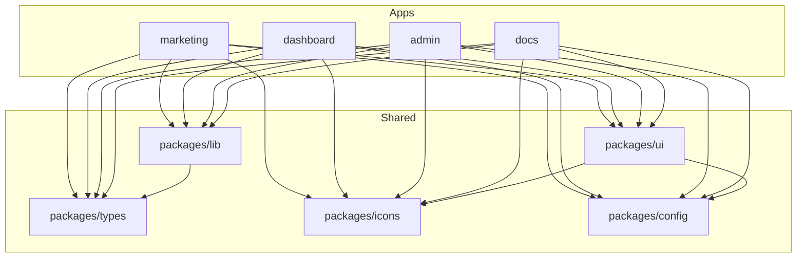
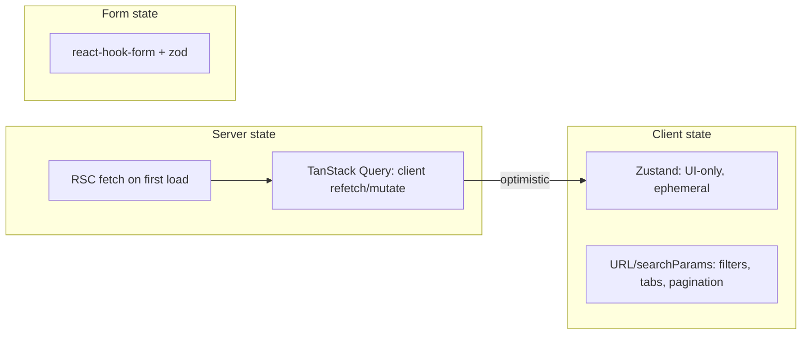
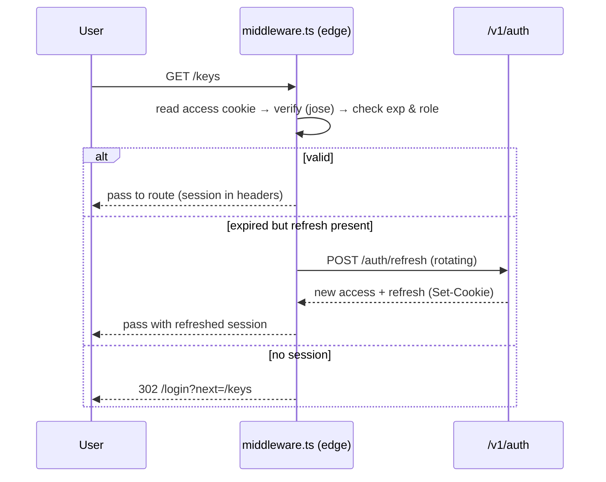

# Next.js Frontend Architecture

Postpin ships **four distinct front-end surfaces** — a marketing website, a customer **Dashboard**, a **Super Admin** portal, and an interactive **API Documentation** portal — built as a single Turborepo/pnpm monorepo of Next.js 15 (App Router, React 19, TypeScript) apps that share one design system (`packages/ui`), one set of API clients and utilities (`packages/lib`), and one type contract (`packages/types`) generated from the backend's OpenAPI spec. This document is the build-from blueprint for that frontend: the repo layout, per-app folder anatomy, state-management and data-fetching strategy (React Server Components for first paint, TanStack Query for client interactivity), JWT session and refresh handling, RBAC route protection in Next.js middleware, a complete per-route **page inventory** across all four apps (purpose, components, endpoints, loading/empty/error states, responsiveness, permissions), and the concrete performance practices (RSC boundaries, code splitting, image optimization, multi-layer caching) that keep dashboard interactions under 100 ms and marketing pages at a 95+ Lighthouse score.

## Contents

- [1. Goals & Constraints](#1-goals--constraints)
- [2. Monorepo & Package Structure](#2-monorepo--package-structure)
- [3. Per-App Folder Anatomy](#3-per-app-folder-anatomy)
- [4. Design System (`packages/ui`)](#4-design-system-packagesui)
- [5. State Management & Data Fetching](#5-state-management--data-fetching)
- [6. API Client Layer (`services/`)](#6-api-client-layer-services)
- [7. Auth, Session & Token Refresh](#7-auth-session--token-refresh)
- [8. RBAC Route Protection (Middleware)](#8-rbac-route-protection-middleware)
- [9. Routing & Route Groups](#9-routing--route-groups)
- [10. Loading / Empty / Error State Conventions](#10-loading--empty--error-state-conventions)
- [11. Page Inventory — Marketing](#11-page-inventory--marketing)
- [12. Page Inventory — Auth](#12-page-inventory--auth)
- [13. Page Inventory — User Dashboard](#13-page-inventory--user-dashboard)
- [14. Page Inventory — Super Admin](#14-page-inventory--super-admin)
- [15. Page Inventory — Docs Portal](#15-page-inventory--docs-portal)
- [16. Performance Practices](#16-performance-practices)
- [17. Testing, Accessibility & Conventions](#17-testing-accessibility--conventions)
- [18. Cross-references](#18-cross-references)

---

## 1. Goals & Constraints

| Goal | Implication for the frontend |
|---|---|
| **Stripe-grade DX & dashboards** | Sub-100 ms perceived navigation, optimistic mutations, skeletons never spinners, copy-to-clipboard everywhere, keyboard-first. |
| **Four surfaces, one brand** | Single design system, single token file, single icon set — duplicated UI is a bug, not a feature. |
| **India-first** | `en-IN` / INR formatting by default, IST timezone display, realistic pincode examples (`302001`, `781001`, `400001`), GST-aware money. |
| **Multi-tenant + RBAC** | Every dashboard/admin route is permission-gated in middleware *and* re-checked server-side; the UI never trusts the client. |
| **Production-grade** | RSC by default, client islands only where interactive, strict CSP, no unhandled error boundary, AA accessibility, `prefers-reduced-motion` respected. |
| **Type-safe end to end** | `packages/types` is generated from the backend OpenAPI document; a contract drift breaks `pnpm typecheck` in CI. |

**Non-negotiable design tokens** (see [Design System](#4-design-system-packagesui)): brand gradient violet `#7C3AED` → purple `#9333EA` → fuchsia `#DB2777`; light theme default with dark toggle; Space Grotesk (display), Inter (body), JetBrains Mono (data/code); radius `0.75rem`; status colors success `#16A34A`, warning `#D97706`, info `#2563EB`, destructive `#DC2626`. Icons are **animated Lucide** via `motion`; charts via **Recharts**. Every interactive element carries a `data-testid` of the form `{feature}-{element}-{type}`.

---

## 2. Monorepo & Package Structure

A single repo with **four apps** and **five shared packages**, orchestrated by Turborepo + pnpm workspaces. Apps are deployable independently (each to its own Vercel project / domain), but build in topological order so a `packages/ui` change rebuilds all consumers.

```
postpin/
├─ apps/
│  ├─ marketing/        # postpin.dev            — public site + funnel
│  ├─ dashboard/        # app.postpin.dev        — customer portal
│  ├─ admin/            # admin.postpin.dev      — Super Admin portal
│  └─ docs/             # docs.postpin.dev       — API reference + sandbox
├─ packages/
│  ├─ ui/               # @postpin/ui            — design system (shadcn/Radix + brand)
│  ├─ lib/              # @postpin/lib           — fetch client, formatters, hooks, query keys
│  ├─ types/            # @postpin/types         — OpenAPI-generated types + zod schemas
│  ├─ config/           # @postpin/config        — eslint, tsconfig, tailwind preset
│  └─ icons/            # @postpin/icons         — animated Lucide wrappers + brand marks
├─ turbo.json
├─ pnpm-workspace.yaml
├─ package.json
└─ tsconfig.base.json
```



**Why four apps and not one?** Different auth surfaces (public vs customer JWT vs admin JWT with step-up 2FA), different bundle budgets (marketing must be tiny and crawlable; admin can be heavier), independent deploy cadence, and blast-radius isolation — an admin deploy can never break the public funnel. Shared logic lives in packages, so there is no copy-paste.

### Package responsibilities

| Package | Owns | Notable exports |
|---|---|---|
| `@postpin/types` | Single source of truth for shapes. Generated by `openapi-typescript` from `/v1/openapi.json`, plus hand-authored `zod` schemas for forms. | `RateRequest`, `RateResult`, `ApiKey`, `Plan`, `Invoice`, `Ticket`, `PincodeRecord`, `SyncRun`, `paths`, `components`. |
| `@postpin/lib` | `apiFetch` client, `createQueryClient`, query-key factory, `formatCurrency`/`formatDate`/`formatLatency` (en-IN/INR), `useDebounce`, `useMediaQuery`, `usePagination`, RBAC `can()` helper, env loader. | `apiFetch`, `qk`, `formatCurrency`, `can`, `useToast`. |
| `@postpin/ui` | Brand primitives (Button, Card, Table, Dialog, DataTable, StatCard, EmptyState, ErrorState, Skeletons, ChartCard) on shadcn/Radix. | All `@/components/ui/*` re-exported, plus composite blocks. |
| `@postpin/icons` | Animated Lucide wrappers honoring `prefers-reduced-motion`, brand wordmark/logomark, courier/zone glyphs. | `<AnimatedIcon name=… />`, `<Logo />`. |
| `@postpin/config` | Shared `tailwind` preset (tokens), `eslint`, `tsconfig` bases, `postcss`. | `tailwindPreset`, `eslintConfig`. |

---

## 3. Per-App Folder Anatomy

Every app follows the **same internal contract** so an engineer can move between surfaces without re-learning structure. `app/` holds routes only (thin); real logic lives in `features/`.

```
apps/dashboard/
├─ src/
│  ├─ app/                      # App Router: routes + route groups ONLY
│  │  ├─ (auth)/                # unauthenticated group: login, signup, reset
│  │  ├─ (app)/                 # authenticated group: shares the dashboard shell
│  │  │  ├─ layout.tsx          # sidebar + topbar shell (RSC), session boundary
│  │  │  ├─ dashboard/page.tsx
│  │  │  ├─ keys/…
│  │  │  └─ …
│  │  ├─ layout.tsx             # root: fonts, ThemeProvider, Providers, Toaster
│  │  ├─ globals.css            # token layer (@theme), base, utilities
│  │  ├─ not-found.tsx
│  │  └─ error.tsx              # global error boundary (client)
│  ├─ components/               # app-specific dumb/presentational components
│  ├─ features/                 # domain modules: <feature>/{components,hooks,api,schema}
│  │  ├─ api-keys/
│  │  ├─ usage/
│  │  ├─ billing/
│  │  ├─ rate-cards/
│  │  ├─ webhooks/
│  │  └─ support/
│  ├─ hooks/                    # cross-feature hooks (useSession, useRBAC, useBreakpoint)
│  ├─ services/                 # typed API clients (wrap @postpin/lib apiFetch)
│  ├─ lib/                      # app-local helpers, constants, nav config
│  ├─ types/                    # app-local view models not in @postpin/types
│  ├─ store/                    # Zustand stores (UI-only client state)
│  ├─ styles/                   # any non-token CSS modules
│  ├─ middleware.ts             # auth + RBAC route protection (edge)
│  └─ providers.tsx            # QueryClientProvider, ThemeProvider, Tooltip, Toaster
├─ next.config.mjs
├─ tailwind.config.ts           # extends @postpin/config preset
└─ tsconfig.json                # extends tsconfig.base.json
```

**Feature module shape** (the unit of organization):

```
features/api-keys/
├─ components/
│  ├─ key-table.tsx             # client island: DataTable of keys
│  ├─ create-key-dialog.tsx     # form (react-hook-form + zod)
│  ├─ key-reveal.tsx            # one-time secret reveal + copy
│  └─ key-usage-sparkline.tsx   # Recharts mini chart
├─ hooks/
│  └─ use-api-keys.ts           # useQuery/useMutation wrappers (TanStack Query)
├─ api/
│  └─ keys.service.ts           # typed fetchers: listKeys, createKey, revokeKey, rotateKey
└─ schema.ts                    # zod: createKeySchema, allowedDomainsSchema
```

**Layering rule:** `app/` → `features/` → (`services/` + `components/` + `hooks/`) → `@postpin/*`. Imports never flow upward (a `feature` never imports from `app/`). This keeps the route layer disposable and the domain layer testable in isolation.

---

## 4. Design System (`packages/ui`)

Built on the existing project foundation: **shadcn/ui (new-york style)** over **Radix primitives**, **Tailwind v4** with CSS-variable tokens, **Lucide + `motion`** for animated icons, **Recharts** for data viz, **react-hook-form + zod** for forms, **sonner** for toasts, **next-themes** for the dark toggle.

### Token layer

Tokens live once, in `@postpin/config`'s Tailwind preset and a shared `globals.css` `@theme` block; all four apps import them. Brand and status colors map to semantic CSS variables so dark mode is a variable swap, not a re-theme.

```css
/* packages/config/theme.css — consumed by every app's globals.css */
@theme {
  --font-display: var(--font-space-grotesk);
  --font-sans:    var(--font-inter);
  --font-mono:    var(--font-jetbrains-mono);
  --radius:       0.75rem;

  /* brand gradient stops */
  --brand-violet:  oklch(0.55 0.24 290);   /* #7C3AED */
  --brand-purple:  oklch(0.52 0.25 300);   /* #9333EA */
  --brand-fuchsia: oklch(0.55 0.24 350);   /* #DB2777 */

  /* status */
  --success:     oklch(0.62 0.17 150);     /* #16A34A */
  --warning:     oklch(0.68 0.16 65);      /* #D97706 */
  --info:        oklch(0.55 0.22 260);     /* #2563EB */
  --destructive: oklch(0.58 0.23 27);      /* #DC2626 */
}
.brand-gradient {
  background-image: linear-gradient(135deg,
    var(--brand-violet), var(--brand-purple), var(--brand-fuchsia));
}
```

### Component inventory (shared)

| Category | Components |
|---|---|
| **Primitives** | `Button`, `Input`, `Textarea`, `Select`, `Checkbox`, `Radio`, `Switch`, `Label`, `Badge`, `Avatar`, `Separator`, `Tooltip`, `Progress` |
| **Overlay** | `Dialog`, `Sheet/Drawer`, `Popover`, `DropdownMenu`, `Command` (⌘K palette), `AlertDialog` |
| **Layout** | `Card`, `Tabs`, `Accordion`, `ScrollArea`, `AppShell` (sidebar+topbar), `PageHeader`, `Section` |
| **Data** | `DataTable` (sort/filter/paginate/column-visibility), `StatCard`, `ChartCard`, `KeyValueList`, `CodeBlock` (Shiki, copy), `JsonViewer` |
| **States** | `Skeleton`, `EmptyState`, `ErrorState`, `LoadingBar`, `InlineSpinner` |
| **Feedback** | `Toaster` (sonner), `useToast`, `ConfirmDialog`, `CopyButton` |
| **Brand** | `Logo`, `GradientText`, `AnimatedIcon`, `StatusDot` |

**`AnimatedIcon` contract:** wraps a Lucide icon with `motion`; animates on hover/active; collapses to a static icon when `prefers-reduced-motion: reduce`. No raw `<LucideIcon />` is used directly in app code — this enforces the "animated icons everywhere" rule and the reduced-motion fallback in one place.

```tsx
// every interactive element carries a stable data-testid
<Button data-testid="key-create-btn" className="brand-gradient text-white">
  <AnimatedIcon name="key-round" /> Create API key
</Button>
```

---

## 5. State Management & Data Fetching

Postpin uses a **three-tier state model**. The wrong tier is the most common source of bugs, so the boundaries are explicit.



| Tier | Tool | What goes here | What never goes here |
|---|---|---|---|
| **Server state** | **RSC** for first paint + **TanStack Query** for client refetch/mutation | API keys, usage, invoices, tickets, pincodes — anything owned by the backend | Modal open/closed, theme |
| **Client UI state** | **Zustand** (one store per app, slices) | Sidebar collapsed, ⌘K palette open, selected table rows, draft toggles | Server data (it goes stale) |
| **URL state** | `searchParams` + `nuqs` | Filters, current tab, page, sort, date range | Secrets, large blobs |
| **Form state** | **react-hook-form + zod** | All inputs, validation, dirty tracking | Submitted result (that's server state) |

### Why this split

- **RSC first, Query second.** Pages render on the server with the user's first dataset already populated (no spinner on navigation, SEO-safe where relevant). The same data is then **hydrated into TanStack Query** via `HydrationBoundary` so client interactions (sort, filter, paginate, refetch on focus) and **mutations with optimistic updates** work without a second full request.
- **Mutations are optimistic by default.** Revoking a key, toggling a webhook, or resolving a ticket updates the cache immediately and rolls back on error — Stripe-grade responsiveness.
- **Query keys are centralized** in `@postpin/lib` so invalidation is consistent and typo-proof.

```ts
// packages/lib/query-keys.ts — single source of truth for cache keys
export const qk = {
  keys:     ()              => ["api-keys"] as const,
  key:      (id: string)    => ["api-keys", id] as const,
  usage:    (range: string) => ["usage", range] as const,
  invoices: ()              => ["invoices"] as const,
  rateCards:()              => ["rate-cards"] as const,
  tickets:  (f?: object)    => ["tickets", f ?? {}] as const,
  pincodes: (q?: object)    => ["pincodes", q ?? {}] as const,
  syncRuns: ()              => ["sync-runs"] as const,
} as const;
```

```ts
// features/api-keys/hooks/use-api-keys.ts
export function useRevokeKey() {
  const qc = useQueryClient();
  return useMutation({
    mutationFn: (id: string) => keysService.revoke(id),
    onMutate: async (id) => {
      await qc.cancelQueries({ queryKey: qk.keys() });
      const prev = qc.getQueryData<ApiKey[]>(qk.keys());
      qc.setQueryData<ApiKey[]>(qk.keys(), (k) =>
        k?.map((x) => (x.id === id ? { ...x, status: "revoked" } : x)),
      );
      return { prev };                                   // rollback context
    },
    onError: (_e, _id, ctx) => qc.setQueryData(qk.keys(), ctx?.prev),
    onSettled: () => qc.invalidateQueries({ queryKey: qk.keys() }),
  });
}
```

### RSC → Query handoff (the standard page pattern)

```tsx
// app/(app)/keys/page.tsx  — Server Component
import { dehydrate, HydrationBoundary } from "@tanstack/react-query";
import { getQueryClient } from "@/lib/get-query-client";
import { keysService } from "@/services/keys.service";
import { qk } from "@postpin/lib";
import { KeysTable } from "@/features/api-keys/components/key-table";

export default async function KeysPage() {
  const qc = getQueryClient();
  await qc.prefetchQuery({ queryKey: qk.keys(), queryFn: keysService.list });
  return (
    <HydrationBoundary state={dehydrate(qc)}>
      <KeysTable />                {/* client island reads the hydrated cache */}
    </HydrationBoundary>
  );
}
```

> The **marketing** and **docs** apps are overwhelmingly RSC/SSG and use little to no client state — TanStack Query is only loaded in `dashboard` and `admin`. This keeps marketing's JS budget near-zero.

---

## 6. API Client Layer (`services/`)

All network access funnels through one `apiFetch` in `@postpin/lib`, then through **typed per-domain service modules** in each app's `services/`. Components never call `fetch` directly.

```mermaid
sequenceDiagram
  participant C as Component / Query hook
  participant S as services/keys.service.ts
  participant F as apiFetch (@postpin/lib)
  participant API as api.postpin.dev/v1
  C->>S: keysService.create({ name, domains })
  S->>F: apiFetch("/keys", { method:"POST", body, schema })
  F->>F: attach access token, request_id, idempotency key
  F->>API: POST /v1/keys
  API-->>F: 201 { key }  |  401  |  429  |  5xx
  F->>F: on 401 → refresh once → retry; on 429 → surface Retry-After
  F-->>S: parsed + zod-validated payload
  S-->>C: typed ApiKey
```

```ts
// packages/lib/api-fetch.ts
export async function apiFetch<T>(path: string, opts: ApiOpts<T> = {}): Promise<T> {
  const res = await fetch(`${env.API_BASE}${path}`, {
    method: opts.method ?? "GET",
    headers: {
      "content-type": "application/json",
      "x-request-id": crypto.randomUUID(),
      ...(opts.idempotencyKey && { "idempotency-key": opts.idempotencyKey }),
      ...authHeader(),                       // Bearer access token (httpOnly mirrored)
    },
    body: opts.body ? JSON.stringify(opts.body) : undefined,
    credentials: "include",                  // send refresh cookie
    signal: opts.signal,
  });

  if (res.status === 401 && !opts._retried) {
    await refreshSession();                  // single-flight refresh (see §7)
    return apiFetch(path, { ...opts, _retried: true });
  }
  if (!res.ok) throw await ApiError.from(res); // typed error: code, message, fields, retryAfter
  const json = await res.json();
  return opts.schema ? opts.schema.parse(json) : (json as T); // runtime contract guard
}
```

**Service-module rules:** one file per backend resource (`keys`, `usage`, `billing`, `rate-cards`, `webhooks`, `support`, `pincodes`, `admin/*`); each exports pure async functions returning `@postpin/types` shapes; each input validated by a `zod` schema before send and each output optionally parsed on receipt (catches contract drift in dev). Idempotency keys are attached to all create/charge mutations. See [API Keys & Auth](05-api-keys-auth.md) and [API Reference](09-api-reference.md) for the endpoint contracts these wrap.

---

## 7. Auth, Session & Token Refresh

Two independent JWT sessions: **customer** (dashboard) and **admin** (admin portal), on separate cookie domains. Tokens are **httpOnly, Secure, SameSite=Lax** cookies set by the backend; the SPA never reads the raw token from JS.

| Token | Lifetime | Storage | Purpose |
|---|---|---|---|
| `access` | 15 min | httpOnly cookie + in-memory mirror | Bearer auth on `/v1/*` |
| `refresh` | 30 days, rotating | httpOnly cookie (path-scoped to `/v1/auth/refresh`) | Mint new access tokens |
| `csrf` | session | readable cookie | Double-submit token on mutations |



**Single-flight refresh on the client.** When multiple in-flight requests 401 at once, only one refresh fires; the rest await its promise, then retry. A failed refresh clears session and routes to `/login?next=…`. Refresh-token **rotation** means a stolen refresh token is detectable (reuse → revoke family). 2FA / step-up: the admin portal requires TOTP and re-prompts for sensitive actions (deleting a tenant, editing a plan) via a short-lived `step_up` claim.

```ts
// packages/lib/refresh.ts — single-flight guard
let inflight: Promise<void> | null = null;
export function refreshSession() {
  inflight ??= fetch(`${env.API_BASE}/auth/refresh`, {
    method: "POST", credentials: "include",
  }).then((r) => { if (!r.ok) throw new SessionExpired(); })
    .finally(() => { inflight = null; });
  return inflight;
}
```

Session context is exposed to RSC via `getServerSession()` (reads cookies, verifies with `jose`) and to client components via a `<SessionProvider>` hydrated from the server — so `useSession()` is synchronous and never causes a flash. See [API Keys & Auth](05-api-keys-auth.md) and [Identity & RBAC](03-multi-tenancy-rbac.md).

---

## 8. RBAC Route Protection (Middleware)

Protection is **layered, defense-in-depth**: (1) edge middleware gates the route, (2) the server layout re-verifies, (3) the UI hides controls the role lacks, (4) the backend enforces on every endpoint (the only true gate). The frontend layers are UX, not security — but they must be correct.

```mermaid
flowchart TD
  REQ[Request] --> MW{middleware.ts}
  MW -->|no session| LOGIN[302 /login?next=]
  MW -->|session, role allows| LAYOUT[Server layout re-verify]
  MW -->|role denies| F403[403 /forbidden]
  LAYOUT -->|ok| PAGE[Render route]
  PAGE --> UI{can(permission)?}
  UI -->|yes| SHOW[Render control]
  UI -->|no| HIDE[Hide / disable + tooltip]
```

**Role model.** Customer side: `owner`, `admin`, `developer`, `billing`, `viewer` (scoped to a company/tenant). Admin side (`AdminRole`): `superadmin`, `support`, `billing`, `readonly`. Permissions are derived from role via a static map shipped in `@postpin/lib`, and the JWT carries `role` + `tenantId` + `permissions[]` claims so middleware needs no DB call.

```ts
// apps/dashboard/src/middleware.ts
import { NextResponse, type NextRequest } from "next/server";
import { verifyJwt } from "@postpin/lib/server";

const RULES: { prefix: string; perm: string }[] = [
  { prefix: "/billing",   perm: "billing:read" },
  { prefix: "/keys",      perm: "keys:read" },
  { prefix: "/rate-cards",perm: "ratecards:read" },
  { prefix: "/webhooks",  perm: "webhooks:read" },
  { prefix: "/settings/team", perm: "team:manage" },
];

export async function middleware(req: NextRequest) {
  const { pathname } = req.nextUrl;
  const token = req.cookies.get("access")?.value;
  const session = token ? await verifyJwt(token).catch(() => null) : null;

  if (!session) {
    const url = req.nextUrl.clone();
    url.pathname = "/login";
    url.searchParams.set("next", pathname);
    return NextResponse.redirect(url);
  }
  const rule = RULES.find((r) => pathname.startsWith(r.prefix));
  if (rule && !session.permissions.includes(rule.perm)) {
    return NextResponse.rewrite(new URL("/forbidden", req.url)); // keep URL, show 403
  }
  const res = NextResponse.next();
  res.headers.set("x-tenant-id", session.tenantId);  // pass to RSC
  return res;
}

export const config = {
  matcher: ["/((?!_next/static|_next/image|favicon|login|signup|api).*)"],
};
```

```ts
// packages/lib/rbac.ts — UI-level gate
export function can(session: Session, perm: Permission): boolean {
  return session.permissions.includes(perm) || session.role === "owner";
}
// usage: {can(session,"keys:write") && <CreateKeyButton/>}
```

The **admin** middleware additionally enforces the `step_up` claim for destructive routes and a separate admin cookie domain. See [Identity & RBAC](03-multi-tenancy-rbac.md) for the full permission catalog and [Audit Logs](12-audit-logs.md) for how denied/granted admin actions are recorded.

---

## 9. Routing & Route Groups

App Router **route groups** `(group)` give each app shared layouts without affecting URLs. Parallel routes (`@modal`) power intercepting-route modals (e.g. open a ticket in a dialog while keeping the list URL shareable).

```
apps/dashboard/src/app/
├─ (auth)/                  # no shell, centered card layout
│  ├─ login/page.tsx
│  ├─ signup/page.tsx
│  ├─ forgot-password/page.tsx
│  ├─ reset-password/page.tsx
│  └─ verify-email/page.tsx
├─ (app)/                   # authenticated shell (sidebar+topbar)
│  ├─ layout.tsx
│  ├─ dashboard/page.tsx
│  ├─ keys/{page,[id]/page}.tsx
│  ├─ usage/page.tsx
│  ├─ playground/page.tsx
│  ├─ billing/{page, plans/page, invoices/page}.tsx
│  ├─ rate-cards/page.tsx
│  ├─ webhooks/page.tsx
│  ├─ support/{page, new/page, [id]/page}.tsx
│  ├─ notifications/page.tsx
│  └─ settings/{page, team/page, security/page}.tsx
├─ @modal/(.)support/[id]/page.tsx   # intercepting modal for ticket detail
├─ forbidden/page.tsx
├─ not-found.tsx
└─ error.tsx
```

| Convention | Used for |
|---|---|
| `(auth)` / `(app)` groups | Distinct layouts, shared by many routes, same URL space. |
| `loading.tsx` | Route-level Suspense skeleton; co-located per segment. |
| `error.tsx` | Segment error boundary; `global-error.tsx` at root. |
| `[id]` dynamic | Resource detail (key, ticket, user, invoice, plan, zone, sync run). |
| `@modal` + `(.)` | Intercepting routes for "open detail in dialog, keep list URL". |
| `template.tsx` | Re-mount-on-nav animations where a layout would persist. |

---

## 10. Loading / Empty / Error State Conventions

Three first-class states for every data surface, implemented with shared components so they look identical across apps.

- **Loading** — **skeletons that match final layout**, never a centered spinner. Tables get 5–8 shimmer rows; charts get a skeleton axis; cards get gray blocks of the right size. Provided by `loading.tsx` (route) and `<Skeleton>` (component). Mutations show inline button spinners + disabled state, plus an optimistic cache update so the UI usually moves before the request returns.
- **Empty** — `<EmptyState>` with an animated Lucide icon, a one-line explanation, and the primary CTA (e.g. "No API keys yet → Create your first key"). Distinct copy per surface; never a blank panel.
- **Error** — `<ErrorState>` from `error.tsx` boundaries. Shows a friendly message, the `request_id` (copyable, for support), and a Retry that re-runs the failed query. Network vs 4xx vs 5xx get different copy; 403 routes to `/forbidden`; 429 surfaces `Retry-After`.

```tsx
// shared shape used in every page inventory row below
<QueryBoundary
  query={useApiKeys()}
  loading={<TableSkeleton rows={6} />}
  empty={<EmptyState icon="key-round" title="No API keys yet"
           action={<CreateKeyButton />} data-testid="keys-empty" />}
  error={(e, retry) => <ErrorState requestId={e.requestId} onRetry={retry} />}
>
  {(keys) => <KeyTable keys={keys} />}
</QueryBoundary>
```

---

## 11. Page Inventory — Marketing

App: **marketing** (`postpin.dev`). Overwhelmingly **SSG/ISR** RSC, near-zero client JS, public to all. Mobile: fully responsive, mobile-first. All routes are crawlable with per-page `metadata` + JSON-LD.

| Route | Purpose | Key Components | API Endpoints | Loading | Empty | Error | Mobile | Roles |
|---|---|---|---|---|---|---|---|---|
| `/` | Landing: hero, live calculator demo, social proof, CTA | `Hero`, `LiveCalculator` (island), `LogoCloud`, `FeatureGrid`, `CTASection`, `Footer` | `POST /v1/rates` (demo, rate-limited public key) | SSG static; calculator shows inline skeleton on submit | Calculator: "Enter two pincodes to see a quote" | Calculator: inline toast "Couldn't fetch a quote — retry" | Mobile-first; hero stacks; calculator full-width | Public |
| `/pricing` | Plan tiers, monthly/yearly toggle, overage table, FAQ | `PricingTable`, `BillingToggle`, `OverageCalculator`, `FAQAccordion` | `GET /v1/public/plans` (ISR) | ISR cached; toggle is instant | — | Static fallback copy if plans fetch fails at build | Cards stack 1-col; sticky CTA bar | Public |
| `/features` | Deep feature pages: pincode sync, zones, rate cards, DX | `FeatureHero`, `MermaidDiagram`, `CodeBlock`, `ComparisonTable` | none | SSG | — | — | Diagrams scroll-x on mobile | Public |
| `/docs` | Docs landing (links into docs portal) | `DocsNav`, `QuickstartCard`, `CodeBlock` | none | SSG | — | — | Collapsible nav drawer | Public |
| `/contact` | Sales/contact form | `ContactForm` (rhf+zod), `OfficeMap` | `POST /v1/public/contact` | Button spinner | — | Field errors + toast | Single column | Public |
| `/about` | Company, blog teaser, careers | `Timeline`, `TeamGrid`, `BlogTeaser` | `GET /v1/public/posts` (ISR) | SSG | "No posts yet" teaser | Hide blog section on fetch fail | Stacks | Public |
| `/legal/terms`, `/legal/privacy` | Legal docs (MDX) | `MdxRenderer`, `TocSidebar` | none | SSG | — | — | TOC becomes top accordion | Public |
| `/status` | Public status (links to provider) | `StatusBadge`, `IncidentList` | `GET /v1/public/status` (ISR 60s) | Skeleton badge | "All systems operational" | "Status unavailable" banner | Stacks | Public |

---

## 12. Page Inventory — Auth

Shared `(auth)` group in **dashboard** (customer) and **admin** (staff). Centered card layout, no shell. Public reachability, but redirect to dashboard if already authenticated.

| Route | Purpose | Key Components | API Endpoints | Loading | Empty | Error | Mobile | Roles |
|---|---|---|---|---|---|---|---|---|
| `/login` | Email+password (+ TOTP for admin), `next` redirect | `LoginForm` (rhf+zod), `OAuthButtons`, `Otp Input` | `POST /v1/auth/login`, `POST /v1/auth/2fa` | Submit spinner; disable form | — | Inline "Invalid credentials"; lockout countdown after N tries | Full-width card | Public → authed redirect |
| `/signup` | Create account + company, password strength | `SignupForm`, `PasswordMeter`, `TermsCheckbox` | `POST /v1/auth/signup` | Submit spinner | — | Field errors (email taken, weak pw) + toast | Stacks | Public |
| `/forgot-password` | Request reset link | `ForgotForm` | `POST /v1/auth/forgot` | Submit spinner | — | Generic success regardless (anti-enumeration) | Card | Public |
| `/reset-password` | Set new password from token | `ResetForm`, `PasswordMeter` | `POST /v1/auth/reset` | Submit spinner | "Link expired" empty card + resend | Token-invalid error state | Card | Public (token) |
| `/verify-email` | Confirm email via token | `VerifyState` | `POST /v1/auth/verify` | Auto-verify skeleton | — | "Link expired → resend" | Card | Public (token) |

---

## 13. Page Inventory — User Dashboard

App: **dashboard** (`app.postpin.dev`). All routes inside `(app)` shell (sidebar + topbar + ⌘K). RSC for first paint, TanStack Query for interactivity. Permissions reference the customer role model (`owner/admin/developer/billing/viewer`). All tables and forms carry `data-testid`s.

| Route | Purpose | Key Components | API Endpoints | Loading | Empty | Error | Mobile | Roles |
|---|---|---|---|---|---|---|---|---|
| `/dashboard` | Overview: usage sparkline, quota, recent calls, alerts | `StatCard`×4, `UsageAreaChart` (Recharts), `RecentCallsTable`, `QuotaBar`, `AlertBanner` | `GET /v1/usage/summary`, `GET /v1/logs?limit=10`, `GET /v1/subscription` | Skeleton stat cards + chart axis | "Make your first call" CTA w/ snippet | `ErrorState` + retry per widget | Cards 1-col; chart scrolls-x | All authed |
| `/keys` | List/create/revoke/rotate API keys | `KeyTable` (DataTable), `CreateKeyDialog`, `KeyReveal`, `EnvBadge` | `GET/POST /v1/keys`, `POST /v1/keys/:id/revoke`, `POST /v1/keys/:id/rotate` | Table skeleton (6 rows) | "No API keys yet" + Create | Row-level error toast; optimistic revoke rollback | Table → stacked cards | read: all; write: `developer+` |
| `/keys/[id]` | Key detail: scopes, allowed domains/IP, usage, logs | `KeyHeader`, `DomainAllowlistEditor`, `KeyUsageChart`, `KeyLogsTable`, `RevokeButton` | `GET /v1/keys/:id`, `PATCH /v1/keys/:id`, `GET /v1/keys/:id/usage` | Header + chart skeletons | "No requests with this key yet" | `ErrorState`; 404 → not-found | Tabs collapse to accordion | read: all; edit: `developer+` |
| `/usage` | Usage analytics: calls over time, by endpoint/zone/status, latency p50/p95 | `DateRangePicker`, `UsageAreaChart`, `EndpointBarChart`, `LatencyChart`, `StatusBreakdown`, `ExportCsvButton` | `GET /v1/usage?range&groupBy` | Chart skeletons; range change shows shimmer | "No usage in this range" | `ErrorState` + retry | Charts stack; range picker → sheet | All authed |
| `/playground` | Calculator playground: build a `/v1/rates` request, see breakdown + curl/SDK snippet | `RateRequestForm` (rhf+zod), `PincodeAutocomplete`, `RateBreakdownCard`, `CodeBlock` (curl/JS/Python), `ZoneBadge` | `POST /v1/rates`, `GET /v1/pincodes/:pin` (autocomplete) | Inline result skeleton on submit | "Fill the form to get a quote" | Field validation + "Not serviceable" / `ErrorState` | Form stacks above result | `developer+` |
| `/billing` | Current plan, usage vs quota, payment method, upgrade | `PlanCard`, `QuotaUsageBar`, `PaymentMethodCard`, `UpgradeDialog` | `GET /v1/subscription`, `GET /v1/billing/payment-method` | Card skeletons | "On Free plan — upgrade" CTA | `ErrorState` | Cards stack | read: all; manage: `billing/owner` |
| `/billing/plans` | Compare/select plan, monthly/yearly, coupon entry | `PlanComparison`, `BillingToggle`, `CouponInput`, `CheckoutDialog` | `GET /v1/plans`, `POST /v1/subscription/change`, `POST /v1/coupons/validate` | Table skeleton | — | Coupon-invalid inline; checkout error toast | Cards 1-col | manage: `billing/owner` |
| `/billing/invoices` | Invoice history, download PDF, status | `InvoiceTable` (DataTable), `StatusBadge`, `DownloadButton` | `GET /v1/invoices`, `GET /v1/invoices/:id/pdf` | Table skeleton | "No invoices yet" | `ErrorState`; PDF fail toast | Table → cards | read: `billing/owner` |
| `/rate-cards` | View/manage rate cards (slabs, zones, COD/fuel) | `RateCardList`, `RateCardEditor`, `SlabTable`, `ZoneMatrix`, `CodFuelFields` | `GET/POST/PATCH /v1/rate-cards`, `GET /v1/zones` | Table + matrix skeleton | "Using default rate card — create custom" | `ErrorState`; save-conflict (409) banner | Matrix scrolls-x | read: all; edit: `admin/owner` |
| `/webhooks` | Endpoints, events, secret, deliveries, retry | `WebhookTable`, `CreateWebhookDialog`, `EventCheckboxGroup`, `DeliveryLogTable`, `ReplayButton`, `SecretReveal` | `GET/POST/DELETE /v1/webhooks`, `GET /v1/webhooks/:id/deliveries`, `POST /v1/webhooks/:id/replay` | Table skeleton | "No endpoints — add one" | Delivery error rows; replay toast | Tables stack | read: all; edit: `developer+` |
| `/support` | Ticket list, filter by status/priority | `TicketTable`, `StatusFilter`, `NewTicketButton` | `GET /v1/tickets?status&priority` | Table skeleton | "No tickets — need help?" | `ErrorState` | Table → cards | All authed |
| `/support/new` | Create ticket (category, priority, attachments) | `TicketForm` (rhf+zod), `CategorySelect`, `FileUpload` | `POST /v1/tickets` | Submit spinner | — | Field errors + toast | Stacks | All authed |
| `/support/[id]` | Ticket thread, reply, status timeline | `TicketThread`, `ReplyComposer`, `StatusTimeline`, `AttachmentList` | `GET /v1/tickets/:id`, `POST /v1/tickets/:id/replies` | Thread skeleton | — | `ErrorState`; 404 → not-found | Single column | requester or assignee |
| `/notifications` | In-app notification feed, mark read, prefs link | `NotificationFeed`, `MarkAllReadButton`, `NotificationItem`, `EmptyState` | `GET /v1/notifications`, `POST /v1/notifications/read` | Feed skeleton | "You're all caught up" | `ErrorState` | Single column | All authed |
| `/settings` | Profile: name, avatar, email, locale | `ProfileForm`, `AvatarUpload`, `LocaleSelect` | `GET/PATCH /v1/me` | Form skeleton | — | Field errors + toast | Stacks | All authed |
| `/settings/team` | Team members, invite, roles | `MemberTable`, `InviteDialog`, `RoleSelect`, `RemoveMemberDialog` | `GET /v1/team`, `POST /v1/team/invite`, `PATCH /v1/team/:id` | Table skeleton | "Just you — invite teammates" | `ErrorState`; invite error toast | Table → cards | `admin/owner` |
| `/settings/security` | Password, 2FA, active sessions, danger zone | `PasswordForm`, `TwoFactorSetup` (QR), `SessionTable`, `DeleteAccountDialog` | `POST /v1/auth/password`, `POST /v1/auth/2fa/enable`, `GET /v1/auth/sessions` | Skeletons | — | Field errors; revoke-session toast | Stacks | `owner` (delete); all (own pw/2fa) |

---

## 14. Page Inventory — Super Admin

App: **admin** (`admin.postpin.dev`). Separate admin JWT + TOTP + step-up. All routes inside admin `(app)` shell. Permissions reference `AdminRole` (`superadmin/support/billing/readonly`). The **pincode** routes are the platform's most important admin surface — see [Pincode Management](03-pincode-management.md) and [Pincode Sync](07-pincode-sync.md).

| Route | Purpose | Key Components | API Endpoints | Loading | Empty | Error | Mobile | Roles |
|---|---|---|---|---|---|---|---|---|
| `/dashboard` | Platform KPIs: MRR, active tenants, API volume, sync health, alerts | `KpiCard`×6, `MrrChart`, `ApiVolumeChart`, `SyncHealthCard`, `AlertList` | `GET /v1/admin/metrics`, `GET /v1/admin/sync/status` | Skeleton KPIs + charts | — | Per-widget `ErrorState` | Cards 1-col | all admin (read) |
| `/users` | Tenant/user directory: search, filter, plan, status | `UserTable` (DataTable, server pagination), `PlanFilter`, `StatusFilter`, `BulkActions` | `GET /v1/admin/users?q&plan&status&page` | Table skeleton | "No users match" | `ErrorState` | Table → cards | `support+` |
| `/users/[id]` | User/tenant detail: profile, subscription, keys, usage, impersonate, suspend | `UserHeader`, `SubscriptionPanel`, `KeyList`, `UsagePanel`, `ImpersonateButton`, `SuspendDialog` | `GET /v1/admin/users/:id`, `POST /v1/admin/users/:id/suspend`, `POST /v1/admin/users/:id/impersonate` | Panel skeletons | — | `ErrorState`; 404 not-found | Tabs → accordion | `support+`; suspend/impersonate `superadmin` (step-up) |
| `/plans` | CRUD plans: price, included calls, overage, rate limit, features | `PlanTable`, `PlanEditor` (rhf+zod), `FeatureListEditor`, `ArchivePlanDialog` | `GET/POST/PATCH /v1/admin/plans` | Table skeleton | "No plans — create one" | Save-conflict banner; `ErrorState` | Cards stack | `billing/superadmin` (step-up) |
| `/billing` | Platform billing: revenue, failed payments, refunds, dunning | `RevenueChart`, `FailedPaymentsTable`, `RefundDialog`, `DunningList` | `GET /v1/admin/billing`, `POST /v1/admin/refunds` | Skeletons | "No failed payments" | `ErrorState` | Tables stack | `billing/superadmin` |
| `/usage-reports` | Cross-tenant usage, top consumers, abuse/anomaly flags, export | `UsageReportChart`, `TopConsumersTable`, `AnomalyFlags`, `ExportCsvButton` | `GET /v1/admin/usage?range&groupBy` | Chart skeletons | "No data in range" | `ErrorState` | Charts stack | `support+` |
| `/tickets` | All tickets, assign, SLA breaches, filter | `TicketTable`, `AssigneeSelect`, `SlaBadge`, `BulkAssign` | `GET /v1/admin/tickets`, `PATCH /v1/admin/tickets/:id` | Table skeleton | "No open tickets" | `ErrorState` | Table → cards | `support+` |
| `/tickets/[id]` | Ticket thread, internal notes, reply, status | `TicketThread`, `InternalNoteComposer`, `ReplyComposer`, `StatusControls` | `GET /v1/admin/tickets/:id`, `POST .../replies`, `POST .../notes` | Thread skeleton | — | `ErrorState`; 404 | Single column | `support+` |
| `/coupons` | Coupon builder: code, type, value, limits, scope, schedule | `CouponTable`, `CouponBuilder` (rhf+zod), `RedemptionChart`, `DisableDialog` | `GET/POST/PATCH /v1/admin/coupons` | Table skeleton | "No coupons — create one" | Code-collision inline; `ErrorState` | Cards stack | `billing/superadmin` |
| `/pincodes` | **Pincode dashboard**: Total, Last Sync, New/Updated/Deleted/Failed, status; Manual Sync, Import/Export CSV, Rollback, View Logs | `SyncStatCard`×7, `SyncStatusBadge`, `ManualSyncButton`, `ImportCsvDialog`, `ExportCsvButton`, `RollbackDialog`, `PincodeSearchTable` (server pagination) | `GET /v1/admin/pincodes/stats`, `GET /v1/admin/pincodes?q&page`, `POST /v1/admin/pincodes/sync`, `POST .../import`, `GET .../export`, `POST .../rollback` | Stat skeletons; live progress bar during sync | "No pincodes loaded — run first sync" | `ErrorState`; sync-fail banner w/ last error + retry | Stat cards 1-col; table scrolls-x | `support+` (read); sync/import/rollback `superadmin` (step-up) |
| `/pincodes/sync-settings` | Configure India Post endpoint, sync time, retries, timeout, auto-sync on/off, notify email, webhook | `SyncSettingsForm` (rhf+zod), `CronTimePicker`, `AutoSyncToggle`, `WebhookField`, `TestConnectionButton` | `GET/PATCH /v1/admin/settings/sync`, `POST .../sync/test` | Form skeleton | — | Test-connection inline result; field errors | Stacks | `superadmin` (step-up) |
| `/pincodes/sync-logs` | Sync run history: ID, started/ended, added/updated/removed, failed, duration, status; per-run detail | `SyncLogTable`, `SyncRunDrawer`, `FailedRecordsTable`, `StatusFilter` | `GET /v1/admin/pincodes/sync-logs`, `GET .../sync-logs/:id` | Table skeleton | "No sync runs yet" | `ErrorState` | Table → cards; drawer full-screen | `support+` |
| `/zones` | Zone matrix editor: origin×destination → zone, metro/remote flags | `ZoneMatrixEditor`, `RemoteAreaList`, `MetroToggleGrid`, `SaveBar` | `GET/PATCH /v1/admin/zones`, `GET /v1/admin/remote-areas` | Matrix skeleton | "Default zones in effect" | Save-conflict banner; `ErrorState` | Matrix scrolls-x | `superadmin` |
| `/rate-cards` | Global rate-card builder/templates assignable to tenants | `RateCardBuilder`, `SlabEditor`, `SurchargeFields`, `AssignToTenantDialog` | `GET/POST /v1/admin/rate-cards`, `POST .../assign` | Builder skeleton | "No templates — create one" | `ErrorState` | Builder stacks | `superadmin` (step-up) |
| `/api-keys-audit` | All tenants' keys, last used, abuse, force-revoke | `KeyAuditTable`, `AbuseFilter`, `ForceRevokeDialog` | `GET /v1/admin/keys`, `POST /v1/admin/keys/:id/revoke` | Table skeleton | "No keys" | `ErrorState`; revoke toast | Table → cards | `support+` (read); revoke `superadmin` (step-up) |
| `/team` | Sub-admins & roles: invite staff, assign `AdminRole`, 2FA status | `AdminMemberTable`, `InviteAdminDialog`, `RoleSelect`, `Disable2faBadge` | `GET /v1/admin/members`, `POST .../invite`, `PATCH .../:id` | Table skeleton | "Just you" | `ErrorState`; invite toast | Table → cards | `superadmin` |
| `/audit-logs` | Immutable admin action log: actor, action, target, before/after, IP, time | `AuditLogTable`, `DiffViewer`, `ActorFilter`, `ActionFilter`, `ExportButton` | `GET /v1/admin/audit-logs?actor&action&range` | Table skeleton | "No actions logged" | `ErrorState` | Table → cards; diff full-screen | `superadmin` (read-only) |
| `/notifications` | **Notification center**: triggers, channels, templates, test-send, delivery log | `TriggerConfigTable`, `ChannelToggles`, `TemplateEditor`, `TestSendDialog`, `DeliveryLogTable` | `GET/PATCH /v1/admin/notifications/config`, `POST .../test`, `GET .../deliveries` | Table + editor skeleton | "No triggers configured" | `ErrorState`; test-send result toast | Tabs → accordion | `superadmin` |
| `/settings` | Platform settings: branding, GST %, fuel surcharge defaults, integrations, feature flags | `SettingsTabs`, `GeneralForm`, `TaxForm`, `IntegrationsForm`, `FeatureFlagToggles` | `GET/PATCH /v1/admin/settings` | Form skeletons | — | Field errors; save toast | Tabs → accordion | `superadmin` (step-up) |

---

## 15. Page Inventory — Docs Portal

App: **docs** (`docs.postpin.dev`). MDX-driven, mostly **SSG** with a small authenticated **sandbox** that mints test keys for signed-in users. Public read; sandbox requires a customer session (SSO from dashboard cookie).

| Route | Purpose | Key Components | API Endpoints | Loading | Empty | Error | Mobile | Roles |
|---|---|---|---|---|---|---|---|---|
| `/docs` | Docs home: quickstart, nav, search | `DocsShell`, `SearchCommand` (⌘K), `QuickstartCard`, `Sidebar` | `GET /v1/public/openapi.json` (build) | SSG | — | — | Sidebar → drawer | Public |
| `/docs/[...slug]` | MDX reference pages (auth, rates, pincodes, webhooks, errors) | `MdxRenderer`, `CodeBlock` (tabs: curl/JS/Python/PHP), `ParamTable`, `ResponseSchema`, `TocSidebar` | none (static) | SSG | — | 404 → not-found | TOC → top accordion | Public |
| `/docs/api/[endpoint]` | Per-endpoint reference generated from OpenAPI, "try it" button | `EndpointHeader`, `ParamTable`, `RequestBuilder`, `ResponseExamples`, `TryItButton` | `GET /v1/public/openapi.json` | SSG; try-it inline skeleton | — | Try-it error inline | Stacks | Public (try-it → sandbox auth) |
| `/docs/sandbox` | Interactive sandbox: live `/v1/rates` call with a test key | `SandboxConsole`, `RequestForm`, `ResponseViewer` (`JsonViewer`), `TestKeyBanner` | `POST /v1/rates` (test key), `POST /v1/keys/test` | Result skeleton on run | "Sign in to get a sandbox key" | "Not serviceable" / `ErrorState` | Form stacks above console | Authed customer |
| `/docs/changelog` | Versioned API changelog (MDX) | `ChangelogList`, `VersionBadge` | none | SSG | "No releases yet" | — | Single column | Public |
| `/docs/sdks` | SDK install + snippets (JS, Python, PHP, Go) | `SdkTabs`, `CodeBlock`, `InstallCommand` | none | SSG | — | — | Tabs scroll-x | Public |

---

## 16. Performance Practices

The marketing site targets **Lighthouse 95+** and the dashboard targets **interaction-to-next-paint < 100 ms**. Concrete practices:

### Rendering & code splitting
- **RSC by default; client islands only where interactive.** Charts, tables with sort/filter, forms, and the ⌘K palette are `"use client"`; everything else stays server-rendered. This keeps the dashboard's first-load JS small and the marketing JS near-zero.
- **`next/dynamic` for heavy, below-the-fold, or rarely-used islands** — Recharts bundles, the rate-card matrix editor, the zone matrix, the MDX/Shiki renderer, and modal-only flows are dynamically imported with skeleton fallbacks so they never block first paint.
- **Route-level `loading.tsx`** streams a skeleton instantly while RSC data resolves (Suspense + streaming SSR).
- **Bundle budgets in CI** — `@next/bundle-analyzer` gates: marketing first-load JS < 90 KB, dashboard shell < 180 KB. A regression fails the build.

```tsx
const UsageAreaChart = dynamic(
  () => import("@/features/usage/components/usage-area-chart"),
  { ssr: false, loading: () => <ChartSkeleton /> },
);
```

### Data & caching
- **Multi-layer caching.** RSC `fetch` uses Next.js Data Cache with explicit `revalidate` (marketing/plans ISR), and tag-based `revalidateTag()` on mutations (e.g. updating a rate card revalidates the `rate-cards` tag). On the client, **TanStack Query** caches with `staleTime` tuned per resource (usage 30 s, keys 60 s, invoices 5 min) and refetch-on-focus for live surfaces.
- **Backend caching is consumed transparently** — the shipping engine's Redis-cached responses ([Shipping Engine](04-shipping-engine.md)) surface a `meta.cached` flag the playground shows as a "served from cache" pill.
- **Server pagination + virtualization** for large tables (admin users, pincodes, audit logs, sync logs) — never load 50k pincodes into the DOM; the `DataTable` requests `?page&pageSize` and the rows virtualize.
- **Prefetch on intent** — `<Link prefetch>` warms the next route's RSC payload on hover/viewport; query hooks `prefetchQuery` likely-next data (e.g. hovering a ticket row prefetches its thread).

### Assets & fonts
- **`next/image`** for all raster images with `sizes`, `priority` only on LCP hero, AVIF/WebP, and remote allowlist (`remotePatterns`). Decorative SVGs/icons inline.
- **`next/font`** self-hosts Space Grotesk, Inter, JetBrains Mono with `display: "swap"` and CSS variables (already wired in the root layout) — no layout shift, no third-party font request.
- **Motion budget** — `motion` animations are GPU-friendly (transform/opacity only), gated by `prefers-reduced-motion`, and lazy where off-screen. The animated-icon wrapper centralizes the reduced-motion fallback.

### Network & edge
- **Edge middleware** does auth/RBAC without a Node cold start; verification uses `jose` (Edge-compatible), no DB call (claims-based).
- **Streaming SSR** flushes the shell + above-the-fold immediately; slow widgets stream in via Suspense.
- **HTTP caching headers** — static assets immutable + long max-age (content-hashed); API responses respect `Cache-Control`/`ETag` from the backend.

---

## 17. Testing, Accessibility & Conventions

- **`data-testid` on every interactive/test-relevant element**, pattern `{feature}-{element}-{type}` (e.g. `key-create-btn`, `pincode-sync-run-btn`, `coupon-code-input`, `usage-export-csv-btn`). Dynamic rows use a stable id, never the array index (e.g. `data-testid={`ticket-row-${ticket.id}`}`). These names are derived from semantics, never from visible text/placeholder/class, and are never removed/renamed without flagging — automated QA depends on them.
- **Accessibility AA**: Radix primitives give correct ARIA + focus management; all interactive elements keyboard-reachable; visible focus rings; charts have a screen-reader table fallback; color is never the only signal (status uses icon + label + color); `prefers-reduced-motion` honored globally.
- **Testing layers**: unit (Vitest + Testing Library) for components/hooks; integration for feature flows with mocked `apiFetch` (MSW); E2E (Playwright) for critical paths — signup→key→first-call, upgrade, manual pincode sync — driven entirely by `data-testid`s.
- **Type safety**: `pnpm typecheck` (project refs) + generated `@postpin/types` in CI; a backend contract change that breaks a service module fails the build.
- **Lint/format**: shared ESLint + Prettier from `@postpin/config`; `import/order` enforces the layering rule; no `fetch` outside `services/`.
- **Money & dates**: always via `@postpin/lib` formatters (`en-IN`/INR, IST) — never `toLocaleString` inline — so a 254.38 renders `₹254.38` and dates render `26 Jun 2026` consistently across all four apps.

---

## 18. Cross-references

- [Product Overview & Vision](00-overview.md) — what Postpin is, the canonical request/response, positioning.
- [Identity, Multi-tenancy & RBAC](03-multi-tenancy-rbac.md) — permission catalog the middleware and `can()` enforce.
- [Pincode Management](03-pincode-management.md) and [Pincode Sync](07-pincode-sync.md) — backend behind the admin pincode dashboard, sync settings, and logs.
- [Shipping Engine](04-shipping-engine.md) — the pipeline the playground and marketing calculator call; `meta.cached`, zones, billable weight.
- [API Keys & Auth](05-api-keys-auth.md) — key lifecycle, validation, the auth endpoints the `(auth)` group consumes.
- [Plans & Billing](06-plans-billing.md) / [Subscription Engine](09-subscription-engine.md) — plan, quota, overage, and invoice surfaces.
- [Coupon Builder](10-coupon-builder.md) — backend for the admin coupon builder.
- [Notification Center](13-notification-center.md) — triggers/channels/templates behind the admin notification routes and the in-app feed.
- [API Reference](09-api-reference.md) — endpoint contracts wrapped by the `services/` layer.
- [Audit Logs](12-audit-logs.md) — how admin actions (suspend, revoke, sync, plan edits) are recorded.
