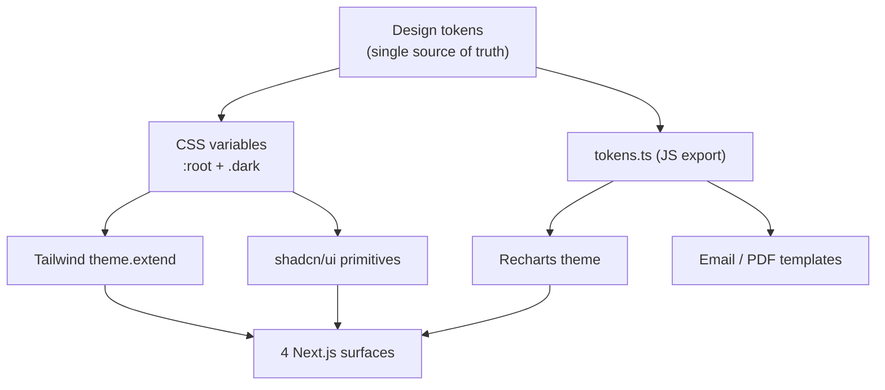
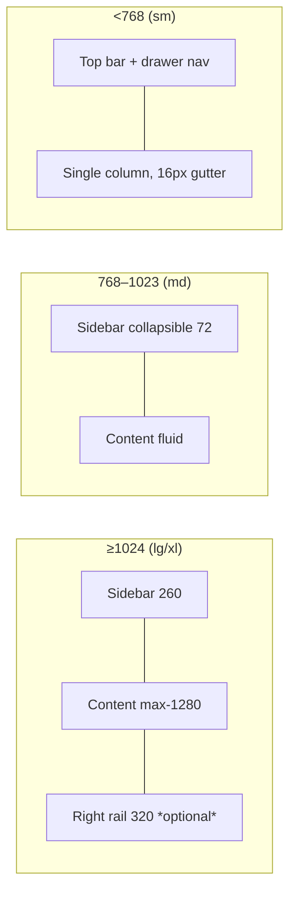
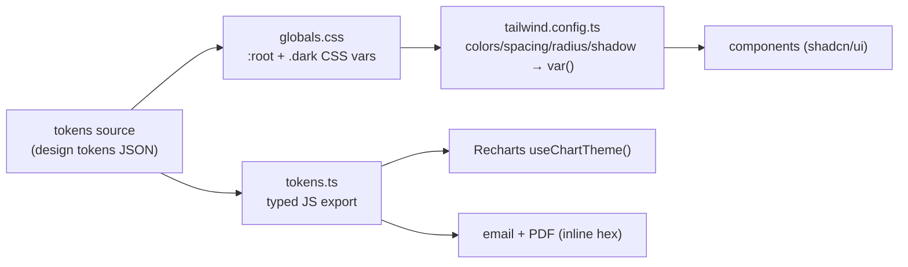

# Design System Specification

The Postpin design system is the shared visual and interaction language that keeps all four surfaces — Marketing website, User Dashboard, Super Admin portal, and API Documentation portal — coherent while letting each feel purpose-built. It is **token-first**: every color, type step, space, radius, shadow, and motion duration is a named CSS variable, so a single source of truth drives Tailwind, shadcn/ui primitives, Recharts themes, and email templates alike. The brand is bold and vibrant — a violet→purple→fuchsia gradient (`#7C3AED → #9333EA → #DB2777`) carried on display type (Space Grotesk), a clean UI/body face (Inter), and a code/data face (JetBrains Mono). Light is the default theme with a fully specified dark counterpart; everything meets WCAG **AA**, respects `prefers-reduced-motion`, and uses animated Lucide iconography with consistent stroke weights. This document is the canonical build-from reference: copy the tokens verbatim, follow the component usage rules, and do not introduce ad-hoc hex values, font sizes, or one-off shadows.

## Contents

- [1. Principles & Foundations](#1-principles--foundations)
- [2. Color System (Semantic Tokens, Light + Dark)](#2-color-system-semantic-tokens-light--dark)
- [3. The Brand Gradient & Glow](#3-the-brand-gradient--glow)
- [4. Full Token Table (Hex, Light & Dark)](#4-full-token-table-hex-light--dark)
- [5. Typography](#5-typography)
- [6. Spacing Scale (4/8)](#6-spacing-scale-48)
- [7. Radius Scale](#7-radius-scale)
- [8. Elevation & Shadow Scale](#8-elevation--shadow-scale)
- [9. Grid System & Breakpoints](#9-grid-system--breakpoints)
- [10. Component Catalog](#10-component-catalog)
- [11. Charts (Recharts Theming)](#11-charts-recharts-theming)
- [12. Motion Principles](#12-motion-principles)
- [13. Iconography (Animated Lucide)](#13-iconography-animated-lucide)
- [14. Accessibility Rules](#14-accessibility-rules)
- [15. Token Distribution & Implementation](#15-token-distribution--implementation)
- [16. Cross-references](#16-cross-references)

---

## 1. Principles & Foundations

Six principles govern every design decision. When a tradeoff is unclear, resolve it in this priority order.

| # | Principle | What it means in practice |
|---|---|---|
| 1 | **Token-first, never ad-hoc** | No raw hex, px font size, or one-off shadow in component code. If a value isn't a token, it doesn't ship. New values are added to the token set first. |
| 2 | **Light by default, dark at parity** | Light theme is the design baseline; dark is a first-class, fully-specified twin — not an afterthought inversion. Both are tested for AA. |
| 3 | **Data is the hero** | This is logistics infrastructure. Numbers (INR amounts, weights, latencies, pincodes) get the most legible treatment: tabular numerals, mono where precision matters, generous alignment. |
| 4 | **Bold brand, calm surfaces** | The violet→fuchsia gradient is a punctuation mark — primary CTAs, key headings, focus accents — not a wash. Working surfaces (tables, forms) stay neutral so data reads. |
| 5 | **Motion explains, never decorates** | Animation communicates state change, hierarchy, and spatial origin. 150–300ms, ease-out for entrances. Honors `prefers-reduced-motion`. |
| 6 | **Accessible or incomplete** | AA contrast, visible focus rings, full keyboard operability, and correct ARIA are acceptance criteria, not polish. |

**Stack binding.** Tokens are declared as CSS custom properties on `:root` (light) and `.dark` (dark), consumed by Tailwind via `theme.extend` referencing `var(--token)`, by shadcn/ui components, and exported as a JS object for Recharts and canvas/SVG contexts that can't read CSS vars. See [§15](#15-token-distribution--implementation).



---

## 2. Color System (Semantic Tokens, Light + Dark)

Colors are split into three tiers. **Never** reference a primitive ramp (e.g. `violet-600`) directly in a component — always go through a semantic token (e.g. `--primary`). This is what lets dark mode and future re-skins work.

### 2.1 Tiers

1. **Primitive ramps** — raw scales (`violet`, `purple`, `fuchsia`, `neutral`, plus status hues). Internal; never used directly in JSX.
2. **Semantic tokens** — role-named, theme-aware (`--background`, `--foreground`, `--primary`, `--muted`, `--border`, `--ring`, `--card`, …). These are what components use.
3. **Component tokens** — optional, derived for specific widgets when semantics aren't enough (`--sidebar-bg`, `--code-bg`, `--chart-1…6`).

### 2.2 Semantic role map (shadcn-aligned, extended)

| Token | Role | Paired text token |
|---|---|---|
| `--background` / `--foreground` | App canvas + default text | — |
| `--card` / `--card-foreground` | Card/panel surface | — |
| `--popover` / `--popover-foreground` | Floating surfaces (dropdown, tooltip, dialog) | — |
| `--primary` / `--primary-foreground` | Brand actions, primary CTA solid, active states | — |
| `--secondary` / `--secondary-foreground` | Secondary buttons, subtle chips | — |
| `--muted` / `--muted-foreground` | Low-emphasis surfaces + helper/placeholder text | — |
| `--accent` / `--accent-foreground` | Hover fills, selected rows, highlight wash | — |
| `--destructive` / `--destructive-foreground` | Delete/danger | — |
| `--success` / `--warning` / `--info` | Status fills (see status colors) | each has `-foreground` |
| `--border` | Hairlines, dividers, input borders | — |
| `--input` | Input border (distinct from `--border` for focus) | — |
| `--ring` | Focus ring (brand violet) | — |

### 2.3 Status colors (fixed brand decision)

These are constant across surfaces and tuned per theme for AA-on-surface contrast. Light uses the saturated base for fills; dark lightens fills and uses tinted text on translucent backgrounds.

| Status | Meaning in Postpin | Light fill | Dark fill |
|---|---|---|---|
| **Success** | Sync OK, payment captured, key active, request 2xx | `#16A34A` | `#22C55E` |
| **Warning** | Quota ≥80%, sync degraded, plan expiring | `#D97706` | `#F59E0B` |
| **Info** | Neutral notice, new feature, scheduled sync | `#2563EB` | `#3B82F6` |
| **Destructive** | Failed sync, 5xx spike, payment failed, delete | `#DC2626` | `#EF4444` |

**Usage rule:** never encode status by color alone — pair with an icon and/or text label (see [§14](#14-accessibility-rules)). A failed sync row shows a red `CircleAlert` icon **and** the word "Failed."

### 2.4 Surface ramp (light & dark)

Surfaces step from canvas up through cards to floating layers. In light, surfaces get *lighter/whiter* as they rise; in dark they get *lighter-gray* (never use pure black `#000` — dark canvas is `#0A0A0F`, a violet-tinted near-black).

| Elevation | Light | Dark |
|---|---|---|
| Canvas (`--background`) | `#FAFAFB` | `#0A0A0F` |
| Sunken (wells, code bg) | `#F4F4F6` | `#08080C` |
| Card (`--card`) | `#FFFFFF` | `#141420` |
| Raised (popover/dialog) | `#FFFFFF` | `#1B1B2A` |

---

## 3. The Brand Gradient & Glow

The signature mark is a 3-stop linear gradient. It is the only place all three brand hues appear together.

```css
/* Canonical brand gradient — 135deg unless context demands otherwise */
--gradient-brand: linear-gradient(135deg, #7C3AED 0%, #9333EA 50%, #DB2777 100%);

/* Subtle wash for large fills (hero backdrops, glass headers) */
--gradient-brand-soft: linear-gradient(135deg,
  color-mix(in srgb, #7C3AED 14%, transparent) 0%,
  color-mix(in srgb, #DB2777 14%, transparent) 100%);

/* Text gradient — clip to glyphs for hero numbers / wordmark */
--gradient-brand-text: linear-gradient(135deg, #7C3AED 0%, #DB2777 100%);
```

**Where the gradient is allowed**

| Allowed | Forbidden |
|---|---|
| Primary CTA buttons (filled) | Body text, table cells |
| Hero headline / large stat numbers (text-clip) | Form input fills |
| Active nav indicator, progress bars | Large flat page backgrounds (use `-soft`) |
| Brand glow on focus/hover of primary CTA | Behind small (<14px) text — fails contrast |
| Chart "primary series" accent stroke | Destructive/danger surfaces |

**Brand glow shadow** — the gradient's energy expressed as a colored shadow, used on hover/focus of primary CTAs and key cards. It is a token (`--shadow-glow`), never inlined.

```css
--shadow-glow: 0 0 0 1px color-mix(in srgb, #9333EA 24%, transparent),
               0 8px 24px -6px color-mix(in srgb, #7C3AED 45%, transparent),
               0 2px 8px -2px color-mix(in srgb, #DB2777 35%, transparent);
```

Text-gradient implementation (with an accessible fallback so screen readers and forced-colors mode get a solid color):

```css
.text-gradient {
  color: #7C3AED;                 /* fallback / forced-colors */
  background: var(--gradient-brand-text);
  -webkit-background-clip: text;
  background-clip: text;
  -webkit-text-fill-color: transparent;
}
@media (forced-colors: active) {
  .text-gradient { -webkit-text-fill-color: currentColor; }
}
```

---

## 4. Full Token Table (Hex, Light & Dark)

The complete semantic palette. **HSL** is the storage format in CSS (so opacity-mix and per-channel tweaks are easy); hex is given for designer reference. Foreground tokens are chosen to clear **4.5:1** against their paired surface (3:1 for large/UI).

### 4.1 Core semantic tokens

| Token | Light hex | Light HSL | Dark hex | Dark HSL |
|---|---|---|---|---|
| `--background` | `#FAFAFB` | `240 11% 98%` | `#0A0A0F` | `240 20% 5%` |
| `--foreground` | `#0F0F14` | `240 16% 7%` | `#F4F4F7` | `240 14% 96%` |
| `--card` | `#FFFFFF` | `0 0% 100%` | `#141420` | `240 22% 10%` |
| `--card-foreground` | `#0F0F14` | `240 16% 7%` | `#F4F4F7` | `240 14% 96%` |
| `--popover` | `#FFFFFF` | `0 0% 100%` | `#1B1B2A` | `240 22% 13%` |
| `--popover-foreground` | `#0F0F14` | `240 16% 7%` | `#F4F4F7` | `240 14% 96%` |
| `--primary` | `#7C3AED` | `262 83% 58%` | `#8B5CF6` | `258 90% 66%` |
| `--primary-foreground` | `#FFFFFF` | `0 0% 100%` | `#FFFFFF` | `0 0% 100%` |
| `--secondary` | `#F3F0FB` | `258 56% 96%` | `#241B3A` | `258 36% 17%` |
| `--secondary-foreground` | `#5B21B6` | `263 70% 42%` | `#D6C8FB` | `258 80% 88%` |
| `--muted` | `#F2F2F4` | `240 9% 95%` | `#1A1A26` | `240 20% 12%` |
| `--muted-foreground` | `#62626E` | `240 6% 41%` | `#9B9BAC` | `240 9% 64%` |
| `--accent` | `#F3E8FF` | `270 100% 95%` | `#2A2140` | `258 32% 19%` |
| `--accent-foreground` | `#6B21A8` | `272 68% 39%` | `#E2D6FB` | `262 80% 91%` |
| `--border` | `#E6E6EA` | `240 8% 91%` | `#2A2A3A` | `240 16% 20%` |
| `--input` | `#DCDCE3` | `240 10% 88%` | `#33333F` | `240 11% 23%` |
| `--ring` | `#7C3AED` | `262 83% 58%` | `#A78BFA` | `255 92% 76%` |

### 4.2 Status tokens

| Token | Light hex | Dark hex |
|---|---|---|
| `--success` | `#16A34A` | `#22C55E` |
| `--success-foreground` | `#FFFFFF` | `#06210F` |
| `--success-subtle` (bg) | `#E7F6EC` | `#0E2A18` |
| `--warning` | `#D97706` | `#F59E0B` |
| `--warning-foreground` | `#FFFFFF` | `#2A1A03` |
| `--warning-subtle` (bg) | `#FCF1E2` | `#2E1F07` |
| `--info` | `#2563EB` | `#3B82F6` |
| `--info-foreground` | `#FFFFFF` | `#0A1A33` |
| `--info-subtle` (bg) | `#E6EEFD` | `#0E1E3E` |
| `--destructive` | `#DC2626` | `#EF4444` |
| `--destructive-foreground` | `#FFFFFF` | `#2A0707` |
| `--destructive-subtle` (bg) | `#FCE9E9` | `#2E0C0C` |

`-subtle` backgrounds pair with the saturated hue as *text* to make low-noise status banners and badges that still pass AA (e.g. success badge = `--success` text on `--success-subtle` fill).

### 4.3 Brand & gradient tokens

| Token | Light | Dark |
|---|---|---|
| `--brand-violet` | `#7C3AED` | `#8B5CF6` |
| `--brand-purple` | `#9333EA` | `#A855F7` |
| `--brand-fuchsia` | `#DB2777` | `#EC4899` |
| `--gradient-brand` | `linear-gradient(135deg,#7C3AED,#9333EA,#DB2777)` | `linear-gradient(135deg,#8B5CF6,#A855F7,#EC4899)` |
| `--shadow-glow` | violet/fuchsia glow (see §3) | brightened glow, +alpha |

### 4.4 Chart series tokens

Six categorical series, ordered for max perceptual separation; series 1 is the brand violet so "primary metric" reads on-brand. All clear 3:1 against both canvases.

| Token | Light | Dark | Typical use |
|---|---|---|---|
| `--chart-1` | `#7C3AED` | `#A78BFA` | Primary metric (requests, revenue) |
| `--chart-2` | `#DB2777` | `#F472B6` | Secondary metric |
| `--chart-3` | `#2563EB` | `#60A5FA` | Tertiary / comparison |
| `--chart-4` | `#16A34A` | `#34D399` | Success / 2xx |
| `--chart-5` | `#D97706` | `#FBBF24` | Warning / 4xx |
| `--chart-6` | `#0D9488` | `#2DD4BF` | Quaternary (teal) |

Error/5xx series in charts always uses `--destructive`.

---

## 5. Typography

Three typefaces, each with one job. Load via `next/font` (self-hosted, `display: swap`), exposed as CSS variables `--font-display`, `--font-sans`, `--font-mono`.

| Family | Variable | Role | Weights loaded |
|---|---|---|---|
| **Space Grotesk** | `--font-display` | Hero, h1–h3, wordmark, big stat numbers | 500, 600, 700 |
| **Inter** | `--font-sans` | Body, UI labels, buttons, table text, forms | 400, 500, 600, 700 |
| **JetBrains Mono** | `--font-mono` | Code blocks, API keys, pincodes, IDs, JSON, table numerals | 400, 500, 600 |

Inter is loaded with `cv05`, `cv08`, `ss03` and `tnum` (tabular numerals) features enabled for UI; mono is used wherever digit alignment is load-bearing (rate cards, invoices, latency tables).

### 5.1 Type scale

Sizes use `rem` (root = 16px). Line-heights are unitless. Letter-spacing (tracking) tightens as size grows (display optical correction) and opens slightly for all-caps labels.

| Token | Use | Family | Size (rem / px) | Weight | Line-height | Tracking |
|---|---|---|---|---|---|---|
| `text-hero` | Marketing hero | Space Grotesk | `3.75 / 60` (clamp to `2.5/40` mobile) | 700 | 1.05 | `-0.02em` |
| `text-h1` | Page title | Space Grotesk | `2.25 / 36` | 700 | 1.15 | `-0.02em` |
| `text-h2` | Section | Space Grotesk | `1.75 / 28` | 600 | 1.20 | `-0.015em` |
| `text-h3` | Subsection / card title | Space Grotesk | `1.375 / 22` | 600 | 1.30 | `-0.01em` |
| `text-h4` | Group label | Inter | `1.125 / 18` | 600 | 1.40 | `-0.005em` |
| `text-h5` | Small heading | Inter | `1.0 / 16` | 600 | 1.45 | `0` |
| `text-body-lg` | Lead paragraph | Inter | `1.125 / 18` | 400 | 1.65 | `0` |
| `text-body` | Default body | Inter | `1.0 / 16` | 400 | 1.6 | `0` |
| `text-body-sm` | Secondary / dense UI | Inter | `0.875 / 14` | 400 | 1.55 | `0` |
| `text-label` | Form labels, table headers | Inter | `0.8125 / 13` | 500 | 1.4 | `0.01em` |
| `text-caption` | Helper, meta, timestamps | Inter | `0.75 / 12` | 400 | 1.45 | `0.01em` |
| `text-overline` | All-caps eyebrow | Inter | `0.6875 / 11` | 600 | 1.4 | `0.08em` (uppercase) |
| `text-mono` | Code / data inline | JetBrains Mono | `0.8125 / 13` | 400 | 1.55 | `0` |
| `text-mono-block` | Code block body | JetBrains Mono | `0.875 / 14` | 400 | 1.7 | `0` |

### 5.2 Rules

- **One display face per heading cluster.** Don't mix Space Grotesk and Inter within a single heading.
- **Hero/big numbers** (e.g. dashboard "1.24M requests") use Space Grotesk 700 with `tnum` and may use `--gradient-brand-text`.
- **Money & data** (INR `₹12,480.00`, weights `1.20 kg`, latency `42 ms`, pincode `560001`) use mono or tabular Inter and are **right-aligned** in tables.
- **Max line length** for body copy: `65ch` (`--measure: 65ch`). Documentation prose: `72ch`.
- **Never** set body below `text-body-sm` (14px) for primary reading content; 12px is reserved for meta only.

```css
/* INR formatter pairs with tabular numerals */
.amount { font-variant-numeric: tabular-nums; font-feature-settings: "tnum"; text-align: right; }
```

---

## 6. Spacing Scale (4/8)

A single 4px base scale; 8px is the default rhythm. Tokens are `--space-{n}` where the px value is the name. Use the scale for padding, margin, and gap — never arbitrary values.

| Token | px | rem | Typical use |
|---|---|---|---|
| `--space-0` | 0 | 0 | reset |
| `--space-1` | 4 | 0.25 | icon-to-text gap, tight inline |
| `--space-2` | 8 | 0.5 | default gap, badge padding |
| `--space-3` | 12 | 0.75 | input vertical padding, list gap |
| `--space-4` | 16 | 1.0 | card padding (compact), button x-padding |
| `--space-5` | 20 | 1.25 | between form fields |
| `--space-6` | 24 | 1.5 | card padding (default), section gap |
| `--space-8` | 32 | 2.0 | between cards, panel padding |
| `--space-10` | 40 | 2.5 | sub-section spacing |
| `--space-12` | 48 | 3.0 | section vertical rhythm |
| `--space-16` | 64 | 4.0 | major section gap (dashboard) |
| `--space-20` | 80 | 5.0 | marketing block spacing |
| `--space-24` | 96 | 6.0 | hero vertical padding |
| `--space-32` | 128 | 8.0 | marketing hero / footer gap |

**Layout constants**

| Constant | Value | Notes |
|---|---|---|
| Dashboard sidebar width | `260px` (collapsed `72px`) | |
| Top bar height | `56px` | |
| Content max-width (dashboard) | `1280px` | |
| Content max-width (marketing) | `1200px` | |
| Content max-width (docs) | `1440px` (3-col) | nav · content · TOC |
| Default card padding | `--space-6` (24) | compact tables use `--space-4` |
| Table row height | `48px` default, `40px` dense | |
| Gutter (page edge, mobile) | `--space-4` (16) | |
| Gutter (page edge, desktop) | `--space-8` (32) | |

---

## 7. Radius Scale

Base radius is **0.75rem (12px)** — the `--radius` anchor. Other steps derive from it so changing the base re-proportions everything.

| Token | Value | Use |
|---|---|---|
| `--radius-xs` | `calc(var(--radius) - 8px)` = `4px` | badges, tags, inline chips |
| `--radius-sm` | `calc(var(--radius) - 4px)` = `8px` | inputs, small buttons, table cells |
| `--radius` (base) | `0.75rem` = `12px` | buttons, cards, inputs (default) |
| `--radius-md` | `calc(var(--radius) + 2px)` = `14px` | cards (default) |
| `--radius-lg` | `calc(var(--radius) + 4px)` = `16px` | dialogs, large panels |
| `--radius-xl` | `1.5rem` = `24px` | hero cards, feature tiles |
| `--radius-2xl` | `2rem` = `32px` | marketing media frames |
| `--radius-full` | `9999px` | pills, avatars, switch tracks, icon buttons |

Rule: nested radii decrease inward by one step (a `--radius-lg` card containing a `--radius-sm` input) to keep visual concentricity.

---

## 8. Elevation & Shadow Scale

Six elevation steps plus the brand glow. Shadows are warmer/softer in light and use deeper, larger-blur, lower-alpha shadows in dark (dark UIs need shadow + a subtle lighter border to read). Each token bundles the dark variant.

| Token | Light value | Dark value | Use |
|---|---|---|---|
| `--shadow-xs` | `0 1px 2px rgba(16,16,24,.06)` | `0 1px 2px rgba(0,0,0,.5)` | hairline lift, inputs |
| `--shadow-sm` | `0 1px 3px rgba(16,16,24,.08), 0 1px 2px rgba(16,16,24,.04)` | `0 2px 6px rgba(0,0,0,.55)` | cards at rest |
| `--shadow-md` | `0 4px 12px -2px rgba(16,16,24,.10), 0 2px 6px -2px rgba(16,16,24,.06)` | `0 6px 16px -4px rgba(0,0,0,.6)` | dropdowns, hover cards |
| `--shadow-lg` | `0 12px 28px -6px rgba(16,16,24,.14), 0 4px 12px -4px rgba(16,16,24,.08)` | `0 16px 36px -8px rgba(0,0,0,.65)` | popovers, sheets |
| `--shadow-xl` | `0 24px 56px -12px rgba(16,16,24,.20)` | `0 28px 64px -12px rgba(0,0,0,.7)` | dialogs, command palette |
| `--shadow-2xl` | `0 40px 88px -16px rgba(16,16,24,.26)` | `0 44px 96px -20px rgba(0,0,0,.75)` | hero/marketing modals |
| `--shadow-glow` | brand violet→fuchsia glow (see [§3](#3-the-brand-gradient--glow)) | brightened, +6% alpha | primary CTA hover/focus, featured plan card |
| `--shadow-focus` | `0 0 0 3px color-mix(in srgb, var(--ring) 35%, transparent)` | same w/ lighter ring | focus ring outer glow |

In dark mode, raised surfaces also add `border: 1px solid var(--border)` because shadow alone is weak on dark canvases. Inputs use `inset` shadow at rest (`--shadow-xs` inset) for a recessed field feel.

---

## 9. Grid System & Breakpoints

Four named breakpoints map to the canonical device widths. Mobile-first: base styles target 390 and scale up.

| Name | Min-width | Reference device | Columns | Margin | Gutter |
|---|---|---|---|---|---|
| `sm` (mobile) | `390px` | iPhone 14/15 | 4 | 16 | 16 |
| `md` (tablet) | `768px` | iPad portrait | 8 | 24 | 20 |
| `lg` (laptop) | `1024px` | small laptop | 12 | 32 | 24 |
| `xl` (desktop) | `1440px` | desktop/large | 12 | auto (max-width centered) | 24 |

Tailwind screens map exactly: `sm:390px md:768px lg:1024px xl:1440px` (override defaults). An additional `2xl:1600px` exists for ultra-wide marketing only.

**Layout patterns**

| Surface | Pattern |
|---|---|
| Dashboard | Fixed sidebar (260px) + fluid content (max 1280, centered) + optional right rail (320px) on detail pages |
| Marketing | Centered 12-col, content max 1200, full-bleed hero sections |
| Docs | 3-column: left nav (240) · content (max 760) · right TOC (220), collapses to single column below `lg` |
| Super Admin | Same shell as Dashboard; denser tables, more 12-col data grids |



Responsive behaviors: sidebar collapses to icon-rail at `md`, becomes an off-canvas drawer at `sm`; data tables switch to stacked "card rows" below `md`; multi-column forms become single-column below `md`.

---

## 10. Component Catalog

Every component below is built on shadcn/ui primitives (Radix under the hood) themed with the tokens above. Each ships with a `data-testid` per the global convention (`{feature}-{element}-{type}`). Usage rules are non-negotiable build constraints.

### 10.1 Buttons

| Variant | Appearance | When to use | Don'ts |
|---|---|---|---|
| `gradient` (primary CTA) | `--gradient-brand` fill, white text, `--shadow-glow` on hover | The single most important action on a view (Sign up, Calculate, Create key) | Max **one** per primary view region. Never for destructive. |
| `default` (solid) | `--primary` fill, `--primary-foreground` | Primary action when gradient is too loud (in-table, dense forms) | — |
| `secondary` | `--secondary` fill, `--secondary-foreground` | Secondary parallel action | — |
| `outline` | `--border` ring, transparent fill, `--foreground` | Tertiary, "Cancel" alongside a primary | — |
| `ghost` | no fill until hover (`--accent`) | Toolbar, icon+label, low emphasis | — |
| `link` | text + underline-on-hover, `--primary` | Inline navigation | Don't use for form submit |
| `destructive` | `--destructive` fill | Delete, revoke key, cancel subscription | Always confirm in a dialog |

**Sizes:** `sm` (h-32, text-13, px-12), `default` (h-40, text-14, px-16), `lg` (h-44, text-15, px-20), `icon` (square, h-40). Loading state swaps leading icon for an animated `Loader2` spinner and sets `aria-busy`, disabling pointer events but keeping width stable (no layout shift). Radius `--radius`; icon buttons `--radius-sm`.

```jsx
<Button data-testid="rate-calculate-btn" variant="gradient" size="lg">
  <Calculator className="size-[18px]" /> Calculate
</Button>
```

### 10.2 Inputs & Forms

- **Field anatomy:** label (`text-label`) → control → helper/error (`text-caption`). Label always present (placeholder is never a substitute).
- Input height `40px`, radius `--radius-sm`, border `--input`, inset `--shadow-xs`. Focus: border→`--ring` + `--shadow-focus`.
- **States:** default, hover (border darkens one step), focus (ring), disabled (`--muted`, 60% opacity, no shadow), error (`--destructive` border + helper text + `aria-invalid` + `aria-describedby` linking the message), success (subtle `--success` border on async-validated fields like pincode).
- **Pincode/mono fields** (pickup/delivery pincode, API key) render in `--font-mono`.
- Controls covered: `Input`, `Textarea`, `Select`, `Combobox` (async pincode search), `Checkbox`, `RadioGroup`, `Switch` (COD/Prepaid, auto-sync toggle), `Slider` (weight), `DatePicker`, `OTPInput`.
- Every control gets `data-testid`; groups get a form-container testid (e.g. `rate-calculator-form`).

```jsx
<div className="space-y-1.5">
  <Label htmlFor="pickup" data-testid="rate-pickup-label">Pickup pincode</Label>
  <Input id="pickup" inputMode="numeric" maxLength={6}
         className="font-mono" data-testid="rate-pickup-input" />
  <p className="text-caption text-destructive" data-testid="rate-pickup-error">…</p>
</div>
```

### 10.3 Cards

Surface `--card`, radius `--radius-md`, `--shadow-sm`, padding `--space-6`. Hover-elevation (`--shadow-md`) only for interactive/clickable cards. Sub-parts: `CardHeader` (title `text-h3` + optional action), `CardContent`, `CardFooter`. **Featured/recommended plan card** is the one place a card may carry `--shadow-glow` and a gradient top border.

### 10.4 Tables

The workhorse of the dashboard and admin. Rules:

- Header row: `text-label`, `--muted-foreground`, sticky on scroll, `--muted` background.
- Numeric columns (amount, weight, latency, count) **right-aligned**, tabular/mono.
- Row height 48 (default) / 40 (dense, admin). Zebra optional; prefer hairline `--border` dividers.
- Hover row: `--accent` wash. Selected row: `--accent` + left `--primary` 2px bar.
- Built-ins: sortable headers (animated `ChevronsUpDown`→`ArrowUp/Down`), pagination, column visibility, row selection (checkbox), sticky first column on horizontal scroll, empty state inside the table body, loading = skeleton rows.
- Below `md`, collapse to stacked card-rows (label:value pairs).
- Each data row gets `data-testid={`{feature}-row-${stableId}`}` (e.g. `apikeys-row-pk_live_a1b2`), never array index.

### 10.5 Badges / Pills

`--radius-full`, `text-overline`-ish (`text-caption` 500, optional uppercase), padding `2 8`. Variants map to status: `success`, `warning`, `info`, `destructive` (each = saturated text on `-subtle` bg), plus `neutral` (`--muted`) and `brand` (gradient outline). Always icon + text for status (e.g. green dot + "Active"). Plan badges (`Free`, `Pro`, `Scale`) use `brand` outline.

### 10.6 Tabs

Underline style (animated indicator that slides via layout animation) for content switching; pill/segmented style for filters (e.g. `7d / 30d / 90d`). Active tab `--foreground` + brand underline; inactive `--muted-foreground`. Keyboard: arrow keys move, `Home/End` jump, `Tab` exits. `role="tablist"` and `aria-selected` from Radix.

### 10.7 Dialogs (Modal)

`--popover` surface, radius `--radius-lg`, `--shadow-xl`, overlay `rgba(10,10,15,.55)` + `backdrop-blur(2px)`. Width tiers: `sm 420`, `md 560`, `lg 720`. Entrance: overlay fades (150ms), content scales `0.96→1` + fades (200ms ease-out). Focus trapped, returns to trigger on close, `Esc` closes, title is `aria-labelledby`. Destructive confirmations use a dialog with the destructive button on the right and require the action verb in the body ("This permanently revokes key pk_live_…").

### 10.8 Drawers / Sheets

Side sheet (right by default) for detail/edit without losing context (view API log, edit rate card, sync log detail). Width `420`/`560`; full-height; slides in `translateX(100%→0)` 250ms ease-out. On mobile, drawers anchor bottom and slide up; nav drawer anchors left. Same focus-trap rules as dialogs.

### 10.9 Toasts (Sonner)

Top-right (desktop), top-center (mobile). Variants: `success`, `error`, `warning`, `info`, `loading`→resolve (promise toasts for async like "Syncing pincodes…" → "Synced 412 pincodes"). Auto-dismiss 4s (errors 6s, sticky if actionable). Max 3 stacked; older collapse. Icon + message + optional action button + close. `aria-live="polite"` (`assertive` for errors). Never use a toast for critical confirms that need a decision — use a dialog.

### 10.10 Tooltips

For supplementary, non-essential hints only (never the sole carrier of critical info). `--popover` mini surface, `text-caption`, `--shadow-md`, 6px offset, 150ms delay-in / 0 delay-out. Triggered on hover **and** focus (keyboard accessible). Use for icon-only buttons, truncated cells, metric definitions.

### 10.11 Dropdowns / Menus

`--popover` surface, `--shadow-lg`, radius `--radius`, item height 36, hover `--accent`. Supports sections, separators, icons (leading), shortcuts (trailing mono), checkbox/radio items, and destructive items (red text). Full keyboard nav, typeahead, `Esc` to close. Command palette (`⌘K`) is a searchable dropdown variant with `--shadow-xl`.

### 10.12 Skeleton Loaders

Match the final layout's shape and dimensions exactly (no generic gray box). Fill `--muted` with a shimmer sweep (1.5s, left-to-right gradient) **disabled under reduced-motion** (falls back to a gentle opacity pulse). Use for tables (row skeletons), cards (stat-card skeletons), and charts (axis + bar placeholders). Show only after ~200ms of pending to avoid flash.

### 10.13 Empty States

Centered, in-container. Anatomy: animated Lucide illustration-icon (48–56px, brand-tinted) → `text-h4` title → `text-body-sm` `--muted-foreground` description → primary action. Distinguish **empty** (no data yet — "Create your first API key") from **no-results** (filter returned nothing — offer "Clear filters") from **error** (something failed — offer "Retry"). Each state has a distinct testid (`apikeys-empty-state`).

### 10.14 Stat Cards

The dashboard's headline metric tiles. Anatomy: label (`text-label` `--muted-foreground`) → value (Space Grotesk 700, tabular, optional gradient-text for the hero KPI) → delta chip (`success`/`destructive` with `TrendingUp/Down`, "+12.4% vs last week") → optional sparkline (`--chart-1`, no axes). Padding `--space-6`, radius `--radius-md`, `--shadow-sm`. The single primary KPI per dashboard may use `--gradient-brand-text` on its value.

```jsx
<Card data-testid="overview-requests-stat">
  <p className="text-label text-muted-foreground">Total requests (30d)</p>
  <p className="text-h1 font-display text-gradient tabular-nums">1.24M</p>
  <span className="badge-success"><TrendingUp className="size-3.5"/> +12.4%</span>
</Card>
```

### 10.15 Code Blocks

For the docs portal and "copy this snippet" surfaces. Surface `--code-bg` (light `#1B1B2A` even in light theme — code reads best dark; or a light variant `#F6F6FB` toggle), `--font-mono` (`text-mono-block`), radius `--radius`. Top bar with language label + copy button (`Copy`→animated `Check` on success). Syntax theme: keywords `--brand-purple`, strings `--success`, numbers `--warning`, comments `--muted-foreground`. Inline code uses `--muted` bg, `--accent-foreground`, `--radius-xs`. Line numbers optional; highlighted lines get a `--primary` 2px left bar + subtle wash. API keys in examples are masked (`pk_live_••••a1b2`) with a reveal toggle.

---

## 11. Charts (Recharts Theming)

Recharts can't read CSS variables in its SVG, so charts consume the **`tokens.ts`** JS export resolved for the active theme (a `useChartTheme()` hook returns the right object). Conventions:

| Element | Treatment |
|---|---|
| Series colors | `--chart-1…6` in order; primary metric always `--chart-1` (brand violet) |
| Area fills | Linear gradient of the series color, `28% → 2%` alpha vertical |
| Grid | Horizontal lines only, `--border`, dashed `3 3`; no vertical grid, no box border |
| Axes | `--muted-foreground` `text-caption`, tick labels tabular; hide axis lines, keep ticks subtle |
| Tooltip | Custom component using `--popover` + `--shadow-lg`, `text-body-sm`, color swatch per series, INR/units formatted `en-IN` |
| Cursor | `--muted` translucent bar (bar/area) or `--border` dashed line (line) |
| Legend | Top-right, `text-caption`, interactive (click to toggle series) |
| Empty/no-data | Chart-shaped empty state, not a blank SVG |
| Animation | 300ms ease-out enter; disabled under reduced-motion (renders final frame) |

Chart catalog: **line/area** (requests over time, latency p50/p95), **bar** (requests by endpoint, top pincodes), **stacked bar** (2xx/4xx/5xx by day), **donut** (zone distribution, plan mix), **sparkline** (stat cards). Money axes format `₹` with `en-IN` grouping; large counts abbreviate (`1.24M`, `412k`). See [API Analytics](08-api-analytics.md) for the metric definitions these render.

```ts
// tokens.ts (excerpt) — resolved per theme for Recharts/canvas
export const chartTheme = {
  light: { series: ['#7C3AED','#DB2777','#2563EB','#16A34A','#D97706','#0D9488'],
           grid: '#E6E6EA', axis: '#62626E', tooltipBg: '#FFFFFF', tooltipFg: '#0F0F14' },
  dark:  { series: ['#A78BFA','#F472B6','#60A5FA','#34D399','#FBBF24','#2DD4BF'],
           grid: '#2A2A3A', axis: '#9B9BAC', tooltipBg: '#1B1B2A', tooltipFg: '#F4F4F7' },
} as const;
```

---

## 12. Motion Principles

Motion is functional. Durations live in tokens; nothing is hand-tuned per component.

### 12.1 Duration & easing tokens

| Token | Value | Use |
|---|---|---|
| `--ease-out` | `cubic-bezier(0.16, 1, 0.3, 1)` | Entrances, expansions (decelerate in) |
| `--ease-in-out` | `cubic-bezier(0.65, 0, 0.35, 1)` | Moves, reorders, tab indicator |
| `--ease-spring` | spring `stiffness 320, damping 30` (Framer Motion) | Playful brand moments, icon micro-interactions |
| `--dur-1` | `120ms` | Hover/tap feedback, color/opacity |
| `--dur-2` | `180ms` | Dropdowns, tooltips, small reveals |
| `--dur-3` | `220ms` | Dialogs, popovers, accordions |
| `--dur-4` | `280ms` | Sheets/drawers, page section reveals |
| `--dur-5` | `360ms` | Large/marketing transitions (sparingly) |

Rule: keep interaction feedback in the **150–300ms** band; entrances ease-*out*, exits faster (≈0.7× the enter duration) and may ease-in.

### 12.2 Patterns

- **Entrance:** fade + 4–8px translate (up for lists, from-edge for sheets) + scale `0.98→1` for modals.
- **Stagger:** list/grid children enter with a `40ms` step (cap total at ~240ms so long lists don't crawl). Used for stat-card rows, table first-paint, nav items.
- **Layout/shared element:** tab underline and selected-row bar animate via layout animation, not opacity swaps.
- **Number tick-up:** stat-card values count up to their value on first paint (≤500ms, eased), skipped under reduced-motion (renders final value).
- **Icon micro-interactions:** see [§13](#13-iconography-animated-lucide).
- **Skeleton shimmer:** 1.5s linear sweep; pulse fallback under reduced-motion.

### 12.3 Reduced motion (mandatory)

```css
@media (prefers-reduced-motion: reduce) {
  *, *::before, *::after {
    animation-duration: 0.01ms !important;
    animation-iteration-count: 1 !important;
    transition-duration: 0.01ms !important;
    scroll-behavior: auto !important;
  }
}
```

Framer Motion components additionally read `useReducedMotion()` and render the final state directly (no count-up, no shimmer, no stagger). Essential feedback (focus ring, error appearance) still shows — it just doesn't animate.

---

## 13. Iconography (Animated Lucide)

All icons are **Lucide**, animated by default — no static icons anywhere per the brand spec.

| Property | Value |
|---|---|
| Library | `lucide-react` |
| Stroke width | `1.75` default; `2` for small (≤16px) or emphasis |
| Sizes (tokens) | `--icon-xs 14`, `--icon-sm 16`, `--icon-md 18` (default in buttons), `--icon-lg 20`, `--icon-xl 24`, illustration `32–56` |
| Color | `currentColor` (inherits text token); brand-tinted only for feature/empty-state illustration icons |
| Alignment | Optically centered with text; icon-to-label gap `--space-2` |

**Animation rules**

- **Hover/active micro-interactions** via Framer Motion `whileHover`/`whileTap`: e.g. `RefreshCw` spins on sync hover, `ArrowRight` nudges +2px on CTA hover, `ChevronDown` rotates 180° on expand, `Copy`→`Check` morph on copy, `Bell` does a single shake on new notification.
- **Status icons** are semantic + animated subtly: `Loader2` spins (loading), `CircleCheck` draws-in on success, `CircleAlert` pulses once on error.
- All decorative icons get `aria-hidden="true"`; meaningful standalone icons get `aria-label` (see [§14](#14-accessibility-rules)).
- Animations respect reduced-motion (render static final frame).
- Keep a curated icon set per domain for consistency: `Truck/Package` (shipping), `MapPin` (pincode), `KeyRound` (API keys), `Gauge` (quota), `RefreshCw` (sync), `Receipt` (billing), `Webhook`, `ShieldCheck` (auth).

---

## 14. Accessibility Rules

AA is the floor and a release gate, not a nicety.

| Area | Rule |
|---|---|
| **Contrast** | Body/UI text ≥ **4.5:1**; large text (≥18.66px bold or ≥24px) and UI components/borders ≥ **3:1**. All token pairs in [§4](#4-full-token-table-hex-light--dark) are pre-verified for both themes. Gradient text never below 14px. |
| **Color independence** | Status never by color alone — always icon and/or text label. Charts add patterns/labels where series density risks confusion. |
| **Focus** | Every interactive element shows a visible focus ring (`--ring` + `--shadow-focus`, `outline-offset: 2px`). Never `outline: none` without a replacement. Use `:focus-visible` so mouse users aren't noisy but keyboard users always see it. |
| **Keyboard** | Full operability: logical tab order, no traps (except intended modal traps that release on close), `Esc` closes overlays, arrow-key nav in menus/tabs/listboxes, `⌘K`/`Ctrl+K` command palette, skip-to-content link. |
| **ARIA & semantics** | Native elements first; Radix provides correct roles for menus/dialogs/tabs. Forms: `label[for]`, `aria-invalid`, `aria-describedby` → error. Live regions: toasts `aria-live`, async results announced. Icon-only buttons have `aria-label`. |
| **Targets** | Min touch target **44×44px** on touch (`icon` buttons padded to meet it on coarse pointers). |
| **Motion** | `prefers-reduced-motion` honored everywhere (§12.3). No content conveyed only via motion. |
| **Forced colors** | `forced-colors` mode supported: gradient text falls back to solid, borders use `currentColor`, focus stays visible. |
| **Content** | Heading hierarchy not skipped; images/icons have alt/`aria-label` or `aria-hidden`; lang set; sufficient line-height (§5). |

Testing: automated axe checks in CI on every surface, plus manual keyboard + screen-reader passes (NVDA/VoiceOver) on critical flows (auth, key creation, rate calculation, checkout).

---

## 15. Token Distribution & Implementation

One source, three consumers.



### 15.1 CSS variables (excerpt)

```css
:root {
  /* color */
  --background: 240 11% 98%;
  --foreground: 240 16% 7%;
  --primary: 262 83% 58%;          /* #7C3AED */
  --primary-foreground: 0 0% 100%;
  --muted: 240 9% 95%;
  --muted-foreground: 240 6% 41%;
  --border: 240 8% 91%;
  --ring: 262 83% 58%;
  --success: 142 76% 36%;
  --warning: 33 95% 44%;
  --info:    221 83% 53%;
  --destructive: 0 73% 51%;
  /* gradient + glow */
  --gradient-brand: linear-gradient(135deg,#7C3AED 0%,#9333EA 50%,#DB2777 100%);
  --shadow-glow: 0 0 0 1px color-mix(in srgb,#9333EA 24%,transparent),
                 0 8px 24px -6px color-mix(in srgb,#7C3AED 45%,transparent),
                 0 2px 8px -2px color-mix(in srgb,#DB2777 35%,transparent);
  /* geometry */
  --radius: 0.75rem;
  --measure: 65ch;
  /* motion */
  --dur-2: 180ms; --dur-3: 220ms;
  --ease-out: cubic-bezier(0.16,1,0.3,1);
  /* fonts */
  --font-display: "Space Grotesk", system-ui, sans-serif;
  --font-sans: "Inter", system-ui, sans-serif;
  --font-mono: "JetBrains Mono", ui-monospace, monospace;
}
.dark {
  --background: 240 20% 5%;
  --foreground: 240 14% 96%;
  --primary: 258 90% 66%;          /* #8B5CF6 */
  --muted: 240 20% 12%;
  --muted-foreground: 240 9% 64%;
  --border: 240 16% 20%;
  --ring: 255 92% 76%;
  --success: 142 71% 45%;
  --warning: 38 92% 50%;
  --info: 217 91% 60%;
  --destructive: 0 84% 60%;
}
```

### 15.2 Tailwind binding (excerpt)

```ts
// tailwind.config.ts
export default {
  darkMode: 'class',
  theme: {
    screens: { sm:'390px', md:'768px', lg:'1024px', xl:'1440px', '2xl':'1600px' },
    extend: {
      colors: {
        background: 'hsl(var(--background))',
        foreground: 'hsl(var(--foreground))',
        primary: { DEFAULT:'hsl(var(--primary))', foreground:'hsl(var(--primary-foreground))' },
        muted: { DEFAULT:'hsl(var(--muted))', foreground:'hsl(var(--muted-foreground))' },
        border: 'hsl(var(--border))', ring: 'hsl(var(--ring))',
        success:'hsl(var(--success))', warning:'hsl(var(--warning))',
        info:'hsl(var(--info))', destructive:'hsl(var(--destructive))',
      },
      borderRadius: { lg:'var(--radius)', md:'calc(var(--radius) - 4px)', sm:'calc(var(--radius) - 8px)' },
      fontFamily: { display:['var(--font-display)'], sans:['var(--font-sans)'], mono:['var(--font-mono)'] },
      boxShadow: { glow:'var(--shadow-glow)' },
      backgroundImage: { 'gradient-brand':'var(--gradient-brand)' },
    },
  },
} satisfies Config;
```

### 15.3 Theme switching

`next-themes` toggles the `.dark` class on `<html>` with `disableTransitionOnChange` to avoid a flash of mass-transitioning colors. Default `light`; `system` respected on first visit; choice persisted. The toggle itself is a `Switch`/icon-button with `Sun`→`Moon` morph (animated, reduced-motion aware) and `aria-label="Toggle theme"`. No layout shift on switch — only color tokens change.

---

## 16. Cross-references

- [Product Overview & Vision](00-overview.md) — the four surfaces this system styles and the brand positioning vs Stripe/PostHog/Clerk.
- [Shipping Engine](04-shipping-engine.md) — the rate-calculator UI (inputs, billable-weight, charge breakdown) styled per §10.2 and §5.2.
- [API Management](07-api-management.md) — API key UI, masking, copy-to-clipboard patterns (§10.15, §13).
- [API Analytics](08-api-analytics.md) — metric definitions behind the charts in §11 and the stat cards in §10.14.
- [Subscription Engine](09-subscription-engine.md) — plan cards (featured/glow card, §10.3), pricing tables, quota meters.
- [Coupon Builder](10-coupon-builder.md) — admin form patterns (§10.2) and badges (§10.5).
- [Notification Center](13-notification-center.md) — toast (§10.9) and email-template token usage (§15).
