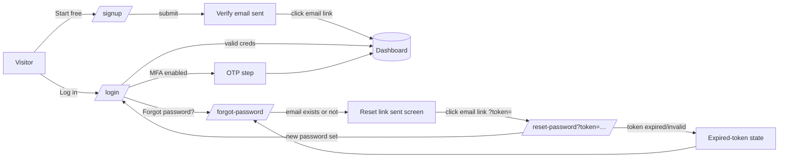

# UI Screen Specs — Marketing & Auth

This document is the build-from specification for the **Postpin marketing website and authentication surface** — the public, unauthenticated front door that turns visitors into signed-up tenants. It covers eleven screens (Landing, Pricing, Features, API Docs portal, Contact/Sales, About, Legal, Login, Signup, Forgot Password, Reset Password), each with route, purpose, responsive layouts at 1440 / 768 / 390 px, a component hierarchy tree, the cards/tables/dialogs/toasts used, empty / skeleton / error states, dark-mode notes, role/visibility, and a rich **AI Image Generation Prompt** for producing a high-fidelity mockup. All screens use the Postpin design system: light theme by default with a dark toggle, the violet `#7C3AED` → purple `#9333EA` → fuchsia `#DB2777` brand gradient, **Space Grotesk** display headlines, **Inter** body/UI, **JetBrains Mono** for data/code, `0.75rem` radius, animated Lucide icons, Recharts charts, and INR (`en-IN`) currency. The live rate calculator (Jaipur `302001` → Guwahati `781001`) is the signature interactive element and appears on Landing, Features and Docs.

## Contents

- [Conventions & shared shell](#conventions--shared-shell)
- [Design tokens quick-reference](#design-tokens-quick-reference)
- [Marketing navigation & footer](#marketing-navigation--footer)
- [Auth flow map](#auth-flow-map)
- [1. Landing / Home](#1-landing--home)
- [2. Pricing](#2-pricing)
- [3. Features](#3-features)
- [4. API Docs portal](#4-api-docs-portal)
- [5. Contact / Sales](#5-contact--sales)
- [6. About](#6-about)
- [7. Legal (Terms / Privacy)](#7-legal-terms--privacy)
- [8. Login](#8-login)
- [9. Signup](#9-signup)
- [10. Forgot Password](#10-forgot-password)
- [11. Reset Password](#11-reset-password)
- [Shared component catalogue](#shared-component-catalogue)
- [Accessibility & motion checklist](#accessibility--motion-checklist)
- [Cross-references](#cross-references)

---

## Conventions & shared shell

All marketing screens share one app shell (`apps/marketing`, Next.js App Router). Auth screens (`/login`, `/signup`, `/forgot-password`, `/reset-password`) use a **separate, stripped split-pane shell** with no marketing nav — just a logo and a single back-link — to keep the conversion funnel clean.

| Concern | Decision |
|---|---|
| **Breakpoints** | Desktop = 1440 px (max content width 1200 px, 12-col grid, 24 px gutter). Tablet = 768 px (8-col, 20 px gutter). Mobile = 390 px (4-col, 16 px gutter, single column). |
| **Header** | Sticky, `h-16`, translucent `bg-background/80` with `backdrop-blur`, hairline bottom border (`ring-hairline`). Shrinks shadow on scroll. |
| **Container** | `.container max-w-[1200px] mx-auto px-6` (px-5 tablet, px-4 mobile). |
| **Section rhythm** | `py-24` desktop, `py-16` tablet, `py-12` mobile between marketing sections. |
| **Buttons** | Primary = `.bg-brand-gradient` + `.shadow-glow`, white text. Secondary = outline on `--border`. Ghost = transparent. All have `data-testid`. |
| **Icons** | Lucide, animated via the project `AnimatedIcon` wrapper (motion on hover / in-view); never static. Respect `prefers-reduced-motion`. |
| **Toasts** | Sonner (`src/components/ui/sonner.tsx`), top-right desktop / bottom mobile. |
| **Numbers** | `.tabular-nums` for prices, latency, pincodes, weights, counters. |
| **Currency** | `Intl.NumberFormat('en-IN', { style:'currency', currency:'INR', maximumFractionDigits:0 })`. |
| **Theme** | `next-themes` class strategy; default `light`, toggle persists to `localStorage`, honours `prefers-color-scheme` on first visit. |

Every interactive/test-relevant element carries a stable `data-testid` following the global `{feature}-{element}-{type}` convention (e.g. `landing-hero-cta-btn`, `pricing-growth-select-btn`, `login-email-input`). These names are load-bearing for QA automation and are listed per screen.

---

## Design tokens quick-reference

Pulled from `src/app/globals.css` — use these names, not raw hex, in components.

| Token | Light | Dark | Usage |
|---|---|---|---|
| `--primary` | `#7c3aed` | `#8b5cf6` | CTAs, links, focus ring |
| `--brand-from / via / to` | `#7c3aed / #9333ea / #db2777` | `#8b5cf6 / #a855f7 / #ec4899` | `.bg-brand-gradient`, `.text-gradient` |
| `--background / --foreground` | `#ffffff / #0a0a0b` | `#09090b / #fafafa` | Page surface / text |
| `--card` | `#ffffff` | `#121214` | Cards, panels |
| `--muted-foreground` | `#71717a` | `#a1a1aa` | Secondary text, hints |
| `--accent` | `#faf5ff` | `#1e1b2e` | Soft violet wash, badges |
| `--success / warning / info / destructive` | `#16a34a / #d97706 / #2563eb / #dc2626` | brighter variants | Status semantics |
| `--border` | `#e4e4e7` | `#27272a` | Hairlines, inputs |
| `--radius` | `0.75rem` | same | Cards/buttons radius |

Signature utilities: `.text-gradient`, `.bg-brand-gradient`, `.bg-brand-gradient-soft`, `.bg-grid`, `.bg-dots`, `.shadow-glow`, `.shadow-glow-fuchsia`, `.shimmer` (skeletons), `.ring-hairline`, `.mask-fade-x` (marquee fades). Fonts: `--font-display` (Space Grotesk, headings, `letter-spacing:-0.02em`), `--font-sans` (Inter), `--font-mono` (JetBrains Mono).

---

## Marketing navigation & footer

Driven by `src/lib/site.ts`.

**Header nav** (`marketingNav`): Product (`/#features`) · Pricing (`/pricing`) · Docs (`/docs`) · Features (`/features`) · Contact (`/contact`). Right cluster: theme toggle, **Log in** (ghost, `nav-login-link`), **Start free** (primary gradient, `nav-signup-btn`). Mobile: hamburger → full-screen `Sheet` drawer (`nav-mobile-drawer`).

**Footer** (`marketingFooter`) — four columns + brand block:

| Product | Developers | Company | Legal |
|---|---|---|---|
| Features, Pricing, Live demo, Changelog | Documentation, API reference, Status, Quickstart | About, Contact, Blog, Careers | Terms, Privacy, DPA, SLA |

Brand block: Postpin wordmark with gradient dot, tagline "The shipping rate API for India.", India-made line ("Built in India 🇮🇳 · ₹ INR-native"), socials, theme toggle, `© 2026 Postpin`. Footer `data-testid="site-footer"`.

---

## Auth flow map



Auth surface notes: signup defers email verification (account created, dashboard accessible in a limited "verify your email" banner state — see [Multi-Tenancy & RBAC](03-multi-tenancy-rbac.md)). All auth POSTs are rate-limited in Redis (5/min/IP) and return generic, non-enumerable responses (see error states per screen). Sessions are JWT (httpOnly cookie + refresh) per the platform auth model.

---

## 1. Landing / Home

### Route
`/` (app: marketing). SSR/ISR, revalidate 1h; hero calculator is a client island hydrated immediately.

### Purpose
Convert developers, D2C ops and platform buyers by proving — in under 10 seconds — that one API call returns an accurate, itemised INR shipping charge between any two Indian pincodes, with India-Post-synced pincodes and Stripe-grade DX. Primary CTA: **Start free**. Secondary: **Read the docs** / **Try the live demo**.

### Desktop (1440px) layout
Sticky header. Then a vertical stack of full-bleed sections on a `max-w-[1200px]` content column:

1. **Hero** (two-column, 7/5 split). Left: eyebrow pill ("India Post-synced pincodes · sub-50ms"), gradient H1 "Accurate Indian shipping charges in one API call", subhead, CTA row (Start free / Read docs), trust line ("No credit card · 1,000 free calls/month · `/v1` REST"). Right: **live rate calculator card** (the signature island) pre-filled Jaipur `302001` → Guwahati `781001`, 0.4 kg, 30×25×8 cm, COD, showing the itemised breakdown and a "View as code" toggle that flips to a JetBrains-Mono request/response panel. Background: `.bg-grid` + soft aurora blur blobs (`animate-aurora`) in violet/fuchsia.
2. **Logo marquee** — "Trusted by Indian D2C & platforms" — dual `.mask-fade-x` marquees of greyscale logos.
3. **How it works** — 3-step horizontal: Get a key → Send pincodes + parcel → Receive itemised INR. Animated Lucide icons.
4. **Code + result split** — left tabbed code block (cURL / Node / Python / PHP), right rendered JSON response with highlighted `billable_weight_kg` and `total`.
5. **Feature grid** (`#features`) — 6 bento cards: Pincode auto-sync, Volumetric weight, Zone engine, COD/fuel/GST breakdown, Rate cards, Usage analytics. Mixed card sizes (bento).
6. **Pincode sync spotlight** — split: copy on left, an animated "nightly sync at 00:30 IST" diagram + a small Recharts area chart of pincodes synced over 30 days on right.
7. **Metrics band** — gradient strip: `19,000+` pincodes, `<50ms` p95, `99.9%` uptime, `₹0` to start (count-up on in-view).
8. **Pricing teaser** — 3 plan cards (Starter / Growth-highlighted / Scale) + "See full pricing".
9. **Developer DX** — testimonial-style quotes + "Drop-in SDKs" snippet row.
10. **Final CTA band** — gradient full-width "Ship accurate rates today" + Start free / Talk to sales.
11. Footer.

### Tablet (768px) layout
Hero collapses to single column: headline + CTAs first, calculator card below full-width. Bento feature grid → 2 columns. Code+result split → stacked (code, then JSON). Metrics band → 2×2. Pricing teaser → horizontal scroll-snap row. Marquee unchanged.

### Mobile (390px) layout
Single column throughout. Header → hamburger drawer. Hero: eyebrow, H1 (clamp to ~32px), subhead, full-width stacked CTAs, then a compact calculator card (inputs stacked, breakdown collapsible accordion, sticky "Calculate" button). Marquee keeps single row. Feature bento → 1 column. Metrics → 2×2 small. Pricing teaser → vertical stack with Growth highlighted. Final CTA full-width.

### Component hierarchy
```
MarketingShell
├─ SiteHeader (sticky, blur)
│  ├─ Logo (gradient dot + wordmark)
│  ├─ NavLinks [Product, Pricing, Docs, Features, Contact]
│  └─ HeaderActions [ThemeToggle, LogInLink, StartFreeButton]
├─ main
│  ├─ HeroSection
│  │  ├─ HeroCopy [EyebrowPill, GradientH1, Subhead, CtaRow, TrustLine]
│  │  └─ RateCalculatorCard (client island)
│  │     ├─ PincodeInput (origin) · PincodeInput (destination)
│  │     ├─ WeightInput · DimensionInputs (L×W×H) · PaymentTypeToggle (COD/Prepaid)
│  │     ├─ ServiceLevelTabs [Surface, Express, Same-day]
│  │     ├─ CalculateButton
│  │     ├─ ResultPanel [ZoneBadge, BillableWeightRow, BreakdownTable, TotalRow, EtaBadge]
│  │     └─ ViewAsCodeToggle → CodeResponsePanel (mono)
│  ├─ LogoMarquee (dual, mask-fade-x)
│  ├─ HowItWorks (3 StepCards)
│  ├─ CodeResultSplit [LangTabs, CodeBlock | JsonResultBlock]
│  ├─ FeatureBentoGrid (6 FeatureCards)
│  ├─ PincodeSyncSpotlight [SyncDiagram, SyncAreaChart]
│  ├─ MetricsBand (4 CountUpStat)
│  ├─ PricingTeaser (3 PlanCards + LinkButton)
│  ├─ DxSection [QuoteCards, SdkSnippetRow]
│  └─ FinalCtaBand
└─ SiteFooter
```

### Key components used
- **Cards**: `RateCalculatorCard`, bento `FeatureCard`, `PlanCard`, `QuoteCard`.
- **Tables**: breakdown table inside the calculator result (Base / Weight / Fuel / COD / GST / Total).
- **Charts**: Recharts `AreaChart` (pincodes synced, 30-day) in the sync spotlight; count-up stats in metrics band.
- **Tabs**: service-level tabs, code-language tabs, "View as code" toggle.
- **Toasts**: "Pincode not serviceable" / "Copied request" (Sonner).
- **Marquee**: logo trust strip.

### Live calculator contract (signature element)
Mirrors `src/lib/shipping.ts`. Pre-filled example:

```jsonc
// Request (POST /v1/rates)
{
  "pickup_pincode": "302001",        // Jaipur, Rajasthan
  "delivery_pincode": "781001",      // Guwahati, Assam (special/remote zone)
  "weight_kg": 0.4,
  "dimensions_cm": { "length": 30, "width": 25, "height": 8 },
  "payment_type": "COD",
  "cod_amount": 1499,
  "service_level": "surface",
  "include_gst": true
}
```
```jsonc
// Result rendered in ResultPanel + "View as code"
{
  "currency": "INR",
  "zone": "special",                 // Special / Remote
  "billable_weight_kg": 1.2,         // max(actual 0.4, volumetric 1.2 = 30*25*8/5000)
  "volumetric_weight_kg": 1.2,
  "eta_days": [5, 9],
  "breakdown": {
    "base": 95.00, "weight": 86.40, "fuel": 21.77,
    "cod": 57.49, "subtotal": 260.66, "gst": 46.92, "total": 307.58
  },
  "meta": { "engine_ms": 11, "cached": false }
}
```

### Empty state
Not applicable to the page. The calculator's *initial* state ships pre-filled (never blank) so the value is visible without interaction — this is intentional; a blank calculator is treated as a failure of the hero.

### Skeleton / loading state
Calculator result area shows three `.shimmer` skeleton rows + a pulsing total chip while the (mock or live) compute resolves (~200ms debounce). Marquee logos fade in. Sync area chart renders an axis-only skeleton then animates the path. Below-the-fold sections use `IntersectionObserver` reveal (fade-up), disabled under `prefers-reduced-motion`.

### Error state
- **Pincode not serviceable / invalid** (not 6 digits or unknown PIN): destructive inline message under the field (`landing-calc-error`), result panel shows a friendly "We couldn't serve this route — try a metro PIN like 400001" empty card; Sonner toast.
- **Calculator API failure** (live mode): result panel shows a retriable error card with a **Retry** button; falls back to the bundled mock engine so the hero is never dead.

### Dark-mode notes
Background flips to `#09090b`; aurora blobs use the brighter dark brand stops (`#8b5cf6 → #ec4899`) at lower opacity. `.bg-grid` lines drop to ~6% foreground. Calculator card uses `--card #121214` with a 1px `--border` and a subtle inner glow. Gradient text and `.shadow-glow` stay; logo marquee logos switch to their light variants.

### Role / visibility
Public, unauthenticated. If a valid session cookie is present, header swaps **Log in / Start free** for **Go to dashboard** (`nav-dashboard-btn`). No tenant scoping.

### Key data-testids
`landing-hero-cta-btn`, `landing-hero-docs-btn`, `landing-calc-origin-input`, `landing-calc-dest-input`, `landing-calc-weight-input`, `landing-calc-payment-toggle`, `landing-calc-calculate-btn`, `landing-calc-result-total`, `landing-calc-viewcode-toggle`, `landing-pricing-cta-link`, `landing-final-cta-btn`.

### AI Image Generation Prompt
> A high-fidelity 1440px-wide desktop web UI mockup of "Postpin" — a developer-grade shipping-rate API SaaS landing page, light theme on a clean white background with a subtle violet dot-grid texture and soft out-of-focus aurora gradient blobs in violet (#7C3AED) to fuchsia (#DB2777) glowing in the top-right. Sticky translucent blurred header with a small gradient-dot "Postpin" wordmark in Space Grotesk on the left, nav links (Product, Pricing, Docs, Features, Contact) center, and a bold gradient "Start free" pill button on the right. Hero is a two-column split: left has an eyebrow pill "India Post-synced pincodes · sub-50ms", a large bold Space Grotesk headline "Accurate Indian shipping charges in one API call" with the last phrase in a violet→fuchsia gradient, a grey Inter subhead, and two buttons (a glowing violet-fuchsia gradient "Start free" and an outlined "Read the docs"). Right column shows a floating white rate-calculator card with rounded 12px corners and a soft shadow, containing input fields prefilled "Jaipur 302001" and "Guwahati 781001", weight 0.4 kg, dimensions 30×25×8 cm, a COD/Prepaid toggle, and an itemised result breakdown table (Base ₹95.00, Weight ₹86.40, Fuel ₹21.77, COD ₹57.49, GST ₹46.92) with a bold total "₹307.58" in JetBrains Mono and a small "Special / Remote zone · 1.2 kg billable · 5–9 days" badge in violet. Below the hero a faint greyscale logo marquee. Modern, crisp, generous whitespace, premium fintech/devtools aesthetic like Stripe and Clerk, INR currency, realistic Indian context, ultra-detailed, 4k, clean vector-perfect UI, no lorem ipsum.

---

## 2. Pricing

### Route
`/pricing`. ISR (revalidate 1h); plans fetched server-side from the public plans endpoint (see [Subscription & Plan Engine](09-subscription-engine.md)).

### Purpose
Let a buyer pick a tier in under a minute. Show the flat-fee + overage ladder (Free / Starter / Growth / Scale / Enterprise), a billing-period toggle (Monthly / Yearly — "2 months free"), a full comparison matrix, and an FAQ. CTA per plan routes to signup with the plan pre-selected (`/signup?plan=growth`).

### Desktop (1440px) layout
Header → centered page title "Simple, India-first pricing" + subhead + **Monthly/Yearly segmented toggle** (with "Save 2 months" badge). Then a **4-card plan row** (Starter, Growth [highlighted, "Most popular" ribbon], Scale, Enterprise [contact]); Free shown as a slim banner above or as a 5th compact card. Each card: name, price (₹/mo, GST line "+18% GST"), included calls, key limits, primary CTA, "What's included" bullet list. Below: **full comparison table** (rows = features, columns = plans, ✓/✗ and values), sticky header row on scroll. Then **overage explainer** (mini calculator: "how many calls/month?" slider → estimated bill). Then **Pricing FAQ accordion**. Then trust band (GST invoice, INR, no lock-in) + final CTA. Footer.

### Tablet (768px) layout
Plan cards → 2 columns (Growth still highlighted), 2 rows. Comparison table becomes horizontally scrollable with a sticky first column (feature names). Overage slider full-width. FAQ unchanged.

### Mobile (390px) layout
Plan cards → vertical stack, Growth first/highlighted with "Most popular". Comparison table → **per-plan accordion** ("Compare Growth" expands its column as a list) instead of a wide grid. Billing toggle stays sticky under the header. Overage slider full-width. FAQ accordion.

### Component hierarchy
```
MarketingShell
├─ SiteHeader
├─ main
│  ├─ PricingHeader [Title, Subhead, BillingPeriodToggle]
│  ├─ FreePlanBanner (or compact FreeCard)
│  ├─ PlanCardRow
│  │  ├─ PlanCard (starter)
│  │  ├─ PlanCard (growth, highlighted, PopularRibbon)
│  │  ├─ PlanCard (scale)
│  │  └─ PlanCard (enterprise, contact)
│  ├─ ComparisonTable (sticky header, sticky first col on tablet)
│  ├─ OverageEstimator [CallsSlider, EstimatedBillCard]
│  ├─ PricingFaq (Accordion)
│  └─ TrustBand + FinalCtaBand
└─ SiteFooter
```

### Key components used
- **Cards**: `PlanCard` (×5), `EstimatedBillCard`.
- **Tables**: `ComparisonTable` — the core element. Columns: Free / Starter / Growth / Scale / Enterprise.
- **Toggle**: billing-period segmented control (Monthly/Yearly).
- **Slider + live calc**: overage estimator.
- **Accordion**: FAQ; mobile comparison.
- **Toasts**: "Yearly billing applied — 2 months free" on toggle.

### Plan data (real, India-first — source: [Subscription & Plan Engine](09-subscription-engine.md))
| | Free | Starter | Growth | Scale | Enterprise |
|---|---|---|---|---|---|
| Price/mo | ₹0 | ₹999 | **₹2,499** | ₹7,999 | Contact |
| Price/yr | ₹0 | ₹9,990 | ₹24,990 | ₹79,990 | Custom |
| Calls/mo | 1,000 | 25,000 | 200,000 | 1,000,000 | Unlimited |
| Rate limit (RPM) | 10 | 60 | 300 | 1,200 | Custom |
| Domains / Keys | 1 / 1 | 3 / 3 | 10 / 10 | 50 / 50 | ∞ / ∞ |
| Overage | Hard block | ₹0.20/call | ₹0.15/call | ₹0.10/call | Negotiated |
| Custom rate cards | ✗ | ✗ | ✓ | ✓ | ✓ |
| SLA | — | — | — | 99.9% | 99.95% + TAM |

### Empty state
If the plans API returns zero active plans (misconfiguration), show a single "Pricing is being updated — talk to sales" card with a Contact CTA, and log a client warning. The comparison table is hidden in this case.

### Skeleton / loading state
On ISR miss/client refetch: plan cards render as 4 `.shimmer` card skeletons (price line, 5 bullet lines, button block); comparison table shows a 10-row shimmer grid.

### Error state
Plans fetch failure → inline `Alert` (info, not destructive) "Couldn't load live pricing — showing standard plans" and fall back to a bundled static plan snapshot so the page never blanks. Enterprise card always renders (static). Toggle errors are impossible (client-only).

### Dark-mode notes
Highlighted Growth card keeps a gradient border (`bg-brand-gradient` 1px frame) that reads well on `#09090b`. Comparison table zebra rows use `--muted`; ✓ uses `--success`, ✗ uses `--muted-foreground`. "Most popular" ribbon uses fuchsia in dark for contrast.

### Role / visibility
Public. Authenticated users see the plan they're currently on marked "Current plan" and CTAs change to "Upgrade"/"Switch" routing into the dashboard billing flow rather than signup.

### Key data-testids
`pricing-billing-toggle`, `pricing-starter-select-btn`, `pricing-growth-select-btn`, `pricing-scale-select-btn`, `pricing-enterprise-contact-btn`, `pricing-comparison-table`, `pricing-overage-slider`, `pricing-faq-accordion`.

### AI Image Generation Prompt
> A high-fidelity 1440px desktop web UI mockup of the "Postpin" pricing page, light theme, clean white background with a faint violet grid. Centered Space Grotesk heading "Simple, India-first pricing" with a grey subhead and a violet segmented Monthly/Yearly toggle showing a small green "Save 2 months" badge. Below, a row of four pricing cards with rounded corners and soft shadows: "Starter ₹999/mo · 25,000 calls", a highlighted center "Growth ₹2,499/mo · 200,000 calls" card wrapped in a glowing violet-to-fuchsia gradient border with a fuchsia "Most popular" ribbon and a gradient "Start free" button, "Scale ₹7,999/mo · 1,000,000 calls", and an "Enterprise — Contact sales" card. Each card lists feature bullets with small violet check icons. All prices in JetBrains Mono, INR, with "+18% GST" fine print. Beneath the cards, a clean comparison table with feature rows and check/cross marks across the five plans, zebra striping. Premium SaaS pricing aesthetic like Stripe and PostHog, generous whitespace, Inter body text, ultra-detailed, crisp, 4k, no placeholder text.

---

## 3. Features

### Route
`/features`. Static/ISR. Anchored sub-sections per capability for deep-linking from nav and docs.

### Purpose
Explain Postpin's differentiators in depth to a technical evaluator: pincode auto-sync with India Post, volumetric/billable weight, deterministic zone engine, itemised charge breakdown (COD/fuel/GST/remote), per-customer rate cards, usage analytics, API keys & access control. Each feature pairs prose with a concrete visual (diagram, table or mini-chart). Embeds a compact live calculator near the top.

### Desktop (1440px) layout
Header → feature hero (gradient H1 "Everything you need to price a parcel", subhead, anchor chips that scroll to sections). Then **alternating two-column feature blocks** (copy left / visual right, then flipped), one per capability:
1. **Pincode auto-sync** — copy + a mermaid-style sync diagram and a small "Last sync · 19,243 pincodes · +12 new" stat card.
2. **Volumetric weight** — copy + an animated parcel illustration showing `L×W×H/5000` and `max(actual, volumetric)`.
3. **Zone engine** — copy + an India map with zone bands (Local/Regional/Metro/National/Special) keyed to real pincode prefixes.
4. **Charge breakdown** — copy + the itemised breakdown table (Base/Weight/Fuel/COD/Remote/GST/Total).
5. **Rate cards** — copy + a slab-table snippet (weight slabs → ₹/slab).
6. **Usage analytics** — copy + a Recharts line/area mini-dashboard (calls over time, p95 latency).
7. **API keys & access control** — copy + a key card with domain/IP allow-list chips.
A sticky right-rail "On this page" anchor list on desktop. Closing CTA band + footer.

### Tablet (768px) layout
Feature blocks stack (visual under copy), retaining alternating accent. Anchor rail collapses into a horizontal scroll-snap chip row pinned under the header. India map scales to fit width.

### Mobile (390px) layout
Single column; each feature = heading, short copy, then its visual (charts/tables become swipeable or simplified — e.g. the comparison-style tables become stacked key/value lists). Anchor chips become a horizontally scrollable strip. Calculator compact variant.

### Component hierarchy
```
MarketingShell
├─ SiteHeader
├─ main
│  ├─ FeaturesHero [GradientH1, Subhead, AnchorChips]
│  ├─ CompactRateCalculator (island)
│  ├─ FeatureBlock(pincode-sync) [Copy, SyncDiagram, SyncStatCard]
│  ├─ FeatureBlock(volumetric)  [Copy, VolumetricIllustration]
│  ├─ FeatureBlock(zones)       [Copy, IndiaZoneMap]
│  ├─ FeatureBlock(breakdown)   [Copy, BreakdownTable]
│  ├─ FeatureBlock(rate-cards)  [Copy, SlabTable]
│  ├─ FeatureBlock(analytics)   [Copy, MiniAnalyticsChart (Recharts)]
│  ├─ FeatureBlock(api-keys)    [Copy, ApiKeyCard, AllowlistChips]
│  ├─ AnchorRail (sticky, desktop)
│  └─ FinalCtaBand
└─ SiteFooter
```

### Key components used
- **Cards**: `SyncStatCard`, `ApiKeyCard`, feature visual cards.
- **Tables**: `BreakdownTable`, `SlabTable`, zone-prefix table.
- **Charts**: Recharts `AreaChart` + `LineChart` (analytics), area chart (sync history).
- **Map**: `IndiaZoneMap` (SVG, zone-coloured).
- **Chips**: anchor chips, allow-list chips.

### Empty state
Not applicable (static content). Analytics mini-chart uses representative sample data clearly labelled "example".

### Skeleton / loading state
Charts and the India map lazy-load below the fold with axis/outline skeletons (`.shimmer`), then animate in (path draw for the map, area sweep for charts). Reduced-motion → instant render, no draw animation.

### Error state
Purely static, so no data errors. If a lazy chunk (map/chart) fails to load, show a static fallback image + "Visualization unavailable" caption; copy remains fully readable.

### Dark-mode notes
India map zone bands use the dark chart palette (`--chart-1..5`) at higher luminance; map landmass `--card`, borders `--border`. Slab/breakdown tables invert to dark surfaces. Gradient accents on alternating blocks soften to avoid glare.

### Role / visibility
Public. Identical for authenticated users (no gating). Anchor deep-links (`/features#zones`) are linked from docs and the dashboard's empty states.

### Key data-testids
`features-anchor-chips`, `features-calc`, `features-zone-map`, `features-breakdown-table`, `features-slab-table`, `features-analytics-chart`, `features-cta-btn`.

### AI Image Generation Prompt
> A high-fidelity 1440px desktop web UI mockup of the "Postpin" features page, light theme, white background. Top hero with a bold Space Grotesk gradient headline "Everything you need to price a parcel" and a row of violet anchor chips (Pincode sync, Volumetric weight, Zones, Breakdown, Rate cards, Analytics, API keys). Below, an alternating two-column layout: one block shows explanatory text on the left and a clean illustrated diagram on the right of a nightly "India Post sync at 00:30 IST" pipeline with a small stat card "19,243 pincodes · +12 new"; the next block shows a stylised map of India coloured into shipping zones (Local, Regional, Metro, National, Special/Remote) in a violet-to-fuchsia palette with small labels on real cities (Delhi, Mumbai, Guwahati, Srinagar, Port Blair); another block shows an itemised charge breakdown table (Base, Weight, Fuel, COD, Remote, GST, Total) in INR with JetBrains Mono numbers; another shows a small analytics line chart of API calls over time with a p95 latency badge. Premium devtools aesthetic, Inter body text, generous whitespace, soft shadows, rounded 12px cards, ultra-detailed, crisp, 4k, realistic Indian shipping context, no lorem ipsum.

---

## 4. API Docs portal

### Route
`/docs` (and `/docs/[...slug]` for deep pages: quickstart, authentication, `/v1/rates`, `/v1/pincodes`, errors, SDKs, changelog). This is the public documentation surface (the fourth front-end). Static MDX + an interactive "Try it" island.

### Purpose
Get a developer from zero to a successful `/v1/rates` call fast, and serve as the canonical API reference. Three-pane docs layout (nav / content / on-page TOC), copy-paste snippets in multiple languages, an inline **API explorer** that runs against a sandbox key, and a searchable command palette.

### Desktop (1440px) layout
Docs-specific header (logo, search trigger `⌘K`, language/version selector `v1`, "Get API key" CTA, theme toggle). Three columns:
- **Left sidebar** (240px, sticky, scroll-spy): grouped nav — Getting started (Introduction, Quickstart, Authentication), Core (Rates, Pincodes, Zones, Rate cards), Reference (Endpoints, Errors, Rate limits, Webhooks), SDKs, Changelog.
- **Center content** (max ~720px): MDX article — H1, lead, prose, callouts (info/warning), endpoint blocks with method + path pill, parameter tables, and **tabbed code samples** (cURL / Node / Python / PHP / Go) with copy buttons. Each endpoint has a **"Try it" panel**: editable params, "Send" → live response with status, latency, headers.
- **Right TOC** (200px, sticky): in-page anchors with active highlight.

### Tablet (768px) layout
Left sidebar collapses into a top "Docs menu" `Sheet` drawer trigger. Content goes full width. Right TOC moves into a collapsible "On this page" disclosure above the article. Code tabs and Try-it panel stack vertically (params above response).

### Mobile (390px) layout
Header keeps search + menu. Sidebar = full-screen drawer. TOC = inline collapsible. Code samples horizontally scroll within their block with a language dropdown (instead of tabs). Try-it panel: params accordion → full-width Send button → response card. Parameter tables become stacked definition lists.

### Component hierarchy
```
DocsShell
├─ DocsHeader [Logo, SearchTrigger(⌘K), VersionSelect(v1), GetKeyButton, ThemeToggle]
├─ DocsLayout (3-col)
│  ├─ DocsSidebar (grouped nav, scroll-spy)
│  ├─ DocsContent (MDX)
│  │  ├─ ArticleHeader [H1, Lead, Breadcrumb]
│  │  ├─ Callout (info / warning)
│  │  ├─ EndpointBlock [MethodPill(POST), PathPill(/v1/rates), ParamTable]
│  │  ├─ CodeTabs [cURL, Node, Python, PHP, Go] + CopyButton
│  │  ├─ TryItPanel [ParamEditor, SendButton, ResponseViewer(status, ms, headers, JSON)]
│  │  └─ NextPrevNav
│  ├─ DocsToc (on-page anchors)
│  └─ CommandPalette (⌘K search dialog)
└─ DocsFooter (slim)
```

### Key components used
- **Dialog**: `CommandPalette` (search) — fuzzy across pages + endpoints.
- **Tabs**: language code tabs.
- **Tables**: parameter tables (name, type, required, description), error-code table, rate-limit table.
- **Drawers**: mobile/tablet sidebar `Sheet`.
- **Interactive panel**: `TryItPanel` (sandbox request runner).
- **Toasts**: "Copied to clipboard", "Sandbox key required to run".

### Sample reference content (real `/v1/rates`)
```bash
curl https://api.postpin.dev/v1/rates \
  -H "Authorization: Bearer pp_test_3kQ9…" \
  -H "Content-Type: application/json" \
  -d '{
    "pickup_pincode": "400001",
    "delivery_pincode": "560001",
    "weight_kg": 1.2,
    "dimensions_cm": { "length": 25, "width": 20, "height": 15 },
    "payment_type": "PREPAID",
    "service_level": "express",
    "include_gst": true
  }'
```
```json
{
  "currency": "INR",
  "zone": "metro",
  "billable_weight_kg": 1.5,
  "volumetric_weight_kg": 1.5,
  "eta_days": [1, 3],
  "breakdown": { "base": 88.00, "weight": 91.20, "fuel": 21.50, "subtotal": 200.70, "gst": 36.13, "total": 236.83 },
  "meta": { "engine_ms": 9, "cached": false, "request_id": "req_7Yh2…" }
}
```

### Empty state
- **Search with no results**: command palette shows "No matches — try 'rates', 'pincode', 'auth'" with quick links to Quickstart and Errors.
- **Try-it with no sandbox key**: response viewer shows a violet info card "Sign in and grab a test key to run live requests" + **Get test key** button (routes to signup/dashboard).

### Skeleton / loading state
MDX is static (instant). The `TryItPanel` "Send" shows a spinner on the button + a shimmer response block; on resolve it renders status pill (200 in success green / 4xx in destructive), latency, and pretty-printed JSON. Search palette shows a brief indexing shimmer on first open.

### Error state
- **Try-it 4xx/5xx**: response viewer shows the real error envelope (status pill destructive, error `code`, `message`, `request_id`) plus a contextual "See Errors reference" link.
- **Try-it network failure / rate-limited (429)**: warning card "Rate limited — sandbox allows 10 req/min" with retry-after countdown.
- **Page not found** (`/docs/bad-slug`): docs-styled 404 with search box and links to popular pages.

### Dark-mode notes
Code blocks use a dark syntax theme in both modes (developers expect dark code), with a light-mode card frame in light theme. Method pills keep semantic colors (POST = violet/primary, GET = info, DELETE = destructive). Sidebar active item gets a left gradient bar. Response status pills keep success/destructive semantics.

### Role / visibility
Public read. The **Try-it live runner** requires authentication + a sandbox (`pp_test_…`) key; unauthenticated users can read everything and see example responses but get the "get a test key" prompt on Send. Version selector currently shows `v1` only.

### Key data-testids
`docs-search-trigger`, `docs-sidebar-nav`, `docs-code-tabs`, `docs-copy-btn`, `docs-tryit-send-btn`, `docs-tryit-response`, `docs-getkey-btn`, `docs-toc`.

### AI Image Generation Prompt
> A high-fidelity 1440px desktop web UI mockup of the "Postpin" API documentation portal, three-column developer-docs layout, light theme with a dark code-block aesthetic. Left sidebar with grouped navigation (Getting started, Core, Reference, SDKs, Changelog) and an active "Rates" item marked with a violet gradient left bar. Center content shows an article titled "Calculate rates" in Space Grotesk, a POST method pill in violet next to a path pill "/v1/rates", a parameter table (pickup_pincode, delivery_pincode, weight_kg, dimensions_cm, payment_type, service_level), and a tabbed code sample (cURL, Node, Python, PHP, Go) inside a dark code panel with a copy icon and a realistic curl request to api.postpin.dev with pincodes 400001 and 560001. Below the code, a "Try it" panel with editable inputs and a violet "Send" button, and a response viewer showing a green "200 OK" status pill, "9 ms", and pretty-printed JSON with "total": "236.83" and "zone": "metro". Right column is a sticky "On this page" table of contents. Top bar has a ⌘K search field, a "v1" version selector and a gradient "Get API key" button. Premium developer-tools aesthetic like Stripe and Clerk docs, JetBrains Mono code, Inter UI text, ultra-detailed, crisp, 4k, no placeholder text.

---

## 5. Contact / Sales

### Route
`/contact`. Server action / API-backed form submission; creates a `ticket`/lead and emails sales.

### Purpose
Capture sales-qualified leads and support enquiries. Split into "Talk to sales" (Enterprise, volume, custom rate cards) and "Get support" / general. Includes a real contact form, company/volume qualifiers, and direct contact details + an embedded map of the (India) office.

### Desktop (1440px) layout
Header → two-column hero. **Left**: H1 "Let's talk shipping at scale", subhead, a contact form card (Name, Work email, Company, Monthly shipment volume [select], Interest [select: Sales / Support / Partnership], Message, "I agree to be contacted" checkbox, Submit). **Right**: a sticky info column — channels card (sales email, support email, status link, response SLA "within 1 business day"), an office card with a small embedded map and Indian address, and a "Prefer docs?" link card to `/docs`. Below: an FAQ strip (billing, GST invoices, security/DPA). Footer.

### Tablet (768px) layout
Form (left) stays primary at ~60% width; info column wraps below the form as a 2-card row (channels + office). FAQ unchanged.

### Mobile (390px) layout
Single column: H1, short subhead, form (fields stacked, full-width Submit), then channels card, then office/map card, then FAQ accordion. Sticky nothing.

### Component hierarchy
```
MarketingShell
├─ SiteHeader
├─ main
│  ├─ ContactHero [H1, Subhead]
│  ├─ ContactGrid (2-col)
│  │  ├─ ContactFormCard
│  │  │  ├─ NameInput · WorkEmailInput · CompanyInput
│  │  │  ├─ VolumeSelect · InterestSelect
│  │  │  ├─ MessageTextarea
│  │  │  ├─ ConsentCheckbox
│  │  │  └─ SubmitButton
│  │  └─ InfoColumn
│  │     ├─ ChannelsCard [SalesEmail, SupportEmail, StatusLink, SlaBadge]
│  │     ├─ OfficeCard [MapEmbed, Address]
│  │     └─ DocsLinkCard
│  └─ ContactFaq (Accordion)
└─ SiteFooter
```

### Key components used
- **Cards**: `ContactFormCard`, `ChannelsCard`, `OfficeCard`.
- **Form controls**: text inputs, two `Select`s, textarea, consent checkbox.
- **Map**: lightweight embedded map (lazy iframe / static fallback).
- **Toasts**: success "Thanks — we'll reply within 1 business day"; error toast on failure.
- **Dialog**: optional success confirmation (mobile uses inline success card instead).

### Form fields & validation
| Field | Type | Rules |
|---|---|---|
| Name | text | required, 2–80 chars |
| Work email | email | required, valid email, reject free domains softly (warn, allow) |
| Company | text | required, 2–120 chars |
| Monthly volume | select | required; `<1k / 1k–10k / 10k–100k / 100k+` |
| Interest | select | required; Sales / Support / Partnership |
| Message | textarea | required, 10–2000 chars |
| Consent | checkbox | required true |
| (hidden) honeypot | text | must stay empty (anti-spam) |

### Empty state
Form starts empty with helpful placeholders and a "We reply within 1 business day" reassurance line. No data table to be empty.

### Skeleton / loading state
On submit: button enters loading (spinner + "Sending…"), fields disabled. No page-level skeleton (form is static).

### Error state
- **Validation**: inline field errors (destructive text + red ring), submit blocked, focus moves to first invalid field, `aria-live` announces the count.
- **Server/network failure**: destructive `Alert` above the form "Couldn't send — email us at sales@postpin.dev" with a mailto fallback; Sonner error toast; form values preserved.
- **Rate-limited / spam-detected**: generic "Please try again shortly" (don't reveal honeypot).

### Dark-mode notes
Form card `--card` with `--border`; selects/inputs use `--input`. Map embed gets a dark-styled tile set (or a darkened overlay on the static fallback). SLA badge uses `--success`.

### Role / visibility
Public. Authenticated users see their name/email pre-filled (editable). Interest defaults to Sales when arriving from a Pricing "Contact sales"/Enterprise CTA (`/contact?interest=sales&plan=enterprise`).

### Key data-testids
`contact-name-input`, `contact-email-input`, `contact-company-input`, `contact-volume-select`, `contact-interest-select`, `contact-message-textarea`, `contact-consent-checkbox`, `contact-submit-btn`, `contact-success-alert`.

### AI Image Generation Prompt
> A high-fidelity 1440px desktop web UI mockup of the "Postpin" contact/sales page, light theme, clean white background with a subtle violet gradient wash on the right edge. Two-column layout: left has a Space Grotesk headline "Let's talk shipping at scale" with a grey subhead and a white contact-form card with rounded corners and soft shadow containing labelled fields (Name, Work email, Company, a "Monthly shipment volume" dropdown showing "10k–100k", an "Interest" dropdown showing "Sales", a Message textarea, a consent checkbox) and a glowing violet-to-fuchsia gradient "Send message" button. Right column is a sticky info stack: a channels card with sales and support emails, a "Status" link and a green "Replies within 1 business day" badge, plus an office card with a small embedded map and an Indian address. Premium SaaS aesthetic, Inter body text, generous whitespace, ultra-detailed, crisp, 4k, realistic Indian B2B context, no lorem ipsum.

---

## 6. About

### Route
`/about` (anchors `#blog`, `#careers`). Static/ISR.

### Purpose
Build trust and tell the Postpin story: why India needs a neutral shipping-rate API, the mission, traction/metrics, the team, values, and pointers to blog and careers. Supports the sales motion and recruiting.

### Desktop (1440px) layout
Header → story hero (gradient H1 "We're fixing Indian shipping rates", lede paragraph, subtle India map/route motif behind). Then: **Mission** two-column (statement + the "quote ≠ invoice" problem callout). **Traction metrics band** (pincodes synced, API calls served, tenants, uptime — count-up). **Timeline** (founding → India Post sync launch → `/v1` GA). **Values** (3–4 value cards with animated icons). **Team grid** (avatar cards). **Blog teaser** (`#blog`, 3 latest post cards). **Careers** (`#careers`, open-roles list + "We're hiring" CTA). Closing CTA + footer.

### Tablet (768px) layout
Two-column blocks stack. Team grid → 3 columns. Blog teaser → 2 columns. Timeline becomes vertical (left-aligned). Metrics → 2×2.

### Mobile (390px) layout
Single column. Timeline vertical with a left rail. Team grid → 2 columns of compact avatar cards. Blog → stacked cards. Careers → stacked role rows with chevrons. Metrics → 2×2.

### Component hierarchy
```
MarketingShell
├─ SiteHeader
├─ main
│  ├─ AboutHero [GradientH1, Lede, RouteMotif]
│  ├─ MissionBlock [Statement, ProblemCallout]
│  ├─ TractionBand (CountUpStat ×4)
│  ├─ Timeline (TimelineItem[])
│  ├─ ValuesGrid (ValueCard[])
│  ├─ TeamGrid (TeamCard[])
│  ├─ BlogTeaser (PostCard[]) [#blog]
│  ├─ CareersSection (RoleRow[], HiringCta) [#careers]
│  └─ FinalCtaBand
└─ SiteFooter
```

### Key components used
- **Cards**: `ValueCard`, `TeamCard`, `PostCard`, `ProblemCallout`.
- **Timeline**: milestone list.
- **Stats**: count-up metrics band.
- **Lists**: open-roles rows (title, location, dept, chevron).

### Empty state
- **No open roles**: Careers shows "No open roles right now — send us a note" linking to `/contact`.
- **No blog posts**: hide the Blog teaser entirely (don't render an empty grid).

### Skeleton / loading state
Static; if blog posts are fetched (CMS), show 3 `.shimmer` post-card skeletons. Team avatars lazy-load with a soft fade.

### Error state
Blog/careers fetch failure → omit that section gracefully with a console warning; the rest of the page is unaffected (no destructive UI on a marketing about page).

### Dark-mode notes
Route-motif map lines dim to ~15% foreground. Team card avatars get a 1px `--border` ring. Timeline rail uses a vertical gradient. Value-card icons use the dark brand stops.

### Role / visibility
Public. Identical for all roles.

### Key data-testids
`about-mission`, `about-traction-band`, `about-timeline`, `about-values-grid`, `about-team-grid`, `about-blog-teaser`, `about-careers-list`, `about-hiring-cta`.

### AI Image Generation Prompt
> A high-fidelity 1440px desktop web UI mockup of the "Postpin" about page, light theme, white background. A story hero with a bold Space Grotesk gradient headline "We're fixing Indian shipping rates" over a faint dotted map of India with glowing violet route lines connecting cities like Jaipur, Mumbai and Guwahati. Below, a mission section with a bold statement and a violet callout card reading "Make the quoted price equal the invoiced price". A traction metrics band on a soft violet-to-fuchsia gradient strip showing "19,000+ pincodes", "10M+ API calls", "500+ tenants", "99.9% uptime" in JetBrains Mono. A vertical timeline of milestones, a grid of value cards with animated-style icons, and a team grid of circular avatar cards. Premium, warm, trustworthy SaaS aesthetic, Inter body text, generous whitespace, ultra-detailed, crisp, 4k, realistic Indian startup context, no lorem ipsum.

---

## 7. Legal (Terms / Privacy)

### Route
`/legal/terms`, `/legal/privacy` (anchors `#dpa`, `#sla`). One shared legal-document template. Static MDX.

### Purpose
Host the binding legal documents (Terms of Service, Privacy Policy, DPA, SLA) in a clean, readable, deep-linkable format with a sticky table of contents and "last updated" metadata. Optimised for scanning and citation.

### Desktop (1440px) layout
Slim header → centered document column (max ~760px) with a **sticky left TOC rail** (section anchors with scroll-spy). Document header: title (Terms of Service / Privacy Policy), "Last updated 26 Jun 2026", version, a doc-switcher (Terms ↔ Privacy ↔ DPA ↔ SLA), and a "Download PDF" / "Print" button. Body: numbered sections with clear typographic hierarchy, definition tables, and an `#sla` section with an uptime/credits table, `#dpa` with sub-processor table. Footer.

### Tablet (768px) layout
TOC collapses into a top "Contents" disclosure. Document column full width with comfortable measure. Doc-switcher becomes a `Select`.

### Mobile (390px) layout
Single column; "Contents" is a collapsible accordion at top (and a small floating "↑ Contents" button). Tables (SLA credits, sub-processors) become horizontally scrollable or stacked key/value. Print/PDF in an overflow menu.

### Component hierarchy
```
MarketingShell (slim)
├─ SiteHeader
├─ main
│  ├─ LegalToc (sticky, scroll-spy)
│  └─ LegalDocument
│     ├─ DocHeader [Title, LastUpdated, Version, DocSwitcher, DownloadPdfButton]
│     ├─ Section[] (numbered, anchored)
│     ├─ DefinitionTable
│     ├─ SlaTable (#sla — uptime → service credits)
│     └─ SubProcessorTable (#dpa)
└─ SiteFooter
```

### Key components used
- **TOC**: sticky scroll-spy navigation.
- **Tables**: definitions, SLA credit tiers, DPA sub-processors.
- **Switcher**: Terms/Privacy/DPA/SLA tabs or select.
- **Button**: Download PDF / Print.

### Empty state
Not applicable — legal content is always present. If a requested anchor doesn't exist, scroll to top and ignore (no error UI).

### Skeleton / loading state
Static MDX → no skeleton. PDF generation (if server-rendered) shows a button spinner "Preparing PDF…".

### Error state
- **Unknown legal slug** (`/legal/foo`): redirect to `/legal/terms` or show a minimal legal-styled 404 with links to the four documents.
- **PDF generation failure**: toast "Couldn't generate PDF — use your browser's Print to PDF" and trigger `window.print()` as fallback.

### Dark-mode notes
Pure reading surface: `--background`/`--foreground` with `--muted-foreground` for metadata. Tables use subtle zebra (`--muted`). Links in `--primary`. Keep contrast at AAA for body legal text where feasible.

### Role / visibility
Public, indexable. Identical for all users. `noindex` only on draft versions.

### Key data-testids
`legal-toc`, `legal-doc-switcher`, `legal-last-updated`, `legal-download-pdf-btn`, `legal-sla-table`, `legal-dpa-subprocessors`.

### AI Image Generation Prompt
> A high-fidelity 1440px desktop web UI mockup of the "Postpin" legal page (Terms of Service), light theme, clean white background, highly readable document layout. A sticky left table-of-contents rail with numbered section links and one highlighted active item in violet. The centered document column has a Space Grotesk title "Terms of Service", a small grey "Last updated 26 Jun 2026 · v1.2" line, a doc-switcher (Terms / Privacy / DPA / SLA) and an outlined "Download PDF" button. The body shows clean numbered sections with comfortable line length in Inter, a definitions table, and a service-level-agreement table mapping uptime to service credits. Minimal, professional, trustworthy, lots of whitespace, subtle violet accents only on links and the active TOC item, ultra-detailed, crisp, 4k, no lorem ipsum.

---

## 8. Login

### Route
`/login` (auth shell). Accepts `?next=` redirect param and `?email=` prefill.

### Purpose
Authenticate an existing tenant user quickly and safely. Email + password, optional social/SSO, "remember me", forgot-password link, and an optional MFA OTP step. Routes to `?next=` or the dashboard on success.

### Desktop (1440px) layout
**Split-pane** auth shell: **left** = form panel (white, centered, max-w-[400px]) — Postpin logo, "Welcome back" H2, social buttons (Continue with Google / GitHub) + "or" divider, Email input, Password input (with show/hide toggle), row [Remember me checkbox · Forgot password? link], **Log in** gradient button, footer link "New to Postpin? Create an account". **Right** = brand panel (full-height `bg-brand-gradient` with `.bg-grid`/aurora, a rotating proof quote, and a faded calculator/route motif). MFA, when enabled, replaces the password step with a 6-digit OTP input after first submit.

### Tablet (768px) layout
Brand panel shrinks to a top banner (~30vh) or hides; form panel centers full-width with generous padding.

### Mobile (390px) layout
No brand panel; small centered logo at top, form full-width, fields stacked, full-width Log in button, social buttons stacked. Footer create-account link pinned below.

### Component hierarchy
```
AuthShell (split-pane)
├─ AuthFormPanel
│  ├─ Logo
│  ├─ Heading "Welcome back"
│  ├─ SocialButtons [Google, GitHub]
│  ├─ OrDivider
│  ├─ EmailInput
│  ├─ PasswordInput (show/hide)
│  ├─ Row [RememberMeCheckbox, ForgotPasswordLink]
│  ├─ LoginButton
│  ├─ FormError (Alert, conditional)
│  └─ FooterLink "Create an account"
└─ AuthBrandPanel [GradientBg, ProofQuote, RouteMotif]   (desktop only)
   (MFA variant: OtpStep replaces password after submit)
```

### Key components used
- **Form**: email, password (show/hide), remember-me checkbox.
- **Buttons**: gradient submit, social/OAuth buttons.
- **Alert**: generic auth error.
- **OTP input**: 6-cell segmented input (MFA variant).
- **Toasts**: rarely; errors are inline. "Logged in" success toast optional before redirect.

### Validation & security
| Field | Rules |
|---|---|
| Email | required, valid format |
| Password | required, non-empty (no length hint on login) |
| Submit | rate-limited 5/min/IP (Redis); generic error on failure |

Auth errors are **non-enumerable**: invalid email and wrong password both return the same "Email or password is incorrect." Lockout after N failures shows a soft "Too many attempts — try again in a few minutes."

### Empty state
Fresh form (optionally email prefilled from `?email=`). No data state.

### Skeleton / loading state
Submit button → spinner + "Logging in…", inputs disabled. OAuth buttons show a spinner and disable siblings while the popup/redirect is in flight. No page skeleton.

### Error state
- **Bad credentials**: inline destructive `Alert` "Email or password is incorrect." (generic), password field cleared, focus returns to password.
- **Unverified email**: info `Alert` "Verify your email to continue" + **Resend verification** link.
- **MFA required**: transition to OTP step; wrong OTP → "Invalid code, 2 attempts left".
- **Rate-limited / locked**: warning `Alert` with cooldown text; submit disabled until cooldown.
- **OAuth failure / cancel**: toast "Couldn't sign in with Google — try email instead", form remains usable.
- **Network error**: destructive `Alert` "Connection problem — please retry."

### Dark-mode notes
Form panel `--card` on `--background`; inputs `--input`. Brand panel gradient brightens to dark stops (`#8b5cf6 → #ec4899`). Show/hide and social icons use `--foreground`/brand. OTP cells use `--border` with `--ring` focus.

### Role / visibility
Public (unauthenticated). If already authenticated, redirect to `?next=` or dashboard. No tenant scoping (tenant resolved post-auth).

### Key data-testids
`login-email-input`, `login-password-input`, `login-password-toggle`, `login-remember-checkbox`, `login-forgot-link`, `login-submit-btn`, `login-google-btn`, `login-github-btn`, `login-error-alert`, `login-otp-input`, `login-create-account-link`.

### AI Image Generation Prompt
> A high-fidelity 1440px desktop web UI mockup of the "Postpin" login screen, split-pane auth layout. Left pane is a clean white panel with a centered form (max 400px): a small gradient-dot Postpin logo, a Space Grotesk "Welcome back" heading, two social buttons (Continue with Google, Continue with GitHub), an "or" divider, an Email field, a Password field with a show/hide eye icon, a row with a "Remember me" checkbox and a violet "Forgot password?" link, and a glowing violet-to-fuchsia gradient "Log in" button, with a small "New to Postpin? Create an account" link below. Right pane is a full-height vibrant violet-to-fuchsia gradient panel with a subtle grid texture, a soft aurora glow, a faded shipping-route motif of India, and a rotating proof quote in white. Premium auth aesthetic like Clerk and Stripe, Inter UI text, crisp, ultra-detailed, 4k, no lorem ipsum.

---

## 9. Signup

### Route
`/signup` (auth shell). Accepts `?plan=` (e.g. `growth`) and `?next=`.

### Purpose
Create a new tenant + owner user with minimum friction, kick off email verification, and land the user in the dashboard. Surfaces the selected plan, the "1,000 free calls, no card" promise, password strength, and consent.

### Desktop (1440px) layout
Same split-pane auth shell. **Left form**: logo, "Create your account" H2, optional **selected-plan chip** (from `?plan=`, e.g. "Growth — ₹2,499/mo · change"), social buttons + divider, fields — Full name, Work email, Company name, Password (with live strength meter + requirements checklist), consent checkboxes (Terms & Privacy required; product emails optional), **Create account** gradient button, footer "Already have an account? Log in". **Right brand panel**: value props ("1,000 free calls/month", "No credit card", "India Post-synced pincodes", "sub-50ms p95") as a checklist over the gradient.

### Tablet (768px) layout
Brand panel → top banner with the value-prop checklist as a compact row; form full-width below.

### Mobile (390px) layout
Logo + heading, plan chip, stacked fields, password strength meter inline, consent checkboxes stacked, full-width Create account, social buttons stacked, footer login link. Brand value props become a small 2×2 chip grid above or are omitted for brevity.

### Component hierarchy
```
AuthShell (split-pane)
├─ AuthFormPanel
│  ├─ Logo
│  ├─ Heading "Create your account"
│  ├─ SelectedPlanChip (from ?plan, "change" link)         (conditional)
│  ├─ SocialButtons [Google, GitHub]
│  ├─ OrDivider
│  ├─ FullNameInput
│  ├─ WorkEmailInput
│  ├─ CompanyInput
│  ├─ PasswordInput (show/hide) + PasswordStrengthMeter + RequirementChecklist
│  ├─ ConsentCheckbox (Terms+Privacy, required)
│  ├─ MarketingOptInCheckbox (optional)
│  ├─ CreateAccountButton
│  ├─ FormError (Alert, conditional)
│  └─ FooterLink "Log in"
└─ AuthBrandPanel [GradientBg, ValuePropChecklist]          (desktop only)
```

### Key components used
- **Form**: name, email, company, password.
- **PasswordStrengthMeter**: live (zxcvbn-style) bar + requirement checklist (≥10 chars, upper, lower, number/symbol).
- **Plan chip**: shows/clears selected plan.
- **Checkboxes**: required consent, optional marketing.
- **Buttons**: gradient submit, social.
- **Alert/Toasts**: error alert; "Check your inbox to verify" success.

### Validation
| Field | Rules |
|---|---|
| Full name | required, 2–80 |
| Work email | required, valid; uniqueness checked server-side (generic error if taken) |
| Company | required, 2–120 (becomes the tenant name) |
| Password | required, ≥10 chars, meets strength (block weak) |
| Consent (Terms/Privacy) | required true |
| Marketing opt-in | optional |

Email-taken returns a **non-enumerable** path where feasible (generic "If that email is available we'll create the account / otherwise sign in") — at minimum, do not reveal whether the address has admin privileges. Honeypot + Redis rate limit applied.

### Empty / success state
- **Empty**: clean form, plan chip if provided, value props on the right.
- **Success (post-submit)**: replace the form with a **"Verify your email" confirmation card** — envelope illustration, "We sent a link to `you@acme.in`", **Resend email** (with cooldown), **Open Gmail/Outlook** quick links, and "Wrong email? Go back". The account exists; the dashboard is reachable in a limited verify-banner state.

### Skeleton / loading state
Submit button → spinner "Creating account…", fields disabled. Plan chip resolves price from the plans API; if pending, show a tiny shimmer in the chip. Social OAuth flow shows button spinner.

### Error state
- **Validation**: inline field errors; password meter turns destructive if too weak with the failing requirement highlighted.
- **Email already in use**: info `Alert` "An account may already exist — log in or reset your password" with a Login link (avoids hard enumeration).
- **Server/network failure**: destructive `Alert` "Couldn't create your account — please retry"; values preserved.
- **Rate-limited**: warning with cooldown.
- **OAuth failure**: toast + fall back to the email form.

### Dark-mode notes
Strength meter colors map to `--destructive → --warning → --success` (dark variants). Plan chip uses `--accent` (deep violet tint) bg with `--accent-foreground`. Brand panel value-prop checkmarks use `--success` over the gradient.

### Role / visibility
Public. Authenticated users are redirected to the dashboard. The created user becomes the tenant **owner** (full RBAC) — see [Multi-Tenancy & RBAC](03-multi-tenancy-rbac.md).

### Key data-testids
`signup-name-input`, `signup-email-input`, `signup-company-input`, `signup-password-input`, `signup-password-toggle`, `signup-strength-meter`, `signup-consent-checkbox`, `signup-marketing-checkbox`, `signup-submit-btn`, `signup-google-btn`, `signup-plan-chip`, `signup-verify-card`, `signup-resend-btn`, `signup-login-link`, `signup-error-alert`.

### AI Image Generation Prompt
> A high-fidelity 1440px desktop web UI mockup of the "Postpin" signup screen, split-pane auth layout, light theme. Left white panel with a centered form (max 420px): a small gradient-dot Postpin logo, a Space Grotesk "Create your account" heading, a small violet plan chip reading "Growth — ₹2,499/mo · change", two social buttons (Google, GitHub), an "or" divider, fields for Full name, Work email and Company name, a Password field with a live green-to-red strength meter bar and a requirements checklist (≥10 characters, upper & lower case, a number), a Terms & Privacy consent checkbox, and a glowing violet-to-fuchsia gradient "Create account" button, with "Already have an account? Log in" below. Right pane is a full-height violet-to-fuchsia gradient with a subtle grid and aurora glow, showing a white checklist of value props: "1,000 free calls / month", "No credit card", "India Post-synced pincodes", "sub-50ms p95". Premium onboarding aesthetic like Clerk and Stripe, Inter UI text, crisp, ultra-detailed, 4k, realistic Indian SaaS context, no lorem ipsum.

---

## 10. Forgot Password

### Route
`/forgot-password` (auth shell). Optional `?email=` prefill.

### Purpose
Let a user request a password-reset link. Single email field; always returns a generic, non-enumerable success so attackers can't probe for registered emails. Sends a tokenised reset link (`/reset-password?token=…`).

### Desktop (1440px) layout
Same split-pane shell. **Left**: logo, back-to-login link (`← Back to log in`), H2 "Forgot your password?", helper "Enter your email and we'll send a reset link.", Email input, **Send reset link** gradient button, footer "Remembered it? Log in". **Right**: brand gradient panel (calmer, reassurance copy). On submit, the form swaps to a **confirmation card** (see success state).

### Tablet (768px) layout
Brand panel → thin top banner or hidden; centered form full-width.

### Mobile (390px) layout
Small logo, back link, heading, helper, email field, full-width button, footer login link. No brand panel.

### Component hierarchy
```
AuthShell (split-pane)
├─ AuthFormPanel
│  ├─ Logo
│  ├─ BackToLoginLink
│  ├─ Heading "Forgot your password?"
│  ├─ HelperText
│  ├─ EmailInput
│  ├─ SendResetButton
│  ├─ FormError (Alert, conditional — only for transport/rate-limit)
│  └─ FooterLink "Log in"
│  └─ (success) ResetSentCard [EnvelopeIcon, Message, ResendButton(cooldown), OpenMailLinks]
└─ AuthBrandPanel [GradientBg, ReassuranceCopy]   (desktop only)
```

### Key components used
- **Form**: single email input.
- **Button**: gradient submit; resend (with cooldown timer).
- **Confirmation card**: success.
- **Alert**: only for transport/rate-limit errors (never "email not found").

### Validation & security
- Email: required, valid format. That's the only client gate.
- **Always** show the same success ("If an account exists for that email, a reset link is on its way.") regardless of whether the email exists — strict anti-enumeration.
- Rate-limited 3/min/IP and per-email cooldown (e.g. 60s between sends). Token: single-use, short-lived (e.g. 30–60 min), stored hashed.

### Empty / success state
- **Empty**: email field, optionally prefilled.
- **Success**: `ResetSentCard` — "Check your inbox", masked email shown (`y••@acme.in`), **Resend** with a visible cooldown countdown, "Open your email app" quick links, and a back-to-login link. This card shows even for non-existent emails.

### Skeleton / loading state
Submit button → spinner "Sending…", field disabled. Resend button shows a `00:59` countdown and is disabled until it elapses.

### Error state
- **Invalid email format**: inline field error; submit blocked.
- **Rate-limited**: warning `Alert` "Too many requests — try again in a minute." (this is the one case we surface, since it's not enumeration).
- **Transport/network failure**: destructive `Alert` "Couldn't send right now — please retry."
- We deliberately do **not** show "no account found".

### Dark-mode notes
Reassurance brand panel uses a softer gradient. Confirmation card envelope icon uses `--primary`; masked email in `--mono`/`--muted-foreground`. Inputs `--input`, focus `--ring`.

### Role / visibility
Public. If authenticated, redirect to dashboard account/security settings instead.

### Key data-testids
`forgot-email-input`, `forgot-submit-btn`, `forgot-back-link`, `forgot-sent-card`, `forgot-resend-btn`, `forgot-error-alert`.

### AI Image Generation Prompt
> A high-fidelity 1440px desktop web UI mockup of the "Postpin" forgot-password screen, split-pane auth layout, light theme. Left white panel with a centered minimal form (max 400px): a small gradient-dot Postpin logo, a subtle "← Back to log in" link, a Space Grotesk "Forgot your password?" heading, grey helper text "Enter your email and we'll send a reset link", a single Email field, and a glowing violet-to-fuchsia gradient "Send reset link" button, with a small "Remembered it? Log in" link below. Right pane is a full-height calm violet-to-fuchsia gradient with a subtle grid and reassurance copy in white. Minimal, focused, premium auth aesthetic like Clerk, Inter UI text, crisp, ultra-detailed, 4k, no lorem ipsum.

---

## 11. Reset Password

### Route
`/reset-password?token=…` (auth shell). Token validated server-side on load.

### Purpose
Let a user set a new password using a valid reset token. Validates the token first, then collects a new password (with strength meter and confirm field), and on success routes to login with a "password updated" toast.

### Desktop (1440px) layout
Same split-pane shell. **Left**: logo, H2 "Set a new password", optional masked-email line ("for y••@acme.in"), New password input (show/hide + strength meter + requirements checklist), Confirm password input, **Update password** gradient button, footer "Back to log in". **Right**: brand gradient panel with a security motif. Token states (valid / invalid / expired) are resolved before the form renders.

### Tablet (768px) layout
Brand panel → top banner or hidden; form centered full-width.

### Mobile (390px) layout
Logo, heading, fields stacked, strength meter inline, full-width Update button, back-to-login link. No brand panel.

### Component hierarchy
```
AuthShell (split-pane)
├─ AuthFormPanel
│  ├─ Logo
│  ├─ Heading "Set a new password"
│  ├─ MaskedEmailLine                                  (if token carries it)
│  ├─ NewPasswordInput (show/hide) + PasswordStrengthMeter + RequirementChecklist
│  ├─ ConfirmPasswordInput
│  ├─ UpdatePasswordButton
│  ├─ FormError (Alert, conditional)
│  └─ FooterLink "Back to log in"
│  └─ (invalid token) ExpiredTokenCard [Message, RequestNewLinkButton → /forgot-password]
└─ AuthBrandPanel [GradientBg, SecurityMotif]   (desktop only)
```

### Key components used
- **Form**: new password, confirm password (with show/hide).
- **PasswordStrengthMeter** + requirement checklist (same as signup).
- **Button**: gradient submit.
- **ExpiredTokenCard**: invalid/expired token recovery path.
- **Toasts**: success "Password updated — please log in".

### Validation & token handling
| Concern | Rule |
|---|---|
| Token | validated on page load (server). Missing/invalid/expired/already-used → render `ExpiredTokenCard`, not the form. |
| New password | required, ≥10 chars, meets strength, must **differ** from previous (server check) |
| Confirm | required, must equal new password |
| Single use | token consumed on success; reuse → expired card |
| Sessions | optional "log out other sessions" note; on success all refresh tokens may be revoked |

### Empty / success state
- **Valid token (default)**: the form, ready for input.
- **Success**: brief inline success state, then redirect to `/login?reset=success` with a success toast "Password updated — log in with your new password."

### Skeleton / loading state
On load, a brief token-verification skeleton (logo + a `.shimmer` block) while the token is checked. Submit → button spinner "Updating…", fields disabled.

### Error state
- **Invalid / expired / used token**: `ExpiredTokenCard` — "This reset link has expired or already been used." + **Request a new link** button → `/forgot-password`.
- **Weak password**: inline; meter destructive, failing requirement highlighted; submit blocked.
- **Passwords don't match**: inline error on Confirm.
- **Same as old password**: server returns "Choose a password you haven't used before" → inline error.
- **Network failure**: destructive `Alert` "Couldn't update — please retry."

### Dark-mode notes
Same as signup for the strength meter. `ExpiredTokenCard` uses a `--warning`-tinted icon, not destructive (it's recoverable). Inputs `--input`, focus ring `--ring`. Brand security motif uses dark brand stops.

### Role / visibility
Public, but gated by a valid token. No session required (the token is the authorization). After success, the user must log in (no auto-session) for safety.

### Key data-testids
`reset-new-password-input`, `reset-new-password-toggle`, `reset-strength-meter`, `reset-confirm-input`, `reset-submit-btn`, `reset-expired-card`, `reset-request-new-link-btn`, `reset-error-alert`.

### AI Image Generation Prompt
> A high-fidelity 1440px desktop web UI mockup of the "Postpin" reset-password screen, split-pane auth layout, light theme. Left white panel with a centered form (max 400px): a small gradient-dot Postpin logo, a Space Grotesk "Set a new password" heading, a faint "for y••@acme.in" line, a New password field with a show/hide eye icon and a green strength meter with a requirements checklist (≥10 characters, upper & lower case, a number), a Confirm password field, and a glowing violet-to-fuchsia gradient "Update password" button, with a "Back to log in" link below. Right pane is a full-height violet-to-fuchsia gradient with a subtle grid and a security padlock motif. Premium, secure auth aesthetic like Clerk and Stripe, Inter UI text, crisp, ultra-detailed, 4k, no lorem ipsum.

---

## Shared component catalogue

Reusable pieces referenced above; build once, use across screens.

| Component | Used on | Notes |
|---|---|---|
| `SiteHeader` / `SiteFooter` | all marketing | Sticky blur header; 4-col footer from `marketingFooter`. |
| `AuthShell` (split-pane) | login, signup, forgot, reset | Left form / right brand-gradient panel; brand panel hides ≤768px. |
| `RateCalculatorCard` | landing, features, docs (compact) | Wired to `src/lib/shipping.ts` contract; "View as code" toggle. |
| `PlanCard` | pricing, landing teaser | Price, limits, CTA, "Most popular" ribbon variant. |
| `ComparisonTable` | pricing | Sticky header; mobile → per-plan accordion. |
| `CodeTabs` + `CopyButton` | landing, docs | Multi-language; JetBrains Mono; dark code theme. |
| `TryItPanel` | docs | Sandbox runner; auth-gated Send. |
| `CommandPalette` | docs | ⌘K fuzzy search dialog. |
| `PasswordInput` + `PasswordStrengthMeter` | signup, reset | Show/hide + requirement checklist. |
| `OtpInput` | login (MFA) | 6-cell segmented. |
| `CountUpStat` | landing, about | In-view count-up; reduced-motion → static. |
| `Alert` (info/warn/destructive) | forms, errors | Semantic colors from tokens. |
| Sonner `Toaster` | global | Top-right desktop / bottom mobile. |
| `ThemeToggle` | all | `next-themes`, persists, honours system on first load. |

### State matrix (per screen)

| Screen | Empty | Skeleton | Error |
|---|---|---|---|
| Landing | n/a (calc pre-filled) | calc shimmer + reveal | unserviceable PIN / calc-API retry+mock fallback |
| Pricing | "pricing updating" card | card + table shimmer | fetch fail → static fallback alert |
| Features | n/a (static) | chart/map lazy skeletons | lazy-chunk fail → static image |
| Docs | search no-result / no-key | tryit shimmer | 4xx/5xx envelope, 429, 404 page |
| Contact | n/a | submit button loading | validation / server / spam |
| About | no roles / no posts → hide | blog shimmer | section fetch fail → omit |
| Legal | n/a | PDF button spinner | bad slug → 404, PDF fail → print |
| Login | fresh form | submit loading | bad creds / unverified / MFA / rate-limit / OAuth |
| Signup | verify-email card (success) | submit loading | weak pw / email-taken / server / OAuth |
| Forgot | reset-sent card (success) | submit loading + resend countdown | format / rate-limit / transport (no enumeration) |
| Reset | expired-token card | token-verify skeleton | invalid token / weak / mismatch / same-as-old |

---

## Accessibility & motion checklist

- **Contrast**: AA minimum for UI text, AAA targeted for legal/body. Gradient-on-white headings keep a solid-color fallback for the gradient-unsupported path.
- **Focus**: visible `--ring` (2px) on every interactive element; logical tab order; auth forms set initial focus to the first field; error states move focus to the first invalid field.
- **Keyboard**: ⌘K palette, Esc closes dialogs/drawers, Enter submits forms, OTP cells auto-advance and backspace-rewind.
- **Screen readers**: form errors via `aria-describedby` + `aria-live="polite"`; password requirement checklist announces pass/fail; toasts use an `aria-live` region; the calculator result announces the new total.
- **Motion**: all animation (aurora, marquee, count-up, map/chart draw, reveal-on-scroll, icon motion) is gated behind `prefers-reduced-motion: reduce` → near-instant, no looping (already enforced globally in `globals.css`).
- **Forms**: real `<label>`s, autocomplete tokens (`email`, `current-password`, `new-password`, `organization`), `inputmode="numeric"` for pincode/OTP, `enterkeyhint` set.
- **Images**: every AI-rendered/illustrative image ships meaningful `alt`; decorative motifs `alt=""`.
- **i18n-ready**: copy externalised; INR via `en-IN`; dates `26 Jun 2026`; no text baked into images for shipped UI.

---

## Cross-references

- [Product Overview & Vision](00-overview.md) — positioning, the canonical `/v1/rates` request the calculator embodies.
- [Shipping Engine](04-shipping-engine.md) — the calculation behind the live calculator and docs examples.
- [Zone Management](05-zone-management.md) — zones surfaced on Features (zone map) and in results.
- [API Key & Access Management](07-api-management.md) — sandbox/test keys gating the docs Try-it panel.
- [API Analytics](08-api-analytics.md) — the analytics visuals teased on Features.
- [Subscription & Plan Engine](09-subscription-engine.md) — source of Pricing plans, limits and overage.
- [Notification Center](13-notification-center.md) — verification, reset and contact emails.
- Design system: `src/app/globals.css` (tokens/utilities), `src/lib/site.ts` (nav/footer), `src/lib/shipping.ts` (calculator contract).
