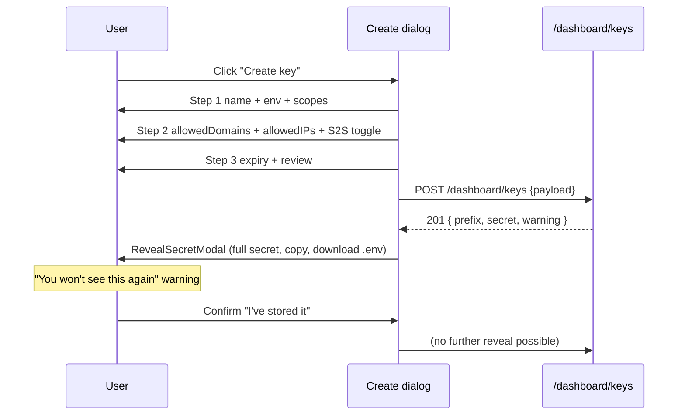
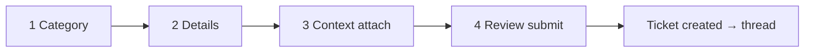

# UI Screen Specs — User Dashboard Portal

This document is the build-from blueprint for every screen of the **Postpin customer portal** — the authenticated SaaS dashboard a developer or eCommerce operator uses to manage API keys, watch usage against quota, test rate calculations, pay invoices, inspect their negotiated rate card, configure webhooks, raise support tickets, and tune their profile and notifications. Each of the twelve screens below is specified to the level a senior engineer can implement directly: route, purpose, three breakpoint layouts (1440 / 768 / 390), a component hierarchy tree, the key components (stat cards, data tables, Recharts charts, dialogs, drawers, toasts, code blocks), empty / skeleton / error states, dark-mode notes, RBAC, and a detailed AI image-generation prompt for a high-fidelity mockup. It assumes the design system in [Design System](17-design-system.md) and consumes contracts from [Shipping Engine](04-shipping-engine.md), [API Key & Access Management](07-api-management.md), [API Analytics](08-api-analytics.md), [Subscription & Plan Engine](09-subscription-engine.md), [Coupon Builder](10-coupon-builder.md), and [Notification Center](13-notification-center.md).

## Contents

- [Conventions used in every screen](#conventions-used-in-every-screen)
- [Portal shell & navigation](#portal-shell--navigation)
- [1. Dashboard (Overview)](#1-dashboard-overview)
- [2. API Keys](#2-api-keys)
- [3. Key Detail](#3-key-detail)
- [4. Usage Analytics](#4-usage-analytics)
- [5. Live Calculator Playground](#5-live-calculator-playground)
- [6. Billing & Plans](#6-billing--plans)
- [7. Invoices](#7-invoices)
- [8. Rate Cards](#8-rate-cards)
- [9. Webhooks](#9-webhooks)
- [10. Support](#10-support)
- [11. Profile & Settings](#11-profile--settings)
- [12. Notification Preferences](#12-notification-preferences)
- [Cross-cutting states & accessibility](#cross-cutting-states--accessibility)

---

## Conventions used in every screen

These rules apply to all screens and are not repeated per-screen unless they differ.

| Concern | Rule |
|---|---|
| **Framework** | Next.js App Router, TypeScript, server components for data fetch, client components for interactivity. Route group `app/(dashboard)/...`. |
| **Breakpoints** | Desktop = 1440px (12-col grid, 24px gutters, 1200px max content). Tablet = 768px (collapsible sidebar → icon rail, 8-col). Mobile = 390px (sidebar → bottom sheet / hamburger drawer, single column, sticky bottom tab bar for top 4 destinations). |
| **Fonts** | Space Grotesk for headings/display and stat numbers; Inter for body/UI; JetBrains Mono for keys, pincodes, code blocks, JSON. |
| **Color** | Light default. Brand gradient `#7C3AED → #9333EA → #DB2777` for primary CTAs, active nav, hero stat. Status: success `#16A34A`, warning `#D97706`, info `#2563EB`, destructive `#DC2626`. Radius `0.75rem`. |
| **Currency** | INR via `formatCurrency()` (`Intl.NumberFormat('en-IN')`), 2 dp. Large counts via `formatCompact()`. Relative times via `formatRelativeTime()`. See `src/lib/format.ts`. |
| **Icons** | Animated Lucide icons everywhere (motion on mount/hover); never static. Disable animation when `prefers-reduced-motion`. |
| **Charts** | Recharts wrapped in `ResponsiveContainer`; gradient fills use brand stops; `isAnimationActive={!prefersReducedMotion}`. |
| **Test locators** | Every interactive/test-relevant element carries `data-testid` using `{feature}-{element}-{type}` (e.g. `apikey-create-btn`, `playground-weight-input`, `billing-plan-card-growth`). Dynamic rows use a stable id: `apikey-row-{keyId}`, never the array index. |
| **Toasts** | Sonner (`src/components/ui/sonner.tsx`), top-right desktop / top-center mobile, 4s, status-colored. |
| **Loading** | Skeletons mirror final layout (no spinners for page loads). Inline async actions show a button spinner + disabled state. |
| **Empty state** | Centered animated Lucide illustration + one-line explainer + primary CTA + secondary "Learn more" doc link. |
| **A11y** | WCAG AA contrast, full keyboard nav, focus-visible ring (`--ring`), `aria-live="polite"` for async results, `prefers-reduced-motion` respected. |

### Role permissions (portal RBAC)

The customer portal is multi-tenant; data is scoped by `companyId`. Within a tenant, four roles gate write actions (read is granted to all members). See [Multi-Tenancy & RBAC](03-multi-tenancy-rbac.md).

| Role | Keys | Billing | Webhooks | Rate cards | Support | Members |
|---|---|---|---|---|---|---|
| **Owner** | full | full | full | read | full | full |
| **Admin** | full | read | full | read | full | invite |
| **Developer** | create/rotate/revoke | read | full | read | create tickets | — |
| **Billing** | read | full | read | read | create tickets | — |
| **Viewer** | read | read | read | read | read | — |

Each screen lists the specific permission strings it requires. A user lacking a permission sees the control **disabled with a tooltip** (`"Requires Owner or Billing role"`), never a hidden-then-404 surprise.

---

## Portal shell & navigation

Every screen renders inside a persistent shell. This is specified once.

```
DashboardShell
├── Sidebar (data-testid="portal-sidebar")
│   ├── BrandMark (Postpin wordmark, gradient "P" glyph)
│   ├── EnvSwitcher (Live ⇄ Test pill, amber when Test)   data-testid="portal-env-switch"
│   ├── NavGroup "Overview"
│   │   ├── NavItem Dashboard            /dashboard
│   │   └── NavItem Usage Analytics      /dashboard/usage
│   ├── NavGroup "Developers"
│   │   ├── NavItem API Keys             /dashboard/keys
│   │   ├── NavItem Playground           /dashboard/playground
│   │   ├── NavItem Webhooks             /dashboard/webhooks
│   │   └── NavItem Rate Cards           /dashboard/rate-cards
│   ├── NavGroup "Account"
│   │   ├── NavItem Billing & Plans      /dashboard/billing
│   │   ├── NavItem Invoices             /dashboard/invoices
│   │   └── NavItem Support              /dashboard/support
│   └── SidebarFooter (PlanBadge "Growth", QuotaMiniBar 142.9k/200k)
├── Topbar (data-testid="portal-topbar")
│   ├── Breadcrumb / page title
│   ├── GlobalSearch (⌘K command menu)   data-testid="portal-cmdk"
│   ├── QuotaPill (live calls-this-month)  data-testid="portal-quota-pill"
│   ├── NotificationBell (unread badge)    data-testid="portal-notif-bell"
│   ├── ThemeToggle (light/dark)           data-testid="portal-theme-toggle"
│   └── UserMenu (avatar → Profile, Settings, Switch company, Sign out)
└── <main> (screen content)
```

- **Desktop (1440):** sidebar fixed 264px, expanded labels. Topbar 64px sticky.
- **Tablet (768):** sidebar collapses to a 72px icon rail; labels appear on hover/focus as tooltips. Topbar keeps bell + theme + avatar; search becomes an icon button opening the ⌘K palette.
- **Mobile (390):** sidebar hidden; hamburger opens a left drawer. A sticky bottom tab bar exposes Dashboard / Keys / Playground / Billing. Topbar shrinks to brand + bell + avatar.

---

## 1. Dashboard (Overview)

**Route:** `/dashboard` · **Permission:** any member (`dashboard:read`)

### Purpose
The landing screen after sign-in. Answers four questions in five seconds: *Am I within quota? What plan am I on? What needs my attention? What happened recently?* It is a glanceable cockpit, not a deep-dive — every tile links to the screen that owns the detail.

### Desktop (1440) layout
A 12-column grid:
- **Row 1 — Hero quota band (full width):** a large gradient card on the left (calls this cycle vs included, RadialBar, reset date) + three KPI stat cards on the right (Success rate, Avg latency, Active keys).
- **Row 2:** left 8 cols = "Calls over time" area chart (last 30 days, outcome-stacked toggle); right 4 cols = "Quick actions" panel (Create key, Open playground, View invoices, Add webhook).
- **Row 3:** left 6 cols = "Recent activity" timeline (keys, payments, sync notices, tickets); right 6 cols = "Plan & next bill" card + "Top endpoints" mini bar list.
- **Row 4 (conditional):** alert banners (quota ≥ 80%, payment past_due, key expiring) pinned above Row 1 when active.

### Tablet (768)
Two columns. Hero quota card spans full width; the three KPIs become a 3-up row beneath it. Area chart full width; quick actions become a 2×2 button grid. Activity timeline full width above the plan card.

### Mobile (390)
Single column, priority order: alert banners → quota card → KPI carousel (horizontal snap, 3 cards) → quick-action 2×2 grid → area chart (height 200) → recent activity (latest 5, "View all") → plan card.

### Component hierarchy
```
DashboardOverview
├── AlertBannerStack            (quota / billing / key-expiry; dismissible per-session)
├── HeroQuotaCard               data-testid="dash-quota-hero"
│   ├── RadialBarChart (used/included)
│   ├── ResetCountdown ("resets in 5 days · 1 Jul")
│   └── UpgradeCTA (shown ≥80%)  data-testid="dash-upgrade-btn"
├── KpiRow
│   ├── StatCard "Calls this cycle"   data-testid="dash-stat-calls-card"
│   ├── StatCard "Success rate"       data-testid="dash-stat-success-card"
│   ├── StatCard "Avg latency"        data-testid="dash-stat-latency-card"
│   └── StatCard "Active keys"        data-testid="dash-stat-keys-card"
├── CallsAreaChart                    data-testid="dash-calls-area"
├── QuickActionsPanel                 data-testid="dash-quick-actions"
├── RecentActivityTimeline            data-testid="dash-activity-timeline"
├── PlanNextBillCard                  data-testid="dash-plan-card"
└── TopEndpointsMiniList              data-testid="dash-top-endpoints"
```

### Key components
- **HeroQuotaCard:** RadialBar (brand gradient track), count-up animated number (`142,903 / 200,000 calls`), percentage, and a status ring colour that shifts info→warning→destructive at 80/90/100%.
- **StatCard:** display number (Space Grotesk), label, animated Lucide icon, and a delta chip vs previous cycle (`▲ 12% · success #16A34A`).
- **CallsAreaChart:** gradient-filled `AreaChart`; toggle "All / Success / Blocked"; tooltip shows the day's totals; backed by `GET /v1/analytics/timeseries?range=30d&grain=day`.
- **RecentActivityTimeline:** typed events with status-colored dots: `key.created`, `key.rotated`, `payment.succeeded`, `sync.completed`, `ticket.replied`, `quota.threshold`. Each row is `dash-activity-row-{eventId}`.

### Empty state
New tenant, zero traffic: hero shows `0 / 1,000` Free quota with a friendly "Make your first call" CTA opening the Playground; area chart shows a dashed baseline with "No requests yet — your usage will appear here." Quick actions elevate "Create your first API key".

### Skeleton/loading
Hero card → shimmer block with a circular placeholder; KPI row → 4 grey cards; area chart → shimmer rectangle with faint gridlines; timeline → 5 line skeletons. No layout shift (skeletons match final heights).

### Error state
Per-widget error boundaries. If `analytics/summary` fails, the quota hero shows a compact "Couldn't load usage · Retry" with a `RefreshCw` retry button; other widgets render independently so one failing API never blanks the page. Global 500 → full-page error card with request id and "Contact support" deep-link.

### Dark-mode notes
Hero gradient keeps brand stops but on `--card #121214`; RadialBar track uses `--muted`/`#27272a`. Stat numbers `--foreground #fafafa`. Area chart grid lines drop to 8% white; gradient fill opacity reduced to avoid bloom on dark.

### AI Image Generation Prompt
> A high-fidelity SaaS dashboard overview screen at 1440px width for "Postpin", a shipping-rate API platform, light theme. Left sidebar 264px wide with a violet gradient "P" logo, grouped navigation (Overview, Developers, Account) and a "Growth plan" badge at the bottom showing a thin quota bar reading "142.9k / 200k". Top bar with breadcrumb "Dashboard", a search field, a violet "Live" pill, a notification bell with a magenta unread dot, and a circular user avatar. Main area: a large hero card on the left with a violet-to-fuchsia gradient radial gauge reading "142,903 / 200,000 calls · resets in 5 days", and three white KPI stat cards to its right showing "Success rate 99.4%", "Avg latency 38 ms", "Active keys 4". Below, a wide area chart titled "Calls over time" with a violet-to-pink gradient fill trending upward over 30 days, and a "Quick actions" panel with four buttons: Create key, Open playground, View invoices, Add webhook. A recent-activity timeline lists "Key rotated · Storefront Production", "Payment succeeded · ₹2,499", "Pincode sync completed · 19,412 updated". Bold Space Grotesk headings, Inter body text, JetBrains Mono for numbers, 0.75rem rounded corners, soft shadows, generous whitespace, animated line-style icons. Indian context: INR amounts, pincodes 400001 and 110001 visible in a small endpoint list. Crisp, modern, premium fintech-grade UI, comparable to Stripe and PostHog dashboards.

---

## 2. API Keys

**Route:** `/dashboard/keys` · **Permissions:** `apiKeys:read` (view), `apiKeys:create`, `apiKeys:rotate`, `apiKeys:revoke`

### Purpose
List, create, restrict, rotate and revoke API keys. The create flow reveals the full secret exactly **once** (see [API Key & Access Management](07-api-management.md) — reveal-once rule). Domain/IP restrictions are configured here.

### Desktop (1440)
- Header row: title + env filter (Live/Test/All) + search + **"Create key"** primary button.
- Summary strip: 3 mini stats — Active keys (4/10 plan cap), Calls today (all keys), Unrestricted keys (warning if > 0).
- Data table (full width) with columns: Name, Key (prefix `pp_live_3kQ9…Zx12`, copy button), Environment badge, Status pill, Restrictions (domain/IP chips, "Unrestricted" warning badge), Calls (30d), Last used (relative), Created, row actions (⋯ → View, Rotate, Disable/Enable, Revoke).

### Tablet (768)
Table collapses to the most important columns (Name+Key, Status, Calls 30d, ⋯). Tapping a row opens Key Detail. Create button moves into the header overflow if space is tight.

### Mobile (390)
Table → stacked cards: each card shows name, env badge, masked key with copy, status, calls 30d, last used, and a kebab menu. "Create key" is a sticky bottom FAB.

### Component hierarchy
```
ApiKeysScreen
├── KeysHeader (env filter, search, CreateKeyButton)   data-testid="apikey-create-btn"
├── KeysSummaryStrip (active / callsToday / unrestricted)
├── KeysDataTable                                       data-testid="apikey-table"
│   └── KeyRow[]  (data-testid="apikey-row-{keyId}")
│       ├── KeyCell (prefix + CopyButton)               data-testid="apikey-copy-{keyId}"
│       ├── EnvBadge / StatusPill / RestrictionChips
│       └── RowActionsMenu (View/Rotate/Disable/Revoke)
├── CreateKeyDialog                                     data-testid="apikey-create-dialog"
│   ├── Step1 NameEnvScopes
│   ├── Step2 Restrictions (domains, IPs, originValidation toggles)
│   └── Step3 ExpiryReview
├── RevealSecretModal                                   data-testid="apikey-reveal-modal"
├── RotateKeyDialog (grace period selector)             data-testid="apikey-rotate-dialog"
└── RevokeConfirmDialog (type-to-confirm)               data-testid="apikey-revoke-dialog"
```

### Create → reveal flow


### Key components
- **CreateKeyDialog (3-step):** validates client-side mirroring server rules — name 2–60 chars unique-per-company; domain wildcard placement (`*.acmeretail.in`), reject `*`/`*.in`; IP/CIDR validity, reject `0.0.0.0/0` without explicit confirm; per-key RPM ≤ plan RPM. Live env warns if no expiry and no restrictions.
- **RevealSecretModal:** shows `pp_live_3kQ9aB7n…Zx12` in a JetBrains-Mono code block with copy-to-clipboard, a "Download `.env`" button (`POSTPIN_API_KEY=pp_live_…`), and a destructive-toned "This secret will never be shown again" banner. Closing requires checking "I have stored this key."
- **RotateKeyDialog:** grace-period slider (0–30 days, default 24h) with copy explaining zero-downtime cutover; issues a successor and re-opens RevealSecretModal for the new secret.
- **RevokeConfirmDialog:** type-to-confirm the key name; destructive button; explains revocation is immediate and irreversible.

### Restriction chips
Domain chips render the pattern; an IP chip renders the CIDR. A key with empty `allowedDomains` **and** empty `allowedIPs` gets a warning `AlertTriangle` "Unrestricted" badge (`apikey-unrestricted-badge-{keyId}`) — surfacing the [security guidance](07-api-management.md#best-practice-guidance-shown-to-users).

### Empty state
No keys: centered `KeyRound` animated icon, "No API keys yet — create one to start calling the Postpin API", primary "Create key", secondary "Read the quickstart".

### Skeleton/loading
Table → 6 row skeletons with shimmer cells matching column widths; summary strip → 3 grey mini stats.

### Error states
- Create failing `name unique per company` → inline field error on Step 1; dialog stays open.
- `apiKeys` cap reached (e.g. 10/10 on Growth) → Create button disabled with tooltip "Key limit reached — upgrade to add more" linking to Billing.
- Rotate/revoke network error → toast (destructive) with retry; table row reverts optimistic state.

### Dark-mode notes
Key code blocks use `--popover #18181b` background. Test-env keys get a dashed amber border; unrestricted warning badge keeps `--warning #d97706` legible on dark. Copy button success flash uses `--success`.

### AI Image Generation Prompt
> A high-fidelity API keys management screen at 1440px for "Postpin" shipping API, light theme, violet-to-fuchsia accents. Left sidebar navigation with "API Keys" highlighted in violet. Page header "API Keys" with a Live/Test filter, a search box, and a bold violet gradient "Create key" button. A summary strip shows "4 / 10 active keys", "5,821 calls today", "1 unrestricted key" with a small amber warning. A clean data table lists four keys in JetBrains Mono: "Storefront — Production · pp_live_3kQ9…Zx12" with a copy icon, a green "Active" pill, domain chips "shop.acmeretail.in", "*.acmeretail.in", "142,903 calls (30d)", "used 2 min ago"; another row "Mobile App · pp_live_7mB2…" Test badge dashed amber; a row with a red "Revoked" pill. Right side of one row shows a three-dot menu. Overlaid on the right, a modal titled "Save your API key" displays a full secret "pp_live_3kQ9aB7nF2pLxY8tWq4ZrM6vK1cD0eHuJ9sZx12" in a monospaced code block with a copy button, a "Download .env" button, and a red warning "You won't see this again". Space Grotesk headings, Inter UI text, 0.75rem rounded corners, soft shadows, animated outline icons, premium developer-tool aesthetic like Stripe and Clerk.

---

## 3. Key Detail

**Route:** `/dashboard/keys/[keyId]` · **Permissions:** `apiKeys:read`, `apiKeys:update`

### Purpose
Deep view of a single key: identity, status & lifecycle controls, restriction editor, per-key usage charts, and an audit log of changes. This is where domain/IP rules are edited and where a key's traffic is inspected.

### Desktop (1440)
- Sticky sub-header: key name (editable inline), prefix, env badge, status pill, and the action cluster (Rotate, Disable/Enable, Revoke).
- Two columns: **left (8)** = tabbed body (Overview · Restrictions · Usage · Activity); **right (4)** = "At a glance" rail (calls today / this month / total, last used + IP, created by, expires in N days, scopes).
- **Overview tab:** restriction summary, rate-limit/quota config, a "Test this key" button that deep-links to the Playground prefilled with this key.
- **Restrictions tab:** editable domain list, IP list, origin-validation toggles (enforce referer/origin, allow server-to-server), with live validation and a "Save changes" sticky bar.
- **Usage tab:** area chart (calls over time for this key) + status donut + top endpoints for this key.
- **Activity tab:** audit timeline (created, rotated, restrictions edited, disabled) from `auditLogs`.

### Tablet (768)
Right rail moves below the tabs as a 3-up stat row. Tabs scroll horizontally if needed.

### Mobile (390)
Single column. Action cluster becomes a kebab menu in the sub-header. Tabs become a segmented control; charts shrink to 180px height; the "At a glance" rail becomes a 2-column stat grid at the top.

### Component hierarchy
```
KeyDetailScreen
├── KeySubHeader (name-inline-edit, prefix, EnvBadge, StatusPill, Actions)
│   data-testid="keydetail-subheader"
├── KeyTabs
│   ├── OverviewTab  (RestrictionSummary, LimitsCard, TestKeyButton)  data-testid="keydetail-test-btn"
│   ├── RestrictionsTab (DomainListEditor, IpListEditor, OriginToggles, SaveBar)
│   │   data-testid="keydetail-restrictions-form"
│   ├── UsageTab (KeyCallsArea, KeyStatusDonut, KeyTopEndpoints)
│   └── ActivityTab (AuditTimeline)
└── AtAGlanceRail (UsageStats, LastUsed, Scopes, ExpiryChip)
```

### Key components
- **DomainListEditor / IpListEditor:** tag-style inputs; each entry validated on blur; invalid entries show inline; an "Include apex" helper adds `acmeretail.in` alongside `*.acmeretail.in`.
- **OriginToggles:** three switches (enforce referer, enforce origin, allow server-to-server) with helper copy from the [trust model](07-api-management.md#referer--origin-validation). Blocks save if S2S off **and** domains empty (key would be unusable).
- **LimitsCard:** shows per-key RPM/burst vs plan ceiling; editing above plan limit is rejected with the reason.
- **AuditTimeline:** each entry shows actor, action, before/after diff (secrets redacted), timestamp.

### Empty / skeleton / error
- **Usage tab empty:** "No requests in this window" with the dashed baseline.
- **Skeleton:** sub-header → name + badge skeleton; tabs → content shimmer; rail → 6 small stat skeletons.
- **404 (key not in tenant):** "Key not found or not in this company" with a link back to the keys list.
- **Save conflict:** if the key was rotated/revoked elsewhere, the save bar shows "This key changed — reload to continue" with a refresh action.

### Dark-mode notes
Inline-edit field uses `--input` border; donut slices keep status colors; audit diff additions in `--success`, removals in `--destructive` with sufficient contrast on `--card`.

### AI Image Generation Prompt
> A high-fidelity API key detail screen at 1440px for "Postpin" shipping API, light theme, violet accents. Sticky sub-header shows an editable key name "Storefront — Production", the prefix "pp_live_3kQ9" in monospace, a violet "Live" badge, a green "Active" pill, and buttons "Rotate", "Disable", "Revoke". Below, a tab bar "Overview · Restrictions · Usage · Activity" with "Restrictions" active, showing a domain list editor with chips "shop.acmeretail.in", "*.acmeretail.in" and an add field, an IP whitelist "103.21.244.0/24", and three toggle switches "Enforce Referer", "Enforce Origin", "Allow server-to-server". A right rail "At a glance" lists "Calls today 5,821", "This month 142,903", "Total 4.82M", "Last used 2 min ago · 103.21.244.40", "Expires in 364 days", and scope chips "rates:calculate", "pincodes:read". A sticky violet "Save changes" bar sits at the bottom. Space Grotesk headings, Inter labels, JetBrains Mono for keys and IPs, 0.75rem rounded corners, soft shadows, animated icons, premium developer-tool look.

---

## 4. Usage Analytics

**Route:** `/dashboard/usage` · **Permission:** `analytics:read`

### Purpose
The customer-facing analytics surface defined in [API Analytics](08-api-analytics.md) §9. Visualizes traffic, success/block mix, latency percentiles, peak hours, top endpoints, and calls-vs-quota across selectable ranges, with CSV export.

### Desktop (1440)
- Controls bar: range selector (`24h · 7d · 30d · 90d · custom`), key filter (all keys / one key), env filter, **Export CSV** button.
- Stat tiles row (5): Total, Success, Failed, Blocked, Avg latency — each with a delta vs previous window.
- Chart grid:
  - Row A: "Calls over time" area (8 cols) + "Calls vs quota" radial (4 cols).
  - Row B: "Top endpoints" horizontal bar (6) + "Status mix" donut (6).
  - Row C: "Latency p50/p95/p99" line (6) + "Peak hours" 7×24 heatmap (6).

### Tablet (768)
Stat tiles → 3+2 wrap. Charts stack to a single column in the order above; heatmap scrolls horizontally to preserve 24 hour cells.

### Mobile (390)
Stat tiles → horizontal snap carousel. Each chart full width, height ≤ 200. Heatmap rendered as a compact "busiest hour" summary chip plus an expandable full grid.

### Component hierarchy
```
UsageAnalyticsScreen
├── AnalyticsControls (RangeSelect, KeyFilter, EnvFilter, ExportCsvButton)
│   data-testid="usage-range-select" / "usage-export-btn"
├── StatTilesRow
│   └── StatCard ×5  (data-testid="usage-stat-{metric}-card")
├── CallsAreaChart        data-testid="usage-calls-area-chart"
├── QuotaRadial           data-testid="usage-quota-radial"
├── TopEndpointsBar       data-testid="usage-top-endpoints-bar"
├── StatusDonut           data-testid="usage-status-donut"
├── LatencyLineChart      data-testid="usage-latency-line"
└── PeakHoursHeatmap      data-testid="usage-peak-hours-heatmap"
```

### Key components & data sources
| Panel | Chart | Endpoint |
|---|---|---|
| Calls over time | Area (gradient) | `GET /v1/analytics/timeseries` |
| Calls vs quota | RadialBar | `GET /v1/analytics/summary` + plan |
| Top endpoints | Horizontal Bar | `GET /v1/analytics/top-endpoints` |
| Status mix | Donut | `GET /v1/analytics/status-mix` |
| Latency p50/p95/p99 | 3-line | `GET /v1/analytics/latency` |
| Peak hours | 7×24 heatmap (brand-gradient intensity) | `GET /v1/analytics/peak-hours` |

- **Export CSV:** enqueues a BullMQ job ([API Analytics §11](08-api-analytics.md#11-csv-export)); button → "Preparing…" toast → "Download ready" toast with signed URL. Range/grain/fields chosen in a small popover.
- All read endpoints accept `range`, `grain` (auto from range), `tz=Asia/Kolkata`; responses cached 30–60s server-side.

### Empty state
No data in the range: each chart shows its own "No requests in this window" with a dashed axis; the controls remain interactive so the user can widen the range. Brand-new tenant gets a single "Make a request to see analytics" CTA → Playground.

### Skeleton/loading
Stat tiles → 5 grey cards; each chart → shimmer with faint axes; switching range shows a subtle progress bar under the controls (data refetch, not full skeleton) so context isn't lost.

### Error state
Per-chart error boundary with "Couldn't load · Retry". A failed CSV export job surfaces a destructive toast with the job id and a "Try again" action; the user is told exports are generated asynchronously and won't be lost on navigation.

### Dark-mode notes
Heatmap intensity scale interpolates brand stops over a `--muted` base; ensure the lightest cell is still distinguishable on `#121214`. Line chart uses `--chart-1/2/3` (`#7c3aed`, `#db2777`, `#2563eb`) for p50/p95/p99; legend chips meet AA on dark.

### AI Image Generation Prompt
> A high-fidelity usage analytics screen at 1440px for "Postpin" shipping API, light theme, violet-to-fuchsia palette. Controls bar with range tabs "24h · 7d · 30d · 90d", a key filter, and a violet "Export CSV" button. A row of five stat cards: "Total 1.42M", "Success 99.4%", "Failed 0.3%", "Blocked 0.3%", "Avg latency 38 ms", each with a small green or red delta. Below, a chart grid: a large gradient area chart "Calls over time" trending up, a radial gauge "Calls vs quota 142.9k / 200k", a horizontal bar chart "Top endpoints" with "POST /v1/rates" longest, a donut "Status mix" mostly green with thin red and amber slices, a multi-line latency chart with three lines p50/p95/p99 in violet, pink and blue, and a 7×24 peak-hours heatmap where Tuesday–Thursday afternoons glow in deep violet-to-fuchsia. Recharts-style rendering, Space Grotesk headings, Inter labels, JetBrains Mono numbers, 0.75rem rounded corners, soft shadows, animated icons, premium analytics dashboard aesthetic like PostHog.

---

## 5. Live Calculator Playground

**Route:** `/dashboard/playground` · **Permission:** `playground:use` (all members)

### Purpose
An interactive sandbox to compute a shipping quote without writing code, and to **see the exact API request/response** the inputs produce. It mirrors the real [Shipping Engine](04-shipping-engine.md) contract so what a user tests is what they ship. It uses a Test key by default (no billing impact) and can switch to a Live key.

### Desktop (1440)
Two-pane split:
- **Left (5 cols) — Input form:** origin pincode (autocomplete with city/state preview), destination pincode (same), weight (g/kg toggle), dimensions L×W×H (cm) with live volumetric readout, payment type (Prepaid/COD) with COD declared value, service level (Surface / Express / Same-day), GST toggle, key+env selector. Sticky "Calculate" button.
- **Right (7 cols) — Result:** zone badge + ETA, chargeable-weight explainer (`max(actual 1.2, volumetric 1.8) = 1.8 kg`), an itemized **breakdown table** (Freight, COD, Remote, Fuel, GST → Total), and a tabbed **"View as code"** block (cURL · Node · Python · Request JSON · Response JSON) with copy.

### Tablet (768)
Form on top (2-column field grid), result below. "View as code" collapses into an accordion under the breakdown.

### Mobile (390)
Single column wizard feel: form fields stacked; a sticky bottom "Calculate" bar; result appears below with the breakdown and a "View as API" disclosure. Code block horizontally scrolls.

### Component hierarchy
```
PlaygroundScreen
├── PlaygroundForm                       data-testid="playground-form"
│   ├── PincodeAutocomplete origin       data-testid="playground-origin-input"
│   ├── PincodeAutocomplete destination  data-testid="playground-dest-input"
│   ├── WeightInput (+unit toggle)       data-testid="playground-weight-input"
│   ├── DimensionsInput L×W×H            data-testid="playground-dims-input"
│   ├── VolumetricReadout (live)         data-testid="playground-volumetric-readout"
│   ├── PaymentTypeToggle + CodValue     data-testid="playground-cod-toggle"
│   ├── ServiceSelect                    data-testid="playground-service-select"
│   ├── GstToggle                        data-testid="playground-gst-toggle"
│   ├── KeyEnvSelector                   data-testid="playground-key-select"
│   └── CalculateButton                  data-testid="playground-calculate-btn"
└── PlaygroundResult                     data-testid="playground-result"
    ├── ZoneEtaHeader (ZoneBadge, EtaChip)
    ├── ChargeableWeightExplainer
    ├── BreakdownTable                    data-testid="playground-breakdown-table"
    ├── TotalRow                          data-testid="playground-total"
    └── CodeViewTabs (cURL/Node/Python/Req/Res)  data-testid="playground-code-tabs"
```

### Sample request (echoes the engine contract)
```json
{
  "pickupPincode": "400001",
  "deliveryPincode": "110001",
  "weight": 1.2,
  "weightUnit": "kg",
  "dimensions": { "length": 30, "width": 20, "height": 15, "unit": "cm" },
  "paymentType": "COD",
  "codAmount": 2500,
  "service": "express",
  "options": { "includeGst": true }
}
```

### Sample response → renders the breakdown table
```json
{
  "currency": "INR",
  "service": "express",
  "zone": "C",
  "weight": { "actualKg": 1.2, "volumetricKg": 1.8, "billableKg": 1.8, "slabKg": 2.0 },
  "breakdown": [
    { "code": "freight",     "label": "Freight (Zone C, Express, 2.0 kg)", "amount": 161.00 },
    { "code": "cod",         "label": "COD charge (1.5% of ₹2500, min ₹30)", "amount": 37.50 },
    { "code": "remote_area", "label": "Remote-area surcharge",              "amount": 0.00 },
    { "code": "fuel",        "label": "Fuel surcharge (18% of freight)",     "amount": 28.98 }
  ],
  "subtotal": 227.48,
  "gst": { "applicable": true, "percent": 18, "amount": 40.95 },
  "total": 268.43,
  "meta": { "rateCardId": "rc_acme_default", "latencyMs": 11 }
}
```

The breakdown table renders each `breakdown[]` line with its `label` and `formatCurrency(amount)`, then GST, then a bold **Total ₹268.43**. The zone badge shows "Metro (Zone C)", ETA "2–4 days". `meta.latencyMs` is shown as a subtle "computed in 11 ms" chip.

### Key components
- **PincodeAutocomplete:** debounced lookup against the pincodes service (sample set: 110001 New Delhi, 400001 Mumbai, 560001 Bengaluru, 194101 Leh…); shows city/state inline; flags `unserviceable`/`remote` pincodes with a chip.
- **VolumetricReadout:** live `L×W×H / 5000` in kg, and which weight is chargeable (highlights the larger of actual vs volumetric).
- **CodeViewTabs:** generated snippets stay in sync with form state; "Copy" toasts success; a "Run again" re-issues the call.

### Edge cases & failures
| Input | Behaviour |
|---|---|
| Pincode fails `^[1-9][0-9]{5}$` | Inline "Enter a valid 6-digit pincode"; Calculate disabled. |
| Unserviceable destination | Result panel shows a `422 unserviceable_pincode` state with the engine error envelope and a "choose serviceable pincode" hint. |
| Weight and dims both empty/≤0 | `400 invalid_dimensions` inline; can't submit. |
| COD selected, no declared value | Prompt for declared value (drives COD %). |
| Test key + Live toggle | Switching env re-labels the code block and warns the Live call counts toward quota. |
| Rate-limited (429) | Result shows `Retry-After` and "you're calling too fast"; never a hard crash. |

### Empty state
Pre-calculation: result pane shows a friendly "Fill the form and hit Calculate" with a sample prefilled (Mumbai → Delhi, 1.2 kg express COD) one-click "Try this example" button.

### Skeleton/loading
On Calculate: result pane shows a 600ms shimmer over the breakdown rows; the button shows a spinner; `aria-live` announces the total when ready.

### Error state
Engine/network errors render the **exact API error envelope** (`code`, `message`, `requestId`, `docsUrl`) in a destructive card so developers learn the real contract, plus a "Retry" button.

### Dark-mode notes
Code blocks use `--popover #18181b` with violet keyword tinting; the chargeable-weight highlight uses `--accent`/violet on dark; breakdown table zebra rows use 4% white.

### AI Image Generation Prompt
> A high-fidelity shipping rate calculator playground at 1440px for "Postpin", light theme, violet-to-fuchsia accents. Left pane is an input form: origin pincode "400001 — Mumbai, Maharashtra", destination "110001 — New Delhi, Delhi", weight "1.2 kg" with a g/kg toggle, dimensions "30 × 20 × 15 cm" with a live readout "Volumetric 1.80 kg · chargeable", a Prepaid/COD toggle set to COD with declared value "₹2,500", a service selector "Express", a GST toggle on, a Live/Test key selector, and a big violet gradient "Calculate" button. Right pane shows the result: a violet "Metro · Zone C" badge, "ETA 2–4 days", a chargeable-weight explainer "max(actual 1.2, volumetric 1.8) = 1.8 kg", and an itemized breakdown table — "Freight ₹161.00", "COD charge ₹37.50", "Remote-area ₹0.00", "Fuel surcharge ₹28.98", "GST 18% ₹40.95", bold "Total ₹268.43". Below the breakdown, a tabbed code block "cURL · Node · Python · Request · Response" showing JSON with a copy button. Space Grotesk headings, Inter labels, JetBrains Mono for code and amounts, 0.75rem rounded corners, soft shadows, animated icons, premium developer playground aesthetic.

---

## 6. Billing & Plans

**Route:** `/dashboard/billing` · **Permissions:** `billing:read` (view), `billing:manage` (Owner/Billing for changes)

### Purpose
Show the current plan and cycle, change plan (upgrade/downgrade with proration preview), manage payment method, apply coupons, and view overage status. Implements flows from [Subscription & Plan Engine](09-subscription-engine.md) and [Coupon Builder](10-coupon-builder.md).

### Desktop (1440)
- **Current plan card (full width):** plan name "Growth", price ₹2,499/mo, cycle dates, "renews 1 Jul", a quota usage bar (142.9k/200k), overage chip (₹2,022 accruing), payment method (•••• 4242 / UPI mandate), and buttons "Change plan", "Manage payment", "Apply coupon", "Cancel".
- **Plan comparison grid (5 cards):** Free / Starter / Growth / Scale / Enterprise with feature rows; current plan highlighted; monthly/yearly toggle (yearly shows "2 months free").
- **Coupon panel:** input + apply, shows active coupon (`MONSOON20 · 20% off base · 2 of 3 cycles left`).
- **Overage explainer:** current overage calls, rate, projected charge on next invoice.

### Tablet (768)
Current plan card stacks its sub-sections. Plan grid becomes a horizontal scroll of cards (snap), current plan first.

### Mobile (390)
Current plan card single column. Plan grid → vertical stack with a sticky "Compare plans" toggle. Coupon input full width. "Change plan" opens a full-screen sheet.

### Component hierarchy
```
BillingScreen
├── CurrentPlanCard                 data-testid="billing-current-plan-card"
│   ├── QuotaUsageBar
│   ├── OverageChip
│   ├── PaymentMethodSummary
│   └── ActionRow (ChangePlan, ManagePayment, ApplyCoupon, Cancel)
│       data-testid="billing-change-plan-btn"
├── BillingIntervalToggle (monthly/yearly)   data-testid="billing-interval-toggle"
├── PlanComparisonGrid
│   └── PlanCard ×5  (data-testid="billing-plan-card-{planId}")
├── CouponPanel (ApplyCouponInput)           data-testid="billing-coupon-input"
├── OverageExplainer
├── ChangePlanDialog (ProrationPreview)      data-testid="billing-proration-dialog"
├── PaymentMethodDialog (Razorpay/UPI/card)  data-testid="billing-payment-dialog"
└── CancelSubscriptionDialog (reason, win-back)  data-testid="billing-cancel-dialog"
```

### Plan grid data (India pricing, exclusive of 18% GST)
| | Free | Starter | Growth | Scale | Enterprise |
|---|---|---|---|---|---|
| Price/mo | ₹0 | ₹999 | ₹2,499 | ₹7,999 | Contact sales |
| Calls/mo | 1,000 | 25,000 | 200,000 | 1,000,000 | Custom |
| RPM | 10 | 60 | 300 | 1,200 | Custom |
| API keys | 1 | 3 | 10 | 50 | Unlimited |
| Webhooks | 0 | 2 | 10 | 50 | Unlimited |
| Overage | hard block | ₹0.20/call | ₹0.15/call | ₹0.10/call | Negotiated |
| Custom rate cards | No | No | Yes | Yes | Yes |
| Support | Community | Email | Priority | Priority+chat | Dedicated TAM |

### Change-plan proration preview
On selecting a new plan, the **ChangePlanDialog** calls `POST /v1/subscription/preview` and renders the proration math (see [Subscription Engine](09-subscription-engine.md#proration-on-upgrade--downgrade)):
- **Upgrade** (e.g. Growth → Scale): "Effective immediately. You'll be charged the prorated difference now: net ₹3,481.79 + GST ₹626.72 = **₹4,108.51**. New limits apply at once."
- **Downgrade:** "Takes effect at next renewal (1 Jul). Your current usage (142.9k) fits within Starter? No — warns the user and queues for period end."
- **Free → paid:** fresh cycle from now, no credit.

### Key components
- **PlanCard:** tier price (yearly toggles), included calls, headline features, current = violet ring + "Current plan" chip, others = "Upgrade"/"Downgrade" button. Enterprise card = "Talk to sales".
- **CouponPanel:** apply → validates via coupon engine; shows applies-to scope, discount type (%/fixed/trial), cycles remaining; rejects invalid/expired with a reason ([Coupon Builder](10-coupon-builder.md)).
- **PaymentMethodDialog:** Razorpay-first (UPI AutoPay / e-NACH mandate, cards); shows mandate status for recurring debit.

### Empty / special states
- **Free plan tenant:** current plan card shows "Free · 1,000 calls/mo"; prominent "Upgrade" with the comparison grid expanded by default.
- **`past_due`:** a destructive banner "Payment failed — update your method to avoid suspension" with the dunning timeline; API access shown as "grace window ends in N days".
- **`trialing`:** a chip "Trial · ends in 9 days"; card-required trials show the saved mandate.

### Skeleton/loading
Current plan card → shimmer with a placeholder quota bar; plan grid → 5 card skeletons; proration preview → spinner while `/preview` resolves.

### Error state
- Coupon invalid → inline error under the input with the specific reason.
- Payment update failure → destructive toast; Razorpay errors mapped to friendly copy.
- `/preview` failure → dialog shows "Couldn't calculate proration · Retry"; change is not committed.

### Dark-mode notes
Current plan card keeps a subtle brand-gradient top border on `--card`; the current PlanCard ring stays violet `--primary #8b5cf6` (brighter dark variant); overage chip uses `--warning`. GST/INR figures keep `--foreground` contrast.

### AI Image Generation Prompt
> A high-fidelity billing and plans screen at 1440px for "Postpin" shipping API, light theme, violet-to-fuchsia accents. A wide current-plan card reads "Growth · ₹2,499 / month · renews 1 Jul", a quota usage bar "142,903 / 200,000 calls", an amber overage chip "₹2,022 accruing", a payment summary "UPI AutoPay · Razorpay", and buttons "Change plan", "Manage payment", "Apply coupon". Below, a monthly/yearly toggle and a five-card plan comparison grid: Free ₹0, Starter ₹999, Growth ₹2,499 (highlighted with a violet ring and "Current plan" chip), Scale ₹7,999, Enterprise "Contact sales", each listing calls per month, API keys, webhooks and support tier. A coupon panel shows "MONSOON20 · 20% off base · 2 of 3 cycles left" with a green check. A small proration dialog overlays reading "Upgrade to Scale — charged now ₹4,108.51 (incl. 18% GST)". Space Grotesk headings, Inter body, JetBrains Mono for amounts, 0.75rem rounded corners, soft shadows, animated icons, premium SaaS billing aesthetic like Stripe billing.

---

## 7. Invoices

**Route:** `/dashboard/invoices` · **Permissions:** `billing:read`

### Purpose
List and download GST-compliant invoices, see status, and inspect line items (base + overage − coupon + GST). One row per invoice; clicking opens a detail drawer.

### Desktop (1440)
- Header: title + year filter + status filter (Paid/Open/Past due/Void) + "Download all (zip)".
- Data table: Invoice # (`INV-2026-0042`), Period, Plan, Amount (₹, incl. GST), Status pill, Issued, Paid date, actions (View, Download PDF).
- Right-side detail **drawer** on row click: billed-to (company + GSTIN), line items, CGST/SGST or IGST split, total, payment method, "Download PDF".

### Tablet (768)
Table reduced to Invoice #, Amount, Status, ⋯. Drawer becomes a near-full-width overlay.

### Mobile (390)
Invoices as stacked cards (number, amount, status, date, download). Detail opens as a full-screen sheet.

### Component hierarchy
```
InvoicesScreen
├── InvoicesHeader (YearFilter, StatusFilter, DownloadAllButton)
├── InvoicesTable                       data-testid="invoices-table"
│   └── InvoiceRow[]  (data-testid="invoice-row-{invoiceId}")
│       ├── StatusPill / AmountCell
│       └── RowActions (View, DownloadPdf)  data-testid="invoice-download-{invoiceId}"
└── InvoiceDetailDrawer                 data-testid="invoice-detail-drawer"
    ├── BilledToBlock (company, GSTIN, address)
    ├── LineItemsTable (base, overage, coupon, GST split)
    └── PayInvoiceButton (only if status open/past_due)  data-testid="invoice-pay-btn"
```

### Sample invoice line items
```json
{
  "number": "INV-2026-0042",
  "period": { "start": "2026-06-01", "end": "2026-06-30" },
  "plan": "Growth",
  "lines": [
    { "label": "Growth plan — monthly",            "amount": 2499.00 },
    { "label": "Overage — 13,480 calls @ ₹0.15",   "amount": 2022.00 },
    { "label": "Coupon MONSOON20 (20% off base)",  "amount": -499.80 }
  ],
  "subtotal": 4021.20,
  "gst": { "type": "IGST", "percent": 18, "amount": 723.82 },
  "total": 4745.02,
  "currency": "INR",
  "hsnSac": "998314",
  "status": "paid"
}
```

The detail drawer renders intra-state as **CGST 9% + SGST 9%** and inter-state as **IGST 18%**, determined by the customer GSTIN state code vs place of supply, and shows `hsnSac` and both parties' GSTIN.

### Key components
- **StatusPill:** Paid `--success`, Open `--info`, Past due `--destructive`, Void `--muted`.
- **InvoiceDetailDrawer:** print-friendly; "Download PDF" streams the generated invoice; "Pay now" appears only for open/past_due, routing to the payment dialog.

### Empty state
No invoices (new/Free tenant): "No invoices yet — invoices appear after your first paid cycle" with a `ReceiptText` animated icon and a link to Billing.

### Skeleton/loading
Table → 8 row skeletons; drawer → line-item shimmer.

### Error state
- PDF generation pending → "Your invoice PDF is being generated · refresh shortly".
- Download failure → destructive toast + retry; the row stays usable.

### Dark-mode notes
Status pills keep status colors on `--card`; the drawer background `--popover`; PDF preview thumbnail inverts to a light "paper" frame to read as a document even in dark mode.

### AI Image Generation Prompt
> A high-fidelity invoices screen at 1440px for "Postpin" shipping API, light theme, violet accents. Header "Invoices" with a year filter "2026", a status filter, and a "Download all" button. A data table lists invoices in monospace numbers: "INV-2026-0042 · Jun 2026 · Growth · ₹4,745.02 · Paid (green pill) · download icon", "INV-2026-0031 · May 2026 · ₹2,948.20 · Paid", "INV-2026-0019 · Apr 2026 · ₹2,948.20 · Paid". A right-side detail drawer is open showing "Billed to: Acme Retail Pvt Ltd · GSTIN 27ABCDE1234F1Z5", line items "Growth plan ₹2,499.00", "Overage 13,480 calls @ ₹0.15 ₹2,022.00", "Coupon MONSOON20 −₹499.80", "IGST 18% ₹723.82", bold "Total ₹4,745.02", HSN/SAC 998314, and a violet "Download PDF" button. Space Grotesk headings, Inter body, JetBrains Mono for amounts and invoice numbers, 0.75rem rounded corners, soft shadows, premium finance UI.

---

## 8. Rate Cards

**Route:** `/dashboard/rate-cards` · **Permissions:** `rateCards:read` (customer view is read-only; edits are an admin/sales action)

### Purpose
A read-only view of the customer's **negotiated rate card** — the slab grid that drives their quotes. Shows zone × service freight slabs, the surcharge config (COD, remote, fuel, GST, volumetric divisor, weight step), and version/effective dates, so customers can audit what they're charged. (Custom rate cards are a Growth+ feature; Free/Starter see the default published card.)

### Desktop (1440)
- Header: card name + version chip (`rc_acme_default · v3 · effective 1 Apr 2026`) + zone version + "Download CSV".
- **Slab matrix:** a data table with rows = weight slabs (0.5, 1.0, 1.5 kg…), columns = zones A–E, cells = freight for the selected service; a service tab switches Surface / Express / Same-day.
- **Surcharge config card:** COD (flat ₹30 + 1.5%), Remote (flat ₹70 + ₹15/kg), Fuel (18%), GST (18%), divisor (5000), weight step (0.5 kg) — all read-only with helper copy.
- A "How a quote is built" link → Playground / [Shipping Engine](04-shipping-engine.md).

### Tablet (768)
Matrix scrolls horizontally (zone columns); surcharge card stacks below. Service tabs stay sticky.

### Mobile (390)
Matrix becomes a zone selector + a per-zone slab list (slab → price). Surcharge config as a definition list.

### Component hierarchy
```
RateCardsScreen
├── RateCardHeader (name, VersionChip, ServiceTabs, DownloadCsvButton)
│   data-testid="ratecard-service-tabs" / "ratecard-export-btn"
├── SlabMatrixTable                     data-testid="ratecard-matrix"
│   └── SlabRow[]  (data-testid="ratecard-slab-{kg}")  cells per zone A–E
├── SurchargeConfigCard                 data-testid="ratecard-surcharges"
│   ├── CodConfig / RemoteConfig / FuelConfig / GstConfig
│   └── VolumetricConfig (divisor, weight step)
└── ZoneLegend (A Local … E Special/Remote)
```

### Sample slab matrix (Express, INR per slab)
| Slab (kg) | A Local | B Regional | C Metro | D National | E Special |
|---|---|---|---|---|---|
| 0.5 (base) | 28 | 42 | 65 | 65 | 95 |
| +0.5 step | 18 | 26 | 32 | 38 | 48 |

Cells show the base (covers first 0.5 kg) and the per-step add-on, matching the [worked examples](04-shipping-engine.md#worked-examples) (e.g. Zone C Express base ₹65 + ₹32/step).

### Key components
- **SlabMatrixTable:** sticky first column (slab), zone column headers with tooltips; the active service's values; cells right-aligned `formatCurrency`.
- **SurchargeConfigCard:** read-only chips with the exact formula text so a customer can reproduce a quote; mirrors the engine [Configuration Reference](04-shipping-engine.md#configuration-reference).
- **VersionChip:** clicking shows effective date and a note that changes are negotiated with sales (no self-edit).

### Empty state
No custom card (Free/Starter): an info card "You're on the standard published rate card. Upgrade to Growth for a negotiated custom card." + a preview of the default card.

### Skeleton/loading
Matrix → header + 8 row shimmer; surcharge card → 5 line skeletons.

### Error state
Card fetch failure → "Couldn't load your rate card · Retry"; if no active card exists for the company, show "No active rate card — contact support" (mirrors engine `rate_card_missing`).

### Dark-mode notes
Matrix zebra rows 4% white; sticky slab column gets `--card` background to stay legible while horizontal-scrolling; zone header tooltips use `--popover`.

### AI Image Generation Prompt
> A high-fidelity rate card viewer at 1440px for "Postpin" shipping API, light theme, violet accents, read-only. Header "Your rate card · rc_acme_default · v3 · effective 1 Apr 2026" with service tabs "Surface · Express · Same-day" (Express active) and a "Download CSV" button. A slab matrix table: rows are weight slabs "0.5 kg", "1.0 kg", "1.5 kg", "2.0 kg" and columns are zones "A Local · B Regional · C Metro · D National · E Special", cells show INR freight like "₹65", "₹97", "₹129", "₹161" with the metro column highlighted. Below, a surcharge config card listing "COD ₹30 flat + 1.5%", "Remote ₹70 + ₹15/kg", "Fuel 18% of freight", "GST 18%", "Volumetric divisor 5000", "Weight step 0.5 kg", each read-only with a small lock icon. A zone legend maps A–E to colors. Space Grotesk headings, Inter labels, JetBrains Mono for amounts, 0.75rem rounded corners, soft shadows, premium logistics-data UI.

---

## 9. Webhooks

**Route:** `/dashboard/webhooks` · **Permissions:** `webhooks:read`, `webhooks:manage`

### Purpose
Register outbound webhook endpoints, choose subscribed events, view the signing secret, and inspect a delivery event log with retry/replay. Implements the platform webhook spec referenced in [API Analytics](08-api-analytics.md) and [Notification Center](13-notification-center.md). (Webhooks are a Starter+ feature; Free shows an upgrade gate.)

### Desktop (1440)
- Header: title + "Add endpoint" button + plan cap chip (`2 / 10 endpoints`).
- **Endpoints list:** each endpoint card = URL, status (enabled/disabled), subscribed events chips, last delivery status, success rate (7d), "Send test", "View secret", edit/disable/delete.
- **Event log table (below or in a tab):** Event id, type (`apiKey.rotated`, `quota.threshold`, `invoice.paid`…), endpoint, HTTP response, attempts, delivered-at, actions (View payload, Replay).

### Tablet (768)
Endpoints as full-width cards; event log table reduced columns; payload viewer in a drawer.

### Mobile (390)
Endpoints stacked; event log as cards (type, status, time, replay). "Add endpoint" is a bottom sheet.

### Component hierarchy
```
WebhooksScreen
├── WebhooksHeader (AddEndpointButton, CapChip)   data-testid="webhook-add-btn"
├── EndpointsList
│   └── EndpointCard[]  (data-testid="webhook-endpoint-{endpointId}")
│       ├── EventChips / StatusPill / SuccessRate
│       └── Actions (SendTest, ViewSecret, Edit, Disable, Delete)
│           data-testid="webhook-test-{endpointId}"
├── AddEditEndpointDialog (url, event multiselect, secret)  data-testid="webhook-endpoint-dialog"
├── RevealSecretModal (signing secret, reveal-once style)   data-testid="webhook-secret-modal"
└── EventLogTable                                  data-testid="webhook-event-log"
    └── EventRow[]  (data-testid="webhook-event-{eventId}")
        └── Actions (ViewPayload, Replay)          data-testid="webhook-replay-{eventId}"
```

### Subscribable events (selection)
| Event | When |
|---|---|
| `apiKey.created` / `.rotated` / `.revoked` / `.expiring` | Key lifecycle ([API Management](07-api-management.md#webhooks-for-key-events)) |
| `quota.threshold` (80/90/100%) | Usage thresholds ([Analytics §13](08-api-analytics.md#13-quota--usage-alerts)) |
| `subscription.activated` / `.trial_ended` / `.expired` | Subscription lifecycle |
| `invoice.paid` / `invoice.payment_failed` | Billing |
| `pincode.sync.completed` / `.failed` | Pincode sync notices |

### Sample delivery log row → payload viewer
```json
{
  "id": "evt_2Ld9kQ",
  "type": "apiKey.rotated",
  "endpoint": "https://hooks.acmeretail.in/postpin",
  "status": 200,
  "attempts": 1,
  "deliveredAt": "2026-06-26T09:20:01.114Z",
  "signature": "t=1750931999,v1=9c1f…",
  "payload": {
    "id": "evt_2Ld9kQ",
    "type": "apiKey.rotated",
    "livemode": true,
    "data": { "keyId": "66a1f0…", "prefix": "pp_live_3kQ9", "successorPrefix": "pp_live_7mB2" }
  }
}
```

### Key components
- **EndpointCard:** success-rate ring (7d), last-delivery status, and a "Send test event" that posts a signed sample and shows the response inline.
- **RevealSecretModal:** signing secret shown once at creation/rotation (reveal-once), with `X-Postpin-Signature` verification guidance (HMAC-SHA256) and a note that retries reuse the idempotency key.
- **EventLogTable:** filter by event type / status / endpoint; **Replay** re-enqueues a delivery; failed deliveries (4xx/5xx) show attempt history and the backoff schedule.

### Empty / gated states
- **Free plan:** the whole screen is an upgrade gate — "Webhooks are available on Starter and above" with the plan card and an "Upgrade" CTA.
- **No endpoints (Starter+):** "Add your first endpoint to receive events" with a `Webhook` animated icon.
- **No events yet:** "Deliveries will appear here once events fire — send a test event to try it."

### Skeleton/loading
Endpoint cards → 2 card skeletons; event log → 8 row skeletons.

### Error state
- Endpoint URL invalid/non-HTTPS → inline error in the dialog.
- Test delivery failure → the card shows the failing status code + response body excerpt; "Retry test".
- An endpoint auto-disabled after repeated failures shows a warning banner ("disabled after 20 consecutive failures — re-enable to resume") and a `webhook.endpoint_disabled` note.

### Dark-mode notes
Payload JSON in `--popover` with violet key tinting; success-rate ring uses `--success`/`--destructive`; the signing secret reveal uses the same destructive-toned warning frame as API key reveal.

### AI Image Generation Prompt
> A high-fidelity webhooks management screen at 1440px for "Postpin" shipping API, light theme, violet-to-fuchsia accents. Header "Webhooks" with an "Add endpoint" button and a "2 / 10 endpoints" chip. Two endpoint cards: "https://hooks.acmeretail.in/postpin" with a green "Enabled" pill, event chips "apiKey.rotated", "quota.threshold", "invoice.paid", a "98.7% delivered (7d)" ring, and buttons "Send test", "View secret"; a second endpoint "https://erp.acme.in/events" disabled with an amber warning. Below, an event log table: "evt_2Ld9kQ · apiKey.rotated · 200 OK · 1 attempt · 2 min ago · Replay", "evt_9Xm2pR · quota.threshold · 200 · just now", "evt_4Kp7tZ · invoice.payment_failed · 500 · 3 attempts · Replay (amber)". A right drawer previews a signed JSON payload with an X-Postpin-Signature header. Space Grotesk headings, Inter labels, JetBrains Mono for URLs, event ids and JSON, 0.75rem rounded corners, soft shadows, animated icons, premium developer-platform aesthetic like Stripe webhooks.

---

## 10. Support

**Route:** `/dashboard/support` (list) · `/dashboard/support/new` (multi-step) · `/dashboard/support/[ticketId]` (thread)
**Permissions:** `support:read`, `support:create` (all members create; replies by participants)

### Purpose
Raise and track support tickets. A list of tickets, a guided multi-step "new ticket" flow, and a threaded conversation view with agent replies, status, and attachments. Maps to `tickets` / `ticketReplies` collections and the `ticket.created` / `ticket.replied` events.

### 10a. Ticket list
**Desktop (1440):** header (title + status filter + "New ticket"); table: Subject, Category, Priority pill, Status pill, Last update, Assignee, (open count summary chips). **Tablet:** reduced columns. **Mobile:** ticket cards.

### 10b. New ticket (multi-step)

- **Step 1 — Category:** Billing / API / Pincode data / Account / Feature request / Other (cards).
- **Step 2 — Details:** subject, description (rich text), priority (Low/Medium/High/Urgent with guidance).
- **Step 3 — Context:** auto-attach helpful context (current plan, last request id, key prefix — opt-in), file/screenshot upload.
- **Step 4 — Review & submit:** summary → `POST /tickets` → redirect to thread; fires `ticket.created`.

### 10c. Ticket thread
**Desktop (1440):** left = conversation (messages with author/role/avatar, timestamps, attachments, status changes inline); right rail = ticket meta (id, category, priority, status, assignee, created/updated, related plan/key). A reply composer pinned at the bottom; "Resolve" / "Reopen" controls.

### Component hierarchy
```
SupportListScreen
├── SupportHeader (StatusFilter, NewTicketButton)   data-testid="support-new-btn"
└── TicketsTable                                    data-testid="support-table"
    └── TicketRow[]  (data-testid="ticket-row-{ticketId}")

NewTicketWizard                                     data-testid="support-new-wizard"
├── StepCategory      data-testid="ticket-category-select"
├── StepDetails       data-testid="ticket-subject-input" / "ticket-priority-select"
├── StepContext       data-testid="ticket-attach-input"
└── StepReview (SubmitButton)  data-testid="ticket-submit-btn"

TicketThreadScreen
├── ThreadHeader (subject, StatusPill, ResolveButton)  data-testid="ticket-resolve-btn"
├── MessageList
│   └── MessageBubble[]  (data-testid="ticket-message-{messageId}")
├── ReplyComposer (RichText, AttachButton, SendButton)  data-testid="ticket-reply-input"
└── TicketMetaRail (category, priority, assignee, related)
```

### Key components
- **TicketRow:** priority pill (Low `--muted`, Medium `--info`, High `--warning`, Urgent `--destructive`), status pill (Open `--info`, Pending `--warning`, Resolved `--success`, Closed `--muted`).
- **MessageBubble:** customer right-aligned (brand-tinted), agent left-aligned (neutral), with avatar, role chip, relative time; inline "status changed to Pending" system rows.
- **ReplyComposer:** rich text + attachments; "Send" disabled when empty; sending shows optimistic bubble; emits `ticket.replied`.

### Empty / skeleton / error
- **List empty:** "No tickets yet — we're here to help" + "New ticket" + links to docs/status page.
- **Skeleton:** list → 6 rows; thread → header + 4 message skeletons + composer.
- **Error:** submit failure keeps the wizard state and shows a retry; reply failure leaves the draft in the composer and toasts.

### Dark-mode notes
Customer bubbles use a subtle brand tint on `--card`; agent bubbles `--secondary #27272a`; attachments thumbnails framed for contrast; status pills retain status colors.

### AI Image Generation Prompt
> A high-fidelity support ticket thread screen at 1440px for "Postpin" shipping API, light theme, violet accents. Header "Why is pincode 194101 showing unserviceable?" with an "Open" status pill and a "Resolve" button. A conversation: a customer message (right, violet-tinted) "Calls to 194101 Leh return 422 unserviceable — is this expected?", an agent reply (left, neutral, avatar + "Support" chip) "194101 is a remote ODA pincode; it's serviceable on Express only. Here's the rate…", a system row "Status changed to Pending", then a customer follow-up. A reply composer with rich-text controls and an attach button sits at the bottom. A right rail shows ticket meta: "#TKT-2048 · Category: Pincode data · Priority: Medium · Assignee: Riya · Created 2 days ago · Plan: Growth". Space Grotesk headings, Inter body, 0.75rem rounded corners, soft shadows, animated icons, friendly premium helpdesk aesthetic.

---

## 11. Profile & Settings

**Route:** `/dashboard/settings` · **Permissions:** self (`profile:manage`); company/security sections gated by Owner/Admin

### Purpose
Manage personal profile, password, two-factor auth, active sessions, company details (name, GSTIN, address, place of supply for GST), team members & roles, and danger-zone actions. Tabbed settings hub.

### Desktop (1440)
Left vertical tab nav (Profile · Security · Company · Team · Danger zone); right = active panel.
- **Profile:** name, email (verify), avatar, locale/timezone (default IST), display preferences.
- **Security:** change password, 2FA (TOTP) setup with QR, active sessions list with revoke, recent security events.
- **Company:** legal name, GSTIN, billing address, place-of-supply state (drives CGST/SGST vs IGST), default currency INR.
- **Team:** member table (name, email, role, status), invite, change role, remove (RBAC-gated).

### Tablet (768)
Tab nav becomes a horizontal scroller; panels full width.

### Mobile (390)
Settings as an accordion list; each section expands to a full panel; 2FA QR scales to fit.

### Component hierarchy
```
SettingsScreen
├── SettingsTabs (Profile/Security/Company/Team/Danger)  data-testid="settings-tabs"
├── ProfilePanel (NameInput, EmailVerify, AvatarUpload, TimezoneSelect)
│   data-testid="settings-name-input" / "settings-avatar-upload"
├── SecurityPanel (ChangePassword, TwoFactorSetup, SessionsTable)
│   data-testid="settings-2fa-toggle" / "settings-session-revoke-{sessionId}"
├── CompanyPanel (LegalName, GstinInput, AddressFields, PlaceOfSupplySelect)
│   data-testid="settings-gstin-input"
├── TeamPanel (MembersTable, InviteButton, RoleSelect)
│   data-testid="settings-invite-btn" / "team-row-{userId}"
└── DangerZone (TransferOwnership, DeleteAccount)  data-testid="settings-delete-account-btn"
```

### Key components
- **TwoFactorSetup:** QR + manual secret, verify code, recovery codes (download once); status chip "2FA enabled".
- **SessionsTable:** device, location (city, IST time), current-session marker, "Revoke" per row + "Revoke all others".
- **GstinInput:** validates the 15-char GSTIN format; the state code feeds GST split logic.
- **TeamPanel:** role select per member (Owner/Admin/Developer/Billing/Viewer); only Owner can transfer ownership; invites send an email.
- **DangerZone:** transfer ownership (Owner only) and delete account/company with type-to-confirm and a clear data-retention notice.

### Empty / skeleton / error
- **Team empty:** "Invite your team to collaborate" with an invite CTA.
- **Skeleton:** panel-specific field skeletons; sessions table → 4 rows.
- **Error:** GSTIN invalid → inline; password change failure → field error; invite to existing member → toast "already a member".

### Dark-mode notes
2FA QR keeps a white quiet-zone frame for scannability even on dark; danger zone uses a `--destructive`-bordered card; avatar upload dropzone uses `--accent` dashed border.

### AI Image Generation Prompt
> A high-fidelity account settings screen at 1440px for "Postpin" shipping API, light theme, violet accents. A left vertical tab list "Profile · Security · Company · Team · Danger zone" with "Company" active. The right panel shows company settings: "Legal name: Acme Retail Pvt Ltd", a "GSTIN: 27ABCDE1234F1Z5" field with a green valid check, a billing address block, and a "Place of supply: Maharashtra" select with a hint "determines CGST+SGST vs IGST". Above, a small profile summary with avatar and name. A team members table preview shows "Riya Sharma · Owner", "Arjun Mehta · Developer", "Neha Gupta · Billing" with role dropdowns and an "Invite member" button. Space Grotesk headings, Inter labels, JetBrains Mono for the GSTIN, 0.75rem rounded corners, soft shadows, animated icons, premium SaaS settings aesthetic like Clerk.

---

## 12. Notification Preferences

**Route:** `/dashboard/settings/notifications` · **Permission:** self (`notifications:manage`)

### Purpose
Per-user control over which platform events notify them and on which channels, with realtime-vs-digest choice — the consumer side of the [Notification Center](13-notification-center.md) preference model. A matrix of triggers × channels with toggles.

### Desktop (1440)
- A grouped **preference matrix**: rows = notification triggers (grouped: Usage & quota, API keys, Billing, Webhooks, Support, Account); columns = channels (In-app, Email, SMS, Webhook). Each cell = a toggle; some cells are locked (e.g. destructive `payment.failed` email cannot be disabled) with a lock + tooltip.
- A **delivery preference** column per row: Realtime vs Digest (where digest is supported).
- Global controls at top: "Pause all non-critical notifications" + a quiet-hours window (IST) + a verified contact summary (email verified, phone for SMS).

### Tablet (768)
Matrix becomes grouped accordions; within each group, rows show channel toggle chips inline.

### Mobile (390)
Per-trigger cards: title + a row of channel toggle chips + a realtime/digest segmented control. Groups are collapsible.

### Component hierarchy
```
NotificationPrefsScreen
├── GlobalControls (PauseToggle, QuietHours, ContactSummary)
│   data-testid="notif-pause-toggle" / "notif-quiet-hours"
├── PrefGroup[] (Usage / Keys / Billing / Webhooks / Support / Account)
│   └── PrefRow[]  (data-testid="notif-row-{triggerKey}")
│       ├── ChannelToggle (in_app/email/sms/webhook)
│       │   data-testid="notif-toggle-{triggerKey}-{channel}"
│       └── DeliveryModeSelect (realtime/digest)
│           data-testid="notif-mode-{triggerKey}"
└── SaveBar (sticky, "Save preferences")  data-testid="notif-save-btn"
```

### Trigger × channel defaults (consumer view)
| Trigger | In-app | Email | SMS | Webhook | Notes |
|---|---|---|---|---|---|
| `api.usage_90` | on | on | off | on | warning |
| `api.usage_100` | on | on | on | on | destructive; email locked on |
| `apikey.created` / `.revoked` | on | on | off | on | security |
| `subscription.expiring_soon` | on | on | off | off | info |
| `payment.failed` | on | on (locked) | on | on | cannot disable email |
| `payment.succeeded` | on | on | off | on | success |
| `ticket.replied` | on | on | off | off | per ticket |
| `pincode.sync.*` | on | off | off | off | informational |

Locked cells reflect Notification Center policy: critical billing/security notifications can't be fully muted (a lock icon + "Required for account safety").

### Key components
- **ChannelToggle:** accessible switch; SMS toggles are disabled until a verified phone exists (tooltip "Verify a phone number to enable SMS").
- **DeliveryModeSelect:** realtime vs digest (digest rolls up into an hourly/daily summary where the trigger supports it).
- **QuietHours:** start/end in IST; non-critical channels suppressed in-window and delivered as a digest after.
- **SaveBar:** appears on change; `PATCH /dashboard/notification-preferences`; success toast "Preferences saved".

### Empty / skeleton / error
- No empty state (always a full matrix from defaults).
- **Skeleton:** group headers + toggle-row shimmer.
- **Error:** save failure → destructive toast, toggles revert to last-saved; per-row optimistic update rolls back on failure.

### Dark-mode notes
Toggles use `--primary` when on; locked cells use `--muted-foreground` lock; quiet-hours time pickers use `--popover`; group headers keep AA contrast on `--card`.

### AI Image Generation Prompt
> A high-fidelity notification preferences screen at 1440px for "Postpin" shipping API, light theme, violet accents. Top global controls: a "Pause non-critical notifications" toggle, a "Quiet hours 22:00–07:00 IST" range, and a contact summary "Email verified · Phone +91 ••••• 43210". Below, a grouped preference matrix with column headers "In-app · Email · SMS · Webhook" and grouped rows: under "Usage & quota" — "90% quota used", "100% quota reached (email locked, lock icon)"; under "API keys" — "Key created", "Key revoked"; under "Billing" — "Payment failed (email locked)", "Payment succeeded", "Subscription expiring"; under "Support" — "Ticket replied". Each cell is a violet toggle switch, some locked with a small lock icon, and each row has a Realtime/Digest segmented control on the right. A sticky violet "Save preferences" bar sits at the bottom. Space Grotesk headings, Inter labels, 0.75rem rounded corners, soft shadows, animated icons, premium settings-matrix aesthetic.

---

## Cross-cutting states & accessibility

These behaviours are shared and must be implemented consistently across the portal.

### Loading strategy
- **Page load:** route-level skeletons that mirror the final layout — never a full-page spinner. Server components stream; client widgets hydrate with their own suspense boundaries.
- **In-place refresh** (range change, filter): keep the rendered content and show a thin top progress bar; do not collapse to skeleton (preserves context).
- **Action feedback:** buttons show an inline spinner + disabled state; never block the whole screen for a single mutation.

### Empty-state pattern
Centered animated Lucide illustration (respecting reduced motion), a one-line plain-language explainer, a primary CTA, and a secondary doc link. Empty states are encouraging, never dead ends.

### Error taxonomy → UI mapping
| Source | HTTP / code | UI treatment |
|---|---|---|
| Validation | 400 / field codes | Inline field error, focus the field, keep the form |
| Auth/session expired | 401 | Toast + redirect to sign-in preserving return URL |
| Permission | 403 (RBAC) | Disabled control + tooltip; or a "You don't have access" panel |
| Quota/billing | 402 | Banner/dialog with upgrade or update-payment CTA |
| Not found / not in tenant | 404 | Friendly "not found" card with a back link |
| Engine business rule | 422 (`unserviceable_pincode`, `rate_card_missing`) | Show the real error envelope (esp. in Playground) |
| Rate limited | 429 | "Slow down" message with `Retry-After`; auto-retry where safe |
| Server/dependency | 500 / 503 | Per-widget error boundary + retry; global error card with `requestId` |

### Accessibility checklist (every screen)
- AA contrast in both themes (verified against `--background`/`--card`).
- Full keyboard operability; visible focus ring (`--ring #7c3aed`).
- `aria-live="polite"` for async results (quote totals, save confirmations); `assertive` only for destructive errors.
- Dialogs trap focus, restore on close, and are dismissible via Esc.
- Charts have an accessible text alternative (a screen-reader summary table) and don't rely on color alone (status also encoded by icon/label).
- `prefers-reduced-motion`: disable Recharts animations, count-up numbers, and icon motion; keep instant state changes.
- All form inputs have associated labels; error messages are programmatically linked via `aria-describedby`.

### Dark-mode global notes
- Surfaces step `--background #09090b` → `--card #121214` → `--popover #18181b` for depth.
- Brand gradient stays vibrant but never on large flat fills (use on borders, CTAs, hero accents) to avoid bloom.
- Status colors are reused as-is; verify the lightest chart cells and the warning/amber text remain AA on dark.
- Code/JSON blocks use `--popover` with violet keyword tinting; Test-env elements keep the dashed amber treatment.

---

**Related documents:** [Shipping Engine](04-shipping-engine.md) · [Zone Management](05-zone-management.md) · [API Key & Access Management](07-api-management.md) · [API Analytics](08-api-analytics.md) · [Subscription & Plan Engine](09-subscription-engine.md) · [Coupon Builder](10-coupon-builder.md) · [Notification Center](13-notification-center.md) · [Design System](17-design-system.md)
