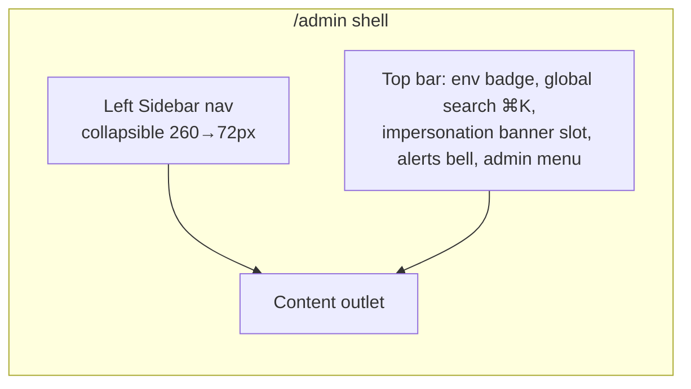
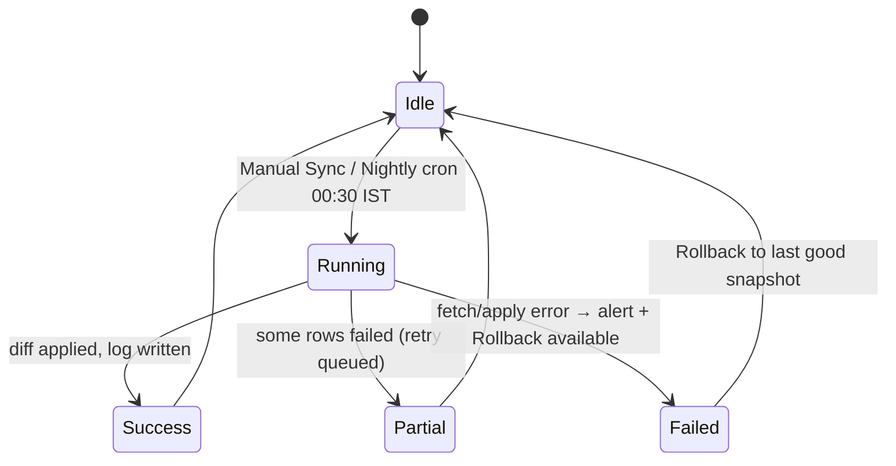
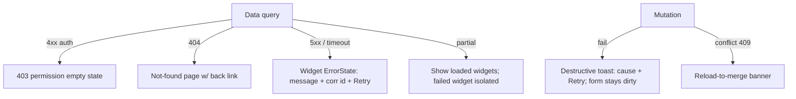

# UI Screen Specs — Super Admin Portal

This document is the build-from specification for every screen in Postpin's **Super Admin portal** — the internal control plane Postpin staff use to run the platform: monitor system health and revenue, manage tenants/plans/billing, operate the India Post pincode auto-sync, configure zones and rate cards, audit API keys, administer RBAC, read audit logs, and tune notifications and system settings. Each screen below is specified to be implemented directly: route, purpose, responsive layouts at 1440 / 768 / 390, component hierarchy, key interactive components, empty / loading / error states, dark-mode notes, the admin roles that may see it, and a high-fidelity **AI image generation prompt**. It is consistent with the Postpin design system (brand gradient violet `#7C3AED` → purple `#9333EA` → fuchsia `#DB2777`, light default + dark toggle, Space Grotesk display / Inter body / JetBrains Mono data, radius `0.75rem`, animated Lucide icons, Recharts, INR `en-IN`, AA accessibility, `prefers-reduced-motion` respected). It assumes the data contracts defined in [Pincode Management](03-pincode-management.md), [Shipping Engine](04-shipping-engine.md), [Zone Management](05-zone-management.md), [API Management](07-api-management.md), [API Analytics](08-api-analytics.md), [Subscription Engine](09-subscription-engine.md), [Coupon Builder](10-coupon-builder.md), [Support & CRM](11-support-crm.md) and [Notification Center](13-notification-center.md).

## Contents

- [Conventions & Shared Shell](#conventions--shared-shell)
- [Roles & Permission Matrix](#roles--permission-matrix)
- [Shared Components Library](#shared-components-library)
- [1. Admin Dashboard](#1-admin-dashboard)
- [2. Users](#2-users)
- [3. User Detail](#3-user-detail)
- [4. Plans CRUD](#4-plans-crud)
- [5. Billing & Invoices](#5-billing--invoices)
- [6. Usage Reports (Global)](#6-usage-reports-global)
- [7. Tickets Queue](#7-tickets-queue)
- [8. Ticket Detail](#8-ticket-detail)
- [9. Coupons Builder](#9-coupons-builder)
- [10. Pincode Management Dashboard](#10-pincode-management-dashboard)
- [11. Pincode Sync Settings](#11-pincode-sync-settings)
- [12. Sync Logs](#12-sync-logs)
- [13. Zones Management](#13-zones-management)
- [14. Rate Card Builder](#14-rate-card-builder)
- [15. API Keys Audit](#15-api-keys-audit)
- [16. Sub-Admins & Roles](#16-sub-admins--roles)
- [17. Audit Logs](#17-audit-logs)
- [18. Notification Center](#18-notification-center)
- [19. System Settings](#19-system-settings)
- [Cross-Screen Patterns: Empty / Loading / Error](#cross-screen-patterns-empty--loading--error)

---

## Conventions & Shared Shell

All Super Admin screens mount inside one persistent app shell at the route prefix `/admin`. The shell is server-rendered (Next.js App Router) with client islands for interactive widgets.



| Token | Value | Applied to |
| --- | --- | --- |
| Sidebar width | `260px` expanded / `72px` rail | desktop & tablet; off-canvas drawer on mobile |
| Content max-width | `1320px` centered, `24px` gutters | all screens |
| Top bar height | `64px`, sticky, `backdrop-blur` | all screens |
| Page header | H1 (Space Grotesk, `28/32`), breadcrumb, primary action cluster top-right | all screens |
| Density | Tables default to **comfortable** (`52px` rows); a density toggle switches to **compact** (`40px`) | all tables |
| Number format | INR via `Intl.NumberFormat('en-IN',{style:'currency',currency:'INR'})`; counts grouped en-IN (`19,32,847`) | all numerics |
| Mono | JetBrains Mono for pincodes, IDs, keys, JSON, durations | data cells |

**Sidebar groups** (order, with animated Lucide icons): `Overview` → Dashboard; `Tenants` → Users, Billing & Invoices, Plans, Coupons; `Operations` → Pincodes (Dashboard/Settings/Logs), Zones, Rate Cards, Usage Reports; `Developer` → API Keys Audit; `Support` → Tickets; `Platform` → Sub-Admins & Roles, Audit Logs, Notification Center, System Settings.

A persistent **environment badge** (`PROD` red-tinted / `STAGING` amber) sits left of global search so an admin never confuses environments. When impersonation is active a full-width **fuchsia banner** ("Viewing as Anika Rao — acme-logistics. Exit impersonation") pins below the top bar across every screen.

Global keyboard: `⌘K` command palette (jump to any tenant/screen), `g d` Dashboard, `g u` Users, `g p` Pincodes, `?` shortcuts sheet. All respect focus traps and `prefers-reduced-motion` (icon motion and skeleton shimmer reduce to opacity fades).

---

## Roles & Permission Matrix

The portal recognizes five built-in admin roles (stored in `roles`, gated by `permissions`). Custom roles are composed in [Sub-Admins & Roles](#16-sub-admins--roles). `superadmin` is unscoped and immutable.

| Screen | superadmin | ops_admin | billing_admin | support_agent | read_only |
| --- | :--: | :--: | :--: | :--: | :--: |
| Admin Dashboard | ✓ | ✓ | ✓ (revenue cards) | ✓ (support cards) | ✓ |
| Users / User Detail | ✓ | ✓ | view + plan | view | view |
| Impersonate | ✓ | ✓ | — | — | — |
| Suspend / Delete user | ✓ | ✓ | — | — | — |
| Plans CRUD | ✓ | — | ✓ | — | view |
| Billing & Invoices | ✓ | view | ✓ | — | view |
| Usage Reports | ✓ | ✓ | ✓ | view | view |
| Tickets / Ticket Detail | ✓ | ✓ | view | ✓ | view |
| Coupons | ✓ | — | ✓ | — | view |
| Pincode Dashboard | ✓ | ✓ | — | view | view |
| Pincode Settings | ✓ | ✓ | — | — | — |
| Sync Logs | ✓ | ✓ | — | view | view |
| Zones | ✓ | ✓ | — | — | view |
| Rate Card Builder | ✓ | ✓ | ✓ | — | view |
| API Keys Audit | ✓ | ✓ | — | view | view |
| Sub-Admins & Roles | ✓ | — | — | — | — |
| Audit Logs | ✓ | ✓ | ✓ (own scope) | view | view |
| Notification Center | ✓ | ✓ | — | — | view |
| System Settings | ✓ | — | — | — | — |

`view` = read-only render with all mutating controls hidden or `disabled` + tooltip "Requires *X* permission". Screens an admin cannot view are hidden from the sidebar entirely and return `403` (custom empty state, below) on deep-link.

---

## Shared Components Library

Every screen composes from this set so behavior is uniform.

| Component | Notes |
| --- | --- |
| `<DataTable>` | Server-side pagination, multi-sort, sticky header + first column, column show/hide menu, density toggle, row selection with sticky bulk-action bar, saved views, CSV/JSON export, URL-synced state (`?page&sort&filter`), virtualized at >200 rows. |
| `<FilterBar>` | Chip filters + advanced popover; debounced (`300ms`) search; "Clear all"; filter state encoded in querystring for shareable links. |
| `<StatCard>` | Label, big value, delta pill (▲/▼ vs prior period, color-coded), sparkline (Recharts `<Line>`), optional drill link. |
| `<Drawer>` | Right-side `480–640px`; used for detail/edit without leaving list; ESC + overlay close with dirty-guard. |
| `<Dialog>` | Centered modal for confirmations and short forms; destructive variant requires typed confirmation. |
| `<ConfirmDestructive>` | Red header, summary of impact, type-to-confirm input (`DELETE`, tenant slug, or `key id`). |
| `<Toast>` | Top-right stack, success/info/warning/destructive; action slot ("Undo", "View log"). |
| `<CodeBlock>` | JetBrains Mono, copy button, language pill, line numbers; used for JSON payloads, webhook samples, curl. |
| `<StatusBadge>` | Maps domain status → design-system status colors (success/warning/info/destructive/neutral). |
| `<DateRangePicker>` | Presets (Today, 7d, 30d, QTD, Custom); emits IST-aware ranges. |
| `<EmptyState>` | Animated Lucide illustration, title, guidance, primary CTA. |
| `<ErrorState>` | Inline (per-widget) and full-page variants; shows correlation id, Retry, "Copy diagnostics". |
| `<Skeleton>` | Shape-matched shimmer; reduced to static `bg-muted` pulse under reduced-motion. |

---

## 1. Admin Dashboard

**Route:** `/admin` (alias `/admin/dashboard`)

**Purpose:** A single operational pane of glass — is the platform healthy, is revenue on track, and what needs attention right now. Combines real-time system metrics (API throughput, p95 latency, error rate, queue depth), commercial metrics (MRR, ARR, active tenants, churn), and an **Alerts** rail surfacing the three things that page an operator: failed pincode sync, payment failures, and quota/abuse spikes.

### Layouts

| Breakpoint | Layout |
| --- | --- |
| **Desktop 1440** | 12-col grid. Row 1: 4 KPI `<StatCard>`s (MRR, Active Tenants, API Calls 24h, Error Rate). Row 2: left 8-col **Revenue & Calls** dual-axis chart + segmented period toggle; right 4-col **Alerts** rail (live list). Row 3: 6-col **Top Tenants by Usage** table + 6-col **Pincode Sync Health** mini-card with last-run status + sparkline of nightly diffs. Row 4: full-width **Recent Admin Activity** stream (last 20 audit events). |
| **Tablet 768** | KPIs 2×2; Revenue chart full-width above Alerts rail (now a horizontal scroll of alert cards); tables stack full-width. |
| **Mobile 390** | Single column: KPIs as a horizontal snap-scroll carousel; Alerts first (most actionable), then a compact "Calls today" sparkline, then Sync Health, then activity. Heavy tables become "View report" links. |

### Component hierarchy

```text
AdminDashboardPage
├─ PageHeader (title "Overview", DateRangePicker, "Refresh" auto-toggle 30s)
├─ KpiRow
│  ├─ StatCard "MRR" (₹, ▲ delta, sparkline) [billing perm]
│  ├─ StatCard "Active Tenants"
│  ├─ StatCard "API Calls (24h)"
│  └─ StatCard "Error Rate" (warn>1%, destructive>3%)
├─ Grid
│  ├─ RevenueCallsChart (Recharts ComposedChart, dual Y axis)
│  └─ AlertsRail
│     ├─ AlertCard (severity, title, meta, action)  ×N
│     └─ EmptyState "All clear"
├─ Grid
│  ├─ TopTenantsTable (rank, tenant, plan, calls, overage ₹, link)
│  └─ SyncHealthCard (last run, status badge, +new/~upd/-del, "Open Pincodes")
└─ RecentActivityStream (audit feed, virtualized)
```

### Key components

- **RevenueCallsChart** — Recharts `ComposedChart`: bars = daily API calls, line = cumulative revenue; brush for zoom; tooltip shows both in INR/count; period toggle (7d/30d/QTD). Animated draw-in (respects reduced-motion → no path animation).
- **AlertsRail** — polls `/admin/alerts` every 30s (SWR); each `AlertCard` carries `severity` (info/warning/critical), a one-line cause, and a direct action: *Sync failed* → "View logs" ([Sync Logs](#12-sync-logs)); *Payment failed* → "Open invoice"; *Quota spike* → "Inspect tenant". Critical alerts pulse the bell badge.
- **SyncHealthCard** — reads the latest `pincodeSyncLogs` doc; green/amber/red badge, last-run IST timestamp, and `+New / ~Updated / −Deleted / ✗Failed` chips.

### States

- **Empty** (fresh install, no data): KPIs render `—` with "Awaiting first traffic"; chart shows a dashed baseline with caption "No API calls yet"; Alerts shows `<EmptyState>` "All clear — nothing needs attention." Recent Activity invites "Invite your first sub-admin."
- **Skeleton:** KPI cards → 4 shimmer blocks; chart → axis frame + shimmer area; tables → 6 shimmer rows; Alerts → 3 shimmer cards. Auto-refresh never blanks loaded data (stale-while-revalidate; a subtle top progress bar indicates refetch).
- **Error:** Per-widget `<ErrorState>` so one failed query (e.g., billing aggregation timeout) does not blank the page; shows "Couldn't load MRR" + Retry while other widgets stay live. Global 5xx → full-page error with correlation id.

**Dark mode:** Cards `#0F0B1A` surface on `#0A0712` canvas; gradient accents desaturate ~12%; chart grid lines drop to `rgba(255,255,255,0.06)`; status colors keep AA contrast against dark surfaces. KPI deltas use the same success/destructive hues at +1 luminance step.

**Roles:** All admin roles. `billing_admin` sees revenue KPIs + Billing alerts but Top-Tenants overage hidden if lacking usage perm. `support_agent` sees support-related alerts and a "My open tickets" mini-card swapped in for MRR.

**AI Image Generation Prompt:**
> A high-fidelity 1440px-wide SaaS super-admin dashboard for "Postpin", a shipping-charges API platform, light theme. Left sidebar 260px with a violet-to-fuchsia gradient logo, grouped nav (Overview, Tenants, Operations, Developer, Support, Platform) using thin animated line icons. Sticky top bar with a red "PROD" environment pill, a ⌘K global search field, an alerts bell with a "3" badge, and a circular admin avatar. Main area: four KPI cards across the top — "MRR ₹8,42,500 ▲12%", "Active Tenants 1,284", "API Calls (24h) 19,32,847", "Error Rate 0.42%" — each with a tiny sparkline. Below left, a large dual-axis chart (purple bars for daily API calls, a fuchsia revenue line) titled "Revenue & API Calls — Last 30 days". Below right, a vertical "Alerts" rail with three cards: a red "Pincode sync failed at 00:31 IST", an amber "2 payments failed (₹14,998)", a blue "Quota spike: acme-logistics 312% of plan". Bottom: a dense "Top Tenants by Usage" table (rank, tenant name, plan badge, calls, overage ₹) and a "Pincode Sync Health" card showing "Last sync 00:30 IST • +84 new • ~512 updated • −9 removed". Typography: Space Grotesk headings, Inter body, JetBrains Mono for numbers and pincodes. Brand gradient violet #7C3AED → purple #9333EA → fuchsia #DB2777, 0.75rem rounded corners, soft shadows, generous whitespace, crisp data-dense but elegant — comparable to Stripe and PostHog dashboards. Realistic Indian context, INR currency.

---

## 2. Users

**Route:** `/admin/users`

**Purpose:** Find, segment and act on any tenant/user. The operational entry point for support and ops — search by email, company, pincode-of-interest, plan, status, signup date; bulk-act (suspend, change plan, export); jump into a [User Detail](#3-user-detail).

### Layouts

| Breakpoint | Layout |
| --- | --- |
| **Desktop 1440** | Page header + "Invite user" / "Export CSV". `<FilterBar>` (search + plan + status + signup range + country + flags). Full-width `<DataTable>` with sticky header; columns: ☑, User (avatar+name+email), Company, Plan badge, Status, MRR ₹, Calls (30d), Last active, Joined, ⋯. Sticky bulk bar appears on selection. Right-aligned pagination + density toggle + saved views dropdown. |
| **Tablet 768** | Filters collapse into a "Filters (n)" popover; table hides "MRR" and "Joined" by default (re-addable via column menu); horizontal scroll preserved for key columns. |
| **Mobile 390** | Table → stacked **user cards** (avatar, name, email, plan badge, status dot, "Calls 30d"); tap → User Detail. Bulk actions via a "Select" mode toggle; filters in a bottom sheet. |

### Component hierarchy

```text
UsersPage
├─ PageHeader (Invite, Export CSV, Saved Views)
├─ FilterBar (search, plan, status, date range, flags: trial/overdue/suspended)
├─ BulkActionBar (sticky on select: Suspend, Change plan, Add note, Export, Email)
└─ DataTable<UserRow>
   ├─ Column: select / user / company / plan / status / mrr / calls / lastActive / joined / actions
   ├─ RowActionMenu (View, Impersonate, Suspend, Change plan, Reset password)
   └─ Pagination + DensityToggle
```

### Key components & behaviors

- **Filters** map 1:1 to query params: `?q=&plan=growth&status=active&joinedFrom=2026-01-01&flag=overdue`. Chip filters are removable; "Clear all" resets. Counts shown per filter facet.
- **Status badge:** `active` (success), `trial` (info), `past_due` (warning), `suspended` (destructive), `invited` (neutral).
- **Bulk actions** open a `<ConfirmDestructive>` for suspend ("Suspend 12 tenants? Their API keys stop returning rates immediately.") with type-to-confirm `SUSPEND`. Change-plan opens a dialog with target plan + proration preview.
- **Export CSV** streams server-side honoring active filters; toast with download link when ready (async for >50k rows).

### States

- **Empty (no users):** `<EmptyState>` "No tenants yet — invite your team or wait for first signups" + "Invite user".
- **Empty (filtered):** "No users match these filters" + "Clear filters".
- **Skeleton:** Filter bar static; 10 shimmer rows matching column widths; pagination disabled.
- **Error:** Full-table `<ErrorState>` with Retry; partial export failure → toast "Export failed (corr id …)".

**Dark mode:** Zebra striping via `rgba(255,255,255,0.02)`; sticky header gets a subtle bottom border `#241B33`; plan badges use tinted-on-dark fills; selected-row highlight uses `violet/15`.

**Roles:** All can view. `ops_admin`/`superadmin` see Suspend/Impersonate/Change-plan; `billing_admin` sees Change-plan only; `support_agent`/`read_only` see view + Add note (support) but mutating bulk actions hidden.

**AI Image Generation Prompt:**
> A 1440px light-theme super-admin "Users" management screen for Postpin (shipping API SaaS). Left violet-gradient sidebar, sticky top bar with PROD badge and search. Main: page title "Users" with "Invite user" and "Export CSV" buttons top-right; a horizontal filter bar with a search field ("Search email, company, pincode"), plus pill dropdowns Plan, Status, Joined, and a "+ Filter" chip. A dense data table with a checkbox column and rows like: "Anika Rao — anika@acme-logistics.in / Acme Logistics / Growth (purple badge) / Active (green dot) / ₹4,999 / 84,120 calls / 2h ago / 12 Jan 2026". A few rows selected showing a sticky bulk-action bar reading "3 selected — Suspend · Change plan · Export". Status badges color-coded green/amber/red. JetBrains Mono for emails and numbers, Space Grotesk headings. Brand gradient violet #7C3AED → fuchsia #DB2777, 0.75rem radius, soft shadows, Stripe-grade polish, Indian names and companies, INR amounts.

---

## 3. User Detail

**Route:** `/admin/users/[userId]`

**Purpose:** The full 360° on one tenant and the place to take account-level actions: **impersonate**, **suspend/reactivate**, **edit plan** (with proration), reset credentials, view usage/billing/keys/tickets, and read the per-tenant audit trail. Built so a support agent or ops admin can diagnose and resolve without opening five screens.

### Layouts

| Breakpoint | Layout |
| --- | --- |
| **Desktop 1440** | Two-zone: sticky **left identity rail** (320px: avatar, name, email, company, plan badge, status, MRR, joined, lifetime calls, quick actions cluster). Right **tabbed work area**: Overview · Usage · Billing · API Keys · Rate Cards · Tickets · Audit. Overview tab shows mini stat cards + recent activity. |
| **Tablet 768** | Identity rail becomes a top summary card; tabs become a scrollable tab strip below. |
| **Mobile 390** | Summary card; tabs → a select/segmented dropdown; action cluster collapses into a "Manage ▾" menu (Impersonate, Suspend, Edit plan, Reset password). |

### Component hierarchy

```text
UserDetailPage
├─ Breadcrumb (Users / Acme Logistics)
├─ IdentityRail
│  ├─ Avatar + name + email (copy) + companyId (mono)
│  ├─ PlanBadge + StatusBadge + MRR
│  ├─ Meta: joined, lifetime calls, last active, region/pincode
│  └─ ActionCluster
│     ├─ Button "Impersonate" (primary, gradient)
│     ├─ Button "Edit plan"
│     ├─ Menu: Suspend/Reactivate, Reset password, Add internal note, Delete
├─ Tabs
│  ├─ Overview (StatCards, recent tickets, recent invoices, flags)
│  ├─ Usage (mini Usage Reports scoped to tenant)
│  ├─ Billing (invoices table + payment method + dunning state)
│  ├─ API Keys (keys list w/ status, last used; revoke)
│  ├─ Rate Cards (assigned cards + simulate link)
│  ├─ Tickets (this tenant's tickets)
│  └─ Audit (tenant-scoped event stream)
```

### Key flows

```mermaid
sequenceDiagram
  participant A as Admin
  participant UI as User Detail
  participant API as /admin/users/:id
  A->>UI: Click "Impersonate"
  UI->>A: Dialog (reason required, read-only toggle, duration 30m)
  A->>UI: Confirm
  UI->>API: POST /impersonations {reason, scope}
  API-->>UI: short-lived scoped token + sessionId
  UI->>A: Open User Dashboard in new tab; fuchsia banner pinned
  Note over A,API: Action audited (auditLogs: impersonate.start)
  A->>UI: "Exit impersonation"
  UI->>API: POST /impersonations/:id/end → audit impersonate.end
```

- **Impersonate dialog:** mandatory `reason` (free text), default **read-only** toggle (writes blocked unless explicitly enabled), max 30-min session, big warning that all impersonated actions are attributed and audited. Writes `auditLogs` start/end + a `notifications` entry to the tenant owner ("A Postpin admin accessed your account for support").
- **Edit plan:** dialog shows current vs target plan, proration preview (credit/charge in INR, effective date, next-invoice impact), quota change, and a "Notify customer" toggle. Calls into the [Subscription Engine](09-subscription-engine.md).
- **Suspend:** `<ConfirmDestructive>` summarizing blast radius ("N live API keys will stop returning rates; M scheduled jobs paused"), type-to-confirm tenant slug; reversible via Reactivate.

### States

- **Empty tabs:** e.g., no invoices → "No invoices yet"; no keys → "This tenant hasn't created an API key" + deep link.
- **Skeleton:** Identity rail shows avatar/line shimmers; tabs render a content skeleton per active tab.
- **Error:** If the user id is invalid → full-page 404 "Tenant not found". Tab-level errors stay isolated.

**Dark mode:** Identity rail surface `#120D1F` with a thin gradient top accent; impersonate button keeps full gradient (it's the loud action). Destructive menu items use `#F87171` on dark for AA.

**Roles:** Impersonate/Suspend/Delete → `superadmin`,`ops_admin`. Edit plan → +`billing_admin`. `support_agent` sees all tabs read-only plus Add-note and Reset-password (if granted). `read_only` cannot mutate.

**AI Image Generation Prompt:**
> A 1440px light-theme super-admin "User Detail" screen for Postpin shipping API SaaS. Left identity rail (320px) showing a circular avatar, "Anika Rao", "anika@acme-logistics.in", company "Acme Logistics" with a monospace tenant id "cmp_8fK2…", a purple "Growth" plan badge, green "Active" status, "MRR ₹4,999", "Joined 12 Jan 2026", "Lifetime calls 2,41,880". Below: a prominent gradient "Impersonate" button, an outline "Edit plan" button, and a "Manage ▾" menu. Right side: a tab strip (Overview, Usage, Billing, API Keys, Rate Cards, Tickets, Audit) with Overview active, showing three small stat cards (Calls 30d, Open tickets, Outstanding ₹) and a recent activity list. A subtle modal preview in the corner titled "Impersonate Acme Logistics" with a reason field, a read-only toggle, and a red warning note "All actions are audited". Space Grotesk headings, Inter body, JetBrains Mono ids/numbers, violet→fuchsia brand gradient, 0.75rem radius, soft shadows, premium Clerk-like account UI, INR amounts, Indian context.

---

## 4. Plans CRUD

**Route:** `/admin/plans` (detail/editor drawer at `?plan=growth`)

**Purpose:** Define the commercial catalog — the flat + overage plans (Free, Starter, Growth, Scale, Enterprise) tenants subscribe to. Create/edit/archive plans, set price, included quota, overage rate, rate-limit, features, and visibility; preview the public pricing impact. Plans are versioned so existing subscribers keep their terms.

### Layouts

| Breakpoint | Layout |
| --- | --- |
| **Desktop 1440** | Left list of plan cards (drag to reorder display order) + "New plan". Right: selected plan editor `<Drawer>`-style panel (inline on desktop) with sections: Identity, Pricing, Quota & Limits, Features matrix, Visibility, Versioning. A live **pricing card preview** mirrors the marketing tier. |
| **Tablet 768** | Plan list as a horizontal card row; editor opens as a right `<Drawer>` (560px). |
| **Mobile 390** | Plan list (cards); tapping opens a full-screen editor with section accordions; preview at bottom. |

### Component hierarchy

```text
PlansPage
├─ PageHeader (New plan)
├─ PlanList (sortable cards: name, price, quota, subscribers count, status)
└─ PlanEditor (drawer/inline)
   ├─ Section Identity (name, slug, badge color, tagline)
   ├─ Section Pricing (monthly ₹, annual ₹, currency INR, trial days)
   ├─ Section Quota & Limits (included calls, overage ₹/1k, rate limit rps, burst)
   ├─ Section Features (toggle matrix: webhooks, sandbox keys, SLA, GST line, priority support)
   ├─ Section Visibility (public / private / legacy, sort order)
   ├─ Section Versioning (current version, "grandfather existing subscribers" note)
   └─ Footer (Save draft, Publish, Archive — ConfirmDestructive)
```

### Schema (sample plan)

```json
{
  "id": "plan_growth",
  "slug": "growth",
  "name": "Growth",
  "tagline": "Scaling D2C & ERPs",
  "badgeColor": "#9333EA",
  "price": { "monthlyInr": 4999, "annualInr": 49990, "trialDays": 14 },
  "quota": { "includedCalls": 100000, "overageInrPer1k": 35 },
  "limits": { "rateLimitRps": 50, "burst": 100, "maxApiKeys": 10, "maxDomains": 5 },
  "features": {
    "webhooks": true, "sandboxKeys": true, "gstLine": true,
    "prioritySupport": false, "customRateCard": true, "sla": "99.9%"
  },
  "visibility": "public",
  "sortOrder": 3,
  "version": 4,
  "status": "active",
  "subscriberCount": 312
}
```

### Key behaviors & edge cases

- **Publish vs draft:** edits to a published plan create a **new version**; existing subscribers stay on their version (banner: "312 subscribers on v3 — they keep current terms").
- **Archive guard:** cannot archive a plan with active subscribers; offer "Stop new signups" (set visibility=legacy) instead.
- **Validation:** overage rate required if quota is finite; annual price must be ≤ 12× monthly (warn otherwise); rate-limit must be ≤ infra cap from [System Settings](#19-system-settings).
- **Live preview** updates as fields change; "Open in marketing preview" link.

### States

- **Empty:** "No plans yet — create your first plan" with a "Start from template (Free/Starter/Growth/Scale/Enterprise)" CTA.
- **Skeleton:** plan list → 4 card shimmers; editor → section header + field shimmers.
- **Error:** Save failure keeps the form dirty with an inline banner + field-level errors; never silently drops edits.

**Dark mode:** Editor panel `#120D1F`; feature toggles use violet track when on; preview card mirrors marketing dark tier. Archive footer uses destructive on dark.

**Roles:** `superadmin`,`billing_admin` edit; others view. Archive/Publish gated to those two.

**AI Image Generation Prompt:**
> A 1440px light-theme "Plans" management screen for Postpin shipping API SaaS, super-admin. Left column: a vertical list of draggable plan cards — "Free / ₹0 / 1k calls", "Starter / ₹999 / 10k", "Growth / ₹4,999 / 1,00,000 (312 subscribers)", "Scale / ₹14,999 / 5,00,000", "Enterprise / Custom" — each with a colored badge and a small drag handle. Right: a plan editor panel for "Growth" with sections Identity, Pricing (Monthly ₹4,999, Annual ₹49,990, Trial 14 days), Quota & Limits (Included calls 1,00,000, Overage ₹35/1k, Rate limit 50 rps), and a Features toggle matrix (Webhooks ✓, Sandbox keys ✓, Custom rate card ✓, Priority support ✗). On the far right a live marketing-style pricing card preview with a gradient "Growth" header and a "Choose Growth" button. Space Grotesk headings, Inter body, JetBrains Mono for prices, violet→fuchsia gradient, 0.75rem radius, clean Stripe-like product UI, INR currency.

---

## 5. Billing & Invoices

**Route:** `/admin/billing` (invoice detail drawer `?invoice=inv_...`)

**Purpose:** Operate platform-wide revenue collection — view all invoices across tenants, track dunning (past-due/overdue), issue refunds/credits, retry failed charges, and reconcile. Read-heavy with high-stakes mutations (refund, void) behind confirmation.

### Layouts

| Breakpoint | Layout |
| --- | --- |
| **Desktop 1440** | Row of revenue `<StatCard>`s (MRR, Collected MTD, Outstanding, Failed). `<FilterBar>` (status, period, plan, amount range, tenant). `<DataTable>`: Invoice #, Tenant, Plan, Amount ₹, Tax (GST), Status, Issued, Due, Paid, ⋯. Right `<Drawer>` for invoice detail (line items, payment attempts, refund). |
| **Tablet 768** | Stat cards 2×2; table hides Tax + Issued by default; drawer full-height. |
| **Mobile 390** | Stat carousel; invoices as cards (number, tenant, amount, status, due); detail full-screen. |

### Component hierarchy

```text
BillingPage
├─ PageHeader (Export, "Run dunning now")
├─ RevenueStatRow (MRR, Collected MTD, Outstanding, Failed charges)
├─ FilterBar (status, period, plan, amount, tenant)
├─ DataTable<Invoice>
│  └─ RowActions (View, Download PDF, Retry charge, Refund, Void)
└─ InvoiceDrawer
   ├─ Header (number, tenant, status badge, amount)
   ├─ LineItems (base + overage + GST 18%)
   ├─ PaymentAttempts (timeline w/ gateway codes)
   └─ Actions (Refund partial/full, Add credit, Mark uncollectible)
```

### Sample invoice

```json
{
  "id": "inv_2026_06_acme",
  "number": "PP-2026-004821",
  "tenant": { "id": "cmp_8fK2", "name": "Acme Logistics" },
  "plan": "growth",
  "lineItems": [
    { "label": "Growth — June 2026", "amountInr": 4999 },
    { "label": "Overage 24,000 calls @ ₹35/1k", "amountInr": 840 }
  ],
  "subtotalInr": 5839,
  "gst": { "ratePct": 18, "amountInr": 1051.02 },
  "totalInr": 6890.02,
  "status": "past_due",
  "issuedAt": "2026-06-01T00:00:00+05:30",
  "dueAt": "2026-06-08T00:00:00+05:30",
  "attempts": [
    { "at": "2026-06-08T02:00:00+05:30", "result": "failed", "gatewayCode": "insufficient_funds" }
  ]
}
```

### Key behaviors & edge cases

- **Status badges:** `paid` (success), `open` (info), `past_due` (warning), `overdue/uncollectible` (destructive), `refunded`/`void` (neutral with strike).
- **Refund** opens a dialog: full/partial amount (≤ paid), reason, "notify customer"; partial refunds re-render line items; writes audit + notification. **Void** only allowed on unpaid invoices.
- **Retry charge** calls gateway; result toasts with gateway code; updates dunning state.
- **GST** always itemized (18%); invoices show GSTIN if tenant provided one. Export honors filters; PDF download per invoice.
- **Edge:** currency rounding to 2 dp `en-IN`; proration credits show as negative line items; an invoice in dispute is flagged with a banner.

### States

- **Empty:** "No invoices yet — invoices appear after the first billing cycle."
- **Skeleton:** stat row + 8 row shimmers; drawer skeleton on open.
- **Error:** gateway timeout on retry → inline error in drawer + Retry; table query error → full `<ErrorState>`.

**Dark mode:** Amount cells right-aligned mono; past-due rows get a thin warning left-border `#D97706`; refunded rows muted.

**Roles:** `superadmin`,`billing_admin` full; `ops_admin`,`read_only` view; `support_agent` no access (cross-link from Ticket Detail only when a billing ticket references an invoice).

**AI Image Generation Prompt:**
> A 1440px light-theme super-admin "Billing & Invoices" screen for Postpin shipping API SaaS. Top: four revenue stat cards — "MRR ₹8,42,500", "Collected MTD ₹6,10,200", "Outstanding ₹48,900 (amber)", "Failed charges 7 (red)". A filter bar (Status, Period, Plan, Amount). A dense invoices table: "PP-2026-004821 / Acme Logistics / Growth / ₹6,890.02 / GST ₹1,051 / Past due (amber badge) / Issued 01 Jun / Due 08 Jun". Right-side drawer open for one invoice showing line items "Growth — June 2026 ₹4,999", "Overage 24,000 calls @ ₹35/1k ₹840", subtotal, "GST 18% ₹1,051.02", total ₹6,890.02, and a payment-attempts timeline with a red "insufficient_funds" entry, plus "Refund" and "Retry charge" buttons. JetBrains Mono for amounts and invoice numbers, Space Grotesk headings, violet→fuchsia gradient accents, 0.75rem radius, Stripe-grade billing UI, INR and Indian GST context.

---

## 6. Usage Reports (Global)

**Route:** `/admin/usage`

**Purpose:** Platform-wide consumption analytics — total API calls, success/error split, latency percentiles, top endpoints, top tenants, geographic spread of origin/destination pincodes, and quota/overage exposure. Used to forecast capacity, spot abuse, and inform plan pricing. Mirrors per-tenant analytics in [API Analytics](08-api-analytics.md) but aggregated across all tenants.

### Layouts

| Breakpoint | Layout |
| --- | --- |
| **Desktop 1440** | Sticky controls (DateRange, granularity, env, group-by tenant/endpoint/zone). Row of KPIs (Total calls, Success %, p95 latency, Overage ₹). Big time-series area chart. Two-up: Top Endpoints bar + Status-code donut. Geo: India choropleth/heat of delivery pincodes by state + Top Lanes table (pickup→delivery). Bottom: Top Tenants usage table with export. |
| **Tablet 768** | KPIs 2×2; charts stack full-width; choropleth becomes a ranked state list with bars. |
| **Mobile 390** | KPI carousel; one primary line chart; "Top endpoints" and "Top tenants" as compact lists; geo replaced by top-states list. |

### Component hierarchy

```text
UsageReportsPage
├─ ControlsBar (DateRange, granularity hour/day/week, env, groupBy)
├─ KpiRow (Total calls, Success %, p95 ms, Overage ₹)
├─ CallsTimeSeries (Recharts AreaChart, success vs error stacked)
├─ TwoUp
│  ├─ TopEndpointsBar (/v1/rates, /v1/serviceability, /v1/pincodes)
│  └─ StatusDonut (2xx/4xx/5xx)
├─ GeoSection
│  ├─ IndiaHeatMap (by delivery state)
│  └─ TopLanesTable (pickup→delivery pincode, calls, avg ₹)
└─ TopTenantsTable (tenant, calls, overage ₹, error %)
```

### Key components

- **CallsTimeSeries** — stacked area (success `#16A34A`, error `#DC2626`), brush + hover crosshair; granularity follows range (hour for ≤2d, day for ≤90d).
- **IndiaHeatMap** — Recharts/GeoJSON India map shaded by call volume per delivery state; tooltip shows state, calls, top pincode; click drills to a state filter. Reduced-motion: no animated fill transition.
- **TopLanesTable** — e.g., `302001 → 781001` (Jaipur→Guwahati) with call count and average computed rate; mono pincodes.

### States

- **Empty:** "No usage in this period" with date hint; geo map shows a neutral India outline.
- **Skeleton:** KPI shimmer + chart frame + map outline placeholder.
- **Error:** Aggregation timeout → per-widget error; the map (heaviest) can fail independently with "Map unavailable — view top states list" fallback.

**Dark mode:** Map base `#1A1330` states, volume scale violet→fuchsia ramp; donut segments use status colors at dark-tuned luminance; grid lines faint.

**Roles:** All view; overage ₹ columns hidden for roles lacking billing view. Export gated to `ops_admin`+`billing_admin`+`superadmin`.

**AI Image Generation Prompt:**
> A 1440px light-theme super-admin "Usage Reports" analytics screen for Postpin shipping API SaaS. Top controls: a date-range picker "Last 30 days", granularity toggle, and "Group by: Tenant". KPI cards: "Total calls 4.82 Cr", "Success 99.58%", "p95 latency 41 ms", "Overage ₹2,18,400". A large stacked area chart of API calls (green success over a thin red error band). Below, two panels: a horizontal bar chart "Top endpoints" listing /v1/rates, /v1/serviceability, /v1/pincodes, and a donut of status codes 2xx/4xx/5xx. A geographic section: a stylized heat map of India shaded violet-to-fuchsia by delivery volume per state, beside a "Top lanes" table with monospace pincode pairs like "302001 → 781001 / 18,402 calls / avg ₹98". Space Grotesk headings, JetBrains Mono numbers and pincodes, brand gradient, 0.75rem radius, PostHog-grade analytics polish, Indian geography and INR.

---

## 7. Tickets Queue

**Route:** `/admin/tickets`

**Purpose:** The agent work surface — triage, assign, filter and bulk-act on support tickets across all tenants, with SLA timers visible at a glance. Backed by the model in [Support & CRM](11-support-crm.md).

### Layouts

| Breakpoint | Layout |
| --- | --- |
| **Desktop 1440** | Left **saved-view rail** (All open, Unassigned, My tickets, Breaching SLA, By category). Center `<FilterBar>` + ticket `<DataTable>`: ☑, Priority, Subject + tenant, Category, Assignee, Status, SLA timer, Updated. Right optional **preview pane** (click a row → quick read without leaving). |
| **Tablet 768** | View rail collapses to a dropdown; preview pane becomes a drawer. |
| **Mobile 390** | Ticket cards (priority stripe, subject, tenant, SLA chip, status); filters in bottom sheet; tap → full Ticket Detail. |

### Component hierarchy

```text
TicketsQueuePage
├─ SavedViewRail (counts per view)
├─ FilterBar (status, priority, category, assignee, tenant, SLA breach)
├─ BulkActionBar (Assign, Set status, Set priority, Tag, Merge)
├─ DataTable<Ticket>
│  ├─ PriorityChip / SubjectCell(tenant) / CategoryBadge / AssigneeAvatar / SlaTimer / StatusBadge
│  └─ RowActions (Open, Assign to me, Snooze)
└─ PreviewPane (latest message, quick reply, open full)
```

### Key components

- **SlaTimer** — live countdown to first-response / resolution target; color shifts info→warning→destructive as the deadline nears; "Breached +2h 14m" in red when overdue. Pauses for `pending` (waiting-on-customer) states.
- **Priority chip:** urgent (destructive), high (warning), normal (info), low (neutral).
- **Bulk assign / merge** — merge requires a primary ticket and confirms thread combination; assign writes audit + notifies assignee.

### States

- **Empty (queue clear):** celebratory `<EmptyState>` "Inbox zero — no open tickets" with confetti-free, reduced-motion-safe animation.
- **Empty (filtered):** "No tickets match" + clear.
- **Skeleton:** view rail counts shimmer; 10 ticket row shimmers.
- **Error:** `<ErrorState>` + Retry; preview pane independent.

**Dark mode:** Priority left-stripe vivid against dark; SLA destructive uses `#F87171`; assignee avatars ringed for contrast.

**Roles:** `support_agent`,`ops_admin`,`superadmin` full; `billing_admin`,`read_only` view (billing-category visible to billing_admin).

**AI Image Generation Prompt:**
> A 1440px light-theme super-admin "Tickets" support queue for Postpin shipping API SaaS. Left rail of saved views with counts: "All open 42", "Unassigned 9", "My tickets 6", "Breaching SLA 3 (red)", "Billing 11". A filter bar and a dense ticket table: rows with a priority chip (red "Urgent"), subject "Wrong rate for 781001 lane" with tenant "Acme Logistics", category badge "API Bug", an assignee avatar, a live SLA timer "1h 12m left (amber)", status "Open". One row shows "Breached +2h 14m" in red. A right preview pane shows the latest customer message and a quick-reply box. Space Grotesk headings, Inter body, JetBrains Mono for pincodes, violet→fuchsia accents, 0.75rem radius, Linear/Intercom-grade support UI, Indian tenant names.

---

## 8. Ticket Detail

**Route:** `/admin/tickets/[ticketId]`

**Purpose:** Resolve one ticket — read the threaded conversation, post **public replies** or **internal notes**, **assign**, change status/priority, apply macros/canned responses, attach files, and see tenant context (plan, recent API errors, linked invoice/pincode). Internal notes are visually distinct and never emailed.

### Layouts

| Breakpoint | Layout |
| --- | --- |
| **Desktop 1440** | Three columns: left **thread** (messages newest-at-bottom, public vs internal styling), center is part of thread/composer, right **context sidebar** (requester, tenant, plan, SLA, tags, linked refs, suggested articles). Sticky **composer** at bottom with a Public ↔ Internal toggle. |
| **Tablet 768** | Two columns: thread + composer; context sidebar becomes a collapsible right drawer ("Details"). |
| **Mobile 390** | Single column thread; context behind a "Details" sheet; composer is a sticky bottom bar that expands; reply-type toggle prominent. |

### Component hierarchy

```text
TicketDetailPage
├─ Header (subject, ticket #, StatusBadge, PriorityBadge, Assignee picker, ⋯)
├─ Thread
│  ├─ Message (customer / agent-public)   ← white/violet bubbles
│  └─ InternalNote (amber-tinted, "internal" pill, lock icon)
├─ Composer
│  ├─ ReplyTypeToggle (Public reply | Internal note)
│  ├─ RichText + Canned/Macro inserter + Attach
│  └─ SubmitGroup (Send, Send & set Pending, Send & Resolve)
└─ ContextSidebar
   ├─ Requester + Tenant + Plan + open since
   ├─ SLA (FRT met?, resolution timer)
   ├─ Tags editor
   ├─ LinkedRefs (apiLog, invoice, pincode, rateCard) → deep links
   └─ AssignmentHistory
```

### Key behaviors

- **Reply-type toggle** is the most important control: **Public** sends email + appears in customer view; **Internal note** (amber background, "Internal" pill, padlock) is staff-only and never notifies the customer. The composer background tints amber in internal mode to prevent mistakes.
- **Canned responses / macros** inserted with variable interpolation (`{{customer.firstName}}`, `{{ticket.id}}`); a macro can also set status/priority/assignee in one action.
- **Assign** picker shows agent load; "Assign to me" shortcut. **Linked refs** deep-link to [API Analytics](08-api-analytics.md) logs, the invoice in [Billing](#5-billing--invoices), or a record in [Pincode Management](03-pincode-management.md) so the agent diagnoses inline.
- **SLA** badges show FRT met/missed and a live resolution timer; resolving enqueues a CSAT request.

### States

- **Empty thread:** only the original message; composer focused with a "Write the first reply" hint.
- **Skeleton:** header bar + 3 message shimmers + sidebar field shimmers.
- **Error:** send failure keeps draft (autosaved locally), shows inline "Couldn't send — Retry"; never loses typed text.

**Dark mode:** Customer bubbles `#1A1330`, agent-public bubbles use a faint violet tint, internal notes use `#3A2A12` amber tint with `#FBBF24` accents; composer internal-mode tint preserved.

**Roles:** `support_agent`,`ops_admin`,`superadmin` reply/assign; `billing_admin` may reply only on billing-category tickets; `read_only` view.

**AI Image Generation Prompt:**
> A 1440px light-theme super-admin "Ticket Detail" screen for Postpin shipping API SaaS. Header: subject "Wrong rate for 781001 lane", ticket "#PP-3192", a "Open" status badge, "Urgent" priority badge, an assignee picker, and a "⋯" menu. Center: a threaded conversation — a white customer message bubble describing a wrong shipping rate, an agent reply in a faint violet bubble, and a clearly different amber-tinted "Internal note" block with a small padlock and "Internal" pill. A sticky bottom composer with a prominent toggle "Public reply | Internal note", a rich-text box, an "Insert canned response" button, an attach icon, and a split button "Send · Send & Resolve". Right sidebar: requester "Anika Rao", tenant "Acme Logistics", plan "Growth", an SLA panel "First response met • Resolution 1h 12m left", a tags editor, and "Linked: API log, Invoice PP-2026-004821, Pincode 781001". Space Grotesk headings, JetBrains Mono ids/pincodes, violet→fuchsia accents, 0.75rem radius, Intercom-grade conversation UI, Indian context.

---

## 9. Coupons Builder

**Route:** `/admin/coupons` (builder drawer `?coupon=new|<id>`)

**Purpose:** Create and manage promotional coupons — percentage/fixed/free-trial-extension discounts with conditions (plans, first-time only, min commitment), redemption caps, validity windows, and live usage tracking. Backed by [Coupon Builder](10-coupon-builder.md).

### Layouts

| Breakpoint | Layout |
| --- | --- |
| **Desktop 1440** | `<DataTable>` of coupons (code, type, value, status, redemptions/cap, window, revenue impact) + "New coupon". Builder opens as a wide right `<Drawer>` with a live **summary preview** ("WELCOME20 — 20% off first 3 months, ≤500 redemptions"). |
| **Tablet 768** | Table hides revenue impact; drawer 560px. |
| **Mobile 390** | Coupon cards; full-screen builder with stepper (Code → Discount → Conditions → Limits → Review). |

### Component hierarchy

```text
CouponsPage
├─ PageHeader (New coupon, Export)
├─ DataTable<Coupon> (code, type, value, status, used/cap, window, ⋯)
└─ CouponBuilderDrawer
   ├─ Code (auto-generate or custom, uppercase, uniqueness check)
   ├─ Discount (percent | fixed ₹ | trial-extension days)
   ├─ Applicability (all plans / specific plans, new vs existing)
   ├─ Limits (max redemptions, per-customer cap, min term)
   ├─ Validity (start/end IST, timezone note)
   ├─ Stacking (allow with other coupons?)
   ├─ SummaryPreview (human-readable rule + projected discount)
   └─ Footer (Save draft, Activate, Deactivate)
```

### Sample coupon

```json
{
  "code": "WELCOME20",
  "type": "percent",
  "value": 20,
  "appliesTo": { "plans": ["starter", "growth"], "newCustomersOnly": true },
  "durationMonths": 3,
  "limits": { "maxRedemptions": 500, "perCustomer": 1, "minTermMonths": 1 },
  "validity": { "startsAt": "2026-07-01T00:00:00+05:30", "endsAt": "2026-09-30T23:59:59+05:30" },
  "stackable": false,
  "status": "active",
  "redemptions": 138
}
```

### Key behaviors & edge cases

- **Code uniqueness** checked live (debounced); uppercase-normalized; collision → inline error.
- **Type switch** re-renders the value field (percent slider vs ₹ input vs days stepper); validation: percent ≤ 100, fixed ≤ plan price.
- **Redemption progress bar** in table (e.g., `138/500`); auto-deactivate at cap; window edge handled in IST with a UTC-offset note.
- **Stacking** off by default; if on, warn about compounding discounts and projected margin.

### States

- **Empty:** "No coupons yet — create your first promotion" with a "WELCOME20" template suggestion.
- **Skeleton:** table shimmer; builder field shimmers.
- **Error:** activate failure keeps draft; expired-window coupon is read-only with a "Duplicate to relaunch" action.

**Dark mode:** status badges tinted; redemption bar uses gradient fill; expired coupons muted with strike on code.

**Roles:** `superadmin`,`billing_admin` create/edit; others view.

**AI Image Generation Prompt:**
> A 1440px light-theme super-admin "Coupons" builder screen for Postpin shipping API SaaS. Left/main: a table of coupons — "WELCOME20 / 20% off / Active / 138 of 500 (progress bar) / 01 Jul–30 Sep", "ANNUAL10 / 10% off annual / Active", "TRIAL14 / +14 trial days / Paused". Top-right "New coupon" button. A wide right drawer open titled "WELCOME20" with fields: discount type segmented control (Percent | Fixed ₹ | Trial days) with Percent selected and a 20% slider, "Applies to: Starter, Growth", "New customers only ✓", limits "Max 500 redemptions, 1 per customer", validity dates, and a "Stack with other coupons" toggle off. At the drawer bottom a human-readable summary "20% off first 3 months for new Starter/Growth customers, up to 500 uses". Space Grotesk headings, JetBrains Mono codes, violet→fuchsia gradient on the progress bars, 0.75rem radius, premium promotions UI, INR amounts.

---

## 10. Pincode Management Dashboard

**Route:** `/admin/pincodes`

**Purpose:** The command center for Postpin's most critical dataset — the India Post auto-synced pincode store. Surfaces the headline counters (Total / Last Sync / New / Updated / Deleted / Failed / Status) and the operational buttons (**Manual Sync, Import CSV, Export CSV, Rollback, View Logs**), plus a searchable pincode explorer. Implements the dashboard described in [Pincode Management](03-pincode-management.md).

### Layouts

| Breakpoint | Layout |
| --- | --- |
| **Desktop 1440** | Header with **action cluster** (Manual Sync primary gradient, Import CSV, Export CSV, Rollback, View Logs, link to Settings). Row of **metric `<StatCard>`s**: Total Pincodes, Last Sync (relative + status badge), New, Updated, Deleted, Failed. A **sync trend** sparkline area (nightly +new/~upd/−del over 30 days). Below: **Pincode Explorer** `<DataTable>` (pincode, office, district, state, zone, status, lastSynced) with search + filters (state, zone, serviceable, removed/tombstoned). |
| **Tablet 768** | Action cluster wraps to a "Actions ▾" menu keeping Manual Sync primary; metrics 3×2; explorer hides office/district by default. |
| **Mobile 390** | Metrics as a snap carousel; primary "Manual Sync" FAB; other actions in an overflow sheet; explorer becomes a search-first list of pincode cards (pincode, city/state, zone, status). |

### Component hierarchy

```text
PincodeDashboardPage
├─ PageHeader
│  └─ ActionCluster (Manual Sync, Import CSV, Export CSV, Rollback, View Logs, Settings)
├─ MetricRow
│  ├─ StatCard "Total Pincodes" (19,32,160 rows / 19,300 serviceable)
│  ├─ StatCard "Last Sync" (00:30 IST · 4h ago · ✓ Success)
│  ├─ StatCard "New" (+84)
│  ├─ StatCard "Updated" (~512)
│  ├─ StatCard "Deleted" (−9, tombstoned)
│  └─ StatCard "Failed" (0)
├─ SyncTrend (Recharts area, +/~/- by night, 30d)
├─ SyncStatusBanner (idle | running progress | failed w/ Rollback)
└─ PincodeExplorer
   ├─ FilterBar (search pincode/office, state, zone, serviceable, removed)
   └─ DataTable<Pincode> (pincode, office, district, state, zone, status, lastSynced)
```

### Key components & flows

- **Manual Sync** → confirm dialog ("Run a full India Post snapshot diff now? Last run 4h ago.") → starts a job; banner switches to a **live progress** state (fetch → normalize → hash → diff → apply) with a percentage and a "Cancel" (safe-cancel before apply). On finish, metrics animate to new values and a toast links to the new [Sync Logs](#12-sync-logs) entry.
- **Import CSV** → upload dialog → column-mapping preview → dry-run validation (row counts, errors, duplicates) → "Apply import" creates a sync-log-style record; partial-failure rows downloadable.
- **Export CSV** → choose scope (all / filtered / serviceable only) → async stream → toast with link.
- **Rollback** → `<ConfirmDestructive>` listing the snapshot to revert to (timestamp + diff summary) with type-to-confirm; restores from the versioned snapshot store.
- **View Logs** → routes to [Sync Logs](#12-sync-logs).
- **Status badge** sources the latest `pincodeSyncLogs.status`: `success` (green), `running` (animated info), `partial` (amber), `failed` (red).



### States

- **Empty (unseeded DB):** metrics show `—`; a prominent `<EmptyState>` "No pincodes yet — run the first import" with "Import CSV (data.gov.in directory)" and "Run initial sync" CTAs; explorer hidden.
- **Skeleton:** 6 metric shimmers + trend frame + 10 explorer rows.
- **Error:** if last sync `failed`, the status banner turns red with cause ("India Post fetch timed out after 30s") + Retry + Rollback; explorer still browsable from cached data.

**Dark mode:** Metric cards on `#0F0B1A`; "Deleted" uses neutral-warning (not alarming) since soft-delete; running progress bar uses the brand gradient; tombstoned rows shown muted with a "removed" pill.

**Roles:** `superadmin`,`ops_admin` operate (Manual Sync/Import/Rollback); `support_agent`,`read_only` view + Export only.

**AI Image Generation Prompt:**
> A 1440px light-theme "Pincode Management" super-admin dashboard for Postpin shipping API SaaS, India Post auto-sync. Header "Pincode Management" with an action cluster: a primary gradient "Manual Sync" button, then "Import CSV", "Export CSV", "Rollback", "View Logs". A row of metric cards: "Total Pincodes 19,32,160 (19,300 serviceable)", "Last Sync 00:30 IST · 4h ago · ✓ Success (green)", "New +84", "Updated ~512", "Deleted −9", "Failed 0". A 30-day sync-trend area chart in violet/fuchsia. A searchable "Pincode Explorer" table with monospace rows: "302001 / Jaipur G.P.O. / Jaipur / Rajasthan / Zone B / Serviceable / synced 4h ago", "781001 / Guwahati H.O / Kamrup Metro / Assam / Zone D / Serviceable", "400069 / Andheri H.O / Mumbai / Maharashtra / Zone A". A green "Success" status pill near "Last Sync". Space Grotesk headings, JetBrains Mono pincodes and counts, brand gradient violet #7C3AED → fuchsia #DB2777, 0.75rem radius, data-dense ops console, authentic Indian pincode data.

---

## 11. Pincode Sync Settings

**Route:** `/admin/pincodes/settings`

**Purpose:** Configure every parameter of the India Post auto-sync: **endpoint, sync time, retry count, timeout, auto-sync ON/OFF, notification email, webhook**. Save-with-validation, test-connection, and a "next run" preview. Pairs with [Pincode Management](03-pincode-management.md) §Settings.

### Layouts

| Breakpoint | Layout |
| --- | --- |
| **Desktop 1440** | Two-column form: left **settings sections** (Source, Schedule, Reliability, Notifications, Advanced), right **summary/preview rail** ("Next run: tonight 00:30 IST", source health, last test result). Sticky save bar at bottom (dirty-aware). |
| **Tablet 768** | Single column with sections; preview rail moves above the form as a summary card. |
| **Mobile 390** | Accordion sections; sticky "Save changes" bar; test-connection inline per source. |

### Component hierarchy

```text
PincodeSettingsPage
├─ PageHeader (Test connection, Save)
├─ Form
│  ├─ Source (India Post endpoint URL, OGD api-key (masked), resource id, secondary api.postalpincode.in toggle)
│  ├─ Schedule (auto-sync ON/OFF, cron/time picker 00:30 IST, timezone locked IST)
│  ├─ Reliability (retry count 3, backoff, timeout 30s, max snapshot age before alert)
│  ├─ Notifications (notify email(s), notify on: success/partial/failed)
│  ├─ Webhook (URL, signing secret (rotate), events, "Send test event")
│  └─ Advanced (concurrency, batch size, soft-delete grace days, snapshot retention)
└─ PreviewRail (next run, source health badge, last test result, est. duration)
```

### Sample settings doc

```json
{
  "source": {
    "primary": "https://api.data.gov.in/resource/<RESOURCE_ID>",
    "ogdApiKeyMasked": "579b•••••••••guj",
    "secondaryLookup": "https://api.postalpincode.in",
    "useSecondaryForRepair": true
  },
  "schedule": { "autoSync": true, "timeIst": "00:30", "timezone": "Asia/Kolkata" },
  "reliability": { "retryCount": 3, "backoff": "exponential", "timeoutSec": 30, "alertIfSnapshotOlderThanHours": 26 },
  "notifications": { "emails": ["ops@postpin.in"], "on": ["partial", "failed"] },
  "webhook": {
    "url": "https://hooks.acme.example/postpin/pincode",
    "events": ["sync.success", "sync.failed", "sync.partial"],
    "secretSet": true
  },
  "advanced": { "concurrency": 4, "batchSize": 1000, "softDeleteGraceDays": 7, "snapshotRetention": 14 }
}
```

### Key behaviors & edge cases

- **Test connection** hits the source with the configured key/timeout and reports row count + latency, or a precise error (401 invalid key, 429 rate-limited, timeout). Never saves on test.
- **Auto-sync OFF** disables the cron and shows a persistent warning banner ("Auto-sync is OFF — data may go stale; last sync 4h ago").
- **Time picker** is IST-locked (cron computed server-side); changing it shows the new "Next run" immediately.
- **Webhook** "Send test event" posts a signed sample payload; rotating the secret requires re-confirmation and warns existing consumers will need the new secret.
- **Validation:** URL format, retry 0–10, timeout 5–120s, at least one notify email if failure notifications enabled; secrets are write-only (masked, never read back).

### States

- **Empty (first config):** sane defaults pre-filled (00:30 IST, retry 3, timeout 30s); inline help linking to data.gov.in OGD key registration.
- **Skeleton:** form section shimmers; preview rail placeholder.
- **Error:** save validation errors surface per-field; test-connection failure shown in preview rail with diagnostics; unsaved-changes guard on navigation.

**Dark mode:** masked secret fields use `#1A1330` inputs with a copy-disabled state; warning banner (auto-sync off) uses amber on dark; webhook code sample in `<CodeBlock>` dark theme.

**Roles:** `superadmin`,`ops_admin` only (others not in sidebar; deep-link → 403).

**AI Image Generation Prompt:**
> A 1440px light-theme "Pincode Sync Settings" super-admin screen for Postpin shipping API SaaS (India Post auto-sync). Two-column form. Left sections: "Source" with an endpoint field "https://api.data.gov.in/resource/…", a masked OGD api-key "579b•••••••••guj", and a "Test connection" button; "Schedule" with an "Auto-sync" toggle ON and a time picker "00:30 IST (Asia/Kolkata)"; "Reliability" with retry count 3, timeout 30s; "Notifications" with email "ops@postpin.in" and checkboxes "Notify on Partial, Failed"; "Webhook" with a URL, a masked signing secret, event checkboxes "sync.success, sync.failed", and a "Send test event" button. Right rail: a summary card "Next run: tonight 00:30 IST", a green "Source healthy · 1,55,012 rows · 412 ms" badge, and "Last test: ✓ 2 min ago". A sticky bottom "Save changes" bar. Space Grotesk headings, JetBrains Mono for URLs/keys, violet→fuchsia accents, 0.75rem radius, clean settings UI, Indian/India-Post context.

---

## 12. Sync Logs

**Route:** `/admin/pincodes/logs` (run detail drawer `?run=sync_...`)

**Purpose:** The auditable history of every sync run (nightly + manual + import) — a table of runs with a detail drawer per run showing rows added/updated/removed, failed records, duration, status, and the raw diff. The forensic surface behind the dashboard's metrics. See [Pincode Management](03-pincode-management.md) §pincodeSyncLogs.

### Layouts

| Breakpoint | Layout |
| --- | --- |
| **Desktop 1440** | `<FilterBar>` (status, trigger type, date range). `<DataTable>`: Sync ID, Trigger (cron/manual/import), Started, Ended, Duration, +New, ~Updated, −Deleted, ✗Failed, Status. Click a row → right `<Drawer>` with summary, timeline of stages, failed-records table, and a "Download diff (JSON)" / "Rollback to before this run". |
| **Tablet 768** | Table hides Ended (keeps Duration); drawer full-height. |
| **Mobile 390** | Run cards (id, status, counts, duration); detail full-screen with collapsible stage timeline and failed-records list. |

### Component hierarchy

```text
SyncLogsPage
├─ FilterBar (status, trigger, dateRange)
├─ DataTable<SyncRun> (id, trigger, started, ended, duration, +/~/-/✗, status)
└─ RunDetailDrawer
   ├─ Summary (status badge, trigger, source, snapshot version)
   ├─ StageTimeline (fetch → normalize → hash → diff → apply, per-stage ms)
   ├─ Counters (new/updated/deleted/failed with sample rows)
   ├─ FailedRecordsTable (pincode, reason, raw)
   └─ Actions (Download diff JSON, Rollback to pre-run snapshot, Re-run)
```

### Sample sync run

```json
{
  "syncId": "sync_2026_06_26_0030",
  "trigger": "cron",
  "source": "data.gov.in",
  "snapshotVersion": 412,
  "startedAt": "2026-06-26T00:30:00+05:30",
  "endedAt": "2026-06-26T00:31:47+05:30",
  "durationMs": 107000,
  "counters": { "new": 84, "updated": 512, "deleted": 9, "failed": 0, "scanned": 155012 },
  "status": "success",
  "stages": [
    { "name": "fetch", "ms": 41200 },
    { "name": "normalize", "ms": 9800 },
    { "name": "hash", "ms": 12100 },
    { "name": "diff", "ms": 18600 },
    { "name": "apply", "ms": 25300 }
  ]
}
```

### Key behaviors & edge cases

- **Status badge:** `success`/`partial`/`failed`/`running` with the same palette as the dashboard.
- **Failed records** listed with pincode + reason (`schema_mismatch`, `duplicate`, `invalid_district`); each downloadable; "Retry failed only" requeues just those.
- **Rollback from a run** reverts to the snapshot captured *before* that run (type-to-confirm); disabled if a newer good sync has since superseded it (warn instead).
- **Download diff** streams the JSON change-set for that run (added/updated/removed arrays).
- **Edge:** a `running` row shows a live progress bar and disables destructive actions until complete.

### States

- **Empty:** "No sync runs yet — the first nightly run is scheduled for 00:30 IST" or "Run a manual sync now" link.
- **Skeleton:** 10 row shimmers; drawer skeleton on open.
- **Error:** log query error → `<ErrorState>`; a corrupt run record shows a recoverable banner with raw JSON fallback.

**Dark mode:** stage timeline bars use gradient segments; failed-records table uses destructive accents sparingly; JSON `<CodeBlock>` dark theme.

**Roles:** `superadmin`,`ops_admin` (incl. Rollback/Re-run); `support_agent`,`read_only` view + Download.

**AI Image Generation Prompt:**
> A 1440px light-theme "Sync Logs" super-admin screen for Postpin shipping API SaaS (India Post pincode sync). A filter bar (Status, Trigger, Date range) above a dense table: "sync_2026_06_26_0030 / cron / 00:30:00 / 00:31:47 / 1m 47s / +84 / ~512 / −9 / ✗0 / Success (green)", "sync_2026_06_25_0030 / cron / … / Partial (amber) / ✗3", "import_2026_06_24 / import / … / Success". A right drawer open for one run showing a status header "Success", a stage timeline with horizontal bars "fetch 41.2s, normalize 9.8s, hash 12.1s, diff 18.6s, apply 25.3s", counters "New 84 / Updated 512 / Deleted 9 / Failed 0 / Scanned 1,55,012", and buttons "Download diff (JSON)" and "Rollback to pre-run snapshot". JetBrains Mono for ids, counts and durations, Space Grotesk headings, violet→fuchsia gradient timeline bars, 0.75rem radius, forensic-grade ops UI, Indian India-Post data.

---

## 13. Zones Management

**Route:** `/admin/zones` (zone editor drawer `?zone=zone_b`)

**Purpose:** Define the zone taxonomy that the shipping engine uses to price lanes — assign **states/districts into zones** via drag-and-drop, set zone metadata (label, color, base multiplier), and validate coverage (no unassigned/duplicated regions). Backed by [Zone Management](05-zone-management.md); feeds [Rate Card Builder](#14-rate-card-builder).

### Layouts

| Breakpoint | Layout |
| --- | --- |
| **Desktop 1440** | Three-pane drag/drop: left **Unassigned regions** (searchable states/districts), center **Zone columns/buckets** (Zone A–E lanes, drag targets), right **Zone inspector** (selected zone: label, color, multiplier, member count, sample lanes). A **coverage meter** ("731/766 districts assigned · 35 unassigned ⚠"). |
| **Tablet 768** | Two-pane: regions list + zone buckets (drag still supported); inspector becomes a bottom drawer. |
| **Mobile 390** | Drag/drop replaced by a tap-to-assign flow: pick a region → choose target zone from a sheet; coverage meter sticky on top; reorder disabled (assignment only). |

### Component hierarchy

```text
ZonesPage
├─ PageHeader (New zone, Validate coverage, Save)
├─ CoverageMeter (assigned/total, unassigned warning, duplicates error)
├─ DragDropBoard
│  ├─ UnassignedPanel (search, virtualized region list)
│  ├─ ZoneColumns (Zone A..E droppable buckets, member chips)
│  └─ DropPreview (ghost + insertion indicator)
└─ ZoneInspector (label, color swatch, multiplier, members, remove)
```

### Key components & behaviors

- **Drag/drop** uses an accessible DnD library (keyboard-operable: pick up with `Space`, move with arrows, drop with `Space`; screen-reader announcements). Dropping a state offers "assign all its districts or pick districts".
- **Coverage validation:** computes unassigned and duplicate-assigned regions; **duplicates are an error** (a district in two zones), **unassigned is a warning** (falls back to a default zone). "Validate coverage" highlights offending regions.
- **Zone inspector:** color (drives map + badges), base multiplier (e.g., Zone A 1.0 … Zone E 1.8), live member count, and 3 sample lanes with example pincodes (`400069 ↔ 781001`).
- **Save** is transactional; a confirm shows the count of moved regions and which rate cards reference these zones (impact preview), since zone changes ripple into pricing.

### States

- **Empty:** default Zone A–E scaffold with all regions in Unassigned + a guided "Drag states into a zone to begin".
- **Skeleton:** region list shimmer + empty zone columns + inspector placeholder.
- **Error:** save conflict (another admin edited zones) → "Zones changed since you opened — reload to merge"; DnD never silently drops a region (rollback on failed persist).

**Dark mode:** zone columns tinted by zone color at low alpha on dark; drag ghost uses brand gradient outline; unassigned warning chip amber-on-dark.

**Roles:** `superadmin`,`ops_admin` edit; others view (drag disabled, read-only inspector).

**AI Image Generation Prompt:**
> A 1440px light-theme "Zones Management" super-admin screen for Postpin shipping API SaaS, with drag-and-drop. Top: a coverage meter "731 / 766 districts assigned · 35 unassigned ⚠". Three panes: left "Unassigned regions" searchable list (states/districts like "Ladakh", "Nicobar", "Lakshadweep"); center five droppable zone columns "Zone A, Zone B, Zone C, Zone D, Zone E" each filled with colored region chips (e.g., Zone A: Mumbai, Delhi, Bengaluru; Zone D: Assam, Manipur), with one chip mid-drag showing a ghost and a violet insertion line; right "Zone inspector" for Zone B showing a color swatch, base multiplier 1.2, "184 districts", and sample lanes "302001 ↔ 781001". Space Grotesk headings, Inter body, JetBrains Mono pincodes, violet→fuchsia accents and zone-color chips, 0.75rem radius, tactile drag-and-drop UI, authentic Indian states and pincodes.

---

## 14. Rate Card Builder

**Route:** `/admin/rate-cards` (editor at `/admin/rate-cards/[id]`)

**Purpose:** Author the pricing logic the engine applies — **weight-slab editor** per zone/service level, plus COD %, fuel surcharge, remote-area surcharge, GST toggle — and **simulate** a real shipment to verify output before assigning the card to tenants. The most computation-dense admin screen. Feeds [Shipping Engine](04-shipping-engine.md); references [Zone Management](05-zone-management.md).

### Layouts

| Breakpoint | Layout |
| --- | --- |
| **Desktop 1440** | Left **slab editor** (matrix: rows = weight slabs, columns = zones A–E; cells = ₹; per service level tabs surface/express/same_day) + surcharge panel (COD %, fuel %, remote ₹, GST toggle, min charge). Right sticky **Simulator** panel: inputs (pickup/delivery pincode, weight, dims, payment) → **itemized output** (billable weight, base, COD, fuel, remote, GST, total) that recomputes live. |
| **Tablet 768** | Slab matrix scrolls horizontally; simulator becomes a bottom drawer ("Simulate ▸"). |
| **Mobile 390** | Slabs as stacked per-zone accordions; surcharges in an accordion; simulator a full-screen sheet with the itemized result. |

### Component hierarchy

```text
RateCardBuilderPage
├─ PageHeader (name, version, Assign to tenants, Save, Publish)
├─ ServiceLevelTabs (surface | express | same_day)
├─ SlabMatrix
│  ├─ AddSlab (e.g., 0–0.5kg, 0.5–1kg, +500g increments)
│  ├─ ZoneColumns (A..E editable ₹ cells, fill-right helper)
│  └─ AdditionalPerKg (beyond top slab)
├─ SurchargePanel (codPct, codMinInr, fuelPct, remoteAreaInr, gstToggle 18%, minChargeInr)
└─ SimulatorPanel (sticky)
   ├─ Inputs (pickup, delivery, weight, L×W×H, payment, cod amount)
   ├─ DerivedZone (resolved from pincodes)
   ├─ BillableWeight = max(actual, L*W*H/5000)
   └─ ItemizedResult (base, cod, fuel, remote, gst, total ₹)
```

### Slab + simulate example

```json
{
  "rateCard": "rc_growth_default",
  "version": 7,
  "serviceLevel": "surface",
  "slabs": [
    { "uptoKg": 0.5, "zones": { "A": 38, "B": 45, "C": 58, "D": 72, "E": 96 } },
    { "uptoKg": 1.0, "zones": { "A": 60, "B": 72, "C": 92, "D": 118, "E": 150 } },
    { "perAdditional500g": { "A": 22, "B": 28, "C": 36, "D": 46, "E": 60 } }
  ],
  "surcharges": { "codPct": 2.0, "codMinInr": 35, "fuelPct": 8.0, "remoteAreaInr": 40, "gst": { "enabled": true, "pct": 18 }, "minChargeInr": 38 },
  "simulate": {
    "input": { "pickup": "302001", "delivery": "781001", "weightKg": 0.4, "dims": { "l": 30, "w": 25, "h": 8 }, "payment": "COD", "codAmount": 1499 },
    "derived": { "zone": "D", "billableKg": 1.2 },
    "output": { "baseInr": 118, "fuelInr": 9.44, "codInr": 35, "remoteInr": 0, "subtotalInr": 162.44, "gstInr": 29.24, "totalInr": 191.68 }
  }
}
```

### Key behaviors & edge cases

- **Billable weight** in the simulator always shows `max(actual, volumetric)` where `volumetric = L*W*H/5000` — the canonical Postpin example (0.4 kg actual vs 1.2 kg volumetric) is the default demo input.
- **Cell editing:** tab between cells, "fill right" to copy a value across zones, slab validation (monotonic non-decreasing across zones warns on inversions).
- **Surcharges:** COD = `max(codMinInr, codPct% × codAmount)`; fuel = `fuelPct% × base`; remote applies only if delivery pincode flagged remote; GST applies on the freight subtotal when enabled.
- **Versioning:** publishing creates a new version; tenants on older versions are listed before publish (impact preview). "Assign to tenants" multi-selects companies.
- **Edge:** unresolved pincode in simulator → "Pincode not serviceable" with link to [Pincode Management](#10-pincode-management-dashboard); missing slab for a weight → uses additional-per-kg rule; zero/negative inputs blocked.

### States

- **Empty (new card):** seed with a starter slab table + default surcharges; simulator pre-filled with the Jaipur→Guwahati demo.
- **Skeleton:** matrix grid shimmer + simulator field shimmers.
- **Error:** save validation errors highlight offending cells; simulator compute error shows which step failed (zone resolve / slab lookup / surcharge) with the partial breakdown.

**Dark mode:** matrix grid lines `#241B33`; edited cells get a violet focus ring; itemized result uses success total emphasis; warning inversions amber.

**Roles:** `superadmin`,`ops_admin`,`billing_admin` edit; others view (matrix read-only, simulator still usable).

**AI Image Generation Prompt:**
> A 1440px light-theme "Rate Card Builder" super-admin screen for Postpin shipping API SaaS. Left two-thirds: service-level tabs (Surface | Express | Same-day) over an editable slab matrix — rows are weight slabs "0–0.5 kg, 0.5–1 kg, +500 g", columns are "Zone A, B, C, D, E", cells show INR values like 38/45/58/72/96 and 60/72/92/118/150; below a surcharge panel with "COD 2% (min ₹35)", "Fuel 8%", "Remote area ₹40", a "GST 18%" toggle on, and "Min charge ₹38". Right one-third: a sticky "Simulator" card with inputs pickup "302001 (Jaipur)", delivery "781001 (Guwahati)", weight 0.4 kg, dimensions 30×25×8 cm, payment "COD ₹1,499", a derived line "Zone D · Billable 1.2 kg (volumetric)", and an itemized result "Base ₹118, Fuel ₹9.44, COD ₹35, Remote ₹0, GST ₹29.24, Total ₹191.68". Space Grotesk headings, JetBrains Mono for the numeric grid and pincodes, violet→fuchsia accents, 0.75rem radius, spreadsheet-grade but elegant pricing UI, authentic Indian pincodes and INR.

---

## 15. API Keys Audit

**Route:** `/admin/api-keys`

**Purpose:** Platform-wide visibility into every API key across all tenants — environment (live/test), prefix (never full secret), owner, scopes, allowed domains/IPs, last used, request volume, and status — with the ability to **revoke** suspicious keys. Backed by [API Management](07-api-management.md).

### Layouts

| Breakpoint | Layout |
| --- | --- |
| **Desktop 1440** | `<FilterBar>` (env, status, tenant, last-used range, "leaked/suspicious" flag). `<DataTable>`: Key prefix (mono), Tenant, Env badge, Scopes, Domains, Last used, Calls (30d), Status, ⋯. Bulk **Revoke**. Row → detail `<Drawer>` (full metadata, recent request samples, abuse signals). |
| **Tablet 768** | Table hides Scopes/Domains by default; drawer full-height. |
| **Mobile 390** | Key cards (prefix, tenant, env, status, last used); revoke via row menu; filters in sheet. |

### Component hierarchy

```text
ApiKeysAuditPage
├─ PageHeader (Export, "Revoke selected")
├─ FilterBar (env, status, tenant, lastUsed, flagged)
├─ DataTable<ApiKey> (prefix, tenant, env, scopes, domains, lastUsed, calls30d, status)
└─ KeyDetailDrawer
   ├─ Identity (prefix pk_live_…, created, owner, env)
   ├─ Scopes & Restrictions (domains, IPs, referers)
   ├─ Usage (sparkline, last 10 requests w/ ip + endpoint)
   ├─ AbuseSignals (spikes, denied-origin attempts, geo anomalies)
   └─ Actions (Revoke, Restrict domains, Notify owner)
```

### Sample key (masked)

```json
{
  "id": "key_7Hq2",
  "prefix": "pk_live_7Hq2••••••••",
  "tenant": { "id": "cmp_8fK2", "name": "Acme Logistics" },
  "env": "live",
  "scopes": ["rates:read", "serviceability:read"],
  "restrictions": { "domains": ["acme-logistics.in"], "ips": [], "referers": ["https://acme-logistics.in"] },
  "lastUsedAt": "2026-06-26T11:42:03+05:30",
  "calls30d": 412880,
  "status": "active",
  "flags": []
}
```

### Key behaviors & edge cases

- **Secrets never shown** — only the prefix; revoked keys keep their prefix with a strike + "Revoked 2026-06-20".
- **Revoke** → `<ConfirmDestructive>` with blast radius ("This key handled 4.1L calls in 30d; revoking breaks live traffic immediately") + type-to-confirm prefix; emits audit + notifies owner; irreversible (must mint a new key).
- **Abuse signals:** denied-origin attempts, sudden call spikes, requests from unexpected geos; flagged keys sort to top with a red marker.
- **Edge:** test keys are visually muted; a key whose tenant is suspended shows an inherited "tenant suspended" badge; never expose the secret in logs/exports.

### States

- **Empty:** "No API keys yet — keys appear once tenants create them."
- **Skeleton:** filter bar + 10 row shimmers; drawer skeleton.
- **Error:** `<ErrorState>` on list; revoke failure → toast with retry, key stays active (no partial revoke).

**Dark mode:** live env badge violet, test env neutral; flagged rows get a destructive left border; revoked rows muted with strike.

**Roles:** `superadmin`,`ops_admin` revoke; `support_agent`,`read_only` view; `billing_admin` no access (unless cross-linked).

**AI Image Generation Prompt:**
> A 1440px light-theme "API Keys Audit" super-admin screen for Postpin shipping API SaaS. A filter bar (Environment, Status, Tenant, Last used, "Flagged") above a dense table: monospace key prefixes "pk_live_7Hq2••••••••", tenant "Acme Logistics", a violet "LIVE" badge, scopes "rates:read, serviceability:read", domain "acme-logistics.in", "Last used 2 min ago", "Calls 4,12,880", status "Active". One flagged row at the top with a red marker and "denied-origin attempts ↑". A right drawer for a key showing identity, domain/IP restrictions, a usage sparkline, a "recent requests" list with IPs and endpoints, an "Abuse signals" panel, and a red "Revoke key" button. Space Grotesk headings, JetBrains Mono keys/ips/numbers, violet→fuchsia accents, 0.75rem radius, Clerk-grade security UI, Indian tenant context.

---

## 16. Sub-Admins & Roles

**Route:** `/admin/team` (role editor `?role=ops_admin`, invite dialog `?invite=1`)

**Purpose:** Manage the Postpin staff who operate the portal — invite sub-admins, assign roles, and edit the **RBAC permission matrix** (which roles can do what). The control surface for the [Roles & Permission Matrix](#roles--permission-matrix) above.

### Layouts

| Breakpoint | Layout |
| --- | --- |
| **Desktop 1440** | Two tabs: **Members** (table: avatar, name, email, role, status invited/active, last active, ⋯) + "Invite"; **Roles & Permissions** (left role list + right **permission matrix** — rows = permissions grouped by domain, columns = roles, cells = ✓/–/view checkboxes). |
| **Tablet 768** | Members table full-width; matrix scrolls horizontally with sticky permission column. |
| **Mobile 390** | Members as cards; matrix becomes a per-role checklist (pick a role → toggle its permissions in a list); invite is a full-screen form. |

### Component hierarchy

```text
TeamPage
├─ Tabs (Members | Roles & Permissions)
├─ MembersTab
│  ├─ PageHeader (Invite sub-admin)
│  ├─ DataTable<Member> (name, email, role, status, lastActive, ⋯: Edit role, Suspend, Remove)
│  └─ InviteDialog (email, role, optional scope, custom message)
└─ RolesTab
   ├─ RoleList (built-in + custom, "New role")
   └─ PermissionMatrix
      ├─ DomainGroup (Users, Billing, Pincodes, Zones, RateCards, Tickets, Keys, Settings…)
      └─ Cell (granted | view-only | none) per role  ← editable for custom roles
```

### Key behaviors & edge cases

- **Permission matrix** groups permissions by domain; each cell is tri-state (full / view / none). **Built-in roles** (`superadmin`,`ops_admin`,`billing_admin`,`support_agent`,`read_only`) are locked except `superadmin` can clone them into editable **custom roles**. `superadmin` itself cannot be reduced (guard).
- **Invite** sends an email with a time-boxed acceptance link; pending invites show as `invited` and can be resent/revoked. Cannot invite to `superadmin` without an existing superadmin's explicit confirmation.
- **Last superadmin guard:** you cannot remove/suspend/downgrade the final `superadmin` (hard block with explanation).
- **Edge:** changing a role's permissions writes audit and may immediately hide screens for logged-in members (next route guard); a confirm shows affected member count.

### States

- **Empty (members):** "Just you so far — invite your operations team" + Invite CTA.
- **Empty (custom roles):** "Using built-in roles — create a custom role for finer control."
- **Skeleton:** member rows shimmer; matrix grid shimmer.
- **Error:** invite send failure → inline retry; matrix save conflict → reload-to-merge.

**Dark mode:** matrix granted cells violet check, view-only neutral dash, none empty; sticky permission column gets a divider; role pills tinted.

**Roles:** `superadmin` only (full); the screen is hidden for everyone else. (A future "team viewer" permission could expose read-only.)

**AI Image Generation Prompt:**
> A 1440px light-theme "Sub-Admins & Roles" super-admin screen for Postpin shipping API SaaS, RBAC. Two tabs "Members" and "Roles & Permissions" with the second active. Left: a role list "Super Admin, Ops Admin, Billing Admin, Support Agent, Read Only, + New role". Right: a permission matrix — rows grouped by domain (Users, Billing, Pincodes, Zones, Rate Cards, Tickets, API Keys, Settings) with sub-permissions, columns are the five roles, cells show violet check marks for granted, gray dashes for view-only, blanks for none. A small "Members" preview shows a row "Rohan Mehta — rohan@postpin.in — Ops Admin — Active — 5 min ago" and a pending "invited" row. An "Invite sub-admin" button top-right. Space Grotesk headings, Inter body, violet→fuchsia accents on checks, 0.75rem radius, crisp permissions-matrix UI, Indian staff names.

---

## 17. Audit Logs

**Route:** `/admin/audit`

**Purpose:** An immutable, filterable event stream of every state-changing action across the platform — who did what, to which entity, when, from where — for security, compliance and forensics. Sources the `auditLogs` collection; cross-referenced from nearly every screen.

### Layouts

| Breakpoint | Layout |
| --- | --- |
| **Desktop 1440** | `<FilterBar>` (actor, action type, entity type, tenant, date range, IP) + free-text search. Virtualized `<DataTable>` / timeline: Time (IST), Actor (admin/system/impersonated), Action, Entity, Tenant, IP, ⋯. Row → `<Drawer>` with before/after diff (JSON), request metadata, correlation id, and links to the affected record. |
| **Tablet 768** | Table hides IP by default; drawer full-height; diff collapses to a tab. |
| **Mobile 390** | Compact event list (icon, action, actor, time); tap → full-screen detail with JSON diff; filters in a sheet. |

### Component hierarchy

```text
AuditLogsPage
├─ FilterBar (actor, action, entityType, tenant, dateRange, ip, q)
├─ DataTable<AuditEvent> (time, actor, action, entity, tenant, ip)
└─ EventDetailDrawer
   ├─ Summary (action, actor w/ impersonation flag, time, correlationId)
   ├─ Diff (before → after JSON, highlighted)
   ├─ Context (ip, userAgent, sessionId, source screen)
   └─ Related (link to affected entity, sibling events in same correlation)
```

### Sample audit event

```json
{
  "id": "evt_9aF1",
  "at": "2026-06-26T11:48:22+05:30",
  "actor": { "type": "admin", "id": "adm_rohan", "name": "Rohan Mehta", "impersonating": null },
  "action": "plan.update",
  "entity": { "type": "subscription", "id": "sub_acme", "tenant": "Acme Logistics" },
  "before": { "plan": "starter" },
  "after": { "plan": "growth" },
  "ip": "49.36.x.x",
  "correlationId": "corr_5k2m",
  "source": "user-detail"
}
```

### Key behaviors & edge cases

- **Immutable:** no edit/delete in the UI; export only. **Impersonated actions** are visually tagged ("Rohan as Acme Logistics") and link both the admin and the impersonation session.
- **Action taxonomy:** dotted verbs (`user.suspend`, `plan.update`, `key.revoke`, `coupon.activate`, `pincode.sync.run`, `pincode.rollback`, `role.permission.change`, `settings.update`); filterable by group.
- **Diff** shows before/after for the changed fields only (full JSON expandable); destructive actions highlighted.
- **Edge:** high-volume — virtualized + server-paginated; "system" actor for cron/automation; correlation id ties a multi-step action (e.g., suspend → key revoke → notification) into one trace.

### States

- **Empty:** "No events match these filters" (rarely truly empty); first-run shows the bootstrap event.
- **Skeleton:** 15 row shimmers (denser list); drawer skeleton.
- **Error:** query timeout (large range) → "Range too large, narrow the dates" guidance + `<ErrorState>`.

**Dark mode:** action-type chips tinted by group; diff additions success-green / removals destructive-red on dark; impersonation flag uses fuchsia.

**Roles:** All can view (scoped: `billing_admin` sees billing-domain events; others per matrix); export gated to `ops_admin`+`superadmin`.

**AI Image Generation Prompt:**
> A 1440px light-theme "Audit Logs" super-admin screen for Postpin shipping API SaaS. A filter bar (Actor, Action, Entity, Tenant, Date range, IP) and a search field, above a dense event timeline table: "11:48 IST / Rohan Mehta / plan.update / subscription sub_acme (Acme Logistics) / 49.36.x.x", "11:31 IST / system / pincode.sync.run / sync_2026_06_26_0030", "10:05 IST / Rohan as Acme Logistics (fuchsia 'impersonating' tag) / key.revoke / pk_live_7Hq2", each action shown as a colored chip. A right drawer shows event detail with a before/after JSON diff ("plan: starter → growth" with green/red highlights), a correlation id "corr_5k2m", IP, user agent, and a "View affected subscription" link. Space Grotesk headings, JetBrains Mono for ids/ips/JSON, violet→fuchsia accents, 0.75rem radius, security-grade audit UI, Indian context.

---

## 18. Notification Center

**Route:** `/admin/notifications` (template editor `?template=...`)

**Purpose:** Configure which platform events fire, on which **channels** (Email, SMS, WhatsApp, Slack, Discord, Webhook), to which audience, and with which **templates** — plus a delivery log and test-send. Backed by [Notification Center](13-notification-center.md).

### Layouts

| Breakpoint | Layout |
| --- | --- |
| **Desktop 1440** | Three tabs: **Triggers** (event → channels matrix with on/off + audience), **Channels** (provider config & health: SendGrid/Twilio/Slack webhook status), **Templates** (list + editor with variable palette + live preview), plus a **Delivery Log** sub-view (sent/failed with retry). |
| **Tablet 768** | Tabs persist; triggers matrix scrolls horizontally; template editor splits to stacked editor/preview. |
| **Mobile 390** | Triggers as per-event cards (toggle channels); channels as status cards; template editor full-screen with a preview toggle. |

### Component hierarchy

```text
NotificationCenterPage
├─ Tabs (Triggers | Channels | Templates | Delivery Log)
├─ TriggersTab
│  └─ Matrix (rows = events: sync.failed, payment.failed, quota.threshold, ticket.created…;
│             columns = Email/SMS/WhatsApp/Slack/Discord/Webhook; cells = toggle + audience)
├─ ChannelsTab
│  └─ ProviderCards (status badge, from-address/number, "Send test", credentials masked)
├─ TemplatesTab
│  ├─ TemplateList (per event+channel)
│  └─ TemplateEditor (subject/body, {{variables}} palette, live preview, test-send)
└─ DeliveryLogTab (DataTable: time, event, channel, recipient, status, retries, ⋯)
```

### Sample trigger config

```json
{
  "event": "pincode.sync.failed",
  "channels": {
    "email": { "enabled": true, "audience": ["ops@postpin.in"], "template": "tpl_sync_failed_email" },
    "slack": { "enabled": true, "webhook": "chan_ops_alerts", "template": "tpl_sync_failed_slack" },
    "webhook": { "enabled": true, "url": "https://hooks.acme.example/postpin", "signed": true }
  },
  "throttle": { "windowSec": 900, "maxPerWindow": 1 }
}
```

### Key behaviors & edge cases

- **Triggers matrix** toggles per channel; each enabled cell expands to pick audience + template; throttling/dedup configured per event (e.g., one sync-failed alert per 15 min).
- **Template editor:** variable palette (`{{tenant.name}}`, `{{sync.failedCount}}`, `{{invoice.total}}`), live preview with sample data, multi-channel variants, and a **test-send** to a chosen recipient; preview flags undefined variables.
- **Channel health:** each provider card shows connected/error, last delivery, and a "Send test"; failed provider greys its column in the triggers matrix with a warning.
- **Delivery log:** status (`sent`/`failed`/`retrying`/`dead-letter`), retry button, signed-webhook delivery codes; dead-lettered items can be replayed.
- **Edge:** disabling a critical alert (e.g., `payment.failed`) shows a confirmation; an unverified sender is blocked from enabling email.

### States

- **Empty (templates):** "No custom templates — using system defaults" + "Create template".
- **Skeleton:** matrix grid shimmer; provider cards shimmer.
- **Error:** provider misconfig banner per channel; test-send failure shows the provider error verbatim.

**Dark mode:** matrix toggles violet-on; provider health badges status-colored; template preview renders an email/Slack-card mock on dark.

**Roles:** `superadmin`,`ops_admin` configure; others view.

**AI Image Generation Prompt:**
> A 1440px light-theme "Notification Center" super-admin screen for Postpin shipping API SaaS. Tabs "Triggers | Channels | Templates | Delivery Log" with Triggers active. A matrix: rows are events "Pincode sync failed, Payment failed, Quota 80% reached, New ticket, Subscription expiring", columns are channels "Email, SMS, WhatsApp, Slack, Discord, Webhook", cells are toggle switches (several violet-on), with a small audience chip "ops@postpin.in" under enabled Email cells. A side panel shows a Slack channel card "#ops-alerts · Connected (green) · Send test" and a SendGrid card "Verified sender · Send test". A template editor preview in the corner shows a sample "Pincode sync failed at 00:31 IST — 3 records failed" message with {{variables}} highlighted. Space Grotesk headings, JetBrains Mono for variables and webhooks, violet→fuchsia accents on toggles, 0.75rem radius, polished multi-channel notification UI, Indian/India-Post context.

---

## 19. System Settings

**Route:** `/admin/settings`

**Purpose:** Global platform configuration not owned by other screens — branding, default GST %, currency/locale, infra rate-limit caps, security policies (session, 2FA enforcement, IP allowlist for admin), data retention, feature flags, maintenance mode, and integration keys. The highest-privilege screen.

### Layouts

| Breakpoint | Layout |
| --- | --- |
| **Desktop 1440** | Left **section nav** (General, Billing & Tax, Security, Rate Limits, Data & Retention, Feature Flags, Integrations, Maintenance) + right scrollable settings panels with a sticky **Save** bar and per-section "Reset to default". |
| **Tablet 768** | Section nav collapses to a top horizontal scroller; panels stack. |
| **Mobile 390** | Accordion sections; sticky "Save changes"; destructive toggles (maintenance mode) behind a confirm. |

### Component hierarchy

```text
SystemSettingsPage
├─ SectionNav (General, Billing&Tax, Security, RateLimits, Data&Retention, FeatureFlags, Integrations, Maintenance)
├─ SettingsPanels
│  ├─ General (platform name, logo, support email, locale en-IN, timezone IST)
│  ├─ Billing&Tax (default GST 18%, currency INR, invoice prefix, GSTIN)
│  ├─ Security (session timeout, 2FA enforcement, admin IP allowlist, password policy)
│  ├─ RateLimits (global infra caps that bound plan limits)
│  ├─ Data&Retention (apiLogs retention, audit retention, snapshot retention)
│  ├─ FeatureFlags (toggles: sandbox, WhatsApp channel, new dashboard beta)
│  ├─ Integrations (provider keys: SendGrid/Twilio/Slack/payment gateway — masked)
│  └─ Maintenance (read-only mode, banner message, scheduled window)
└─ StickySaveBar (Save, Discard, per-section Reset)
```

### Sample settings

```json
{
  "general": { "platformName": "Postpin", "supportEmail": "support@postpin.in", "locale": "en-IN", "timezone": "Asia/Kolkata" },
  "billingTax": { "defaultGstPct": 18, "currency": "INR", "invoicePrefix": "PP-", "gstin": "08AABCU9603R1ZM" },
  "security": { "sessionTimeoutMin": 60, "enforce2fa": true, "adminIpAllowlist": ["49.36.0.0/16"], "passwordMinLen": 12 },
  "rateLimits": { "globalMaxRps": 2000, "perKeyHardCapRps": 200 },
  "retention": { "apiLogsDays": 90, "auditDays": 365, "snapshotVersions": 14 },
  "maintenance": { "readOnlyMode": false, "bannerMessage": "", "windowIst": null }
}
```

### Key behaviors & edge cases

- **Save is per-section** with a dirty-aware sticky bar; secrets are write-only (masked, "Replace" reveals an input, never the value).
- **Maintenance / read-only mode** flips the whole platform to read-only for tenants — a `<ConfirmDestructive>` with a scheduled window and the banner customers will see; the admin portal shows a persistent banner while active.
- **2FA enforcement** toggling on requires all admins to enroll on next login (warns about lockout; superadmin must have 2FA first).
- **Admin IP allowlist** is self-protective: adding an allowlist that excludes your current IP is blocked ("This would lock you out").
- **Default GST** flows into Rate Card Builder and invoices; changing it warns about downstream pricing impact.
- **Edge:** changing rate-limit caps below an existing plan's limit warns and lists affected plans; retention changes show what will be purged.

### States

- **Empty (first boot):** sensible defaults pre-filled (Postpin branding, GST 18%, IST, retention 90/365/14); a "Complete setup" checklist nudges configuring integrations.
- **Skeleton:** section nav + panel field shimmers.
- **Error:** save validation per field; integration key test failure shown inline; lockout-guard errors are explicit and block save.

**Dark mode:** masked secret inputs `#1A1330`; maintenance-mode toggle gets a destructive accent; feature-flag toggles violet-on; danger zone (maintenance) visually separated.

**Roles:** `superadmin` only; hidden for all others, deep-link → 403 (with a "Contact a Super Admin" empty state).

**AI Image Generation Prompt:**
> A 1440px light-theme "System Settings" super-admin screen for Postpin shipping API SaaS, highest-privilege. Left section nav: "General, Billing & Tax, Security, Rate Limits, Data & Retention, Feature Flags, Integrations, Maintenance" with "General" active. Right panels: General (Platform name "Postpin", a logo upload, support email "support@postpin.in", Locale "en-IN", Timezone "Asia/Kolkata (IST)"); Billing & Tax (Default GST "18%", Currency "INR", Invoice prefix "PP-", GSTIN "08AABCU9603R1ZM"); a Security panel preview (Session timeout 60 min, "Enforce 2FA" toggle on, an "Admin IP allowlist" with "49.36.0.0/16"). A separated red-bordered "Maintenance" danger zone with a "Read-only mode" toggle (off) and a scheduled-window field. A sticky bottom "Save changes" bar. Space Grotesk headings, JetBrains Mono for keys/GSTIN/IPs, violet→fuchsia accents on toggles, 0.75rem radius, premium settings UI, Indian tax/GST context.

---

## Cross-Screen Patterns: Empty / Loading / Error

To keep the portal coherent, every screen inherits these defaults from the [Shared Components Library](#shared-components-library); per-screen sections only note deviations.

### Empty states

| Type | Pattern |
| --- | --- |
| **No data (first run)** | Animated Lucide illustration in brand gradient, a one-line title, a sentence of guidance, and a single primary CTA that starts the happy path (Invite, Import, Create, Run sync). |
| **Filtered to nothing** | Neutral icon, "No results for these filters", a "Clear filters" button — never a scary illustration. |
| **Permission-denied (403)** | Lock illustration, "You don't have access to this screen", the required permission name, and "Contact a Super Admin". |

### Loading / skeleton

- **Shape-matched skeletons** mirror final layout (card grids, table rows, chart frames) so there is no layout shift.
- **Stale-while-revalidate**: loaded data never blanks on refetch; a 2px top progress bar + subtle opacity on refreshing widgets.
- **Reduced motion**: shimmer becomes a static `bg-muted` pulse; chart draw-in and icon motion disabled.
- **Optimistic mutations** (toggle, assign, tag) update instantly with rollback-on-failure toast.

### Error states



- **Per-widget isolation:** one failed query never blanks a whole dashboard; each widget owns its `<ErrorState>` with a correlation id and Retry.
- **Mutations never lose work:** failed saves keep the form dirty; failed sends keep the draft (locally autosaved); destructive actions are transactional (no partial revoke/suspend).
- **Diagnostics:** every error surfaces a `correlationId` (copyable) that ties to [Audit Logs](#17-audit-logs) and server traces.
- **Conflict handling:** concurrent edits (zones, rate cards, settings, role matrix) detect a version mismatch and offer reload-to-merge rather than overwriting silently.

---

*Sibling docs: [Pincode Management](03-pincode-management.md) · [Shipping Engine](04-shipping-engine.md) · [Zone Management](05-zone-management.md) · [API Management](07-api-management.md) · [API Analytics](08-api-analytics.md) · [Subscription Engine](09-subscription-engine.md) · [Coupon Builder](10-coupon-builder.md) · [Support & CRM](11-support-crm.md) · [Notification Center](13-notification-center.md).*
