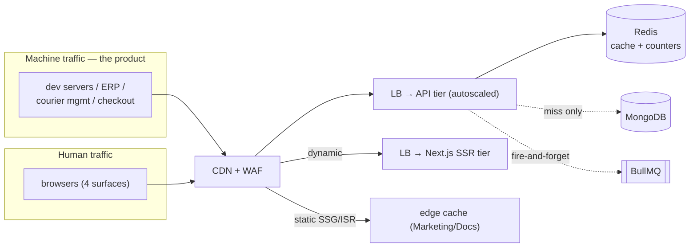
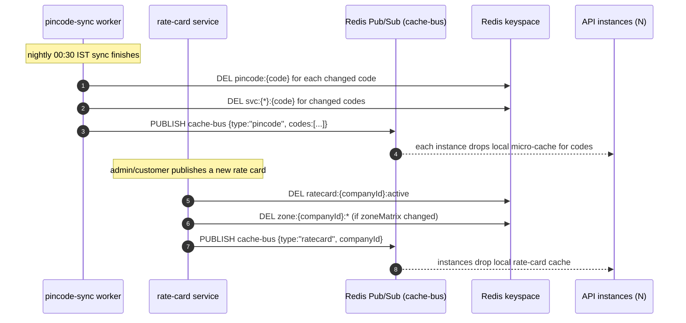
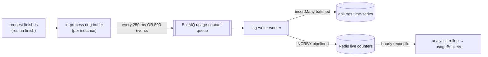
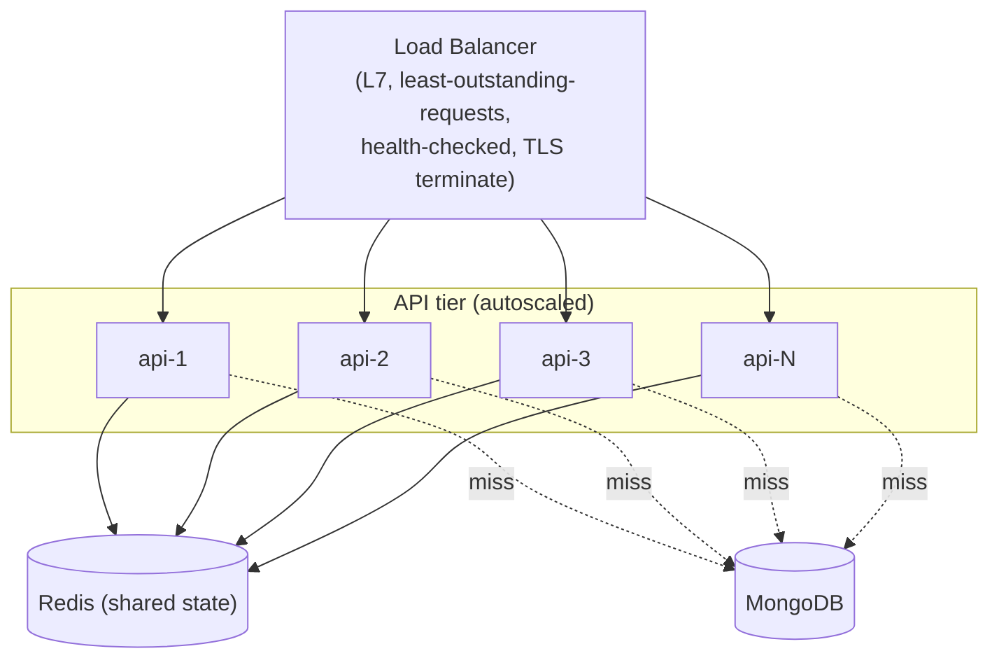
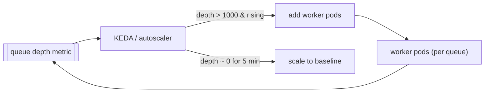
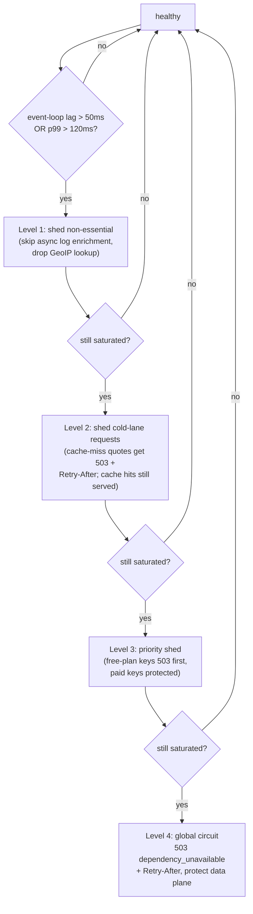

# Scalability & Performance Plan

Postpin's product is a latency-sensitive, high-volume machine API: a single `POST /v1/rates` call must return a fully itemized INR quote in tens of milliseconds, and the platform is designed to absorb millions of such calls per day without the human-facing surfaces (Dashboard, Admin, Marketing, Docs) ever competing for the same resources. This document is the capacity-and-performance reference: it works the back-of-envelope traffic math (average vs. peak), specifies the four Redis caching layers (pincode, zone, rate-card, serviceability) with exact keys, TTLs and invalidation triggers, the per-key/per-plan token-bucket rate limiter, the MongoDB indexing/replica/sharding/hot-cold/TTL strategy, stateless horizontal scaling behind a load balancer, BullMQ worker scaling and queue partitioning, the CDN strategy for static surfaces, connection pooling, a per-stage p99 latency budget, graceful degradation and load-shedding, idempotency under client retries, and a concrete performance-optimization checklist. It assumes the architecture in [System Architecture](01-architecture.md) and the hot-path pipeline in [Shipping Engine](04-shipping-engine.md), and is written to be built from directly.

## Contents

- [1. Capacity Model & Back-of-Envelope](#1-capacity-model--back-of-envelope)
- [2. Traffic Shape & Hot Path](#2-traffic-shape--hot-path)
- [3. Redis Caching Layers](#3-redis-caching-layers)
- [4. Cache Invalidation on Sync & Rate-Card Change](#4-cache-invalidation-on-sync--rate-card-change)
- [5. Rate Limiting & Burst: Token Bucket in Redis](#5-rate-limiting--burst-token-bucket-in-redis)
- [6. MongoDB Scaling Strategy](#6-mongodb-scaling-strategy)
- [7. apiLogs: Time-Series, Bucketing & TTL](#7-apilogs-time-series-bucketing--ttl)
- [8. Stateless Horizontal Scaling](#8-stateless-horizontal-scaling)
- [9. BullMQ Worker Scaling & Queue Partitioning](#9-bullmq-worker-scaling--queue-partitioning)
- [10. CDN for Marketing, Docs & Static](#10-cdn-for-marketing-docs--static)
- [11. Connection Pooling](#11-connection-pooling)
- [12. p99 Latency Budget per Pipeline Stage](#12-p99-latency-budget-per-pipeline-stage)
- [13. Graceful Degradation & Load-Shedding](#13-graceful-degradation--load-shedding)
- [14. Idempotency Under Retries](#14-idempotency-under-retries)
- [15. Performance-Optimization Checklist](#15-performance-optimization-checklist)
- [16. Related Documents](#16-related-documents)

---

## 1. Capacity Model & Back-of-Envelope

Postpin is designed for **millions of API requests per day**. All planning numbers below anchor to a **5M req/day** baseline and a **growth target of 50M req/day**; everything scales linearly from there because the hot path is stateless and cache-served.

### Average throughput

```
5,000,000 req/day ÷ 86,400 s/day  ≈ 57.9 rps average
50,000,000 req/day ÷ 86,400 s/day ≈ 578.7 rps average
```

Average is the wrong number to provision against. Indian eCommerce traffic is diurnal and spiky (sale events, checkout surges, ERP batch jobs at the top of the hour). We provision for a **peak factor of 10–20×** the daily average.

| Metric | 5M req/day | 50M req/day | Notes |
|---|---|---|---|
| Average RPS | ~58 | ~579 | uniform-day assumption |
| Provisioned peak RPS (15×) | **~870** | **~8,700** | sizing target |
| Absolute spike ceiling (20×) | ~1,160 | ~11,580 | load-shed above this |
| Reads served from Redis (target ≥ 95%) | ~826 rps | ~8,265 rps | cache hits, no Mongo touch |
| Mongo reads (cache miss ≤ 5%) | ~44 rps | ~435 rps | cold lanes + first-touch |
| Async `apiLogs` writes | = total RPS | = total RPS | queued, never inline |

### Sizing the API tier

A single Node.js (Fastify) instance on 2 vCPU comfortably serves a cache-hit quote in **~8–12 ms of CPU-light work** (the math is <1 ms; the rest is JSON parse/serialize and Redis round-trips). Empirically budget **~1,500–2,500 rps per 2-vCPU instance** for cache-hit traffic.

```
Instances needed = ceil(peak_rps / rps_per_instance / target_utilisation)

5M/day  : ceil(870  / 2000 / 0.6) ≈ 1  → run min 3 for HA across AZs
50M/day : ceil(8700 / 2000 / 0.6) ≈ 8  → run 10–12 with headroom
```

Run a **minimum of 3 instances** even at low volume (one per availability zone) so a single-AZ or single-node failure never drops below redundancy. Autoscale on **CPU > 60%** and **p95 request latency > 40 ms**, scale-out cooldown 60 s, scale-in cooldown 300 s (slow in, fast out).

### Sizing Redis

At 50M/day, ~95% cache hit ≈ **8,265 read ops/s**, plus rate-limit/quota counters (2 ops/request) ≈ **17,400 ops/s** total. A single Redis primary handles >100k ops/s for these small key operations, so CPU is not the constraint — **memory** and **HA** are.

| Dataset | Rows | Bytes/row (approx) | Memory |
|---|---|---|---|
| `pincode:{code}` (full India master, ~19,300 active pincodes) | ~19,300 | ~400 B | ~8 MB |
| `zone:{company}:{o}:{d}` (hot lanes only, LRU) | ~bounded | ~80 B | ~50–200 MB |
| `ratecard:{company}:active` | = #companies | ~4 KB | scales with tenants |
| rate-limit + quota counters | = #active keys × small | ~64 B | tens of MB |
| idempotency cache | = recent unique keys | ~response size | TTL-bounded |

Even the entire pincode master fits in **single-digit MB**. Redis is sized for headroom and HA (primary + replica + Sentinel/managed failover), not raw throughput. Use `maxmemory-policy allkeys-lru` for cache keys but **isolate counters** (rate-limit, quota, idempotency) onto a logical DB or separate instance with `noeviction` so a cache-memory spike can never evict billing-truth counters — see [§3](#3-redis-caching-layers).

### Sizing MongoDB

Only cache misses and writes hit Mongo. At 50M/day with ≥95% hit rate, read load on Mongo is **~435 rps** of indexed point lookups — trivial for a 3-node replica set. The pressure is on **`apiLogs` writes** (= total RPS, ~579 avg / ~8,700 peak), which is why logs are a time-series collection written by a buffered async worker, not inline ([§7](#7-apilogs-time-series-bucketing--ttl)).

---

## 2. Traffic Shape & Hot Path

Two traffic classes share one data plane but get isolated compute (per [System Architecture §1](01-architecture.md)).



**Hot-path invariants (carried over from [Architecture §6](01-architecture.md) and enforced here for scale):**

1. **No synchronous third-party calls.** India Post is only ever touched by the nightly sync worker; the quote path reads pincode/zone/rate-card from Redis→Mongo.
2. **No synchronous writes.** `apiLogs` and usage counters are enqueued. A Mongo write spike never blocks a quote.
3. **Redis-first reads, single round-trip.** Origin pincode + destination pincode + zone + rate-card are fetched in **one pipelined `MGET`** to collapse N round-trips into one.
4. **Stateless instances.** Any API node can serve any request; no node-local session or cache that another node lacks. Horizontal scaling is "add a node."

---

## 3. Redis Caching Layers

Four read-through caches sit in front of MongoDB on the hot path, plus the authoritative counters. Every cache is **cache-aside**: miss → DB read → populate → continue; never block the response on a cache write. Keys, TTLs and invalidation are explicit so behaviour is predictable under load.

| Layer | Key pattern | Value | TTL | Invalidated by | Negative cache |
|---|---|---|---|---|---|
| **Pincode** | `pincode:{code}` | pincode meta (zoneKey, metro, serviceable, remoteArea, oda, cogState, circle) | 24 h | nightly sync publishes per-key DEL | `serviceable:false` cached 10 min |
| **Zone** | `zone:{companyId}:{oKey}:{dKey}` | resolved zone code `A–E` | 24 h | zone-matrix update for that company | n/a (deterministic) |
| **Rate-card** | `ratecard:{companyId}:active` | active rate-card document | 1 h | rate-card publish event | n/a |
| **Serviceability** | `svc:{companyId}:{code}` | bool: is this pin serviceable for *this* tenant | 1 h | tenant serviceability edit + sync | yes, same key |
| **API key** | `apikey:{sha256}` | key record (status, scopes, allow-lists, plan ref) | 300 s | key create/rotate/revoke event | unknown-key cached 30 s |
| **Engine settings** | `settings:engine` | divisor/fuel/gst/fallback-zone defaults | 5 min | settings save | n/a |
| **Idempotency** | `idem:{keyId}:{idemKey}` | hashed response + status | 24 h | (none; expires) | n/a |

> The pincode, zone, rate-card and serviceability layers are the four named in the brief. The api-key and settings caches are listed for completeness because they sit on the same hot path. Pincode and engine-settings caches match the keys already declared in [Shipping Engine §Caching](04-shipping-engine.md); this document is the authoritative source for the **serviceability** layer.

### Why these TTLs

- **Pincode 24 h** — the underlying data only changes once per night at the 00:30 IST sync, so a 24 h TTL with explicit per-key invalidation gives a near-100% hit rate while still self-healing if an invalidation message is missed.
- **Rate-card 1 h** — rate cards change rarely but a stale price is a *money* error, so the TTL is short enough that a missed publish-invalidation self-corrects within an hour, and publish events invalidate immediately.
- **API key 300 s** — short, because a revoked key must stop working quickly; revoke events also push an explicit DEL so the worst-case window is the event-propagation delay, not 300 s.
- **Idempotency 24 h** — matches the client retry window guaranteed in [§14](#14-idempotency-under-retries).

### Pipelined hot-path read

A single quote needs origin meta, destination meta, the cached zone, and the rate card. Fetch them in one round-trip:

```text
function loadQuoteInputs(companyId, origin, dest):
    keys = [
      "pincode:" + origin,
      "pincode:" + dest,
      "zone:" + companyId + ":" + originZoneKey(origin) + ":" + destZoneKey(dest),  # may be unknown pre-meta
      "ratecard:" + companyId + ":active",
      "svc:" + companyId + ":" + origin,
      "svc:" + companyId + ":" + dest,
    ]
    vals = redis.MGET(keys)            # ONE round-trip
    misses = keys where vals[i] == nil
    if misses: backfill(misses)        # Mongo read for misses, SET with TTL
    return assemble(vals)
```

Because the zone key depends on pincode meta, the implementation fetches pincode meta + rate-card + serviceability in the first pipeline, then resolves the zone (itself a cheap cached lookup or pure compute) — at most **two** Redis round-trips, never N.

### Counter isolation (critical)

Cache keys and authoritative counters **must not share an eviction policy**:

```text
Redis logical layout:
  DB 0  (allkeys-lru)   → pincode:*, zone:*, ratecard:*, svc:*, apikey:*, settings:*  (rebuildable)
  DB 1  (noeviction)    → rl:*, quota:*, idem:*                                        (truth-ish)
```

If memory pressure forces eviction, only rebuildable cache is dropped; rate-limit, quota and idempotency state survive. Quota and rate-limit are still reconciled to MongoDB nightly so even a full Redis flush is recoverable ([§13](#13-graceful-degradation--load-shedding)).

---

## 4. Cache Invalidation on Sync & Rate-Card Change

Stale data is the enemy of a pricing API. Two events drive invalidation; both fan out via a Redis Pub/Sub channel so **every** API instance drops its in-process micro-cache and the shared Redis key is purged.



### Invalidation rules

| Trigger | Keys purged | Mechanism | Re-warm |
|---|---|---|---|
| Nightly pincode sync (changed codes only) | `pincode:{code}`, `svc:*:{code}` | sync worker `DEL` + `PUBLISH` | warm top-N busiest lanes from `apiLogs` |
| Full pincode resync / rollback | `pincode:*` (SCAN+DEL in batches), `svc:*` | worker batch | warm-up job |
| Rate-card publish | `ratecard:{companyId}:active` | rate-card service `DEL` + `PUBLISH` | warm on next request |
| Zone-matrix edit | `zone:{companyId}:*` | service `SCAN+UNLINK` | lazy |
| Tenant serviceability edit | `svc:{companyId}:{code}` | service `DEL` | lazy |
| API key rotate/revoke | `apikey:{sha256}` | key service `DEL` + `PUBLISH` | n/a |
| Engine settings save | `settings:engine` | service `DEL` | next request |

**Rules:**
- **Never `KEYS` in production.** Use `SCAN` + `UNLINK` (non-blocking delete) for wildcard purges so a big invalidation never stalls Redis.
- **Targeted over broad.** The nightly sync only touches *changed* codes (the diff already computes added/updated/removed — see [Pincode Management](03-pincode-management.md)); it does not flush the whole pincode namespace.
- **Re-warm proactively** after sync and rate-card publish: a BullMQ `cache-warm` job re-reads the top-N busiest `(origin,dest)` lanes (from `apiLogs` rollups) so the first real customer request after a sync is already a cache hit. This avoids a post-00:30 latency spike.
- **TTL is the safety net.** Even if a `PUBLISH` is lost (instance restarting), the TTL guarantees eventual consistency within 24 h (pincode) or 1 h (rate-card).

---

## 5. Rate Limiting & Burst: Token Bucket in Redis

Rate limiting is enforced in Redis with an **atomic Lua token bucket**, evaluated per API key, with limits sourced from the plan and optionally narrowed per key (see [API Key & Access Management §Rate limits](07-api-management.md)). The token bucket — not a fixed window — is chosen because it allows controlled **bursts** while capping sustained rate, which matches how checkout and ERP traffic actually behaves.

### Token-bucket model

| Parameter | Source | Example (Growth plan) |
|---|---|---|
| `refillRate` (tokens/sec) | `plan.rateLimit.rps` | 25 |
| `capacity` (max burst) | `plan.rateLimit.burst` | 50 |
| `cost` (tokens per request) | usually 1 (heavier endpoints can cost more) | 1 |
| Per-minute ceiling | `plan.rateLimit.rpm` | 1000 |

A request is allowed if the bucket has ≥ `cost` tokens; tokens refill continuously at `refillRate` up to `capacity`. The bucket lets a client burst up to `capacity` instantly after idle, then settles to `refillRate`.

### Atomic Lua script

The whole check-and-decrement must be atomic so concurrent API replicas never race. Two keys per bucket store the token count and the last-refill timestamp; the script computes refill from elapsed time, decrements, and returns allow/deny + retry-after.

```lua
-- KEYS[1] = rl:{keyId}            (token count)
-- KEYS[2] = rl:{keyId}:ts         (last refill, ms)
-- ARGV    = capacity, refillPerSec, nowMs, cost, ttlSec
local capacity = tonumber(ARGV[1])
local refill   = tonumber(ARGV[2])
local now      = tonumber(ARGV[3])
local cost     = tonumber(ARGV[4])
local ttl      = tonumber(ARGV[5])

local tokens = tonumber(redis.call('GET', KEYS[1]))
local last   = tonumber(redis.call('GET', KEYS[2]))
if tokens == nil then tokens = capacity; last = now end

-- continuous refill
local delta = math.max(0, now - last) / 1000.0
tokens = math.min(capacity, tokens + delta * refill)

local allowed = 0
local retryAfterMs = 0
if tokens >= cost then
  tokens = tokens - cost
  allowed = 1
else
  retryAfterMs = math.ceil((cost - tokens) / refill * 1000)
end

redis.call('SET', KEYS[1], tokens, 'EX', ttl)
redis.call('SET', KEYS[2], now,    'EX', ttl)
return { allowed, math.floor(tokens), retryAfterMs }
```

### Layering: key vs plan vs global

Limits stack; the **most restrictive wins**:

```mermaid
flowchart TD
  R[request] --> K{per-key bucket\nrl:keyId}
  K -- empty --> D429[429 rate_limited]
  K -- ok --> P{per-plan rpm ceiling\nrl:keyId:min window}
  P -- exceeded --> D429
  P -- ok --> G{global circuit\n(load-shed, §13)}
  G -- shedding --> D503[503 dependency_unavailable]
  G -- ok --> E[proceed to engine]
```

| Scope | Key | Purpose |
|---|---|---|
| Per key (burst) | `rl:{keyId}` | smooth instantaneous spikes, allow bursts |
| Per key (sustained) | `rl:{keyId}:{yyyymmddhhmm}` | per-minute ceiling, INCR + EXPIRE 60 s |
| Per company (fairness) | `rl:cmp:{companyId}` | a noisy key cannot starve a tenant's other keys *and* a noisy tenant cannot starve the platform |
| Monthly quota (billing) | `quota:{companyId}:{yyyymm}` | not throughput — a *billing* limit; 402 not 429 |

On a 429, return `Retry-After`, `X-RateLimit-Limit`, `X-RateLimit-Remaining`, `X-RateLimit-Reset` (per the [error envelope](04-shipping-engine.md#error-taxonomy)). The quota limit (`402 quota_exceeded`) is intentionally a different status and remediation than the throughput limit (`429 rate_limited`).

### Failing open vs closed

If Redis is **unreachable**, the limiter **fails open with a tighter local cap**: each API instance falls back to an in-process token bucket at a conservative fraction of the plan limit (e.g. `plan.rps / instanceCount` estimated, floored low). This protects the backend from a thundering herd during a Redis blip while not hard-blocking all traffic. The fallback is logged and alerts fire; quota counters reconcile from `apiLogs` once Redis recovers.

---

## 6. MongoDB Scaling Strategy

MongoDB is the system of record. The hot path only touches it on cache misses (point lookups) and async writes (`apiLogs`, counters reconcile). Scaling is about **indexing first, replicas for read offload, and sharding only when a single replica set's working set or write rate is exceeded.**

### 6.1 Indexing strategy

Every hot-path lookup must be a covered or single-key index hit. No collection scans on the request path.

| Collection | Index | Type | Serves |
|---|---|---|---|
| `pincodes` | `{ pincode: 1 }` | unique | pincode resolution (point lookup) |
| `pincodes` | `{ prefix2: 1 }`, `{ circle: 1 }` | secondary | bulk/admin filters, sync diff |
| `zones` | `{ companyId: 1, originPrefix: 1, destPrefix: 1 }` | compound | zone resolution |
| `rateCards` | `{ companyId: 1, active: 1, effectiveFrom: -1 }` | compound | active rate-card selection |
| `apiKeys` | `{ keyHash: 1 }` unique, `{ prefix: 1 }`, `{ companyId: 1 }` | secondary | key auth, listing |
| `apiLogs` | `{ tenantId: 1, ts: -1 }`, `{ ts: -1 }` (TTL) | time-series + TTL | analytics range scans, expiry |
| `subscriptions` | `{ companyId: 1, status: 1 }` | compound | quota/subscription gate |
| `usageBuckets` | `{ tenantId: 1, granularity: 1, bucketStart: -1 }` | compound | dashboard rollups |
| `pincodeSyncLogs` | `{ startedAt: -1 }` | secondary | sync history |
| `tickets` | `{ companyId: 1, status: 1 }`, `{ assignee: 1 }` | secondary | support queues |

**Rules:**
- **Compound index field order = equality → sort → range.** `apiLogs` analytics queries filter `tenantId` (equality) then sort `ts` (descending) — index `{ tenantId: 1, ts: -1 }`.
- **Covered queries** where possible: project only indexed fields for the hottest analytics so Mongo answers from the index without fetching documents.
- **No unbounded `$regex`, no `$where`, no scans on the request path.** Enforce in code review and with a slow-query alarm (`> 50 ms` logs a warning).
- **`hint()`** the intended index on the few analytics aggregations where the planner might pick wrong.

### 6.2 Read replicas

A 3-node replica set (1 primary, 2 secondaries) is the baseline. Reads are routed by **read preference per workload**:

| Workload | Read preference | Rationale |
|---|---|---|
| Hot-path pincode/zone/rate-card cache-miss | `primaryPreferred` | must be fresh enough; falls to secondary only if primary down |
| Analytics dashboards / rollup reads | `secondaryPreferred` | tolerate slight lag, offload primary |
| Admin reporting / exports | `secondary` | never touch primary for heavy scans |
| Billing / quota reconcile | `primary` | money truth must be current |
| Sync diff reads | `secondaryPreferred` | large scan, lag-tolerant |

Set `maxStalenessSeconds: 90` on secondary reads so a badly lagging secondary is skipped. Heavy analytics never compete with the hot path because they are pinned to secondaries.

### 6.3 Sharding key choice

Sharding is **deferred** until a single replica set's working set no longer fits in RAM or write throughput saturates the primary. When that day comes, the key choice differs per collection:

| Collection | Shard key | Why | Anti-pattern avoided |
|---|---|---|---|
| `apiLogs` | `{ tenantId: 1, ts: 1 }` (or hashed `tenantId`) | spreads write load across tenants; keeps a tenant's logs co-located for range scans | pure `{ ts: 1 }` → monotonic hot shard (all writes hit the newest chunk) |
| `usageBuckets` | `{ tenantId: 1, bucketStart: 1 }` | tenant-local rollups, even distribution | n/a |
| `rateCards`, `zones`, `subscriptions`, `tickets`, `apiKeys` | `{ companyId: 1 }` (hashed) | natural tenant boundary; every query is already `companyId`-scoped, so it routes to one shard | low-cardinality range key |
| `pincodes` | **do not shard** (replicate everywhere) | global master, ~19k rows, single-digit MB; cache-served; sharding adds scatter-gather for zero benefit | scatter-gather on a tiny hot collection |

**Decision rule:** `companyId` is the right shard key for tenant-scoped data because **every** query already carries it, so each query is single-shard (targeted, not scatter-gather). For `apiLogs`, compound `{ tenantId, ts }` avoids the monotonic-`ts` hot-shard trap while still allowing efficient per-tenant time-range queries. **Never shard on a monotonically increasing key alone.** `pincodes` stays a small unsharded global collection — it is read-mostly, fully cached, and tiny.

### 6.4 Hot vs. cold data

| Tier | Data | Store | Access |
|---|---|---|---|
| **Hot** | active pincodes, current rate cards, live zones, active keys/subscriptions | Mongo + Redis | sub-ms, cached |
| **Warm** | last 90 days `apiLogs`, last 13 months `usageBuckets` | Mongo (indexed) | dashboard range scans |
| **Cold** | `apiLogs` older than retention, archived sync snapshots, closed tickets | object storage (e.g. S3 as compressed NDJSON/Parquet) | rare, export/audit only |

The hot path never reads warm or cold tiers. `apiLogs` ages out via TTL ([§7](#7-apilogs-time-series-bucketing--ttl)); before expiry a daily archive job streams expiring buckets to cold object storage so audit/compliance history is retained cheaply without bloating the operational DB.

---

## 7. apiLogs: Time-Series, Bucketing & TTL

`apiLogs` is the highest-write collection (= total request volume). It is a **MongoDB time-series collection** so Mongo handles internal bucketing, compression, and efficient range scans automatically (per [API Analytics](08-api-analytics.md)).

```json
{
  "create": "apiLogs",
  "timeseries": {
    "timeField": "ts",
    "metaField": "meta",
    "granularity": "seconds"
  },
  "expireAfterSeconds": 7776000
}
```

- `timeField: ts` — request start time; `metaField: meta` holds the low-churn grouping fields (`tenantId`, `keyId`, `endpoint`, `outcome`, `zone`) so Mongo co-locates same-series points in one bucket.
- `expireAfterSeconds: 7776000` = **90 days** raw retention (operational debugging + recent analytics).
- Pre-aggregated `usageBuckets` (minute/hour/day) are written by the `analytics-rollup` worker and retained **13 months** for trend charts — they are tiny compared to raw logs.

### Write path (never inline)



- Logs are **buffered per instance** and flushed as a **batched `insertMany`** (250 ms or 500 events, whichever first). This turns N tiny writes into one bulk write, the single biggest write-amplification win at scale.
- The buffer is **bounded** (e.g. 5,000 events). On overflow (worker backlog), the oldest sampled-down events are dropped with a counter incremented — telemetry loss is acceptable; a 5xx is not.
- Live counters (`callsToday`, `callsThisMonth`, per-endpoint) are `INCRBY` in Redis on the same flush, then reconciled to `usageBuckets` hourly so a Redis flush is recoverable from the durable `apiLogs`.

### Downsampling / rollup ladder

| Granularity | Source | Retention | Use |
|---|---|---|---|
| raw event | request | 90 d (TTL) | debugging, security forensics |
| minute bucket | rollup of raw | 7 d | live "last hour" charts |
| hour bucket | rollup of minute | 90 d | daily usage charts |
| day bucket | rollup of hour | 13 months | trend / billing reconciliation |

---

## 8. Stateless Horizontal Scaling

The API tier is **fully stateless**: no node-local sessions, no node-local cache another node lacks, no sticky routing. This is what makes "add a node" the entire scaling story.



| Concern | Decision |
|---|---|
| Load-balancing algorithm | **Least-outstanding-requests** (not round-robin) so a slow node receives fewer new requests; avoids head-of-line pile-up |
| Health checks | `GET /healthz` (liveness, cheap) + `GET /readyz` (readiness: can reach Redis + Mongo). LB removes a node failing `/readyz`; orchestrator restarts on failed `/healthz` |
| Graceful shutdown | On SIGTERM: stop accepting new connections, fail `/readyz`, drain in-flight (≤ 25 s), flush the log buffer, then exit. LB drains before kill |
| Autoscale signal | CPU > 60% **or** p95 latency > 40 ms; scale-out fast (60 s cooldown), scale-in slow (300 s) |
| Process model | One Node process per vCPU pair (or cluster mode bounded to core count); **never** over-fork — extra processes thrash a small box (lesson applied platform-wide) |
| Connection reuse | LB ↔ API uses HTTP keep-alive; clients are encouraged to keep-alive and HTTP/2-multiplex |
| Statelessness guarantee | Idempotency cache, rate-limit, quota, sessions all live in Redis/Mongo — verified in CI by running the suite against a 2-node cluster with random node kills |

The four Next.js surfaces scale independently: Marketing/Docs are mostly static (CDN, near-zero origin load), Dashboard/Admin run a **separate** small SSR tier so a human-traffic spike (e.g. an admin running a heavy report) never steals capacity from the machine API.

---

## 9. BullMQ Worker Scaling & Queue Partitioning

Workers are **separate deployables** from the API (per [Architecture §7.3](01-architecture.md)) so heavy background work never steals CPU from the quote path. Each queue scales on its own signal and concurrency.

| Queue | Trigger | Concurrency | Scale signal | Partitioning |
|---|---|---|---|---|
| `usage-counter` (log write) | every request | high (10–20/worker) | queue depth | none needed (idempotent batch inserts) |
| `analytics-rollup` | cron hourly/daily | 2 | schedule | by time window |
| `webhook-dispatch` | billing/key/sync events | 20 | queue depth + retry backlog | **by `companyId`** (per-tenant ordering + isolation) |
| `notification` | many services | 10 | queue depth | by channel (email/sms/in-app) |
| `pincode-sync` | cron 00:30 IST + manual | **1 (locked)** | n/a (singleton) | single global job, Redis lock |
| `cache-warm` | after sync / rate-card publish | 4 | one-shot | by lane batch |

### Partitioning strategy

- **Singleton work** (`pincode-sync`) uses a Redis lock `lock:pincode-sync` (TTL 30 min) so even with multiple worker instances exactly one run executes — overlapping nightly syncs are impossible.
- **Per-tenant ordering** (`webhook-dispatch`) partitions by `companyId` (BullMQ job `groupId` / a sharded queue per hash bucket) so a single tenant's webhooks are delivered in order *and* one tenant's slow/failing endpoint cannot head-of-line-block another tenant's deliveries.
- **Fan-out work** (`usage-counter`, `notification`) needs no ordering, so it runs at high concurrency across many workers with no partitioning.

### Worker autoscaling



- Scale `webhook-dispatch` and `usage-counter` workers on **queue depth** (e.g. KEDA on BullMQ/Redis), not CPU — a backlog is the real signal.
- **Dead-letter** after max retries (`webhook-dispatch`: 5 retries, exp backoff) so a permanently-broken customer endpoint cannot grow the queue unbounded; dead-lettered jobs surface in Admin.
- **Backpressure to the buffer, not the API:** if log-writer workers fall behind, the per-instance ring buffer drops sampled events ([§7](#7-apilogs-time-series-bucketing--ttl)) rather than blocking requests.

---

## 10. CDN for Marketing, Docs & Static

Human-facing static content is served from the edge so the origin tier carries almost no load for it.

| Surface | Rendering | Edge strategy | Origin load |
|---|---|---|---|
| Marketing (`postpin.dev`) | SSG / ISR | fully edge-cached, long `s-maxage`, `stale-while-revalidate` | near-zero |
| Docs (`docs.postpin.dev`) | SSG from MDX + OpenAPI, ISR for changelog | edge-cached, revalidate on deploy | near-zero |
| Dashboard/Admin static assets | Next.js `_next/static/*` (hashed) | immutable, `cache-control: public, max-age=31536000, immutable` | one-time |
| Dashboard/Admin HTML/data | SSR/RSC | **not** edge-cached (auth-scoped); served from SSR tier | small |
| API responses | dynamic JSON | **never** CDN-cached (per-tenant pricing); `Cache-Control: no-store` | full |

**Rules:**
- **Hashed static assets are immutable** and cached for a year at the edge — a deploy ships new hashes, so cache-busting is automatic and free.
- **The API is never CDN-cached.** Quotes are per-tenant, per-rate-card, and rate-limit/quota-metered; an edge-cached quote would be both wrong and a billing-bypass. Set `Cache-Control: no-store` on `/v1/*`.
- **WAF + edge rate-limiting** at the CDN layer absorbs volumetric DDoS and obvious bad traffic (malformed paths, bot floods) before it reaches the origin, complementing the per-key token bucket ([§5](#5-rate-limiting--burst-token-bucket-in-redis)).
- **Brotli/gzip at the edge** for HTML/JS/CSS; the API tier compresses its own JSON responses (`br` preferred) since they bypass the CDN.

---

## 11. Connection Pooling

Connection churn is a silent latency tax; every tier reuses connections.

| From → To | Pool setting | Value | Why |
|---|---|---|---|
| API → MongoDB | `maxPoolSize` | 50–100 per instance | enough for cache-miss + write concurrency; not so high it exhausts Mongo's connection budget across N instances |
| API → MongoDB | `minPoolSize` | 5 | keep warm connections, avoid cold-connect on first request |
| API → MongoDB | `maxIdleTimeMS` | 60000 | reclaim idle but keep the warm floor |
| API → MongoDB | `waitQueueTimeoutMS` | 2000 | fail fast rather than queue forever under saturation |
| API → Redis (ioredis) | connection per instance + pipelining | 1 (multiplexed) | Redis is single-threaded; one pipelined connection beats a pool |
| Worker → MongoDB | `maxPoolSize` | 20 per worker | workers are fewer, batch-write heavy |
| API → upstream HTTP (none on hot path) | keep-alive agent | reuse | only workers call India Post / payments / email |

**Global ceiling math:** total Mongo connections = `Σ (instances × maxPoolSize) + (workers × maxPoolSize)`. Size `maxPoolSize` so the **sum across the maximum autoscaled fleet stays under the managed cluster's connection limit** (e.g. 12 API instances × 80 + 6 workers × 20 = 1,080 — verify against the cluster tier). When approaching the ceiling, scale the cluster tier or front Mongo with a connection proxy rather than raising per-instance pools blindly.

---

## 12. p99 Latency Budget per Pipeline Stage

The product SLO is **p99 < 80 ms (cache hit)** and **p99 < 200 ms (cold lane)** end-to-end at the API edge, with an internal stretch target of **p99 < 50 ms** for the fully-cached hot path (consistent with [Shipping Engine](04-shipping-engine.md#caching-strategy--latency-budget)). Each stage gets an explicit budget so a regression is attributable.

| # | Stage | p50 | p99 budget (hit) | p99 budget (cold) | Notes |
|---|---|---|---|---|---|
| 1 | TLS + HTTP parse + body limit | 1 ms | 4 ms | 4 ms | keep-alive amortizes TLS |
| 2 | Zod validation | <0.2 ms | 1 ms | 1 ms | pure CPU |
| 3 | API-key auth (Redis hit / Mongo miss) | 1 ms | 4 ms | 12 ms | `apikey:` 300 s cache |
| 4 | Quota + rate-limit (Redis Lua) | 1 ms | 3 ms | 3 ms | 2 small ops |
| 5–6 | Pincode ×2 (pipelined) | 1 ms | 5 ms | 25 ms | cold = Mongo point lookups |
| 7 | Zone resolve (cache / compute) | <0.5 ms | 2 ms | 6 ms | mostly compute |
| 8 | Billable weight | <0.1 ms | 0.5 ms | 0.5 ms | pure math |
| 9 | Rate-card slabs (Redis / Mongo) | 1 ms | 4 ms | 20 ms | `ratecard:` 1 h cache |
| 10–13 | Surcharge stack | <0.2 ms | 1 ms | 1 ms | pure math |
| 14 | Serialize + write response | 1 ms | 4 ms | 4 ms | JSON + br compress |
| — | Async enqueue (off the clock) | — | — | — | `apiLogs` never in budget |
| | **Total** | **~8 ms** | **~30 ms** | **~80 ms** | headroom to SLO |

**Budget enforcement:**
- Each stage emits `engineMs`/per-stage spans (OpenTelemetry); a stage breaching its p99 for 5 min triggers an alert tagged with the stage name.
- The hot path makes **at most two Redis round-trips** (pipelined) and **zero Mongo round-trips on a cache hit** — this is the single most important latency invariant.
- Cold-lane p99 is dominated by Mongo point lookups (indexed, ~2–8 ms each); the cache-warm job keeps cold lanes rare in steady state.

---

## 13. Graceful Degradation & Load-Shedding

The platform degrades in defined, ordered steps rather than failing all-at-once. Priority order: **serve correct quotes > serve quotes with degraded auxiliary data > shed lowest-value traffic > fail safe.**

### Dependency degradation matrix

| Dependency | Failure | Hot-path behaviour | Degradation |
|---|---|---|---|
| **Redis (cache)** | down/slow | cache miss → Mongo | reads fall through to Mongo + backfill on recovery; latency rises but quotes still correct |
| **Redis (counters)** | down | rate-limit fails **open** with tighter local cap; quota check skipped | reconcile counters from `apiLogs` on recovery; alert |
| **MongoDB primary** | failover | brief write pause | replica auto-failover; reads `primaryPreferred` drop to secondary; async writes queue and drain |
| **MongoDB (overloaded)** | slow queries | cache absorbs reads; slow-query shedding | shed cold-lane (uncached) requests first (see below) |
| **India Post** | down at 00:30 | **none** | quotes served from last-good master; sync retries with backoff |
| **BullMQ workers** | backlog | none on quotes | log buffer drops sampled events; webhooks retry/dead-letter |
| **Payment/email** | down | none on quotes | off the hot path entirely; workers retry |

### Load-shedding ladder

When the API tier approaches saturation (event-loop lag rising, p99 climbing, queue depth growing), shed in this order:



| Level | Trigger | Action | Who is shed |
|---|---|---|---|
| 1 | event-loop lag > 50 ms | drop optional enrichment (GeoIP, UA parse), keep core quote | nobody (quality only) |
| 2 | sustained saturation | shed **cache-miss** quotes (`503 + Retry-After`) | cold lanes — cache hits unaffected |
| 3 | still saturated | shed by **plan priority** (free/trial keys 503 before paid) | lowest-value traffic |
| 4 | data plane at risk | global circuit breaker; uniform `503 dependency_unavailable` with `Retry-After` | all, briefly, to protect the system |

Shedding always returns a **`503` with `Retry-After`** and the standard error envelope so well-behaved clients back off and retry (with their `Idempotency-Key`, [§14](#14-idempotency-under-retries)) rather than hammering. The breaker is half-open after the retry window to probe recovery.

---

## 14. Idempotency Under Retries

Clients retry — on timeout, on 503, on network blips. Without idempotency, a retried `POST /v1/rates` is harmless (quotes are read-only) but a retried billing-affecting call would double-count. The platform guarantees **at-most-once effect** for the request window via an `Idempotency-Key`.

### Contract

- Client sends `Idempotency-Key: <uuid>` (recommended on every mutating call; honored on `/v1/rates` so identical retries return the identical quote).
- The server caches the **response + status** under `idem:{keyId}:{idemKey}` for **24 h**.
- A retry with the same key returns the **stored response** without re-running the engine or re-incrementing quota/usage — the retry is "free" and side-effect-free.

```mermaid
flowchart TD
  R[request + Idempotency-Key] --> L{SET idem:keyId:idemKey\nNX (lock)}
  L -- key exists, completed --> C[return cached response\nno re-charge, no re-log]
  L -- key exists, in-flight --> W[409 idempotency_conflict\nor short-poll for result]
  L -- new (lock acquired) --> E[run engine once]
  E --> S[store response + status\nEX 24h, mark complete]
  S --> OUT[return response\ncount quota once]
```

### Rules & edge cases

| Case | Behaviour |
|---|---|
| Same key, same body, completed | return cached response byte-for-byte; quota counted once |
| Same key, **different** body | `422 idempotency_key_reuse` — a key is bound to its first request payload (store a body hash with the key) |
| Same key, request still in-flight | `409 idempotency_conflict` (client should wait/retry), or short-poll the lock; never run twice |
| Key absent | process normally (idempotency optional but recommended) |
| Redis down | fall back to **best-effort** (no idempotency guarantee); since `/v1/rates` is read-only this is safe; mutating endpoints in this state should fail closed |
| Key TTL expired (> 24 h) | treated as a new request |

The 24 h cache window matches the pincode-cache TTL and the documented client retry guarantee, so a legitimately-retried request inside a day is always deduplicated. The lock (`SET ... NX`) closes the race where two concurrent retries arrive before the first completes.

---

## 15. Performance-Optimization Checklist

A build-time and ops-time checklist. Anything unchecked is a known scaling risk.

### Hot path

- [ ] Quote path makes **zero synchronous third-party calls** (India Post only via sync worker).
- [ ] Quote path makes **zero synchronous DB writes** (`apiLogs`/counters enqueued).
- [ ] Pincode + zone + rate-card + serviceability fetched in **one pipelined `MGET`** (≤ 2 Redis round-trips total).
- [ ] **Zero Mongo round-trips on a cache hit**; ≥ 95% cache-hit target monitored.
- [ ] Rate-card and pincode caches **invalidated on publish/sync**, with TTL as the safety net.
- [ ] Negative caching for unserviceable pincodes (10 min) to stop Mongo hammering.
- [ ] Cache-warm job pre-warms top-N lanes after sync and rate-card publish (no post-00:30 spike).
- [ ] Money math in **integer paisa**; deterministic rounding (no float drift).

### Caching & Redis

- [ ] Cache keys and authoritative counters on **separate eviction policies** (LRU vs noeviction).
- [ ] Wildcard purges use `SCAN` + `UNLINK`, **never `KEYS`**.
- [ ] Invalidation fans out via Pub/Sub so all instances drop local micro-cache.
- [ ] Redis HA (primary + replica + managed failover); counters reconciled to Mongo nightly.
- [ ] Rate limiter is an **atomic Lua token bucket**; fails open with a tighter local cap.

### MongoDB

- [ ] Every hot-path query is an **index hit**; no scans, no unbounded `$regex` on the request path.
- [ ] Compound indexes follow **equality → sort → range** field order.
- [ ] Slow-query alarm at **> 50 ms**; analytics pinned to **secondaries**.
- [ ] `apiLogs` is a **time-series collection** with **TTL (90 d)**; rollups feed `usageBuckets`.
- [ ] Shard keys chosen to avoid monotonic hot shards (`{tenantId, ts}` for logs; hashed `companyId` for tenant data); `pincodes` left unsharded.
- [ ] Cold data archived to object storage before TTL expiry.

### Scaling & infra

- [ ] API tier is **stateless**; verified by chaos test (random node kills against a multi-node cluster).
- [ ] Min **3 instances** across AZs; autoscale on CPU > 60% **or** p95 > 40 ms; fast-out/slow-in.
- [ ] LB uses **least-outstanding-requests**; `/healthz` + `/readyz`; graceful drain on SIGTERM.
- [ ] Workers are **separate deployables**; `pincode-sync` is a Redis-locked singleton.
- [ ] `webhook-dispatch` partitioned by `companyId` (per-tenant ordering + isolation); workers autoscale on **queue depth**; dead-letter after max retries.
- [ ] Connection pools sized so the **sum across the max fleet stays under the Mongo connection ceiling**.

### Edge & resilience

- [ ] Marketing/Docs fully CDN/edge-cached; `_next/static` immutable for 1 year.
- [ ] **API never CDN-cached** (`Cache-Control: no-store` on `/v1/*`).
- [ ] WAF + edge rate-limiting absorbs volumetric attacks before origin.
- [ ] Load-shedding ladder implemented (enrichment → cold-lane → plan-priority → global circuit), always `503 + Retry-After`.
- [ ] Idempotency cache (24 h) with `NX` lock; retries are free and side-effect-free.
- [ ] Per-stage p99 spans (OpenTelemetry); alerts tagged by stage.

### Load testing (pre-prod gate)

- [ ] k6/Gatling load test in staging at **20× projected average** sustained for 30 min, p99 within SLO.
- [ ] Soak test (4 h) confirms no memory leak / connection leak / unbounded buffer growth.
- [ ] Chaos: kill a Redis replica, a Mongo secondary, and an API node mid-load — SLO holds or degrades gracefully.
- [ ] Cache-cold test (flush Redis under load) confirms Mongo + load-shedding survive the stampede.

---

## 16. Related Documents

| Topic | Document |
|---|---|
| Surfaces, layers, data tier, worker fleet, failure handling | [System Architecture](01-architecture.md) |
| Hot-path pipeline, caching layout, latency budget, rounding | [Shipping Engine](04-shipping-engine.md) |
| Nightly India Post sync, diffing, invalidation triggers | [Pincode Management](03-pincode-management.md) |
| Zone resolution and zone-matrix overrides | [Zone Management](05-zone-management.md) |
| API keys, rate limits, quotas, access-control engine | [API Key & Access Management](07-api-management.md) |
| `apiLogs` event, counters, rollups, retention, downsampling | [API Analytics & Usage Intelligence](08-api-analytics.md) |
| Plans, quotas, overage, billing limits | [Subscription Engine](09-subscription-engine.md) |
