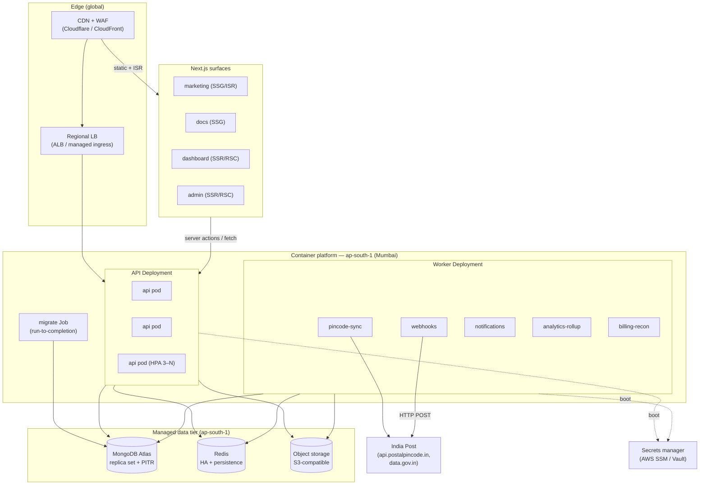
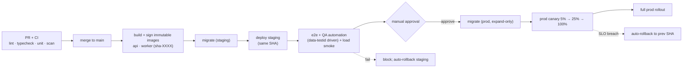
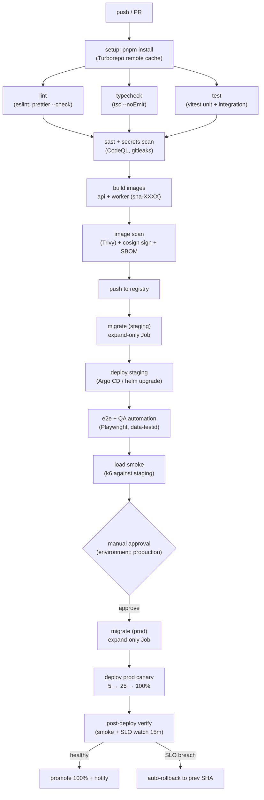
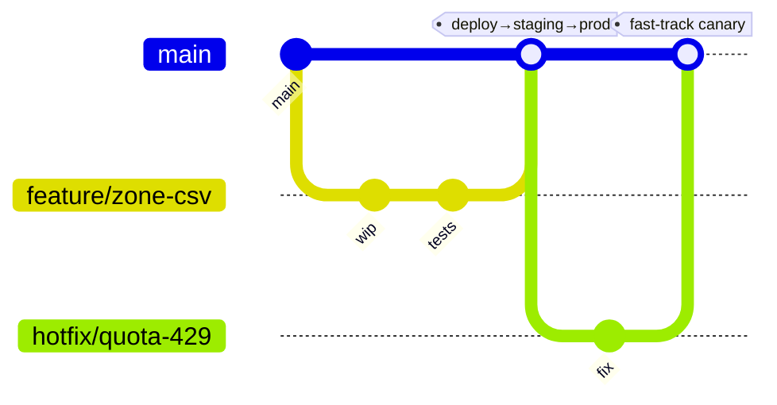
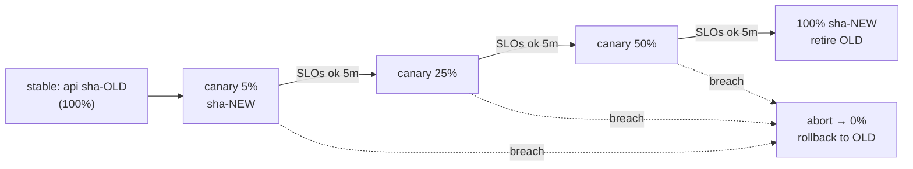
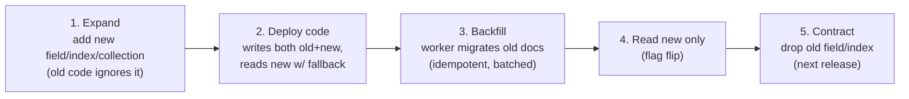
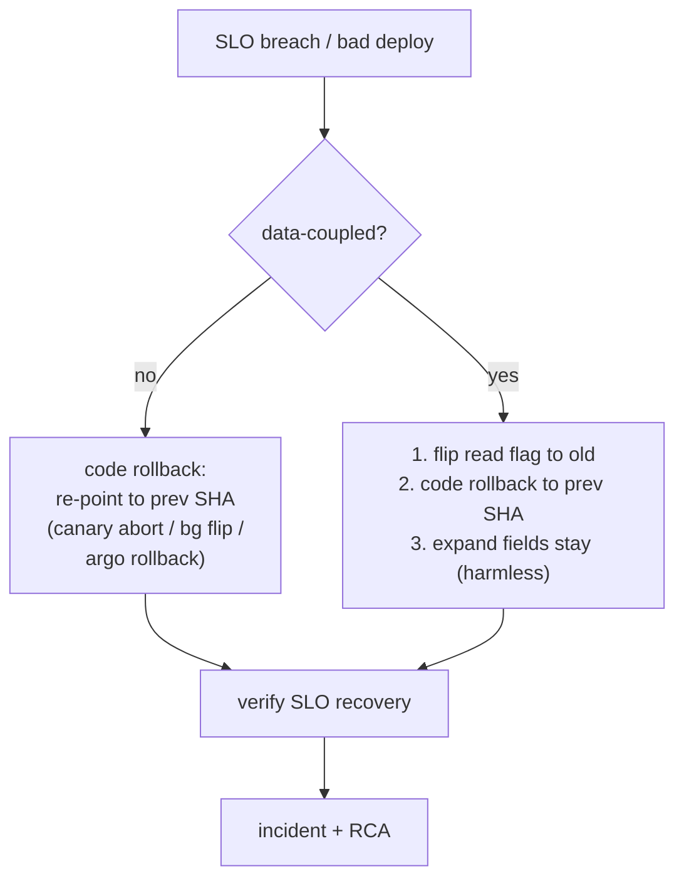
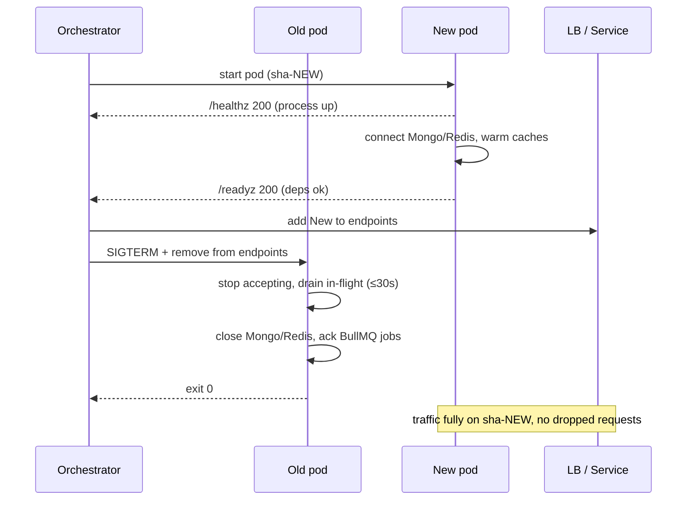

# Deployment Architecture & CI/CD

Postpin ships as immutable container artifacts — one Fastify API image and one BullMQ worker image — promoted unchanged through dev → staging → prod, with the four Next.js surfaces (Marketing, Dashboard, Admin, Docs) served from the same monorepo behind a global CDN. The data tier is fully managed: MongoDB Atlas (India region, replica set + PITR), a managed Redis (HA, persistence), and S3-compatible object storage for CSV exports and ticket attachments. This document is the build-from reference for the whole delivery pipeline: the runtime topology, the three environments and how code is promoted between them, the Terraform-based IaC layout, the GitHub Actions pipeline (lint → typecheck → test → build → security scan → migrate → deploy), branch strategy, blue-green and canary release mechanics, the MongoDB migration strategy and rollback, secrets management, zero-downtime guarantees, and health/readiness probes. Every section is opinionated and concrete; nothing here is a placeholder.

## Contents

- [1. Deployment topology](#1-deployment-topology)
- [2. Container images and runtime](#2-container-images-and-runtime)
- [3. Environments and promotion](#3-environments-and-promotion)
- [4. Next.js surface hosting and the edge](#4-nextjs-surface-hosting-and-the-edge)
- [5. Infrastructure as Code (Terraform)](#5-infrastructure-as-code-terraform)
- [6. CI/CD pipeline](#6-cicd-pipeline)
- [7. Branch strategy](#7-branch-strategy)
- [8. Release strategy: blue-green and canary](#8-release-strategy-blue-green-and-canary)
- [9. Database migration strategy](#9-database-migration-strategy)
- [10. Rollback](#10-rollback)
- [11. Secrets management and config](#11-secrets-management-and-config)
- [12. Zero-downtime deploys, health and readiness](#12-zero-downtime-deploys-health-and-readiness)
- [13. Sample GitHub Actions workflow](#13-sample-github-actions-workflow)
- [14. Operational runbook](#14-operational-runbook)
- [15. Cross-references](#15-cross-references)

---

## 1. Deployment topology

Postpin runs as a **modular monolith API** plus a **horizontally-scaled worker fleet**, fronted by a CDN/WAF and a load balancer, on a managed Kubernetes cluster (or equivalent container platform — ECS/Fargate, Fly.io, Render). The decision driver is the latency budget from [System Architecture](01-architecture.md): the machine path (`api.postpin.dev/v1/*`) must hit p95 < 80 ms on a cache hit, so the API runs close to a managed Redis and MongoDB in the same region (**ap-south-1 / Mumbai**), and everything non-essential is pushed onto workers.



| Tier | What runs there | Scaling | Why managed/here |
| --- | --- | --- | --- |
| **CDN / WAF** | TLS termination, static asset + ISR caching, bot/DDoS rules, rate-limit at edge | Global PoPs | Offload static, absorb attacks before the API |
| **API** | Fastify `/v1` server (stateless) | HPA on CPU + RPS, 3→N pods | Stateless = trivially horizontal; lives next to Redis/Mongo |
| **Workers** | BullMQ consumers, one Deployment per queue family | KEDA on queue depth | Isolate noisy queues; `pincode-sync` is singleton-locked |
| **MongoDB** | System of record, 20+ collections | Atlas M30+ replica set, PITR | India data residency, auto-failover, point-in-time restore |
| **Redis** | Cache, rate-limit counters, BullMQ backplane, locks | Managed HA (primary+replica) | Sub-ms hot path; AOF persistence for queue durability |
| **Object storage** | CSV exports, ticket attachments, invoice PDFs | Bucket per env | Cheap, durable, presigned URLs; off the API process |

> **Data residency.** All primary data stays in `ap-south-1` to keep India Post sync and customer data India-resident. The CDN is global for static/ISR only; no customer PII is cached at the edge.

---

## 2. Container images and runtime

Two images come out of one monorepo. They share the `node_modules` build but expose different entrypoints, so a single tested artifact set backs both the request path and the worker path.

| Image | Entrypoint | Listens | Replicas (prod) | Probes |
| --- | --- | --- | --- | --- |
| `postpin/api` | `node dist/server.js` | `:4000/v1` | 3–N (HPA) | `/healthz`, `/readyz` |
| `postpin/worker` | `node dist/worker.js` | none (consumes Redis) | per-queue (KEDA) | `/healthz` (sidecar HTTP) + Redis heartbeat |

Both are built from the **same multi-stage Dockerfile** for cache reuse and version parity. The runtime stage is `node:22-alpine` (or `gcr.io/distroless/nodejs22` for prod to shrink CVE surface), runs as a non-root user, and contains only `dist/` + production `node_modules`.

```dockerfile
# syntax=docker/dockerfile:1.7
FROM node:22-alpine AS base
RUN corepack enable
WORKDIR /app

# --- deps: cached on lockfile only ---
FROM base AS deps
COPY pnpm-lock.yaml package.json pnpm-workspace.yaml ./
COPY apps/api/package.json apps/api/package.json
COPY packages/*/package.json packages/
RUN --mount=type=cache,id=pnpm,target=/root/.local/share/pnpm/store \
    pnpm install --frozen-lockfile

# --- build: compile TS for the api+worker app ---
FROM deps AS build
COPY . .
RUN pnpm --filter @postpin/api build        # tsc -> dist/ (server.js + worker.js)
RUN pnpm --filter @postpin/api deploy --prod /out   # prune to prod deps

# --- runtime: distroless, non-root, minimal ---
FROM gcr.io/distroless/nodejs22-debian12 AS runtime
ENV NODE_ENV=production
WORKDIR /app
COPY --from=build /out/node_modules ./node_modules
COPY --from=build /app/apps/api/dist ./dist
USER nonroot
EXPOSE 4000
# server vs worker chosen by the orchestrator's command override
CMD ["dist/server.js"]
```

**Image conventions**

- **Tag = immutable git SHA** (`postpin/api:sha-9f3a1c2`), never `latest` in deploys. The same SHA tag is what staging verified and prod promotes — no rebuild between environments.
- **SBOM + provenance** generated at build (`docker buildx --sbom --provenance`) and attached to the registry; image is **cosign-signed**, and the cluster admission controller rejects unsigned images.
- **Multi-arch** `linux/amd64` (and `arm64` if the cluster is Graviton) via `buildx`.
- **Layer cache** keyed on `pnpm-lock.yaml`; app code changes don't re-resolve dependencies.
- **No secrets baked in** — the image is environment-agnostic; all config arrives at runtime (see [§11](#11-secrets-management-and-config)).

---

## 3. Environments and promotion

Three long-lived environments, each fully isolated (own secret scope, own signing keys, own data tier). This table extends the environment matrix in [System Architecture §9](01-architecture.md).

| Aspect | Dev | Staging | Production |
| --- | --- | --- | --- |
| Purpose | Local + ephemeral PR previews | Pre-prod verification, QA automation, load tests | Live customer traffic |
| Cluster | `docker compose` / kind | Shared staging namespace | Dedicated prod cluster |
| API host | `localhost:4000/v1` | `api.staging.postpin.dev/v1` | `api.postpin.dev/v1` |
| FE hosts | `next dev` localhost | `*.staging.postpin.dev` | `postpin.dev`, `app.`, `admin.`, `docs.` |
| MongoDB | Docker container, seeded | Atlas M10, anonymized snapshot | Atlas M30+, PITR, prod data |
| Redis | Docker container | Managed single | Managed HA + persistence |
| Object storage | MinIO container | `postpin-staging` bucket | `postpin-prod` bucket |
| India Post | Recorded fixtures | Real API, `test` schedule | Real API, 00:30 IST |
| Payments | Gateway sandbox | Gateway sandbox | Gateway live |
| Secrets | `.env.local` (gitignored) | SSM `/postpin/staging/*` | SSM `/postpin/prod/*` |
| Feature flags | all on | mirror prod + canary | controlled rollout |
| Approval to deploy | none | auto on merge to `main` | manual gate + canary |

**Promotion is artifact promotion, not rebuild.** A merge to `main` builds the immutable image set once (`sha-<commit>`), pushes to the registry, deploys to **staging**, runs the full e2e + QA-automation suite (which depends on the `data-testid` locators mandated platform-wide), and only then promotes the **same SHA** to production behind a canary.



**Ephemeral PR previews.** Every PR gets a throwaway preview: the Next.js surfaces deploy to a Vercel preview URL (or a `pr-<n>.preview.postpin.dev` namespace), wired to a seeded ephemeral Mongo/Redis. This lets reviewers and QA exercise UI against the `data-testid` locators before merge. Previews are torn down on PR close by a GitHub Actions cleanup job.

---

## 4. Next.js surface hosting and the edge

The four surfaces have different rendering profiles, which drives the hosting choice. We support **two interchangeable hosting modes** so the decision is reversible:

| Surface | Render mode | Recommended host | Why |
| --- | --- | --- | --- |
| **Marketing** (`postpin.dev`) | SSG + ISR | Vercel (or container + CDN) | Mostly static, SEO-critical, infrequent edits |
| **Docs** (`docs.postpin.dev`) | SSG | Vercel / CDN | Pure static MDX; rebuild on content change |
| **Dashboard** (`app.postpin.dev`) | SSR / RSC | Container in-cluster | Authenticated, dynamic, lives next to the API to avoid cross-region hops |
| **Admin** (`admin.postpin.dev`) | SSR / RSC | Container in-cluster | Same; plus tighter network egress controls |

**Decision: Vercel for Marketing + Docs, in-cluster containers for Dashboard + Admin.** The authenticated surfaces sit in the same region/VPC as the API so RSC server fetches are intra-cluster (single-digit ms) and never traverse the public internet. Marketing/Docs are static and benefit from Vercel's global edge + ISR with zero ops. If Vercel must be dropped (cost/compliance), all four build to standalone Next.js output (`output: 'standalone'`) and run as containers behind the same CDN — the apps don't change.

**Edge / CDN rules**

- **Static + ISR** assets cached at the CDN with `stale-while-revalidate`; ISR revalidation is tag-based (`revalidateTag('pricing')`) triggered by Admin content changes.
- **API caching:** `/v1/*` responses are **not** edge-cached (per-tenant, rate-card-specific); the CDN only does TLS, WAF, and edge rate-limiting (a coarse pre-filter ahead of the Redis token bucket in [Shipping Engine](04-shipping-engine.md)).
- **WAF rules:** OWASP core ruleset, India-Post-specific bot rules off, per-IP burst caps, and a managed challenge for the dashboard login routes.
- **No PII at edge:** authenticated HTML carries `Cache-Control: private, no-store`.
- **Cache invalidation:** publishing a rate card or zone change calls the CDN purge API for affected ISR tags and the Next.js revalidate endpoint; see [Zone Management](05-zone-management.md).

---

## 5. Infrastructure as Code (Terraform)

All infrastructure is **Terraform**, no click-ops. State is remote (S3 backend + DynamoDB lock) with one state file per environment. Reusable modules keep dev/staging/prod identical except for sizing variables.

```text
infra/
  modules/
    network/        # VPC, subnets, NAT, security groups
    cluster/        # EKS/ECS, node groups, IRSA, autoscaler
    mongodb/        # Atlas project, cluster, PITR, IP access list, db users
    redis/          # ElastiCache/managed Redis, subnet group, params
    storage/        # S3 buckets (exports/attachments), lifecycle, CORS
    cdn/            # CloudFront/CF distro, WAF, cert, cache policies
    secrets/        # SSM parameter tree, KMS key, IAM policies
    dns/            # Route53/CF zones + records per surface
    observability/  # log sinks, alarms, dashboards
  envs/
    dev/    main.tf  vars.tfvars   backend.tf
    staging/main.tf  vars.tfvars   backend.tf
    prod/   main.tf  vars.tfvars   backend.tf
```

```hcl
# infra/envs/prod/main.tf (excerpt)
module "mongodb" {
  source            = "../../modules/mongodb"
  project_name      = "postpin-prod"
  region            = "AP_SOUTH_1"
  instance_size     = "M30"
  replication_specs = 3              # 3-node replica set
  pit_enabled       = true           # point-in-time restore
  backup_retention  = 30             # days
  ip_access_list    = module.network.nat_egress_ips
}

module "redis" {
  source        = "../../modules/redis"
  name          = "postpin-prod"
  node_type     = "cache.r7g.large"
  replicas      = 1                  # HA failover
  multi_az      = true
  aof_enabled   = true              # BullMQ durability
  subnet_group  = module.network.private_subnets
}
```

**IaC rules**

- **No environment drift:** the only difference between envs is `vars.tfvars` (sizes, counts, hostnames). `terraform plan` runs in CI on every infra PR and posts the diff for review.
- **Atlantis / `terraform plan` gate:** infra changes require a reviewed plan; `apply` to prod is a protected, audited action.
- **IRSA / workload identity:** pods get scoped IAM roles (read only their env's SSM subtree, write only their env's buckets) — no static cloud keys in the cluster.
- **Tagged everything** (`env`, `app`, `owner`, `cost-center`) for cost attribution.
- **Kubernetes manifests** (Deployments, HPAs, KEDA ScaledObjects, Services, Ingress, NetworkPolicies) live as Helm charts in `deploy/charts/` and are templated per env; Terraform provisions the platform, Helm/Argo CD provisions the workloads (GitOps).

---

## 6. CI/CD pipeline

The pipeline is a single GitHub Actions workflow with reusable jobs. Fast feedback first (lint/typecheck/unit on every push), heavier stages (build, scan, deploy) gated on `main`. The mandatory stages are: **lint → typecheck → test → build → security scan → migrate → deploy**.



**Stage detail**

| Stage | Tooling | Runs on | Fails build when |
| --- | --- | --- | --- |
| Lint | ESLint (`eslint.config.mjs`), Prettier check | every push | lint error / unformatted |
| Typecheck | `tsc --noEmit` across workspace | every push | any type error |
| Test | Vitest (unit + integration), `mongodb-memory-server`, `ioredis-mock`; coverage ≥ 80% on shipping engine + billing | every push | failing test / coverage drop |
| Build | `docker buildx` multi-stage, Turborepo cache | `main` + tags | build error |
| Security scan | CodeQL (SAST), gitleaks (secrets), `pnpm audit`/Snyk (deps), Trivy (image CVEs) | every push (code), build (image) | high/critical CVE, leaked secret |
| Migrate | `migrate-mongo up` (expand-only) | before each deploy | migration error → block deploy |
| Deploy | Argo CD sync / `helm upgrade --atomic` | staging auto, prod gated | rollout timeout / failed probes |
| Verify | k6 smoke + Playwright critical path + SLO watch | post-deploy | SLO breach → auto-rollback |

**Pipeline guarantees**

- **Build once, deploy many** — image built only on `main`; staging and prod deploy the identical SHA.
- **Concurrency control** — `concurrency: deploy-prod` cancels superseded prod deploys so two SHAs never race onto prod.
- **Remote caching** — Turborepo remote cache + Docker layer cache cut typical CI from ~12 min to ~4 min.
- **Required checks** — lint, typecheck, test, and both scans are required status checks on the `main` branch protection rule; a PR cannot merge red.

---

## 7. Branch strategy

**Trunk-based with short-lived feature branches**, optimized for continuous delivery and the QA automation gate.



| Branch | Lives | Merges to | Triggers |
| --- | --- | --- | --- |
| `main` | permanent | — | full pipeline → staging → (gated) prod |
| `feature/*` | hours–days | `main` via PR | CI + ephemeral preview |
| `hotfix/*` | minutes–hours | `main` via PR (fast-track) | CI + expedited canary |
| `release/*` | optional, for pinned cuts | tag only | tag-triggered prod deploy of a frozen SHA |

**Rules**

- **No long-lived develop branch** — `main` is always releasable; feature flags hide unfinished work in shipped code.
- **PRs are small and squash-merged** — one squashed commit per PR keeps a clean SHA-per-change history (each prod artifact maps to one commit).
- **Branch protection on `main`** — required reviews (1+), required status checks (lint/typecheck/test/scan), linear history, no force-push.
- **Conventional Commits** — `feat:`, `fix:`, `chore:`… drive automated changelog and semver tags for the public SDK packages.
- **Tags are immutable** — `vX.Y.Z` tags pin a SHA for the public `@postpin/sdk` release and for any audited prod cut.

---

## 8. Release strategy: blue-green and canary

Two complementary techniques: **canary** for the API (gradual traffic shift, automated SLO-gated promotion) and **blue-green** for the Next.js surfaces and risky DB-coupled changes (instant cutover, instant rollback).

### Canary (API)

The API deploys a new SHA to a canary subset and shifts traffic in steps, watching SLOs at each step. Implemented with Argo Rollouts (or a service-mesh traffic split).



**Canary analysis SLOs (auto-abort if any breach over the step window):**

| Metric | Threshold | Source |
| --- | --- | --- |
| `/v1` p95 latency | < 200 ms (cold), < 80 ms (cache hit) | API histogram |
| 5xx error rate | < 0.5% | LB / API metrics |
| `429` rate delta | not > +2% vs stable | rate-limit counters |
| Quote correctness probe | 100% match vs golden set | synthetic monitor |
| Worker queue lag | no growth attributable to deploy | BullMQ metrics |

### Blue-green (surfaces + DB-coupled releases)

Two identical environments (`blue` live, `green` idle). New version deploys to `green`, gets smoke-tested, then the LB/Ingress flips 100% to `green`. Rollback is flipping back to `blue` — seconds, no rebuild.

| Use blue-green when | Use canary when |
| --- | --- |
| Next.js surface change (instant, no partial-state risk) | API logic change (want gradual exposure) |
| A migration changed read/write paths and you need atomic cutover | Pure additive API change |
| You need an instant, deterministic rollback target | You want SLO-gated automated promotion |

> **Canary + migrations:** a canary can only run when the schema is **backward-compatible** with the stable version (expand-only — see [§9](#9-database-migration-strategy)). If a change is not backward-compatible, use blue-green with the migration sequenced as expand → cutover → contract.

---

## 9. Database migration strategy

MongoDB is schema-flexible, but Postpin still treats schema as **versioned, code-reviewed migrations** (`migrate-mongo`) so every environment converges deterministically. The hard rule for zero-downtime is the **expand → migrate → contract** pattern: never break the running version.



**Migration mechanics**

- **Tooling:** `migrate-mongo` with up/down scripts in `apps/api/migrations/`; a `_migrations` collection records applied versions. CI runs `migrate-mongo up` against an ephemeral Mongo to validate every migration before merge.
- **Expand-only in CI:** the `migrate` pipeline stage applies **only additive** migrations (new fields, new collections, **background** index builds). Destructive steps (`dropIndex`, `unset`, `rename`) are tagged `contract:` and run as a **separate, manually-promoted** Job in a later release, after the old code is fully gone.
- **Online index builds:** indexes build in the background (`{ background: true }` / Atlas rolling index build) so writes are never blocked; large index builds are scheduled off-peak (avoid 00:30 IST pincode sync window).
- **Backfills as workers:** data backfills run as a dedicated BullMQ job (`backfill-*`), batched (e.g. 1k docs/iteration), idempotent, resumable via a cursor checkpoint, and rate-limited so they don't starve the hot path.
- **Forward-compatible reads:** application code reads new fields with a fallback to old (`doc.billableWeightKg ?? legacyWeight(doc)`), so canary/stable can coexist mid-migration.
- **Money & units never change in place** — value-shape changes (e.g. rupees→paise, per [Subscription Engine](09-subscription-engine.md)) are done as a new field + backfill + cutover, never an in-place mutation that a half-deployed fleet could misread.

**Example expand migration**

```javascript
// apps/api/migrations/20260626-add-zone-version-index.js
module.exports = {
  async up(db) {
    // additive: safe while old code runs
    await db.collection('zones').createIndex(
      { companyId: 1, version: 1, active: 1 },
      { background: true, name: 'zone_company_version_active' }
    );
    await db.collection('rateCards').updateMany(
      { volumetricDivisor: { $exists: false } },
      { $set: { volumetricDivisor: 5000 } }   // backfill default
    );
  },
  async down(db) {
    await db.collection('zones').dropIndex('zone_company_version_active');
  },
};
```

**Migration safety table**

| Change type | Phase | Zero-downtime safe? | Notes |
| --- | --- | --- | --- |
| Add field | expand | yes | old code ignores it |
| Add collection | expand | yes | — |
| Add background index | expand | yes | off-peak for large collections |
| Backfill values | migrate | yes | batched idempotent worker |
| Rename field | expand+contract | yes (2 releases) | write both → cutover → drop old |
| Drop field/index | contract | yes (after old code gone) | manual-gated Job |
| Change required validation | expand+contract | yes (2 releases) | relax → backfill → tighten |

---

## 10. Rollback

Rollback has two independent levers — **code** and **data** — because they roll back differently.



| Layer | Mechanism | Time to recover | Notes |
| --- | --- | --- | --- |
| **API code** | `argo rollouts abort` (canary) or `helm rollback` to prev SHA | < 60 s | previous ReplicaSet kept warm |
| **Surfaces** | blue-green flip back to `blue` | < 30 s | no rebuild |
| **Schema (expand)** | none needed | n/a | additive fields are harmless to old code |
| **Schema (contract)** | re-add via `down` migration | minutes | only relevant if contract already ran |
| **Bad data write** | MongoDB PITR restore to timestamp | minutes–hours | last resort; targeted restore to a side DB then reconcile |
| **Pincode sync gone wrong** | sync **Rollback** by `syncId` | seconds | per [Pincode Management](03-pincode-management.md) — restores last-good snapshot |

**Rollback rules**

- **Expand-only migrations make code rollback trivial** — because the new schema is additive, rolling code back to the previous SHA is always safe (old code simply ignores the new fields). This is the whole reason for the expand/contract discipline.
- **Never roll a `contract` forward under fire** — if a deploy is shaky, the contract step (which drops things old code needs) is deferred to a separate, later release.
- **Idempotency keys** on the hot path let clients safely retry across a rollback without double-charging or double-quoting.
- **One-command rollback** — `make rollback ENV=prod` aborts the rollout and flips read flags; rehearsed quarterly in a game day.

---

## 11. Secrets management and config

Four configuration layers, matching [System Architecture §11](01-architecture.md) — secrets never live in the repo or the image.

| Layer | Example | Source | Audited |
| --- | --- | --- | --- |
| Build-time non-secret | brand, nav, API base | code (`src/lib/site.ts`), only `NEXT_PUBLIC_*` to browser | git |
| Runtime non-secret env | `NODE_ENV`, region, log level, queue concurrency | per-env env vars, Zod-validated at boot | git (manifests) |
| Runtime secrets | Mongo URI, Redis URL, JWT keys, India Post key, gateway keys, webhook signing secret | secrets manager (SSM Parameter Store / Vault) injected at runtime | secrets manager audit log |
| DB-driven settings | India Post endpoint, sync time, retries, GST toggle, surcharges | `settings` collection, editable in Super Admin | `auditLogs` |

**Mechanics**

- **Secrets manager:** AWS SSM Parameter Store (SecureString, KMS-encrypted) or HashiCorp Vault. Tree is per-env: `/postpin/<env>/<key>`. Pods read **only their own env subtree** via IRSA-scoped IAM — staging cannot read prod.
- **Injection:** the External Secrets Operator syncs SSM → Kubernetes Secrets → env vars; or Vault Agent sidecar for dynamic DB creds. Nothing is written to disk in the image.
- **Boot-time validation:** a Zod `env` schema parses `process.env` on startup; the process **refuses to start** on a missing/invalid secret (fail fast, never run half-configured).
- **No secrets in `NEXT_PUBLIC_*`:** anything client-exposed is non-secret by definition.
- **Rotation-ready:** JWT signing keys and webhook secrets carry overlapping key IDs (`kid`) so rotation is zero-downtime — old + new valid during the overlap window. Rotation cron is in [Pincode Management](03-pincode-management.md)/security docs.
- **Settings vs secrets never mix:** operator knobs live in `settings` (audited via `auditLogs`); credentials live only in the secrets manager.
- **Secret scanning:** gitleaks runs in CI and as a pre-commit hook; a leaked secret fails the build and triggers immediate rotation.

```json
{
  "env": "prod",
  "secretRefs": {
    "MONGODB_URI": "ssm:///postpin/prod/mongodb-uri",
    "REDIS_URL": "ssm:///postpin/prod/redis-url",
    "JWT_SIGNING_KEYS": "ssm:///postpin/prod/jwt-keys-jwks",
    "INDIA_POST_API_KEY": "ssm:///postpin/prod/india-post-key",
    "PAYMENT_GATEWAY_KEY": "ssm:///postpin/prod/razorpay-key",
    "WEBHOOK_SIGNING_SECRET": "ssm:///postpin/prod/webhook-secret",
    "OBJECT_STORAGE_KEY": "ssm:///postpin/prod/s3-credentials"
  },
  "config": {
    "REGION": "ap-south-1",
    "LOG_LEVEL": "info",
    "QUEUE_CONCURRENCY": "8",
    "RATE_LIMIT_FAIL_MODE": "open-tight"
  }
}
```

---

## 12. Zero-downtime deploys, health and readiness

Zero downtime rests on three things: **stateless API pods**, **graceful shutdown**, and **honest health probes** that distinguish "alive" from "ready to serve."



**Probe contract**

| Probe | Path | Checks | On failure |
| --- | --- | --- | --- |
| **Liveness** | `GET /healthz` | event loop responsive, process up | restart pod |
| **Readiness** | `GET /readyz` | Mongo ping ok, Redis ping ok, migrations applied, caches warm | remove from LB (no restart) |
| **Startup** | `GET /healthz` (slow window) | gives slow boots time before liveness starts | protects warming pods |

```json
// GET /readyz — 200 when ready, 503 when not
{
  "status": "ready",
  "version": "sha-9f3a1c2",
  "checks": {
    "mongo": { "ok": true, "latencyMs": 3 },
    "redis": { "ok": true, "latencyMs": 1 },
    "migrations": { "applied": "20260626-add-zone-version-index", "pending": 0 },
    "bullmq": { "ok": true, "queues": 5 }
  },
  "uptimeSec": 142,
  "ts": "2026-06-26T19:05:11.482Z"
}
```

**Zero-downtime rules**

- **`RollingUpdate` with `maxUnavailable: 0, maxSurge: 1`** — new pods come up before old ones leave; a `PodDisruptionBudget` keeps a minimum healthy count during node ops.
- **Graceful shutdown:** on `SIGTERM` the API stops accepting new connections, finishes in-flight requests (≤30 s `terminationGracePeriodSeconds`), then closes Mongo/Redis and lets BullMQ finish/return current jobs. Fastify's `closeWithGrace` wires this.
- **Connection draining at the LB** — the pod is removed from Service endpoints *before* SIGTERM-driven close, with a `preStop` sleep (5 s) to let the LB propagate.
- **Readiness ≠ liveness** — a pod that lost Redis goes **not-ready** (pulled from LB) but is **not** killed; killing it would just churn. Liveness only fires on a truly wedged event loop.
- **Workers drain too** — worker pods get a longer grace period (matched to the longest job, e.g. a sync batch) and finish or re-enqueue the current job before exiting; the `pincode-sync` Redis lock guarantees no double-run across the overlap.
- **Health endpoints are unauthenticated but cheap** — internal-only (NetworkPolicy restricts them to the cluster), never hit external dependencies like India Post.

---

## 13. Sample GitHub Actions workflow

A trimmed but realistic outline. Reusable jobs, fast checks fan-out, deploy gated on `main` + manual prod approval (GitHub `environment: production` protection rule).

```yaml
# .github/workflows/cicd.yml
name: ci-cd
on:
  push:
    branches: [main]
  pull_request:

concurrency:
  group: cicd-${{ github.ref }}
  cancel-in-progress: true

env:
  REGISTRY: ghcr.io/postpin
  IMAGE_TAG: sha-${{ github.sha }}

jobs:
  setup:
    runs-on: ubuntu-latest
    steps:
      - uses: actions/checkout@v4
      - uses: pnpm/action-setup@v4
      - uses: actions/setup-node@v4
        with: { node-version: 22, cache: pnpm }
      - run: pnpm install --frozen-lockfile
      # Turborepo remote cache shared by downstream jobs
      - run: echo "TURBO_TOKEN=${{ secrets.TURBO_TOKEN }}" >> "$GITHUB_ENV"

  lint:
    needs: setup
    runs-on: ubuntu-latest
    steps:
      - uses: actions/checkout@v4
      - run: pnpm turbo run lint -- --max-warnings=0
      - run: pnpm prettier --check .

  typecheck:
    needs: setup
    runs-on: ubuntu-latest
    steps:
      - uses: actions/checkout@v4
      - run: pnpm turbo run typecheck        # tsc --noEmit per package

  test:
    needs: setup
    runs-on: ubuntu-latest
    steps:
      - uses: actions/checkout@v4
      - run: pnpm turbo run test -- --coverage   # vitest, in-memory mongo/redis
      - uses: codecov/codecov-action@v4

  security-scan:
    needs: setup
    runs-on: ubuntu-latest
    permissions: { security-events: write }
    steps:
      - uses: actions/checkout@v4
      - uses: gitleaks/gitleaks-action@v2       # leaked secrets
      - uses: github/codeql-action/init@v3       # SAST
        with: { languages: javascript-typescript }
      - uses: github/codeql-action/analyze@v3
      - run: pnpm audit --audit-level=high

  build:
    if: github.ref == 'refs/heads/main'
    needs: [lint, typecheck, test, security-scan]
    runs-on: ubuntu-latest
    permissions: { packages: write, id-token: write }
    strategy:
      matrix: { target: [api, worker] }
    steps:
      - uses: actions/checkout@v4
      - uses: docker/setup-buildx-action@v3
      - uses: docker/login-action@v3
        with: { registry: ghcr.io, username: ${{ github.actor }}, password: ${{ secrets.GITHUB_TOKEN }} }
      - uses: docker/build-push-action@v6
        with:
          push: true
          tags: ${{ env.REGISTRY }}/${{ matrix.target }}:${{ env.IMAGE_TAG }}
          target: runtime
          sbom: true
          provenance: true
          cache-from: type=gha
          cache-to: type=gha,mode=max
          build-args: APP_ENTRY=${{ matrix.target }}
      - run: trivy image --exit-code 1 --severity HIGH,CRITICAL ${{ env.REGISTRY }}/${{ matrix.target }}:${{ env.IMAGE_TAG }}
      - run: cosign sign --yes ${{ env.REGISTRY }}/${{ matrix.target }}:${{ env.IMAGE_TAG }}

  deploy-staging:
    if: github.ref == 'refs/heads/main'
    needs: build
    runs-on: ubuntu-latest
    environment: staging
    steps:
      - uses: actions/checkout@v4
      - name: Migrate (expand-only)
        run: kubectl --context staging create job migrate-${{ github.sha }} \
             --from=cronjob/migrate --dry-run=client -o yaml | kubectl apply -f -
        # Job runs `migrate-mongo up`; pipeline waits for completion
      - name: Deploy
        run: |
          helm upgrade --install postpin ./deploy/charts/postpin \
            --namespace staging --atomic --wait --timeout 5m \
            --set image.tag=${{ env.IMAGE_TAG }} \
            --values deploy/charts/postpin/values.staging.yaml
      - name: E2E + QA automation
        run: pnpm playwright test --project=staging   # data-testid driven
      - name: Load smoke
        run: k6 run --vus 50 --duration 2m tests/load/quote.js

  deploy-prod:
    if: github.ref == 'refs/heads/main'
    needs: deploy-staging
    runs-on: ubuntu-latest
    environment: production        # manual approval gate on this environment
    concurrency: deploy-prod       # never two prod deploys at once
    steps:
      - uses: actions/checkout@v4
      - name: Migrate (expand-only, prod)
        run: kubectl --context prod create job migrate-${{ github.sha }} --from=cronjob/migrate
      - name: Canary rollout
        run: |
          kubectl --context prod argo rollouts set image postpin-api \
            api=${{ env.REGISTRY }}/api:${{ env.IMAGE_TAG }}
          kubectl --context prod argo rollouts get rollout postpin-api --watch
        # Argo Rollouts steps: 5% → 25% → 50% → 100% with SLO analysis between steps
      - name: Post-deploy verify
        run: pnpm playwright test --project=prod-smoke && k6 run tests/load/smoke.js
      - name: Rollback on failure
        if: failure()
        run: kubectl --context prod argo rollouts abort postpin-api
```

> Notes: the prod approval is enforced by the GitHub `production` **environment protection rule** (required reviewers), not by branch logic. `--atomic` makes `helm upgrade` self-rollback on failed rollout, and `argo rollouts abort` is the canary escape hatch wired to the `failure()` condition.

---

## 14. Operational runbook

| Scenario | Action |
| --- | --- |
| Canary SLO breach mid-rollout | Automatic `argo rollouts abort` → traffic back to stable SHA in <60 s; investigate from canary-only metrics. |
| Staging e2e fails | Pipeline blocks; staging auto-rolls to previous SHA; fix forward in a new PR. No prod impact. |
| Prod 5xx spike after 100% | `make rollback ENV=prod` (helm rollback to prev SHA); if data-coupled, flip read flag to old first. |
| Migration failed in `migrate` stage | Deploy blocked (good); migration is transactional/idempotent — fix the script, re-run; no partial schema shipped. |
| Bad data written by a release | Stop the offending writer (rollback code), then targeted MongoDB PITR restore to a side DB and reconcile affected docs. |
| Pincode sync wrote bad data | Sync **Rollback** by `syncId` (see [Pincode Management](03-pincode-management.md)); independent of code deploys. |
| Secret rotation needed | Add new `kid`, deploy (overlap window), retire old `kid` next release — zero downtime. |
| Region/data-tier outage | Mongo Atlas auto-failover (replica set); Redis HA failover; if region-wide, restore from PITR + cross-region backup into standby (RTO target documented per env). |
| Need a frozen audited cut | Tag `vX.Y.Z` on the SHA; tag-triggered prod deploy pins exactly that artifact. |
| CDN cache serving stale pricing | Purge ISR tags (`revalidateTag('pricing')`) + CDN purge API on rate-card publish; see [Zone Management](05-zone-management.md). |

---

## 15. Cross-references

- [System Architecture](01-architecture.md) — environments matrix, config/secrets layers, failure-handling, BullMQ/Redis/cron registry.
- [Pincode Management](03-pincode-management.md) — sync `Rollback` by `syncId`, secret references, 00:30 IST window to avoid for index builds.
- [Shipping Engine](04-shipping-engine.md) — hot-path latency budgets the canary SLOs protect; Redis rate-limit the edge pre-filters.
- [Zone Management](05-zone-management.md) — ISR/CDN cache invalidation on rate-card and zone publish.
- [API Management](07-api-management.md) — API key issuance and the `/v1` surface the canary shifts traffic across.
- [Subscription Engine](09-subscription-engine.md) — money-in-paise field migrations done via expand→backfill→cutover.
