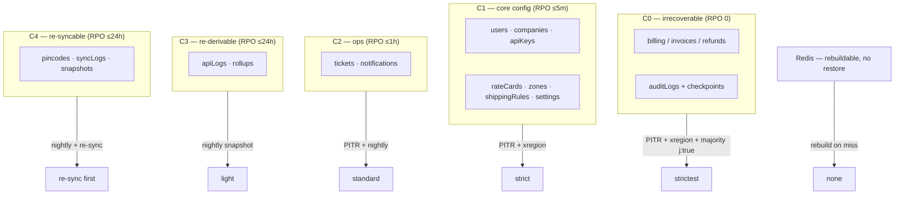
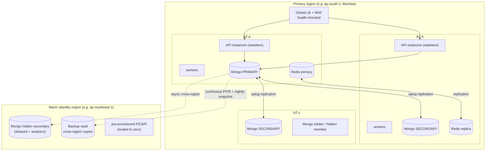
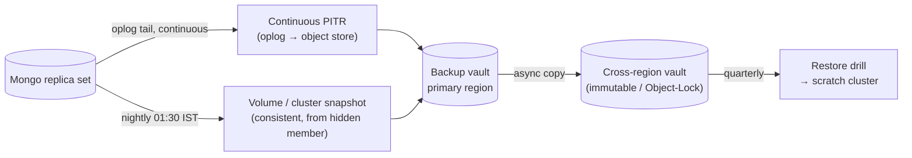
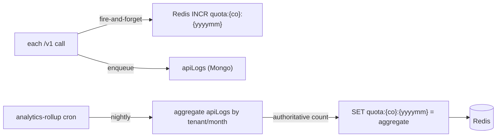
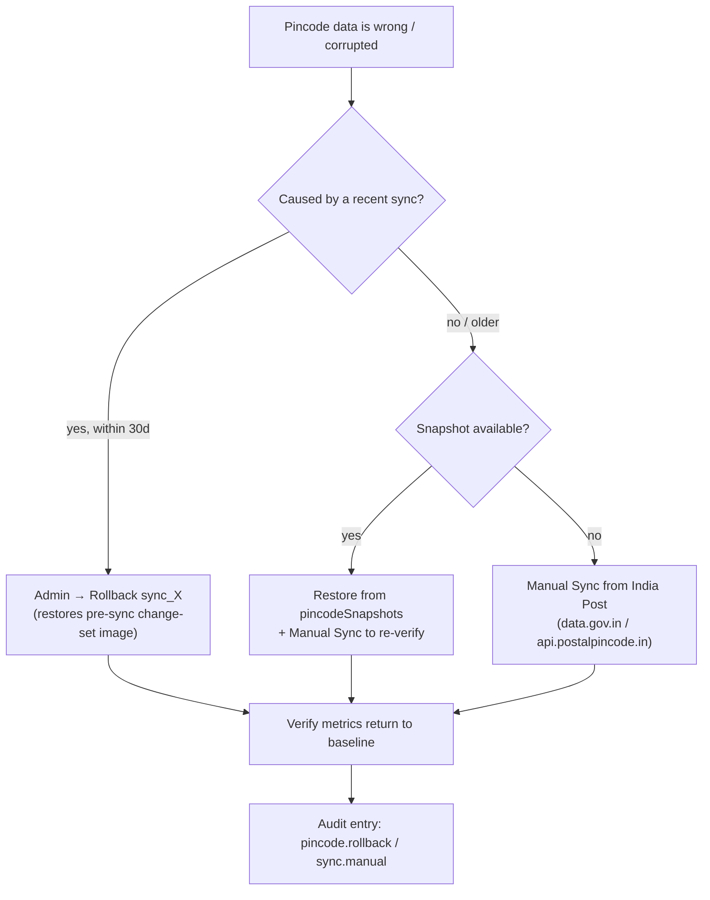
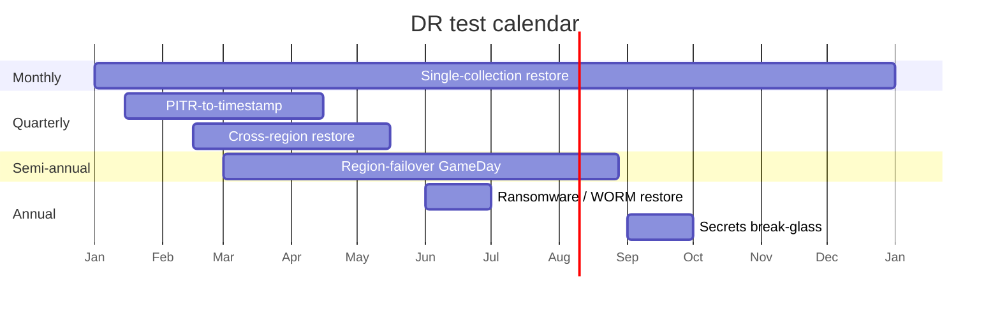

# Backup & Disaster Recovery

Postpin is logistics infrastructure: an eCommerce checkout, an ERP, or a courier-management system calls `/v1/rates/calculate` and expects a correct number in under 200 ms — even on the worst day the platform has. This document is the **resilience contract** for that promise. It classifies every kind of data Postpin holds by how catastrophic its loss would be (pincodes can be re-synced from India Post; a refund or an audit entry can *never* be lost), sets explicit **RPO/RTO** targets per class, and specifies the concrete machinery to hit them: MongoDB continuous/point-in-time backups with cross-region copies and tested restores, Redis treated as rebuildable cache, pincode rollback wired to the existing sync snapshot store, region-outage and multi-AZ high-availability topology, named **failure runbooks** (region down, DB corruption, bad pincode sync, key leak, ransomware), a DR-testing cadence with a recovery checklist, and the data retention/deletion policy that bounds what we keep. It is meant to be operated from directly.

## Contents

- [1. Principles](#1-principles)
- [2. Data Classes & RPO/RTO Targets](#2-data-classes--rporto-targets)
- [3. High Availability (Multi-AZ, Replica Sets, Failover)](#3-high-availability-multi-az-replica-sets-failover)
- [4. MongoDB Backup Strategy](#4-mongodb-backup-strategy)
- [5. Redis Persistence & Rebuild](#5-redis-persistence--rebuild)
- [6. Pincode Rollback & Sync Snapshots](#6-pincode-rollback--sync-snapshots)
- [7. Object Storage, Secrets & Config Backup](#7-object-storage-secrets--config-backup)
- [8. Failure Scenarios & Runbooks](#8-failure-scenarios--runbooks)
- [9. DR Testing Cadence](#9-dr-testing-cadence)
- [10. Recovery Checklist](#10-recovery-checklist)
- [11. Data Retention & Deletion Policy](#11-data-retention--deletion-policy)
- [12. Business Continuity](#12-business-continuity)
- [13. Backup Catalog & Schemas](#13-backup-catalog--schemas)
- [14. Implementation Checklist](#14-implementation-checklist)
- [15. Cross-references](#15-cross-references)

---

## 1. Principles

Five rules govern every decision below.

1. **Classify by recoverability, not by table.** The question is never "is this important?" — everything is important — but "**if we lost the last hour of this, could we reconstruct it from another source?**" Pincodes can be re-fetched from India Post; an `apiLog` row can be re-derived from billing reconciliation; a `refund.issued` audit entry or a paid invoice **cannot** be reconstructed from anywhere. Backup spend and RPO follow that gradient.
2. **The hot path survives the data plane degrading.** A rate quote reads pincodes/zones/rate-cards (Redis-first, Mongo fallback) and writes nothing synchronously (see [Architecture §6](01-architecture.md)). A Redis flush, a Mongo failover, or India Post being down must **not** stop quotes. Backup/DR design preserves this invariant.
3. **Redis is rebuildable; Mongo is the system of record.** No money, quota truth, or audit fact lives *only* in Redis. Counters reconcile to Mongo nightly, so a Redis loss is a performance event, not a data-loss event.
4. **Money and evidence are write-once and replicated synchronously.** Billing writes (invoices, refunds, plan changes) and `auditLogs` use majority write-concern and are the first things a failover must not drop. Audit additionally carries its own tamper-evidence (hash chain + WORM anchor; see [Observability & Audit](12-observability-and-audit.md)).
5. **A backup you have never restored is a hope, not a backup.** Every backup class has a *named restore drill* and a *cadence* in [§9](#9-dr-testing-cadence). RTO is measured against the last successful drill, not against the theoretical capability.

---

## 2. Data Classes & RPO/RTO Targets

**RPO** (Recovery Point Objective) = maximum acceptable data loss, measured in time. **RTO** (Recovery Time Objective) = maximum acceptable time to restore service. We define five classes; each maps to a backup mechanism and a tier.

| Class | Examples (collections) | Reconstructable from? | **RPO** | **RTO** | Backup mechanism | Write concern |
|---|---|---|---|---|---|---|
| **C0 — Critical / irrecoverable** | `subscriptions`, `plans`, invoices, `coupons` usage, `auditLogs`, `auditCheckpoints` | **Nothing** — money & legal evidence | **0** (zero loss) | **≤ 30 min** | Synchronous replica majority + continuous oplog PITR + cross-region | `majority`, `j:true` |
| **C1 — Core tenant config** | `users`, `roles`, `permissions`, `companies`, `apiKeys`, `rateCards`, `shippingRules`, `zones`, `webhooks`, `settings` | Painful manual re-entry by customers | **≤ 5 min** | **≤ 1 h** | Continuous oplog PITR + cross-region | `majority` |
| **C2 — Operational records** | `tickets`, `ticketReplies`, `notifications` | Partially (email trails) | **≤ 1 h** | **≤ 4 h** | PITR (best-effort) + nightly snapshot | `majority` |
| **C3 — Re-derivable analytics** | `apiLogs`, usage rollups | Yes — re-aggregate from raw logs / billing reconciliation | **≤ 24 h** | **≤ 24 h** (degraded charts OK) | Nightly snapshot only; TTL-pruned anyway | default |
| **C4 — Re-syncable reference** | `pincodes`, `pincodeSyncLogs`, `pincodeSnapshots` | **Yes — re-sync from India Post** (`data.gov.in` / `api.postalpincode.in`) | **≤ 24 h** (one sync cycle) | **≤ 6 h** (or next nightly sync) | Nightly snapshot + on-demand re-sync | default |
| **Cache** | Redis: hot pincode/rate-card cache, rate-limit buckets, idempotency, locks, quota counters | Yes — rebuilt on miss; counters reconciled from Mongo | **N/A** (ephemeral) | **0** (degrade, don't restore) | None — rebuild, never restore | n/a |



### Why pincodes are C4, not C0

A single `pincodes` document loss is recoverable in two independent ways: (a) restore the pre-sync image from `pincodeSnapshots` (see [§6](#6-pincode-rollback--sync-snapshots)), or (b) run a Manual Sync to re-fetch the authoritative directory from India Post. The dataset is *public and re-fetchable*, so paying for zero-RPO continuous backup of 155k reference rows is wasted money. We still snapshot nightly for fast local restore, but the real recovery story is **re-sync**. Contrast with `auditLogs`: there is no India Post for "who issued this refund."

### Quote-availability target (separate from data RTO)

Data RTO is "how long until the dataset is whole again." **Quote availability** is "how long until `/v1/rates/calculate` answers again," and it is far tighter because of Principle 2:

| Metric | Target | How |
|---|---|---|
| Quote endpoint availability | **99.95%** monthly | Multi-AZ stateless API, Redis-first reads, no synchronous writes |
| Quote RTO on single-AZ loss | **0** (no interruption) | Other AZs absorb traffic; replica set has members in surviving AZs |
| Quote RTO on full-region loss | **≤ 30 min** | Promote warm standby region (see [§3](#3-high-availability-multi-az-replica-sets-failover) / [§8.1](#81-region-outage)) |

---

## 3. High Availability (Multi-AZ, Replica Sets, Failover)

HA is the first line of defense — most "disasters" are single-component failures that HA absorbs with zero data loss and no human in the loop. DR (restore from backup) is only for events HA cannot survive.

### 3.1 Topology



### 3.2 MongoDB replica set

- **5 voting members minimum across 3 AZs**: `PRIMARY` + 2 data-bearing `SECONDARY` in the primary region across distinct AZs, 1 hidden/delayed member, and a cross-region hidden secondary (also the backup source so backups never load the primary). This survives the loss of any single AZ with automatic election and **no data loss** for `majority`-written data.
- **Write concern by class:** C0 writes use `{ w: "majority", j: true }` (acknowledged only after the journal is durable on a majority) — a refund is never "lost in flight." C1/C2 use `{ w: "majority" }`. C3 may use default for throughput.
- **Read concern:** the quote hot path reads pincodes/zones/rate-cards from Redis first and tolerates `readPreference: secondaryPreferred` on Mongo fallback (slightly stale pincode data is acceptable; a quote is allowed to use last-good reference data). Billing reads use `primary`/`majority` read concern.
- **Failover behavior:** election completes in ~10–15 s; the driver retries writes (`retryWrites: true`) so most in-flight C0/C1 writes survive a primary step-down transparently. Quotes are unaffected (they aren't writing synchronously).
- **Hidden delayed member (1 h lag):** guards against *logical* corruption — a bad migration or a fat-fingered mass update has a one-hour window to be caught before the delayed member also applies it, giving an instant "rewind to 1 h ago" source for a single collection.

### 3.3 Redis HA

- Primary + replica across AZs with automatic failover (Sentinel or managed equivalent). A Redis failover is invisible to quotes beyond a sub-second blip, because reads fall through to Mongo and back-fill, and rate-limiting **fails open** to a tighter Mongo-backed cap (see [API Keys & Rate Limiting](07-api-keys-and-rate-limiting.md)).
- Redis is **not** part of the restore path. On total Redis loss we rebuild (see [§5](#5-redis-persistence--rebuild)), we never "restore Redis from backup" as a recovery step on the critical path.

### 3.4 Stateless app tier

API and worker instances hold **no durable state** — every instance is interchangeable. HA here is: ≥ 2 instances per AZ behind the LB, health checks (`/healthz` shallow, `/readyz` checks Mongo+Redis reachability), rolling deploys, and the LB evicting unhealthy nodes. Workers are idempotent and jobs are durable in Redis/BullMQ, so a worker crash loses no work — the job is retried.

---

## 4. MongoDB Backup Strategy

MongoDB is the system of record; its backup strategy must satisfy the strictest class it holds (C0, RPO 0). We run **three layers** simultaneously.



### 4.1 Layer 1 — Continuous / point-in-time (PITR)

- **Mechanism:** continuously tail and ship the **oplog** to object storage (managed Atlas Continuous Backup / Cloud Manager, or self-managed `mongodump --oplog` + oplog streaming). Combined with periodic base snapshots this allows restore to **any second** within the retention window.
- **Granularity:** restore to a specific timestamp (e.g. "01:12:43 IST, just before the bad migration ran") — essential for the [DB-corruption runbook](#82-database-corruption--logical-data-loss).
- **PITR retention window:** **7 days** of second-level PITR. Older recovery points fall back to daily snapshots.
- **This is what delivers RPO 0/≤5m for C0/C1:** the oplog is shipped within seconds, so the recoverable point is essentially "now minus a few seconds."

### 4.2 Layer 2 — Snapshots (cadence)

Consistent snapshots taken **from the hidden/cross-region secondary** so production primary load is never affected.

| Snapshot | Cadence | Retention | Source | Notes |
|---|---|---|---|---|
| Hourly incremental | every 1 h | 48 h | hidden secondary | cheap, fast restore points for C1/C2 |
| Nightly full | 01:30 IST (after sync settles) | 30 days | cross-region secondary | the workhorse; consistent cluster snapshot |
| Weekly full | Sunday 02:00 IST | 12 weeks | cross-region secondary | medium-horizon recovery |
| Monthly full | 1st of month | 12 months | cross-region secondary | compliance / long restore |
| Yearly full | Jan 1 | 7 years | cold tier (Glacier-class) | matches longest audit retention |

> Nightly snapshot runs **after** the 00:30 pincode sync (see [Pincode Management](03-pincode-management.md)) has settled, so the snapshot captures a coherent post-sync state and the day's `pincodeSyncLogs`/`pincodeSnapshots`.

### 4.3 Layer 3 — Cross-region copies

- Every snapshot **and** the PITR oplog stream is asynchronously copied to a **second geographic region**. This is what makes [§8.1 region outage](#81-region-outage) survivable.
- Cross-region copies land in an **immutable / Object-Lock (WORM)** bucket with a retention lock — this is the ransomware defense (see [§8.5](#85-ransomware--malicious-insider)): even a compromised admin credential cannot delete or overwrite a locked backup before its retention expires.
- **3-2-1 rule satisfied:** ≥ 3 copies (primary cluster + same-region vault + cross-region vault), 2 storage media/services, 1 off-region immutable copy.

### 4.4 Backup integrity & encryption

- All backups **encrypted at rest** (provider KMS, separate key per environment) and **in transit** (TLS).
- Every backup artifact records a **manifest** (`{backupId, type, ts, sizeBytes, collections, sha256, sourceMember, region}`) — see [§13](#13-backup-catalog--schemas). The manifest checksum is verified on copy and on restore.
- **A backup that fails its checksum or its post-write smoke check is marked `invalid` and pages on-call** — we never let a silently-corrupt backup masquerade as a recovery point.

### 4.5 Restore mechanics

| Restore type | Use | Procedure | Typical time (full prod size) |
|---|---|---|---|
| **PITR to timestamp** | Undo a bad migration / corruption | Provision new cluster, restore base snapshot ≤ T, replay oplog to exact T | 20–60 min |
| **Single-collection restore** | One collection corrupted/dropped | Restore that collection from snapshot/delayed member into a scratch DB, validate, `$merge`/swap | 5–20 min |
| **Full cluster restore (same region)** | Catastrophic primary-region cluster loss | Restore latest snapshot + PITR oplog onto a fresh cluster, repoint app | ≤ 1 h |
| **Cross-region restore** | Region outage | Promote cross-region secondary OR restore cross-region copy in DR region | ≤ 30 min (promote) / ≤ 1 h (restore) |

**Golden rule: never restore in place over the live cluster.** Always restore to a *new* cluster/namespace, validate against a checklist ([§10](#10-recovery-checklist)), then cut traffic over. In-place restores destroy the evidence you need if the restore itself is wrong.

---

## 5. Redis Persistence & Rebuild

Redis is **rebuildable cache + ephemeral counters**, never a system of record (Principle 3). The backup posture reflects that.

### 5.1 What Redis holds and how each survives loss

| Use | Key pattern | On total Redis loss | Truth source for rebuild |
|---|---|---|---|
| Hot pincode lookup | `pin:{pincode}` | Cache miss → Mongo → back-fill | `pincodes` (Mongo) |
| Hot rate card | `rc:{companyId}:active` | Cache miss → Mongo → back-fill | `rateCards` (Mongo) |
| Rate-limit bucket | `rl:{keyId}` | Counters reset to 0 → brief over-permissive window | Acceptable; new window starts |
| Monthly quota counter | `quota:{companyId}:{yyyymm}` | **Reconcile from Mongo** | `apiLogs` aggregate / billing rollup |
| Idempotency cache | `idem:{keyId}:{idemKey}` | Lost → a retried request may recompute (still correct, just recomputed) | n/a (quotes are pure functions) |
| Sync distributed lock | `lock:pincode-sync` | Lost → janitor re-establishes; lock TTL prevents double-run | n/a |
| Session/refresh denylist | `revoked:{jti}` | Lost → a revoked token could be briefly accepted | Mitigated by short access-JWT TTL (~15 min) |

### 5.2 Persistence configuration (defense, not the plan)

Even though we rebuild rather than restore, we enable persistence so a *graceful* restart (deploy, failover) doesn't cold-start an empty cache and stampede Mongo:

- **AOF (`appendonly yes`, `appendfsync everysec`)** as the primary persistence — at most ~1 s of cache writes lost on crash, which is irrelevant for a cache.
- **RDB snapshots** hourly as a fast warm-start image.
- Persistence files live on the Redis node only; they are **not** part of the DR backup vault. We do not pay to cross-region Redis dumps.

### 5.3 Quota reconciliation (the one number that must be right)

The only Redis value with billing consequence is the monthly quota counter. It is **authoritatively reconcilable** from Mongo:



So a Redis flush at 14:00 loses *nothing billable*: the next nightly rollup recomputes the true month-to-date count from `apiLogs` and re-seeds the counter. Until then, the in-memory counter restarts from the last reconciled value (we persist a `quota:{co}:{yyyymm}:reconciled` floor) so a tenant is never *under*-counted into free overage. See [Billing & Subscriptions](06-billing-and-subscriptions.md).

### 5.4 Rebuild procedure (runbook fragment)

1. Confirm Mongo is healthy (Redis rebuild reads from Mongo — never rebuild Redis if Mongo is the one that's down).
2. Start the new/empty Redis; verify the app's Redis-miss → Mongo-fallback path is serving quotes (it should already be; this is why quotes never stopped).
3. **Warm critical keys** with the warmer job: top-N pincodes by traffic and all active rate cards (`rc:*`) so the first wave of real traffic hits a warm cache, not a Mongo stampede.
4. Run quota reconciliation immediately (don't wait for the nightly) to restore counters.
5. Re-establish locks/denylists lazily (they self-heal).

---

## 6. Pincode Rollback & Sync Snapshots

Pincode recovery is special: it has a **purpose-built, already-specified rollback** that is faster and more precise than a database restore, because the sync pipeline snapshots itself before every mutation (see [Pincode Management §7](03-pincode-management.md)). DR for pincodes therefore **prefers rollback/re-sync over Mongo restore.**

### 6.1 The recovery hierarchy for pincodes



**Order of preference, fastest first:**

1. **Sync rollback** — if a specific `syncId` introduced bad data and it's within the snapshot-retention window (default 30 days), one-click Rollback restores the captured pre-sync image of exactly the touched records. This is the common case and takes seconds to minutes; untouched records are never disturbed. It is itself locked, logged, and snapshotted (it's a sync-class operation), so it is auditable and re-revertible.
2. **Snapshot restore** — restore the `pincodeSnapshots` entry for a chosen date, then run a Manual Sync to re-verify against the live directory.
3. **Full re-sync** — when no snapshot covers the needed point (older than retention), trigger a Manual Sync to re-fetch the authoritative full directory from India Post and rebuild. Slower (one full directory pull + diff) but always available because the source is public. This is precisely why pincodes are class C4 — the source of truth is *external and re-fetchable*.
4. **Mongo PITR** — last resort, only if the entire `pincodes` collection is gone *and* India Post is also unreachable. Almost never needed.

### 6.2 Cache coherency after pincode recovery

Any pincode recovery (rollback, snapshot restore, re-sync) **must invalidate the Redis hot cache** for affected pincodes (`DEL pin:{pincode}` for the touched set, or flush the `pin:*` namespace for a full rebuild) so quotes stop serving stale cached values. The sync/rollback worker already emits these invalidations; a manual Mongo restore of `pincodes` must additionally trigger a `pin:*` flush + warm.

### 6.3 What rollback does **not** cover

Rollback reverts pincode *reference* data. It does **not** retroactively change quotes already returned to customers (those were correct given the data at the time and may already be on a shipping label). If a bad pincode sync produced wrong quotes during a window, that is a *commercial* incident handled by billing/credits — not something the data rollback "fixes." The audit trail (`pincode.rollback` with the window) is the record for that conversation.

---

## 7. Object Storage, Secrets & Config Backup

Not everything lives in Mongo/Redis. These also need a recovery story.

| Asset | Where | Backup / recovery | RPO | RTO |
|---|---|---|---|---|
| Audit cold archive (NDJSON) | S3 + Object-Lock (WORM) | Versioned + replicated to second region; WORM prevents deletion | 0 | ≤ 1 h |
| Audit checkpoints / WORM anchors | `auditCheckpoints` + external WORM bucket | Immutable; replicated | 0 | ≤ 1 h |
| CSV exports / invoices (PDF) | Object storage | Versioned; re-generatable from Mongo if lost | ≤ 24 h | re-generate |
| Pincode snapshots blobs | Object storage (gzip) | Replicated cross-region | ≤ 24 h | ≤ 6 h |
| **Secrets** (Mongo URI, Redis URL, JWT keys, India Post key, payment keys, webhook signing) | Secrets manager / Vault | Versioned in the secrets manager + an **encrypted, offline break-glass copy** in a separate vault/region | 0 | ≤ 30 min |
| **Settings** collection (operator-tunable: sync endpoint/time/retry, GST toggle, surcharges) | Mongo `settings` | Covered by Mongo PITR; also exported to config-as-code nightly for human-readable diff/restore | ≤ 5 min | ≤ 1 h |
| **Infrastructure** (clusters, LB, DNS, queues) | Terraform / IaC in Git | Versioned in Git; DR region pre-provisioned via the same IaC | n/a | ≤ 30 min to apply |

**Secrets are the silent single point of failure.** A perfect Mongo restore is useless if you cannot reach the secrets to connect to it. The break-glass secret copy (encrypted, offline, separately custodied, rotation-tracked) is mandatory and is itself rotated and tested in the DR drill.

---

## 8. Failure Scenarios & Runbooks

Each runbook lists **detection**, **immediate action**, **recovery**, and **comms**. Severity uses the platform's incident scale (SEV1 = customer-facing outage / data risk). Every runbook ends with a post-incident audit entry and a blameless review.

### 8.1 Region outage

**Scenario:** the entire primary region is unreachable (provider AZ-wide failure, network partition).

| Phase | Action |
|---|---|
| **Detect** | LB health checks fail across all AZs; external uptime monitor (separate provider) pages; Mongo primary unreachable from app tier. |
| **Decide** | Incident commander declares SEV1 and a **region failover** if the outage is expected > 15 min (don't fail over for a 2-minute blip — failover has its own cost). |
| **Recover** | 1) Promote the **cross-region hidden secondary** to a standalone/primary in the DR region (or restore the latest cross-region snapshot + PITR if promotion isn't possible). 2) Scale up the pre-provisioned DR-region API/worker tier (IaC apply, scaled-from-zero). 3) Stand up a fresh Redis in DR (empty — rebuilds on traffic) and run the **warmer** + **quota reconcile**. 4) Repoint DNS / global LB to the DR region (low-TTL records, ≤ 60 s). |
| **Verify** | `/v1/rates/calculate` smoke test from external prober; billing read/write smoke test; audit chain head verifies; [recovery checklist §10](#10-recovery-checklist). |
| **Comms** | Status page → "Investigating" within 5 min, "Identified" on declare, updates every 30 min; customer email if RTO > 1 h. |
| **Targets** | Quote RTO ≤ 30 min; C0/C1 RPO ≤ 5 min (cross-region async lag); no C0 loss if the failed region's last oplog shipped. |

**Failback:** when the primary region returns, re-sync data *from* DR back to primary, validate, then cut back during a low-traffic window. Never auto-failback — it's a deliberate, verified operation.

### 8.2 Database corruption / logical data loss

**Scenario:** a bad migration, application bug, or fat-fingered mass `updateMany`/`deleteMany` corrupts or deletes good data on the live primary (which replicates the damage to all secondaries).

| Phase | Action |
|---|---|
| **Detect** | Validation alerts (row-count anomaly, schema-validator rejects spike), customer reports, audit diff showing an unexpected mass change, integrity check failure. |
| **Contain** | **Immediately freeze the offending write path** (feature-flag off / revoke the migration job) so corruption stops spreading. Identify the **exact timestamp T** the bad change began (from `auditLogs` / deploy log / oplog). |
| **Recover** | Prefer the **narrowest** fix: (a) if one collection and recent → restore that collection from the **1 h delayed hidden member** or a snapshot into a scratch DB, validate, then swap/merge; (b) otherwise **PITR to T-ε** into a *new* cluster, extract the affected collections, merge back. **Never** PITR-restore the whole live cluster over good data written after T (you'd lose legitimate post-T writes — reconcile instead). |
| **Verify** | Row counts, spot-check known records, run integrity/audit-chain verify, diff against the delayed member. |
| **Comms** | SEV1/SEV2 depending on blast radius; status page if customer-visible. |
| **Targets** | Pincodes: prefer rollback ([§6](#6-pincode-rollback--sync-snapshots)). C0/C1: PITR RPO ≤ 5 min, RTO ≤ 1 h. |

### 8.3 Bad pincode sync

**Scenario:** the 00:30 sync ingested a malformed/truncated India Post dump and pushed wrong data live (e.g. mass "non-deliverable", wrong circles, deleted valid PINs).

This is the **best-rehearsed** failure because the pincode module is built for it (see [Pincode Management](03-pincode-management.md)).

| Phase | Action |
|---|---|
| **Detect** | Sync guardrails fire automatically: `scanned < minSnapshotRows` (truncated-dump guard), abnormal delete/update ratio, serviceability drop alarm, or customer reports of "not serviceable" for known-good PINs. |
| **Contain** | The guardrails usually **abort before mutation** (data untouched → nothing to recover). If a bad run *did* apply: turn **auto-sync OFF** in Super Admin to stop the next cycle from re-applying. |
| **Recover** | **Rollback `sync_X`** (one click) — restores the captured pre-sync image of touched records, invalidates `pin:*` cache, writes a `pincode.rollback` audit entry. If outside the snapshot window, run a **Manual Sync** from a known-good source/time. |
| **Verify** | Total/serviceable pincode counts return to baseline; spot-check the PINs customers reported; quote a few known routes. |
| **Comms** | Usually no customer comms (caught fast, quotes used last-good cached data for the affected window). If quotes were wrong: billing/credits conversation per [§6.3](#63-what-rollback-does-not-cover). |
| **Targets** | RTO ≤ 6 h (usually minutes); RPO = the sync cycle (re-syncable). |

### 8.4 API key leak / credential compromise

**Scenario:** a customer's `pk_live_…` key (or an internal secret) is leaked (committed to a public repo, found in logs, reported by the customer).

| Phase | Action |
|---|---|
| **Detect** | Secret-scanning alert (GitHub push protection / scanner), anomalous traffic on a key (new IPs/geos, quota spike), customer report. |
| **Contain** | **Revoke the key immediately** (status → revoked; key hash lookup now 401s; see [API Keys & Rate Limiting](07-api-keys-and-rate-limiting.md)). For internal secrets, **rotate** via the secrets manager using overlapping `kid` (zero-downtime) and invalidate sessions/denylist affected JWTs. |
| **Recover** | Issue the customer a replacement key (reveal-once); they update their integration. Review `apiLogs` for the abuse window; refund/credit any fraudulent overage. If JWT signing key leaked → rotate `kid`, force re-auth (denylist active refresh tokens). |
| **Verify** | Old key returns 401; no further traffic on it; new key works; audit entries `apikey.deleted`/`apikey.rotated` present. |
| **Comms** | Notify the affected customer with timeline and remediation; if our secret leaked, internal security incident + possible disclosure. |
| **Targets** | Containment ≤ 15 min from detection. **No restore needed** — this is a rotation/revocation incident, not a data-loss one. |

> A key leak is a security incident, not a backup incident — but it lives here because operators reach for the runbook index during any "something's wrong" page. The data itself was never lost.

### 8.5 Ransomware / malicious insider

**Scenario:** an attacker (or a compromised credential) encrypts or deletes production data and/or backups, or a malicious insider mass-deletes.

This is the scenario the **immutable cross-region backups exist for.**

| Phase | Action |
|---|---|
| **Detect** | Mass-encryption/deletion patterns, integrity-check failures, audit-chain `BROKEN_LINK`/`TAMPERED`/`CHECKPOINT_MISMATCH`, backup-deletion attempts on the WORM vault (which fail, but alert). |
| **Contain** | **Isolate**: revoke all credentials, rotate every secret, cut external network access to the data plane, freeze the LB. Preserve evidence (don't wipe — you may need forensics). |
| **Recover** | Restore from the **immutable / Object-Lock cross-region backup** that the attacker *could not* delete or encrypt (WORM retention lock). Choose a recovery point **before** the earliest sign of compromise (use audit-chain checkpoints to bound it). Rebuild app/infra from IaC into a **clean** environment, not the compromised one. Re-key everything. |
| **Verify** | Audit chain verifies from genesis; backup manifest checksums match; no attacker persistence in the rebuilt environment; full [§10 checklist](#10-recovery-checklist). |
| **Comms** | SEV1 security incident; legal/regulatory notification as required (India DPDP Act / contractual); customer disclosure per policy. |
| **Targets** | RPO = last clean immutable backup before compromise (could be hours, accepted trade-off for guaranteed-clean data); RTO ≤ 4 h to a clean environment. |

**Why WORM is non-negotiable:** ordinary backups an admin can delete are useless against ransomware — the attacker deletes them first. Object-Lock with a retention period the *admin role cannot override* guarantees a recovery point survives a total credential compromise.

### 8.6 Quick failure → action index

| Symptom | Runbook | First move |
|---|---|---|
| Whole region down | [§8.1](#81-region-outage) | Declare SEV1, promote DR region |
| Mass bad data on live DB | [§8.2](#82-database-corruption--logical-data-loss) | Freeze write path, find T, PITR to scratch |
| PINs wrong after sync | [§8.3](#83-bad-pincode-sync) | Auto-sync OFF, Rollback sync_X |
| Leaked API key/secret | [§8.4](#84-api-key-leak--credential-compromise) | Revoke/rotate immediately |
| Data encrypted/deleted maliciously | [§8.5](#85-ransomware--malicious-insider) | Isolate, restore from WORM copy |
| Redis down/flushed | [§5.4](#54-rebuild-procedure-runbook-fragment) | Rebuild + reconcile (quotes already fine) |
| Single AZ lost | [§3](#3-high-availability-multi-az-replica-sets-failover) | None — HA absorbs it automatically |

---

## 9. DR Testing Cadence

A backup is unproven until restored; an RTO is fiction until measured. We test on a fixed cadence and record results.

| Test | Cadence | Scope | Pass criteria |
|---|---|---|---|
| **Backup integrity check** | every backup (automated) | Manifest checksum + restore-to-scratch smoke of a sample | Checksum matches; smoke query returns expected rows |
| **Single-collection restore drill** | monthly | Restore one C0/C1 collection from latest snapshot to scratch | Restored, validated, time recorded < RTO |
| **PITR-to-timestamp drill** | quarterly | Restore prod-scale to a chosen T into a scratch cluster | Exact T data present; post-T absent; time < 1 h |
| **Cross-region restore drill** | quarterly | Restore cross-region copy in DR region | Cluster up in DR, app connects, quote smoke passes |
| **Full region-failover GameDay** | semi-annually | Simulated region outage end-to-end ([§8.1](#81-region-outage)) | Quote RTO ≤ 30 min met with real timing; failback verified |
| **Ransomware/WORM restore drill** | annually | Restore from immutable copy into a clean environment | Recovery from WORM-only source succeeds; chain verifies |
| **Secrets break-glass drill** | annually | Recover prod connectivity using only the offline secret copy | Connect to restored cluster using break-glass secrets |
| **Audit-chain verification** | nightly (automated) | Recompute hash chain vs checkpoints | `OK`; any break pages immediately |

**Rules for drills:** every drill writes a record (`drillId`, type, timestamp, measured RTO, RPO achieved, pass/fail, issues, owner). A **failed or missed drill is a SEV3 that blocks the next release train** until resolved — backups silently rotting is itself an incident. Drills run against **isolated scratch infrastructure**, never production, and tear down after.



---

## 10. Recovery Checklist

A single, copy-pasteable checklist the incident commander drives during any restore. **Do not skip steps; do not restore in place.**

```text
PHASE 0 — DECLARE
[ ] Incident declared, severity set, IC + scribe assigned
[ ] Status page updated ("Investigating")
[ ] Blast radius identified: which data classes (C0–C4), which tenants

PHASE 1 — STABILIZE
[ ] Stop the bleeding: freeze the offending write path / revoke creds / auto-sync OFF
[ ] Confirm quotes still serving (Redis-first path) — if not, escalate that first
[ ] Identify exact recovery point T (audit log / deploy log / oplog)

PHASE 2 — SELECT SOURCE
[ ] Choose recovery method (rollback > re-sync > delayed member > snapshot > PITR > cross-region)
[ ] Verify chosen backup's manifest checksum
[ ] Confirm it predates the corruption/compromise window

PHASE 3 — RESTORE (to NEW infra, never in place)
[ ] Provision scratch/target cluster (or promote DR secondary)
[ ] Restore snapshot + replay PITR oplog to T  (or apply rollback)
[ ] Restore/rotate secrets needed to connect

PHASE 4 — VALIDATE (before any traffic)
[ ] Row counts within expected bounds per collection
[ ] Spot-check 5+ known records (a real invoice, a known rate card, a known PIN)
[ ] Audit hash chain verifies from genesis / last checkpoint
[ ] Quote smoke test (3 known routes) returns correct, expected totals
[ ] Billing read+write smoke test (create + read a test invoice in scratch)
[ ] Redis warmed + quota reconciled

PHASE 5 — CUT OVER
[ ] Repoint app/DNS/LB to restored cluster (low TTL)
[ ] Watch error rate, latency, quote success for 15 min
[ ] Reconcile any writes that occurred after T (don't silently drop them)

PHASE 6 — CLOSE
[ ] Status page "Resolved"; customer comms if applicable
[ ] Write post-incident audit entry (action, T, method, data classes, RPO/RTO achieved)
[ ] Schedule blameless post-mortem; file follow-up actions
[ ] Tear down scratch infra
```

---

## 11. Data Retention & Deletion Policy

Retention bounds what we back up and how long; deletion (and its auditing) is itself a recovery-relevant operation. Backups inherit the retention of the longest-lived class they contain.

### 11.1 Retention by collection

| Collection / data | Hot retention | Cold / archive | Total | Driver |
|---|---|---|---|---|
| `auditLogs` (+ checkpoints) | 1 year | up to 6 years | **1–7 years** (plan-tiered) | Compliance / legal evidence |
| Invoices, `subscriptions`, refunds | active + 8 years | cold | **8 years** | Tax / accounting law (India) |
| `apiLogs` | 90 days hot | rolled to cold then dropped | 90 d hot / 1 y cold | Analytics/billing dispute window |
| `tickets`, `ticketReplies` | 2 years | cold | 2 years | Support history |
| `notifications` | 30 days (TTL) | — | 30 days | Transient UX |
| `pincodes` | live (current) | snapshots 30 days | re-syncable | Reference data |
| `pincodeSyncLogs` | 180 days | — | 180 days | Operational |
| `pincodeSnapshots` | 30 days | — | 30 days | Rollback window |
| `auditLogs` retention-purge | logged via `audit.retention_purged` | — | — | Auditing the deletion itself |

### 11.2 Deletion principles

- **TTL only where safe.** TTL indexes are used for genuinely transient data (`notifications`, `apiLogs` hot tier) — **never** on `auditLogs` or billing (silent TTL deletion of evidence is forbidden; audit pruning goes through the controlled, manifest-writing archival job per [Observability & Audit](12-observability-and-audit.md)).
- **Right-to-erasure (DPDP / GDPR-style).** On a verified erasure request, PII is **pseudonymized** in non-essential fields while the **billing record and audit hash chain are preserved** (lawful-basis exemption). We append an `audit.pii_pseudonymized` entry rather than editing history — the chain stays valid.
- **Tenant deletion** does not delete that tenant's audit/billing records before their `retainUntil`; the deletion event is itself audited. Backups taken before deletion naturally retain the data until they age out per schedule — accepted and documented.
- **Backup expiry honors legal hold.** A legal-hold flag on a tenant/date-range freezes both archival pruning *and* backup expiry for matching data until released.
- **End-of-life deletion is audited.** Both record-level retention purges and **backup-artifact expiry** write an audit/ops record (`backup.expired`, `audit.retention_purged`) so "we no longer have data from before X" is itself an answerable, logged fact.

---

## 12. Business Continuity

Backup/DR keeps the *data* alive; business continuity keeps the *company* able to operate while it happens.

### 12.1 Roles during an incident

| Role | Owner | Responsibility |
|---|---|---|
| **Incident Commander (IC)** | On-call lead | Single decision-maker; declares severity, owns the runbook, calls failover/restore |
| **Operations / SRE** | On-call SRE | Executes restore/failover, infra |
| **Comms lead** | Support/PM | Status page, customer email, internal updates |
| **Scribe** | Anyone free | Timeline of every action + timestamp (feeds the post-mortem and audit) |
| **Exec sponsor** | Eng leadership | External/legal/regulatory decisions for SEV1 |

### 12.2 Degraded-mode operation

The platform is designed to **degrade, not collapse**, so business continues even mid-incident:

| If down | Degraded behavior | Customer impact |
|---|---|---|
| Redis | Mongo fallback + fail-open rate limit | Slightly higher latency; quotes still served |
| India Post | Serve from last-good `pincodes` master | None (sync deferred) |
| Workers/queues | Quotes unaffected; logs/webhooks/emails backlog and drain | Delayed notifications only |
| Payment gateway | Billing off the hot path; reconcile on recovery | Quotes unaffected; invoicing delayed |
| Mongo primary | Auto-failover (~15 s) | Brief write pause; quotes (read) unaffected |
| One region | Failover to DR region | ≤ 30 min quote interruption worst case |

### 12.3 Communication & SLA

- **Status page** (`status.postpin.dev`) hosted **off the primary infrastructure** (separate provider) so it stays up when Postpin is down. Updated within 5 min of any SEV1/SEV2.
- **SLA credits** are governed by [Billing & Subscriptions](06-billing-and-subscriptions.md); a region outage exceeding the quote-availability target triggers automatic credit eligibility review.
- **Customer comms templates** (investigating / identified / monitoring / resolved) are pre-written so the comms lead fills in specifics, not prose, under pressure.
- **Internal escalation tree** and out-of-band contact (phone/Signal) is maintained off-platform — you cannot rely on Postpin's own email/notifications during a Postpin outage.

### 12.4 Dependencies & their continuity

| External dependency | Continuity posture |
|---|---|
| India Post (`data.gov.in`, `api.postalpincode.in`) | Non-critical to hot path; last-good data persists; dual sources |
| Payment gateway (Razorpay/Stripe) | Off hot path; webhooks reconcile; idempotent invoice creation |
| Email/SMS provider | Queued + retried; in-app notifications still delivered |
| Cloud provider | Multi-AZ now; cross-region DR; IaC enables rebuild on a second provider if ever required |
| Secrets manager | Break-glass offline copy ([§7](#7-object-storage-secrets--config-backup)) |

---

## 13. Backup Catalog & Schemas

Backups are themselves tracked records so operators can query "what restore points exist, and are they healthy?" A `backups` operational collection (or the managed provider's catalog, mirrored) holds one document per artifact.

### 13.1 Backup manifest

```json
{
  "_id": "bkp_01HZX9M2N3P4Q5R6S7T8U9V0W1",
  "type": "nightly_full",
  "engine": "mongodb",
  "scope": "cluster",
  "region": "ap-south-1",
  "copies": [
    { "region": "ap-south-1",     "store": "vault-primary",  "immutable": false },
    { "region": "ap-southeast-1", "store": "vault-worm",      "immutable": true, "lockUntil": "2026-07-26T01:30:00Z" }
  ],
  "startedAt": "2026-06-26T01:30:00.000Z",
  "finishedAt": "2026-06-26T01:41:12.880Z",
  "durationMs": 672880,
  "sizeBytes": 48213004112,
  "collections": ["users","companies","subscriptions","invoices","apiKeys","rateCards","zones","pincodes","auditLogs","..."],
  "sourceMember": "rs0-hidden-2",
  "checksum": { "algo": "sha256", "value": "c41d8f...aa" },
  "pitr": { "enabled": true, "oplogFrom": "2026-06-25T01:41:12Z", "oplogTo": "2026-06-26T01:41:12Z" },
  "encryption": { "atRest": "kms:prod/backup", "inTransit": "tls1.3" },
  "verify": { "checksumOk": true, "smokeRestoreOk": true, "verifiedAt": "2026-06-26T02:05:00Z" },
  "retainUntil": "2026-07-26T01:30:00Z",
  "status": "valid"
}
```

### 13.2 Restore / drill record

```json
{
  "_id": "rstr_01HZXA3B4C5D6E7F8G9H0J1K2L",
  "kind": "drill",
  "drillType": "pitr_to_timestamp",
  "trigger": "scheduled",
  "sourceBackupId": "bkp_01HZX9M2N3P4Q5R6S7T8U9V0W1",
  "targetTimestamp": "2026-06-20T11:12:43Z",
  "targetCluster": "scratch-restore-q2",
  "startedAt": "2026-06-26T03:00:00Z",
  "finishedAt": "2026-06-26T03:38:21Z",
  "measuredRtoMs": 2301000,
  "rpoAchievedSec": 3,
  "validation": {
    "rowCountsOk": true,
    "spotCheckOk": true,
    "auditChainOk": true,
    "quoteSmokeOk": true,
    "billingSmokeOk": true
  },
  "result": "pass",
  "issues": [],
  "operator": "usr_sre07",
  "auditEventId": "evt_...."
}
```

### 13.3 RPO/RTO target record (config)

```json
{
  "dataClass": "C0",
  "label": "Critical / irrecoverable",
  "collections": ["subscriptions","plans","invoices","auditLogs","auditCheckpoints"],
  "rpoSeconds": 0,
  "rtoSeconds": 1800,
  "writeConcern": { "w": "majority", "j": true },
  "backup": ["pitr","cross_region","nightly_full"],
  "immutableCopyRequired": true
}
```

---

## 14. Implementation Checklist

- [ ] MongoDB replica set: 5 voting members across 3 AZs + cross-region hidden secondary + 1 h delayed member.
- [ ] Write concern wired per data class (`{w:"majority", j:true}` on C0); `retryWrites: true` on the driver.
- [ ] Continuous PITR (oplog shipping) with 7-day window + base-snapshot cadence (hourly/nightly/weekly/monthly/yearly).
- [ ] Cross-region snapshot + oplog copies into an **immutable / Object-Lock (WORM)** vault with retention locks.
- [ ] Backup manifest + checksum + automated post-write smoke verify; invalid backup pages on-call.
- [ ] Redis: AOF (`everysec`) + hourly RDB; **cache warmer** job; quota **reconcile** job from `apiLogs`.
- [ ] Pincode rollback/snapshot path verified (30-day window) and wired to `pin:*` cache invalidation on any recovery.
- [ ] Secrets: versioned in manager + **encrypted offline break-glass copy** in a separate vault/region.
- [ ] IaC (Terraform) in Git; DR region pre-provisioned and scaled-to-zero; DNS/LB on low TTL.
- [ ] Status page hosted off-primary-infra; pre-written comms templates; off-platform escalation tree.
- [ ] All five runbooks ([§8](#8-failure-scenarios--runbooks)) documented, linked, and rehearsed.
- [ ] DR test calendar ([§9](#9-dr-testing-cadence)) scheduled; drill records (`restores`/`drills`) written; failed/missed drill blocks release.
- [ ] Retention policy enforced per collection; TTL forbidden on `auditLogs`/billing; legal-hold freezes backup expiry.
- [ ] `backups` catalog collection + restore/drill records + RPO/RTO config records (see [§13](#13-backup-catalog--schemas)).
- [ ] Every restore/failover/rollback/backup-expiry writes an audit entry.

---

## 15. Cross-references

| Topic | Document |
|---|---|
| System topology, replica set, hot-path invariants, failure-handling overview | [System Architecture](01-architecture.md) |
| Pincode sync, snapshots, rollback design, sync guardrails, CSV import/export | [Pincode Management](03-pincode-management.md) |
| Quote pipeline, Redis-first reads, last-good serviceability | [Shipping Engine](04-shipping-engine.md) |
| Plans, quotas, overage, invoices, SLA credits, quota reconciliation | [Billing & Subscriptions](06-billing-and-subscriptions.md) |
| API keys, revocation/rotation, rate-limit fail-open | [API Keys & Rate Limiting](07-api-keys-and-rate-limiting.md) |
| Audit immutability, hash chaining, WORM anchoring, retention/archival, PII pseudonymization | [Observability & Audit](12-observability-and-audit.md) |
| Platform vision, design system, collection map | [Overview](00-overview.md) |
