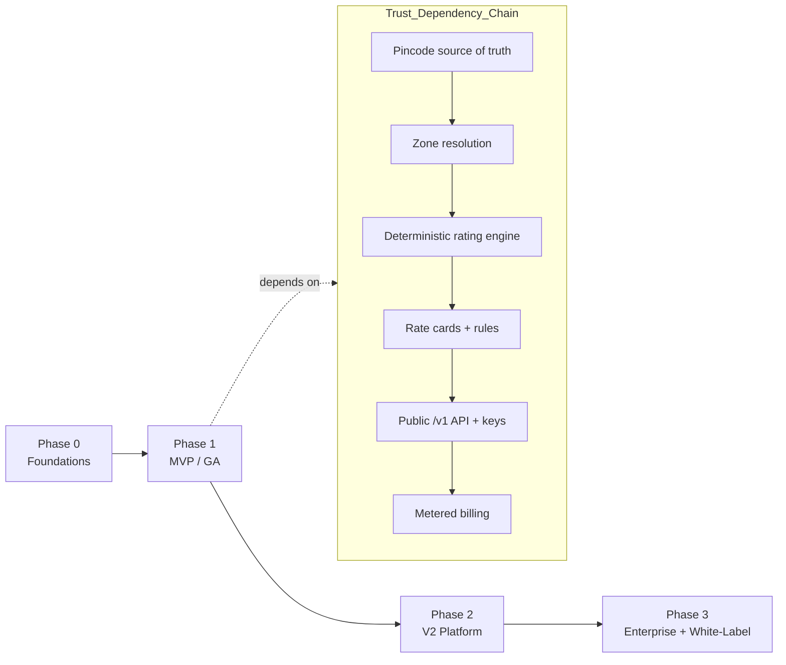
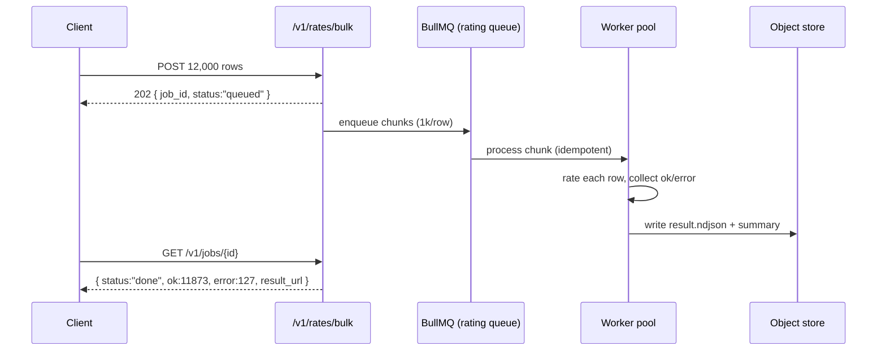
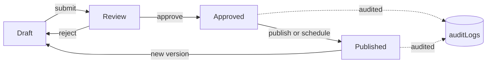
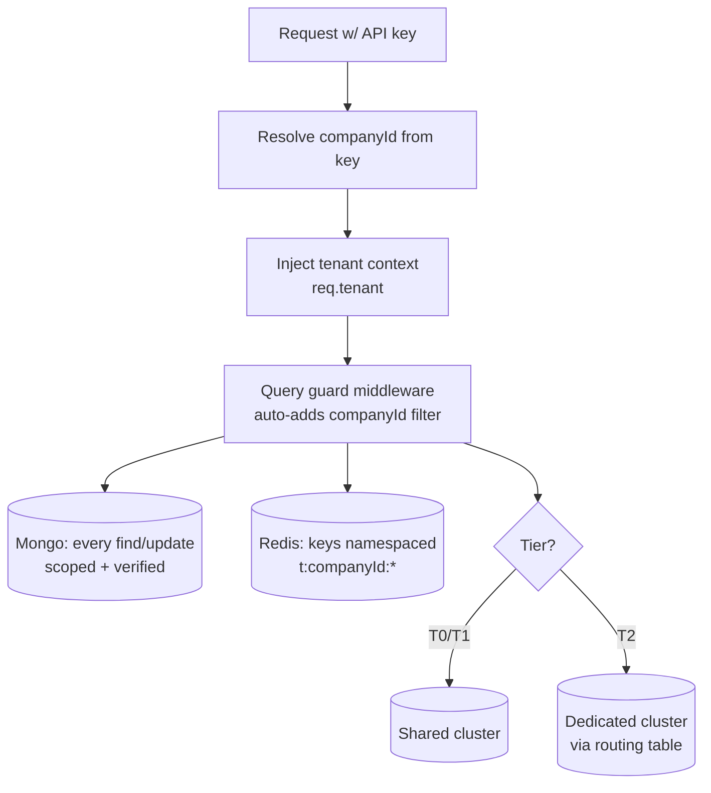
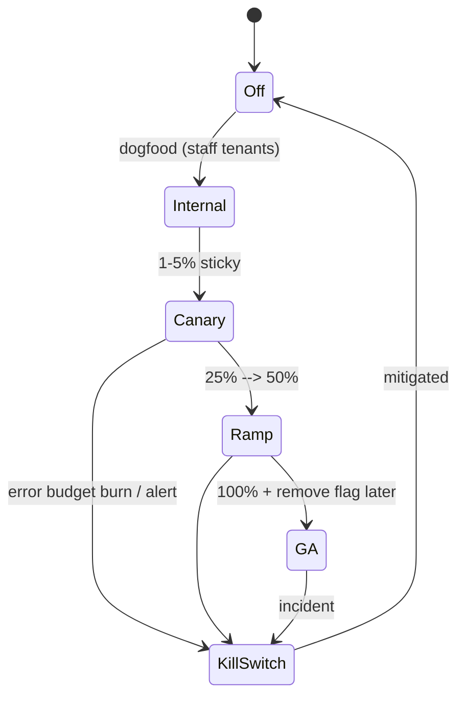
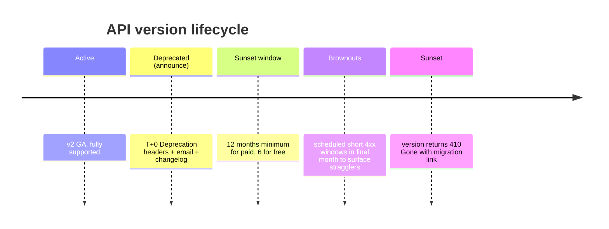

# Roadmap, Enterprise & Extensibility

This document is the productized roadmap for Postpin — the sequence in which we ship a production-grade Shipping Charges API Platform, the line we draw around the launch MVP, and the deliberate path from a single-tenant rating API to an enterprise-grade, white-labelable, multi-courier logistics platform. It defines MVP scope (the must-haves: rating API, nightly India Post pincode sync, API keys, plans/billing, the four dashboards and the docs portal), the V2 surface (bulk rating, multi-courier comparison, label/AWB, address validation, a webhooks marketplace and SDKs), the enterprise tier (SSO/SAML, audit export, dedicated infra, SLA, custom rate-card workflows, sandbox), the white-label capability, a multi-tenant isolation deep-dive (shared → dedicated tiers), a feature-flag and kill-switch model, the API versioning and deprecation policy, build-vs-buy decisions, a four-phase delivery plan (Phase 0..3) with concrete milestones, and the risk register that gates each phase. It is opinionated on sequencing: **nothing ships before the pincode source of truth and the deterministic rating engine are correct**, because every downstream feature inherits their accuracy.

## Contents

- [1. Product Strategy & Sequencing Principles](#1-product-strategy--sequencing-principles)
- [2. MVP Scope (Launch)](#2-mvp-scope-launch)
- [3. V2 Roadmap](#3-v2-roadmap)
- [4. Enterprise Features](#4-enterprise-features)
- [5. White-Label Capability](#5-white-label-capability)
- [6. Multi-Tenant Deep-Dive: Isolation Tiers](#6-multi-tenant-deep-dive-isolation-tiers)
- [7. Feature Flags, Rollout & Kill-Switches](#7-feature-flags-rollout--kill-switches)
- [8. API Versioning Strategy](#8-api-versioning-strategy)
- [9. Build vs Buy](#9-build-vs-buy)
- [10. Phased Delivery Plan (Phase 0..3)](#10-phased-delivery-plan-phase-03)
- [11. Risks & Mitigations](#11-risks--mitigations)
- [12. Definition of Done & Launch Gates](#12-definition-of-done--launch-gates)
- [Related Documents](#related-documents)

---

## 1. Product Strategy & Sequencing Principles

Postpin is logistics **infrastructure**, not a calculator widget. The roadmap is therefore ordered by *trust dependency*, not by visual appeal. A feature ships only when the data and engine it stands on are correct.

| Principle | Consequence for the roadmap |
|---|---|
| **Accuracy is the product.** A wrong zone or ignored volumetric weight silently leaks margin on every order. | The pincode source of truth and the deterministic rating engine are Phase 0/1 and are never "good enough to ship later". They gate everything. |
| **Determinism over features.** Same inputs must always yield the same INR breakdown, replayable from logs. | Rate-card snapshotting, idempotency keys and audit trails are MVP, not V2. See [Rate Card Builder](06-rate-card-builder.md) and [Audit Logs](12-audit-logs.md). |
| **Developer experience is a moat.** We compete with Stripe/Clerk on DX. | Docs portal, sandbox keys, copy-paste snippets and a clean error contract are MVP-blocking, not nice-to-have. |
| **Land single-courier, expand to multi-courier.** | MVP rates one configured rate card per tenant; multi-courier comparison is V2 once the engine, zones and rate cards are proven. |
| **Every new capability is data, not code.** Plans, rules, zones, flags, themes are configurable. | Feature flags and the design-token system are platform primitives introduced early so later features roll out behind switches. |
| **Multi-tenant from line one.** | Even the MVP scopes every collection by `companyId`; we never retrofit tenancy. See [Multi-Tenant Security](02-multi-tenant-security.md). |



**Rule of thumb for "is it MVP?":** if a paying customer cannot get a correct, billed, documented rate without it, it is MVP. If it makes that rate *cheaper to integrate, faster, or comparable across couriers*, it is V2. If it is required to sell to a regulated/large account, it is Enterprise.

---

## 2. MVP Scope (Launch)

The MVP is the smallest product that lets a real Indian D2C brand or ERP integrate, get an accurate billed rate, and pay us — with operators able to run the platform safely. Anything not on this list is explicitly deferred.

### 2.1 MVP feature set (must-have for GA)

| # | Capability | What "done" means at MVP | Spec |
|---|---|---|---|
| 1 | **Rating API** `POST /v1/rates` | Validates key → domain/IP/referer → subscription/quota → rate limit → resolves pincodes → finds zone → computes billable weight `max(actual, L×W×H/5000)` → applies one rate card → COD + remote-area + fuel surcharge → optional 18% GST → itemised JSON. Idempotent, < 50 ms p95. | [Shipping Engine](04-shipping-engine.md) |
| 2 | **Pincode sync** | Nightly 00:30 IST cron against India Post (`api.postalpincode.in` + data.gov.in directory): insert new, update existing, mark removed, write `pincodeSyncLogs`. Manual sync, CSV import/export, rollback, log viewer in Super Admin. Configurable endpoint/time/retries/timeout/auto-sync/notify/webhook. | [Pincode Management](03-pincode-management.md) |
| 3 | **Zone resolution** | Deterministic origin→destination zone mapping (intra-city, intra-state, metro, rest-of-India, special/NE/J&K) backed by pincodes, configurable per tenant. | [Zone Management](05-zone-management.md) |
| 4 | **Rate cards & rules** | Per-tenant slab table (weight slabs, base+increment, zone multipliers), COD %/flat, fuel %, remote-area surcharge, GST toggle. Versioned + snapshotted at request time. | [Rate Card Builder](06-rate-card-builder.md) |
| 5 | **API keys & auth** | `pk_live_`/`pk_test_` keys, scoping by domain/IP/referer/origin, rotation, revocation, last-used, hashed at rest. JWT for dashboard sessions, RBAC. | [API Management](07-api-management.md) |
| 6 | **Plans & billing** | Four India-priced plans (Free, Starter, Growth, Scale) + Enterprise contact tier. Quota + token-bucket rate limiting in Redis, overage, proration, dunning, trials, Razorpay. GST invoices. | [Subscription Engine](09-subscription-engine.md) |
| 7 | **User Dashboard** | Sign-up/login, keys, usage analytics (Recharts), rate-card view, billing/invoices, profile, tickets. | [API Analytics](08-api-analytics.md) |
| 8 | **Super Admin portal** | Tenants/users, plans/quotas, coupons, tickets, **pincode sync control**, settings, audit log viewer. | [Audit Logs](12-audit-logs.md) |
| 9 | **API Docs portal** | Interactive `/v1` reference, error catalog, sandbox/test keys, copy-paste cURL + Node + Python snippets, changelog. | — |
| 10 | **Support & notifications** | Ticketing (subject→category→description), replies, email + in-app notifications for sync failures, quota thresholds, billing. | [Support CRM](11-support-crm.md) · [Notification Center](13-notification-center.md) |
| 11 | **Coupons** | Percent/flat/trial-extension discounts applied at checkout/renewal. | [Coupon Builder](10-coupon-builder.md) |
| 12 | **Audit & observability** | Hash-chained audit log, structured request logs (`apiLogs`), metrics/health, error tracking. | [Audit Logs](12-audit-logs.md) |

### 2.2 Explicitly NOT in MVP (deferred to V2+)

Bulk/batch rating, multi-courier comparison, label/AWB generation, address validation/autocomplete, a public webhooks *marketplace* (single outbound webhook delivery is in; a catalog of partner integrations is not), official SDKs (hand-rolled snippets only at MVP), SSO/SAML, dedicated infrastructure, white-label custom domains/theming, sandbox-as-a-tier, and serviceability/ETA (delivery-date prediction). Each appears below with its phase.

### 2.3 MVP rating request/response (the canonical contract)

```jsonc
// POST /v1/rates  — Authorization: Bearer pk_live_…
// Idempotency-Key: 9c2f…   (optional; dedupes retries for 24h)
{
  "pickup_pincode":   "302001",          // Jaipur, Rajasthan
  "delivery_pincode": "781001",          // Guwahati, Assam
  "weight_kg":        0.4,
  "dimensions_cm":    { "length": 30, "width": 25, "height": 8 },
  "payment_type":     "COD",             // COD | PREPAID
  "cod_amount":       1499,              // required when payment_type = COD
  "service_level":    "surface",         // surface | express | same_day
  "include_gst":      true
}
```

```jsonc
// 200 OK
{
  "request_id": "req_01HYZ…",
  "rate_card_version": 7,                 // snapshot used → replayable
  "zone": "NE",                           // North-East special zone
  "weights": { "actual_kg": 0.4, "volumetric_kg": 1.2, "billable_kg": 1.2 },
  "breakdown": {
    "freight":        98.00,
    "cod_charge":     35.00,              // max(flat, % of cod_amount)
    "remote_area":    25.00,
    "fuel_surcharge": 18.45,
    "subtotal":       176.45,
    "gst":            31.76,              // 18%
    "total":          208.21
  },
  "currency": "INR",
  "computed_at": "2026-06-26T19:00:31.004Z"
}
```

```jsonc
// 422 — stable error contract (same shape across all /v1 endpoints)
{
  "error": {
    "type":    "unserviceable_pincode",
    "message": "Delivery pincode 781999 is not serviceable for service_level=same_day.",
    "param":   "delivery_pincode",
    "doc_url": "https://docs.postpin.in/errors/unserviceable_pincode",
    "request_id": "req_01HYZ…"
  }
}
```

---

## 3. V2 Roadmap

V2 turns a single-tenant rating API into a logistics *platform*: rate at scale, compare couriers, generate labels, validate addresses, deliver events reliably, and integrate in minutes via SDKs. Each item builds strictly on MVP primitives.

### 3.1 V2 feature catalog

| Feature | Why now (depends on) | Key surface / contract | Edge cases & failure handling |
|---|---|---|---|
| **Bulk / batch rating** | The engine is proven; large carts/ERPs need amortised calls. | `POST /v1/rates/bulk` (≤ 5,000 rows) sync for small, async job (BullMQ) + `GET /v1/jobs/{id}` + result CSV/NDJSON for large. | Partial failures returned per-row (`status: ok|error`); never fail the whole batch on one bad pincode. Backpressure: 429 with `Retry-After` when queue depth high. Bill per *successful* row. |
| **Multi-courier comparison** | Zones + rate cards exist per courier; customers want the cheapest/fastest. | `POST /v1/rates/compare` → array sorted by `total` with `courier`, `service_level`, `eta_days`, `serviceable`. | Per-courier serviceability filter; if a courier is unserviceable to the destination it is omitted (with reason in `?include_unserviceable=true`). Timeout isolation: one slow courier rate card cannot block the response (per-courier compute budget). |
| **Label / AWB generation** | Requires courier *manifest* integrations and a `shipments` collection. | `POST /v1/shipments` → AWB + PDF/ZPL label + tracking URL; `POST /v1/shipments/{id}/cancel`. | Courier API down → queue + retry with idempotency; never double-book an AWB. Reserve→commit pattern so a failed label does not consume an AWB number. Reconciliation job for orphaned AWBs. |
| **Address validation & autocomplete** | Pincode DB + India Post data already canonical. | `POST /v1/address/validate` (corrects pincode↔city↔state, flags PO box / non-deliverable) and `GET /v1/pincodes/lookup?q=`. | Conflicting pincode/city → return canonical + `confidence` + `suggestions[]`, never silently overwrite. Fuzzy match capped to avoid wrong corrections. |
| **Webhooks marketplace** | Single outbound webhook exists; promote to a catalog + partner templates (Shopify, WooCommerce, Razorpay, Zapier/Make, Google Sheets). | Event catalog, signed payloads (HMAC), delivery dashboard, replay, partner-published templates. | At-least-once delivery, exponential backoff, dead-letter after N retries, signature rotation, per-tenant rate caps. See [Notification Center](13-notification-center.md). |
| **SDKs** | API + error contract are stable and versioned. | Official `@postpin/node`, `postpin` (Python), PHP/Laravel, plus OpenAPI 3.1 spec to auto-generate the rest. Typed, retry+idempotency built in. | SDK pins an `apiVersion`; server honors it via header. Generated from the OpenAPI spec in CI so SDK and docs never drift. |

### 3.2 Bulk rating async flow



### 3.3 V2 sequencing within Phase 2

1. **SDKs + OpenAPI 3.1 spec** (unblocks every later integration and the marketplace).
2. **Bulk rating** (highest revenue lever for ERP/marketplace customers).
3. **Address validation** (improves *accuracy* of every rate; reuses pincode DB).
4. **Multi-courier comparison** (requires multiple rate cards/zones per tenant — a data-modelling change).
5. **Label/AWB** (heaviest external dependency; ships last in V2, gated behind a per-tenant flag).
6. **Webhooks marketplace** (delivery infra hardened, then partner templates).

---

## 4. Enterprise Features

Enterprise is gated behind contracts, not self-serve, and is delivered on the **Dedicated** isolation tier (see §6). These features unblock large D2C, ERP vendors, 3PLs and regulated buyers.

| Feature | What it includes | Failure / edge handling |
|---|---|---|
| **SSO / SAML & SCIM** | SAML 2.0 + OIDC (Okta, Azure AD, Google Workspace), SP-initiated + IdP-initiated, SCIM 2.0 user provisioning/deprovisioning, enforced-SSO domains, JIT role mapping. | IdP down → emergency break-glass local admin (audited, time-boxed). Deprovision via SCIM immediately revokes keys + sessions. Domain capture prevents non-SSO sign-up. |
| **Audit export & SIEM streaming** | Tamper-evident, hash-chained audit log exportable as CSV/NDJSON/signed PDF; near-real-time stream to S3/Object-Lock and SIEM (Splunk/Datadog) via webhook or S3 PUT. Configurable retention (e.g. 7 years). | Export is async with signed expiring URLs and is itself audited. Chain-verify endpoint detects tampering. See [Audit Logs](12-audit-logs.md). |
| **Dedicated infrastructure** | Optional dedicated MongoDB cluster / Redis / API pods / region pinning (India `ap-south-1`). Data residency guarantees. | Tenant pinned via routing table; noisy-neighbour isolation. Capacity reserved, autoscaled within the dedicated pool only. |
| **SLA & support** | 99.9%/99.95% uptime SLA, response/restore time commitments, named CSM, priority queue, status-page commitments, error-budget reporting. | SLA breach → automatic credits computed from uptime metrics; incident comms automated. Priority-queue flag routes their requests to a reserved worker pool. |
| **Custom rate-card workflows** | Maker-checker approval on rate-card changes, draft→review→approve→publish with diff preview, scheduled effective dates, bulk import with validation, environment promotion (sandbox→prod). | No change goes live without an approver (RBAC-enforced); every state transition audited with before/after. Scheduled cards activate atomically at the effective timestamp. |
| **Sandbox environment** | Full `pk_test_` environment with synthetic pincode/zone/rate-card fixtures, no billing, generous limits, replayable webhooks. | Sandbox is logically isolated (`env=test`); test data can never leak into `live` queries. Test keys are clearly badged and rate-limited separately. |



---

## 5. White-Label Capability

White-label lets a partner (e.g. an ERP vendor, an aggregator, or a regional 3PL) resell Postpin under their own brand. It is built entirely on **design tokens** so there is no per-customer code fork.

### 5.1 Capabilities

| Capability | Mechanism |
|---|---|
| **Custom domain** | `rates.partnerbrand.com` (API) + `app.partnerbrand.com` (dashboard) + `docs.partnerbrand.com`. Tenant adds a CNAME; we provision TLS via ACME (Let's Encrypt) automatically; domain stored on the company record and verified by DNS TXT challenge. |
| **Theming via design tokens** | The whole UI reads from CSS variables. A white-label tenant overrides a *subset* of the token set (brand color ramp, logo, radius, fonts) — never raw CSS — so upgrades never break their theme. Defaults fall back to Postpin's brand. |
| **Branded docs** | The docs portal is theme-aware and renders the partner logo/colors, partner support links, and `apiBaseUrl` rewritten to their custom domain in all snippets. |
| **Branded emails & invoices** | Notification + invoice templates interpolate `branding.*` (logo, name, support email, footer, GSTIN). |
| **Hidden "powered by"** | Optional removal of Postpin attribution per contract flag `branding.hidePoweredBy`. |

### 5.2 Branding token schema (per tenant)

```jsonc
// companies.{id}.branding
{
  "enabled": true,
  "domains": {
    "app":  "app.partnerbrand.com",
    "api":  "rates.partnerbrand.com",
    "docs": "docs.partnerbrand.com",
    "verified": true,
    "tls": { "status": "active", "issuer": "letsencrypt", "renews_at": "2026-09-01" }
  },
  "tokens": {
    "color": {
      "brand-500": "#0EA5E9",      // overrides Postpin violet ramp
      "brand-600": "#0284C7",
      "brand-700": "#0369A1"
    },
    "radius": "0.5rem",
    "font": { "display": "Sora", "body": "Inter", "mono": "JetBrains Mono" }
  },
  "logo":  { "light": "https://cdn…/logo-light.svg", "dark": "https://cdn…/logo-dark.svg" },
  "favicon": "https://cdn…/favicon.ico",
  "emailFrom": "noreply@partnerbrand.com",
  "supportEmail": "help@partnerbrand.com",
  "gstin": "08AAACP1234C1ZV",
  "hidePoweredBy": true
}
```

**Edge cases.** Unverified domain → dashboard still works on the Postpin domain, API rejects requests to the unverified host. Token override that fails AA contrast → admin warned and the token is clamped to an accessible value (we never ship an inaccessible theme). Token set is allow-listed; arbitrary keys are ignored to keep upgrades safe.

---

## 6. Multi-Tenant Deep-Dive: Isolation Tiers

Postpin is multi-tenant from line one — every collection carries `companyId` and every query is tenant-scoped (see [Multi-Tenant Security](02-multi-tenant-security.md)). Beyond the default shared model, we offer escalating isolation tiers so customers can buy the boundary they need.

### 6.1 Isolation tiers

| Tier | Compute | Data store | Cache/limits | Who buys it | Trade-offs |
|---|---|---|---|---|---|
| **T0 — Shared (Pool)** | Shared API pods | Shared MongoDB, `companyId` on every doc + partial indexes | Shared Redis, keys prefixed `t:{companyId}:` | Free → Growth | Cheapest, instant provisioning. Risk: noisy neighbour, blast radius is logical only. |
| **T1 — Shared DB, dedicated namespace** | Shared pods, optional priority worker pool | Shared cluster, **dedicated database** per large tenant (separate collections, independent indexes/backups) | Shared Redis, dedicated rate-limit pool | Scale | Stronger data isolation + independent backup/restore without a full cluster. Still shared compute. |
| **T2 — Dedicated** | Dedicated API pods + worker pool | Dedicated MongoDB cluster, dedicated Redis | Dedicated everything | Enterprise | Hard isolation, region pinning, data residency, independent scaling. Slower to provision, higher cost. |

### 6.2 Enforcement model (defence in depth)



- **Query guard.** A repository layer rejects any query missing a `companyId` predicate (fails closed in dev/test, alerts in prod). No raw collection access from feature code.
- **Cross-tenant tests.** CI runs a "tenant B cannot read tenant A" suite against every endpoint; a leak fails the build.
- **Redis namespacing.** Counters, token buckets and caches are prefixed `t:{companyId}:`; a flush of one tenant can never evict another's quota state.
- **Routing table.** T2 tenants resolve to dedicated connection strings via a cached lookup; misrouting is impossible because the key→cluster binding is authoritative.
- **Migration path.** A tenant can be promoted T0→T1→T2 online via a backfill job (copy + dual-write + cutover), with the audit trail and a verification diff before flipping the routing entry.

---

## 7. Feature Flags, Rollout & Kill-Switches

Every new capability ships behind a flag so we can roll out gradually, target specific tenants, and kill a misbehaving feature instantly — without a deploy. Flags are stored in `settings` (with Redis cache for hot reads) and are themselves audited.

### 7.1 Flag taxonomy

| Type | Purpose | Example |
|---|---|---|
| **Release flag** | Gate an in-progress feature until GA. | `bulk_rating` |
| **Ops / kill-switch** | Instantly disable a feature or dependency under incident. | `kill.label_generation`, `kill.indiapost_sync` |
| **Per-tenant entitlement** | Map plan/contract features to access. | `multi_courier_compare` for Scale+ |
| **Experiment** | % rollout / A-B with sticky bucketing. | `new_zone_resolver` at 10% |
| **Permission** | RBAC-derived capability. | `rate_card.approve` |

### 7.2 Evaluation contract

```jsonc
// settings.featureFlags.{key}
{
  "key": "multi_courier_compare",
  "enabled": true,
  "default": false,
  "rules": [
    { "if": { "plan": ["scale", "enterprise"] }, "value": true },
    { "if": { "companyId": ["cmp_betaco"] },     "value": true },   // explicit allow
    { "if": { "percentage": 10, "salt": "mcc" }, "value": true }     // sticky 10% rollout
  ],
  "killSwitch": false,            // when true, forces OFF regardless of rules
  "updatedBy": "usr_admin",
  "updatedAt": "2026-06-26T18:00:00Z"
}
```

Evaluation order: **kill-switch (OFF wins) → explicit tenant allow/deny → plan entitlement → percentage bucket → default.** Resolution is `O(1)` from the Redis cache; a flag change publishes an invalidation so pods pick it up within seconds.

### 7.3 Rollout & kill-switch flow



**Kill-switches that must exist at MVP:** `kill.indiapost_sync` (pause sync if India Post returns garbage), `kill.gst` (if a tax-rule change needs an emergency hold), `kill.overage_billing`, and `kill.public_signups`. Each is a single boolean an on-call engineer can flip from Super Admin in seconds, fully audited.

---

## 8. API Versioning Strategy

The public API is the contract we are most afraid to break. Strategy: **additive-by-default, version only on breaking change, never silently break a caller.**

### 8.1 Rules

| Change | Versioning treatment |
|---|---|
| Add an optional request field, a new response field, a new endpoint, a new enum value in a *response* | **Additive** — same `/v1`, no new version. Clients must ignore unknown fields. |
| Remove/rename a field, change a type, change default behaviour, make an optional field required, change error semantics, accept a new enum in a *request* with new required pairing | **Breaking** — new major path `/v2` (or a dated `Postpin-Version` header for fine-grained changes). |
| Bug fix that corrects a wrong number (e.g. a zone misclassification) | Behavioural fix, announced in changelog; opt-in via `Postpin-Version` date header when it could change a price materially, so customers can pin and migrate deliberately. |

- **URL major version** (`/v1`, `/v2`) for large breaking shifts; **date header** (`Postpin-Version: 2026-06-01`) for granular, opt-in behaviour changes. SDKs pin a date; un-versioned callers get the account's default version (frozen at first call, never auto-bumped).
- **Parallel operation.** `/v1` and `/v2` run side by side; the engine is version-aware via an adapter layer, not forked business logic.

### 8.2 Deprecation & sunset policy



- Deprecated responses carry `Deprecation: true`, `Sunset: <date>`, and a `Link: <migration-guide>` header.
- We proactively email and dashboard-warn tenants still calling a deprecated version, with their last-call timestamp and call volume.
- **Minimum 12-month sunset window** for paid plans; Enterprise contracts may negotiate longer. No version is ever removed without two written notices and a usage-based outreach.

---

## 9. Build vs Buy

Default stance: **build the differentiators (accuracy, rating engine, pincode source of truth, DX); buy the commodities (payments, email, auth plumbing, error tracking).**

| Capability | Decision | Rationale |
|---|---|---|
| Pincode sync + zone + rating engine | **Build** | This *is* the product; accuracy and determinism are the moat. India Post data is public. |
| Payments / invoicing (UPI AutoPay, cards, GST) | **Buy** — Razorpay (primary), Stripe (intl. later) | PCI scope, mandate handling and Indian rails are not our edge; we keep the metering/quota logic. |
| Transactional email | **Buy** — Amazon SES (primary) + Resend (templating) | Deliverability is a solved, regulated problem. |
| SSO/SAML/SCIM (Enterprise) | **Buy library, host ourselves** — WorkOS or open-source `node-saml`/`@node-saml` | SAML edge cases are notoriously hard; buy the protocol layer, own the session/RBAC mapping. |
| Feature flags | **Build (thin)** | We need tenant-aware, audited, Redis-cached flags tightly coupled to plans; off-the-shelf adds cost and a network hop. Revisit at scale. |
| Webhook delivery infra | **Build on BullMQ** | Core to the product; we need at-least-once + signing + replay + per-tenant caps. |
| Label/AWB & courier manifests (V2) | **Buy/integrate per courier** | Each courier exposes its own API; we integrate rather than reinvent carrier ops. |
| Error tracking / APM | **Buy** — Sentry + OpenTelemetry to a managed backend | Standard observability; not a differentiator. |
| Object storage (exports, labels, archives) | **Buy** — S3-compatible with Object-Lock | Durability + WORM for audit/legal hold. |
| Search/autocomplete for pincodes | **Build on Mongo + Redis** initially; revisit Atlas Search/Elastic at scale | Dataset is small and bounded (~165k pincodes). |
| CDN / TLS for white-label domains | **Buy** — Cloudflare / ACME | Automated cert issuance and edge are commodities. |

---

## 10. Phased Delivery Plan (Phase 0..3)

Each phase has an exit gate; the next phase does not start until the gate is green.

### Phase 0 — Foundations (build the rails)

**Goal:** the engine and data are correct in a private environment; no external customers.

| Milestone | Deliverable |
|---|---|
| M0.1 Repo & infra | Monorepo (4 Next.js apps + API), CI/CD, MongoDB + Redis + BullMQ, env config, secrets. |
| M0.2 Multi-tenancy + RBAC | `companyId` scoping, query guard, roles/permissions, JWT sessions. |
| M0.3 Pincode source of truth | Schema, importer for data.gov.in directory, India Post client, nightly cron skeleton, `pincodeSyncLogs`. |
| M0.4 Zone + rating engine | Zone resolver, billable-weight + slab + surcharge math, golden-file determinism tests. |
| M0.5 Audit log | Hash-chained writer, structured `apiLogs`. |

**Exit gate:** rating engine passes a golden corpus of ≥ 500 real origin/destination/parcel cases with 100% deterministic, hand-verified outputs; pincode sync reconciles a full directory load cleanly.

### Phase 1 — MVP / GA (sell it)

**Goal:** a real customer can sign up, integrate, get billed, and be supported.

| Milestone | Deliverable |
|---|---|
| M1.1 Public `/v1/rates` | Full pipeline incl. key/domain/quota/rate-limit validation, idempotency, error contract. |
| M1.2 API keys & quotas | Key issuance/rotation/scoping, Redis token-bucket, usage counters. |
| M1.3 Plans & billing | 4 plans + Enterprise tier, Razorpay, overage, proration, dunning, GST invoices, coupons. |
| M1.4 Dashboards | User Dashboard + Super Admin (incl. pincode sync control, audit viewer). |
| M1.5 Docs portal | Interactive `/v1` reference, sandbox/test keys, snippets, changelog. |
| M1.6 Support + notifications | Ticketing, email/in-app alerts (sync failures, quota, billing). |
| M1.7 Kill-switches | The four MVP kill-switches wired and tested. |

**Exit gate:** p95 `/v1/rates` < 50 ms; 99.9% successful sync over 14 nights; security review passed; a design partner integrated end-to-end and paid a live invoice.

### Phase 2 — V2 Platform (scale & breadth)

| Milestone | Deliverable |
|---|---|
| M2.1 OpenAPI 3.1 + SDKs | Spec-driven Node/Python SDKs generated in CI; docs auto-synced. |
| M2.2 Bulk rating | Sync small + async large with per-row results and job API. |
| M2.3 Address validation | `validate` + `lookup`, confidence + suggestions. |
| M2.4 Multi-courier comparison | Multiple rate cards/zones per tenant; `/v1/rates/compare`. |
| M2.5 Label/AWB | First two courier integrations behind per-tenant flag. |
| M2.6 Webhooks marketplace | Event catalog, signing, replay, partner templates. |

**Exit gate:** SDKs published; bulk handles 100k-row jobs within SLA; at least one courier label round-trips in production for a paying tenant.

### Phase 3 — Enterprise & White-Label

| Milestone | Deliverable |
|---|---|
| M3.1 SSO/SAML + SCIM | Okta/Azure/Google, enforced-SSO, provisioning. |
| M3.2 Audit export + SIEM | CSV/NDJSON/signed-PDF export, S3 Object-Lock stream, retention policy. |
| M3.3 Isolation tiers | T1 + T2 provisioning, routing table, online promotion. |
| M3.4 Custom rate-card workflows | Maker-checker, scheduled effective dates, env promotion. |
| M3.5 White-label | Custom domains + ACME TLS, design-token theming, branded docs/emails/invoices. |
| M3.6 Sandbox + SLA | Sandbox tier, SLA monitoring + automatic credits, status page. |

**Exit gate:** one Enterprise tenant live on dedicated infra with SSO + SLA; one white-label partner live on a custom domain with branded docs.

---

## 11. Risks & Mitigations

| # | Risk | Likelihood / Impact | Mitigation |
|---|---|---|---|
| R1 | **India Post API instability / schema change** breaks nightly sync, leaving stale pincodes. | High / High | Dual source (api.postalpincode.in + data.gov.in directory); schema-validate every payload; `kill.indiapost_sync` + rollback to last good snapshot; alert on row-delta anomalies (e.g. > X% change); never overwrite on partial/failed sync. See [Pincode Management](03-pincode-management.md). |
| R2 | **Rating inaccuracy** (wrong zone, ignored volumetric weight) erodes customer trust and margin. | Med / Critical | Golden-file determinism tests; rate-card snapshotting + `request_id` replay; behavioural-change versioning via `Postpin-Version`; audit of every price. |
| R3 | **Multi-tenant data leak** between companies. | Low / Critical | Query-guard repository layer (fails closed), CI cross-tenant leak suite, Redis namespacing, pen-test before GA. See [Multi-Tenant Security](02-multi-tenant-security.md). |
| R4 | **Hot-path dependency outage** (Redis) opens an unlimited free window or hard-fails. | Med / High | Fail-safe not fail-open: degrade to Mongo + short local cache; `503 + Retry-After` on hard outage, never free unlimited. See [Subscription Engine](09-subscription-engine.md). |
| R5 | **Courier API fragility** for label/AWB (V2). | High / Med | Queue + idempotent retries; reserve→commit AWB pattern; reconciliation job; per-courier compute budget so one slow courier can't block compare. |
| R6 | **Breaking API change ships accidentally**, breaking integrators. | Med / High | Additive-by-default policy, contract tests in CI, version pinning, deprecation/sunset workflow with proactive outreach. |
| R7 | **Billing edge cases** (proration, GST CGST/SGST vs IGST, dunning) produce wrong invoices. | Med / High | All money math in paise; deterministic proration formula; GST split from GSTIN state code; reconciliation + manual-refund-only policy with audit. |
| R8 | **Scaling cost / noisy neighbour** as volume grows. | Med / Med | Isolation tiers (T0→T2), per-tenant rate caps, priority worker pools, autoscaling within pools, capacity dashboards. |
| R9 | **Scope creep delaying GA** (building V2 features before MVP is correct). | High / High | Hard phase gates; the §2.2 "NOT in MVP" list is enforced in planning; flags let unfinished work merge dark without blocking GA. |
| R10 | **White-label TLS / domain mis-provisioning** exposes wrong tenant on a host. | Low / High | DNS TXT verification before activation; host→tenant binding authoritative; ACME automation with renewal monitoring; reject requests to unverified hosts. |
| R11 | **Sandbox/test data leaks into live** results or billing. | Low / High | Strict `env` partition on keys, data and queries; test keys badged + separately limited; CI assertion that `live` queries never see `env:test` docs. |
| R12 | **Compliance/data-residency** demands from enterprise/regulated buyers. | Med / Med | India region pinning on dedicated tier; audit export + retention; documented DPA; GST-compliant invoicing. |

---

## 12. Definition of Done & Launch Gates

A feature is **done** only when all of the following hold (this is enforced in review, not aspirational):

- [ ] Tenant-scoped: every query carries `companyId`; cross-tenant test passes.
- [ ] Behind a flag with a kill-switch if it touches the hot path or an external dependency.
- [ ] Deterministic where it produces money or rates; covered by golden-file tests.
- [ ] Idempotent for any write triggered by an external/retryable call.
- [ ] Audited: state changes write before/after to `auditLogs`.
- [ ] Documented in the docs portal with a stable error contract and copy-paste snippet.
- [ ] Observable: structured logs, metrics, and an alert on its primary failure mode.
- [ ] Fails safe: degrades or returns a typed error, never silently wrong, never fail-open on quota.
- [ ] Accessible (AA) and respects `prefers-reduced-motion`; every interactive element carries a `data-testid` (`{feature}-{element}-{type}`).
- [ ] Versioned per §8 if it changes the public contract.

**GA launch gate (Phase 1 → public):** all MVP items in §2.1 shipped, the four kill-switches verified, p95 rating latency < 50 ms, 14 consecutive clean nightly syncs, security review + cross-tenant leak suite green, and one design partner live and billed.

---

## Related Documents

*Related: [Overview & Vision](00-overview.md) · [Architecture](01-architecture.md) · [Multi-Tenant Security](02-multi-tenant-security.md) · [Pincode Management](03-pincode-management.md) · [Shipping Engine](04-shipping-engine.md) · [Zone Management](05-zone-management.md) · [Rate Card Builder](06-rate-card-builder.md) · [API Management](07-api-management.md) · [API Analytics](08-api-analytics.md) · [Subscription Engine](09-subscription-engine.md) · [Coupon Builder](10-coupon-builder.md) · [Support CRM](11-support-crm.md) · [Audit Logs](12-audit-logs.md) · [Notification Center](13-notification-center.md)*
