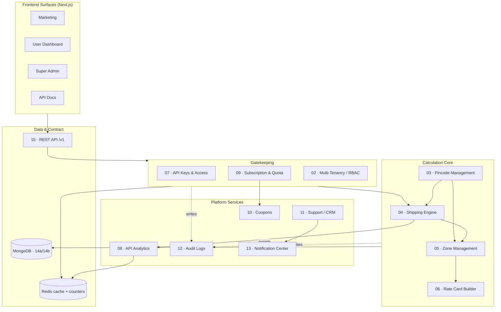

# Postpin Platform Blueprint

> **Postpin** is a production-grade, India-first **Shipping Charges API Platform** — REST API + multi-portal dashboard that returns accurate, rate-card-driven shipping charges. It is logistics infrastructure for developers, eCommerce sites, ERPs and courier-management systems, engineered to compete with Stripe, PostHog and Clerk on dashboard quality, developer experience and extensibility.

This blueprint is the single source of truth for the engineers and product leads building Postpin. Every document is concrete, opinionated and production-ready: tables, mermaid diagrams and JSON schemas over prose, with India-specific, realistic examples (real city pincodes, INR amounts) throughout.

Brand: **Postpin** · gradient violet `#7C3AED` → purple `#9333EA` → fuchsia `#DB2777` · Space Grotesk / Inter / JetBrains Mono · INR (en-IN) · WCAG AA.

---

## How to read this blueprint

- **Start at [Foundations](#foundations)** — read `00-overview` then `01-architecture` to get the whole-system mental model before diving into any module.
- **Build a module?** Jump straight to its document under [Core Modules](#core-modules). Each is self-contained but cross-links to the schemas it touches.
- **Implement schemas or endpoints?** [Data & API](#data--api) is the canonical contract. When code and a module doc disagree, the data-model and REST-reference docs win.
- **Build screens?** [Frontend & UI](#frontend--ui) carries the design system and per-screen specs. Pair `17-design-system` (tokens) with the relevant `18x` spec.
- **Ship and operate?** [Production](#production) covers scale, deploy, observability, DR and the roadmap.
- **Conventions:** the [shipping engine pipeline](#module-map) is the spine — most modules exist to feed or gate it. File numbers are stable; read them as a recommended order, not a hard dependency graph.

---

## Table of Contents

### Foundations

| # | Document | What it covers |
|---|----------|----------------|
| 00 | [Product Overview & Vision](./00-overview.md) | The fragmented/courier-locked problem, what Postpin is, consumer personas & JTBD, value props, the capabilities map, the end-to-end rate-calculation pipeline, positioning vs Stripe/PostHog/Clerk, flat-plus-overage pricing, success metrics and a domain glossary. |
| 01 | [System Architecture](./01-architecture.md) | The four Next.js surfaces, the layered Node.js API pipeline, the MongoDB/Redis/BullMQ/Cron data tier, the request lifecycle for a rate call, modular-monolith service boundaries, environments, tech rationale and config/secrets. |
| 02 | [Multi-Tenancy, RBAC & Security](./02-multi-tenant-security.md) | Tenant isolation, the RBAC permissions matrix, JWT + API-key auth, request-origin security, OWASP API Top 10 mitigations, data protection and GDPR/DPDP compliance. |

### Core Modules

| # | Document | What it covers |
|---|----------|----------------|
| 03 | [Pincode Management (India Post Auto-Sync)](./03-pincode-management.md) | Nightly cron-to-BullMQ sync, full-snapshot diff with content hashing, soft-delete tombstones, versioned rollback, CSV import/export, Super Admin sync settings, dashboard metrics, signed webhooks and scaling for 155k+ rows. |
| 04 | [Shipping Charges Engine](./04-shipping-engine.md) | The 14-step request pipeline, zone resolution, billable-weight and rate-card slab math, the COD/remote/fuel/GST surcharge stack, determinism and rounding, Redis caching for sub-50 ms p99, error taxonomy and worked INR examples. |
| 05 | [Zone Management](./05-zone-management.md) | Admin-configurable zones: data model, layered pincode-to-zone resolution with precedence, the origin × destination zone matrix, effective-dated versioning, drag-and-drop admin UI, bulk import/validation and contracts to rate cards. |
| 06 | [Rate Card Builder & Per-Customer Pricing](./06-rate-card-builder.md) | Versioned per-customer pricing: zone/weight-slab matrices, service multipliers, surcharges, draft/published lifecycle, effective dates, customer > segment > default resolution, inheritance, validation, simulation and bulk I/O. |
| 07 | [API Key & Access Management](./07-api-management.md) | The `apiKeys` schema, secret hashing/verification, key lifecycle, the layered domain/origin/IP/quota access-control engine, key-vs-subscription rate limits, webhooks, validation and error catalogue. |
| 08 | [API Analytics & Usage Intelligence](./08-api-analytics.md) | `apiLogs` capture, Redis live counters vs BullMQ rollups into minute/hour/day buckets, metrics formulas, latency percentiles, Recharts dashboards, MongoDB aggregations, CSV export, retention and quota alerts. |
| 09 | [Subscription & Plan Engine](./09-subscription-engine.md) | Admin-built plans and subscription lifecycle, Redis quota/token-bucket enforcement, proration, overage, dunning, trials, pipeline integration and four INR-priced sample plans plus Enterprise. |
| 10 | [Coupon & Promotion Builder](./10-coupon-builder.md) | The four coupon types, data model, validation pipeline, stacking/conflict rules, discount computation, checkout/plan-change apply-flow, redemption tracking with abuse prevention, errors and admin UI. |
| 11 | [Support System & Lightweight CRM](./11-support-crm.md) | Ticket/reply data model, lifecycle state machine, SLA engine, email threading, CSAT, metrics, REST API and notification-center integration. |
| 12 | [Audit Logging](./12-audit-logs.md) | Immutable, append-only audit logs: record shape, event catalog, write pipeline, before/after diffing, hash-chain tamper-evidence, retention, export and admin query UX. |
| 13 | [Notification Center](./13-notification-center.md) | Multi-channel notifications: triggers, channels, templates, audience/preferences, throttling/dedup, BullMQ fan-out, retries/dead-letter, signed webhook delivery and schemas. |

### Data & API

| # | Document | What it covers |
|---|----------|----------------|
| 14a | [Data Model — Core Collections](./14a-data-model-core.md) | In-depth schema for the ten core identity, RBAC, multi-tenancy, billing and platform-config collections, with fields, indexes, validators, India-specific samples and aggregation pipelines. |
| 14b | [Data Model — Domain Collections](./14b-data-model-domain.md) | Schema for rate cards, shipping rules, zones, pincodes, sync logs, tickets, replies, notifications, audit logs and webhooks — field tables, relationships, indexes, `$jsonSchema` validators and samples. |
| 15 | [REST API Reference (v1)](./15-rest-api-reference.md) | The canonical `/v1` contract: base URL/auth, idempotency, cursor pagination, rate-limit headers, error catalog, versioning/deprecation, and every endpoint (rating, pincodes, keys, usage, subscriptions, coupons, tickets, webhooks, admin). |

### Frontend & UI

| # | Document | What it covers |
|---|----------|----------------|
| 16 | [Next.js Frontend Architecture](./16-frontend-architecture.md) | The four-app monorepo, shared design-system/lib/types packages, per-app folder anatomy, RSC + TanStack Query, JWT session/refresh, RBAC middleware, the full page inventory and performance practices. |
| 17 | [Design System Specification](./17-design-system.md) | Token-first color palette (semantic tokens, violet→fuchsia gradient, status colors) with full light/dark hex tables, typography, spacing/radius/shadow scales, grid, component catalog, Recharts theming, motion, icons, accessibility and Tailwind/CSS-variable implementation. |
| 18a | [UI Screen Specs — Marketing & Auth](./18a-ui-specs-marketing-auth.md) | Per-screen specs for the 11 marketing and auth screens: responsive layouts, component hierarchies, empty/skeleton/error states, dark-mode notes, role visibility and AI image prompts. |
| 18b | [UI Screen Specs — User Dashboard Portal](./18b-ui-specs-user-portal.md) | Build-from specs for all 12 customer-portal screens — route, three breakpoint layouts, component trees, states, dark-mode, RBAC and AI mockup prompts. |
| 18c | [UI Screen Specs — Super Admin Portal](./18c-ui-specs-admin.md) | Per-screen specs for all 19 Super Admin screens (dashboard, users, plans, billing, usage, tickets, coupons, pincode sync, zones, rate cards, API keys, RBAC, audit, notifications, settings) with layouts, states and role permissions. |

### Production

| # | Document | What it covers |
|---|----------|----------------|
| 19 | [Scalability & Performance Plan](./19-scalability.md) | Capacity modeling for millions of requests/day, Redis caching layers with TTLs/invalidation, token-bucket rate limiting, MongoDB indexing/replica/sharding/TTL, stateless scaling, BullMQ partitioning, CDN, pooling, per-stage p99 budgets and load-shedding. |
| 20 | [Deployment Architecture & CI/CD](./20-deployment-cicd.md) | Containerized Fastify API + BullMQ workers, managed Mongo/Redis/object-storage/CDN, dev/staging/prod promotion, Terraform IaC, a lint-to-deploy GitHub Actions pipeline, blue-green/canary releases, expand-migrate-contract migrations and rollback. |
| 21 | [Monitoring, Observability & Performance](./21-observability.md) | The three pillars (Prometheus/OpenTelemetry metrics, structured logs with correlation IDs, distributed tracing), golden signals, per-module SLIs/SLOs, error budgets, Grafana dashboards, alerting/escalation, business metrics and synthetic checks. |
| 22 | [Backup & Disaster Recovery](./22-backup-dr.md) | Per-data-class RPO/RTO targets, MongoDB PITR/snapshot/cross-region backups, Redis rebuild, pincode sync-snapshot rollback, multi-AZ HA, five named failure runbooks, DR testing cadence and retention/business-continuity policy. |
| 23 | [Roadmap, Enterprise & Extensibility](./23-roadmap.md) | MVP launch scope, V2 platform features, the enterprise tier, white-label capability, multi-tenant isolation tiers, feature flags/kill-switches, API versioning, build-vs-buy, a four-phase delivery plan and a risk register. |

---

## Module map

How the modules relate — the **shipping engine** is the spine; gatekeeping, pricing data and platform services flow into it, while every write feeds analytics, audit and notifications.

---

## Tech stack at a glance

| Layer | Choice | Notes |
|-------|--------|-------|
| **Frontend** | Next.js (App Router, TypeScript) | Four surfaces — Marketing, User Dashboard, Super Admin, API Docs — in a monorepo with shared design-system/lib/types packages. |
| **UI / Design** | Tailwind + CSS variables, Recharts, animated Lucide (motion) | Violet→fuchsia brand gradient, light default with dark toggle, radius `0.75rem`, WCAG AA. |
| **Fonts** | Space Grotesk · Inter · JetBrains Mono | Display · body/UI · data/code. |
| **API server** | Node.js (Fastify), REST, `/v1` versioned | Layered pipeline; JWT for portals, hashed API keys for the rating endpoint. |
| **Primary store** | MongoDB | 22 collections; multi-tenant scoping; `$jsonSchema` validators, effective-dated versioning. |
| **Cache / counters / limits** | Redis | Pincode & zone caches, token-bucket rate limiting, quota counters, live analytics. |
| **Background jobs** | BullMQ | Pincode sync, analytics rollups, notification fan-out, SLA timers. |
| **Scheduling** | Cron | Nightly India Post pincode sync at `00:30`. |
| **Auth** | JWT (portals) + API keys (rating) | RBAC roles & permissions; domain/IP/origin restrictions on keys. |
| **External data** | India Post — `api.postalpincode.in`, data.gov.in All-India Pincode Directory | Auto-sync source of truth for pincodes. |
| **Billing** | Flat plan + metered overage | Plans, subscriptions, coupons, proration, dunning. |
| **Currency / locale** | INR, `en-IN` | India-first throughout. |
| **Infra & CI/CD** | Containers · Terraform IaC · GitHub Actions · managed Mongo/Redis/object storage/CDN | Blue-green/canary, expand-migrate-contract migrations. |
| **Observability** | Prometheus + OpenTelemetry · structured logs · tracing · Grafana | Golden signals, per-module SLOs, error budgets. |

---

## Status & changelog

> **Status:** Blueprint complete — 27 documents across 5 sections. Ready for build kickoff.
> **v1.0** · 2026-06-26 · _sunny@kayease.com_ — Initial full blueprint set authored and indexed.
